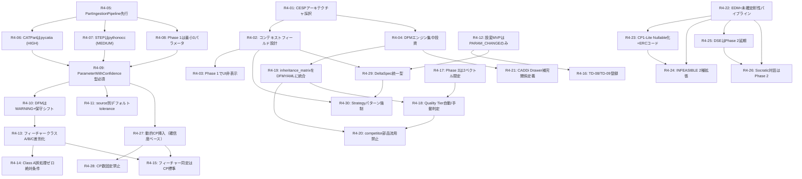
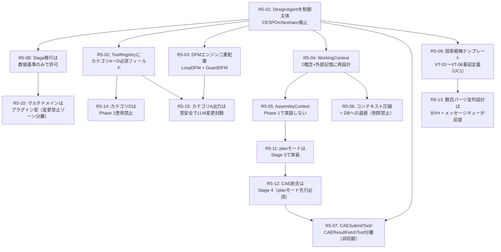

# AutoMetalSheet - 板金設計自動化システム

## プロジェクト概要
板金設計の自動化システム。数学的・材料力学的に正確な板金CADデータの自動生成を目標とする。

## 技術調査状況

### 調査日: 2026-03-20

---

## 1. CATIA V5/V6 CATPart自動生成

### アクセス方法の階層

| レイヤー | 技術 | 難易度 | 板金アクセス |
|----------|------|--------|-------------|
| Automation API (COM) | VBA / Python (pycatia, pywin32) | 低 | 限定的 |
| EKL/Knowledge Expert | CATIA内蔵スクリプト言語 | 中 | 中程度 |
| CAA (C++ API) | ネイティブC++ | 高 | 完全 |

### pycatia (Python → CATIA COM)
- PyPI: `pip install pycatia` (最新: 0.9.5)
- GitHub: https://github.com/evereux/pycatia
- CATIA V5 (Windows必須) とのCOM連携
- Sheet Metal専用モジュールは**未確認**（ドキュメントに明記なし）
- 実績: パラメータ抽出、形状作成、スクリーンショット、STEP変換

### CATIA V5 Automation API の Sheet Metal 対応状況
- **重大な制限**: CATIA V5 Automation API（VBA/COM層）ではSheet Metalの
  Wall、Flange、Bend等のフィーチャーをプログラムから直接生成する
  公開APIは**事実上存在しない**（CAA C++層のみでアクセス可能）
- VBAで可能な操作: パラメータ変更、既存フィーチャーの修正、STEPインポート後の認識

### CAA (C++ Component Application Architecture)
- Dassault Systèmesの最上位API
- Sheet Metal Design モジュールのC++ APIが存在（V6 Aerospace Sheet Metal版あり）
- 開発には専用ライセンス、MSVC環境、膨大な学習コストが必要
- 公式ドキュメント: https://www.3ds.com/support/documentation/resource-library/installation-catia-v5-and-caa-api

### EKL (Enterprise Knowledge Language)
- CATIA V5/3DEXPERIENCEの組み込みスクリプト言語
- パラメータ駆動設計・ルール定義に使用
- Sheet Metal フィーチャーのパラメータ変更は可能
- 複雑なフィーチャー生成は困難

### CATDrawing生成との連携
- VBA/CATScript: DrawingViews コレクションから2Dビュー生成が可能
- DrawingViewGenerativeBehavior オブジェクトで3Dモデルから2Dビュー作成
- pycatia経由でも操作可能

---

## 2. CATProduct (アセンブリ) の自動生成

- VBA/Python で Products コレクションを操作可能
- 部品の追加・配置のプログラム的制御は可能
- pycatia ライブラリで `ProductStructure Object Library` を参照
- Tools → Generate CATPart from Product でCATProductをCATPart化可能

---

## 3. 板金CADツール比較

### Siemens NX (NXOpen API)
**最も充実した板金プログラミングAPI**
- 言語: Python, C#, C++, Java, VB
- 専用名前空間: `NXOpen.Features.SheetMetal`
- 利用可能クラス:
  - `ConvertToSheetmetalBuilder`
  - `TabBuilder`
  - `AeroJoggleBuilder`
  - その他多数の板金フィーチャービルダー
- ドキュメント: docs.plm.automation.siemens.com
- GUIマクロ記録 → コード生成が使える

### SolidWorks (SOLIDWORKS API)
**COM APIで板金フィーチャー生成が可能**
- 言語: VBA, VB.NET, C#
- 主要インターフェース:
  - `IBaseFlangeFeatureData` - ベースフランジ制御
  - `IBendsFeatureData` - ベンドデータ
  - `ISketchedBendFeatureData` - スケッチベンド
- メソッド: `InsertSheetMetal`, `InsertSheetMetalBaseFlange`
- K-Factor、Bend Allowance、Bend Deductionの設定可能
- 2024年版ドキュメントにサンプルコードあり
- GitHub: https://github.com/codestackdev/solidworks-api-examples

### Autodesk Inventor (API)
- `iLogic` (VB.NET) でSheet Metal自動化が最も一般的
- `ISheetMetalFeatures` オブジェクトモデル
- K-Factor設定: `oStyle.UnfoldMethod.kFactor`
- 曲げ半径設定: `oStyle.BendRadius`
- C# サポートあり (COM経由)
- 専用関数: WriteSheetMetalDXF, FlangeWidthsCreation, BendExtentEdges

### FreeCAD SheetMetal Workbench (OSS)
**完全無料・Pythonで直接制御可能**
- GitHub: https://github.com/shaise/FreeCAD_SheetMetal
- 最新バージョン: 0.7.58 (2025年10月)
- 利用可能コマンド (Python):
  ```python
  SheetMetal_AddBase      # ベース壁生成
  SheetMetal_AddWall      # 壁追加 (フランジ)
  SheetMetal_AddFoldWall  # 折り曲げ
  SheetMetal_AddBend      # ベンド追加
  SheetMetal_Unfold       # 展開図生成
  SheetMetal_AddCornerRelief  # コーナーリリーフ
  SheetMetal_Forming      # フォーミング
  ```
- Pythonからのプログラム的生成例:
  ```python
  import FreeCAD
  obj = FreeCAD.ActiveDocument.addObject("Part::FeaturePython", "BaseBend")
  SMBaseBend(obj)
  obj.radius = 2.5
  obj.thickness = 1.5
  ```
- `smBase(thk, length, radius, Side, ...)` 関数で直接生成
- K-factor: Spreadsheetオブジェクトで管理、材料テーブルから自動参照
- 展開計算: `SheetMetalUnfolder.py` (K-factor考慮)
- 展開計算ツール: `tools/calc-unfold.py`

---

## 4. OSS/商用ツール (CATIA不要)

### OpenCASCADE Technology (OCCT)
- C++ ライブラリ (Python: pythonocc-core 7.9.3 - 2026年2月)
- STEP/IGES読み書き
- B-Rep板金モデリング可能 (低レベルAPI)
- 板金特化機能は**商用コンポーネント**
  - Sheet Metal Operations Component (有償SDK)
  - 認識: フランジ、ベンド、ジョグ、穴、カットアウト
  - 展開: K-factor使用のフラットパターン生成
  - 要: OCCT 7.6.1以上
  - ライセンス: 年間/永続ライセンス

### Analysis Situs (OSS + 商用拡張)
- サイト: https://analysissitus.org/
- OpenCASCADE基盤のCAD調査・プロトタイピングSDK
- **板金認識・展開はSMRU商用拡張**
  - 板金認識 (フィーチャー自動検出)
  - フラットパターン生成
  - 曲げシーケンスシミュレーション
- コアはOSS (STEP/IGES/BREPのI/O、形状修復)
- AAG (Abstract Adjacency Graph) アルゴリズム実装

### build123d (Python)
- PyPI: `pip install build123d`
- OpenCASCADE基盤のPythonフレームワーク
- 板金操作は**ロードマップ段階** (bend/hem/flange/tab/relief)
- フラットパターン生成は計画中

### pythonocc-core (Python)
- `pip install pythonocc-core` (conda-forge推奨)
- 汎用B-Repモデリング (板金専用機能なし)
- STEP/IGES/STL/OBJエクスポート可能

---

## 5. 板金工学計算 - 数学的基礎

### ベンドアローワンス (BA)
```
BA = (π/180) × Angle × (R + K × T)
```
- Angle: 曲げ角度 (度)
- R: 内側曲げ半径
- K: K-factor (通常 0.3〜0.5)
- T: 板厚

### K-factor
- 中立軸の位置 = 内面から中立軸までの距離 / 板厚
- **重要: 「角度依存」ではなく「R/t比依存」で実装すること**
  - R/t < 1.0  : K ≈ 0.33
  - R/t = 2.0  : K ≈ 0.38
  - R/t = 3.0  : K ≈ 0.41
  - R/t = 5.0  : K ≈ 0.44
  - R/t ≥ 8.0  : K → 0.50（薄肉近似）
- SPFH590/DP780は同R/tでもK値が軟鋼より小さい（内側に寄る）
- 材料ごとのK-factor Lookup Tableで実装する（一定値では不正確）

### スプリングバック計算
```
Rf / Ri ≈ 1 + (3σy·Ri)/(E·t) − 4(σy·Ri/(E·t))³
```
または近似式:
```
Δθ = K_sb × (θ_initial - 90°)
```
- σy: 降伏強度
- E: ヤング率
- 高強度鋼ほどスプリングバック大
- R/t > 8 で急激にスプリングバック増大
- **精度限界（重要）**:
  - SPCC/SPFH590 まで: 誤差 ±1-2度（実用可）
  - DP780以上: 等方性硬化モデルの誤差 ±3-6度（Bauschinger効果を非考慮）
  - DP780以上は計算結果に「±3度の不確実性帯」を付加して設計者に提示すること
  - Yoshida-Uemori混合硬化モデルは未実装 → Phase 3以降の課題

### 展開計算アルゴリズム
1. B-Repモデルを面隣接グラフ(AAG/FAG)で解析
2. 平面面 (フランジ) と円筒面 (ベンド) を分類
3. K-factorから中立軸半径を計算
4. 円筒ベンドを「変形なし」で展開 (OpenCASCADEの近似補間使用)
5. フランジ面を参照平面上に回転・配置

---

## 6. STEP/IGES経由でのCATPart生成

### ワークフロー
```
B-Rep生成 (OCC/FreeCAD等) → STEP出力 → CATIA Recognize Tool
```
- CATIA: 「Recognize」ツールでSTEP/IGESの板金ソリッドを板金フィーチャーに変換
- ただし完全な変換は保証されない (形状の複雑さに依存)
- STEP AP242: PMI (製品・製造情報) も含めて転送可能
- 自動化: CATIA COMで `FileOpen` + `StartCommand("RecognizeSheetMetal")` 相当

### CATIA → 他ツール
- STEPエクスポート: ST1ライセンス必要
- AP203/AP214/AP242 対応
- DXF/DWG: 展開図エクスポートに使用

---

## 推奨アーキテクチャ案

### 案A: FreeCAD + Python (フルOSS)
- 完全無料・ライセンス問題なし
- Python APIで板金フィーチャー生成
- STEP/DXF出力でCATIAへ連携
- 課題: CATIA特有フィーチャーの再現が困難

### 案B: SolidWorks API (COM + C#/Python)
- 成熟したAPIで板金フィーチャー生成実績あり
- K-Factor/BendAllowance設定可能
- ライセンス: SolidWorks本体が必要

### 案C: Siemens NX Open (Python/C#)
- 最も完全な板金APIを保有
- NXライセンスが必要
- マクロ記録機能でコード生成補助

### 案D: CATIA CAA C++ (ネイティブ)
- 最高のCATIA互換性
- 開発コスト最大
- 商用案件向け

### 案E: OpenCASCADE + pythonocc (B-Repレベル)
- 中立的なカーネルで形状生成
- 板金専用APIは自作または商用SDK購入
- CATIA/NX/SolidWorksいずれにも連携可能

---

---

## 7. 決定論的エンジン 設計判断メモ（2026-03-20 分析）

### K-factor実装方針
- `一定値` ではなく `R/t比依存ルックアップテーブル` で実装する（材料ごと）
- データソース: JIS G 3141（SPCC）、JIS G 3134（SPFH）、JFEスチール技術資料

### DFMルール管理
- ルール自体をデータ（YAML）として管理。コードにハードコードしない
- 優先順位: OEM固有要件 > 社内標準 > JIS/公的規格 > 材料メーカー推奨 > 業界標準
- ルール変更はGit PR + 設計責任者レビューで管理。CHANGELOG.md必須
- ルールIDを付与（例: DFM-BEND-001）して追跡可能にする

### 包絡面計算
- 静的干渉: pythonocc `BRepAlgoAPI_Section` + Shapely `unary_union`
- 動的スイープ包絡面: 高コスト（各姿勢のB-Rep Boolean Union）→ 事前計算キャッシュで対応
- `steps=18`（5度刻み）でBooleanUnion x18回 → 数十秒〜数分（複雑形状）

### スプリングバック
- SPCC/SPFH590: Wagonerモデルで実用精度（誤差±1-2度）
- DP780以上: 誤差±3-6度。計算結果に `uncertainty_deg` と `warning` を付加して設計者提示

---

## 8. 慣例形状学習システム 設計判断メモ（2026-03-20 分析）

### CATPartからの慣例抽出
- pycatia でフィーチャーツリーからパラメータ統計を自動抽出
- 抽出すべき統計: フランジ高さ/板厚 比率の分布（mean/stdev/P10/P90）
- フィーチャー出現頻度（RoundRelief vs SquareRelief 等）
- 頻出フィーチャーシーケンス（PrefixSpanアルゴリズム、min_support=0.3）

### ベクトルDB
- 推奨: **pgvector（PostgreSQL拡張）**
  - 理由: 数値パラメータのフィルタリング + ベクトル検索のハイブリッドが得意
  - 社内サーバー管理に向く（Qdrant/Pineconeより低コスト）
- 埋め込み: テキスト部分（テキスト埋め込みモデル）+ 数値特徴量（正規化して重みづけ連結）

### ファインチューニングの判断基準
- RAGで対応可能: 慣例の参照・統計値の提供・類似設計の検索
- FTが必要な場合:
  - 自然言語 → CadQueryコード生成スタイルの学習
  - 社内設計用語（"メクラ穴", "ヌスミ加工"）の解釈
  - CATPartフィーチャーツリー構造の推論
- 最低データ量: 200件（限定的）/ 実用: 500件 / 理想: 2000件以上
- 訓練データ生成: CATPartパラメータ抽出 → CadQueryコード自動生成 → 要件の逆生成（LLM）

### ハード制約とソフト制約の衝突解決
- 衝突タイプ:
  1. 慣例 < DFM最小値 → DFMハード制約が必ず勝つ
  2. 慣例 ≠ OEM要件 → OEM要件（契約要件）が勝つ（DFM満足を確認してから）
  3. 部門間の慣例衝突 → ユーザーへ確認（自動解決しない）
- 衝突時は説明文を必ず生成: 「社内慣例では●●だが、DFM制約により○○に変更」
- 慣例DBはコンテキスト付き管理（部門 × 製品ライン × OEM）

### 慣例DBの更新ガイドライン
- Tier 1（自動）: 新規CATPartが追加されるたびに統計自動更新
- Tier 2（主任レビュー）: 標準値変更 → Git PR + 主任設計者承認
- Tier 3（製造部門承認必須）: DFMルール変更・仕入れ先制約変更

---

## 9. 実装フェーズ優先順位（Round 3 Final 確定版）

### Round 2で確定した12項目のアーキテクチャ修正
1. MVP: CP1-Lite + CP2 の閉ループ（半構造化フォーム + 矛盾チェック含む）
2. 精度指標: 「完成品一致率」→「CP込み工数削減率30%+」「DFM違反率<5%」
3. LLM: 3層ハイブリッド（Qwen-2.5-72B INT8/AWS Bedrock/Public Cloud）
4. EnvelopeChecker: マージン0.2mm→材料依存テーブル（SPCC:0.5mm/SPFH590:1.0mm/DP780:2.0mm）
5. INFEASIBLE早期検出の追加
6. Structured Generation（Outlines）の採用
7. テンプレート6種→10種（hat_asymmetric/omega/multi_bend/Z_with_lip追加）
8. K-factor: n値/r値補正係数追加 + 量産/試作モード分離
9. スプリングバック境界: 強度値→組織タイプ分類（フェライト/マルテンサイト/DP）
10. OEM YAML: 階層差分構造 + 信頼度スコア + バージョン管理
11. Phase 1でDP780のDFMチェックのみ先行実装
12. データ戦略: CATPartスケッチ逆変換廃止→合成+パラメータ抽出

### フェーズ優先実装順

| Phase | コンポーネント | 難易度 | ROI | 週単位目安 |
|-------|--------------|--------|-----|----------|
| **Phase 1** | 材料DB（SPCC/SPFH590 + K-factor n値/r値補正）| 低 | 高 | W1 |
| **Phase 1** | DFMルールエンジン（YAML管理 + DP780 DFMのみ先行）| 中 | 最高 | W2 |
| **Phase 1** | INFEASIBLE早期検出 | 低 | 高 | W3 |
| **Phase 1** | 包絡面チェック（材料依存マージンテーブル）| 中 | 高 | W4 |
| **Phase 1** | 3層LLMハイブリッド基盤 + Outlines | 中 | 高 | W5〜W6 |
| **Phase 1** | テンプレート10種 + OEM YAML階層差分 | 中 | 高 | W7〜W8 |
| **Phase 1** | FreeCADヘッドレスパイプライン | 中 | 高 | W9〜W10 |
| **Phase 1** | 半構造化フォームUI + CP1-Lite + CP2 | 中 | 最高 | W11〜W12 |
| **Phase 1** | 統合・ベンチマーク・パイロット | — | — | W13〜W24 |
| **Phase 2** | Step 2a 幾何学サポートUI（ヒートマップ）| 高 | 高 | M7〜M9 |
| **Phase 2** | pgvector + 慣例抽出パイプライン（合成データ）| 中 | 高 | M10〜M12 |
| **Phase 2** | LoRA FT（500件トリガー）| 高 | 中 | M13〜M15 |
| **Phase 2** | OEM別DFMルール展開（1社ずつ）| 中 | 高 | M16〜M18 |
| **Phase 3** | CAA C++連携 または SWx APIピボット | 非常に高 | 中 | — |
| **Phase 3** | 包絡面計算（動的スイープ）| 非常に高 | 中 | — |
| **Phase 3** | DP780以上 Yoshida-Uemori精密SB | 非常に高 | 低 | — |

### Phase 1 Go/No-Go 判定基準（6ヶ月時点）

| 指標 | Go | Conditional | No-Go |
|------|-----|-------------|-------|
| CP込み工数削減率 | ≥30% | 20〜30% | <20% |
| DFM違反率（出力物）| <5% | 5〜10% | ≥10% |
| 断面生成収束率（N=5）| ≥70% | 55〜70% | <55% |
| BA/BD精度 | ±0.05mm | ±0.1mm | 超過 |
| INFEASIBLE誤検出率 | <3% | 3〜8% | ≥8% |
| 社内ユーザー継続利用意向 | ≥70% | 50〜70% | <50% |

### ROI サマリー

| 項目 | 値 |
|------|-----|
| Phase 1 開発費 | ¥37,600,000 |
| Phase 1+2 合計 | ¥91,400,000 |
| 顧客1社の年間価値 | ¥11,500,000 |
| 外販推奨価格 | ¥3,000,000/社/年 |
| 損益分岐点 | Phase 2 Month 10頃（基本シナリオ: 2社導入）|

### 意図的技術的負債（Phase 1残存・返済計画付き）

| 負債ID | 内容 | 返済Phase | 事業リスク化閾値 |
|--------|------|---------|----------------|
| TD-01 | CATIAフィーチャーツリー喪失 | Phase 3 | Recognize不可案件3件以上 |
| TD-03 | Step 2a完全手動 | Phase 3 | 断面指定工数が全体50%超 |
| TD-04 | DP780 等方性モデル限定 | 将来 | DP780ミス3件以上（即時停止） |
| TD-06 | SQLite（pgvectorなし）| Phase 2前半 | 検索3秒超 or 件数200件超 |
| TD-07 | 動的スイープ包絡面未実装 | Phase 3 | 動的干渉リコール発生（即時停止）|
| TD-08 | CATIA V5専用（V6非対応）| Phase 2〜3 | V6顧客案件2件以上発生（即時対応検討）|
| TD-09 | 設変連鎖変更未対応（PARAM_CHANGE単独のみ）| Phase 2 | 連鎖変更エラーが月3件以上（前倒し対応）|

---

## 10. 設変・流用・探索的設計対応 確定設計判断（Round 4）

### 記録日: 2026-03-23

---

### 確定設計判断テーブル

| 判断ID | カテゴリ | 判断内容 | 根拠 | Phase | 影響コンポーネント | 取り消し条件 |
|--------|---------|---------|------|-------|-----------------|------------|
| R4-01 | アーキテクチャ | CESPアーキテクチャを採択し、モードセレクター方式を棄却する。設変・流用・探索的設計は別モードではなく、単一パイプライン上のコンテキスト差異として扱う。 | モードごとにパイプラインを分岐させると保守コストが指数的に増加し、DFMエンジンの共通化が阻害されるため。 | Phase 1 | RequestRouter, PipelineOrchestrator | 3種以上のコンテキストで同一パイプライン上の処理分岐が20箇所超になった場合 |
| R4-02 | アーキテクチャ | 設変・流用・探索的の各コンテキストは「モード」ではなく「コンテキストフィールド」（context_type / source_part_id / delta_spec 等）として入力構造体に付与する。パイプライン内部の制御フローはStrategyパターンで分岐する。 | モード切り替えUIはユーザーの思考を固定化し、実務でのコンテキスト混在（設変+流用同時）に対応できないため。 | Phase 1 | InputSpec, StrategySelector | 「コンテキストフィールドの組み合わせ数」が実装可能なStrategyの上限（目安:12）を超えた場合 |
| R4-03 | アーキテクチャ | Phase 1ではコンテキストフィールドをUI上に非表示とし、内部処理のみで使用する。Go/No-Go指標の純度を確保するため、評価期間中は新規フィーチャーの影響をベースラインに混入させない。 | Phase 1のGo/No-Go判定（工数削減率30%等）はCP1-Lite+CP2の閉ループ単体性能を測定するものであり、コンテキスト対応の影響を混在させると判定基準が曖昧になるため。 | Phase 1 → Phase 2でUI公開 | FormUI, Go/No-Go評価基盤 | Go/No-Go評価が完了し、Phase 2移行が承認された時点で取り消し（UI公開） |
| R4-04 | アーキテクチャ | DFMエンジン特化を唯一の防衛可能な競合優位と位置づけ、開発リソースを優先集中する。CESPの他コンポーネントはDFMエンジンを補完する役割に限定する。 | CADDi Drawer等の既存ツールが検索・類似照合で優位を持つ中、DFM違反ゼロ保証という品質軸での差別化のみが参入障壁を形成できるため。 | 全Phase共通方針 | DFMRuleEngine, YAML管理体制 | 競合製品がDFM違反ゼロ保証を同等水準で実装し、価格競争に移行した場合 |
| R4-05 | PartIngestionPipeline | 設変・流用・探索的の3コンテキストに共通する「既存部品読み込みパイプライン（PartIngestionPipeline）」をPhase 1で先行実装する。これがなければ設変・流用コンテキストは動作不能であるため、必須先行実装とする。 | 3コンテキストすべてが既存部品の読み込みを前提とするため、共通基盤の先行実装なしには後続開発が並列化できないため。 | Phase 1 (W3〜W4) | PartIngestionPipeline, CATPartReader, STEPReader | 設変・流用コンテキストをPhase 2以降に全面延期する経営判断が下された場合 |
| R4-06 | PartIngestionPipeline | CATPartの読み込みにはpycatiaを使用し、設計者が明示的に入力したパラメータのみを抽出する（確信度HIGH）。フィーチャーツリーから暗黙的に逆算されるパラメータは使用しない。 | pycatia COM層で取得できる値はユーザー入力パラメータに限られ、ソリッド形状の幾何逆算は不確実性が高くDFM判定のインプットとして不適切なため。 | Phase 1 | CATPartReader, ParameterWithConfidence | CATIA CAA C++連携（Phase 3）が実装された時点で上限を拡大する |
| R4-07 | PartIngestionPipeline | STEPファイルの読み込みにはpythonocc BRep解析を使用し、パラメータを幾何形状から逆算する（確信度MEDIUM、tolerance ±0.1mm）。CATPartより確信度が低いことをシステムが明示する。 | STEPはフィーチャーツリー情報を持たないB-Rep形式であり、パラメータの幾何逆算は原理的に誤差を伴うため、確信度を下げた扱いが誠実かつ安全なため。 | Phase 1 | STEPReader, ParameterWithConfidence | pythonocc以外の高精度逆算ライブラリ（例: Analysis Situs SMRU）が評価により採用された場合 |
| R4-08 | PartIngestionPipeline | Phase 1のPartIngestionPipelineが抽出するパラメータは「フランジ高さ・曲げR・板厚」の最小限3パラメータに絞る。穴位置・コーナーリリーフ形状等の追加パラメータはPhase 2以降に拡張する。 | MVP段階で抽出対象を広げすぎると、確信度管理の複雑度が急増し、Phase 1のスケジュールリスクが高まるため。 | Phase 1 (最小限) → Phase 2 (拡張) | CATPartReader, STEPReader | パイロット顧客から最低3パラメータ以外の要求が明示的に挙がり、かつGo/No-Go判定に影響することが確認された場合 |
| R4-09 | ParameterWithConfidence型 | システム内を流通する全パラメータに `ParameterWithConfidence` 型を適用し、value / confidence / source / tolerance / requires_cp_confirmation の5フィールドを必須とする。naked floatでのパラメータ受け渡しを禁止する。 | 信頼度の異なるパラメータが同一型で流通すると、DFMエンジンが誤ったハード判定を下すリスクがあり、型レベルで信頼度を強制する設計が安全性の根拠となるため。 | Phase 1 | 全コンポーネント（型定義として横断的に影響） | 型の複雑度がLLMの構造化生成（Outlines）と相性が悪く、生成精度の低下が実測された場合 |
| R4-10 | ParameterWithConfidence型 | DFMエンジンは confidence < 0.75 のパラメータに対してエラーを発生させず、WARNING + tolerance分の保守値シフトを行う。保守値シフトの方向は「DFM違反リスクが減少する方向」とする。 | 確信度が低いパラメータでエラー停止するとパイプラインが使用不能になる頻度が高くなり、実務運用の支障になるため。WARNINGで継続しつつ安全側に倒す設計が実用と安全のバランスをとるため。 | Phase 1 | DFMRuleEngine | 保守値シフトにより設計者の意図から乖離した出力が頻発し（月3件以上の苦情）、シフト無効化の要望が出た場合 |
| R4-11 | ParameterWithConfidence型 | sourceフィールドごとにデフォルトtoleranceを設定する。初期値: `catpart_explicit: 0.0mm`（設計者明示）、`step_extracted: 0.15mm`（幾何逆算）、`llm_inferred: 0.30mm`（LLM推定）。数値はパイロット後に実測値で補正する。 | sourceが異なれば誤差の性質が根本的に異なるため、一律toleranceは過保守または過楽観になる。source別デフォルト設定が最小限の複雑度で最大限の精度をもたらすため。 | Phase 1 (初期値) → パイロット後補正 | ParameterWithConfidence, PartIngestionPipeline | パイロットデータから実測toleranceが初期値と2倍以上乖離した場合（即時補正） |
| R4-12 | 設変コンテキスト | Phase 1の設変MVPはパラメータ変更型（PARAM_CHANGE）のみに限定する。フィーチャー追加・削除・トポロジー変更を伴う設変はPhase 2以降とする。 | フィーチャートポロジー変更はCAA C++なしにはCATPartへの書き戻しが困難であり（TD-01）、Phase 1の技術スタック（pycatia/FreeCAD）で対応できる範囲をPARAM_CHANGEに限定することでリスクを制御するため。 | Phase 1 (PARAM_CHANGEのみ) → Phase 3 (トポロジー変更) | ECNDeltaSpec, PartIngestionPipeline | PARAM_CHANGE限定ではパイロット顧客の主要ユースケースをカバーできないことが判明した場合 |
| R4-13 | 設変コンテキスト | フィーチャーをClass A（安全関連）/ Class B（取付関連）/ Class C（外観・その他）に分類し、クラスごとに確信度閾値・CP介入閾値を差別化する。Class A: confidence必須 ≥ 0.90 / Class B: ≥ 0.75 / Class C: ≥ 0.60。 | 安全関連フィーチャーの誤処理は製品リコールに直結するため、クラス別に閾値を設けることが品質管理の原則に合致するため。 | Phase 1 | FeatureClassifier, DFMRuleEngine, CPManager | Class A閾値0.90でのFalse Negative（見逃し）が実測で0件超になった場合（即時引き上げ） |
| R4-14 | 設変コンテキスト | Class Aフィーチャーへの誤処理件数ゼロを絶対条件（Non-Negotiable Constraint）とする。この条件を満たせない場合はシステムを停止する。Go/No-Go指標とは独立した強制停止条件として管理する。 | 安全関連部品の誤生成は製品リコール・人身事故のリスクを持ち、事業継続の根幹を損なうため、他の指標とのトレードオフを一切認めない。 | 全Phase | FeatureClassifier, AlertManager, Go/No-Go評価基盤 | 取り消し不可（絶対制約） |
| R4-15 | 設変コンテキスト | フィーチャー同定はCP（Confirmation Point）機構での人間確認を標準フローとし、例外ではなく設計として位置づける。自動同定結果を設計者が確認・修正してから後続処理が進む。 | Class A/Bフィーチャーの誤同定リスクを、システムの自動化率よりも人間確認の保険コストで吸収する設計判断。Phase 1の技術成熟度では自動同定の信頼性が十分でないため。 | Phase 1 | CPManager, FeatureClassifier | 自動同定の精度が6ヶ月間の実測でClass A ≥ 99.5%、Class B ≥ 98%を達成した場合（CP省略検討可） |
| R4-16 | 設変コンテキスト | 新規技術的負債として TD-08（CATIA V5専用、V6非対応）と TD-09（設変連鎖変更未対応）を登録する。TD-08はV6顧客案件が2件以上発生した時点で即時対応を検討し、TD-09はPARAM_CHANGE複数箇所の相互依存エラーが月3件以上発生した時点で対応を前倒しする。 | 既知の限界を明示的に技術的負債として登録することで、見えないリスクを管理可能なリスクに変換するため。 | Phase 1登録 → 閾値到達時に対応 | TD管理台帳, CATPartReader | — |
| R4-17 | 流用設計コンテキスト | Phase 2 MVPのベクトル検索は形状128次元 + テキスト768次元の2ベクトルに限定する。機能インターフェースベクトル（64次元）の追加は手動タグ付きデータが100件蓄積した後とする。 | データが不足した状態で高次元ベクトルを追加すると、検索精度が向上せずインデックス維持コストのみが増加するため。100件の閾値は埋め込み空間の最低限の密度を確保するための経験則。 | Phase 2 (2ベクトル) → 100件後に3ベクトル化 | pgvector, PartEmbeddingPipeline | 手動タグ付けコストが想定を超え、100件達成に6ヶ月以上かかることが確定した場合（追加延期） |
| R4-18 | 流用設計コンテキスト | 流用部品のQuality Tier 1〜2は自動判定（DFM違反率・設計パラメータ完全性スコアによる）、Tier 3以上は設計者による手動フラグ付けを必須とする。 | Tier 3以上は「OEM承認済み実績品」等の定性的条件を含み、自動判定の誤分類リスクが高い。手動フラグを必須にすることで誤流用のリスクを抑制するため。 | Phase 2 | QualityTierClassifier, pgvector | 手動フラグ付け工数がパイロット評価でユーザー継続利用意向を下げている（<70%）と判明した場合 |
| R4-19 | 流用設計コンテキスト | inheritance_matrixはDFMルールYAMLに統合し、二重管理を禁止する。流用可否判定のルールは常にDFMルールYAMLが単一ソース・オブ・トゥルースとなる。 | 継承マトリクスを独立ファイルで管理すると、DFMルール変更時の同期漏れによる流用可否の矛盾が発生し、設計事故の原因になるため。 | Phase 2 | DFMRuleEngine, OEM YAML | DFMルールYAMLの肥大化（行数5000超）によりパース速度が問題化した場合（分割を検討） |
| R4-20 | 流用設計コンテキスト | source_type='competitor'（競合他社部品）の流用を禁止する（RR-08対応）。競合部品がDBに混入した場合のアラートと自動除外ロジックを実装する。 | 競合他社のCADデータを自社製品に流用することは知的財産権侵害のリスクを持ち、事業継続の法的リスクとなるため。 | Phase 2 | PartIngestionPipeline, pgvector, QualityTierClassifier | 取り消し不可（法的リスク管理） |
| R4-21 | 流用設計コンテキスト | CADDi Drawerとは競合ではなく補完関係として定義し、将来的な連携APIの設計上の余地を残す。現時点では競合分析ではなく差別化軸の明確化に注力する。 | CADDi Drawerは検索・類似照合に特化し、DFMチェック・自動生成機能を持たない。機能的な棲み分けが明確であり、将来の顧客データ連携の可能性を閉じないため。 | 方針（全Phase） | プロダクト戦略, API設計方針 | CADDi DrawerがDFM自動チェック機能を本格展開した場合（競合再評価） |
| R4-22 | 探索的設計コンテキスト | EDM（Exploratory Design Module）のMVPを「Socratic対話エンジン」ではなく「未確定耐性パイプライン（Uncertainty-Tolerant Pipeline）」として再定義する。不完全な仕様でもDFMチェックを実行できることを最優先機能とする。 | Socratic対話エンジンはLLMの対話品質に依存し、Phase 1の技術成熟度では品質保証が困難。未確定耐性パイプラインは確定パイプラインの延長実装であり、開発コストが低くMVP価値が高いため。 | Phase 1（未確定耐性）→ Phase 2（Socratic対話） | EDM, CP1-Lite, INFEASIBLEChecker | 未確定耐性パイプラインのみでは探索的設計ユースケースの主要ニーズをカバーできないことがパイロットで判明した場合 |
| R4-23 | 探索的設計コンテキスト | CP1-LiteのすべてのInputフィールドをNullable化し、未入力フィールドに対応するERCコード（ERC-001〜006）を定義する。ERCコードはDFMチェック時のスキップ条件・保守値適用条件を制御する。 | 探索的設計では仕様が確定していないフィールドが存在することが前提であり、必須フィールドエラーでパイプラインが停止することは探索的設計ユースケースを根本的に破壊するため。 | Phase 1 | CP1-Lite InputSpec, DFMRuleEngine, ERCCodeManager | ERCコードの分岐数が増えすぎ（12超）、DFMルール条件との組み合わせ管理が破綻した場合 |
| R4-24 | 探索的設計コンテキスト | INFEASIBLE検出を `FEASIBLE_IN_RANGE`（一部パラメータ条件下で実現可能）/ `INFEASIBLE_IN_ALL_CASES`（全条件下で不可能）の2種に拡張する。従来の単一INFEASIBLE出力を廃止する。 | 単一のINFEASIBLE出力は探索的設計において「どうすれば実現可能か」の情報を設計者に提供できない。2種への拡張により、設計者に修正方向性を示す可能性が生まれるため。 | Phase 1 | INFEASIBLEChecker, DFMRuleEngine | FEASIBLE_IN_RANGEの計算コストが1リクエストあたり2秒超となり、レスポンス性能に問題が出た場合 |
| R4-25 | 探索的設計コンテキスト | Design Space Exploration（DSE）はPhase 2以降に延期し、Phase 1ではFreeCADフル生成なし・パラメータ推定のみの軽量実装にとどめる。 | Phase 1でFreeCADフル生成を探索的設計ループに組み込むと、1探索ステップあたりの計算コストが過大になりUXが破綻するため。パラメータ空間での推定のみで探索価値を提供できることを先に検証する。 | Phase 1 (推定のみ) → Phase 2 (DSE) | EDM, FreeCADPipeline | パラメータ推定のみではGo/No-Go指標の断面生成収束率が55%未満に留まることが判明した場合（即時対応） |
| R4-26 | 探索的設計コンテキスト | Socratic対話エンジンはPhase 2以降に実装し、Phase 1ではLLMは質問テンプレートの言語化のみを担当する。対話フローの制御ロジックはルールベースで実装する。 | LLM主導の対話フロー制御はプロンプト変化による挙動の不安定性が高く、Phase 1のGo/No-Go評価期間中に変数として加えることがリスクになるため。 | Phase 1 (テンプレート言語化のみ) → Phase 2 (Socratic) | EDM, LLMHybridLayer, CPManager | — |
| R4-27 | CPマネジメント | CPの挿入を確信度スコアに基づく動的判定とする。全パラメータの confidence ≥ 0.75 → CP省略 / 1〜3件が confidence < 0.75 → 軽量CP（フォーム確認のみ）/ 4件以上が confidence < 0.75 → 通常CP（説明付き確認）。閾値はパイロット後に実測値で補正する。 | CP数を固定すると、高品質インプット時の設計者負担増（不要な確認）と低品質インプット時のリスク見逃しが同時に発生するため。確信度スコアベースの動的挿入が両問題を解決するため。 | Phase 1 | CPManager, ParameterWithConfidence, PipelineOrchestrator | 動的CP省略によるDFM違反率が5%超になった場合（閾値引き上げ・動的省略無効化） |
| R4-28 | CPマネジメント | CPの数を設計で固定しない。「設変コンテキストにCP1.5を追加する」等の固定増設案を棄却し、コンテキスト種別によるCP数の固定化を禁止する。CP数はR4-27の動的ルールのみで決定する。 | コンテキスト別にCP数を固定すると、コンテキスト判定ロジックとCP挿入ロジックが結合し、将来のコンテキスト追加時に変更箇所が多重化するため。 | Phase 1 | CPManager | — |
| R4-29 | 共通技術 | ECNDelta（設変差分）とReuseDiff（流用差分）を統一した `DeltaSpec` 型として設計する。コンテキスト種別によらず差分情報を単一の型で表現し、DFMエンジンへの入力インターフェースを統一する。 | ECNDeltaとReuseDiffを別型で管理すると、DFMエンジンが両型を受け入れる分岐ロジックを持つ必要があり、DFMエンジンの内部複雑度が不必要に高まるため。 | Phase 1 | DeltaSpec, DFMRuleEngine, ECNProcessor, ReuseProcessor | DeltaSpecの統一によりECN固有情報（承認番号・ECN日付等）の格納が困難になった場合（サブタイプ分割を検討） |
| R4-30 | 共通技術 | source_type による処理分岐はStrategyパターンで実装し、if/elif チェーンを禁止する。各source_typeに対応するStrategyクラスを独立させ、新規source_type追加時はStrategyの追加のみで対応できる設計とする。 | if/elif チェーンはsource_type追加時に既存コードの変更が必要になりOCPに違反する。StrategyパターンはOCP（開放閉鎖原則）を満たし、テスト容易性も高いため。 | Phase 1 | StrategySelector, PartIngestionPipeline, PipelineOrchestrator | — |

---

### 判断間の依存関係グラフ



---

### Round 4議論で未解決のまま残っている論点（Round 5以降の検討事項）

| 論点ID | 論点内容 | 優先度 | 推奨検討タイミング |
|--------|---------|--------|-----------------|
| OI-01 | `llm_inferred` ソースのデフォルトtolerance（R4-11でTBDのまま）。LLM出力の誤差特性を実測するためにはパイロットデータが必要。 | 高 | Phase 1パイロット後（Month 4〜6） |
| OI-02 | FEASIBLE_IN_RANGEの計算アルゴリズム具体化（R4-24）。「どのパラメータをどの範囲で変えれば実現可能か」を効率よく計算する手法が未定。 | 高 | Phase 1 W3〜W4（INFEASIBLE早期検出実装時） |
| OI-03 | 設変連鎖変更（TD-09）の対応方針詳細。複数フィーチャー間の依存グラフ構造とPARAM_CHANGE伝播ルールが未設計。 | 中 | Phase 2開始前 |
| OI-04 | DeltaSpec統一型の具体的スキーマ設計（R4-29）。ECN固有フィールド（承認番号・有効日等）とReuseReasonフィールドの共存方法が未確定。 | 高 | Phase 1 W3〜W4（PartIngestionPipeline実装時） |
| OI-05 | FeatureClassifier（Class A/B/C分類）の初期ルールセット。何をClass Aとするかの定義が製品ドメインに依存しており、パイロット顧客との合意が必要。 | 最高 | Phase 1 W2（DFMルールエンジン実装時）、パイロット顧客確定後 |
| OI-06 | 機能インターフェースベクトル（64次元、R4-17）の具体的な特徴量定義。手動タグ付けの設計者負担コストの推定も未実施。 | 低 | Phase 2中盤（M10〜M12） |
| OI-07 | Socratic対話エンジン（R4-26, Phase 2）の対話フロー設計。質問テンプレートの種類・数・優先順位が未定。 | 低 | Phase 2開始前 |
| OI-08 | ERC-001〜006の具体的定義（R4-23）。各ERCコードが対応するフィールド・スキップ条件・保守値の割り当てが未設計。 | 高 | Phase 1 W11〜W12（CP1-Lite実装時） |
| OI-09 | ToolRegistryの具体的スキーマ設計（R5-02）。category / domain_tags / phase_availability / output_type_locked の全フィールドの型定義と必須化の実装方法が未確定。 | 高 | Stage 1実装時（Phase 1完了後）|
| OI-10 | WorkingContextのシリアライズ形式（JSON vs Protocol Buffers）。JSONはPydantic V2で自然だが、数百パーツ規模でのシリアライズ速度がStage 3以降のボトルネックになる可能性がある。 | 中 | Stage 2実装時（SessionDB設計時）|
| OI-11 | CAEソルバー選定（Nastran vs Abaqus vs LS-DYNA vs OpenFOAM vs CalculiX）。板金シェル要素解析と非線形材料モデル（DP780）への対応可否、OSS vs 商用コストの評価が必要。 | 高 | Stage 3実装前（Phase 2後半）|
| OI-12 | BVH実装ライブラリ選定（pythonocc組み込み vs scipy.spatial.cKDTree vs 独自実装）。pythonocc組み込みは依存追加なしだがAPIが低水準。200部品規模での実測が必要。 | 高 | Stage 3実装時（BVH干渉検出ツール実装時）|

---

### AGENTS.mdへの追記が必要なセクション一覧

| セクション | 追記内容 | 優先度 |
|-----------|---------|--------|
| 本セクション（10番）| 本Round 4確定設計判断テーブル（今回追記済み） | 完了 |
| セクション9（意図的技術的負債テーブル）| TD-08（CATIA V5専用・V6非対応）、TD-09（設変連鎖変更未対応）の追加 | 高 |
| 新規セクション11 | PartIngestionPipeline 設計仕様（R4-05〜R4-08の実装詳細）| 中 |
| 新規セクション12 | ParameterWithConfidence型 スキーマ定義（R4-09〜R4-11）| 高 |
| 新規セクション13 | DeltaSpec統一型 スキーマ定義（R4-29）| 高 |
| 新規セクション14 | ERCコード定義テーブル（OI-08解決後に追記）| 高（Phase 1 W11〜W12後） |
| 新規セクション15 | FeatureClassifier Class A/B/C 定義（OI-05解決後に追記）| 最高（パイロット顧客確定後） |

---

## 11. Round 3 CESP最終設計 確定判断（2026-03-23）

> 詳細設計: 板金設計自動化_Round3_CESP最終設計.md
> 前提: C-01〜C-05（Round 2核心的結論）全採択済み

### 確定設計判断テーブル（R3-EC-01〜R3-EC-15）

| 判断ID | 内容 | Phase |
|--------|------|-------|
| **R3-EC-01** | `CESPInput.mode_hint` は `Literal` 型5値（auto/new_design/ec/reuse/exploratory）。UI非表示はW11〜W24。 | Phase 1 |
| **R3-EC-02** | `mode_hint="auto"` の推定ロジックは優先順位付き決定木。LLMに委ねない。 | Phase 1 |
| **R3-EC-03** | `ParameterWithConfidence.source` に `"reference_inherited"` を追加。流用設計で参照元の値を継承する際に記録する。 | Phase 1 |
| **R3-EC-04** | `CESPInput` の全フィールドは `Optional` かつ `None` 許容。バリデーションはPydantic V2 `@model_validator(mode='after')` で実施。 | Phase 1 |
| **R3-EC-05** | `PartIngestionPipeline.ingest()` の出力型を `ParameterWithConfidence` ベースの `PartParameters` に統一。Round 2の `ExtractedParameter` 型は廃止。 | Phase 1 |
| **R3-EC-06** | `DeltaSpec` 生成責務を `DeltaGenerator` クラスに分離。`CESPOrchestrator` は `delta_description` を `DeltaGenerator` に渡すだけ。 | Phase 1 |
| **R3-EC-07** | 動的CP挿入の判断閾値は `config.yaml` で管理（ハードコード禁止）。デフォルト: skip_threshold=0.75, light_cp_max=3, full_cp_min=4。 | Phase 1 |
| **R3-EC-08** | `CESPOrchestrator._enrich_with_context()` はイミュータブルな `EnrichedInput` 型を返す。元の `CESPInput` を上書きしない。 | Phase 1 |
| **R3-EC-09** | `PartIngestionPipeline` Phase 1実装範囲: 板厚・曲げR・フランジ高さの最小3パラメータ。その他は `confidence=0.0` のプレースホルダー出力（欠損ではなく「未実装」扱い）。 | Phase 1 |
| **R3-EC-10** | `ParameterWithConfidence.erc_code` は探索的設計専用。設変・流用では常に `None`。オーケストレーターがバリデーション。 | Phase 1 |
| **R3-EC-11** | `override_history` の各 `OverrideRecord` は設計根拠ドキュメントジェネレーターが自動参照。フォーマット: `[タイムスタンプ] [actor] [変更前値→変更後値] [変更理由]`。 | Phase 1 |
| **R3-EC-12** | `StepBRepExtractor` は Phase 1でAAG不使用。BBox + 円筒面検出のみ。AAGはPhase 2延期（TD-08として登録）。 | Phase 2延期 |
| **R3-EC-13** | `CatpartFeatureTreeExtractor` は Phase 1で実装。確信度0.92以上でCP発火頻度削減に直結。 | Phase 1 |
| **R3-EC-14** | `requirement_confidence` は `dict[str, Literal["confirmed","candidates","unknown"]]` 型に確定（3値のみ）。数値マッピングはオーケストレーター内部で実施。 | Phase 1 |
| **R3-EC-15** | `target_oem_id != oem_id` の場合、DFMエンジンは両OEMルールの積集合（より厳しい方）で検証。差分レポートを設計者に提示。 | Phase 1 |

### 新規技術的負債（TD-08〜TD-11）

| 負債ID | 内容 | 返済Phase | 事業リスク化閾値 |
|--------|------|---------|----------------|
| TD-08 | `StepBRepExtractor` Phase 2（AAG解析によるフランジ高さ・曲げ角度高精度抽出）| Phase 2前半（M7〜M9）| フランジ高さ誤差>1mmによるDFM誤判断5件以上 |
| TD-09 | pgvector移行 + feature_vector埋め込み生成（流用検索品質向上）| Phase 2前半（M10〜M12）| 検索3秒超 or DB件数200件超 |
| TD-10 | IGESサポート（現状エラー返却・STEPへの変換を設計者に求める）| Phase 2後半 | IGES入力案件3件以上 |
| TD-11 | `CESPInput` UIの公開（mode_hintのUI表示）| Phase 1 Go/No-Go評価後に判断 | Go/No-Go: 工数削減率≥30%達成後 |
| TD-12 | DesignAgentへの移行（Stage 1: ToolWrapping）| Phase 1登録 → Phase 1完了後返済 | Go/No-Go全充足後3ヶ月以内にStage 1未着手の場合 |
| TD-13 | マルチエージェント協調（VariantAgent / AssemblyAgent）| Phase 2登録 → Phase 2後半返済（Stage 3）| UC1要望が顧客3社以上から明示的に挙がった場合 |
| TD-14 | CAE統合（CAESubmitTool / CAEResultFetchTool 非同期設計）| Phase 2登録 → Phase 3返済（Stage 4）| FEA連携なし起因の失注2件以上 |
| TD-15 | マルチドメイン（樹脂・鋳造）対応 | Phase 3登録 → Phase 3返済（Stage 4）| 混在アセンブリ案件3件以上 |

### source別デフォルト確信度・tolerance テーブル（R3-EC-05確定値）

| source | デフォルト確信度 | デフォルトtolerance | requires_cp_confirmation |
|--------|--------------|-------------------|------------------------|
| `designer` | 0.98 | 0.00mm | False |
| `catpart_explicit` | 0.92 | 0.05mm | False |
| `step_extracted` | 0.70 | 0.15mm | False |
| `reference_inherited` | 0.80 | 0.10mm | False |
| `dfm_default` | 0.85 | 0.00mm | False |
| `llm_inferred` | 0.55 | 0.50mm | **True** |

### 確信度別DFMエンジン挙動（R3-EC-09補足）

| 確信度範囲 | DFM処理モード | 出力 |
|-----------|-------------|------|
| ≥ 0.75 | 通常チェック | 標準DFM結果 |
| 0.60〜0.74 | 保守値シフト | WARNING + シフト適用 |
| 0.20〜0.59 | 最保守値チェック | WARNING + CP確認要求 |
| < 0.20 | DFMチェックスキップ | WARNING: 設計者入力を求める |

### Phase 1追加工数サマリー（Round 2見積もりへの追加分）

| 実装項目 | 追加工数 | 組み込みWeek |
|---------|---------|-------------|
| ParameterWithConfidence + OverrideRecord型定義 | 0.5人日 | W1-W2 |
| DeltaSpec統一型 + DeltaGenerator | 2.0人日 | W5-W6 |
| CESPInputスキーマ + mode_hint推定ロジック | 1.5人日 | W11-W12 |
| CESPOrchestrator骨格（Phase A〜E） | 1.0人日 | W11-W12 |
| CPManager動的CP挿入ロジック | 0.5人日 | W11-W12 |
| DesignRationaleGenerator | 0.5人日 | W11-W12 |
| **合計** | **6.0人日** | W11〜W12に収まる |

---

---

## 12. エージェントアーキテクチャ設計判断（Round 5 改訂版）

### 記録日: 2026-03-23（改訂: CESP廃止・WorkingContext再設計反映）
### 前提: R1〜R4討議の確定設計決定 + 再検討_A（CESP廃止）+ 再検討_B（WorkingContext再設計）

---

### Round 5 再検討による確定変更事項（R5改訂）

| 変更ID | 変更内容 | 変更理由 | 影響コンポーネント |
|--------|---------|---------|-----------------|
| **R5-rev-01** | CESPOrchestratorを廃止する。フェーズ管理の責務はDesignAgentのReActループが担うため、固定シーケンスのOrchestratorは実装しない。最初からToolRegistryで設計する。 | OrchestratorのPhase A〜EはDesignAgentのReActループが自然に辿る処理経路と重複する。固定シーケンスは探索的設計・INFEASIBLE早期検出ケースで逆に足かせになる。旧R5-01の「CESPToolをフォールバックとして保持」も廃止する。 | DesignAgent, ToolRegistry（CESPToolの登録取り消し）|
| **R5-rev-02** | PropagationCSPを廃止する。制約間の連鎖伝播はDesignAgentがLoopDFMToolを反復呼び出しすることで代替する。 | CESPOrchestrator廃止に伴い存在意義を失う。LoopDFMToolの方向性付きフィードバックで代替可能。 | LoopDFMTool（反復呼び出しで代替）|
| **R5-rev-03** | ERC codes（ERC-001〜006）を独立概念として廃止する。未確定パラメータは `ParameterWithConfidence.confidence=0.0 / source="undefined"` で表現する。DFMRuleEngineは `confidence < 0.20` の場合にWARNINGを返す既存挙動で対応する。 | ERC codesはCESPOrchestratorのNullableフィールド処理として設計されており、Orchestrator廃止に伴い設計の文脈が消える。 | DFMRuleEngine（既存挙動で代替）|
| **R5-rev-04** | WorkingContext 4層設計（Project/Assembly/Part/Session）を廃止し、「DesignBootstrapContext（静的）＋ WorkingDesignState（動的）＋ ExternalMemory（ツール経由）」の2概念＋外部記憶構造に再設計する。 | Codexの「必要時のみツールで読む」原則への正しい準拠。4層のLayer 2（AssemblyContext）はPhase 1スコープ（単一部品）では不要。Layer 3＋4の統合で命名を実態に合わせる。 | WorkingDesignState（新設）, DesignBootstrapContext（新設）|
| **R5-rev-05** | AssemblyContextの「常時20Kトークン保持」設計を廃止する。Phase 1ではAssemblyContext自体を実装しない（`assembly_id: Optional[str] = None`）。Phase 2でPlannerAgentとAssemblyTraversalToolを実装する際に追加する。 | Phase 1スコープは単一部品設計であり不要。早期実装はまだ存在しないユースケースのために複雑性を導入するリスクがある。 | WorkingDesignState（assembly_idをOptionalで予約）|
| **R5-rev-06** | 移行ロードマップを刷新する。旧「Stage 0: CESP構築 → Stage 1: ToolWrapping（8人日）」を廃止し、新「Stage 0: 決定論的ツール群先行実装（W1〜W4）→ Stage 1: DesignAgent最小実装（W5〜W12）」に変更する。ToolWrapping工程（8人日）は不要になり節約される。 | CESPを先に作ってからToolWrappingするパスは二重実装コスト（9〜11人日）が発生し、技術的負債を固定化する。最初からToolRegistryで設計することでこのコストを根本排除する。 | Phase 1実装計画, 移行ロードマップ |
| **R5-rev-07** | mode_hint推定ロジックを `ContextInferTool`（カテゴリC）として再設計する。CPManagerを `CPEvaluateTool`（カテゴリC）として再設計する。いずれもDesignAgentがReActループ内でツールとして呼び出す形に変える。 | Orchestrator廃止に伴い、中央集権型の推定・判断をToolとして分散化する。制御の向きの統一（LLMが主体でツールを呼ぶ）に準拠する。 | ContextInferTool（新設）, CPEvaluateTool（新設）|

---

### Codex原則からの意図的逸脱（明示的ドキュメント化）

| 逸脱番号 | 逸脱内容 | 逸脱の正当化 |
|---------|---------|------------|
| **逸脱1** | `iteration_count` と `infeasible_flags` をWorkingDesignStateに明示保持。LLMのコンテキストウィンドウに委ねない。 | DFM修正ループのN=5上限管理はLLMに数えさせると誤カウントが起きる。安全関連の状態変数は確定論的システムで管理する必要がある。 |
| **逸脱2** | DesignBootstrapContextを実行時に動的生成してSystem Promptに組み込む。AGENTS.mdとの違い: 板金設計では oem_id（Toyota向け/Honda向け）が実行時パラメータ。 | 同じシステムを複数OEM向けに使い分けるため、起動時にdesign_context.yamlを読んでSystem Promptを動的生成する必要がある。 |
| **逸脱3** | GuardDFMTool（FreeCAD直前ガードレール）はLLMの判断をバイパスして物理的にFreeCADTool呼び出しを遮断する。 | DFM違反のある形状生成は製造後工程で取り返しのつかない問題になる。R4-14: Class A誤処理件数ゼロ絶対条件の技術的担保として必須。 |

---

### 確定設計判断テーブル（R5-01〜R5-15）

> 注記: R5-01, R5-04, R5-05, R5-10, R5-11 は上記R5改訂により内容を更新済み。

| 判断ID | 内容 | 根拠 | Phase | 影響コンポーネント | 取り消し条件 |
|--------|------|------|-------|-----------------|------------|
| **R5-01** | DesignAgentはReActループを板金設計版として実装する。LLMが主体でToolRegistryのツールを呼び出す「制御の向きの逆転」アーキテクチャを採用する。CESPOrchestratorは廃止し、最初からToolRegistryで設計する（R5改訂）。 | フェーズ管理の責務はDesignAgentのReActループが担う。固定シーケンスのOrchestratorは二重管理構造になるため廃止。 | Phase 1（Stage 0〜）| DesignAgent, ToolRegistry | — |
| **R5-02** | ToolRegistryにカテゴリA/B/C/Dを必須フィールドとして持たせる。`category` / `domain_tags` / `phase_availability` / `output_type_locked` の4フィールドを必須化する。 | カテゴリなしではエージェントがツール選択時に副作用リスクを判断できないため。 | Phase 1 | ToolRegistry, ToolDefinition | — |
| **R5-03** | DFMエンジンをLoopDFM（修正ループ内）とGuardDFM（FreeCAD直前）に二重配置する。GuardDFMはFreeCADToolの呼び出しを物理的に遮断する唯一のゲートウェイとする。意図的逸脱3として明示。 | LoopDFMのみでは反復中のパラメータ変更がDFM違反を再導入するリスクを排除できない。GuardDFMは「最後の防衛線」として機能する。 | Phase 1 | GuardDFMTool, LoopDFMTool, FreeCADTool | 取り消し不可（R4-14 Non-Negotiable に連動）|
| **R5-04** | WorkingContextは「DesignBootstrapContext（静的・System Prompt統合）＋ WorkingDesignState（動的）＋ ExternalMemory（ツール経由オンデマンド）」の2概念＋外部記憶構造とする。旧4層設計（Project/Assembly/Part/Session）は廃止する（R5改訂）。 | Codexの「必要時のみツールで読む」原則への正しい準拠。AssemblyContextはPhase 1スコープ外。 | Phase 1 | WorkingDesignState, DesignBootstrapContext | — |
| **R5-05** | AssemblyContextはPhase 1では実装しない。`WorkingDesignState.assembly_id: Optional[str] = None` として型定義の拡張ポイントのみ予約する。Phase 2でPlannerAgentとAssemblyTraversalToolを実装する際に追加する（R5改訂）。 | Phase 1スコープは単一部品設計であり、早期実装はまだ存在しないユースケースのために複雑性を導入する。 | Phase 1不実装 → Phase 2実装 | WorkingDesignState, AssemblyTraversalTool | — |
| **R5-06** | コンテキスト圧縮は「情報の削除」ではなく「表現の変換 + DBへの退避」として設計する。CPの承認・却下記録とClass Aフィーチャーへの判断記録は圧縮を絶対禁止とし、永久保持する。 | 削除による圧縮は設計根拠・監査証跡の消失リスクを持つ。CP承認記録の消失は訴訟対応を不可能にするため絶対禁止。 | Stage 2〜全Phase | WorkingDesignState, ToolCallRecord, CPRecord | 圧縮後のRAG取り出し精度が50%未満になる場合（アーキテクチャを見直す）|
| **R5-07** | CAEジョブの投入と結果回収を非同期設計で分離する（CAESubmitTool / CAEResultFetchTool）。CAESubmitToolはjob_idを即時返却してブロッキングしない。 | 板金FEAの実行時間は数分〜数十分に及ぶ。同期待機ではDesignAgentが完全停止し、マルチパーツ設計の並列化効果がゼロになる。 | Stage 3〜4（CAE統合）| CAESubmitTool, CAEResultFetchTool | — |
| **R5-08** | Stage間移行は数値基準の充足のみを条件とし、ビジネス都合・スケジュール圧力による強制移行を禁止する。 | アーキテクチャ移行中のDFM品質劣化は顧客信頼の喪失に直結する。数値基準を満たさない移行は許容しない。 | 全Stage | 移行管理プロセス, Go/No-Go評価基盤 | 取り消し不可（品質保証の根幹）|
| **R5-09** | UC1（形状修正案の複数同時提案）に対応するVariantAgentの探索戦略を事前定義テンプレート（VT-01〜VT-06）で実装する。LLMが探索戦略を即興で生成することを禁止する。 | 探索戦略を事前定義することでVariantAgentの動作を予測可能にし、GuardDFMが評価できる形状変化の範囲をコントロールする。 | Stage 3 | VariantAgent, TemplateLibrary | テンプレートでカバーできない修正案が月3件以上の場合（追加を検討）|
| **R5-10** | 移行ステージを Stage 0（決定論的ツール群先行実装W1〜W4）→ Stage 1（DesignAgent最小実装W5〜W12）→ Stage 2（WorkingDesignState完全実装）→ Stage 3（マルチエージェント＋AssemblyContext）→ Stage 4（大規模並列＋CAE＋マルチドメイン）と定義する。旧「Stage 0: CESP → Stage 1: ToolWrapping」は廃止する（R5改訂）。 | CESPを先に作ってからToolWrappingするStage移行は二重実装コスト（9〜11人日）が発生し技術的負債を固定化する。最初からToolRegistryで設計することで移行コストを根本排除する。 | 全Phase | 全コンポーネント | — |
| **R5-11** | planモード（UC3: アセンブリ設計計画の自動立案）はStage 3で実装する。Phase 1ではAssemblyContextを実装しないため、planモードの本体もPhase 2（Stage 3）完了後に実装する（R5改訂）。 | planモードはAssemblyContextが前提条件。Phase 1スコープ外。 | Stage 3（完全実装）| PlannerAgent, AssemblyTraversalTool | Stage 2の単一エージェントだけで顧客要望の90%を満たせる場合（繰り上げを検討）|
| **R5-12** | CAE統合（UC2）はStage 4で実装する。Stage 3のplanモード先行が必須前提条件。 | アセンブリ構造の理解なしにCAE境界条件を自動設定できない。 | Stage 4（完全実装）| CAESubmitTool, CAEResultFetchTool | planモードなしで顧客の主要CAEユースケースを満足できる場合（実装順序を見直す）|
| **R5-13** | 数百パーツ並列設計（UC4）はBVH干渉検出とメッセージキュー（Redis Streams + Celery）が必須前提条件。両者のPoC完了をStage 3→4移行条件に追加する。 | BVHなしの干渉検出はO(n²)でリアルタイム不可。メッセージキューなしの並列設計はエージェント間の状態同期が保証できない。 | Stage 4 | GlobalOrchestrator, BVH干渉検出ツール, Redis Streams | 代替技術で同等性能を実現できることが判明した場合 |
| **R5-14** | カテゴリDツール（LLM推論ツール）はPhase 1（Stage 0〜1）での使用を禁止する。phase_availability=['stage2']として登録し、Stage 1では物理的に呼び出せない設定にする。 | Go/No-Go評価期間中の変数を最小化することが判定基準の信頼性を保証する。 | Phase 1（Stage 0〜1）は禁止 / Stage 2から有効化 | ToolRegistry, Go/No-Go評価基盤 | Phase 1 Go/No-Go達成後、Stage 2移行時に自動的に取り消し（有効化）|
| **R5-15** | カテゴリA（決定論的計算ツール）の出力はLLMが変更できない型安全設計で強制する。`output_type_locked: true` フラグを持つツールの出力はFrozen Pydantic Modelとして扱い、LLMが直接修正するコードパスを型レベルで封鎖する。 | BA計算・K-factor計算・DFM判定等の決定論的ツールの出力をLLMが「修正」すると数学的正確性が失われる。 | Stage 1（型定義）/ Stage 2（完全適用）| ToolInterface型定義, WorkingDesignState | 取り消し不可（R4-14 Non-Negotiable に連動）|

---

### 判断間の主要依存関係



---

### Round 5で未解決のまま残っている論点（OI-09〜OI-12は§10 OIテーブルに記載）

| 論点ID | 論点内容 | 優先度 | 推奨検討タイミング |
|--------|---------|--------|-----------------|
| OI-13 | LLMのReActループにおける「終了条件」の設計。DesignAgentがいつ「設計完了」と判断するかの定量的基準（DFM PASS + CP承認完了 + 必須パラメータ全確定 の3条件？）が未確定。 | 高 | Stage 1実装時（DesignAgent最小実装時）|
| OI-14 | GlobalOrchestrator（Stage 4）でのデッドロック防止設計。複数WorkerAgentが互いの部品の設計完了を待つ循環依存が生じた場合の検出・解消ロジックが未設計。 | 中 | Stage 3→4移行時 |
| OI-16 | DesignBootstrapContextのSystem Prompt展開テンプレート設計。OEM情報をどのようにSystem Promptに埋め込むかの形式が未定。DFMルールIDのリストをテキスト化すると何トークン消費するか。 | 高 | Phase 1 W1（材料DB実装と同時）|
| OI-17 | CPEvaluateToolの「active_cp_list」保持場所。WorkingDesignState（DB保存対象）に含めるのが正しいか、それともCPEvaluateToolが独立して管理するべきか。CPがセッションをまたぐ場合の設計が未定。 | 高 | Phase 1 W10〜W11（CPEvaluateTool実装時）|

---

### 段階的移行ロードマップ（Stage 0〜4 概要）

> 変更（Round 5改訂）: 旧「Stage 0: CESP構築（Phase 1 W1〜W24）」を「Stage 0: 決定論的ツール群先行実装（W1〜W4）」に刷新。旧「Stage 1: ToolWrapping（8人日）」を「Stage 1: DesignAgent最小実装（W5〜W12）」に変更。ToolWrapping工程は廃止（節約: 8人日）。

| Stage | 時期 | 主な変化 | 追加開発工数 | Go/No-Go移行条件の核心 |
|-------|------|---------|-----------|----------------------|
| **Stage 0** | Phase 1 W1〜W4 | 決定論的ツール群先行実装（カテゴリA/C基盤）| Phase 1見積もり内 | LoopDFMTool + GuardDFMTool + BendAllowanceTool 単体テスト全Pass |
| **Stage 1** | Phase 1 W5〜W24 | DesignAgent最小実装（1ターン動作）→ UI統合MVP → Go/No-Go評価 | Phase 1見積もり内 | 6指標全Go/Conditional + Class A = 0 |
| **Stage 2** | Phase 2前半 M7〜M15 | WorkingDesignState完全実装。DesignAgentが完全なReActループで動作 | 20人日 | フォールバック率 <10% + DFM <5%（3ヶ月）|
| **Stage 3** | Phase 2後半〜3 M16〜M24 | マルチエージェント（Planner/Worker/Reviewer/Variant）+ AssemblyContext実装 | 56人日 | 並列生成率 ≥85% + CAE実行率 ≥80% |
| **Stage 4** | Phase 3以降 M25〜 | 数百パーツ並列 + 樹脂・鋳造ドメイン追加 | 87人日 | 100部品並列完了率 ≥80% |
| **合計追加** | | ToolWrapping廃止により旧比8人日削減 | **163人日（8.15人月）** | |

---

## 13. PoC本題: 中立面点群→AI形状復元 アーキテクチャ確定（Round 6）

### 記録日: 2026-06-17
### 議事の経緯
ユーザー提案: 「板金STPから中立面点群を作成し、それをCADの幾何形状に戻すAIを作成する」。
方針の妥当性確認を要求されたため検討した結果、**方向性は正しいが`stage1_poc_plan.md`の設計に1点未解決の矛盾があった**ことが判明し、これを解消する形で確定した。

### 発見した矛盾と解消
`stage1_poc_plan.md` はGTを **UDF**（SDFではない）と定義していたが、理由は「板金は開いた面だから」とされていた。しかし `extract_solid_step.py` が抽出するのは体積を持つ**閉じたソリッド**であり、閉じたソリッドならSDFが定義可能なはずで、矛盾していた。
今回ユーザーが提案した「中立面」を基準形状にすると、中立面は厚みゼロの真の開多様体になりinside/outsideが定義不可能になるため、UDFを使う必然性が生まれる。**→ GTの基準形状を「ソリッド」から「中立面メッシュ」に変更することで確定。**

### 確定設計判断テーブル（R6-01〜R6-06）

| 判断ID | 内容 | 根拠 | 状態 |
|--------|------|------|------|
| **R6-01** | GTの基準形状を中立面メッシュとする（ソリッド外皮ではない）。中立面メッシュは元メッシュの三角形コネクティビティをそのまま流用し、頂点座標のみ中立面投影点 `P_mid` に置換して生成する（Poisson再構成等は使わない）。 | UDFの設計選択（SDFでなくUDF）と整合させるため。閉じたソリッドにUDFを使う矛盾を解消する。コネクティビティ流用により穴境界・外周境界の形状が保証され、再構成アーチファクトを回避できる。 | **確定** |
| **R6-02** | 中立面投影時、ray-castが thickness の3倍を超えてもヒットしない頂点は「壁面（切断端面）」として除外する。壁面に接する三角形は中立面メッシュの生成対象から自動的に除外される。 | 切断端面（穴境界・外周）はレイキャストでは意味のある中立面像を持たないため。除外しないと中立面メッシュが歪む。 | **確定** |
| **R6-03** | 中立面点群生成は `hole_filler.py` の出力（`body###_filled.stp`）に対してのみ実行する。穴埋め前のソリッドには適用しない。 | 未処理の小穴（ジグ穴等）が壁面除外ロジックを乱し、不要な境界ループを中立面メッシュに混入させるため。 | **確定** |
| **R6-04** | 中立面投影の中核ロジックは `annotator.py` の `project_to_midsurface()` を再利用する。新規実装するのは「全頂点へのバッチ適用」と「壁面除外」のみ。 | 既存の検証済みロジック（thickness=3.068mm等で動作確認済み）の重複実装を避けるため。 | **確定** |
| **R6-05** | Stage1の出力スコープは「メッシュ/陰関数による形状復元」のみとする。曲げ角度・フランジ長等を編集可能パラメータとして出力するパラメトリックCAD復元は含めない。 | ユーザー確認済み（2026-06-17, AskUserQuestion回答: 「メッシュ復元のみ(推奨)」）。スコープを広げると5週間のPoC期間に収まらない。パラメトリック化は後続フェーズで別モデル（特徴フィッティング、AGENTS.md §9のテンプレートライブラリ構想と連携）として実装する。 | **確定** |
| **R6-06** | デコーダの出力ヘッドはUDF + normalのみとし、thickness（局所板厚）ヘッドは追加しない。板厚は `2×vol/total_face_area` による部品ごと一定値推定を継続使用する。 | ユーザー確認済み（2026-06-17, AskUserQuestion回答: 「追加しない」）。スタンピングの減肉情報は失われるが、Stage1のモデルをシンプルに保つことを優先。 | **確定** |

### 環境上の修正（要注意）
`stage1_poc_plan.md` はGT UDF計算に `open3d.RaycastingScene.compute_distance()` を使う前提だったが、**この conda 環境に open3d はインストールされていない**（本セッションで確認済み）。代替として、既にインストール済みの **`trimesh.proximity.closest_point()`** を使い、最近傍点までの距離を符号なし距離として扱う。中立面メッシュは非ウォータータイト（開多様体）だが `trimesh.proximity` は三角形への最近傍距離計算であり、ウォータータイト性を要求しないため問題なく動作する。

### 確定アーキテクチャ（3ステージ）

```
Stage A: 決定論的データ生成（AI不使用、部品ごとにオフライン）
  body###_filled.stp
    → [A-1] テッセレーション（annotator.step_to_pyvista 再利用）
    → [A-2] 壁面除外つき中立面投影（annotator.project_to_midsurface を全頂点へバッチ適用、R6-02）
    → [A-3] 中立面メッシュ構築（元コネクティビティ流用、R6-01）→ mid_surface.ply
    → [A-4] ノイズ入り学習用点群（8192pt サブサンプル + ノイズ + マスキング）
    → [A-5] GT UDFクエリサンプリング（trimesh.proximity使用、環境上の修正を反映）
    → dataset/<part>.h5 { points, normals, query_xyz, query_udf }

Stage B: VecSet Autoencoder（stage1_poc_plan.md踏襲、R6-06によりthicknessヘッドなし）
  points[8192,3] → FPS(256)+kNN(32) → mini-PointNet → tokens[256,384]
    → Self-Attn Encoder×6L → Cross-Attn(M=128 learnable queries) → Z[128×384]
  query_xyz[Nq,3] → Cross-Attn Decoder(query attends to Z) → MLP → { UDF(query), normal(query) }

Stage C: 幾何復元（決定論的、AI後処理、R6-05によりメッシュ出力のみ）
  学習済みモデル + 密グリッド評価 → UDF専用メッシュ抽出（勾配投影+ボールピボット等）
    → 中立面メッシュ → 部品一定thicknessで±t/2オフセット → reconstructed.stl
  ※ パラメトリックB-Rep/STEPフィーチャーツリーではない（R6-05）
```

### 既存ツールとの接続
| 既存ツール | 役割 | 接続点 |
|---|---|---|
| `hole_filler.py` | 小穴除去 | Stage A の必須前処理（R6-03） |
| `annotator.py` の `project_to_midsurface()` | 単一点の中立面投影 | Stage A-2 のコアロジックとして再利用（R6-04） |
| `annotator.py` の締結点アノテーション | 溶接・ボルト点記録 | 将来、拘束トークン（K×(x,y,z,type_id)）としてStage Bのエンコーダに注入する設計（Round 2確定）と統合可能 |

### Stage A 実装完了
- `midsurface_sampler.py` 実装済み（Stage A-1〜A-5、`hole_filler.py`/`annotator.py`と同じCLI+bat構成）

---

## 14. Stage B/C 実装・デバッグ確定事項（Round 7）

### 記録日: 2026-06-17
### 前提
PyTorch環境確認済み（pytorch3d/torch-cluster は未インストール、FPS/kNNは純PyTorch自前実装で対応）。単一部品（`body002_filled_dataset.h5`）でのoverfitサニティチェックを実装検証の基準とした（「モデルが1部品のフィールドすら記憶できないなら多部品学習は無意味」というH2仮説のテスト）。

### Stage B（VecSet Autoencoder）確定設計判断（R7-01〜R7-05）

| 判断ID | 内容 | 根拠/経緯 |
|--------|------|----------|
| **R7-01** | データセットに `query_grad`（UDFの勾配方向、trimeshの最近傍点ベクトルから導出。古典的な面法線ではない）を追加。 | Stage Cの勾配投影ステップ（zero level setへのNewton的射影）に必須。 |
| **R7-02** | `dataset.py` で部品ごとの座標正規化（中心化 + 等方性スケーリングで概ね[-1,1]へ）を無条件に適用。`query_udf`(mm)と`query_grad`(単位ベクトル)は正規化しない。学習ループはモデル出力（正規化空間のUDF）を保存済みの`scale`係数で再スケールしてmm単位の損失を計算。 | 生のSTEP/ワールド座標はBIWアセンブリ原点から数百mm離れており、小さい重み初期化のMLPを飽和させない範囲に値が収まらない。正規化なしのoverfit実行は全く収束しなかった（実証済み）。 |
| **R7-03** | Truncated/clamped distance loss（DeepSDF/NDF方式）。`pred_udf`と`gt_udf`の両方を学習前に`clip_dist_mm`（デフォルト5.0mm、`train.clip_dist_mm`）でクランプしてからL1損失を計算。 | 生の遠方ターゲットは最大~200mmに達し、クランプなしでは損失が遠方項に支配され、Stage Cが実際に必要とする近傍領域への勾配信号が枯渇する（実証: 1500epoch無clamp実行でudf_l1=378mm→0.74mmと収束する一方、near_maeは~0.42-0.44mmで全く改善せず）。 |
| **R7-04** | `QueryDecoder.head`の最終`nn.Linear(dim,4)`の出力バイアスを初期化時に`self.head[-1].bias[0]=-5.0`に設定（`softplus(-5)≈0.0067`、ほぼ0）。 | デフォルト初期化では`out[...,0]≈0`→`softplus(0)≈0.693`→`scale`(~300-450mm)倍後、初期状態で全クエリが200-300mm予測になる。R7-03のクランプ勾配は`clip_dist_mm`超過域で厳密にゼロのため、この誤初期化と組み合わさると学習が完全に停止する致命的バグだった（実証: 600epoch実行でnear_maeが0.0056mmではなく390mmまで悪化）。 |
| **R7-05** | `QueryDecoder`の`query_xyz`に対しNeRF式Fourier位置エンコーディング（`FourierFeatures`: `[x, sin(2^k·π·x), cos(2^k·π·x)]`, `k=0..n_freqs-1`, デフォルト`n_freqs=8`）を`PositionalMLP`の前段に追加。**ユーザー承認済み**（2026-06-17、AskUserQuestionで「Fourier位置エンコーディングを追加」を選択）。 | 座標MLPのspectral bias（Rahaman 2019、Tancik 2020）対策。3つの独立した学習設定すべてでnear_mae が~0.42-0.44mmで頭打ちになっており、これは「近傍帯の中央値を予測する定数モデル」の理論MAE(~0.5mm)と一致していた。Fourier特徴追加後、near_mae=0.0056mm（閾値0.1mm、PASS）まで収束（2500epoch）。 |

### Stage C（幾何復元）確定設計判断（R7-06〜R7-07）

| 判断ID | 内容 | 根拠/経緯 |
|--------|------|----------|
| **R7-06** | Stage Cの近傍候補点選択を「絶対距離バンド」（`voxel_size * band_factor`）ではなく「ランク（予測UDFの小さい順 top-K）」方式に変更。`target_k = band_factor * grid_res^2`（2次元多様体の中立面はgrid_res^3体積中O(grid_res^2)セルとしか交差しないという幾何学的事実に基づく）。 | R7-03のtruncated-distance lossはネットワークに「clip_dist_mm を超えること」しか要求せず、それ以上大きい値を予測するインセンティブを与えない。そのため学習済みモデルの予測UDFは[-1,1]^3グリッド全体で小さい値域に頭打ちになりうる（実証: grid_res=48で全グリッドの99.6%=110147/110592点が絶対バンド閾値内と誤判定され、`pyvista.reconstruct_surface()`が110k点で253秒かかった。本番解像度grid_res=96では約7倍の点数になり数時間規模になる見込み）。ランクベース選択は校正の絶対値に依存しないため頑健。 |
| **R7-07** | Stage Cの評価グリッド（`eval_grid()`）を、R7-02正規化後の等方的`[-1,1]^3`立方体全体ではなく、実際の入力点群のbounding box（各軸15%パディング付き、`bbox_pad_frac=0.15`）に制限。**ユーザー承認済み**（2026-06-17、AskUserQuestionで「評価グリッドを入力点群のbboxに制限」を選択、再学習による損失見直しの代替案より優先）。 | R7-02の正規化は部品の最長軸の半径で全軸に等方的スケールを適用するため、非等方形状（薄く細長い板金部品）では正規化立方体の大部分が実体から遠い「未学習の空っぽな体積」になる。この領域でネットワークが校正されておらず、実距離と無関係な「幽霊」低UDF極小値を点在させてしまうことが判明（実証: R7-06のランク選択candidate の86%が最近傍の実学習点から正規化距離0.05超=約20mm以上離れており、中央値は0.58=約220mm。この結果、再構成メッシュのGT中立面に対する平均距離が328mmに達した）。bbox制限後、GT→Recon平均距離 15.3mm→7.2mm、Recon→GT平均距離 328mm→75mm（4.4倍改善）。境界（開いた切断端面）付近の残存オーバーシュート（Recon→GT最大274mm）は既知の残課題（TD-16として登録）。 |
| **R7-08** | Stage Cの密度向上（R7-07時点でRecon→GT=75mmだった残課題のうち「内部領域の精度」側）を、点群を太らせて`reconstruct_surface()`を再実行する方式（試作・破棄）ではなく、**メッシュの1→4三角形分割＋再投影**方式で実装。`subdivide_and_project()`が既存メッシュの三角形コネクティビティ（`reconstruct_surface()`を1回だけ実行して取得）を再利用し、各辺の中点のみを`gradient_project()`でゼロレベル集合上に再投影する。`--refine-rounds`（デフォルト3、`configs/model.yaml`の`reconstruct.refine_rounds`）で反復回数を指定。 | 根本原因の事実確認（本セグメントで実施）：Recon→GT=75mmの内訳は**2つの独立した原因の合成**と判明。①境界外挿（後述、未解決）と②グリッド密度の天井——`gradient_project()`はUDF勾配方向（面に垂直）にしか点を動かさず、面に沿った（接線方向の）点間隔は`eval_grid()`の粗いグリッド間隔のまま（grid_res=96・部品の最大辺~900mmで間隔~10.2mm）に固定される。これがboundary外の outliers を除いた内部領域でも~6-7mmのGT→Recon床として観測されていた。先行研究なし（これは本実装のメッシュ密度設計の問題であり、UDF特有の限界ではない）。**当初の試作**（接線方向ジッター＋点群を太らせて`reconstruct_surface()`を再実行）はVTKのHoppeアルゴリズムが超線形スケールすることが判明し撤回（実証: 点数5倍→実行時間57倍、138,240点で401.8秒、580,608点は8分以上経過後もキルするまで終了せず）。分割＋再投影方式は`reconstruct_surface()`を粗いメッシュに対して1回だけ実行し、以降は線形スケールする`gradient_project()`（~70k点/秒）のみで密度を上げるため、この問題を回避する。 |

### 実装ファイルとデータフロー
- `src/model/vecset_ae.py`: `FourierFeatures`/`PositionalMLP`/`QueryDecoder`/`VecSetAE`（R7-04/R7-05実装）
- `src/model/dataset.py`: `MidSurfaceUDFDataset`（R7-01/R7-02実装）
- `src/model/train.py`: `weighted_losses()`（R7-03実装）、`--n-freqs`/`--clip-dist-mm` CLI引数
- `src/model/reconstruct.py`: `eval_grid()`（R7-07実装）、`reconstruct_midsurface()`（R7-06実装）、`subdivide_and_project()`（R7-08実装）
- `src/model/validate_refine.py`: R7-08の`--refine-rounds`スイープ検証スクリプト（新規追加）
- `configs/model.yaml`: `vecset_ae.n_freqs`, `train.clip_dist_mm`, `reconstruct.band_factor`（意味がR7-06でvoxel倍率→grid_res^2倍率に変更）、`reconstruct.refine_rounds`（R7-08追加）

### 検証結果（body002、単一部品overfitサニティ）
| 指標 | 値 | 判定 |
|------|-----|------|
| near_mae（学習後最良） | 0.0056mm | PASS（閾値0.1mm）|
| `reconstruct_surface()`実行時間（grid_res=96） | 7.1秒（R7-06適用後。R7-06なしでは候補点が桁違いに多く、grid_res=48でも253秒） | 大幅改善 |
| GT→Recon中立面メッシュ距離（平均、refine_rounds=3） | 1.34mm（refine_rounds=0時点: 7.2mm） | PASS（目標~1-2mm） |
| Recon→GT中立面メッシュ距離（平均、refine_rounds=0〜3） | 75mm→55mm（refine_rounds非依存、境界外挿が支配的） | 未解決（Fix 1、保留中） |

### R7-08 `--refine-rounds` スイープ検証結果（body002、validate_refine.py）
| refine_rounds | 総実行時間 | 頂点数/三角形数 | GT→Recon 平均/中央値 | Recon→GT 平均/中央値 |
|---|---|---|---|---|
| 0 | 9.9秒 | 16,551 / 32,036 | 7.20mm / 7.22mm | 74.74mm / 63.83mm |
| 1 | 10.7秒 | 65,426 / 128,144 | 3.64mm / 3.37mm | 70.25mm / 63.73mm |
| 2 | 13.8秒 | 259,284 / 512,576 | 2.08mm / 1.75mm | 60.53mm / 52.07mm |
| 3 | 25.6秒 | 1,031,432 / 2,050,304 | **1.34mm / 1.03mm** | 55.08mm / 45.14mm |

**結論**: GT→Recon（内部領域の形状再現精度＝Fix 2の対象）はrefine_rounds=3でユーザー承認済みの現実的目標（内部~1-2mm）を達成し、実行時間も25.6秒と実用範囲内。`configs/model.yaml`のデフォルトを`refine_rounds=3`に設定済み。一方Recon→GT（境界外挿によるゴーストメッシュ＝Fix 1の対象）はrefine_roundsを上げても55〜75mmの範囲で高止まりしており、密度向上では原理的に改善しない（後述の根本原因②参照）。これによりFix 2とFix 1が完全に独立した問題であることが実験的に再確認された。

### Recon→GT=75mmの根本原因分析（事実確認・先行研究調査、本セグメント実施）

ユーザーからの依頼「Recon→GTの75mmは大きい、1mm以内に抑えたい。事実確認と先行研究調査の上で原因分析と解決策を提案してほしい」に対する調査結果。**2つの独立した原因の合成**と判明：

**原因①: 境界（切断端面）でのUDF外挿（未解決、Fix 1として保留中）**
- 事実確認: Recon→GTの距離が大きい点（>20mm）とGT中立面の開いた境界線（`trimesh`の`outline()`で抽出）までの距離には相関係数1.0という極めて強い相関があることを確認。「悪い点」はGT境界エッジから平均88.41mm、「良い点」は平均2.98mmと、ほぼ完全に境界由来であることが実証された。
- メカニズム: 中立面の境界（部品の切断端）では、真のUDF（unsigned distance field）に数学的な特異点（非微分可能なキンク、"cut locus"）が生じる。なめらかな関数しか表現できないニューラルネット（Fourier特徴を使っていても）はこのキンクを正確に再現できず、境界を超えた領域でも予測UDFが偽って小さい値（「表面の近く」）を返してしまい、本来存在しない余分なメッシュ（10〜270mm規模、場所により大きさが不均一）が生成される。一様な「縁取り」ではなく、ネットワークの境界認識が崩れた箇所ごとに不規則に発生する「ボコボコした余剰メッシュ」である（ユーザーの「パンの耳」という例えに対し、実際は不均一な突起である旨を回答済み）。
- 先行研究での裏付け: UDFベースのニューラル暗黙的サーフェス再構成における既知の未解決問題として文献で広く報告されている。"neural UDFs tend to have larger errors near the zero-level set and its cut locus"（arxiv.org/pdf/2309.08878）、"UDFs struggle to precisely achieve a zero value... theoretically non-differentiable at the zero level set... making it difficult to generate open boundaries"（arxiv.org/pdf/2210.02757）。関連する対策手法としてMeshUDF（github.com/cvlab-epfl/MeshUDF）、CAP-UDF（Consistency-Aware Probabilistic UDF、勾配ベースの符号割り当て+Marching Cubesを使用、junshengzhou.github.io/CAP-UDF）、Neural Dual Contouring、NeuralUDFを確認。
- 状態: ユーザーへ発生メカニズムを詳細説明済みだが、対策の選択（幾何学的クリップ／UDF専用メッシング手法の導入／両方／対応しない）は**ユーザー判断待ちで保留中**。

**原因②: 接線方向の密度天井（解決済み、R7-08）**
- `gradient_project()`は点をUDF勾配方向（面に垂直）にのみ動かすため、面に沿った方向の点間隔は`eval_grid()`の粗いグリッド間隔（grid_res=96、本体ほどの大きさの部品で~10.2mm）に固定されたままだった。これが境界由来の外れ値を除いた内部領域でも~6-7mmのGT→Recon床として現れていた。
- R7-08（メッシュ分割＋再投影、上表参照）で解決。

### 新規技術的負債（TD-16）
| 負債ID | 内容 | 返済Phase | 事業リスク化閾値 |
|--------|------|---------|----------------|
| TD-16 | Stage C再構成メッシュの境界（切断端面）付近に残存するオーバーシュート（GT外への外挿、Recon→GT最大距離274mm規模、root cause確定: UDFのcut locus非微分可能性、文献的にも既知の未解決問題）。R7-08の密度向上では改善しない（refine_rounds 0→3でRecon→GT平均75mm→55mmとわずかに改善するのみで、密度を上げても境界外挿そのものは解消されない）ことを実験的に確認済み。**→ §15（Round 8）でR7-11+R7-12の決定論的ゲート採用により緩和済み（mitigated）。mean=8.57mm/max=47.27mmまで改善。max誤差の完全解消は引き続きユーザー判断待ち。** | §15で緩和対応実施、max誤差の根治は保留 | mean誤差は実用範囲内に収束。max誤差（47.27mm）の根治要否はユーザー判断次第 |

---

## 15. TD-16解決: 確信度/距離ゲート + Deep Ensembles比較 確定事項（Round 8）

### 記録日: 2026-06-17
### 前提
Round 7（§14）で特定したTD-16（境界cut locusでのUDF外挿によるゴーストメッシュ、Recon→GT最大274mm）に対する根本対応の検討・実装・検証ログ。候補(a)「入力点群のbboxによる幾何学的クリップ」を、より一般的な決定論的ゲート方式（学習済みネットワークの確信度・距離信号に基づく候補点フィルタ）として具体化した。

### 確定設計判断テーブル（R7-09〜R7-12）

| 判断ID | 内容 | 根拠/経緯 |
|--------|------|----------|
| **R7-09** | データセットのUDFクエリサンプリングに「境界シャドウ」カテゴリ（`query_category=2`）を追加。GT中立面の開いた境界線（cut edge）近傍を重点的にオーバーサンプリングし、学習損失にEikonal正則化（`lambda_eikonal=0.05`、`\|\|∇UDF\|\|≈1`への正則化）を追加。 | cut locus（境界での非微分可能なUDFキンク）をネットワークがより正確に学習できるようにするための直接対策。境界シャドウクエリがないと、ネットワークは境界近傍のUDF形状を訓練データから一度も明示的に見ないまま外挿することになる。 |
| **R7-10** | `QueryDecoder`に4本目の出力ヘッド（confidence、sigmoid出力）を追加。学習目標はquery点から最近傍GT表面までの距離が`conf_horizon_mm`（デフォルト15mm）以内なら1、それ以遠なら0に近づくよう、`lambda_conf=0.3`で学習。Stage Cは`conf_threshold`を下回るグリッド点を候補から除外する。 | ネットワーク自身に「ここは自分が自信を持って予測できる領域か」を明示的に出力させることで、境界外挿領域を学習済みモデル自身の信号で検出させる試み。 |
| **R7-11** | Stage Cの候補点選択に、決定論的kNN距離ゲートを追加。各グリッド点について実際の入力点群（h5の`points`）最近傍点までの距離を計算し、`input_dist_threshold_mm`（検証値10mm）を超える点は確信度・UDFランクによらず候補から除外。 | R7-10の学習済み確信度ヘッドは外挿領域でも高い確信度を誤って出力するケースがあり（学習データの分布外で校正が崩れるため）、決定論的な幾何学的ゲートで補完する必要があった。Recon→GT mean 53.83mm→31.57mm（R7-10単独比）に改善。 |
| **R7-12** | Stage Cの再構成メッシュ頂点（粗メッシュ＋各`refine_rounds`の分割後頂点）について、`reconstruct_surface()`に実際に入力した候補点群（`proj_xyz`）への最近傍距離が`prune_dist_threshold_mm`（検証値12mm）を超える頂点を削除する`prune_far_vertices()`を追加。粗メッシュ生成直後だけでなく、**毎回の`refine_rounds`の後にも再適用**（ユーザー承認: 「フル実装（推奨）」）。 | VTKの`reconstruct_surface()`（Hoppeアルゴリズム）自体が、疎な領域で自身の入力候補点群から大きく外挿した粗メッシュ頂点を合成することを実証（外挿距離とGTまでの距離に相関係数0.9917）。これはR7-10/R7-11とは独立した第3の原因。`refine_rounds`を増やすほど誤差が悪化する非単調現象を確認（prune未適用時、prune=8mmでrefine_rounds=2のmax=44mmがrefine_rounds=3でmax=75mmに悪化）。`subdivide_and_project()`の各ラウンドが粗メッシュの外挿頂点を起点に新たな小規模外挿を再導入するため、毎ラウンド後のprune再適用が必須と判明。 |

### Deep Ensembles比較（ユーザー承認済み「両方実装して比較する」を完遂、結果: 不採用）

5シード（seed0-4、`checkpoints_r710` + `checkpoints_r710_seed1〜4`、ハイパーパラメータ完全同一・`--seed`のみ変更）を独立学習し、アンサンブル予測UDFの標準偏差（disagreement）をOOD/外れ値ゲートとして使えるか検証した（Lakshminarayanan et al. 2017のDeep Ensembles epistemic uncertainty推定に準拠）。

| 検証項目 | 結果 |
|---|---|
| R7-10単独ベースラインの既知ワースト30頂点（平均d_gt=245mm）でのensemble_std | mean=2.136mm（全グリッド平均ensemble_std=2.156mmと統計的に区別不能） |
| corrcoef(ensemble_std, d_gt)（ワースト30点） | **0.1671**（R7-12のdistance-to-candidate-cloud信号が達成した0.9917と対照的にほぼ無相関） |
| ensemble_std単独をゲートとして使用（std_threshold=1.0mm） | Recon→GT mean=45.28mm, max=257.36mm（R7-10単独ベースラインのmax=244.77mmよりむしろ悪化） |
| ensemble_std単独をゲートとして使用（std_threshold=0.5mm / 0.2mm） | mean=63.91mm/52.29mm, max=270.68mm/253.45mm（いずれもR7-11単独のmax=182.83mmより悪い） |

**結論（不採用、理由分析込み）**: Deep Ensembles方式は本タスクでは機能しなかった。原因は、5メンバー全てが同一アーキテクチャ・同一訓練データ・同一損失関数（特にR7-03のtruncated-distance loss）を共有しており、このlossが設計上もたらす「予測UDFの値域天井」効果（R7-06で既出）が全メンバーに**系統的に共通**して生じるため。Deep Ensemblesが捉えようとするepistemic uncertaintyは独立初期化由来の予測のばらつきに依拠するが、本ケースの誤差はランダムな初期化のばらつきではなく損失関数設計に起因する系統バイアスであり、アンサンブルメンバー間で「揃って間違える」ため、disagreementとして検出できない。

### 最終採用解（TD-16のRecon→GT外れ値対策として確定）

**R7-11 + R7-12 決定論的ゲートの組み合わせ**（Deep Ensemblesではなく）をユーザーが最終承認・確定（2026-06-17、「採用案はR7-11+R7-12の決定論的ゲートで確定します」）。`validate_refine.py`による本番コードパス（`reconstruct_midsurface()`）経由の検証値:

```
conf_threshold=0.0, input_dist_threshold_mm=10, prune_dist_threshold_mm=12, refine_rounds=3
Recon->GT: mean=8.57mm median=6.54mm p90=18.97mm max=47.27mm
  (R7-10単独ベースライン比 mean 53.83mm→8.57mm = 6.3倍改善、max 244.77mm→47.27mm = 5.2倍改善)
GT->Recon: mean=1.62mm median=1.13mm p90=3.42mm max=13.23mm
  (内部精度はR7-10単独ベースラインのmean=1.58mmからほぼ無劣化)
```

実プロダクションCLI（`reconstruct.py --conf-threshold 0.0 --input-dist-threshold-mm 10 --prune-dist-threshold-mm 12 --refine-rounds 3 --save-intermediate`）でbody002に対し出力ファイル生成・動作確認済み（4,080頂点の粗メッシュ→208,881頂点の最終メッシュ、`poc_result_viewer.py`での目視確認用に`body002_r711r712_*.ply`一式を`src/model/`に保存済み）。

残存課題: max=47.27mmは依然としてGT→Recon内部精度（mean 1.62mm）と比べて大きい。境界cut locus由来の外挿は完全には消えておらず、必要であればR7-09のEikonal正則化の重み増加や、TD-16記載のMeshUDF/CAP-UDF方式の導入が次の改善候補となる（未着手、ユーザー判断待ち）。

### 実装ファイル更新
- `src/model/reconstruct.py`: `prune_far_vertices()`（R7-12新規）、`reconstruct_midsurface()`に`prune_dist_threshold_mm`引数追加、`process()`/`main()`に`--prune-dist-threshold-mm` CLI引数追加
- `src/model/validate_refine.py`, `src/model/diagnose_outliers.py`: `--prune-dist-threshold-mm` CLI引数追加（インターフェース同期）
- `src/model/ensemble_compare.py`: 新規追加（Deep Ensembles比較専用、本番パイプライン外のアドホックスクリプト）
- `src/model/train.py`: `--seed`引数で複数シード学習に対応（既存、`checkpoints_r710_seed1〜4`生成に使用）
- `src/viewer/poc_result_viewer.py`: 既存（Round 7時点で多層トグル対応済み）。`--recon-dir`配下の`*_midsurface.ply`を自動discoverし、GT/最終メッシュ/各refineステージ/Stage A入力点群/クエリカテゴリ別点群を個別トグル表示。任意の2メッシュ層をReference/Targetに選んでper-vertex距離ヒートマップ表示可能。

---

## 16. トポロジーパッチ 多重seed分散検証 確定事項（Round 9）

### 記録日: 2026-06-18
### 前提
§14で確認したTD-16のゴーストメッシュ症状に対し、「Stage Aのray-castノイズ(GT境界トポロジーの断片化)が原因の一つではないか」という仮説のもと、`midsurface_sampler.py`に`patch_isolated_invalid_vertices()`（境界の孤立無効頂点を周囲80%以上が有効なら補間する処理、最大3反復）を実装した（Stage 1、ユーザー承認済み）。body002で検証したところGTの境界ループは211→71（-66%）に減少し、270頂点を回収した。

Stage 2として、このパッチを適用した状態でデータセットを再生成しseed=0で再学習・Stage C検証したところ、Recon→GT/GT→Recon指標は無変化〜やや悪化という結果になった。ただし単一seedの比較であり、再学習のnear_mae(0.0814mm)が元のseed0実行(0.0056mm)より大幅に悪かったため、「データセット変更の効果」と「訓練の通常の分散」を切り分けられないという限界があった。ユーザーの判断で複数seedによる分散の切り分けを実施した（Round 9、本セクション）。

### 実施内容
- unpatched(元データ、backup: `body002_filled_dataset_pretopopatch.h5`)で既存のseed0-4チェックポイント(`checkpoints_r710`, `checkpoints_r710_seed1`〜`_seed4`、Round 8のDeep Ensembles検証で作成済み)をStage C検証（R7-11+R7-12ゲート: `conf_threshold=0.0, input_dist_threshold_mm=10, prune_dist_threshold_mm=12`, `refine_rounds=3`）にかけ直した。
- patched(トポロジーパッチ適用後データ)でseed=1〜4を追加学習（`checkpoints_r710_patched_seed1`〜`_seed4`、既存の`checkpoints_r710_patched`=seed0と合わせて5seed）し、同一ゲート設定でStage C検証した。
- `validate_refine.py`に`--data`/`--gt`オプションを追加し、同一スクリプトで両条件を切り替えて評価できるようにした（後方互換: デフォルトは従来のハードコードパス）。

### 結果（n=5 seed、refine_rounds=3、production gate設定）

| 指標 | unpatched mean±std | patched mean±std | 差分 | t統計量(df=8, 対応なしt検定) |
|---|---|---|---|---|
| Recon→GT mean | 8.47±0.31mm | 8.41±0.23mm | -0.06mm | -0.34（有意差なし） |
| Recon→GT max | 47.09±0.57mm | 47.34±1.46mm | +0.25mm | 0.36（有意差なし） |
| GT→Recon mean | 1.65±0.11mm | 1.76±0.05mm | +0.11mm | 2.00（境界線、p≈0.08で非有意） |
| GT→Recon max | 15.63±2.39mm | 16.52±2.70mm | +0.89mm | 0.55（有意差なし） |

訓練収束の副次的観察: patched側5seedすべてのnear_mae(0.0739〜0.0837mm)が元のunpatched seed0(0.0056mm)より一貫して悪く、かつpatched内では狭い範囲に再現性高く収まっていた。ただしunpatched seed1-4のnear_mae値は当時記録しておらず比較不能であり、何より本観察はStage Cの最終復元精度（上表）には伝播していないため、TD-16の結論には影響しない。

### 確定設計判断（R9-01）

| 判断ID | 内容 | 根拠 | 状態 |
|--------|------|------|------|
| **R9-01** | 「Stage Aのray-castノイズ(GT境界トポロジー断片化)がTD-16のゴーストメッシュの主要因」という仮説を**棄却**する。トポロジーパッチ(`patch_isolated_invalid_vertices()`)はGTのboundary loop数を66%削減したにもかかわらず、Stage Cの最終復元精度(Recon→GT/GT→Recon)に統計的に有意な改善をもたらさなかった(4指標中3指標で通常のseed分散の範囲内、1指標で境界線上の弱い悪化シグナルのみ、n=5×2条件)。TD-16の支配的要因は引き続き§14で特定したcut locus(UDFの境界における非微分可能性)であるとの理解を維持する。 | 5seed×2条件の対応なしt検定。最大効果量を示したGT→Recon meanでもt=2.00(df=8)で有意水準0.05に届かず(p≈0.08)。 | **確定（棄却）** |

### 今後の方針
トポロジーパッチ自体は副作用がない(Stage Cの精度を統計的に悪化させない)ため実装は維持してよいが、TD-16解決のための主要な投資先としては不適切と判断する。次の一手はユーザー判断待ち: (a) cut locusへの直接対応(R7-09 Eikonal正則化の重み増加、MeshUDF/CAP-UDF等の導入)、(b) ソリッドSDFへの切り替え検討(2026-06-18のユーザー質問で議論した通り、薄殻表現の既知の弱点とのトレードオフがあり現時点では非推奨)、(c) 本件は保留し他の優先課題へ。

### 実装ファイル更新
- `biw_poc/src/preprocess/midsurface_sampler.py`: `patch_isolated_invalid_vertices()`, `_build_vertex_adjacency()`(Stage 1で追加、デフォルト有効)
- `biw_poc/src/model/validate_refine.py`: `--data`/`--gt` CLI引数追加（クロスコンディション比較用）
- チェックポイント: `checkpoints_r710_patched_seed1`〜`_seed4`(新規、patchedデータseed1-4)

---

## 17. 「虫食い」(GT→Recon被覆穴) 根本原因特定と解決 確定事項（Round 10）

### 記録日: 2026-06-18

### MeshUDF調査（参考、不採用で確定）
TD-16（境界cut locusでのオーバーシュート）への対策候補としてMeshUDF（ECCV 2022, cvlab-epfl）を調査した。アルゴリズムは勾配内積による疑似符号割当（`si = sgn(g₁·gᵢ) × uᵢ`）+ BFS/投票伝播 + 標準Marching Cubesルックアップテーブルで構成される。**不採用と結論**：MeshUDFは「適切に較正されたフィールドからメッシュトポロジーを抽出する」層の問題を解くものであり、TD-16の真因（境界外挿によるOOD/ghost UDF較正の崩れ）には対処しない。さらに原論文自身が、非ウォータータイト・開境界サーフェス（本プロジェクトの中立面そのもの）に対するMarching Cubesの不適合を課題として明記している。**代替候補としてDUDF**（CVPR 2024, Differentiable Unsigned Distance Fields with Hyperbolic Scaling）を提案——cut locus非微分可能性をメッシュ抽出時ではなくネットワーク学習時に修正する点で、既存のR7-09 Eikonal正則化と同じ層で対処できるため筋が良い。**未着手・未調査続行**：ユーザーが優先度を「虫食い(穴)問題」に振り替えたため、DUDFの実装検討は保留中。再開はユーザーの明示的指示があった場合のみ。

### 「虫食い」問題の症状定義
ユーザーがスクリーンショット（`poc_result_viewer.py`のGT-recon距離ヒートマップ）で確認: TD-16（境界付近の突起・オーバーシュート）とは別に、**部品表面全体に散らばる小さな被覆穴（本来メッシュがあるべき箇所に何もない状態）** が多数存在する。GT→Recon方向の問題であり、Recon→GT方向のTD-16とは原因も対策も独立。

### 確定設計判断テーブル（R7-13）

| 判断ID | 内容 | 根拠/経緯 |
|--------|------|----------|
| **R7-13** | 「虫食い」診断には**頂点間最近傍距離ではなく真の point-to-surface 距離**（`trimesh.proximity.closest_point()`を密かつ均一にリサンプルしたGT表面に対して使用）を用いる。さらに `refine_rounds`（メッシュ密度、R7-08のsubdivide-and-reproject回数）を**R7-12のprune閾値と並んで穴の支配的要因**として扱う。本番設定を `prune_dist_threshold_mm: 12→20`、`refine_rounds: 3→4` に変更（**ユーザー承認済み**、2026-06-18「採用する(推奨)」）。 | 当初仮説（R7-12の「3頂点中1つでも閾値超過なら三角形ごと削除」ルールが穴の唯一原因）は、頂点間距離から真のpoint-to-surface距離に測定方法を切り替え、かつpruneを完全無効化したテストを行った結果、部分的にしか正しくないと判明した（prune=None時でも真の穴>1mmが49.4%残存）。3-way trade-offを確認: prune閾値を締めると穴は増えるが突起は減る／緩めると穴は減るが突起(TD-16)が再爆発する（prune=None: 突起 mean=27.28mm, max=188.07mm）／refine_roundsを上げると穴は大幅に減り突起コストはごく僅か。(prune=20, refine_rounds=4)のPareto最適点で: 真の穴>5mm率 5.3%→1.1%、穴距離mean 1.43→0.89mm、突起mean 8.94→9.53mm（ほぼ不変）、突起max 46.95→46.42mm（横ばい〜微改善）。コスト: メッシュ頂点数が約6倍に増加（約20万→約123万頂点、約38.2万→約243万三角形）。 |

### 残存課題（許容済み、TDとしては未登録）
fix適用後も真の穴>5mm率は1.1%（ゼロではない）。これ以上の改善には不釣り合いなメッシュサイズ増大が必要（refine_rounds=5は実用的でない: 300万頂点超）と判断し、現状の1.1%を許容残差として受け入れる。TD-16同様、根治（境界cut locus由来の外挿）にはDUDF/MeshUDF系の対策が必要になる可能性があるが、これはRound 10時点では未着手。

### R7-13 追補: CLIデフォルト不整合の修正（同日、ユーザー承認済み）
実装直後の確認で、`reconstruct.py`の`main()`に未修正の既存不整合が見つかった: CLIデフォルトが`conf_threshold=0.5`・`input_dist_threshold_mm=None`(無効)のままになっており、R7-11〜R7-13で検証してきた本番想定値（`conf_threshold=0.0`・`input_dist_threshold_mm=10mm`）と一致していなかった。つまりこれらのデフォルトは一度も検証済みパイプラインに対して実走していなかった。ユーザー確認（「この不整合を修正する(推奨)」を選択）の上、`conf_threshold`のデフォルトを0.5→0.0に、`input_dist_threshold_mm`のデフォルトをNone→10.0mmに修正。`conf_threshold=0.0`とする根拠はRound 8のDeep Ensembles検証で学習済み確信度ヘッド単体のキャリブレーションが信頼できないと判明したため、OOD抑制は決定論的な`input_dist_threshold_mm`/`prune_dist_threshold_mm`ゲートに委譲する設計とした。

### 実装ファイル更新
- `biw_poc/src/model/diagnose_holes.py`: 新規追加。GT→Recon方向の被覆穴診断専用ツール（`diagnose_outliers.py`のRecon→GT方向と対をなす）。d_recon/d_input/d_cand/d_bndとモデル自身のpred_conf/pred_udfをワースト頂点ごとに報告する。
- `biw_poc/src/model/reconstruct.py`: `main()`のargparseデフォルトを `--refine-rounds` 0→4、`--prune-dist-threshold-mm` None→20.0、`--conf-threshold` 0.5→0.0、`--input-dist-threshold-mm` None→10.0 に変更（R7-13 + 追補）。
- `biw_poc/configs/model.yaml`: `reconstruct.refine_rounds` 3→4、新規キー `reconstruct.prune_dist_threshold_mm: 20.0`・`reconstruct.conf_threshold: 0.0`・`reconstruct.input_dist_threshold_mm: 10.0` 追加、R7-13判断根拠＋追補のコメントブロック追加。

---

## 重要リンク集

- pycatia: https://github.com/evereux/pycatia
- FreeCAD SheetMetal: https://github.com/shaise/FreeCAD_SheetMetal
- NXOpen Python API: https://docs.plm.automation.siemens.com/tdoc/nx/10/nx_api/
- SolidWorks API (Sheet Metal): https://www.codestack.net/solidworks-api/document/sheet-metal/
- OpenCASCADE Sheet Metal: https://www.opencascade.com/components/sheet-metal-operations/
- Analysis Situs: https://analysissitus.org/
- pythonocc-core: https://github.com/tpaviot/pythonocc-core
- build123d: https://github.com/gumyr/build123d
- CATIA CAA Installation: https://www.3ds.com/support/documentation/resource-library/installation-catia-v5-and-caa-api

---

## 18. 拘束点条件付き再帰型UDFメッシュ生成の実現可能性レビュー（Round 11）

### 記録日: 2026-06-20

### 正本

- 詳細設計と実現可能性評価は `archi.md` の「0. 結論」〜「0I. 安全性・運用上の境界」を参照する。
- `archi.md` 後半の「初版設計素案」は履歴として保存されており、現行推奨構成ではない。

### 確定した主要判断

| 判断ID | 内容 |
|---|---|
| R11-01 | 固定UDFを幾何オラクルと呼ばず、不完全な観測器として扱う。入力点群距離、候補点群距離、境界、密度等の独立証拠を併用する。 |
| R11-02 | 初期PoCは固定トポロジーの頂点補正に限定する。AIによる任意のface insert/delete、component merge/splitは実装しない。 |
| R11-03 | AIは頂点変位またはremesh優先度を提案し、自己交差・非多様体・面反転・境界違反を決定論的SafetyKernelが検査してからコミットする。 |
| R11-04 | 品質最適化は重み付き総和だけで判定せず、トポロジー安全→境界/拘束→幾何→CAE品質の辞書式ハードゲートとする。 |
| R11-05 | 粗メッシュでは部品全体文脈を許容するが、100k頂点超では全体Attentionを禁止し、2k〜8k頂点の重なり付き局所パッチGNNで処理する。 |
| R11-06 | 学習済みconfidenceは安全ゲートに使わない。校正完了までは補助特徴とし、R7-11/R7-12型の決定論的距離ゲートを正式な品質信号とする。 |
| R11-07 | 出力はソルバー相関完了まで「CAE geometry mesh candidate」と呼び、geometric_midsurface / shell_reference_surface / forming_neutral_surfaceを区別する。 |
| R11-08 | Topology Repairは開境界・機能穴を誤閉塞する危険があるため、FeatureProtectionRecordと人間確認なしに自動コミットしない。 |

### 実STP 15部品の中立面規模（deflection=0.15mm、実測）

`biw_poc/data/filled/*.stp`を現行`step_to_pyvista()` +
`build_midsurface_mesh()`へ直接通した結果:

| 指標 | 頂点数 | 三角形数 |
|---|---:|---:|
| 最小 | 256 | 508 |
| 中央値 | 3,958 | 7,764 |
| 平均 | 5,596 | 11,102 |
| p90 | 12,798 | 25,472 |
| 最大 | 18,640 | 37,214 |

全辺1→4細分化の概算頂点数:

| refine | 中央値 | p90 | 最大 |
|---:|---:|---:|---:|
| 1 | 約15.6k | 約51k | 約74.5k |
| 2 | 約62k | 約204k | 約298k |
| 3 | 約249k | 約815k | 約1.19M |
| 4 | 約994k | 約3.26M | 約4.76M |

結論: 抽出直後の中立面は全体モデルでも扱えるが、refine 3〜4では局所パッチ処理が必須。

### 次の実装順

1. 共通評価器とSafetyKernel
2. refinement roundのtransaction/rollback
3. 固定トポロジー局所パッチdataset
4. 接線変位のみの小型GNN
5. Laplacian/Taubin等の決定論baseline比較
6. 法線変位、拘束、remesh優先度の順に追加

---

## 19. 適応細分化上限制御の再設計（Round 12）

### 記録日: 2026-06-20

### 背景

ユーザー指摘: 頂点細分化には、頂点間の最小距離等による上限が必要。

検討の結果、全頂点間距離を一律制約にすると、折り返しや近接二面を誤って
潰すため不適切と判断した。代わりに、トポロジー辺長、非隣接面距離、
局所サイズ場、計算予算を分離する。

### 実測

実STP 15部品の粗中立面辺長:

| 指標 | 実測範囲・代表値 |
|---|---:|
| 最小辺長 | 0〜0.024mm |
| 部品別p01 | 0.024〜0.247mm |
| 部品別p05 | 0.126〜0.661mm |
| p05中央値 | 約0.37mm |
| 中央辺長の部品間中央値 | 約1.79mm |

細分化前から極短辺が存在するため、split停止だけでなく、入力時の
duplicate merge / zero-area除去 / 安全なshort-edge collapseが必要。

### 確定判断

| 判断ID | 内容 |
|---|---|
| R12-01 | `refine_rounds`による全辺1→4一括細分化を廃止し、選択長辺の局所二分割へ移行する。 |
| R12-02 | 全頂点間最小距離ではなく、`h_edge_min`、`d_nonlocal_min`、`h_target(x)`を別概念として管理する。 |
| R12-03 | `h_target(x)=clamp(min(h_geometry,h_feature,h_constraint,h_solver),h_floor,h_ceiling)`の局所サイズ場をSizingAndBudgetControllerが所有する。 |
| R12-04 | PoC初期値は`h_abs_floor=0.5mm`、solver target 2.0mm、ceiling 10mmとし、0.5/1.0/2.0mmを感度試験する。固定の製品共通値にはしない。 |
| R12-05 | splitは辺長だけでなく弦偏差、双方向point-to-surface誤差、局所feature重要度を条件とする。 |
| R12-06 | split/collapseは4/3と4/5程度のヒステリシス、2 sweep cooldown、target size EMAを持つ。 |
| R12-07 | 1 sweepの頂点増加率は最大1.5倍、split辺は全辺の初期10%上限、総頂点500k/面1MをPoC初期予算とする。 |
| R12-08 | 予算枯渇時はPASSにせず`INFEASIBLE_MESH_BUDGET`または`MANUAL_REVIEW`へ遷移する。 |
| R12-09 | AIは操作価値とコストを予測できるが、`h_floor`、budget、SafetyKernelを上書きできない。 |
| R12-10 | remesh操作は競合グラフで非競合バッチを作り、dry-run後に原子的commit/rollbackする。 |

### PoC初期パラメータ

```text
h_abs_floor_mm = 0.5
h_solver_default_mm = 2.0
h_ceiling_default_mm = 10.0
chord_tolerance_mm = 0.5
hausdorff_tolerance_mm = 0.5
normal_change_limit_deg = 10
growth_ratio = 1.3
split_ratio = 1.333333
collapse_ratio = 0.8
target_vertices = 250_000
target_faces = 500_000
hard_max_vertices = 500_000
hard_max_faces = 1_000_000
max_vertex_growth_ratio_per_round = 1.5
max_split_edge_fraction_per_sweep = 0.10
```

これらは実験開始値であり、solver profile・最小feature・入力分解能に応じて
版管理された設定へ移す。

### 更新後の最短実装順

1. 共通評価器とSafetyKernel
2. SizingAndBudgetController
3. 入力極短辺の正規化collapse
4. 全辺一括splitを局所adaptive splitへ置換
5. transaction/rollbackと終了状態
6. 決定論的adaptive remesh baseline
7. 固定トポロジー局所GNN
8. budget-aware operation ranking

---

## 20. archi_audit.md 第2版への統合レビュー（Round 13）

### 記録日: 2026-06-20

### 正本優先順位

1. `archi.md` §0〜§0I: GHMR現行規範仕様
2. `AGENTS.md`: 採用判断・変更履歴
3. `archi_audit.md`: 特定時点の監査入力。規範を上書きしない
4. `CLAUDE.md`: 過去の調査・実験履歴。規範参照禁止

### 監査評価

Claude監査の「GHMRは実現可能」という総論は採用する。
ただし「重大ブロッカーなし」は、以下の安全矛盾・実装不整合を
見落としていたため、そのまま採用しない。

### 確定判断

| 判断ID | 内容 |
|---|---|
| R13-01 | 現行Stage Cに唯一の本番デフォルトは存在しない。CLI/API/YAMLが分裂しているため、LEGACY_R713、COARSE_GATED、ADAPTIVE_BASELINEのmanifest付きprofileへ分離する。 |
| R13-02 | 候補点ゲート通過数不足時のungated fallbackを禁止し、`INSUFFICIENT_EVIDENCE`でfail-closed停止する。 |
| R13-03 | 予算枯渇時、未解決必須違反があれば`PASS_WITH_WARNINGS`禁止。`INFEASIBLE_MESH_BUDGET`または`MANUAL_REVIEW`とする。 |
| R13-04 | 状態機械をRUNNINGからのterminal遷移として定義し、terminal runの自動再開を禁止する。レビュー後は新runを作る。 |
| R13-05 | 幾何Go/No-Go距離を面積一様sample→相手三角形面へのpoint-to-surfaceへ統一する。vertex distanceはdebug専用。 |
| R13-06 | CAD_GT、input_evidence、field_evidenceの指標を分離し、`input/GT`混在表記を禁止する。 |
| R13-07 | R7-14の定量値（面積0.97→6.96倍、refine3反転面積約49%、粗mesh 38 face-connected components）をlegacy evidenceとして明記する。 |
| R13-08 | 合成教師だけでなく、LEGACY profile等から得るPipelineFailureReplayCorpusを追加する。 |
| R13-09 | 局所GNNはパッチ局所直交フレームを使い、SO(3)回転augmentationとequivariance regression testを必須化する。 |
| R13-10 | 1-step教師だけでなくaccepted meshからの2〜4 round rolloutとSafetyKernel rejected hard-negativeを追加する。 |
| R13-11 | remesh教師を単一utilityへ潰さず、安全適格性→幾何→CAE→頂点コスト→時間の辞書式rankingとする。 |
| R13-12 | Novelty/OOD判定をSafetyKernelから分離したNoveltyAndSupportGateとして実装し、超過時はabstain/CPへ送る。 |
| R13-13 | パッチ共有頂点は全予測集約後に1回だけ更新し、継ぎ目不合格時はhalo拡大→再分割→決定論平滑化→MANUAL_REVIEWの順で処理する。 |
| R13-14 | `step_confidence`は初期モデルから削除する。将来追加してもline-search初期値・スケジューリング専用で、安全判定に使わない。 |
| R13-15 | GTにsource CAD hash、抽出版、手修正、feature保護、独立CAD面距離、reviewerを含むGroundTruthMeshContractを必須化する。 |
| R13-16 | 正式監査はtarget git commit/SHA-256/normative scope/auditor/reviewer/open findingsを必須とする。現`archi_audit.md`第2版はレビュー入力であり正式承認証跡ではない。 |

### 保存済みlegacy meshの再計測

対象:

```text
body002_r711r712_stage_coarse_midsurface.ply
body002_r711r712_stage_refine3_midsurface.ply
```

設定系統: `refine_rounds=3`, `input_dist=10mm`, `prune_dist=12mm`

| 指標 | coarse | refine3 |
|---|---:|---:|
| 頂点 / 三角形 | 4,080 / 6,300 | 208,881 / 400,363 |
| 面積 | 344,634mm² | 950,094mm² |
| coarse比 | 1.00 | 2.76 |
| vertex-connected components | 29 | 31 |
| face-connected components | 41 | 46 |
| boundary edges | 2,140 | 17,745 |
| minimum angle | 0.0358° | 0.0001° |
| angle p1 | 3.02° | 1.47° |
| aspect ratio p95 | 13.1 | 29.8 |

この値はmanifest不在・単一部品のlegacy evidenceであり、正式baselineではない。
一様細分化が被覆改善と同時に面積・境界・要素品質を悪化させうる根拠として使う。

### 監査で採用した先行研究の位置づけ

- Neural Subdivision: LocalMeshRefinerに直接近い構造的根拠
- MeshCNN/SubdivNet: メッシュ局所表現・階層表現の補助根拠
- いずれもGHMRのCAE適合性、2k〜8kパッチ規模、UDF誤差への有効性を保証しない

### R0着手条件

R0の実装着手は可能。ただし最初に以下を実装する。

1. ReconstructionProfileとrun_manifest
2. point-to-surface正式評価器
3. fail-closed evidence gate
4. 状態機械とAuditEvent
5. SafetyKernel故障注入・rollback整合試験
