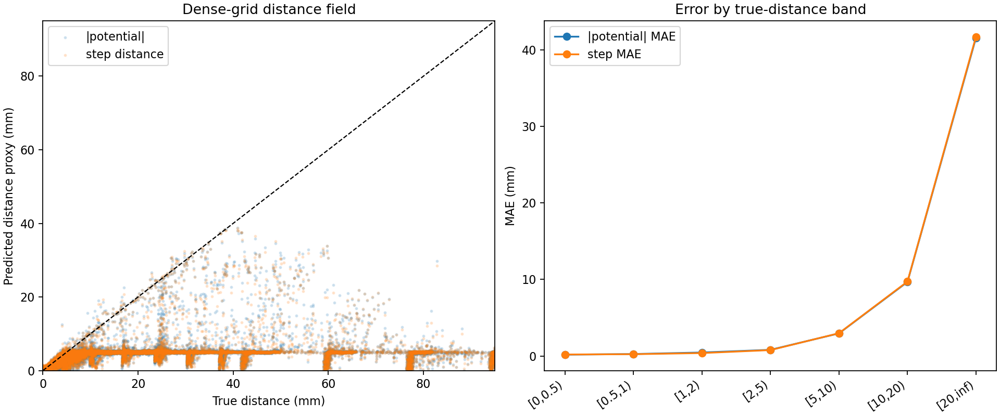
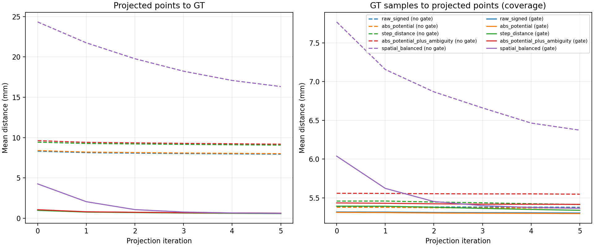
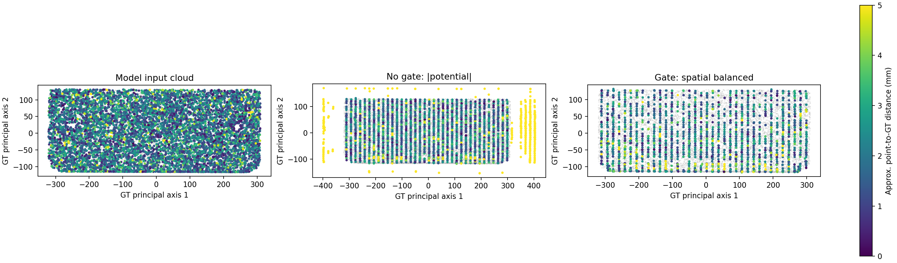
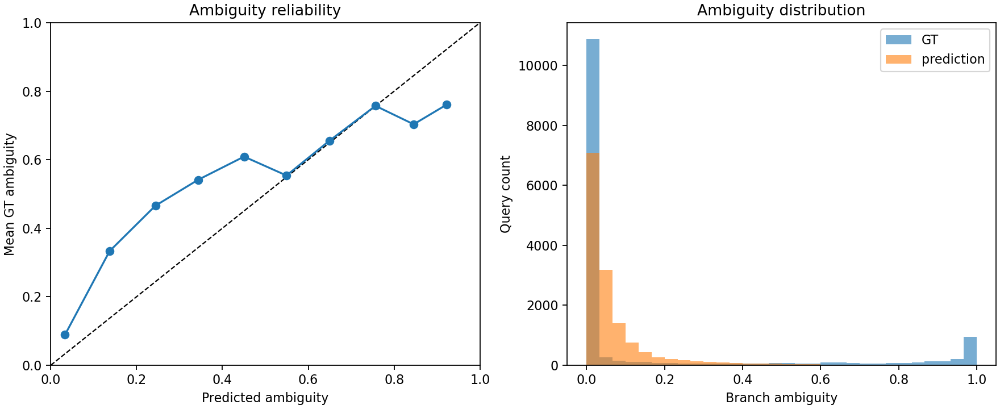

# Softmin guidance field analysis

- Schema: `analysis.softmin_guidance_field.v1`
- H5: `..\..\experiments\loss_smoothing\softmin_r717\body002_filled_dataset.h5`
- GT PLY: `..\..\experiments\loss_smoothing\softmin_r717\body002_filled_midsurface.ply`
- Grid: 48³ (110592 points)
- Provisional verdict: `not_ready` (3/17 gates)
- Evidence scope: single_part_or_non_holdout; generalization is unproven
- Input-cloud GT coverage mean/p95: 2.2017 / 4.3763 mm

## Saved query accuracy

| Category | N | Potential MAE/RMSE/bias (mm) | Step MAE/RMSE/bias (mm) | Direction angle mean (deg) | Ambiguity MAE/Brier/Spearman |
|---|---:|---:|---:|---:|---:|
| all | 14336 | 1.7777 / 6.6498 / -1.5523 | 1.7879 / 6.6763 / -1.6160 | 19.3193 | 0.1505 / 0.0881 / 0.6279 |
| near | 8192 | 0.2485 / 0.4550 / 0.0155 | 0.2589 / 0.4514 / -0.0572 | 22.2475 | 0.2281 / 0.1392 / 0.4527 |
| far | 2048 | 11.0912 / 17.5635 / -10.9925 | 11.1468 / 17.6341 / -11.0925 | 22.3355 | 0.1008 / 0.0476 / 0.4611 |
| boundary | 4096 | 0.1792 / 0.3443 / 0.0320 | 0.1665 / 0.3412 / 0.0047 | 11.9549 | 0.0202 / 0.0064 / 0.1397 |
| near_clear | 5691 | 0.1719 / 0.3606 / -0.0720 | 0.2176 / 0.3980 / -0.0364 | 15.7430 | 0.0672 / 0.0104 / 0.2429 |

## Dense grid

| Metric | abs potential | step distance |
|---|---:|---:|
| MAE to true distance (mm) | 19.4417 | 19.5085 |
| RMSE to true distance (mm) | 31.5176 | 31.5717 |
| Ghost fraction (all) | 0.0221 | 0.0250 |
| Missed-near fraction (true-near) | 0.0000 | 0.0000 |

## Candidate ranking and projection

| OOD gate | Ranking | N | Initial point→GT mean | Final point→GT mean | Final coverage mean | Final worsened fraction |
|---|---|---:|---:|---:|---:|---:|
| without_ood_gate | raw_signed | 4096 | 8.3217 | 7.9491 | 5.3777 | 0.2751 |
| without_ood_gate | abs_potential | 4096 | 8.3976 | 8.0118 | 5.3669 | 0.2673 |
| without_ood_gate | step_distance | 4096 | 9.4358 | 9.0706 | 5.4147 | 0.2517 |
| without_ood_gate | abs_potential_plus_ambiguity | 4096 | 9.6243 | 9.1886 | 5.5469 | 0.2407 |
| without_ood_gate | spatial_balanced | 4096 | 24.3338 | 16.3267 | 6.3732 | 0.0454 |
| with_ood_gate | raw_signed | 4096 | 1.0176 | 0.6367 | 5.3041 | 0.2720 |
| with_ood_gate | abs_potential | 4096 | 1.0164 | 0.6269 | 5.2964 | 0.2654 |
| with_ood_gate | step_distance | 4096 | 0.9846 | 0.5837 | 5.3390 | 0.2427 |
| with_ood_gate | abs_potential_plus_ambiguity | 4096 | 1.0713 | 0.6304 | 5.4154 | 0.2361 |
| with_ood_gate | spatial_balanced | 4096 | 4.2677 | 0.6088 | 5.3648 | 0.0623 |

## Potential autograd consistency

- Gradient norm mean: 0.7960
- cos(-∇potential, predicted direction) mean: 0.7227
- angle(-∇potential, predicted direction) mean: 33.1318 deg

## Provisional quality gates

| Gate | Value | Condition | Result |
|---|---:|---:|---|
| near_potential_mae_mm | 0.2485 | <= 0.2500 | PASS |
| near_potential_p95_mm | 1.0205 | <= 0.7500 | FAIL |
| near_step_mae_mm | 0.2589 | <= 0.1500 | FAIL |
| near_step_p95_mm | 0.9046 | <= 0.6000 | FAIL |
| near_clear_direction_p95_deg | 50.1137 | <= 45.0000 | FAIL |
| near_clear_direction_over_90_fraction | 0.0408 | <= 0.0100 | FAIL |
| near_ambiguity_mae | 0.2281 | <= 0.1000 | FAIL |
| near_ambiguity_spearman | 0.4527 | >= 0.7000 | FAIL |
| near_high_ambiguity_auroc | 0.7555 | >= 0.9000 | FAIL |
| near_high_ambiguity_false_safe_fraction | 0.6793 | <= 0.0500 | FAIL |
| near_head_consistency_violation_fraction | 0.1708 | <= 0.0500 | FAIL |
| input_cloud_coverage_p95_mm | 4.3763 | <= 5.0000 | PASS |
| input_cloud_coverage_within_5mm_fraction | 0.9801 | >= 0.9500 | PASS |
| dense_grid_ghost_fraction | 0.0221 | <= 0.0100 | FAIL |
| projected_point_p95_mm | 3.0257 | <= 0.7500 | FAIL |
| coverage_p95_mm | 9.3987 | <= 5.0000 | FAIL |
| projection_worsened_fraction | 0.0623 | <= 0.0200 | FAIL |

## Diagnostic plots

