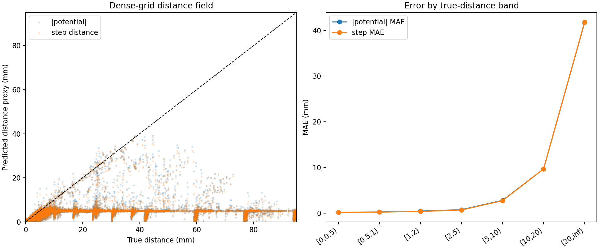
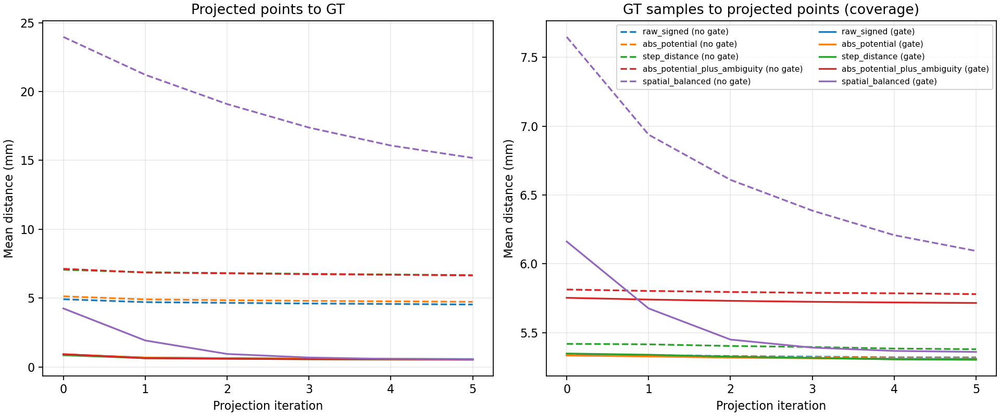
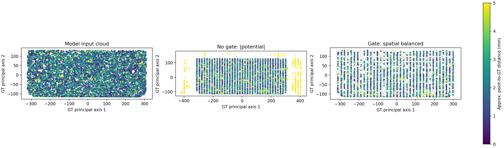
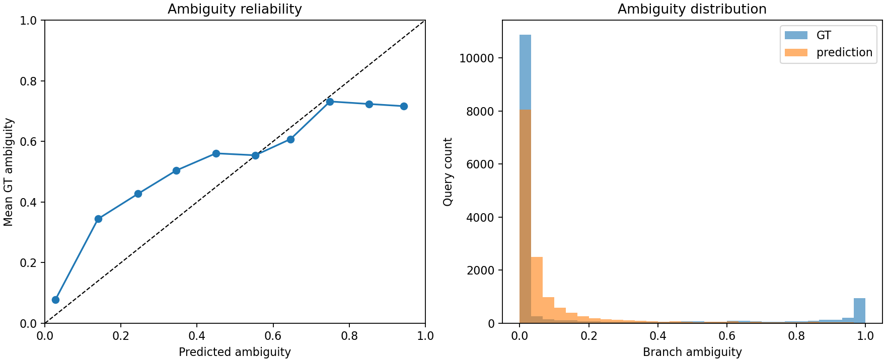

# Softmin guidance field analysis

- Schema: `analysis.softmin_guidance_field.v1`
- H5: `..\..\experiments\loss_smoothing\softmin_r717\body002_filled_dataset.h5`
- GT PLY: `..\..\experiments\loss_smoothing\softmin_r717\body002_filled_midsurface.ply`
- Grid: 48³ (110592 points)
- Provisional verdict: `not_ready` (4/17 gates)
- Evidence scope: single_part_or_non_holdout; generalization is unproven
- Input-cloud GT coverage mean/p95: 2.2017 / 4.3763 mm

## Saved query accuracy

| Category | N | Potential MAE/RMSE/bias (mm) | Step MAE/RMSE/bias (mm) | Direction angle mean (deg) | Ambiguity MAE/Brier/Spearman |
|---|---:|---:|---:|---:|---:|
| all | 14336 | 1.7396 / 6.6897 / -1.5778 | 1.7658 / 6.7148 / -1.6093 | 18.5257 | 0.1413 / 0.0812 / 0.5957 |
| near | 8192 | 0.1863 / 0.3773 / 0.0078 | 0.2264 / 0.3975 / -0.0319 | 20.6427 | 0.2141 / 0.1278 / 0.4971 |
| far | 2048 | 11.1161 / 17.6770 / -11.0289 | 11.1502 / 17.7416 / -11.0969 | 21.5281 | 0.0980 / 0.0448 / 0.3334 |
| boundary | 4096 | 0.1579 / 0.3322 / -0.0232 | 0.1526 / 0.3326 / -0.0203 | 12.7906 | 0.0175 / 0.0063 / 0.1447 |
| near_clear | 5691 | 0.1229 / 0.2877 / -0.0594 | 0.1854 / 0.3383 / -0.0156 | 14.3244 | 0.0679 / 0.0153 / 0.2534 |

## Dense grid

| Metric | abs potential | step distance |
|---|---:|---:|
| MAE to true distance (mm) | 19.4602 | 19.4918 |
| RMSE to true distance (mm) | 31.5503 | 31.5962 |
| Ghost fraction (all) | 0.0174 | 0.0183 |
| Missed-near fraction (true-near) | 0.0000 | 0.0000 |

## Candidate ranking and projection

| OOD gate | Ranking | N | Initial point→GT mean | Final point→GT mean | Final coverage mean | Final worsened fraction |
|---|---|---:|---:|---:|---:|---:|
| without_ood_gate | raw_signed | 4096 | 4.9153 | 4.5329 | 5.3200 | 0.2710 |
| without_ood_gate | abs_potential | 4096 | 5.1265 | 4.7256 | 5.3167 | 0.2600 |
| without_ood_gate | step_distance | 4096 | 7.0576 | 6.6628 | 5.3798 | 0.2402 |
| without_ood_gate | abs_potential_plus_ambiguity | 4096 | 7.1236 | 6.6442 | 5.7800 | 0.2229 |
| without_ood_gate | spatial_balanced | 4096 | 23.9618 | 15.1776 | 6.0935 | 0.0315 |
| with_ood_gate | raw_signed | 4096 | 0.9104 | 0.5711 | 5.3096 | 0.2737 |
| with_ood_gate | abs_potential | 4096 | 0.9141 | 0.5616 | 5.3055 | 0.2659 |
| with_ood_gate | step_distance | 4096 | 0.8505 | 0.5197 | 5.3029 | 0.2524 |
| with_ood_gate | abs_potential_plus_ambiguity | 4096 | 0.9278 | 0.5349 | 5.7155 | 0.2305 |
| with_ood_gate | spatial_balanced | 4096 | 4.2461 | 0.5424 | 5.3598 | 0.0664 |

## Potential autograd consistency

- Gradient norm mean: 0.8168
- cos(-∇potential, predicted direction) mean: 0.7353
- angle(-∇potential, predicted direction) mean: 31.8553 deg

## Provisional quality gates

| Gate | Value | Condition | Result |
|---|---:|---:|---|
| near_potential_mae_mm | 0.1863 | <= 0.2500 | PASS |
| near_potential_p95_mm | 0.8541 | <= 0.7500 | FAIL |
| near_step_mae_mm | 0.2264 | <= 0.1500 | FAIL |
| near_step_p95_mm | 0.8069 | <= 0.6000 | FAIL |
| near_clear_direction_p95_deg | 34.7076 | <= 45.0000 | PASS |
| near_clear_direction_over_90_fraction | 0.0378 | <= 0.0100 | FAIL |
| near_ambiguity_mae | 0.2141 | <= 0.1000 | FAIL |
| near_ambiguity_spearman | 0.4971 | >= 0.7000 | FAIL |
| near_high_ambiguity_auroc | 0.7885 | >= 0.9000 | FAIL |
| near_high_ambiguity_false_safe_fraction | 0.5837 | <= 0.0500 | FAIL |
| near_head_consistency_violation_fraction | 0.1473 | <= 0.0500 | FAIL |
| input_cloud_coverage_p95_mm | 4.3763 | <= 5.0000 | PASS |
| input_cloud_coverage_within_5mm_fraction | 0.9801 | >= 0.9500 | PASS |
| dense_grid_ghost_fraction | 0.0174 | <= 0.0100 | FAIL |
| projected_point_p95_mm | 2.2539 | <= 0.7500 | FAIL |
| coverage_p95_mm | 9.6173 | <= 5.0000 | FAIL |
| projection_worsened_fraction | 0.0664 | <= 0.0200 | FAIL |

## Diagnostic plots

