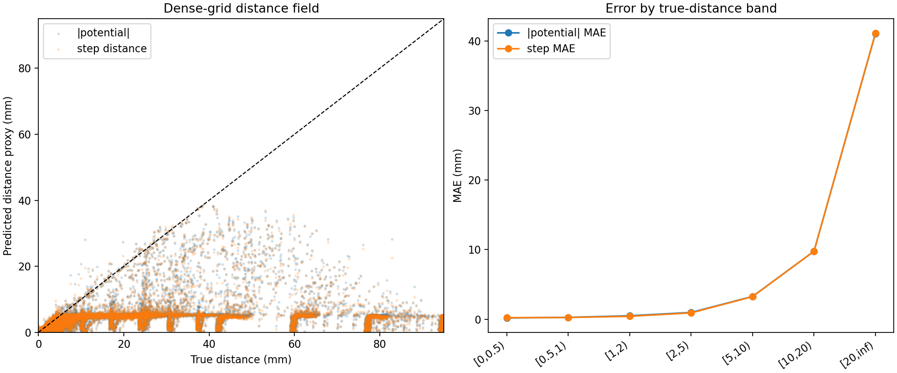
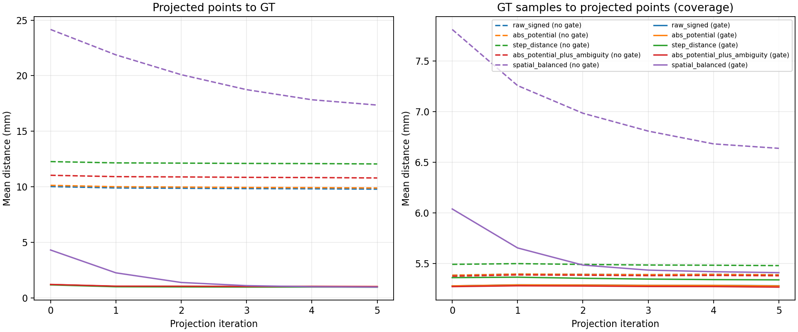
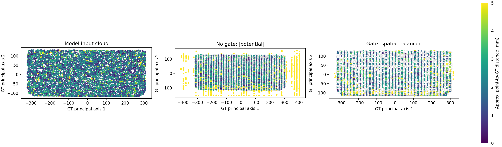
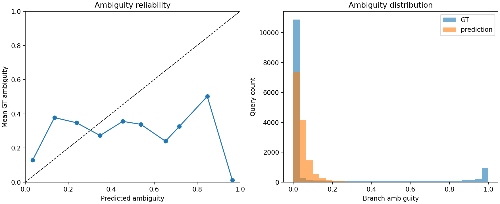

# Softmin guidance field analysis

- Schema: `analysis.softmin_guidance_field.v1`
- H5: `..\..\experiments\loss_smoothing\softmin_r717\body002_filled_dataset.h5`
- GT PLY: `..\..\experiments\loss_smoothing\softmin_r717\body002_filled_midsurface.ply`
- Grid: 48³ (110592 points)
- Provisional verdict: `not_ready` (2/17 gates)
- Evidence scope: single_part_or_non_holdout; generalization is unproven
- Input-cloud GT coverage mean/p95: 2.2017 / 4.3763 mm

## Saved query accuracy

| Category | N | Potential MAE/RMSE/bias (mm) | Step MAE/RMSE/bias (mm) | Direction angle mean (deg) | Ambiguity MAE/Brier/Spearman |
|---|---:|---:|---:|---:|---:|
| all | 14336 | 1.8361 / 6.5469 / -1.5695 | 1.8111 / 6.5399 / -1.5952 | 26.2281 | 0.1632 / 0.1065 / 0.5545 |
| near | 8192 | 0.3542 / 0.5824 / 0.0020 | 0.3197 / 0.5285 / -0.0484 | 33.0015 | 0.2488 / 0.1694 / 0.2594 |
| far | 2048 | 10.9863 / 17.2705 / -10.8867 | 10.9662 / 17.2593 / -10.8957 | 25.7876 | 0.1089 / 0.0552 / 0.4383 |
| boundary | 4096 | 0.2246 / 0.4518 / -0.0540 | 0.2163 / 0.4397 / -0.0385 | 12.9016 | 0.0193 / 0.0064 / 0.1399 |
| near_clear | 5691 | 0.2552 / 0.4772 / -0.1420 | 0.2816 / 0.4865 / -0.0297 | 28.0422 | 0.0555 / 0.0065 / 0.1340 |

## Dense grid

| Metric | abs potential | step distance |
|---|---:|---:|
| MAE to true distance (mm) | 19.3287 | 19.3459 |
| RMSE to true distance (mm) | 31.3507 | 31.3755 |
| Ghost fraction (all) | 0.0440 | 0.0458 |
| Missed-near fraction (true-near) | 0.0000 | 0.0000 |

## Candidate ranking and projection

| OOD gate | Ranking | N | Initial point→GT mean | Final point→GT mean | Final coverage mean | Final worsened fraction |
|---|---|---:|---:|---:|---:|---:|
| without_ood_gate | raw_signed | 4096 | 10.0126 | 9.7816 | 5.3901 | 0.3147 |
| without_ood_gate | abs_potential | 4096 | 10.1245 | 9.8853 | 5.3893 | 0.3096 |
| without_ood_gate | step_distance | 4096 | 12.2628 | 12.0516 | 5.4801 | 0.2908 |
| without_ood_gate | abs_potential_plus_ambiguity | 4096 | 11.0300 | 10.7876 | 5.3798 | 0.3000 |
| without_ood_gate | spatial_balanced | 4096 | 24.1584 | 17.3514 | 6.6384 | 0.0813 |
| with_ood_gate | raw_signed | 4096 | 1.1891 | 0.9956 | 5.2809 | 0.3357 |
| with_ood_gate | abs_potential | 4096 | 1.1926 | 0.9934 | 5.2791 | 0.3320 |
| with_ood_gate | step_distance | 4096 | 1.1604 | 0.9600 | 5.3393 | 0.3123 |
| with_ood_gate | abs_potential_plus_ambiguity | 4096 | 1.2018 | 1.0135 | 5.2676 | 0.3320 |
| with_ood_gate | spatial_balanced | 4096 | 4.3015 | 0.9632 | 5.4108 | 0.0840 |

## Potential autograd consistency

- Gradient norm mean: 0.7698
- cos(-∇potential, predicted direction) mean: 0.8617
- angle(-∇potential, predicted direction) mean: 21.6174 deg

## Provisional quality gates

| Gate | Value | Condition | Result |
|---|---:|---:|---|
| near_potential_mae_mm | 0.3542 | <= 0.2500 | FAIL |
| near_potential_p95_mm | 1.2522 | <= 0.7500 | FAIL |
| near_step_mae_mm | 0.3197 | <= 0.1500 | FAIL |
| near_step_p95_mm | 1.0600 | <= 0.6000 | FAIL |
| near_clear_direction_p95_deg | 160.9620 | <= 45.0000 | FAIL |
| near_clear_direction_over_90_fraction | 0.1107 | <= 0.0100 | FAIL |
| near_ambiguity_mae | 0.2488 | <= 0.1000 | FAIL |
| near_ambiguity_spearman | 0.2594 | >= 0.7000 | FAIL |
| near_high_ambiguity_auroc | 0.6520 | >= 0.9000 | FAIL |
| near_high_ambiguity_false_safe_fraction | 0.9552 | <= 0.0500 | FAIL |
| near_head_consistency_violation_fraction | 0.0834 | <= 0.0500 | FAIL |
| input_cloud_coverage_p95_mm | 4.3763 | <= 5.0000 | PASS |
| input_cloud_coverage_within_5mm_fraction | 0.9801 | >= 0.9500 | PASS |
| dense_grid_ghost_fraction | 0.0440 | <= 0.0100 | FAIL |
| projected_point_p95_mm | 4.3665 | <= 0.7500 | FAIL |
| coverage_p95_mm | 9.4103 | <= 5.0000 | FAIL |
| projection_worsened_fraction | 0.0840 | <= 0.0200 | FAIL |

## Diagnostic plots

