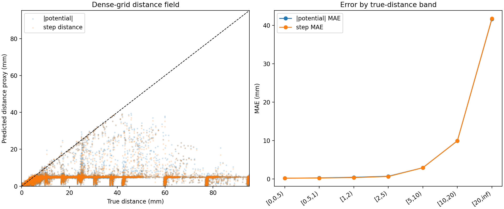
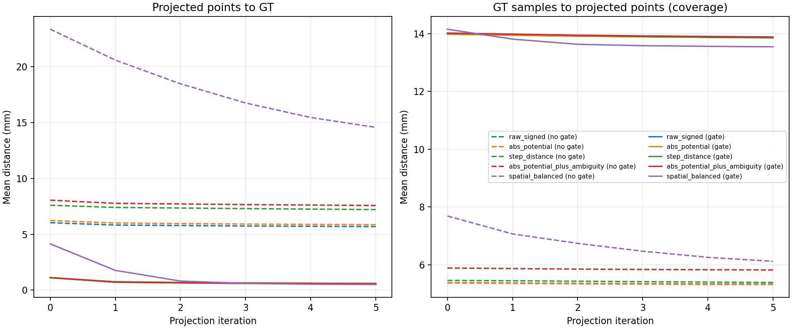
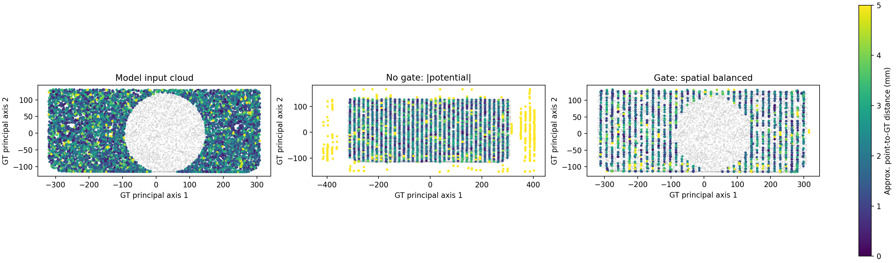
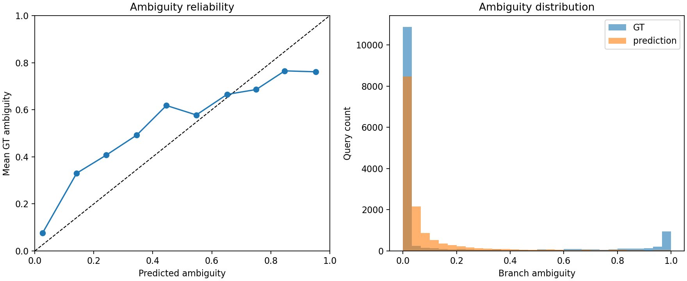

# Softmin guidance field analysis

- Schema: `analysis.softmin_guidance_field.v1`
- H5: `biw_poc\experiments\loss_smoothing\softmin_r717\body002_filled_dataset.h5`
- GT PLY: `biw_poc\experiments\loss_smoothing\softmin_r717\body002_filled_midsurface.ply`
- Grid: 48³ (110592 points)
- Provisional verdict: `not_ready` (3/17 gates)
- Evidence scope: single_part_or_non_holdout; generalization is unproven
- Input-cloud GT coverage mean/p95: 12.9577 / 69.2419 mm

## Saved query accuracy

| Category | N | Potential MAE/RMSE/bias (mm) | Step MAE/RMSE/bias (mm) | Direction angle mean (deg) | Ambiguity MAE/Brier/Spearman |
|---|---:|---:|---:|---:|---:|
| all | 14336 | 1.6187 / 6.2804 / -1.4865 | 1.6542 / 6.3053 / -1.5160 | 16.7926 | 0.1380 / 0.0784 / 0.5949 |
| near | 8192 | 0.1517 / 0.3203 / 0.0074 | 0.2039 / 0.3562 / -0.0230 | 18.7962 | 0.2077 / 0.1220 / 0.5197 |
| far | 2048 | 10.4618 / 16.5990 / -10.3762 | 10.5127 / 16.6624 / -10.4577 | 20.3633 | 0.0950 / 0.0451 / 0.3795 |
| boundary | 4096 | 0.1311 / 0.2867 / -0.0295 | 0.1253 / 0.2797 / -0.0314 | 11.0000 | 0.0199 / 0.0079 / 0.1477 |
| near_clear | 5686 | 0.1043 / 0.2533 / -0.0449 | 0.1661 / 0.3044 / -0.0118 | 13.1994 | 0.0653 / 0.0144 / 0.2608 |

## Dense grid

| Metric | abs potential | step distance |
|---|---:|---:|
| MAE to true distance (mm) | 19.5402 | 19.5892 |
| RMSE to true distance (mm) | 31.6359 | 31.6841 |
| Ghost fraction (all) | 0.0218 | 0.0234 |
| Missed-near fraction (true-near) | 0.0000 | 0.0000 |

## Candidate ranking and projection

| OOD gate | Ranking | N | Initial point→GT mean | Final point→GT mean | Final coverage mean | Final worsened fraction |
|---|---|---:|---:|---:|---:|---:|
| without_ood_gate | raw_signed | 4096 | 6.0388 | 5.6884 | 5.3313 | 0.2573 |
| without_ood_gate | abs_potential | 4096 | 6.2352 | 5.8567 | 5.3176 | 0.2466 |
| without_ood_gate | step_distance | 4096 | 7.6004 | 7.2109 | 5.3874 | 0.2241 |
| without_ood_gate | abs_potential_plus_ambiguity | 4096 | 8.0528 | 7.5767 | 5.8226 | 0.2107 |
| without_ood_gate | spatial_balanced | 4096 | 23.3648 | 14.5756 | 6.1205 | 0.0452 |
| with_ood_gate | raw_signed | 4096 | 1.1134 | 0.6086 | 13.8594 | 0.2061 |
| with_ood_gate | abs_potential | 4096 | 1.1176 | 0.6005 | 13.8586 | 0.2009 |
| with_ood_gate | step_distance | 4096 | 1.0953 | 0.5428 | 13.8535 | 0.1814 |
| with_ood_gate | abs_potential_plus_ambiguity | 4096 | 1.1203 | 0.5629 | 13.8840 | 0.1829 |
| with_ood_gate | spatial_balanced | 4096 | 4.1401 | 0.5009 | 13.5436 | 0.0723 |

## Potential autograd consistency

- Gradient norm mean: 0.8310
- cos(-∇potential, predicted direction) mean: 0.7328
- angle(-∇potential, predicted direction) mean: 32.3653 deg

## Provisional quality gates

| Gate | Value | Condition | Result |
|---|---:|---:|---|
| near_potential_mae_mm | 0.1517 | <= 0.2500 | PASS |
| near_potential_p95_mm | 0.6966 | <= 0.7500 | PASS |
| near_step_mae_mm | 0.2039 | <= 0.1500 | FAIL |
| near_step_p95_mm | 0.7185 | <= 0.6000 | FAIL |
| near_clear_direction_p95_deg | 30.6539 | <= 45.0000 | PASS |
| near_clear_direction_over_90_fraction | 0.0280 | <= 0.0100 | FAIL |
| near_ambiguity_mae | 0.2077 | <= 0.1000 | FAIL |
| near_ambiguity_spearman | 0.5197 | >= 0.7000 | FAIL |
| near_high_ambiguity_auroc | 0.8072 | >= 0.9000 | FAIL |
| near_high_ambiguity_false_safe_fraction | 0.5376 | <= 0.0500 | FAIL |
| near_head_consistency_violation_fraction | 0.1560 | <= 0.0500 | FAIL |
| input_cloud_coverage_p95_mm | 69.2419 | <= 5.0000 | FAIL |
| input_cloud_coverage_within_5mm_fraction | 0.7202 | >= 0.9500 | FAIL |
| dense_grid_ghost_fraction | 0.0218 | <= 0.0100 | FAIL |
| projected_point_p95_mm | 2.3474 | <= 0.7500 | FAIL |
| coverage_p95_mm | 61.7305 | <= 5.0000 | FAIL |
| projection_worsened_fraction | 0.0723 | <= 0.0200 | FAIL |

## Diagnostic plots

