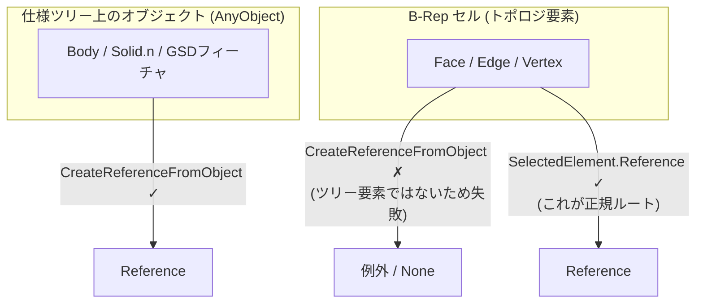
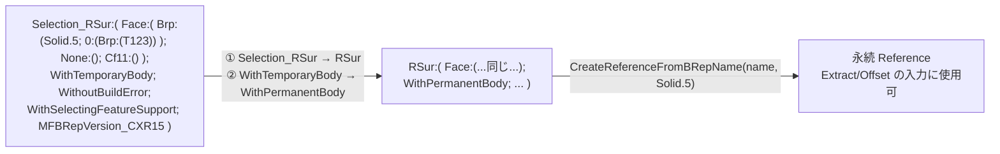
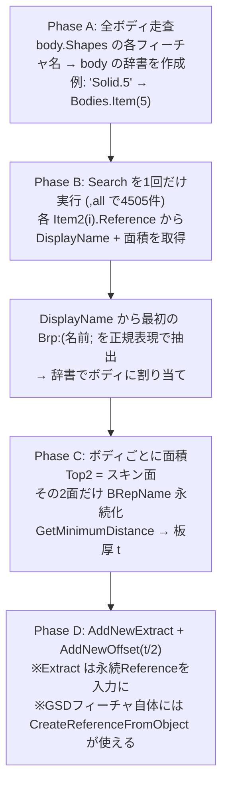

# AllCATPart(STEPインポートソリッド)対応 — B-Rep参照の取得と per-body スコープ

実験結果(課題1: `CreateReferenceFromObject` 全件失敗 / 課題2: 可視性スコープ無効)の原因と解決策。
結論: **MANIFOLD_SOLID_BREP であること自体は障壁ではない**。障壁は B-Rep 参照の取り方と Search の仕様。

---

## 1. 課題1の正体: B-Repセルは「ツリー上のオブジェクト」ではない

### 何が起きているか



- `sel.Item2(i).Value` が返すのは **Boundary 系の B-Rep セル**(フェイスそのもの)。仕様ツリー上の
  フィーチャ(AnyObject)ではないため、`CreateReferenceFromObject` の対象外 → 全件失敗は仕様通り。
- `SelectedElement` には B-Rep 選択のためにまさに **`Reference` プロパティ**が用意されている:

```python
sel.Search("Topology.CGMFace,all")
for i in range(1, sel.Count2 + 1):
    ref = sel.Item2(i).Reference          # ← Value ではなく Reference
    area = spa.GetMeasurable(ref).Area    # 計測にそのまま使える
    dn   = ref.DisplayName                # BRep名文字列(後述の永続化に使う)
```

### ただし選択由来の Reference は「一時的」

`ref.DisplayName` を見ると先頭が `Selection_RSur:` で、フラグに `WithTemporaryBody` が入っている。
これは **Selection が生きている間だけ有効な一時参照**で、`sel.Clear()` で無効化されるうえ、
`AddNewExtract` の入力に使うと更新時に壊れることがある。

→ **計測は一時参照のまま実施し、フィーチャ入力に使う面(各ボディの基準面)だけ
`CreateReferenceFromBRepName` で永続参照に変換する**のが正しい設計。

### BRepName の構造と永続化の変換規則



| 部位 | 意味 |
|---|---|
| `Face:(Brp:(Solid.5;...))` | **生成フィーチャ名**(どのソリッドのフェイスか)→ 課題2の鍵 |
| `0:(Brp:(T123))` | フェイスのトポロジカルID(永続タグ) |
| `WithTemporaryBody / WithPermanentBody` | 一時参照 / 永続参照のフラグ |

```python
def to_permanent(dn: str) -> str:
    return (dn.replace("Selection_RSur:", "RSur:", 1)
              .replace("WithTemporaryBody", "WithPermanentBody"))

perm_ref = part.CreateReferenceFromBRepName(to_permanent(dn), solid_feature)
#                                  第2引数 = そのフェイスを生成したフィーチャ
#                                  (STEPインポートなら body.Shapes.Item(1) の Solid)
```

リリース差で `MonoFond;` トークン等が入る場合があるため、スクリプトでは変換候補を順に試す
フォールバックを実装している。

---

## 2. 課題2: Search のスコープに頼らない per-body 分類

### 実験結果の解釈

- `,all` は「**ドキュメント全体・表示状態を無視**」が仕様 → 非表示にしても 4505 件のままは正常動作
- `,sel` はスコープを選択に入れた状態で(Clear せずに)実行する必要があるが、環境によって不安定
- 可視限定スコープは別キーワード `,scr`(画面上に表示)だが、ビューポート依存のリスクあり

### 推奨解: 検索は1回だけ、BRepName でボディに逆引きする

幸い、各フェイスの DisplayName には生成フィーチャ名 `Brp:(Solid.n;...)` が**必ず**埋め込まれている。
パート内のフィーチャ名は一意(Solid.1〜Solid.20 等)なので、これでボディ別に確実に分類できる。
**Search のスコープ機能・可視性制御が一切不要**になる。



```python
import re
FEAT_RE = re.compile(r"Brp:\(([^;)]+)[;)]")   # 最初の Brp:(名前; を抽出

m = FEAT_RE.search(dn)
body = feat_name_to_body[m.group(1)]          # 'Solid.5' → 該当ボディ
```

利点:
- 検索1回 + 文字列処理のみ → ロケール・スコープ・可視性の問題から完全に解放
- 永続化(`CreateReferenceFromBRepName`)は各ボディ2面 × 20体 = **40回だけ**で済む

---

## 3. 実装上の注意

- **Selection を Clear する前に** DisplayName と面積を回収し終えること(一時参照のため)
- `Item2 / Count2` を使う(`Item` は選択状態を変えうる)
- 更新は `part.Update()` でなく **`part.UpdateObject(feature)`** で局所更新(20ボディの全更新を回避、高速)
- 4505 面の `GetMeasurable().Area` は数分かかる可能性 → 進捗表示を入れる
- GSDフィーチャ(Extract 等)はツリー上のオブジェクトなので `CreateReferenceFromObject` が普通に使える
  (失敗するのは B-Rep セルだけ、という区別を明確に)
- `,sel` を再挑戦する場合の正しい手順: `sel.Add(body)` → **Clear せずに** `sel.Search("Topology.CGMFace,sel")`
  (Search 結果が選択を置き換える)。ただし上記の逆引き方式なら不要。
