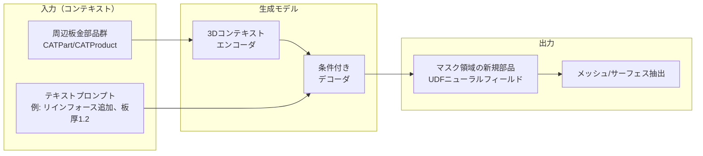
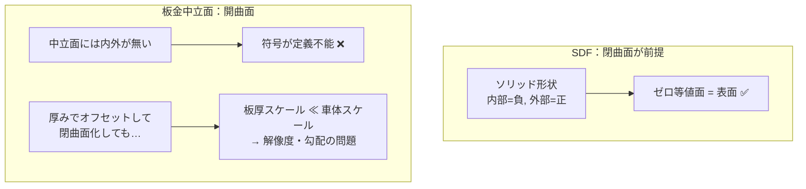
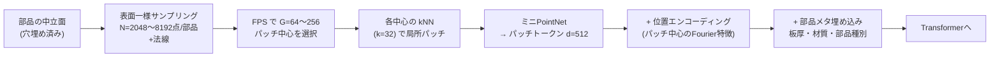
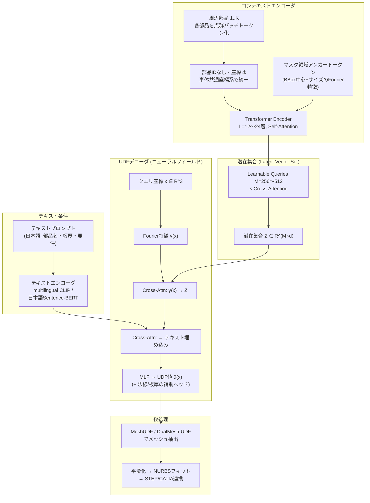
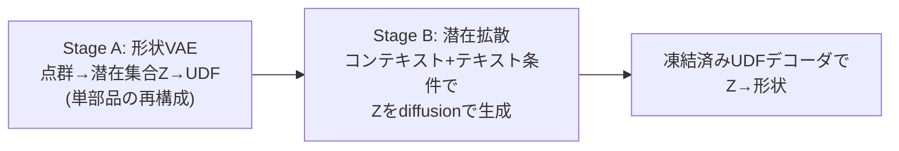
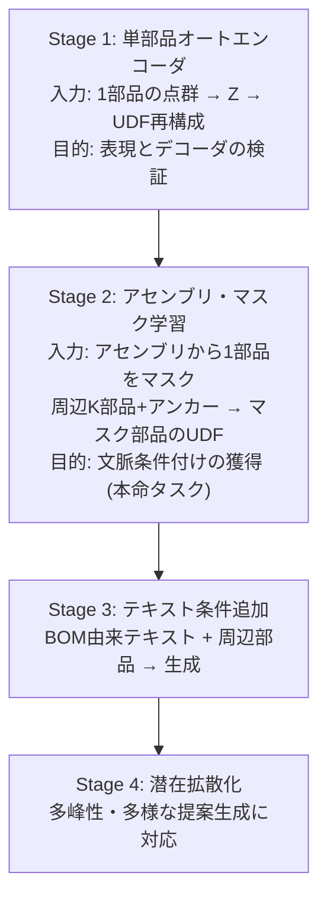
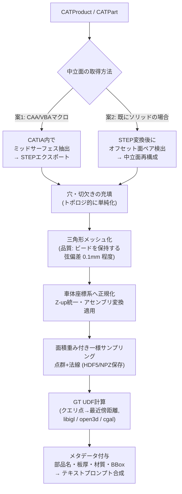
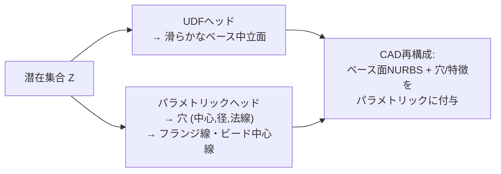

# 自動車板金（BIW）部品生成AI：実現可能性とアーキテクチャ詳細検討

## 0. 結論サマリ

| 論点 | 推奨 | 理由 |
|---|---|---|
| 実現可能性 | **条件付きで高い** | 類似アーキテクチャ（Point-MAE, 3DShape2VecSet, CLAY）に学術的実績あり。最大リスクはデータ量とCATIA前処理 |
| 出力表現 | **UDF**（SDFは不可） | 板金中立面は**開曲面**であり内外判定が定義できないためSDFは原理的に破綻。UDFなら開曲面を扱える |
| エンコーダ入力 | **点群パッチトークン**（UDF/SDFグリッドは非推奨） | 入力と出力の表現を分離するのが現代的設計。詳細は §3 |
| 生成方式 | Stage1: 決定論的回帰 → Stage2: **Latent Diffusion** | マスク穴埋めは本質的に多峰性（同じ周辺部品に複数の正解形状）があるため、最終的には確率的生成が必要 |
| 最大のリスク | ①学習データ量（アセンブリ数）②UDFからの面メッシュ抽出品質 ③CATIA前処理の自動化 | §7 で対策を詳述 |

---

## 1. 問題設定の整理

やろうとしていることは **「3D版 BERT/MAE の条件付き穴埋め」** です。



これは画像分野の **MAE (Masked Autoencoder)** ＋ **inpainting** の3D類推であり、点群では **Point-MAE / Point-BERT**、形状生成では **3DShape2VecSet → CLAY** という直系の先行研究が存在します。つまりアーキテクチャの骨格自体は実証済みで、新規性（＝リスク）は以下に集中します。

1. 対象が**薄板開曲面**（ShapeNet系研究はほぼ閉じたソリッド）
2. **アセンブリ文脈**条件付け（部品間の溶接フランジ・合わせ面の整合）
3. **CATIAデータ**という工業データ特有の前処理

---

## 2. 表現形式の比較：板金中立面をどう表すか

### 2.1 候補の比較表

| 表現 | 開曲面対応 | 薄板適性 | エンコーダ入力 | デコーダ出力 | 備考 |
|---|---|---|---|---|---|
| **SDF** | ❌ 原理的に不可 | ❌ | ❌ | ❌ | 内外判定が必要。中立面には「内側」が存在しない |
| **厚み付きSDF**（中立面±t/2でオフセット閉曲面化） | △ | ❌ 数値的に苦しい | △ | △ | 板厚0.6〜2.0mmに対し車体スケール±1.5m → 解像度比 1:5000。グリッドSDFでは破綻、ニューラルSDFでも勾配が急峻 |
| **UDF** | ✅ | ✅ | △（§3参照） | ✅ **推奨** | ゼロ等値面で勾配不連続 → メッシュ抽出に専用手法（MeshUDF, DualMesh-UDF）が必要 |
| **点群** | ✅ | ✅ | ✅ **推奨** | △（面が直接得られない） | Point-MAE系のトークン化が確立 |
| **Triplane** | ✅ | △ 投影方向で退化 | △ | △ | 前回検討のPart-Aligned Triplaneは局所座標系で退化を緩和できるが、湾曲の強いパネルでは依然苦しい |
| **パラメトリックシート**（基準面＋フランジ＋ビード＋穴の特徴列） | ✅ | ✅ 工学的に最良 | ✅ | ✅ | CAD逆変換が容易だが、表現の網羅性設計が重い。§8でハイブリッド案 |

### 2.2 なぜSDFが板金で破綻するか



**UDF（符号なし距離場）** なら `f(x) = min距離(x, 中立面)` で開曲面をそのまま表現できます。代償はメッシュ抽出の難しさで、これは §7.2 で対策します。

---

## 3. ご質問への回答：エンコーダ入力もUDF/SDFにすべきか？

**結論：すべきでない。エンコーダ入力は「点群パッチトークン」、UDFは「デコーダ出力（クエリベースのニューラルフィールド）」に限定して使うのが最適。**

### 3.1 理由

1. **メモリと解像度のトレードオフ**
   UDFをエンコーダ入力にするには3Dグリッドへの離散化が必要。薄板の特徴（ビード半径3〜5mm、フランジ幅15mm）を解像するには車体スケールで512³以上が必要となり、Transformerに入れるトークン数として非現実的。スパースボクセル化しても点群サンプリングに対する優位性がない。

2. **入力表現と出力表現は分離するのが現代的設計**
   3DShape2VecSet / CLAY / Michelangelo はいずれも「**入力＝表面サンプル点群 → 潜在表現 → 出力＝座標クエリ式の陰関数場**」という非対称構成。入力は離散トークン（Transformerが得意）、出力は連続場（解像度自由・微分可能）と、それぞれの長所を取る。

3. **点群トークン化は実績が厚い**
   Point-MAE / Point-BERT の **FPS + kNNパッチ + ミニPointNet** によるトークン化は、まさに「3D版のViTパッチ埋め込み」であり、マスク学習との相性が実証済み。

4. **UDF入力には情報量の利点がほぼ無い**
   表面の十分密なサンプル点群はUDFと情報として等価（UDFは点群から計算できる）。わざわざ重い場で入力する意味がない。

### 3.2 推奨トークン化



**ポイント：法線を必ず含める。** 薄板では位置だけだと表裏の情報が落ち、フランジの折れ方向が曖昧になります。点群は `(x, y, z, nx, ny, nz)` の6次元で扱ってください。

---

## 4. 推奨アーキテクチャ全体像

### 4.1 全体パイプライン



### 4.2 各コンポーネントの設計判断

**(a) コンテキストエンコーダ**
- 構想されている「Multi-Head Self-Attention → 正規化 → MLP → ループ」は標準的なPre-LN Transformerブロックで正しい方向。Pre-LN（LayerNormをAttention/MLPの前に置く）を推奨（学習安定性）。
- **CLSトークンは不要になる可能性が高い。** CLS 1本に全コンテキストを集約すると情報のボトルネックになります。代わりに **Learnable Query集合（M本）とのCross-Attentionで潜在集合 Z を作る**（Perceiver / 3DShape2VecSet方式）と、部品の局所詳細（フランジ位置など）が保持されます。CLS的なグローバルトークンは「全体スタイル」用に1本併用するのは可。
- **マスク領域の指示**：生成すべき領域をモデルに伝える必要があります。マスク部品のBBox（中心＋サイズ＋向き）をFourier特徴化した**アンカートークン**として入力に混ぜるのが簡潔。BERTの[MASK]トークンの3D空間版です。

**(b) 位置エンコーディング**
- 学習可能な1D位置エンコーディングではなく、**3D座標のFourier特徴（NeRF式）** を使用。板金は車体座標系（X=車長, Y=車幅, Z=車高）が業界標準で意味を持つため、正規化後の絶対座標をそのまま使えるのが強み。
- 周波数帯域：車体スケール(m)〜ビードスケール(mm)をカバーするため L=10〜12オクターブ。
- 部品メタ情報（板厚、材質グレード、部品機能分類）は別途埋め込みベクトルとして**加算**または**トークン連結**。

**(c) テキスト条件付け（デコーダ入力）**
- 「デコーダ側の入力はテキストプロンプト」という構想は、**テキストをCross-Attentionの条件として注入する**形が標準（Stable Diffusion方式）。テキストを自己回帰デコーダの入力系列にする必要はありません。
- 日本語の部品名・要件（「Bピラーリインフォース、板厚1.4、980MPa材」等）を扱うなら、日本語対応エンコーダ（multilingual CLIP, 日本語Sentence-BERT等）を凍結して使い、軽量なProjection層のみ学習。
- **重要**：テキストペアデータは自然には存在しないため、BOM/部品表のメタデータ（部品名・板厚・材質）からテンプレート生成＋LLMで言い換え拡張する戦略が現実的（T5議事録プロジェクトでのGPT-4o合成データ生成と同じ発想）。

**(d) UDFデコーダ**
- 座標クエリ `x` → Fourier特徴 → 潜在集合ZへのCross-Attention（数層）→ MLP → `û(x)`。
- UDF値は `clamp(u, 0, δ)` （δ≈10〜20mm）で打ち切って回帰。遠方の距離を正確に当てる必要はなく、表面近傍に学習容量を集中させる。
- **補助ヘッド推奨**：①表面法線方向（メッシュ抽出と品質向上に効く）②局所板厚（下流のCAD化で必要）。

### 4.3 生成の確率化（Stage 2 以降）

マスク穴埋めには**多峰性**があります（同じ周辺部品に対しビード配置の異なる複数の正解があり得る）。決定論的回帰は複数解の「平均」＝ぼけた形状を出しがちです。



これは CLAY / Michelangelo と同じ2段構成です。まず決定論的なマスク回帰（MAE式）でパイプライン全体を検証し、品質の頭打ちを確認してから潜在拡散に移行するのが安全です。

---

## 5. 学習タスク設計

### 5.1 カリキュラム



### 5.2 マスク戦略

| 戦略 | 内容 | 効果 |
|---|---|---|
| 部品単位マスク | アセンブリから1部品を丸ごと隠す | 本命タスクそのもの |
| 部分マスク | 1部品のパッチトークンの60〜80%を隠す（Point-MAE式） | データ効率向上・単部品の形状prior獲得 |
| 複数部品マスク | 2〜3部品同時 | 難度を上げ汎化を促進（後期） |

### 5.3 損失関数

```
L = λ1·L_udf + λ2·L_grad + λ3·L_normal + λ4·L_thick

L_udf    : |clamp(û,0,δ) − clamp(u,0,δ)|  表面近傍のサンプルを重点的に
L_grad   : |∥∇û∥ − 1|                     Eikonal正則化（表面近傍以外で）
L_normal : 1 − cos(n̂, n)                  補助法線ヘッド
L_thick  : |t̂ − t|                        補助板厚ヘッド
```

クエリ点のサンプリングは「表面近傍ガウシアン（σ=2〜5mm）70%＋BBox内一様30%」が定石です。

---

## 6. 前処理パイプライン（CATIA → 学習データ）

ここが**工数の50%以上**を占める見込みです。CATIA V5ビューワ開発で経験済みの座標系問題（Z-up/Y-up）もここで吸収します。



実務上の注意：

- **中立面抽出はCATIA側でやるのが確実。** STEP変換後に薄板ソリッドから中立面を復元するのは（面ペアマッチングで可能だが）フィレット部で壊れやすい。CATIAのVBA/CAAでバッチ処理し、中立面＋板厚属性をセットで吐き出すのが最短。
- **「穴を埋める」前処理は妥当。** 位置決め穴・水抜き穴は形状の大局構造とは別レイヤの情報なので、ベース面を学習し、穴は将来的に別ヘッド（穴中心＋径のパラメトリック予測）で扱うのが筋が良い。
- アセンブリの**配置変換行列（部品→車体座標）を必ず保存**。マスク学習はすべて車体共通座標系で行います。

---

## 7. リスクと対策

### 7.1 データ量（最大のリスク）

| データ規模（アセンブリ数） | 見通し |
|---|---|
| 〜100 | 厳しい。Stage 1（単部品AE）＋強い拡張に限定 |
| 数百〜数千 | 拡張併用で Stage 2 まで現実的 |
| 数万〜 | 潜在拡散含めフル構成が視野 |

**対策：**
- 左右対称反転（車体は左右対称部品が多く実質2倍）
- 同一車種の派生グレード・年式違いを別サンプル化
- 部分マスク学習（1アセンブリから多数の学習サンプルを生成可能）
- 単部品レベルではShapeNet等での事前学習はドメイン差が大きく効果は限定的。むしろ**自社の単部品全在庫**（アセンブリ化されていないCATPartも含む）でStage 1を学習するのが効く

### 7.2 UDFメッシュ抽出の品質

UDFはゼロ等値面で勾配が不連続なため、Marching Cubesが直接使えません。

- **MeshUDF**（勾配の向き反転検出でMC拡張）、**DualMesh-UDF**（Dual Contouring系）を使用
- 補助法線ヘッドの出力を抽出時に併用すると安定
- 最終的にCADに戻すには：抽出メッシュ → 平滑化 → 領域分割 → **NURBSフィッティング**（Geomagic系の発想）。「生成AI出力＝設計初期提案、最終形状は設計者がCATIAで仕上げる」という位置づけにすると、メッシュ品質要求が現実的になる

### 7.3 工学的整合性（フランジ・合わせ面）

生成部品は周辺部品と**溶接フランジで面合わせ**される必要があり、ここが汎用3D生成との最大の違いです。

- 損失に**界面項**を追加：周辺部品のフランジ面近傍のクエリ点で、UDF≈板厚オフセットになるよう重み増し
- 評価指標：Chamfer距離 / F-score に加えて、**フランジ面平行度・隙間偏差**（合わせ面領域での距離分布）、**最小曲率半径**（成形性の代理指標）をドメイン指標として導入

### 7.4 計算資源

- Stage 1〜2 は d=512, 12〜24層, トークン数 ~2000（周辺8部品×256パッチ）規模なら **単機RTX 4090/A6000クラスでも検証可能**（mixed precision + gradient checkpointing）。Windows + CUDA環境で開始できます。
- 潜在拡散（Stage 4）からマルチGPUが欲しくなる規模感。

---

## 8. 代替・併用案：パラメトリックシート表現とのハイブリッド

以前検討された Parametric Sheet 案は捨てる必要はなく、**UDFフィールド生成の上に載せる**のが有望です。



- 連続的で自由曲面的な「ベース面」はフィールド表現が得意
- 離散的・規格的な「穴・フランジ角・ビード」はパラメトリック予測が得意
- この分担はCADへの逆変換（最終的にCATIAでフィーチャとして再現する工程）とも整合します

---

## 9. 推奨ロードマップ

| フェーズ | 内容 | 検証ポイント |
|---|---|---|
| P0 (〜1ヶ月) | 前処理PoC：CATIAマクロで中立面→STEP→点群+GT UDF を10部品で通す | パイプラインが自動で回るか |
| P1 (1〜2ヶ月) | Stage 1 単部品AE（点群→VecSet→UDF）＋MeshUDF抽出 | ビード・フランジが再構成で潰れないか（ここが薄板適性の試金石） |
| P2 (2〜3ヶ月) | Stage 2 マスク学習（小規模アセンブリ集合） | 文脈からの形状予測がベースライン（最近傍検索）を超えるか |
| P3 | テキスト条件＋潜在拡散 | 多様な提案生成・指示追従 |

**P1の再構成品質が全体のGo/No-Go判断点**です。単部品の再構成すらビードが消えるなら、解像度設計（パッチ数・潜在数・Fourier帯域）かハイブリッド表現への転換が必要になります。

---

## 10. 主要参考文献

- Point-MAE: Masked Autoencoders for Point Cloud Self-supervised Learning (ECCV 2022)
- Point-BERT: Pre-training 3D Point Cloud Transformers with Masked Point Modeling (CVPR 2022)
- 3DShape2VecSet: A 3D Shape Representation for Neural Fields and Generative Diffusion Models (SIGGRAPH 2023)
- CLAY: A Controllable Large-scale Generative Model for Creating High-quality 3D Assets (SIGGRAPH 2024)
- Michelangelo: Conditional 3D Shape Generation based on Shape-Image-Text Aligned Latent Representation (NeurIPS 2023)
- NDF / NeuralUDF / GIFS: 開曲面のためのUDF学習
- MeshUDF (ECCV 2022) / DualMesh-UDF (ICCV 2023): UDFからのメッシュ抽出
- Perceiver / Perceiver IO: Learnable Queryによる潜在集合化
- UDiFF: UDF空間でのDiffusion生成 (CVPR 2024)
