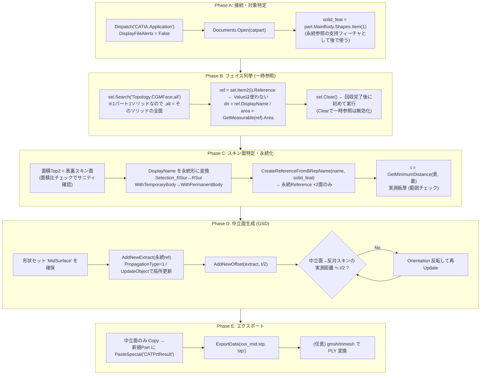
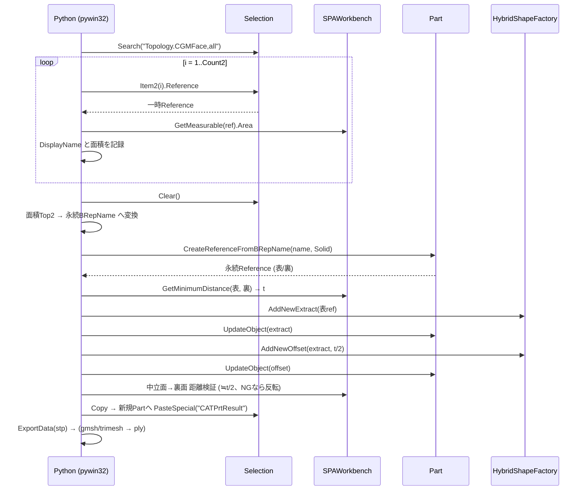
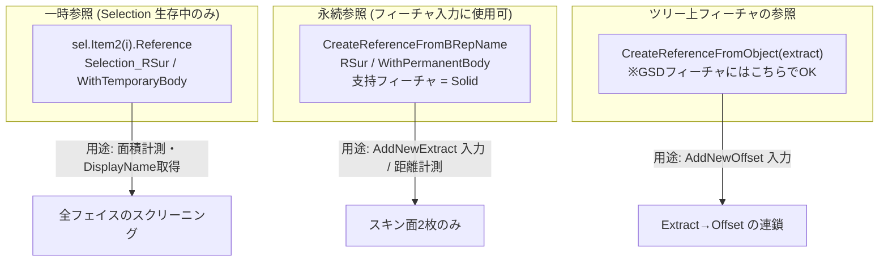

# CATIA V5 × Python COM — 中立面自動生成 決定版アーキテクチャ
## (1 CATPart = 1 ソリッド方針 / ベストプラクティス集約版)

対象: STEPインポートされた MANIFOLD_SOLID_BREP ソリッドを1つ持つ CATPart。
基準面(スキン面)を検出し、t/2 オフセットの中立面を生成して STP/PLY 出力する。

---

## 1. アーキテクチャ全体図

---

## 2. ベストプラクティス一覧(実験で確認した落とし穴と対策)

| # | 落とし穴(実験で確認) | 対策(確定) |
|---|---|---|
| 1 | `Search` のクエリ・スコープはロケール/環境依存。日本語UIで `,sel`・日本語クエリは E_FAIL | **`"Topology.CGMFace,all"` 一本に固定**(日本語UIでも動作確認済)。スコープ機能には頼らない |
| 2 | `sel.Item2(i).Value` + `CreateReferenceFromObject` は B-Rep セルに対して**全件失敗** | B-Rep には **`sel.Item2(i).Reference`** を使う。`CreateReferenceFromObject` はツリー上のフィーチャ(Extract等)専用と区別する |
| 3 | 選択由来の Reference は一時参照(`Selection_RSur` / `WithTemporaryBody`)。`sel.Clear()` で無効化、フィーチャ入力に使うと更新で壊れる | 計測は一時参照で済ませ、**フィーチャ入力に使う2面だけ** `CreateReferenceFromBRepName` で永続化。Clear 前に DisplayName/面積を回収 |
| 4 | BRepName の永続化変換はリリース差あり(`MonoFond` トークン等) | 変換候補を複数用意して順に試すフォールバック(①単純置換 ②MonoFond除去 ③Face記述子から標準フラグで再構成) |
| 5 | スキン面の判定: 平面判定は曲面パネルで破綻 | **面積Top2ヒューリスティック** + 面積比チェック + 板厚実測の範囲チェック |
| 6 | 板厚は図面公称値とズレることがある | `GetMinimumDistance` の**実測値**を採用 |
| 7 | `AddNewOffset` の正方向は法線依存で事前に不明 | **生成後に実測検証**(中立面→反対面 ≒ t/2)、外れたら `Orientation` 反転(不可なら負値オフセットで再生成) |
| 8 | `part.Update()` は全フィーチャ更新で遅い・他形状を巻き込む | **`part.UpdateObject(feature)`** で局所更新 |
| 9 | `ExportData` はドキュメント全体を出力(ソリッドが混入) | 中立面のみ **`PasteSpecial("CATPrtResult")`** で新規Partへリンクなしコピーしてから出力 |
| 10 | PLY は CATIA ネイティブ非対応 | STP をハブに **gmsh → trimesh** で後段変換(またはOCC直テッセレーション) |
| 11 | バッチ中のダイアログでハング | `catia.DisplayFileAlerts = False`、処理後 `doc.Close()`、失敗パートは記録してスキップ続行 |

---

## 3. COM 呼び出しシーケンス

---

## 4. オブジェクト/参照の使い分けマップ

---

## 5. 運用チェックリスト

- [ ] CATIA 起動済み / `DisplayFileAlerts = False`
- [ ] 1 CATPart = 1 ソリッド(`Bodies.Count` と `MainBody.Shapes.Count` を起動時に検証)
- [ ] フェイス回収は `sel.Clear()` の**前**に完了している
- [ ] 永続化は2面のみ(性能のため全面はやらない)
- [ ] 板厚 t が想定レンジ内(例 0.2〜10mm)、面積比 Top2/Top1 ≥ 0.5
- [ ] 中立面の位置検証(≒t/2)が通っている
- [ ] 出力 STP に中立面のみ含まれる(ソリッド混入なし)
- [ ] バッチ時: 失敗パートのログ + continue、最後に成功/失敗サマリ
