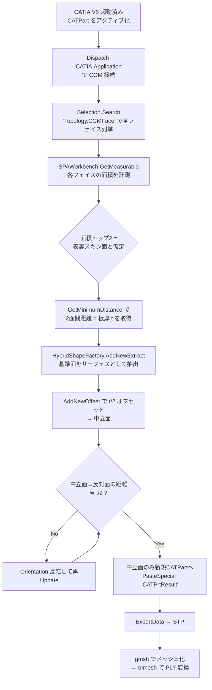
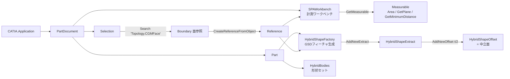
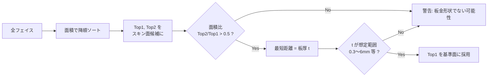
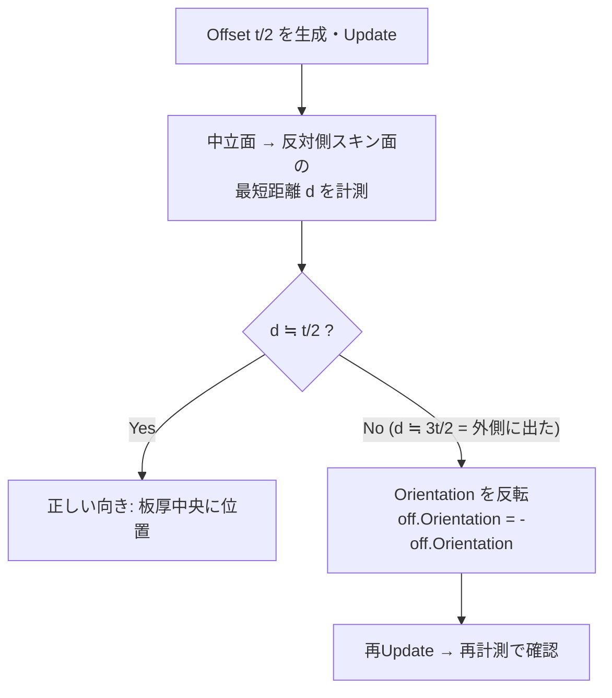
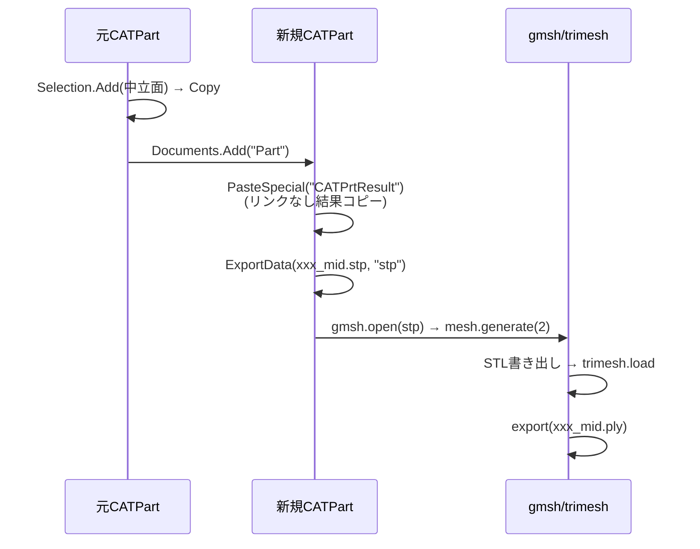

# CATIA V5 × Python COM — 板金ソリッドからの中立面(Mid-Surface)自動抽出

V5 Automation API(https://catiadesign.org/_doc/V5Automation/ 掲載の COM インターフェース群)を
pywin32 から叩き、板金ソリッドの基準面探索 → t/2 オフセット → 中立面の STP / PLY 出力までを自動化する。

---

## 1. 全体パイプライン



**ポイント**: PLY は CATIA のネイティブ出力フォーマットに存在しない(対応は `stp / igs / wrl / stl / 3dmap / cgr` 等)。
そのため **STP をハブにして Python 側でテッセレーション → PLY 変換** する2段構えにする。

---

## 2. 使用する COM オブジェクトモデル



| インターフェース | 役割 |
|---|---|
| `Selection.Search("Topology.CGMFace,sel")` | ソリッドのフェイス(BRep)を一括列挙 |
| `SPAWorkbench.GetMeasurable(ref)` | `.Area`(面積)、`.GetPlane()`(平面情報)、`.GetMinimumDistance(ref2)`(最短距離) |
| `HybridShapeFactory.AddNewExtract(ref)` | フェイスをGSDサーフェスとして抽出(曲面でも可) |
| `HybridShapeFactory.AddNewOffset(ref, d)` | サーフェスオフセット。`Orientation` プロパティで向き反転 |
| `Document.ExportData(path, "stp")` | STEP 出力 |

---

## 3. 基準面(スキン面)探索アルゴリズム

板金部品のフェイスは「表裏のスキン面(大面積)」と「板厚面=側面(細長く小面積)」に二分される。
平面板に限定せず**曲面パネル(BIWパネル等)にも効く**よう、平面判定ではなく面積で判定する。



- 表裏スキンはほぼ同面積 → 面積比チェックでサニティ確認
- 板厚は図面値を信用せず `GetMinimumDistance` の実測値を使う(単位は mm)
- 平面の場合のみ `GetPlane()` で原点+2方向ベクトル(9 doubles)が取れるので、法線情報をログに残す

---

## 4. オフセット向きの自動判定

`AddNewOffset` の正方向はサーフェス法線依存で事前に分からない。**幾何で検証して間違っていたら反転**が最も堅牢。



---

## 5. エクスポート戦略

`ExportData` は**ドキュメント全体**を出力するため、そのまま実行するとソリッドも STP に含まれてしまう。
中立面だけを **新規 CATPart に "As Result" コピー**(`PasteSpecial("CATPrtResult")`)してから出力するのが定石。



- **STP**: B-Rep サーフェスのまま保持(下流CADやUDFサンプリングの元データに最適)
- **PLY**: gmsh で2次元メッシュ生成 → trimesh 経由で変換。`Mesh.MeshSizeMax` で解像度制御

---

## 6. pywin32 特有の注意点

### out引数の SAFEARRAY 問題
CATIA の `GetPlane(oComponents)` 等は **byref の double 配列**を要求する。pywin32 の late binding では
明示的に `VARIANT` を作って渡す必要がある:

```python
import pythoncom
from win32com.client import VARIANT

arr = VARIANT(pythoncom.VT_ARRAY | pythoncom.VT_R8 | pythoncom.VT_BYREF, [0.0] * 9)
measurable.GetPlane(arr)
origin, dir1, dir2 = arr.value[0:3], arr.value[3:6], arr.value[6:9]
```

これでも失敗する環境では `CATIA.SystemService.Evaluate` で VBScript 経由実行にフォールバックする手がある。

### その他
- `catia.DisplayFileAlerts = False` でダイアログ抑止(バッチ処理必須)
- BRep 参照(Search で取った面)は形状変更で不安定化する。**ワンショット処理用**と割り切る
- `Selection.Search` のスコープは `,sel`(選択中のみ)/ `,all`(ドキュメント全体)。MainBody を Add してから `,sel` で検索するとボディ限定にできる

---

## 7. 制限事項と拡張の方向性

| 項目 | 現状 | 拡張案 |
|---|---|---|
| 一定板厚前提 | テーラードブランク等の板厚変化に未対応 | 複数領域に分割して領域ごとに t 計測 |
| 面積ヒューリスティック | フランジが極端に大きい形状で誤判定の可能性 | 平行フェイスペアのグラフ化+距離一貫性で判定 |
| BRep 参照の不安定性 | 1パート1実行のバッチ向け | `CreateReferenceFromBRepName` で永続名を使う |
| バッチ処理 | アクティブドキュメント対象 | `Documents.Open()` でフォルダ一括処理に拡張可 |
