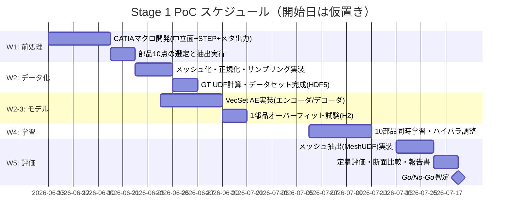
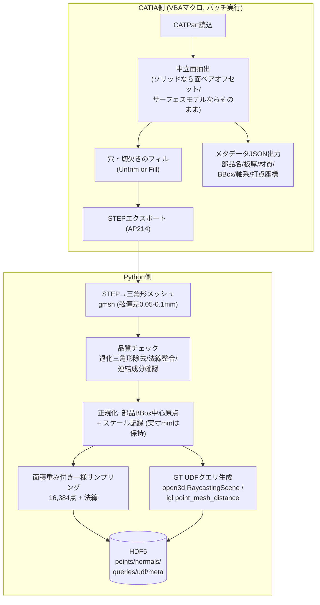
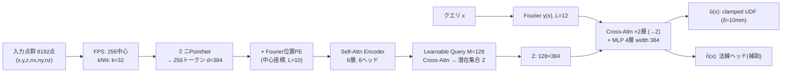

# Stage 1 PoC 詳細計画書：単部品 点群→潜在集合→UDF 再構成

**目的：板金中立面という「薄板・開曲面・微細フィーチャ（ビード/フランジ）」ドメインに対し、
点群トークン → 潜在集合 → UDFニューラルフィールドという表現系が成立するかを、
10部品・約5週間で検証し、プロジェクト全体の Go/No-Go を判断する。**

---

## 1. PoC の検証仮説

| # | 仮説 | 検証方法 |
|---|---|---|
| H1 | CATIA→中立面→点群+GT UDF の前処理が自動で回る | 10部品をマクロ＋スクリプトで人手介入なしに処理 |
| H2 | 単一部品をネットワークが「暗記」できる（表現容量の確認） | 1部品オーバーフィット試験で Chamfer < 0.1mm |
| H3 | 10部品同時学習でビード・フランジが潰れない | 断面プロファイル誤差・曲率分布で定量評価 |
| H4 | UDFから実用的な面が抽出できる | MeshUDF/射影点群で目視＋偏差マップ |

H2 が通らなければアーキテクチャの根本問題、H3 が通らなければ解像度設計の問題、と切り分けられる構成にしてある。

---

## 2. スコープ定義

### やること
- 10部品の前処理パイプライン構築（CATIA マクロ + Python）
- 小型 VecSet オートエンコーダの実装・学習（単機 GPU）
- UDF からの面抽出と定量評価、Go/No-Go 判定

### やらないこと（Stage 2 以降へ送る）
- アセンブリ・マスク学習 / テキスト条件 / 締結点トークン
- 潜在拡散化
- NURBS フィット等の CAD 逆変換（目視評価用のメッシュまで）

---

## 3. 検証用 10 部品の選定基準

難易度の階段を作る。**全部品で板厚・材質メタデータと、可能ならスポット打点座標も同時に抽出しておく**（Stage 2 の資産になる）。

| 難度 | 数 | 部品タイプ例 | 検証したい特徴 |
|---|---|---|---|
| Easy | 2 | 平板ブラケット、簡単なステー | パイプライン疎通、H2 の最初の対象 |
| Medium | 3 | ビード付きリインフォース、単純なクロスメンバ | ビード（R3〜5mm 凹凸）の保持 |
| Hard | 3 | ピラーインナー、キャラクターライン付きパネル | 自由曲面＋微細特徴の共存 |
| Stress | 2 | 深絞りパネル、フランジが密集した部品 | 法線が急変する箇所、近接2面の分離 |

選定時の注意：Stress 枠には**面同士が板厚オーダーで近接する部品**を必ず入れる。UDF は近接2面の谷を表現しにくく、ここが薄板ドメイン最大の鬼門。

---

## 4. 全体スケジュール（5週間）



クリティカルパスは W1 の CATIA マクロ。**W1 と並行して、ダミーデータ（自作の擬似板金: 平面+正弦波ビード+折り曲げフランジを trimesh で生成）でモデル実装を先行**させると、前処理遅延がモデル開発をブロックしない。

---

## 5. 前処理パイプライン詳細



### 実装上の要点

- **中立面抽出は CATIA 側で完結させる**（STEP 後の復元はフィレットで壊れやすい）。元データがサーフェスモデリングされた板金なら抽出不要でそのまま使える。最初に10部品のモデリング様式（ソリッド/サーフェス）を棚卸しすること。
- **STEP→メッシュは gmsh を推奨**（pythonocc より曲率適応メッシュの制御が楽）。ビード R3mm を保持するため弦偏差 0.05〜0.1mm、最小要素サイズ 0.5mm 程度。
- **GT UDF の計算**：open3d の `RaycastingScene.compute_distance()` は開メッシュでも符号なし距離が正しく出るため UDF にそのまま使える（`compute_signed_distance` は使わない）。
- **クエリ点サンプリング**（1部品あたり 50万点を事前計算し、学習時にランダム抽出）：
  - 70%: 表面サンプル点 + ガウシアンノイズ（σ ∈ {0.5, 2, 5} mm を 4:4:2 で混合）
  - 30%: BBox を 1.2 倍に広げた領域で一様
  - σ=0.5mm 帯を入れるのが薄板のキモ。表面ごく近傍の距離精度がビード再現を支配する。
- **座標系**：PoC は部品ローカル正規化で良いが、変換行列を保存し車体座標へ戻せるようにしておく（Stage 2 で必須）。

---

## 6. モデル仕様（PoC スケール）



| 項目 | 値 | 備考 |
|---|---|---|
| パラメータ総数 | 約 15〜25M | RTX 4090 で余裕 |
| 入力点数 / トークン数 | 8192 / 256 | ビードが消えたら 16384 / 512 へ増強 |
| 潜在集合 | M=128, d=384 | H3 失敗時の第一増強ポイント |
| Fourier 帯域 | 入力 L=10 / クエリ L=12 | 部品スケール約500mm に対し最高周波数で約0.2mm周期までカバー |
| 損失 | L1(clamped UDF) + 0.1×法線cos + 0.05×Eikonal(近傍外) | 重みは初期値、W4 で調整 |
| 学習 | AdamW lr=1e-4, cosine decay, batch=8部品×4096クエリ, AMP | 10部品なら数時間/run |

### W3 の関門：1部品オーバーフィット試験（H2）

Medium 難度 1 部品だけで損失がほぼゼロまで落ちるかを確認する。**ここで Chamfer < 0.1mm に到達しないなら、データ量の問題ではなく表現容量・周波数帯域の問題**であり、Fourier 帯域↑ / M↑ / デコーダ幅↑ を先に解決する。これが通ってから 10 部品学習に進む。

---

## 7. 面抽出と評価（W5）

### 7.1 面抽出の二段構え

1. **簡易（評価用・確実）**：グリッド点 x を `x ← x − û(x)·∇û(x)` で数回反復射影 → 表面点群を直接取得。メッシュ化せずとも偏差評価・断面評価はこれで完結する。**Go/No-Go 判定はこちらを主とする**（メッシュ抽出の出来とUDF表現の出来を分離するため）。
2. **本命（目視用）**：MeshUDF（公開実装あり）で三角形メッシュ抽出、256³ グリッド。穴あき・ノイズが出る場合は法線ヘッド出力を併用。

### 7.2 定量指標と Go/No-Go 基準

| 指標 | 計測方法 | Go 基準 | 条件付き Go | No-Go |
|---|---|---|---|---|
| Chamfer 距離 (mean) | GT サンプル点 vs 射影点群 | < 0.3mm | 0.3〜0.8mm | > 0.8mm |
| F-score @1mm | 同上 | > 95% | 90〜95% | < 90% |
| **ビード深さ再現率** | 定義断面でのプロファイル比較<br/>(GT ビード深さに対する再構成深さ) | > 85% | 70〜85% | < 70% (ビード消失) |
| **フランジ角誤差** | フランジ面の法線角度差 | < 2° | 2〜5° | > 5° |
| 近接面の分離 | Stress 部品の近接2面間で<br/>面が癒着していないか | 全部品OK | Stress のみ NG | Medium でも癒着 |

- **ビード断面評価の実装**：各部品で代表断面（ビードを横切る平面）を2〜3本事前定義し、GT と再構成の断面ポリラインを重ねて最大偏差・深さ比を算出。目視確認用に断面オーバーレイ図と偏差ヒートマップを全部品分自動出力する。
- 「条件付き Go」の場合の増強順序：①σ=0.5mm クエリ比率↑ → ②クエリ Fourier 帯域↑ → ③M=256, トークン512 → ④それでもダメならハイブリッド表現（ベース面UDF＋ビード/フランジのパラメトリックヘッド）へ転換検討。

---

## 8. 成果物・ディレクトリ構成

```
biw_poc/
├─ catia_macros/        # 中立面抽出+STEP+JSON出力 VBA
├─ data/
│  ├─ raw/              # STEP + meta JSON
│  ├─ mesh/             # gmsh出力 + 品質レポート
│  └─ dataset/          # HDF5 (points/normals/queries/udf/meta)
├─ src/
│  ├─ preprocess/       # step2mesh.py, sample.py, gt_udf.py
│  ├─ model/            # tokenizer.py, vecset_ae.py, field_decoder.py
│  ├─ train/            # train.py, overfit_test.py
│  └─ eval/             # project_surface.py, meshudf_extract.py,
│                       #   metrics.py, section_compare.py
├─ configs/             # yaml (small / large)
└─ reports/             # 断面図・偏差マップ・指標表 → Go/No-Go報告書
```

主要ライブラリ：PyTorch (CUDA), open3d, trimesh, gmsh (Python API), libigl, h5py, hydra/omegaconf。Windows + CUDA で全工程動作可（gmsh/open3d とも Windows wheel あり）。

---

## 9. リスクと先回り策

| リスク | 兆候 | 対策 |
|---|---|---|
| CATIA 中立面抽出がフィレットで失敗 | マクロのエラー多発 | 対象部品を差し替え可能に10+予備3部品選定。最悪、サーフェスモデリング済み部品のみで構成 |
| 前処理遅延がモデル開発をブロック | W1 終了時にSTEPが揃わない | W1 から擬似板金ダミーデータ（trimesh で平面+ビード+フランジを合成）でモデル開発を並行 |
| 近接面でUDFの谷が潰れる | Stress 部品のみ癒着 | PoC では「既知の限界」として記録し Stage 2 設計（部品分割粒度）に反映。閾値 δ や σ=0.5mm 比率で粘る |
| MeshUDF の穴・ノイズ | 目視メッシュが汚い | Go/No-Go は射影点群評価で判定する設計にしてあるため判定は影響なし。メッシュ品質は別課題として切り出す |
| 1部品オーバーフィット失敗 (H2) | W3 で損失が下げ止まる | 即座にハイパラ掃引（Fourier帯域/M/幅）。3日で解決しなければアーキテクチャ再検討会議 |

---

## 10. Go/No-Go 判定会議のアジェンダ（W5 末）

1. H1〜H4 の達成状況（§7.2 指標表を全10部品分）
2. 断面オーバーレイ・偏差マップの目視レビュー（特に Medium のビード、Stress の近接面）
3. 判定：
   - **Go** → Stage 2（アセンブリ・マスク学習）の計画着手。打点データの抽出状況も確認
   - **条件付き Go** → 増強順序（§7.2）で 2 週間の追加スプリント
   - **No-Go** → ハイブリッド表現（パラメトリックシート併用）への転換検討
4. 前処理工数の実測値から、本番データセット（数百〜数千アセンブリ）構築コストを見積もり
