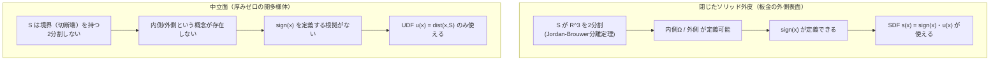
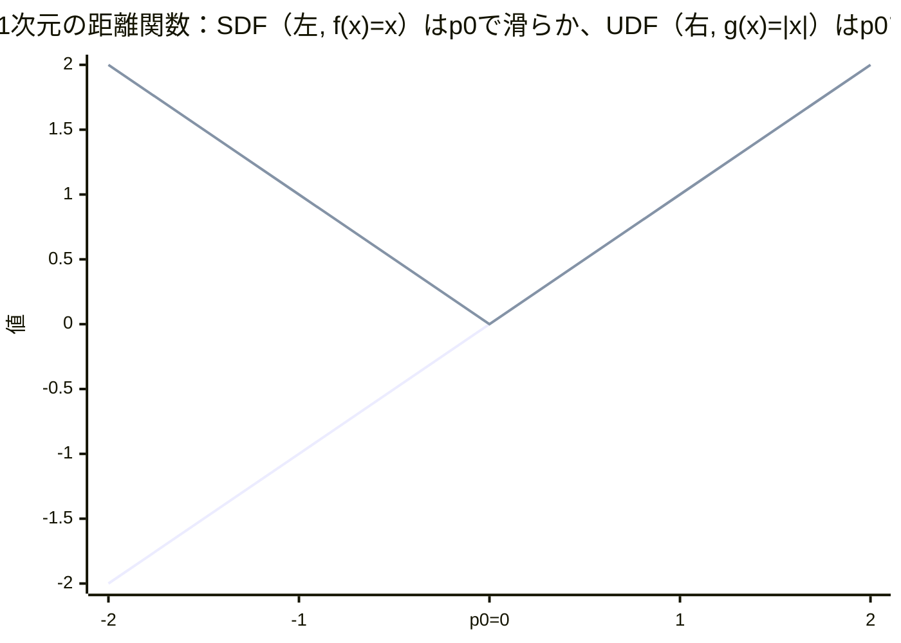
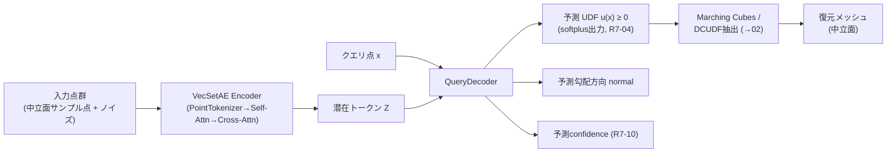

# 01. UDF（符号なし距離場）とSDF（符号付き距離場）の違い、なぜ中立面でUDFが必要か

> 対応: `archi.md` §0.3（結論）, §0I.1 / コード: `biw_poc/src/model/vecset_ae.py: QueryDecoder`, `biw_poc/src/model/dcudf_extract.py`, `biw_poc/src/model/train.py`（R7-03, R7-04）

## 1. 直感的定義

3次元空間中の点 $x$ から、ある曲面（サーフェス）$S$ までの最短距離を返す関数を **距離場 (distance field)** と呼ぶ。

- **UDF (Unsigned Distance Field)**: 距離の大きさだけを返す。常に $\ge 0$。
- **SDF (Signed Distance Field)**: 距離に「内側か外側か」の符号を付ける。曲面の内部で負、外部で正（あるいはその逆の符号規約）。

板金部品の **外皮ソリッド**（体積を持つ閉じた形状）には内側・外側が明確に定義できるので SDF が使える。しかし本プロジェクトが復元対象とする
**中立面**（板厚ゼロに潰した仮想の面、`CLAUDE.md` §13 R6-01）は厚みを持たない**開いた**面であり、「内側」が存在しない。
だから UDF を使う、というのが `archi.md` の結論である。

## 2. 数学的定義

### 記号の補足（本章で使う主な記号）

| 記号 | 意味 |
|---|---|
| $x$ | 3次元空間中の任意の点（UDF/SDFを評価する点、クエリ点） |
| $S \subset \mathbb{R}^3$ | 対象とする曲面（サーフェス）を構成する点の集合 |
| $u(x)$ | UDF（符号なし距離場）。点 $x$ から $S$ までの最短距離。常に $\ge 0$ |
| $s(x)$ | SDF（符号付き距離場）。$u(x)$ に内側/外側の符号を付けたもの |
| $\Omega$ | $S$ に囲まれた「内側」の領域（SDFの前提となる2分割の一方） |
| $\mathrm{sign}(x)$ | $x$ が内側か外側かを $\pm1$ で表す符号関数 |
| $\nabla u(x)$ | $x$ におけるUDFの勾配ベクトル（最近接点へ向かう方向） |
| $p^*(x)$ | $x$ に最も近い $S$ 上の点（最近接点） |
| $n(p_0)$ | 曲面上の点 $p_0$ における外向き単位法線ベクトル |
| $f(x)=x,\ g(x)=\lvert x\rvert$ | SDF/UDFの滑らかさの違いを説明するための1次元の補助関数 |

### 2.1 UDFの定義

曲面 $S \subset \mathbb{R}^3$ に対し、

$$
u(x) = \mathrm{dist}(x, S) = \min_{p \in S} \lVert x - p \rVert_2 \qquad (x \in \mathbb{R}^3)
$$

と定義する。定義から直ちに $u(x) \ge 0$ であり、$u(x) = 0 \iff x \in S$（$S$ が閉集合の場合）。

### 2.2 SDFの定義とその前提条件

SDF を定義するには、まず $S$ が $\mathbb{R}^3$ を「内側」$\Omega$ と「外側」$\mathbb{R}^3 \setminus \overline{\Omega}$ の2領域に分割できる必要がある。
これを保証するのが **Jordan–Brouwer分離定理**（$S$ がコンパクトで向き付け可能、かつ境界を持たない（=閉じた）埋め込み2次元多様体であること）である。
この前提のもとで

$$
s(x) = \mathrm{sign}(x) \cdot u(x), \qquad
\mathrm{sign}(x) = \begin{cases} -1 & x \in \Omega \ (\text{内側}) \\ +1 & x \notin \overline{\Omega} \ (\text{外側}) \end{cases}
$$

と定義できる。**中立面はこの前提を満たさない**。中立面は厚み方向の境界（穴埋め前の端面・切断端）を持つ**開いた多様体**であり、
「内側」「外側」という2分割そのものが存在しない。したがって $\mathrm{sign}(x)$ を定義する根拠がなく、SDFは原理的に使えない。
これが `archi.md` がUDFを採用した直接の理由であり、CLAUDE.md §13（Round 6）で発見された設計矛盾
（「板金は開いた面だからUDFを使う」と言いながら閉じたソリッドを基準形状にしていた）を解消するために、
GTの基準形状を「ソリッド外皮」から「中立面メッシュ」に変更した判断（R6-01）の数学的根拠そのものである。

### 2.3 Eikonal方程式（両者に共通する性質）

$u$, $s$ いずれも、最近接点が一意に定まる領域では

$$
\lVert \nabla u(x) \rVert = 1, \qquad \nabla u(x) = \frac{x - p^*(x)}{\lVert x - p^*(x) \rVert}
$$

を満たす（$p^*(x)$ は $x$ の $S$ 上の最近接点）。これは距離関数の特徴づけである**Eikonal方程式** $\lVert \nabla u \rVert = 1$ そのものであり、
後述の cut locus（[10_cut_locus.md](10_cut_locus.md)）はこの式が破れる場所として定義される。

### 2.4 SDFは曲面上で滑らか、UDFは曲面上でキンクを持つ（最重要の違い）

これが UDF と SDF の**性質として最も本質的な違い**である。

なめらかな点 $p_0 \in S$ の近傍で、SDF は1次近似で

$$
s(x) \approx (x - p_0) \cdot n(p_0)
$$

（$n(p_0)$ は $p_0$ における外向き単位法線）と書け、これは $x = p_0$（すなわち $S$ の上）を含めて**微分可能**である。
一方 UDF は $u(x) = |s(x)|$ の関係にあるため、$s(x) = 0$ となる点、すなわち **曲面 $S$ そのものの上で微分不可能なキンク（折れ点）を持つ**。
これは1次元の単純な類推で理解できる：

$$
f(x) = x \quad (\text{SDFの類推、なめらか}) \qquad \text{vs.} \qquad g(x) = |x| \quad (\text{UDFの類推、}x=0\text{でキンク})
$$

つまり UDF は、復元したい曲面（ゼロレベルセット）の**真上に必ず非微分可能点が乗る**という、回避不能な性質を持つ。
このことは [10_cut_locus.md](10_cut_locus.md) で扱う「学習済みUDFが境界付近でオーバーシュートする」問題（TD-16）の出発点になる。

## 3. Mermaid図

### 3.1 閉曲面 vs 開いた中立面：符号が定義できるか

### 3.2 1次元断面で見るSDFとUDFの形状の違い

曲面が1点 $p_0$ である1次元の模式（$x$軸上、$p_0=0$）で考えると：

（レンダリング環境によっては `xychart-beta` が表示されない場合がある。その場合は上記の数式 $f(x)=x$ と $g(x)=|x|$ の
グラフを紙に描いて確認すること。$f$ は原点を通る直線で滑らかに繋がるが、$g$ は原点で「V字」に折れ曲がる。）

### 3.3 本プロジェクトのデータフローにおけるUDFの位置づけ

## 4. プロジェクトでの実例

- `vecset_ae.py: QueryDecoder` の最終出力ヘッドは `softplus` を通すことで $u(x) \ge 0$ を構造的に保証している
  （UDFが非負量であるという数学的制約を、ネットワーク構造のレベルで強制している）。
- R7-04（`CLAUDE.md` §14）: `head[-1].bias[0] = -5.0` という初期化により `softplus(-5) ≈ 0.0067` とほぼゼロからスタートさせる。
  これをしないと初期状態で全クエリ点が 200〜300mm という非現実的なUDF予測になり、学習が事実上停止するという致命的バグを引き起こしていた
  （実証: 600epoch実行で `near_mae` が0.0056mmではなく390mmまで悪化）。これはUDFが「常に非負」という制約と相性の悪い初期化が
  学習力学そのものを破壊しうることを示す具体例である。
- R7-03: 学習損失はUDFの生値ではなく `clip_dist_mm`（既定5.0mm）でクランプした truncated distance loss を使う。
  これは「遠方のUDF値の正確さ」を犠牲にしてでも「ゼロレベルセット近傍の精度」を優先する設計判断であり、
  UDFが本質的に距離=0の面の情報を運ぶ場であることの帰結と言える。
- `dcudf_reconstruct.py: build_query_func()` は `model.decode(pts, z)` の戻り値 `udf` をそのままUDF値として扱い、
  `DCUDFExtractor` に渡している（[02](02_MarchingCubesとDCUDF抽出.md)で詳説）。

## 5. archi.mdとの接続

`archi.md` の `FieldEvidenceProvider`（§0A）は、学習済みネットワークの出力するUDF値を「観測（evidence）」として扱い、
それ自体を直接の真値とは見なさない設計になっている。これは本ドキュメントで示した「UDFは曲面上で原理的に非微分可能」という性質——
すなわちネットワークがその近傍で必然的に不正確になりうるという数学的事実——を設計の前提として正しく織り込んでいるためである。
この不確実性の扱いをさらに掘り下げたものが `IndependentGeometryEvidence` の `distance_to_candidate_cloud` ゲート概念であり、
[10_cut_locus.md](10_cut_locus.md) で接続する。

## 6. 自己チェック問題

1. なぜ板金の「外側表面ソリッド」にはSDFが使えて、「中立面」には使えないのか。Jordan–Brouwer分離定理の言葉で説明せよ。
2. $f(x)=x$ と $g(x)=|x|$ のアナロジーを用いて、UDFが曲面上で微分不可能である理由を1次近似の式で説明せよ。
3. Eikonal方程式 $\lVert \nabla u \rVert = 1$ が破れる点の集合にはどのような名前が付いているか（→10章で深掘り）。
4. `QueryDecoder` の出力に `softplus` を使うことの数学的意味は何か。仮に `softplus` の代わりに線形出力を使った場合、
   何が問題になるか説明せよ。

### 解答解説

1. Jordan–Brouwer分離定理は、$S$ がコンパクト・向き付け可能・境界なしの閉じた2次元多様体であるときに $\mathbb{R}^3$ を内側 $\Omega$ と外側に2分割することを保証する。外側表面ソリッドの外皮はこの条件を満たすため $\mathrm{sign}(x)$ を定義でき、SDFが使える。中立面は厚みゼロの開いた多様体で境界（切断端）を持つため分離定理の前提が崩れ、内側/外側の概念自体が存在せず $\mathrm{sign}(x)$ を定義する根拠がない。
2. なめらかな点 $p_0$ 近傍でSDFは $s(x)\approx (x-p_0)\cdot n(p_0)$ という1次近似が成り立ち、これは $x=p_0$（曲面上）を含めて微分可能（$f(x)=x$ に相当）。UDFは $u(x)=|s(x)|$ なので、$s(x)=0$ となる点（＝曲面上）で $g(x)=|x|$ と同型のV字キンクを持ち、$x=0$ で右微分と左微分が一致せず微分不可能になる。
3. cut locus（カットローカス、最近接点が一意に定まらない点の集合）。10章で詳説する。
4. $\mathrm{softplus}(z)=\ln(1+e^z)$ は常に正の値を返す単調増加関数であり、UDFが定義上非負（$u(x)\ge 0$）であるという数学的制約をネットワークの出力層構造そのもので保証する。線形出力では負のUDF値を予測しうる（数学的に無意味）上、非負制約を別途課す必要があり保証が弱くなる。さらにR7-04のように、softplusでは初期化（バイアス）の選び方が学習の収束性に直接影響する（`bias=-5` で `softplus(-5)≈0` からスタートさせる工夫）。

## 7. 次に読むもの

- [02_MarchingCubesとDCUDF抽出.md](02_MarchingCubesとDCUDF抽出.md): このUDFから実際にメッシュを取り出す方法
- [10_cut_locus.md](10_cut_locus.md): UDFの非微分可能性がもたらす実害（TD-16）
