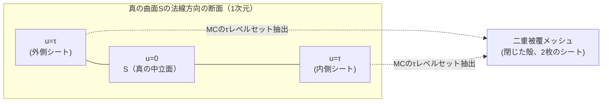
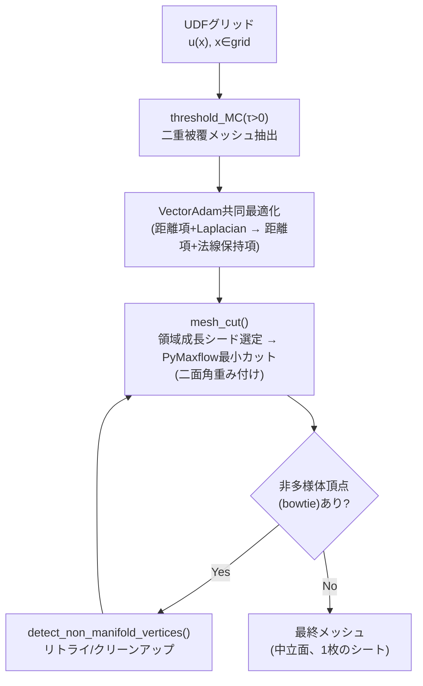

# 02. Marching Cubes / DCUDF抽出

> 対応: `archi.md` §0G（研究選択肢） / コード: `biw_poc/src/model/dcudf_extract.py`（643行、フルポート）, `biw_poc/src/model/dcudf_reconstruct.py`
> 出典論文: Hou et al., *"Robust Zero Level-Set Extraction from Unsigned Distance Fields Based on Double Covering"*, SIGGRAPH Asia 2023 (arXiv:2310.03431)

## 1. 概要

[01](01_UDFとSDF.md)で見たように、ネットワークはUDF値 $u(x)$ を3次元グリッド上の任意の点で予測できる。
このグリッド上のスカラー場から実際の三角形メッシュ（曲面）を取り出す処理が本章のテーマである。
古典的な **Marching Cubes (MC)** はSDF（符号付き）を前提に設計されたアルゴリズムであり、UDF（符号なし、常に非負）に
そのまま適用すると「ゼロ交差」が存在しないため失敗する。DCUDFはこの問題を、**ゼロではない小さな正の閾値でMCを行い、
得られる「二重被覆（double cover）」を1枚のシートに分割する**という発想で解決する。

## 2. Marching Cubesの基礎（古典アルゴリズム）

### 記号の補足（本章で使う主な記号）

| 記号 | 意味 |
|---|---|
| $f$ | グリッド上に定義された一般のスカラー場（MCが等値面を抽出する対象） |
| $\tau$ | 閾値（しきい値）。等値面 $\Sigma_\tau$ を定義するレベル値 |
| $\Sigma_\tau$ | レベルセット（等値面）。$f(x)=\tau$ を満たす点の集合 |
| $v_0,\dots,v_7$ | MCの1セル（立方体）の8頂点 |
| $t$ | エッジ上の線形補間パラメータ（$t\in[0,1]$） |
| $u(x)$ | UDF（[01](01_UDFとSDF.md)参照）。DCUDFではMCの入力スカラー場として使われる |
| $\lambda_{\text{lap}}$ | Laplacian正則化項の重み係数 |
| $w_i$ | 頂点ごとの重み（Laplacian項で使用） |
| $L(x)_i$ | 頂点 $i$ における離散一様Laplacian（隣接頂点平均との差分） |
| $g_1, g_2$ | VectorAdamの1次・2次モーメント推定値 |
| $\beta_1, \beta_2$ | モーメント推定の指数移動平均の減衰率 |
| $\hat m_1, \hat m_2$ | バイアス補正後のモーメント推定値 |
| $\mathrm{lr}, \varepsilon$ | 学習率、ゼロ割防止のための微小定数 |

### 2.1 問題設定

正則グリッド上に定義されたスカラー場 $f: \mathbb{R}^3 \to \mathbb{R}$ から、等値面（レベルセット）

$$
\Sigma_\tau = \{x \in \mathbb{R}^3 \mid f(x) = \tau\}
$$

を三角形メッシュとして抽出する。

### 2.2 アルゴリズム

1. グリッドを単位立方体（セル）に分割し、各セルの8頂点でのスカラー値 $f(v_0), \dots, f(v_7)$ を評価する。
2. 各頂点を $f(v_i) > \tau$（外側）か $f(v_i) \le \tau$（内側）かで2値分類する。$2^8 = 256$ 通りの符号パターンが存在し、
   対称性により本質的に15通り（回転・鏡映同型を除く）のケーステーブルに帰着する。
3. 符号が異なる頂点を結ぶ各エッジ上で、線形補間によりゼロ交差点を求める：

$$
t = \frac{\tau - f(v_0)}{f(v_1) - f(v_0)}, \qquad p = v_0 + t \,(v_1 - v_0), \qquad t \in [0, 1]
$$

4. ケーステーブルに従い、これらのエッジ交差点を結んで三角形を生成する。

### 2.3 UDFへの適用が難しい理由

UDFは常に $u(x) \ge 0$ であり、$\tau = 0$ で MC を実行しても「$f(v_i) > 0$ かつ $f(v_j) \le 0$」となるエッジが
（曲面上の測度ゼロの点を除き）存在しない。つまり符号パターンが常に「全頂点が外側」になり、メッシュが抽出できない。

## 3. DCUDFの設計

### 3.1 ステップ1: `threshold_MC()` — 小さな正の閾値での抽出（二重被覆）

$\tau = 0$ の代わりに小さな正の値 $\tau > 0$ を選び、$\Sigma_\tau = \{x \mid u(x) = \tau\}$ を抽出する。
[01](01_UDFとSDF.md)で見た「UDFは曲面上でV字キンクを持つ」性質を思い出すと、真の曲面 $S$（$u=0$）の**両側**に
$u(x) = \tau$ となる点が存在する（V字の谷の左右両斜面が同じ高さ $\tau$ を取る2点に対応）。
したがって $\Sigma_\tau$ は $S$ を内外から挟み込むように覆う**閉じた殻**となり、これを **二重被覆 (double cover)** と呼ぶ。
`dcudf_extract.py: threshold_MC(ndf, threshold, resolution, ...)` は `skimage.measure.marching_cubes` をこの閾値で呼び出し、
グリッドのインデックス空間から実座標空間への再スケール・並進を行って二重被覆メッシュを返す。

### 3.2 ステップ2: 共同最適化（VectorAdamによる頂点位置の精緻化）

二重被覆の各シートはまだ $u = \tau > 0$ の位置にあり、真の曲面 $u=0$ には乗っていない。これを `VectorAdam` オプティマイザで
反復的に $u(x) \to 0$ へ寄せる。

**損失関数（最適化の前半、`iter <= normal_step`）:**

$$
\mathcal{L} = \underbrace{\frac{1}{N}\sum_i u(x_i)}_{\text{距離項（曲面へ吸着）}}
+ \lambda_{\text{lap}} \underbrace{\frac{1}{N}\sum_i w_i \, \lVert L(x)_i \rVert^2}_{\text{Laplacian正則化（滑らかさ）}}
$$

ここで $L(x)_i$ は頂点 $i$ における離散一様Laplacian（`laplacian_calculation()`, `trimesh.vertex_neighbors` から構築した
隣接頂点平均との差分）であり、メッシュが局所的にギザギザにならないよう抑制する役割を持つ。

**損失関数（最適化の後半、`iter > normal_step`、法線保持項に切り替え）:**

$$
\mathcal{L} = u(\text{mid}) + 0.5 \, \lVert \mathrm{cross}(\text{offset}, \text{normal}) \rVert
$$

中点 `mid` と、最適化開始時に固定キャプチャした面法線 `normal` を使い、頂点の移動量 `offset` が法線方向の情報を
壊さないように拘束する。前半でLaplacianにより大域的な滑らかさを確保し、後半で局所的な形状（法線）の忠実性に
焦点を移す、という2段階戦略になっている。

**VectorAdamの数式（標準Adamとの違い）:**

標準Adamは座標 $x, y, z$ それぞれに**独立**な二次モーメント推定を行うため、勾配の方向が座標軸ごとの分散の違いで歪められる
（更新方向が真の勾配方向からずれる）。VectorAdamは頂点ごとに**1つ**のノルムでまとめて正規化することで、更新方向を真の勾配方向に保つ：

$$
g_1 \leftarrow \beta_1 g_1 + (1-\beta_1)\,\nabla, \qquad
\lVert \nabla \rVert \text{（頂点ごと、xyz軸方向に対するL2ノルム）}
$$
$$
g_2 \leftarrow \beta_2 g_2 + (1-\beta_2)\,\lVert \nabla \rVert^2 \quad (\text{xyz3成分にブロードキャスト})
$$
$$
\hat{m}_1 = \frac{g_1}{1-\beta_1^t}, \quad \hat{m}_2 = \frac{g_2}{1-\beta_2^t}, \qquad
\Delta x = -\,\mathrm{lr} \cdot \frac{\hat{m}_1}{\varepsilon + \sqrt{\hat{m}_2}}
$$

通常のAdamでは分母が3成分独立（$\sqrt{\hat m_{2,x}}, \sqrt{\hat m_{2,y}}, \sqrt{\hat m_{2,z}}$）だが、VectorAdamでは
3成分とも同じスカラー $\sqrt{\hat m_2}$（ベクトルノルム由来）で割るため、更新ベクトルの**向き**が一次モーメント
$\hat m_1$（＝勾配方向そのもの）から変化しない。メッシュ最適化では「頂点をどの方向に動かすか」という幾何的な
方向の正しさが重要なので、この性質が必要になる。

### 3.3 ステップ3: `mesh_cut()` — 二重被覆を1枚のシートに分割

最適化後も二重被覆は閉じた殻（2枚のシート）のままである。これを真の中立面（1枚のシート）に変換するため、
グラフ最小カット（`PyMaxflow` の `maxflow`）を用いる。

1. **シード選択**: `compute_neighbor()` によるBFS（幅優先探索）的な領域成長で、source側・sink側それぞれの
   初期領域（シード面の集合）をランダムに選ぶ（`region_rate` で領域サイズを制御）。
2. **カットの重み付け**: 隣接する面同士のエッジに対し、**二面角（dihedral angle）の逆数的な重み**を与える。
   二重被覆の「リム」（2枚のシートが鋭く折り返る境界、すなわち中立面の輪郭線に対応する場所）は二面角が小さい
   （鋭い折れ）ので、そこをカットしやすいように重みを設計する。
3. **PyMaxflowによるグローバル最小カット**: source/sinkの2集合に分けるグラフ分割問題として解き、
   切断面（=リム）に沿ってメッシュを2枚に分離する。
4. **失敗時のリトライとクリーンアップ**: カット結果が偶然ねじれて非多様体（"bowtie"頂点、[04](04_メッシュのトポロジー記述.md)参照）
   を生んだ場合、`detect_non_manifold_vertices()` で検出し、リトライまたは後処理クリーンアップを行う。

## 4. プロジェクトでの実例

- `dcudf_extract.py: class DCUDFExtractor` がここまでの全ステップ（`extract_fields()` → `optimize()`）を統合している。
- `dcudf_reconstruct.py: build_query_func()` は学習済み `VecSetAE` の `model.decode()` を `DCUDFExtractor` が要求する
  `query_func(pts) -> udf` のインターフェースに適合させるアダプタである。ここでネットワークパラメータは
  `requires_grad_(False)` で凍結しつつ、クエリ点側には勾配を流す（`optimize()` の逆伝播が点の位置を更新するため）。
- `dcudf_reconstruct.py: main()` のデフォルト引数は DCUDF 公式README の参照点（解像度256・閾値0.005・Laplacian重み2000）を
  本プロジェクトの解像度（既定96）に線形にリスケールして決めている。
- これは `reconstruct.py` の旧来パイプライン（R7-06〜R7-15、ランクベース候補選択 + `pyvista.reconstruct_surface()`）を
  置き換えるものとして導入された。旧方式が抱えていた「再構成メッシュの局所的な不整合」をR7-15のLaplacian平滑化では
  十分に解消できなかったため、より理論的に正しいDCUDFへ移行した、という経緯がある。

## 5. archi.mdとの接続

`archi.md` §0G は複数の研究的選択肢（DCUDF, MeshUDF, CAP-UDF, DUDFなど）をUDFからのメッシュ抽出手法の候補として
整理している。DCUDFは現時点でこのプロジェクトに実装済みの唯一の手法であり、`FieldEvidenceProvider` が出力するUDF場を
具体的な幾何（メッシュパッチ）に変換する役割を担う。一方で `mesh_cut()` のカット位置決定（境界・リムの推定）は、
[10_cut_locus.md](10_cut_locus.md) で扱う「UDFが境界付近で非微分可能になる」問題と無関係ではなく、
カットの精度がそのままTD-16（境界オーバーシュート）の影響を受けうる点に注意が必要である。

## 6. 自己チェック問題

1. なぜ古典的Marching Cubesを $\tau=0$ のままUDFに適用できないのか。UDFの符号の性質から説明せよ。
2. 「二重被覆」が生じる理由を、[01](01_UDFとSDF.md)で導出した「曲面上でのUDFのV字キンク」と結びつけて説明せよ。
3. VectorAdamが標準Adamと異なる点を、更新ベクトルの「向き」の観点で説明せよ。
4. `mesh_cut()` がなぜ二面角を重みに使うのか。二重被覆の幾何的構造（リムの形状）から理由を述べよ。

### 解答解説

1. UDFは常に $u(x)\ge 0$ であり、$\tau=0$ では符号が異なるエッジ（$f(v_i)>0$ かつ $f(v_j)\le 0$）が（測度ゼロの特殊な点を除き）存在しない。MCは符号の異なる頂点ペアからゼロ交差点を補間する仕組みなので、そもそも適用できない。
2. UDFは曲面 $S$ 上でV字キンクを持つため、$S$ の両側（谷の左右斜面）で同じ高さ $\tau$ に達する2点が存在する。$\tau>0$ で $\Sigma_\tau$ を取ると、$S$ を内外から挟む閉じた殻（二重被覆）になる。
3. 標準Adamは $x,y,z$ 座標それぞれ独立な二次モーメントで正規化するため、更新方向が成分ごとに歪みうる。VectorAdamは頂点ごとに1つのノルムでまとめて正規化するため、更新ベクトルの向きが一次モーメント（勾配方向）から変化しない。
4. 二重被覆の「リム」（2枚のシートが折り返る境界＝中立面の輪郭線に対応）では、隣接面同士の二面角が小さい（鋭く折れ曲がっている）。最小カットはコストの小さいエッジを優先的に切るため、二面角が小さいエッジほど切れやすいよう重みを設計することで、カットがリムに沿いやすくなる。

## 7. 次に読むもの

- [04_メッシュのトポロジー記述.md](04_メッシュのトポロジー記述.md): `detect_non_manifold_vertices()` のbowtie判定アルゴリズム
- [10_cut_locus.md](10_cut_locus.md): カット位置の精度に影響する境界特異点の問題
