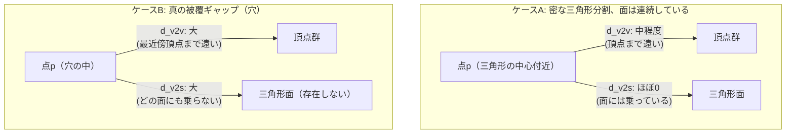

# 03. point-to-surface距離 vs point-to-vertex距離

> 対応: `archi.md` §0E.1（評価設計） / コード: `biw_poc/src/model/dcudf_reconstruct.py: surface_distances_vertex_nn(), surface_distances_true()`, `biw_poc/src/model/diagnose_holes.py`

## 1. 概要

復元メッシュとGT（正解）メッシュの間の「ズレ」を測る指標は評価設計の根幹であるが、同じ「距離」という言葉でも
測り方によって全く異なる数値・異なる結論を導くことがある。本プロジェクトではR7-13（`CLAUDE.md` §17）でこの違いが
実際に診断結果を誤らせていたことが判明している。

## 2. 数学的定義

### 記号の補足（本章で使う主な記号）

| 記号 | 意味 |
|---|---|
| $M_b=(V_b,F_b)$ | 比較対象のメッシュ（頂点集合 $V_b$ と面集合 $F_b$ の組） |
| $p$ | 評価点（距離を測る側の点） |
| $d_{v2v}(p,M_b)$ | point-to-vertex距離。$p$ から $M_b$ の最近傍**頂点**までの距離 |
| $T=(v_0,v_1,v_2)$ | 三角形（3頂点とその張る面・辺・内部を含む凸包） |
| $\mathrm{dist}(p,T)$ | $p$ から三角形 $T$（面）への最近接点までの距離 |
| $d_{v2s}(p,M_b)$ | point-to-surface距離。$p$ から $M_b$ の最近傍**面**までの距離 |

### 2.1 point-to-vertex距離（最近傍頂点距離）

メッシュ $M_b = (V_b, F_b)$ に対し、点 $p$ からの距離を

$$
d_{v2v}(p, M_b) = \min_{v \in V_b} \lVert p - v \rVert_2
$$

と定義する。これは「メッシュの**頂点**の集合」を点群とみなし、最近傍探索（典型的には `scipy.spatial.cKDTree`）で
求める距離である。実装上もっとも簡単で高速だが、後述のとおりメッシュの三角形分割密度に依存したバイアスを持つ。

### 2.2 point-to-surface距離（真の最近接点距離）

三角形 $T = (v_0, v_1, v_2)$ への最近接点までの距離を

$$
\mathrm{dist}(p, T) = \min_{q \in T} \lVert p - q \rVert_2
$$

と定義する（$T$ は三角形の**内部・辺・頂点を含む面そのもの**、3頂点のなす凸包）。これはまず $p$ を三角形が乗る平面へ
直交射影し、その射影点が三角形の内部に収まっていればそれが最近接点、収まっていなければ最も近い辺（さらにその辺上の
区間にクランプした点、あるいは頂点）が最近接点になる（Ericsonの重心座標クランプ法に代表される標準的算法。
本プロジェクトでは `trimesh.proximity.closest_point()` がこれを実装している）。
メッシュ全体への距離は全三角形にわたる最小値：

$$
d_{v2s}(p, M_b) = \min_{T \in F_b} \mathrm{dist}(p, T)
$$

常に $d_{v2s}(p, M_b) \le d_{v2v}(p, M_b)$ が成り立つ（三角形内部・辺上の点は頂点よりも $p$ に近いか等しいため）。

## 3. なぜ違う結論を出しうるか

三角形の**中心付近**にある点 $p$ を考える。$p$ から3頂点までの距離はどれも比較的大きいが、$p$ から三角形の面
（辺や内部を含む）までの距離はほぼゼロになりうる。つまり、

- メッシュの三角形分割が**粗い**（辺長が長い）ほど、$d_{v2v}$ は実際のカバレッジとは無関係に**大きく**なる
  （単に頂点同士が離れているだけなのに「穴」のように見えてしまう＝**補間誤差**を**被覆ギャップ**と混同する）。
- 逆に、メッシュが本当に欠落している領域（三角形が存在しない領域）では $d_{v2s}$ も大きくなる——こちらが**真の被覆ギャップ**。



ケースAでは $d_{v2v}$ だけを見ると「ここに大きな誤差／穴がある」と誤診断しうるが、$d_{v2s}$ を見れば実際には
カバレッジは問題ないと正しく判定できる。ケースBでは両方の指標が一致して大きな値を示す。

## 4. プロジェクトでの実例

`dcudf_reconstruct.py` には両方の実装が並置されている。

```python
def surface_distances_vertex_nn(mesh_a, mesh_b, n_sample=N_SAMPLE):
    """validate_refine.py's metric: sample(a)'s surface -> nearest VERTEX of b."""
    pa, _ = trimesh.sample.sample_surface(mesh_a, n_sample)
    tree_b = cKDTree(mesh_b.vertices)
    d, _ = tree_b.query(pa, k=1)
    ...

def surface_distances_true(mesh_a, mesh_b, n_sample=N_SAMPLE, chunk=2000):
    """True point-to-SURFACE distance ... chunked: trimesh's candidate-triangle
    broadcast can spike memory by orders of magnitude on some point batches."""
    pa, _ = trimesh.sample.sample_surface(mesh_a, n_sample)
    d_parts = []
    for i in range(0, len(pa), chunk):
        _, d_i, _ = trimesh.proximity.closest_point(mesh_b, pa[i:i + chunk])
        d_parts.append(d_i)
    ...
```

`surface_distances_true()` がチャンク分割（`chunk=2000`）しているのは実装上の注意点として重要である。
`trimesh.proximity.closest_point()` は候補三角形との距離計算を内部でブロードキャストするため、
点数が多いとメモリ使用量が急増する（実証例: 5万点 × 64,829面のメッシュで `(116M, 3)` の `float64` 配列確保が
発生しかけた）。これは「数学的に正しい指標ほど計算コストの管理が難しい」という典型例である。

**R7-13（`CLAUDE.md` §17）での発見**: 「虫食い」（GT→Recon方向の被覆穴）を頂点間最近傍距離で診断していたところ、
真のpoint-to-surface距離に切り替えて測定し直すと結果が変わり、当初の仮説（pruneルールのみが原因）は
「部分的にしか正しくない」と判明した（`prune=None` でも真の穴 $>1\mathrm{mm}$ が49.4%残存）。
これにより、穴の主要因が三角形分割密度（`refine_rounds`）にもあることが正しく特定できた。
`diagnose_holes.py` はこの教訓を踏まえ、GT→Recon方向の被覆穴診断専用ツールとして実装されている。

## 5. archi.mdとの接続

`archi.md` §0E.1 の評価器仕様は、本番の評価指標として point-to-surface 方式のサンプリングを正式採用し、
point-to-vertex（最近傍頂点）方式は**デバッグ専用**と明確に位置づけている。これは本章で示した通り、
vertex-NN方式が「メッシュ密度由来の補間誤差」と「本物の被覆ギャップ」を区別できないという欠陥を持つためであり、
これを本番評価指標として使うと、密度を上げるだけで（実際の幾何精度が変わらなくても）見かけの誤差が改善する、
という評価のごまかしが可能になってしまう。

## 6. 自己チェック問題

1. 三角形の中心付近にある点で $d_{v2v} \gg d_{v2s}$ となる理由を図で説明せよ。
2. なぜ常に $d_{v2s}(p, M) \le d_{v2v}(p, M)$ が成り立つのか、三角形 $T$ の定義（頂点・辺・内部を含む凸包）から示せ。
3. R7-13で「pruneルールのみが穴の原因」という当初仮説が部分的にしか正しくなかった理由を、本章の枠組みで説明せよ。
4. `surface_distances_true()` がチャンク分割を必要とする理由を、計算量（点数×候補三角形数のブロードキャスト）の
   観点から説明せよ。

### 解答解説

1. 三角形の中心付近の点 $p$ は3頂点いずれからもそれなりに離れているため $d_{v2v}$ は中程度〜大きい値になるが、その点は三角形の面（内部）に乗っているので $d_{v2s}$ はほぼゼロになる。図でいうケースA（密な三角形分割、面は連続）に該当する。
2. 三角形 $T$ は頂点・辺・内部を含む凸包として定義されるため、頂点集合 $V_b$ は $T$ の部分集合（$V_b \subset T$ を構成する点）である。$\mathrm{dist}(p,T)$ は $T$ 全体（頂点を含む）にわたる最小値なので、頂点だけにわたる最小値である $d_{v2v}$ 以下、すなわち $d_{v2s} \le d_{v2v}$ が常に成り立つ。
3. pruneを完全無効化しても真の穴（$>1\mathrm{mm}$）が49.4%残存しており、pruneルール以外の要因（三角形分割密度＝`refine_rounds`）も穴の主要因であることが、頂点間距離ではなく真のpoint-to-surface距離で測り直して初めて判明したため。
4. `trimesh.proximity.closest_point()` は候補三角形との距離計算を内部でブロードキャストするため、メモリ使用量が点数×候補三角形数に比例して急増する（実証例: 5万点×64,829面で`(116M,3)`規模の配列確保が発生しかけた）。`chunk=2000`ずつに分けて処理することでメモリスパイクを防いでいる。

## 7. 次に読むもの

- [04_メッシュのトポロジー記述.md](04_メッシュのトポロジー記述.md): メッシュの「穴」を構造的に記述する境界ループの概念
- [06_chord_deviation弦偏差誤差.md](06_chord_deviation弦偏差誤差.md): 点ではなく辺の中点を使う、別の誤差評価の考え方
