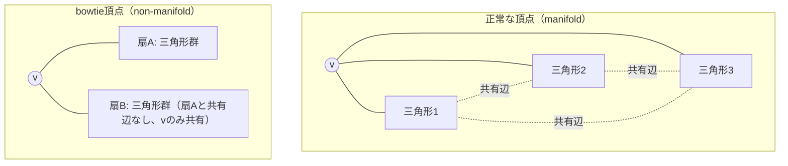
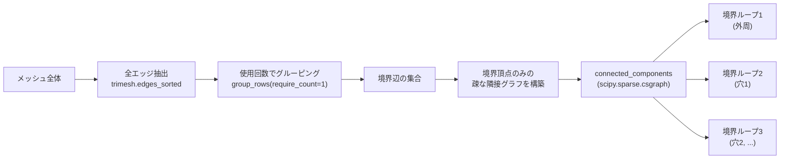

# 04. メッシュのトポロジー記述（non-manifold, 自己交差, Euler標数, genus, connected component, boundary loop）

> 対応: `archi.md` §0A.3-E（Hard reject条件）, §0E.1 / コード: `biw_poc/src/model/verify_topology_patch.py`, `biw_poc/src/model/dcudf_extract.py: detect_non_manifold_vertices()`, `biw_poc/src/model/diagnose_outliers.py: boundary_vertices()`, `biw_poc/src/model/reconstruct.py: orient_components_consistently()`

## 1. 概要

メッシュは単なる頂点・三角形の集合ではなく、それらの**接続関係（コネクティビティ）**が幾何の妥当性を左右する。
本章では「正しいメッシュ」とは何かを構造的に定義する語彙を整理する。

## 記号の補足（本章で使う主な記号）

| 記号 | 意味 |
|---|---|
| $v$ | メッシュ上の1頂点 |
| $V, E, F$ | メッシュの頂点数・辺数・面数 |
| $\chi$ | Euler標数（$\chi=V-E+F$） |
| $g$ | 種数（genus）。直感的には貫通穴（ハンドル）の数 |
| $b$ | 境界ループの個数（穴・外周の輪郭線の本数） |

## 2. Manifold / Non-manifold

三角形メッシュが**多様体 (manifold)** であるとは、各頂点の近傍が（境界上の頂点を除き）円盤と同相であること、
すなわち各頂点の周りの三角形たちが**単一の連続した扇（fan）**を成すことを意味する。これが破れた頂点を
**非多様体頂点 (non-manifold vertex)** と呼び、特に2つ以上の独立した扇が1点だけを共有して接触している形を
俗に **"bowtie"（蝶ネクタイ）頂点** と呼ぶ。

`dcudf_extract.py: detect_non_manifold_vertices()` の判定アルゴリズム（要約）:

1. 各頂点 $v$ について、$v$ を含む全三角形を集める。
2. それらの三角形を、$v$ 以外のもう1頂点（"other"頂点）の隣接関係で局所インデックス化し、共有辺でグラフを構成する。
3. **Union-Find**（素集合データ構造）でこのグラフの連結成分を求める。
4. 連結成分が2つ以上あれば、$v$ は非多様体頂点（bowtie）と判定する。

## 3. Euler標数とgenus

任意の閉じた向き付け可能な多様体メッシュ（境界なし、種数 $g$）について、頂点数 $V$、辺数 $E$、面数 $F$ の間に
次の関係（**Euler標数**）が成り立つ：

$$
\chi = V - E + F = 2 - 2g
$$

境界（穴）を $b$ 個持つ開いたメッシュ（境界付き多様体）の場合は一般化されて

$$
\chi = V - E + F = 2 - 2g - b
$$

となる。具体例: 円盤（$g=0, b=1$）は $\chi=1$、球面（$g=0, b=0$）は $\chi=2$、トーラス（$g=1, b=0$）は $\chi=0$。
種数 $g$ は直感的には「メッシュに開いている貫通穴（ハンドル）の数」であり、$\chi$ と $b$（境界ループ数）が分かれば

$$
g = \frac{2 - b - \chi}{2}
$$

として逆算できる。これは `archi.md` §0A.3-Eが「保護すべきEuler標数」を不変条件として扱う理由——
すなわち、ある復元パッチ操作の前後でトポロジー的な構造（穴の数や種数）が意図せず変化していないかを、
頂点・辺・面の単純な数え上げから検証できる、という実務上の利点に直結する。

## 4. Connected component（連結成分）：頂点連結 vs 面連結

連結成分には2つの定義があり、**一致しない場合がある**点に注意が必要である。

- **面連結（face-connected / edge-connected）**: 辺を共有する三角形同士を繋ぐ。`trimesh.split()` の既定動作。
- **頂点連結（vertex-connected）**: 頂点を共有するだけ（辺は共有しない）でも繋がっているとみなす。

2つのメッシュ片が**1点だけ**で接触している（まさに bowtie の状況）場合、面連結では別成分だが頂点連結では同一成分になる。
`archi_audit.md` の監査で指摘された通り、`trimesh` の既定の `split()` は面/辺ベースであるため、
1点接触のような病的なケースを見逃しうる。これに対応するには、頂点同士の隣接グラフを明示的に構築する必要がある。

## 5. Boundary loop（境界ループ）の抽出

ある辺が**ちょうど1つの面**にしか使われていなければ、それは**境界辺 (boundary edge)** である
（多様体メッシュでは内部辺は必ず2面に共有される）。`verify_topology_patch.py: boundary_loops()` の実装は：

1. `trimesh.edges_sorted` で全エッジを取得し、`trimesh.grouping.group_rows(edges_sorted, require_count=1)` で
   「使用回数がちょうど1」の境界辺だけを抽出する。
2. 境界辺が触れる頂点だけを対象にした疎な隣接グラフ（sparse adjacency graph）を構築する。
3. `scipy.sparse.csgraph.connected_components` でこのグラフの連結成分を求める——各連結成分が1つの**境界ループ**
   （穴の輪郭線、あるいは外周線）に対応する。

`diagnose_outliers.py: boundary_vertices()` も同様の発想（`require_count=1` の境界辺を集める）で、より単純に
「境界に属する頂点の集合」だけを返す簡易版を提供している。

## 6. 自己交差 (self-intersection)

メッシュの**異なる**2つの三角形（隣接しない、辺・頂点を共有しない組）が3次元空間中で交差すること。
物理的に存在しえない形状（板が自分自身を貫通している）を意味し、`archi.md` §0A.3-E の Hard reject 条件の一つになっている。
（本プロジェクトのコードベースでは専用の自己交差検出関数は確認できておらず、現状は概念定義のみ。）

## 7. プロジェクトでの実例

- **R9-01（`CLAUDE.md` §16）**: `patch_isolated_invalid_vertices()` というトポロジーパッチにより、
  body002のGT境界ループ数が **211 → 71（-66%）** に減少した（孤立した無効頂点を周囲80%以上が有効なら補間で埋める処理）。
  これは「境界ループ数」という本章で定義した指標が、実際の品質改善の定量評価に使われた具体例である。
  ただしStage Cの最終復元精度には統計的に有意な改善をもたらさなかった（R9-01、5seed×2条件のt検定で棄却）。
- **`reconstruct.py: orient_components_consistently()`**: VTKの法線一貫性処理（`compute_normals(consistent_normals=True)`）
  は**単一の連結成分内でしか**法線の向きを伝播しないことが実証された（body002で38個の連結成分が確認され、
  バックフェースカリングのもとでメッシュ面積の約半分が裏向きに見えるバグの原因になっていた——
  頂点位置自体は幾何的に正しいにもかかわらず、である）。これは本章の「連結成分」概念が実際のレンダリング不具合の
  根本原因究明に直結した具体例であり、[05_メッシュ品質指標.md](05_メッシュ品質指標.md)の「反転面」の話とも繋がる。

## 8. archi.mdとの接続

`archi.md` §0A.3-E は `DeterministicSafetyKernel` の Hard reject 条件として、non-manifold edge/vertex の発生、
保護されたEuler標数からの逸脱、自己交差の発生を列挙している。これらはいずれも本章で定義した語彙そのものであり、
GHMRのリファインメント操作（[09](09_remeshing操作split_collapse_flip.md)参照）が「幾何的には妥当でも
トポロジー的に壊れたメッシュ」を生成しないことを機械的に保証するための判定基準になっている。

## 9. 自己チェック問題

1. bowtie頂点の定義を、「単一の連続した扇」という言葉を使って説明せよ。`detect_non_manifold_vertices()` の
   Union-Findによる判定がこれをどう検出するか述べよ。
2. 円盤・球面・トーラスそれぞれのEuler標数を、$\chi = 2-2g-b$ の式から導出せよ。
3. 頂点連結と面連結が異なる結果を与える具体的な形状の例を1つ挙げよ。
4. `boundary_loops()` のアルゴリズムにおいて、なぜ「使用回数がちょうど1のエッジ」が境界辺の判定条件になるのか、
   多様体メッシュの性質から説明せよ。
5. R9-01のトポロジーパッチが境界ループ数を66%削減したにもかかわらず最終精度を改善しなかった、という結果から
   何が学べるか（TD-16の主要因に関する仮説検証の文脈で）述べよ。

### 解答解説

1. bowtie頂点とは、頂点 $v$ の周りの三角形群が「単一の連続した扇」を成さず、2つ以上の独立した扇が $v$ のみを共有して接触している状態。`detect_non_manifold_vertices()` は $v$ を含む全三角形を、$v$ 以外のもう1頂点の隣接関係で局所インデックス化し共有辺でグラフ化、Union-Findで連結成分を求める。連結成分が2つ以上あればbowtieと判定する（1つの連続した扇なら連結成分は1つにまとまるはず）。
2. 円盤: $g=0,b=1$ → $\chi=2-0-1=1$。球面: $g=0,b=0$ → $\chi=2-0-0=2$。トーラス: $g=1,b=0$ → $\chi=2-2-0=0$。
3. 2つのメッシュ片が1点だけで接触している（bowtie頂点の状況）場合。面連結（辺共有）では別成分だが、頂点連結（頂点共有のみ）では同一成分とみなされる。
4. 多様体メッシュでは内部辺は必ず2つの三角形に共有される（使用回数2）。使用回数1のエッジは片側にしか面がない＝メッシュの縁（境界）にあたるため、これを境界辺の判定条件にできる。
5. GT側のトポロジー指標（境界ループ数）の改善と、Stage Cの最終復元精度の改善は独立でありうるという教訓。これにより、TD-16の支配的要因がGTのトポロジー断片化ではなく、cut locus（UDFの境界における非微分可能性）にあるという仮説が補強された（5seed×2条件のt検定で有意差なし、R9-01）。

## 10. 次に読むもの

- [05_メッシュ品質指標.md](05_メッシュ品質指標.md): トポロジーが正しくても「歪んだ」メッシュをどう測るか
- [09_remeshing操作split_collapse_flip.md](09_remeshing操作split_collapse_flip.md): トポロジーを変更する操作そのもの
