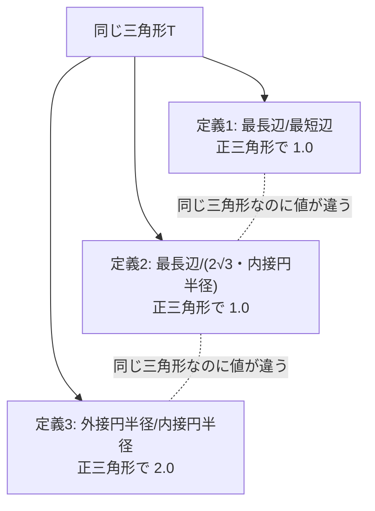
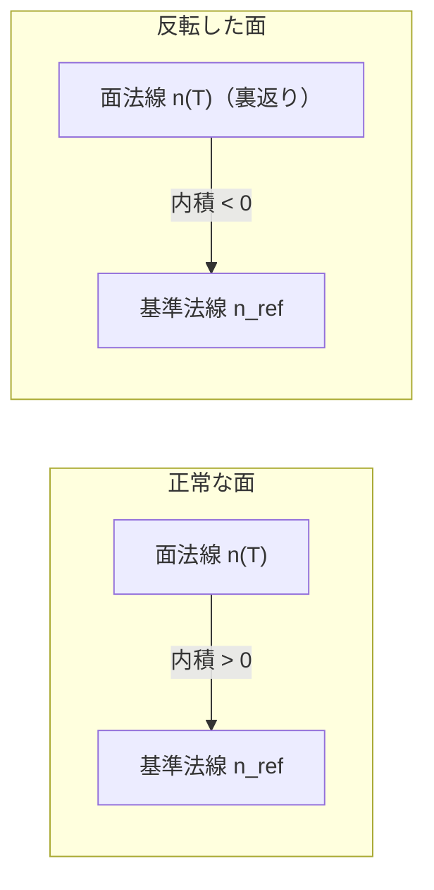

# 05. メッシュ品質指標（最小角, aspect ratio, 反転, 面積比）

> 対応: `archi.md` §0B.4（mesh quality gate） / コード: **現時点で専用の実装は存在しない**
> （`aspect_ratio|min_angle|minimum_angle|face_angles|edges_unique_length` を `biw_poc/src` 全体でgrepしても該当ファイルなし、本セッションで確認済み）。
> 関連する実測の副産物: `biw_poc/src/model/reconstruct.py: orient_components_consistently()` のdocstring（連結成分・反転面の実測）

**注意**: 本章で扱う4指標（最小角・aspect ratio・反転・面積比）のうち、専用の計算関数として実装されているものは
現時点で**1つもない**。`archi.md` §0B.4 の提案値と、過去の調査で偶然得られた実測値（後述）のみが存在する。
学習資料としては、まず数式を正確に押さえ、「まだ実装されていない」という事実を正直に認識することが重要である。

## 記号の補足（本章で使う主な記号）

| 記号 | 意味 |
|---|---|
| $\theta_1,\theta_2,\theta_3$ | 三角形の3つの内角（弧度法、合計 $\pi$） |
| $a,b,c$ | 三角形の3辺の長さ |
| $AR_1,AR_2,AR_3$ | aspect ratioの3つの異なる定義 |
| $r_{\text{in}},r_{\text{out}}$ | 三角形の内接円・外接円の半径 |
| $n(T),n_{\text{ref}}$ | 三角形 $T$ の面法線、および基準（正しい向き）の法線 |
| $\rho_{\text{area}}$ | 復元メッシュとGTメッシュの総面積の比 |

## 1. 最小角・最大角

三角形 $T$ の3つの内角を $\theta_1, \theta_2, \theta_3$（$\theta_1+\theta_2+\theta_3=\pi$）とするとき、

$$
\theta_{\min}(T) = \min(\theta_1, \theta_2, \theta_3), \qquad \theta_{\max}(T) = \max(\theta_1,\theta_2,\theta_3)
$$

正三角形では $\theta_{\min}=\theta_{\max}=\pi/3 = 60°$ で最良。$\theta_{\min} \to 0$ または $\theta_{\max} \to \pi$ に
近づくほど、三角形は細長く潰れた**スリバー(sliver)三角形**に近づき、数値計算（有限要素解析や勾配計算）で
悪条件（ill-conditioned）になりやすい。

## 2. Aspect ratio：複数の流儀が存在する

**重要な注意点（`archi_audit.md`第3版で指摘済み）**: "aspect ratio" という1つの名前で、少なくとも3通りの異なる定義が
業界で使われており、**同じ三角形でも定義によって全く違う数値になる**。

**定義1: 最長辺／最短辺**

$$
AR_1(T) = \frac{\max(a,b,c)}{\min(a,b,c)}
$$

（$a,b,c$ は3辺の長さ）最も単純だが、正三角形以外の「正常」な形状でも値が大きくなりやすい。

**定義2: 最長辺 ／ (2√3 × 内接円半径)**（有限要素解析で標準的に使われる）

$$
AR_2(T) = \frac{\max(a,b,c)}{2\sqrt{3}\, r_{\text{in}}}, \qquad
r_{\text{in}} = \frac{2 \cdot \text{Area}(T)}{a+b+c}
$$

正三角形のとき $AR_2 = 1$ になるよう正規化されている。

**定義3: 外接円半径 ／ 内接円半径**

$$
AR_3(T) = \frac{r_{\text{out}}}{r_{\text{in}}}, \qquad
r_{\text{out}} = \frac{abc}{4\cdot\text{Area}(T)}
$$

正三角形のとき $AR_3 = 2$（$r_{\text{out}} = 2\,r_{\text{in}}$ という三角形の幾何学的恒等式に由来）になる。

**実務上の教訓**: `archi.md` や過去ログで「aspect ratio p95 = 13.1」のような数値を引用するときは、
**必ずどの定義を使ったかを明記**しないと比較不能になる。これは `archi_audit.md` 第3版1.Aで実際に指摘された不整合であり、
本プロジェクトの設計判断において複数の定義の不一致が問題視された実例である。

## 3. 反転面（inverted / flipped face）

メッシュ全体で「正しい向き」の基準法線 $n_{\text{ref}}$（多くの場合、入力点群や参照面から推定した法線）があるとき、
三角形 $T$ の面法線 $n(T)$ との内積が負であれば、その面は**反転している**とみなす：

$$
\mathrm{inverted}(T) \iff n(T) \cdot n_{\text{ref}}(T) < 0
$$

## 4. 面積比（area ratio）・面積膨張

復元メッシュの総面積 $A_{\text{recon}}$ と GT メッシュの総面積 $A_{\text{gt}}$ の比

$$
\rho_{\text{area}} = \frac{A_{\text{recon}}}{A_{\text{gt}}}
$$

は、メッシュが局所的に「波打って」面積が過剰に増えていないか（境界の自己交差気味の折れ込みや、
ノイズによるシワなど）を検知する粗いが計算コストの低い指標である。$\rho_{\text{area}} \gg 1$ は形状が
不必要に膨張している兆候であり、$\rho_{\text{area}} \ll 1$ は欠落（被覆ギャップ、[03](03_point-to-surface距離とpoint-to-vertex距離.md)参照）の兆候になりうる。

## 5. プロジェクトでの実例：実測された反転面・連結成分のバグ

専用の品質指標関数は存在しないが、`reconstruct.py: orient_components_consistently()` の開発過程で
**反転面の実測値**が得られている（docstringより）：

> VTKの `compute_normals(consistent_normals=True)` は単一の連結成分内でしか法線の向きを伝播しない
> （実証済み: body002で38個の連結成分が存在し、バックフェースカリングのもとでメッシュ面積の約半分が
> 裏向きに見えていた）。

これは本章でいう「反転面」が偶発的にコンポーネント単位で大量発生していた具体的な実例であり、修正は
「成分ごとに、実際の入力点群法線とのドット積スコアで集約評価して向きを揃える」という方式
（`orient_components_consistently()`）で行われた。
また `CLAUDE.md` §13/14（R7-14関連）には面積膨張の実測値の言及があり（粗いメッシュから refine を重ねると
面積比が 0.97 → 1.51 → 1.98 → 3.26 → 6.96 のように増大しうるという過去の観測）、これが
[09_remeshing操作split_collapse_flip.md](09_remeshing操作split_collapse_flip.md)で扱う「変位クランプ」導入の動機の一つになっている。

## 6. archi.mdとの接続

`archi.md` §0B.4 はメッシュ品質ゲート（最小角・aspect ratio・反転・面積比の4種）を、複数の評価軸を
**辞書式順序（lexicographic order）**で最適化する設計の中で4番目の優先度に位置づけている。
辞書式最適化とは「第1基準で同点の候補だけを第2基準で比較する」という方式であり、品質指標は
（おそらくトポロジー的妥当性・幾何的精度に次ぐ）後段のチューニング基準として扱われる設計になっている。
現状コードに実装がないことは、`archi.md` の提案が**まだPoCの実装範囲に到達していない**設計段階の項目で
あることを示しており、`archi_learning_plan.md` のStage計画でも今後の実装対象として扱うべきギャップである。

## 7. 自己チェック問題

1. 同じ正三角形に対し、定義1・定義2・定義3の aspect ratio がそれぞれいくつになるか計算せよ（ヒント: 定義1,2は1.0、定義3は2.0）。
2. なぜ複数のaspect ratio定義が存在することが実務上の問題になるか、`archi_audit.md`の指摘を踏まえて説明せよ。
3. `orient_components_consistently()` が発見した「38連結成分・約半分が反転」というバグは、なぜ
   「頂点位置は正しいのに見た目だけ壊れる」という形で現れたのか説明せよ。
4. 面積比 $\rho_{\text{area}}$ が $1$ より著しく大きい場合と小さい場合、それぞれどのような不具合を疑うべきか。

### 解答解説

1. $AR_1=1.0$（最長辺＝最短辺なので比は1）。$AR_2=1.0$（定義上、正三角形で1になるよう正規化されている）。$AR_3=2.0$（$r_{\text{out}}=2r_{\text{in}}$ という三角形の幾何学的恒等式に由来）。
2. 同じ三角形でも定義によって全く異なる数値（1.0 vs 2.0等）になるため、定義を明記せずに数値だけを引用すると比較不能・誤解を招く。`archi_audit.md`第3版で実際にこの不整合が指摘された。
3. VTKの `compute_normals(consistent_normals=True)` は単一の連結成分内でしか法線の向きを伝播しない。body002は38個の連結成分に分かれていたため、成分ごとにバラバラの法線方向になった。頂点位置（幾何形状）自体は変更されていないが、バックフェースカリングのもとで法線が裏向きの面は描画されないため、見た目上だけ壊れて見えた。
4. $\rho_{\text{area}} \gg 1$ は形状が局所的に波打って面積過剰（自己交差気味の折れ込みやシワ）になっている兆候。$\rho_{\text{area}} \ll 1$ は欠落（被覆ギャップ・穴）の兆候を疑うべき。

## 8. 次に読むもの

- [04_メッシュのトポロジー記述.md](04_メッシュのトポロジー記述.md): 連結成分という前提概念
- [09_remeshing操作split_collapse_flip.md](09_remeshing操作split_collapse_flip.md): 品質指標を改善するための操作群
