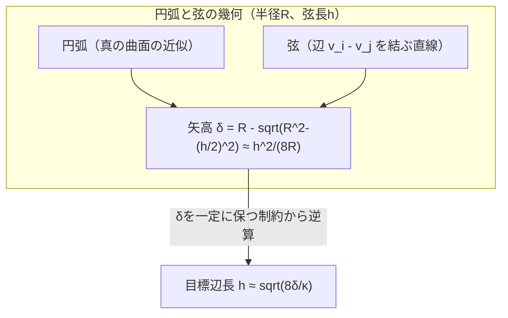

# 06. chord deviation（弦偏差）による誤差評価

> 対応: `archi.md` §0A.3-G（split選択条件、$h_{\text{geometry}}$式） / コード: 専用実装は**未実装**。
> 概念的に最も近い既存実装は `biw_poc/src/model/reconstruct.py: gradient_project()`（辺の中点を曲面へ投影する処理）

## 1. 概要

メッシュが曲面（曲率を持つ形状）をどれだけ忠実に近似できているかを測る古典的な指標が **chord deviation（弦偏差）**
である。直感的には「辺をまっすぐな線分（弦）で結んだとき、本当の曲面はその弦からどれだけ膨らんでいるか」を測る。

## 2. 数学的定義

### 記号の補足（本章で使う主な記号）

| 記号 | 意味 |
|---|---|
| $e=(v_i,v_j)$ | メッシュの1辺（両端の頂点で表す） |
| $m$ | 辺 $e$ の中点 |
| $\Sigma$ | 評価対象とする真の曲面 |
| $m'=\mathrm{proj}_\Sigma(m)$ | $m$ を曲面 $\Sigma$ 上に投影した点 |
| $e_{\text{chord}}(e)$ | 弦偏差（$m$ と $m'$ の距離） |
| $R$ | 局所的に近似する円弧の半径（曲率半径） |
| $h$ | 弦の長さ（辺長） |
| $\delta$ | 矢高（sagitta）。弦の中点から弧までの距離 |
| $\kappa=1/R$ | 曲率 |

メッシュの辺 $e = (v_i, v_j)$ の中点を

$$
m = \frac{v_i + v_j}{2}
$$

とする。この中点 $m$ を、真の（評価対象の）曲面 $\Sigma$ 上に投影した点を $m' = \mathrm{proj}_\Sigma(m)$ とするとき、
**弦偏差** は

$$
e_{\text{chord}}(e) = \lVert m' - m \rVert_2
$$

と定義される。辺 $(v_i, v_j)$ 自体は曲面上にあっても（$v_i, v_j \in \Sigma$）、その**中点**は曲率のせいで
曲面から離れてしまう、という事実を定量化したものである。

## 3. 矢高（sagitta）公式の導出

弦偏差が曲率とどう関係するかを理解するため、半径 $R$ の円弧で局所近似する。弦の長さ（辺長）を $h$ とすると、
弦の中点から弧までの距離（**矢高 / sagitta**）$\delta$ は、円の方程式から厳密に

$$
\delta = R - \sqrt{R^2 - \left(\frac{h}{2}\right)^2}
$$

と書ける。$h \ll R$（辺長が曲率半径に比べて十分小さい）という、メッシュとして妥当な条件のもとでテイラー展開すると：

$$
\sqrt{R^2 - \left(\frac{h}{2}\right)^2} = R\sqrt{1 - \left(\frac{h}{2R}\right)^2}
\approx R\left(1 - \frac{1}{2}\left(\frac{h}{2R}\right)^2\right) = R - \frac{h^2}{8R}
$$

これを代入すると

$$
\delta \approx \frac{h^2}{8R}
$$

という近似式が得られる。これを辺長 $h$ について逆に解くと（曲率 $\kappa = 1/R$ を用いて）

$$
h \approx \sqrt{8\,\delta R} = \sqrt{\frac{8\,\delta}{\kappa}}
$$

これが `archi.md` の局所目標辺長式 $h_{\text{geometry}}(x) = \sqrt{8\delta_{\text{geo}}/\kappa(x)}$
（[08_sizing_field.md](08_sizing_field.md)参照）の数学的根拠である。
つまり「許容できる弦偏差 $\delta_{\text{geo}}$ を一定値に保ちたいなら、曲率 $\kappa(x)$ が大きい（曲がりがきつい）
場所ほど辺長 $h$ を小さくしなければならない」という、メッシュの局所サイズと曲率の間のトレードオフを定量的に表す。

（mermaidは曲線を直接描画できないため、上図は構造の対応関係のみを示す。実際の弧と弦の図は紙の上で
「弦の中点から弧へ垂線を引いた距離が $\delta$」とイメージするとよい。）

## 4. なぜ「弦の中点を投影する」という操作が要なのか

この定義のポイントは、**頂点そのものではなく辺の中点**を評価対象にしていることである。頂点はメッシュ生成時に
（多くの手法で）真の曲面上に乗るよう設計されるため、頂点だけを見ても曲率追従の誤差は見えない。
辺の中点こそが「メッシュの三角形分割が粗いことによる曲率の見落とし」を可視化する点になる。

## 5. プロジェクトでの実例

専用の chord deviation 計算関数は実装されていないが、**機構としてほぼ同じ処理**が既に `reconstruct.py` に存在する。

`subdivide_and_project()`（[09](09_remeshing操作split_collapse_flip.md)で詳説）は、新しい頂点を生成する際にまさに
「辺の中点を計算し、それを曲面（学習済みUDFのゼロレベルセット）へ `gradient_project()` で投影する」という、
chord deviation の定義そのものの操作を行っている。違いは、本プロジェクトのコードはこの投影後の**変位そのもの**を
使って新しい頂点を確定させてしまう（誤差評価のためではなく、実際にメッシュを改善するための操作として使っている）点であり、
「弦偏差を**測定するだけ**して、それを閾値判定（splitすべきか否か）に使う」という `archi.md` の使い方とは
位置づけが異なる。`archi.md` の `DeterministicRemesher` は、この投影後の変位の**大きさ**（つまり弦偏差そのもの）を
split条件のしきい値判定に使う設計（split候補条件: $e_{\text{chord}} > \text{chord\_tolerance\_mm}$ など）を持つが、
これは現状コードでは実装されていない。

## 6. archi.mdとの接続

`archi.md` §0A.3-G は、辺をsplit（分割）すべきかどうかの判断基準の一つとして弦偏差を用いる。
また導出した $h_{\text{geometry}}(x) = \sqrt{8\delta_{\text{geo}}/\kappa(x)}$ の式は、[08_sizing_field.md](08_sizing_field.md)
で扱う $h_{\text{target}}(x)$ の構成要素の一つとして使われ、局所的に必要なメッシュ密度を曲率から逆算する役割を持つ。

## 7. 自己チェック問題

1. 矢高公式 $\delta = R - \sqrt{R^2-(h/2)^2}$ をテイラー展開し、$\delta \approx h^2/(8R)$ を導出せよ
   （どの近似条件 $h \ll R$ を使ったか明示すること）。
2. $h \approx \sqrt{8\delta/\kappa}$ の式から、曲率半径が半分になる（曲がりが2倍きつくなる）と、
   同じ弦偏差許容量を保つために目標辺長はどう変化するか求めよ。
3. なぜ頂点ではなく辺の中点を弦偏差の評価対象にするのか説明せよ。
4. `subdivide_and_project()` の中点投影処理と、`archi.md` が提案するchord deviationによるsplit判定の
   違いを、「測定のための投影」と「改善のための投影」という観点で説明せよ。

### 解答解説

1. $\delta=R-\sqrt{R^2-(h/2)^2}$ から、$h\ll R$ のもとで $\sqrt{R^2-(h/2)^2}=R\sqrt{1-(h/2R)^2}\approx R(1-\frac12(h/2R)^2)=R-\frac{h^2}{8R}$（テイラー近似 $\sqrt{1-x}\approx 1-x/2$、$x=(h/2R)^2\ll1$ を使用）。これを代入すると $\delta\approx h^2/(8R)$ が得られる。
2. $h\approx\sqrt{8\delta/\kappa}=\sqrt{8\delta R}$ なので、$h\propto\sqrt{R}$ という平方根的関係がある。$R$ が半分になると目標辺長は $1/\sqrt{2}$ 倍（約0.707倍）になる。
3. 頂点は曲面上に乗るよう設計されることが多く誤差が見えないが、辺の中点は弦と曲面のズレ（曲率追従誤差）を直接表すため。
4. `subdivide_and_project()` は投影後の変位をそのまま使って新頂点位置を確定する「改善のための投影」。`archi.md` のchord deviationは、変位の大きさを閾値判定（splitすべきか）に使うだけの「測定のための投影」（現状未実装）。

## 8. 次に読むもの

- [08_sizing_field.md](08_sizing_field.md): chord deviationから導かれる局所目標辺長の全体設計
- [09_remeshing操作split_collapse_flip.md](09_remeshing操作split_collapse_flip.md): 実際にsplitを行う操作の実装
