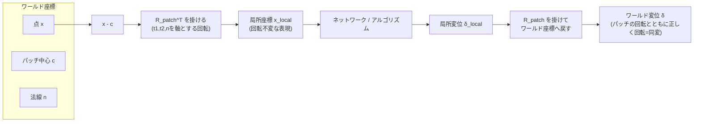
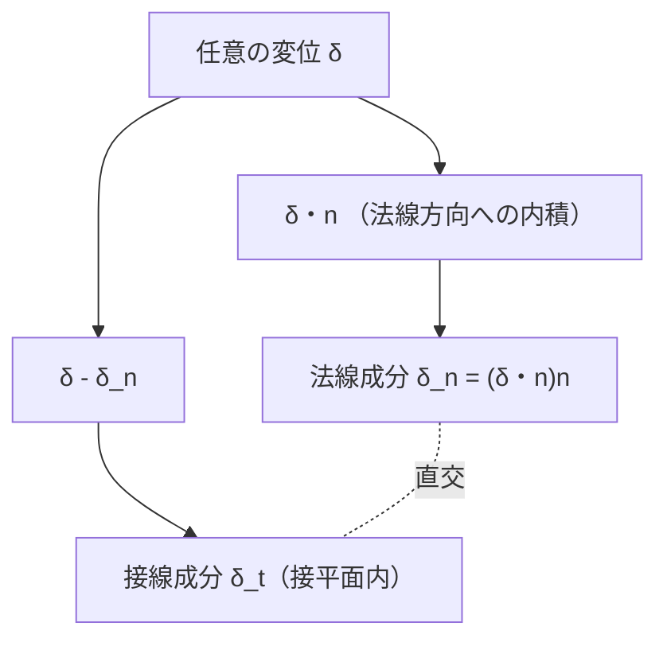

# 07. 局所座標フレーム（接線/法線分解）

> 対応: `archi.md` §0A.3-D / コード: `biw_poc/src/model/reconstruct.py: laplacian_smooth_project()`（R7-15, 接線・法線分解の実装例）, `biw_poc/src/preprocess/annotator.py: project_to_midsurface()`（簡易版・法線方向のみ）

## 1. 概要

メッシュ上の各点（パッチ）の周りに、その点固有の直交座標系（法線方向＋接平面内の2方向）を構成し、
変位やその他の幾何量をこの局所座標系で表現する手法。`archi.md` がこれを要求する理由は、
**回転同変性（rotation equivariance）** をネットワーク・アルゴリズムに持たせるためである。

## 2. 数学的定義

### 記号の補足（本章で使う主な記号）

| 記号 | 意味 |
|---|---|
| $x_0$ | 局所フレームを構成する基準点（パッチの中心） |
| $n$ | $x_0$ における法線ベクトル |
| $t_1,t_2$ | $n$ に直交する2つの単位ベクトル（接平面内の基底） |
| $R_{\text{patch}}=[t_1\ t_2\ n]$ | 局所座標系を表す回転行列（$SO(3)$の元） |
| $c$ | パッチ中心（座標の原点となる基準点） |
| $x_{\text{local}}$ | ワールド座標点 $x$ を局所座標系で表したもの |
| $\delta$ | 任意の変位ベクトル |
| $\delta_n,\delta_t$ | $\delta$ の法線成分・接線成分 |
| $R$ | 回転（$SO(3)$の元、回転同変性の定義に使用） |
| $f$ | 回転同変性を議論する対象の写像（関数） |

### 2.1 局所フレームの構成

ある点 $x_0$ における法線 $n$ が既知（あるいは推定可能）であるとき、$n$ に直交する2つの単位ベクトル $t_1, t_2$
を選び、正規直交基底（回転行列）

$$
R_{\text{patch}} = [\,t_1 \;\; t_2 \;\; n\,] \in SO(3), \qquad t_1 \cdot t_2 = 0,\;\; t_1 \cdot n = 0,\;\; t_2 \cdot n = 0
$$

を構成する。これを使い、ワールド座標系の点 $x$ をパッチ中心 $c$ からの相対位置として局所座標に変換する：

$$
x_{\text{local}} = R_{\text{patch}}^\top (x - c)
$$

同様に、ある変位ベクトル $\delta \in \mathbb{R}^3$ も局所成分に分解できる：

$$
\delta_{\text{local}} = R_{\text{patch}}^\top \delta = \begin{pmatrix}\delta_{t_1} \\ \delta_{t_2} \\ \delta_n\end{pmatrix}
$$

### 2.2 法線・接線成分への分解（射影による導出）

実務上もっとも頻出する操作は、$n$ さえ分かれば $t_1, t_2$ を明示的に構成しなくても、法線成分と接線成分に
分離できるという点である。任意の変位 $\delta$ に対し：

$$
\delta_n = (\delta \cdot n)\, n \qquad (\text{法線成分：} n\text{方向への正射影})
$$
$$
\delta_t = \delta - \delta_n \qquad (\text{接線成分：残り})
$$

これは $\delta = \delta_n + \delta_t$ という直交分解であり、$\delta_n \perp \delta_t$ が成り立つ
（$\delta_t \cdot n = \delta\cdot n - (\delta\cdot n)(n\cdot n) = \delta\cdot n - \delta\cdot n = 0$、$\lVert n\rVert=1$ より）。

### 2.3 回転同変性（SO(3) equivariance）の定義

ある関数 $f: \mathbb{R}^3 \to \mathbb{R}^3$ が回転同変であるとは、任意の回転 $R \in SO(3)$ に対して

$$
f(R x) = R\, f(x)
$$

が成り立つことをいう。パッチの入力点群をすべて $R_{\text{patch}}^\top$ で局所座標に変換してからネットワークに
入力すると、パッチ全体をワールド座標系で任意に回転させても局所座標表現 $x_{\text{local}}$ 自体は変化しない
（**回転不変** な入力表現になる）。出力された変位ベクトルを $R_{\text{patch}}$ で再びワールド座標に戻せば、
全体としてネットワークの予測はパッチの回転とともに正しく回転する（**回転同変** な出力になる）。

## 3. Mermaid図





## 4. プロジェクトでの既存実装

### 4.1 `reconstruct.py: laplacian_smooth_project()`（R7-15）— 最も正確な先行実装

この関数は、頂点をLaplacian平滑化した際の変位ベクトルを、ネットワークが予測した**UDFの勾配方向**
（`grad_norm`、これが事実上の法線推定値になる）を使って正確に上記の射影分解を行っている：

```python
disp_normal = (disp * grad_norm).sum(-1, keepdim=True) * grad_norm   # δ_n = (δ・n) n
disp_tangential = disp - disp_normal                                  # δ_t = δ - δ_n
```

そのうえで**接線成分のみ**を採用する（法線成分を捨てる）。これは「平滑化によって面の形状（法線方向の凹凸＝
曲率情報）を壊さず、面に沿った方向の点の偏りだけを均す」という設計意図に基づく——まさに本章の数式
$\delta = \delta_n + \delta_t$ の分解を、実際の幾何処理の目的（平滑化のさじ加減の制御）のために活用した実例である。

### 4.2 `annotator.py: project_to_midsurface()` — より単純な「1次元局所フレーム」の先行例

```python
def project_to_midsurface(mesh, P_outer, N_outer, max_depth_mm=20.0):
    # P_outer から -N_outer 方向にレイキャストし、対をなす内側面の交点を探す
    ...
```

こちらは法線方向 $N_{\text{outer}}$ **1本だけ**を使う簡易版であり、接線方向 $t_1, t_2$ の構成は行っていない
（厚み方向にレイを飛ばして対になる面を探すだけなので、フルの3軸局所フレームは不要なタスクである）。
本章のフルの局所フレーム概念と比べると「法線方向だけを使う最小構成」の具体例として位置づけられる。

## 5. SO(2)同変性問題（接線方向の不定性）— `archi_audit.md`の指摘

法線 $n$ は（曲率がある形状であれば）一意に近い形で推定できるが、$t_1, t_2$ の選び方には
**$n$ を軸とする回転（$SO(2)$）の自由度**が残る。つまり、同じ物理的なパッチ・同じ法線 $n$ であっても、
$t_1, t_2$ の取り方を変えれば $\delta_{t_1}, \delta_{t_2}$ の値（接線成分の内訳）は全く異なる値になりうる。
これは特に**平坦なパッチ**（曲率がほぼゼロ）で深刻になる——曲率由来の自然な基準方向（主曲率方向など）が
存在しないため、$t_1, t_2$ の選択が本質的に恣意的にならざるを得ない。`archi_audit.md` はこの点を、
局所座標フレームを使う設計（`archi.md` §0A.3-D）に対する留意点として指摘している。
（実装上の回避策としては、$\delta_n$と$\delta_t$の「大きさ」だけを使い、$t_1,t_2$個別の内訳には依存しない
設計にする、というのが本プロジェクトの`laplacian_smooth_project()`が採っている方針である。）

## 6. archi.mdとの接続

`archi.md` §0A.3-D の `R_patch = [t1, t2, n]` 設計は、`LocalMeshRefiner` がパッチ単位で幾何予測を行う際に
入力・出力をワールド座標の任意の向きに依存しないようにするための仕組みである。
本章で見た通り、その最小限の実装（法線成分・接線成分の分離のみ）は既に `laplacian_smooth_project()` で
実証済みであり、フルの3軸局所フレーム（$t_1, t_2$ の明示的構成）への拡張がアーキテクチャ上の次のステップになる。

## 7. 自己チェック問題

1. $\delta = \delta_n + \delta_t$ が直交分解であること（$\delta_n \cdot \delta_t = 0$）を、$n$ が単位ベクトルである
   という条件のみから導け。
2. 回転同変性 $f(Rx) = Rf(x)$ の定義を述べ、局所座標変換 $x_{\text{local}} = R_{\text{patch}}^\top(x-c)$ が
   なぜこれを実現する助けになるか説明せよ。
3. `laplacian_smooth_project()` が接線成分のみを採用し、法線成分を捨てる設計判断の意図を説明せよ。
4. SO(2)同変性問題（接線方向の不定性）が平坦なパッチで特に深刻になる理由を述べよ。

### 解答解説

1. $\delta_t \cdot n = (\delta-\delta_n)\cdot n = \delta\cdot n - (\delta\cdot n)(n\cdot n) = \delta\cdot n - \delta\cdot n = 0$（$\because n$ は単位ベクトルで $n\cdot n=1$）。よって $\delta_t \perp n$、すなわち $\delta_n \cdot \delta_t = 0$。
2. $f(Rx)=Rf(x)$ が任意の回転 $R$ で成り立つこと。$x_{\text{local}}=R_{\text{patch}}^\top(x-c)$ は、パッチ全体が回転すると $R_{\text{patch}}$ 自身も同じだけ回転するため、相対的な局所座標表現は不変になる（回転不変な入力）。出力を $R_{\text{patch}}$ で再びワールド座標に戻すと、全体として正しく回転する（回転同変な出力）。
3. 平滑化によって面の形状（法線方向の凹凸＝曲率情報）を壊さず、面に沿った点の偏りだけを均すため。法線成分まで平滑化してしまうと、曲率そのものを丸めて（なまして）しまう。
4. 曲率がある形状では主曲率方向のような自然な基準があるが、平坦なパッチでは自然な基準が存在しないため、$n$ を軸とする回転（$SO(2)$）の範囲で $t_1,t_2$ の選択が恣意的にならざるを得ず、接線成分の内訳が選び方次第で変わってしまう。

## 8. 次に読むもの

- [09_remeshing操作split_collapse_flip.md](09_remeshing操作split_collapse_flip.md): 局所フレームを用いた変位制御の実例（変位クランプ）
