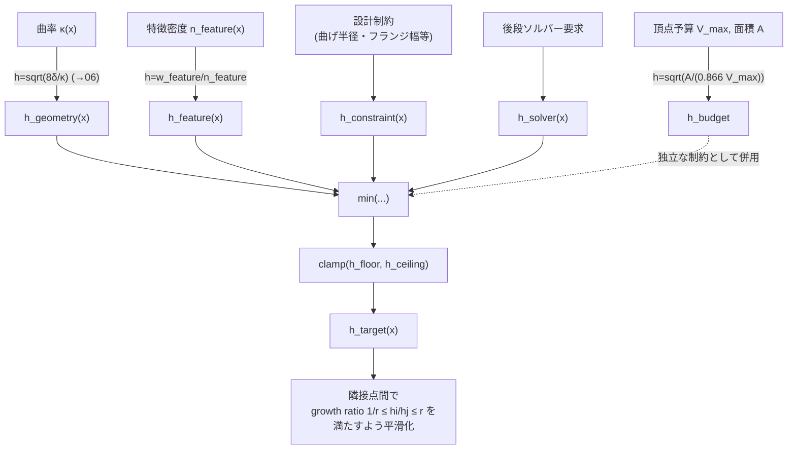

# 08. sizing field（局所目標辺長）、growth ratio

> 対応: `archi.md` §0A.3-G（SizingAndBudgetController） / コード: **未実装**（提案段階）。
> 関連する実測値: `archi.md` §0A.3-G記載のPoC初期実測（極短辺 0〜0.024mm）

## 1. 概要

メッシュの「ちょうど良い」局所的な辺の長さは場所によって異なるべきである——曲率がきつい場所は細かく、
平坦な場所は粗くてよい。この「場所ごとの目標辺長」を関数として定義したものが **sizing field（サイジングフィールド）**
$h_{\text{target}}(x)$ である。これはCAEメッシング・computational geometry分野で広く使われる標準的な道具立てである。

## 2. 数学的定義

### 記号の補足（本章で使う主な記号）

| 記号 | 意味 |
|---|---|
| $h_{\text{target}}(x)$ | 点 $x$ における局所目標辺長（sizing field） |
| $h_{\text{geometry}},h_{\text{feature}},h_{\text{constraint}},h_{\text{solver}}$ | 目標辺長を決める4つの構成要素（曲率・特徴密度・設計制約・ソルバー要求） |
| $h_{\text{floor}},h_{\text{ceiling}}$ | 目標辺長のクランプ下限・上限 |
| $n_{\text{feature}},w_{\text{feature}}$ | 単位面積あたりの特徴数、その重み定数 |
| $r$ | growth ratio（隣接要素間の目標辺長の許容変化比） |
| $V_{\max}$ | 頂点数の予算上限 |
| $A$ | 対象領域の面積 |
| $h_{\text{budget}}$ | 頂点予算から逆算した辺長 |

### 2.1 構成要素ごとの目標辺長

$$
h_{\text{target}}(x) = \mathrm{clamp}\Big(\min\big(h_{\text{geometry}}(x),\, h_{\text{feature}}(x),\, h_{\text{constraint}}(x),\, h_{\text{solver}}(x)\big),\; h_{\text{floor}},\, h_{\text{ceiling}}\Big)
$$

各項の意味：

- $h_{\text{geometry}}(x) = \sqrt{8\delta_{\text{geo}}/\kappa(x)}$ — 曲率 $\kappa(x)$ から要求される辺長
  （[06_chord_deviation弦偏差誤差.md](06_chord_deviation弦偏差誤差.md)で導出した式そのもの）。
- $h_{\text{feature}}(x) = w_{\text{feature}}/n_{\text{feature}}$ — 局所的な特徴（穴・エッジ・コーナー等）の密度に
  応じて細かくする項。$n_{\text{feature}}$ は単位面積あたりの特徴数、$w_{\text{feature}}$ は重み定数。
- $h_{\text{constraint}}(x)$ — 設計上の制約（最小曲げ半径やフランジ幅など、CAEドメイン知識由来）から来る項。
- $h_{\text{solver}}(x)$ — 後段の数値解析（CAE等）が要求する辺長条件。
- $\min(\cdot)$ により、**最も厳しい（最小の）要求**を採用する——これは「どの理由であれ、その場所で
  細かいメッシュが必要だと判断されたら従う」という安全側設計である。
- 最後に $h_{\text{floor}}$（下限、過度に細かくしすぎない）と $h_{\text{ceiling}}$（上限、過度に粗くしすぎない）で
  クランプする。

### 2.2 Growth ratio（成長比）制約

隣接する2つのメッシュ要素（あるいは隣接する評価点）の目標辺長 $h_i, h_j$ の間には

$$
\frac{1}{r} \le \frac{h_i}{h_j} \le r
$$

という制約（$r$ は成長比、典型的には $r \approx 1.2 \sim 1.5$）を課す。これは sizing field が場所によって
急激に変化することを防ぐ。なぜ必要かというと、隣接する三角形の大きさが急激に変わると、その境界の三角形が
極端に歪んだ形状（スリバー）になりやすく、[05_メッシュ品質指標.md](05_メッシュ品質指標.md)で見た品質指標
（aspect ratio・最小角）を悪化させるためである。これは unstructured remeshing 分野で標準的に使われる慣行である。

## 3. メッシュ予算（budget）からの目標辺長の逆算：三角形格子の充填密度による導出

頂点数の予算 $V_{\max}$（計算コストの上限）が与えられたとき、平面領域（面積 $A$）を正三角形格子で
均等に埋めると仮定して、それに対応する辺長 $h_{\text{budget}}$ を逆算できる。

**ステップ1: 大規模な平面三角形分割では $F \approx 2V$**

Eulerの公式（[04](04_メッシュのトポロジー記述.md)参照）$V - E + F = 1$（円盤、$\chi=1$）が成り立つ大規模な
三角形分割を考える。各三角形が3辺を持ち、各内部辺はちょうど2つの三角形に共有されるので

$$
E \approx \frac{3F}{2}
$$

これをEulerの公式に代入すると

$$
V - \frac{3F}{2} + F = 1 \;\;\Longrightarrow\;\; V - \frac{F}{2} \approx 1 \;\;\Longrightarrow\;\; F \approx 2V \quad (V \gg 1)
$$

（直感的検算: 正三角形格子では内部の各頂点はちょうど6個の三角形に囲まれる。三角形と頂点の接続数（インシデンス数）
を数えると、頂点側からは $6V$、三角形側からは $3F$ となるので $3F = 6V$、すなわち $F = 2V$ で一致する。）

**ステップ2: 正三角形1個の面積**

辺長 $h$ の正三角形の面積は

$$
\mathrm{Area}_{\triangle} = \frac{\sqrt{3}}{4} h^2
$$

**ステップ3: 全体の面積予算から辺長を逆算**

$F$ 個の三角形が面積 $A$ を埋め尽くすとすると

$$
A \approx F \cdot \mathrm{Area}_{\triangle} = 2V \cdot \frac{\sqrt{3}}{4}h^2 = \frac{\sqrt{3}}{2} V h^2 \approx 0.866\, V h^2
$$

これを $h$ について解くと

$$
h_{\text{budget}} \approx \sqrt{\frac{A}{0.866\, V_{\max}}}
$$

という式が得られる。これは「使える頂点数の上限 $V_{\max}$ から、均等な格子を仮定したときの妥当な辺長」を
与える、計算予算サイドからの制約であり、$h_{\text{geometry}}$（曲率サイドからの制約）とは独立に効いてくる。

## 4. プロジェクトでの実例

このsizing field機構自体は本プロジェクトには**まだ実装されていない**。`archi.md` §0A.3-G に記載されたPoC初期実測値
として、極端に短い辺（0〜0.024mm）が観測されたという記述があり、これは現行の `subdivide_and_project()`
（[09](09_remeshing操作split_collapse_flip.md)）が一様な1→4分割を繰り返すだけで**局所サイズの調整機構を持たない**ことの
直接的な帰結である——曲率や被覆密度に関わらず全ての辺を機械的に4分割するため、すでに十分小さい辺がさらに分割され、
不必要に短い辺（数値的に無意味なほど小さい）が生成されてしまう。これがsizing field導入の motivating example になっている。

## 5. archi.mdとの接続

`archi.md` の `SizingAndBudgetController`（§0A.3-G）はこのsizing fieldとgrowth ratio制約を一元管理する
コンポーネントとして設計されており、[09_remeshing操作split_collapse_flip.md](09_remeshing操作split_collapse_flip.md)
で扱うsplit/collapse判定の閾値そのもの（$h_{\text{target}}(x)$ に対する現在の辺長の比）として使われる。

## 6. 自己チェック問題

1. $F \approx 2V$ の関係を、Eulerの公式と「各内部辺は2つの三角形に共有される」という事実から導出せよ。
2. $h_{\text{budget}} \approx \sqrt{A/(0.866 V_{\max})}$ の式を、正三角形の面積公式とステップ1の結果から導出せよ。
3. なぜ $h_{\text{target}}$ の構成要素は `min` で結合されるのか（`max` ではなく）、安全性の観点から説明せよ。
4. growth ratio制約がない場合、隣接する三角形のサイズが急激に変わるとどのような品質指標
   （[05](05_メッシュ品質指標.md)参照）が悪化するか説明せよ。
5. `subdivide_and_project()` が一様分割しかしないことと、極端に短い辺（0〜0.024mm）が生成される現象との
   因果関係を説明せよ。

### 解答解説

1. Eulerの公式 $V-E+F=1$（円盤）と、各内部辺が2つの三角形に共有されるという事実から $E\approx 3F/2$（各三角形3辺、共有のため2で割る）。代入すると $V-\frac{3F}{2}+F=1 \Rightarrow V-\frac{F}{2}=1 \Rightarrow F\approx 2V$（$V\gg1$）。検算: 内部頂点は6個の三角形に囲まれるので、インシデンス数を数えると $6V=3F$、すなわち $F=2V$ で一致する。
2. $F\approx 2V$ 個の正三角形（各面積 $\frac{\sqrt3}{4}h^2$）が面積 $A$ を埋めるとして $A\approx F\cdot\frac{\sqrt3}{4}h^2=2V\cdot\frac{\sqrt3}{4}h^2=\frac{\sqrt3}{2}Vh^2\approx 0.866\,Vh^2$。これを $h$ について解くと $h_{\text{budget}}\approx\sqrt{A/(0.866\,V_{\max})}$。
3. 安全側設計のため。どの理由であれ細かいメッシュが必要と判断されたらそれに従うべきで、最も厳しい（最小の）要求を採用しないと、その場所の精度不足が見逃されてしまう。`max` を使うと最も緩い条件を採用してしまい危険。
4. 境界付近の三角形が極端に歪んだ形状（スリバー）になりやすく、最小角（$\theta_{\min}\to0$）やaspect ratio（$AR_1,AR_2,AR_3$ の増大）が悪化する。
5. sizing fieldを参照せず曲率や被覆密度を無視して全辺を機械的に1→4分割するため、すでに小さい辺もさらに分割され、refineラウンドを重ねるごとにねずみ算的に短くなり、数値的に無意味なほど短い辺（0〜0.024mm）が生成される。

## 7. 次に読むもの

- [09_remeshing操作split_collapse_flip.md](09_remeshing操作split_collapse_flip.md): sizing fieldを使った実際の split/collapse 判定
