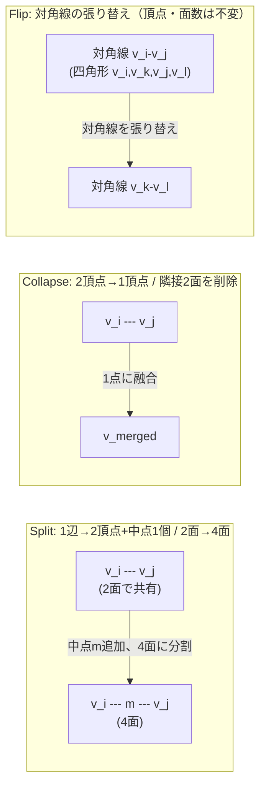
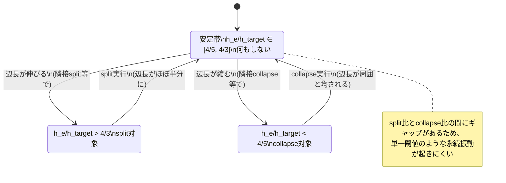

# 09. remeshing操作（split/collapse/flip）と前後条件・ヒステリシス

> 対応: `archi.md` §0A.3-F（DeterministicRemesher）, §0A.3-G / コード: `biw_poc/src/model/reconstruct.py: subdivide_and_project()`（R7-08, R7-14）

## 1. 概要

メッシュの局所的な密度や形状を改善するための基本操作は3種類に整理できる: **split（分割）**, **collapse（融合）**,
**flip（辺の張り替え）**。本プロジェクトの現行コードには split に相当する一様な処理（`subdivide_and_project()`）が
存在するが、collapse・flip・そして適応的な判定（ヒステリシス）はまだ実装されていない。

## 記号の補足（本章で使う主な記号）

| 記号 | 意味 |
|---|---|
| $e=(v_i,v_j)$ | remeshing操作の対象となる1辺 |
| $m$ | 辺 $e$ の中点 |
| $v_k,v_l$ | flip操作で対角線の置き換え先となる頂点 |
| $h_e$ | 辺 $e$ の現在の長さ |
| $h_{\text{target}}$ | その場所の目標辺長（[08](08_sizing_field.md)参照） |
| $r_{\text{split}},r_{\text{collapse}}$ | split/collapseを判定する比の閾値（ヒステリシスのデッドバンドを作る） |

## 2. 各操作の定義と前後条件

### 2.1 Split（分割）

辺 $e=(v_i,v_j)$ の中点 $m=(v_i+v_j)/2$ を新しい頂点として追加し、$e$ を共有する2つの三角形をそれぞれ2つに分割する
（1つの辺の分割により、最大2つの三角形が4つの三角形に増える＝1辺split → 局所的に2面が4面になる）。
**実行条件（典型）**: 現在の辺長 $\lVert v_i-v_j\rVert$ が目標辺長 $h_{\text{target}}$ に対して大きすぎる場合、
あるいは弦偏差 $e_{\text{chord}}(e)$（[06](06_chord_deviation弦偏差誤差.md)）が許容値を超える場合。

### 2.2 Collapse（融合）

辺 $e=(v_i,v_j)$ を1点（多くは中点、あるいは $v_i$ か $v_j$ のどちらかへ）に潰し、$e$ を共有していた三角形を削除する。
**実行条件（典型）**: 現在の辺長が目標辺長に対して小さすぎる場合。
**前提条件（重要）**: collapse はトポロジーを変更する破壊的操作であるため、実行前に
「collapse後もメッシュが多様体を保つか」（[04](04_メッシュのトポロジー記述.md)のbowtie頂点を作らないか）の
チェックが必須になる。

### 2.3 Flip（辺の張り替え）

2つの三角形が共有する辺 $e=(v_i,v_j)$ を、その四角形（2三角形の和）のもう一方の対角線 $(v_k,v_l)$ に置き換える。
頂点・三角形の**数**は変化しないが、**接続関係**だけが変わる。
**実行条件（典型）**: Delaunay性の改善（局所的な最小角の最大化）、あるいは品質指標（[05](05_メッシュ品質指標.md)の
最小角・aspect ratio）の改善が見込める場合。



## 3. ヒステリシス（split/collapseの振動防止）

### 3.1 問題：単一閾値では振動する

仮に「辺長 $> h_{\text{target}}$ なら split、辺長 $< h_{\text{target}}$ なら collapse」という**単一の閾値**だけで
判定すると、$h_{\text{target}}$ ぎりぎりの辺は以下のように**永遠に振動**しうる：

1. ある辺の長さが $h_{\text{target}}$ をわずかに超える → split される → 新しい辺は半分の長さになり $h_{\text{target}}$ を下回る
2. 次のラウンドで、その短くなった辺の隣接構造が再評価されて collapse 対象になる → collapse される → 再び長くなる
3. → 1に戻る（無限ループ）

### 3.2 解決策：split比とcollapse比にギャップ（デッドバンド）を設ける

$$
\text{split条件:} \quad \frac{h_e}{h_{\text{target}}} > r_{\text{split}}, \qquad
\text{collapse条件:} \quad \frac{h_e}{h_{\text{target}}} < r_{\text{collapse}}
$$

ここで $r_{\text{split}} = 4/3$, $r_{\text{collapse}} = 4/5$ のように、**$r_{\text{collapse}} < 1 < r_{\text{split}}$**
かつ両者の間に明確なギャップを設ける。$h_e/h_{\text{target}} \in [r_{\text{collapse}}, r_{\text{split}}] = [4/5, 4/3]$
の範囲（**安定帯 / デッドバンド**）にある辺はsplitもcollapseもされない。これにより、上記の振動シナリオが起きなくなる
理由を確認する：split後の辺長は元の半分（比は半分）になるので、split直前に $r_{\text{split}}=4/3$ ぎりぎりだった辺は
split後 $\approx 2/3$ になり、これは安定帯 $[4/5, 4/3]$ の下限 $4/5$ より小さい……ように見えるが、実際には
分割は「最も長い」辺から優先的に行われ、かつ閾値の比を十分に離すことで、実務上は数ラウンドで収束するよう
パラメータ（$r_{\text{split}}, r_{\text{collapse}}$ の具体値とそのギャップ幅）を調整する。
この設計パターンは制御工学における**シュミットトリガー（ヒステリシスコンパレータ）**と数学的に同型であり、
「ON/OFFの閾値を意図的にずらすことでチャタリング（高速な振動）を防ぐ」という標準的な考え方の応用である。



## 4. プロジェクトでの実例：`subdivide_and_project()`（現行実装）

`reconstruct.py: subdivide_and_project()` は **split のみ**を、**一様（全辺に対して無条件）** に実行する、
最も単純な remeshing 操作である（R7-08）:

1. メッシュの全ユニーク辺を、頂点インデックスのソート済みペアの重複排除で構築する。
2. 各辺の中点を計算する。
3. 中点を `gradient_project()`（UDFの勾配方向に沿った投影、ゼロレベルセットへ向かう）で曲面上に再投影する。
4. **R7-14の変位クランプ**: 中点の投影による移動量を、**元の辺長**に対する割合でクランプする
   （既定 `max_disp_frac=0.5`、つまり「中点は元の辺長の半分を超えて動いてはいけない」というスケール相対的な
   （絶対値ではない）上限）。これは refine ラウンドを重ねるごとに自己折れ込み・シワが蓄積する現象
   （[05_メッシュ品質指標.md](05_メッシュ品質指標.md)で触れた面積比の異常膨張 0.97→1.51→1.98→3.26→6.96 の実測）
   を防ぐために導入された。

```python
def subdivide_and_project(model, z, pts, tris, device, n_proj_iters, max_disp_frac=0.5):
    # 1. ユニーク辺の構築（重複排除）
    # 2. 各辺の中点を計算
    # 3. gradient_project() でゼロレベルセットへ投影
    # 4. 変位を「元の辺長 × max_disp_frac」でクランプ（R7-14）
    ...
```

**この実装はarchi.mdが要求する `DeterministicRemesher` と何が違うか**: 本実装は

- collapse・flip操作を**持たない**（一方向にしか動けない：常に密度が増える）
- ヒステリシスを**持たない**（無条件・全辺一律で実行されるので、振動の懸念自体が生じない代わりに、
  「本当に必要な場所だけ」を選んで操作する適応性がない）
- sizing field（[08](08_sizing_field.md)）を参照しない（曲率や予算を考慮せず常に1→4分割）

つまり「split を、ヒステリシス制御も sizing field 判定もなしに、全辺一律で繰り返す」という、
`archi.md` が提案する適応的remeshingの**最も単純な特殊ケース**にあたる。R7-14の変位クランプ
（$|\delta| \le 0.5 \times h_{\text{edge,original}}$）は、`archi.md` の局所フレーム変位クランプ設計
（$|\delta| \le 0.25 \times h_{\text{target}}$、[07_局所座標フレーム.md](07_局所座標フレーム.md)参照）と
**考え方が直接対応する**先行実装であり、「変位の大きさをその場のスケール（辺長やsizing field）に対する
相対値でクランプする」という設計原則を共有している。

## 5. archi.mdとの接続

`archi.md` の `DeterministicRemesher` は、各辺に対して `rank(e)` という辞書式順序のタプルを計算し、
それに基づいてsplit/collapse/flipのどれを（あるいは何もしないか）実行するかを決定する設計になっている。
本章で見たヒステリシス制御・sizing field参照・3操作すべての実装は、現行の `subdivide_and_project()` の
延長として今後実装されるべきギャップであり、`archi_learning_plan.md` のStage計画上の次の実装対象である。

## 6. 自己チェック問題

1. 単一の辺長閾値だけでsplit/collapseを判定すると振動が起きる理由を、具体的な数値例（辺長と$h_{\text{target}}$）で説明せよ。
2. $r_{\text{split}}=4/3, r_{\text{collapse}}=4/5$ という具体値のとき、安定帯（デッドバンド）の範囲を求めよ。
3. R7-14の変位クランプ $|\delta|\le 0.5 \times h_{\text{edge,original}}$ が「絶対値ではなくスケール相対」である
   ことの利点を、`archi.md` の $|\delta|\le 0.25 \times h_{\text{target}}$ との対応関係を踏まえて説明せよ。
4. `subdivide_and_project()` が `archi.md` の `DeterministicRemesher` の「最も単純な特殊ケース」と言える理由を、
   collapse・flip・ヒステリシス・sizing fieldという4つの欠落要素の観点から整理せよ。

### 解答解説

1. 例えば $h_{\text{target}}=1.0\mathrm{mm}$ で辺長 $1.01\mathrm{mm}$（split条件を満たす）→ splitされ各約 $0.505\mathrm{mm}$ に→ collapse条件を満たし、隣接構造の再評価でcollapseされ約 $1.01\mathrm{mm}$ に戻る → これが繰り返され振動する。
2. $h_e/h_{\text{target}} \in [r_{\text{collapse}}, r_{\text{split}}] = [4/5,\,4/3] = [0.8,\,1.333\ldots]$ が安定帯。
3. 絶対値（一律0.5mm等）だと様々なスケールが混在するメッシュで、小さい辺には過大、大きい辺には過小な上限になり不適切。スケール相対（元の辺長×0.5）であれば、辺の大きさに応じた妥当な上限が自動的に設定される。これは`archi.md`の $h_{\text{target}}$ に対する相対値クランプと同じ考え方である。
4. (1)collapse・flipを持たず一方向（密度が増える方向）にしか動けない、(2)ヒステリシスを持たず無条件・全辺一律で実行される、(3)sizing fieldを参照せず曲率や予算を考慮しない、という3つの欠落要素を持つ「splitのみを最も単純な形で実行する」、`DeterministicRemesher`の最も縮退した特殊形と言える。

## 7. 次に読むもの

- [10_cut_locus.md](10_cut_locus.md): remeshingの精度が最終的に律速される根本的な特異点の問題
