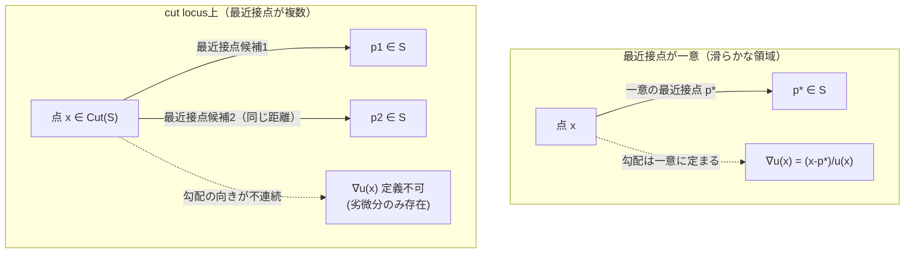
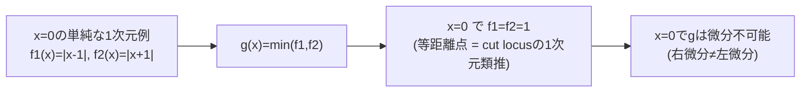
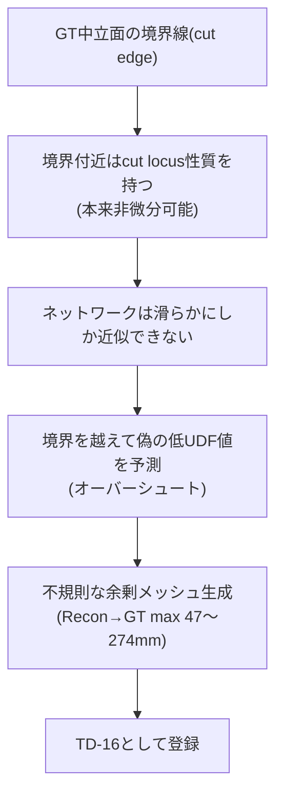

# 10. cut locus（UDFの非微分可能な特異点）

> 対応: `archi.md` §0.3, §0G（研究選択肢） / `CLAUDE.md` §14, §15, §16, §17（TD-16の発見・調査・緩和の全経緯）
> コード: R7-09（Eikonal正則化）, R7-11/R7-12（決定論的ゲート）, `diagnose_outliers.py`

## 1. 概要

[01_UDFとSDF.md](01_UDFとSDF.md)で「UDFは曲面 $S$ そのものの上で微分不可能なキンクを持つ」ことを見た。
**cut locus** はこれをさらに一般化した概念であり、$S$ の**外側**の点でも生じうる、より広い非微分可能性の集合である。
本プロジェクトの最大の未解決技術的負債 **TD-16**（境界付近のゴーストメッシュ、Recon→GT最大47mm）の根本原因が、
この cut locus にあることが文献調査・実験の両面から特定されている。

## 2. 数学的定義

### 記号の補足（本章で使う主な記号）

| 記号 | 意味 |
|---|---|
| $S$ | 対象とする曲面（[01](01_UDFとSDF.md)と同じ） |
| $\mathrm{Cut}(S)$ | $S$ のcut locus（最近接点が一意に定まらない点の集合） |
| $p_1,p_2$ | ある点 $x$ から見て等距離にある2つの異なる最近接点候補 |
| $u(x)$ | UDF（[01](01_UDFとSDF.md)と同じ） |
| $p^*(x)$ | $x$ の一意な最近接点（cut locus外で定義される） |
| $f_1,f_2$ | $\min$ 関数の微分不可能性を説明する1次元の補助関数 |
| $g(x)=\min(f_1(x),f_2(x))$ | cut locusの1次元類推（$f_1=f_2$ となる点で微分不可能） |

### 2.1 Cut locusの定義

曲面 $S$ 上の最近接点が一意に定まらない点の集合を **cut locus** と呼ぶ：

$$
\mathrm{Cut}(S) = \left\{\, x \in \mathbb{R}^3 \;\middle|\; \exists\, p_1 \neq p_2 \in S,\;\; \lVert x-p_1\rVert = \lVert x-p_2\rVert = u(x) \,\right\}
$$

すなわち、$x$ から $S$ への「最短経路」が2通り以上存在する点である。これは古典的な**メディアル軸 (medial axis)**
と非常に近い概念であり（メディアル軸は通常「内部」のcut locusを指す呼び方として使われることが多い）、
本プロジェクトの文脈ではより広く「最近接点の一意性が破れる場所全般」として捉える。

### 2.2 なぜ微分不可能になるか

$u$ が微分可能な点では、勾配は一意の最近接点 $p^*(x)$ を使って $\nabla u(x) = (x-p^*(x))/u(x)$ と書ける
（[01](01_UDFとSDF.md)のEikonal方程式）。最近接点が $p_1, p_2$ の2つ存在する点では、$p_1$ 側に微小に動かすか
$p_2$ 側に微小に動かすかで勾配の**向き**が不連続にジャンプする。これは1変数の $\min$ 関数
$g(x) = \min(f_1(x), f_2(x))$ が、$f_1(x)=f_2(x)$ となる点で（$f_1, f_2$ 個別には滑らかでも）一般に
微分不可能になる、という事実の3次元・無限個の候補点版である。

### 2.3 開いた曲面における「もう一つの」cut locus：境界自体

[01](01_UDFとSDF.md)で見た「$S$ そのものの上でのキンク」は実は cut locus の特別な場合（$p_1=p_2=p^*(x) \to x$
の極限、$x$ 自身が $S$ に収束する場合）とみなせる。さらに本プロジェクトの中立面は**開いた**曲面（境界＝切断端を持つ）
であるため、**境界縁 (cut edge)** 自体が追加の特異性を生む。境界の外側に出た点 $x$ にとって、$S$ 上の最近接点は
しばしば境界線上の点になり、境界に沿って「どちらの境界点が最近接か」が切り替わる場所でやはり微分不可能になる。
つまり開いた曲面は、閉じた曲面に比べて**質的に多い**cut locusを持つ——これが「中立面（開多様体）でUDFを使うと
閉じたソリッドの場合よりも学習が難しくなる」ことの数学的な理由である。

## 3. なぜニューラルネットがcut locusを正確に表現できないか

`QueryDecoder`（[01](01_UDFとSDF.md)参照）はFourier位置エンコーディング（R7-05）を使っていても、本質的には
**滑らかな（少なくともLipschitz連続な）関数近似器**である。cut locus上の真のUDFは非微分可能なキンクを持つため、
ネットワークはこれを正確に再現できず、**過剰に滑らかな補間**をしてしまう。その結果、境界を越えた領域でも
予測UDFが偽って小さい値（「表面の近くにいる」という誤った予測）を返し、本来存在しないメッシュ
（ゴーストメッシュ）を生成してしまう。

## 4. プロジェクトでの実測（TD-16の根本原因特定）

`CLAUDE.md` §14の調査（Recon→GTの距離が大きい「悪い点」とGT境界エッジまでの距離の相関を計測）により、

- 距離が大きい点（>20mm）とGT境界線までの距離には**相関係数1.0**という極めて強い相関が確認された。
- 「悪い点」はGT境界エッジから平均88.41mm、「良い点」は平均2.98mmと、ほぼ完全に境界由来であることが実証された。

これは文献でも既知の未解決問題として報告されている（"neural UDFs tend to have larger errors near the zero-level set
and its cut locus", arXiv:2309.08878 ／ "UDFs ... theoretically non-differentiable at the zero level set ...
making it difficult to generate open boundaries", arXiv:2210.02757）。

## 5. 緩和策（根治ではない）の系譜

| 段階 | 対策 | 結果 |
|---|---|---|
| R7-09 | 境界シャドウクエリのオーバーサンプリング + Eikonal正則化（$\lVert\nabla u\rVert\approx1$）| cut locus自体をより正確に学習させる直接対策 |
| R7-10 | confidenceヘッド追加（学習ベース） | 分布外領域で誤って高い確信度を出すケースがあり単独では不十分 |
| R7-11 | 決定論的kNN距離ゲート（入力点群までの距離が閾値超なら候補除外） | Recon→GT mean 53.83mm→31.57mm |
| R7-12 | `prune_far_vertices()` による再構成後の頂点剪定（毎refineラウンド後に再適用） | リム外挿頂点の系統的な除去 |
| Round8 | Deep Ensembles比較（5シード） | **不採用**（誤差が初期化由来ではなく損失関数設計由来の系統バイアスのため、disagreementとして検出できなかった） |
| Round9 | トポロジーパッチ仮説の検証（5seed×2条件） | **棄却**（boundary loop数66%削減も最終精度に有意な改善なし） |
| 最終確定 | R7-11+R7-12の組み合わせ | mean=8.57mm, max=47.27mm（ベースライン比 mean 6.3倍・max 5.2倍改善）|

Deep Ensemblesが機能しなかった理由は教育的に重要である：5メンバーは**同一の損失関数設計**（R7-03のtruncated
distance loss）を共有しており、このlossが系統的にもたらす「予測値域の天井」効果が**全メンバーに共通して**生じる。
Deep Ensemblesが捉えようとする epistemic uncertainty（認識論的不確実性）は独立な初期化由来のばらつきに依拠するが、
本問題の誤差は損失関数設計に起因する**系統バイアス**であるため、アンサンブルメンバー間で「揃って間違える」——
disagreement（不一致度）として検出できない、という構造的な限界があった。

## 6. archi.mdとの接続

`archi.md` §0G が列挙する代替UDF研究（DUDF, MeshUDF, CAP-UDF, Neural Dual Contour等）はいずれも、
本章で定義したcut locus問題への対策として位置づけられる。特にDUDF（CVPR 2024, Hyperbolic Scaling）は
「メッシュ抽出時」ではなく「ネットワーク学習時」に非微分可能性を補正する点でR7-09のEikonal正則化と同じ層の
対策であり、根治を目指す場合の有力候補として `CLAUDE.md` §17で未着手のまま記録されている。
現状の本番設定（R7-11+R7-12）は **緩和 (mitigation)** であって **根治 (cure)** ではないことを正確に理解しておくことが、
このプロジェクトの技術的負債管理（`archi.md` のTD管理思想）の観点から重要である。

## 7. 自己チェック問題

1. Cut locusの定義を、「最近接点の一意性」という言葉を使って式で書け。
2. なぜ開いた曲面（境界を持つ中立面）は、閉じた曲面よりも質的に多くのcut locusを持つのか説明せよ。
3. $g(x) = \min(f_1(x), f_2(x))$ が $f_1(x)=f_2(x)$ の点で一般に微分不可能になる理由を、左右の微分係数を
   比較することで示せ。
4. TD-16の根本原因調査で「相関係数1.0」という結果が何を意味するか、境界距離と誤差の関係として説明せよ。
5. Deep Ensemblesが本問題で機能しなかった理由を、epistemic uncertainty（独立初期化由来のばらつき）と
   系統バイアス（損失関数設計由来）の違いから説明せよ。
6. R7-11/R7-12が「緩和」であって「根治」ではないとされる理由を、max誤差（47.27mm）が依然として
   内部精度（mean 1.62mm相当）より大きいという残存事実から説明せよ。

### 解答解説

1. $\mathrm{Cut}(S) = \{\, x\in\mathbb{R}^3 \mid \exists\, p_1\neq p_2\in S,\ \lVert x-p_1\rVert=\lVert x-p_2\rVert=u(x) \,\}$ — $x$からSへの最短距離を実現する最近接点が2つ以上存在する点の集合。
2. 閉じた曲面のcut locusは内部対称性に由来するもの（メディアル軸的なもの）だけだが、開いた曲面では境界縁（cut edge）自体が追加の特異性を生む。境界の外側にある点の最近接点はしばしば境界線上の点になり、どちらの境界点が最近接かが切り替わる場所でも微分不可能になるため、開いた曲面は質的に多くのcut locusを持つ。
3. $x_0$ で $f_1(x_0)=f_2(x_0)$ のとき、$x_0$ より $f_1<f_2$ 側に動くと $g$ は $f_1$ の勾配で変化し、$f_2<f_1$ 側に動くと $g$ は $f_2$ の勾配で変化する。$f_1,f_2$ の勾配は一般に異なるため、左微分係数と右微分係数が一致せず微分不可能（劣微分のみ存在）になる。
4. 誤差の大きさがほぼ完全に「境界からの近さ」だけで説明できることを意味し、誤差がランダムノイズではなく、cut locus（境界由来の特異性）という単一の構造的原因に支配されている強い証拠である。
5. epistemic uncertaintyは独立な初期化由来のばらつきを捉えるが、本問題の誤差は5メンバー全てが共有する損失関数設計（R7-03のtruncated distance loss）がもたらす系統的な「予測値域の天井」効果に起因する系統バイアスである。系統バイアスはメンバー間で「揃って間違える」ため、disagreementとして検出できない。
6. 最終設定でもRecon→GTのmax誤差は47.27mmで、内部精度（mean 1.62mm）より一桁以上大きい。境界cut locus由来の外挿そのもの（非微分可能性という構造的限界）は解消されておらず、R7-11/R7-12は後処理的な抑制（緩和）にすぎず、根本原因は手付かずのままであるため。

## 8. 次に読むもの

TD-16はR7-11/R7-12で**緩和**されたが、本章で見た通り**根治**ではない。これに対し
[11_softmin_GT平滑化.md](11_softmin_GT平滑化.md)は、後処理での緩和ではなく**GT構築そのもの**でcut locusの
非微分可能なキンクを発生源から滑らかにするsoftmin/LogSumExp定式化（R7-17系）を扱い、さらにそれが
Round 18で第一モデル（SoftminGuidanceModel）の主信号として正式採用されるに至った経緯を追う。

また、本章・[11](11_softmin_GT平滑化.md)はいずれも「予測されるUDF/potential場の精度」を主題にしてきたが、
実際の再構成パイプラインは予測場をそのままメッシュにするのではなく、点群に投影してからVTKの
`reconstruct_surface()`に渡すという中間ステップを経由する。[12_点群再構成とreconstruct_surface.md](12_点群再構成とreconstruct_surface.md)
は、この**再構成アルゴリズム自体**がcut locusとは独立したゴーストメッシュ発生源になっていることを扱う。
