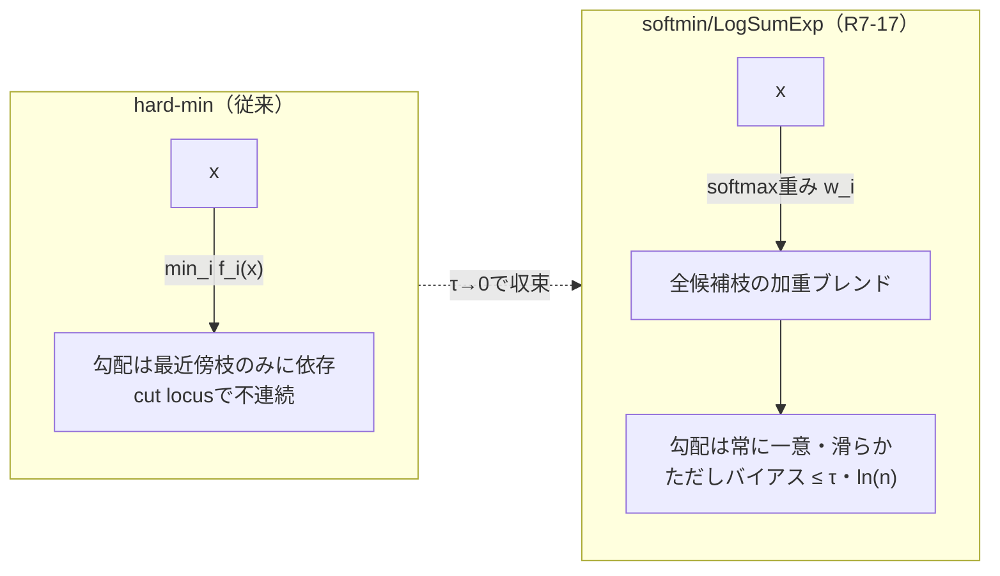
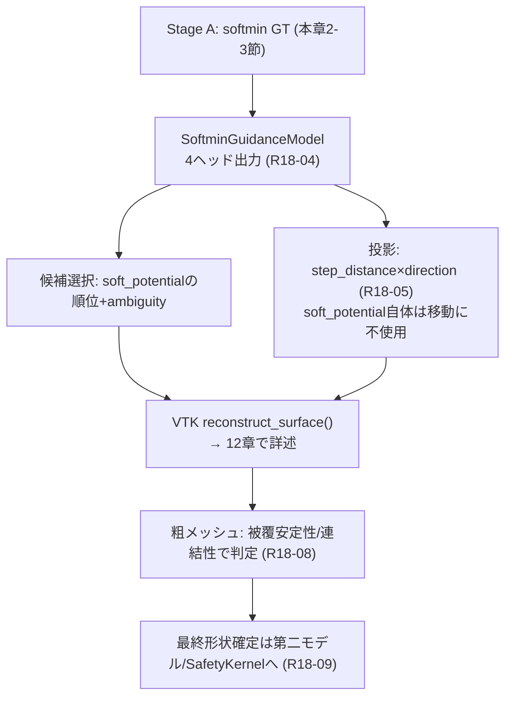

# 11. softmin/LogSumExp によるGT平滑化（cut locusへの発生源対策）

> 対応: `archi.md` §0C.1（`PipelineFailureReplayCorpus` の "cut locus近傍の系統的外挿" エントリ）, §0G（研究選択肢） / `CLAUDE.md` §19（R7-17系）, `AGENTS.md` §25（Round 18, 第一モデルでの正式採用）
> コード: `biw_poc/src/preprocess/midsurface_sampler.py: _softmin_guidance(), _smooth_face_branch_labels(), sample_udf_queries(), sample_boundary_shadow_queries()`

## 1. 概要

[10_cut_locus.md](10_cut_locus.md)で見たTD-16の系譜（R7-09〜R7-12, Round8〜9）は、すべて「歪んだGT場をどう
後から扱うか」という**後処理側**の緩和策だった。本章で扱うsoftmin/LogSumExp平滑化（R7-17, Round 12〜14）は
方向性が異なり、**GT構築そのもの**を多分岐の滑らかな近似に置き換えることで、cut locusの非微分可能性を
発生源で除去しようとする対策である。さらにRound 18（`AGENTS.md` §25）では、この平滑化された場が単なる
「VecSetAE UDFモデルのGT補正」にとどまらず、新設の独立モデル`SoftminGuidanceModel`の**主たる候補選択信号**
として正式採用されている。本章はこの2段階（GT平滑化の数学 → 第一モデルでの実用化）を扱う。

## 2. 数学的定義

### 記号の補足（本章で使う主な記号）

| 記号 | 意味 |
|---|---|
| $f_i(x)$ | クエリ点 $x$ から候補枝（候補面）$i$ までの距離 |
| $n$ | 候補枝の総数 |
| $\tau$ | 温度パラメータ（mm単位、小さいほどhard-minに近づく） |
| $\tilde u_\tau(x)$ | softmin/LogSumExpで定義される平滑化UDF |
| $w_i(x)$ | softmax重み（枝 $i$ の寄与度） |
| $u(x)$ | [01](01_UDFとSDF.md)と同じ厳密なhard-min UDF（$=\min_i f_i(x)$） |

### 2.1 softmin/LogSumExpの定義

$$
\tilde u_\tau(x) = -\tau \log \sum_i \exp\!\left(-\frac{f_i(x)}{\tau}\right)
$$

$\tau \to 0$ の極限で $\tilde u_\tau(x) \to \min_i f_i(x) = u(x)$（厳密なhard-min UDF）に収束する。
すなわちsoftminは「hard-minを滑らかに近似する関数族」であり、$\tau$ がその滑らかさを制御するノブである。

### 2.2 数値安定な実装形

$f_i(x)$ は数十〜数百mmのオーダーになりうるため、$\exp(-f_i/\tau)$ を素朴に計算するとアンダーフローする。
$f_{\min}(x) = \min_i f_i(x)$ を差し引いてから計算する標準的なlog-sum-expトリックを使う：

$$
\tilde u_\tau(x) = f_{\min}(x) - \tau \log \sum_i \exp\!\left(-\frac{f_i(x) - f_{\min}(x)}{\tau}\right)
$$

`_softmin_guidance()`（`midsurface_sampler.py:594-597`）はこの安定形をそのまま実装している：

```python
f_min = f_u[0]   # f_sorted is ascending, so index 0 is always the global min
w_unnorm = np.exp(-(f_u - f_min) / tau_mm)
w_sum = w_unnorm.sum()
u_sub[i] = f_min - tau_mm * np.log(w_sum)
```

常に $\tilde u_\tau(x) \le f_{\min}(x) = u(x)$ が成り立つ（指数項の和は常に1以上なので $\log$ は非負）。
これがR7-17追補で「候補枝集合からの脱漏」が致命的だった理由である——候補に真の最近傍枝が含まれていなければ、
その時点の $f_{\min}$ が真の全体最小値を超過し、$\tilde u_\tau(x) \le u(x)$ という保証そのものが破れる。

### 2.3 勾配：softmax重み付き合成

$\tilde u_\tau$ を $f_i$ で微分すると、各枝の単位方向ベクトル $\hat g_i = (x - p_i)/f_i(x)$ を
**softmax重み**で混合した形になる：

$$
\nabla \tilde u_\tau(x) = \sum_i w_i(x)\, \hat g_i, \qquad
w_i(x) = \frac{\exp(-f_i(x)/\tau)}{\sum_j \exp(-f_j(x)/\tau)}
$$

これは[01](01_UDFとSDF.md)で見た「hard-min UDFはcut locusでは1つの一意な勾配を持たない」という問題に対する
直接の答えになっている——softminの勾配は常に（softmax重みの加重平均として）一意に定まる、文字通り滑らかな
ベクトル場である。

### 2.4 理論上界：ブレンド量の上限

全 $n$ 個の候補枝が完全にタイ（$f_i$ がすべて等しい）した最悪ケースでは、$w_i = 1/n$ となり

$$
\tilde u_\tau(x) = f_{\min}(x) - \tau \ln n
$$

が最大のずれ（下方偏差）になる。この理論値は実測でも裏付けられている：body002のBOUNDARYカテゴリ
（$\tau=1.0$mm, $n_{\text{branches}}=9$）で実測された最大ブレンド量 $\approx 2.197$mm は、理論値
$\tau \ln 9 \approx 2.1972$mm とほぼ完全に一致した（`CLAUDE.md` §19）。



## 3. 実装上の落とし穴の系譜（3段階の修正）

理論式は単純だが、実装には3段階の修正が必要だった。これは「数学的に正しい式」と「数値的に安全な実装」が
別問題であることを示す好例である。

### 3.1 R7-17追補：候補集合に厳密最近傍枝を強制的に含める

初期実装は候補枝を `cKDTree(triangles_center)` によるcentroidベースのK近傍探索（`k_faces`個、デフォルト8）
のみで構成していたが、これは**真のpoint-to-triangle距離の不完全な代理**であり、特に細長い／歪んだ三角形では
真の全体最近傍面が候補集合から漏れることがあった。漏れると2.2節の保証 $\tilde u_\tau(x) \le u(x)$ が破れる
（実証: NEARカテゴリの約半数で違反、平均+4.55mm・最大+59.8mm）。

修正: `trimesh.proximity.closest_point()` による**厳密最近傍枝を無条件で候補集合に追加**する
（`_softmin_guidance()` 内の `exact_closest, exact_dist, exact_face = trimesh.proximity.closest_point(...)`、
`midsurface_sampler.py:504-506`）。これにより `n_branches = k_faces + 1` となり、保証は数値誤差レベル
（最大ずれ 2.5e-5mm）まで回復した。

### 3.2 R7-17追補2「対策A+B」：重複枝の二重カウントとパララックスバイアス

ユーザーから「板金から遠い所に異常値が存在しないこと」という品質要件が出たため詳細診断したところ、2つの
独立した問題が見つかった。

- **重複枝の二重カウント**: 3.1で追加した厳密最近傍枝が、centroid-kNN候補集合の上位枝とほぼ同一点を指す
  ケースが高頻度（全体55.1%）で発生し、softmaxの和の中で実質同じ枝を2回数えてバイアスを最大
  $\tau\ln 2\approx 0.693$mm 過大評価していた。
- **遠方パララックスバイアス**: 重複を除いてもなお、クエリ点が真の表面から離れるほどバイアスが単調に
  増大する構造的な効果が残った（固定 $\tau$・絶対空間での候補探索に内在する限界）。

**対策A（重複排除）**: 距離昇順ソート後、最近点座標が `dedup_tol_mm`（既定 $10^{-4}$mm）以内で一致する枝を
貪欲法でマージしてからsoftmax/log-sum-expを計算する（`_softmin_guidance()` 内の `keep`/`kept_branch_ids`
ループ、`midsurface_sampler.py:582-591`）。

**対策B（クリップ半径）**: 真の最近傍距離が `clip_radius_mm`（既定5.0mm）を超えるクエリ点は無条件に厳密
hard-minパスへフォールバックし、softminブレンドを一切適用しない（`midsurface_sampler.py:522-525`の
`idx_in = np.where(exact_dist <= clip_radius_mm)[0]`）。これにより半径超過領域でのバイアスは構造的にゼロになる
（実測: 5-10mm/10-20mm/20-50mm/50mm+ いずれもbias mean=0.0000mm）。

対策A+B適用後も、表面ごく近傍（真の距離<0.5mm）の点の56.6%が物理的に無効な**負のsoft potential**
（最小-2.01mm）を出力する課題が残った——これは「人為的なバグ」ではなく、複数の最近傍候補が拮抗する
**正規のマルチブランチ競合**に起因する、対策A+Bのスコープ外の現象である。

### 3.3 R7-17追補3「対策D+E」：損失計算時のみの負値GT対策

`QueryDecoder`の出力ヘッド最終層は `softplus()` で活性化されており、モデルの予測UDFは構造的に常に正
（R7-04）。つまり「モデルが負値を予測してしまう」問題は存在せず、不整合は「時々負になるGTターゲット」と
「常に正の予測」の間にのみ存在する。対応は損失計算・学習データの扱い側のみで良いと整理された。

- **対策D（GTスムーズフロア）**: 損失計算の直前にのみ
  $g_{\text{loss}} = \tau_{\text{floor}} \cdot \mathrm{softplus}(g_{\text{gt}} / \tau_{\text{floor}})$
  を適用する（`train.py: weighted_losses()`、`--gt-floor-tau-mm`、既定0.0=無効）。永続化されたデータセット
  (h5)も `near_mae` 診断指標も生の（負になりうる）GT値を参照し続ける——診断の正直さを保つための意図的な設計。
- **対策E（負値GT点の重み低減）**: `gt_udf < 0` の点について、既存のカテゴリ別損失重みに `neg_gt_weight`
  （既定1.0=無効）を乗算する。**学習中のモデル自身が出力する予測確信度ではなく、GTデータから決定論的に
  計算される `gt_udf<0` の判定**を根拠にしている——確信度ヘッド（R7-10）がまだ収束していない学習初期に
  「予測確信度をその場で同じ損失の重みに使う」循環参照的な不安定さを避けるため。

この2つは「学習時にのみ作用し、StageA側のGTデータ自体は書き換えない」設計だが、**この適用層（学習時 vs
StageA）の選択自体が、本稿執筆時点でcodex（並行作業エージェント）への意見照会中の未解決の設計フォーク**
として残っている（`HANDOFF_codex.md` §1）。理由は、StageA側で正値化すると「元々負だったか」の情報が消え、
対策Eの判定根拠が失われるため（対策Eとの両立コストと、診断の生データ保持のメリットを比較検討中）。

## 4. Round 18：第一モデルにおける正式採用

`CLAUDE.md` §19までのR7-17は「VecSetAE（既存UDFモデル）のGT平滑化」という位置づけだったが、Round 18
（`AGENTS.md` §25）はsoftminの扱いをさらに一段引き上げる。**Stage Aから候補選択・方向推定までsoftmin系の
表現で統一**し、`SoftminGuidanceModel` という既存VecSetAEから独立した新モデルの主信号として正式採用する
（判断ID R18-01, R18-02）。

重要な制約は「soft potentialの値そのものを移動量として直接使わない」ことである（R18-03〜R18-05）。
softminは符号付き・負値許容（3.3節）であり、これをそのまま投影距離に使うと逆走（cut locusを飛び越えて
誤った方向に動く）リスクがあるため、出力を4系統のヘッドに明示的に分離する（R18-04、`SoftminGuidance`
NamedTuple、`midsurface_sampler.py:331-338`と完全に対応）：

| ヘッド | 役割 | 符号・範囲 |
|---|---|---|
| `soft_potential` | 候補ランキング専用 | 符号付き、負値許容 |
| `step_distance` | 投影の実移動量（**ブレンドしない厳密hard-min距離**） | 非負 |
| `soft_direction`（`direction_toward_surface`） | 投影方向（ブレンド済み） | 単位ベクトル |
| `branch_ambiguity` | softmax重みのエントロピー、投影量の減衰に使用 | $[0,1]$ |

移動則は

$$
x_{\text{next}} = x + \mathrm{clamp}(\text{step\_distance}, 0, \text{max\_step}) \cdot \text{direction}
$$

であり（R18-05）、`reconstruct_softmin_guidance.py: project_candidates()` がこれを実装する。
soft potentialの負値は移動には一切使われない設計であり、`bounded_project()` 内で明示的に検証・排除される
ことが確認されている（`HANDOFF_codex.md` §0「Stage Aの『4情報』設計は妥当か」セクション）。

また、softminの候補枝は単純な三角形単位ではなく、**隣接面法線差5度以内を連結した「smooth face patch」単位**
へ変更されている（`_smooth_face_branch_labels()`、`SOFTMIN_BRANCH_MAX_DIHEDRAL_DEG = 5.0`、
`midsurface_sampler.py:326,352-356`）。これは「平面1枚を細かく再テセレーションするだけで
$\tau \ln n$ 分potentialが下がってしまう」という、2.4節の理論上界が引き起こす望ましくない副作用——
**メッシュ密度に依存してGT値が変わってしまう**こと——を防ぐためである。同一平面の再テセレーションで
potential/ambiguityが変わらない回帰試験が追加されている（`AGENTS.md` §25実装ログ）。

$\tau$ も固定の製品共通定数ではなく、再帰ラウンドと局所target edge lengthに連動して縮小する設計（R18-10、
初期候補 $\tau \approx 0.25\text{〜}0.5 \times \text{local\_target\_edge\_length}$）。第一モデルの完了条件は
最終表面精度ではなく、**粗メッシュの被覆安定性・ghost抑制・再帰処理へ渡せる連結性/安全性**である（R18-08、
R18-09）——最終形状確定は第二モデルまたは決定論的Geometry Finalization/SafetyKernelの責務として明確に分離
されている。

body002での初期PoC結果（`AGENTS.md` §25）: GT→Recon mean/p95 = 5.95mm/21.16mm、Recon→GT mean/p95 =
6.74mm/15.76mm、connected components = 27、boundary edges/non-manifold edges = 2,660/0。判断は「学習・生成
閉ループと粗い形状被覆は成立したが、p95距離・component数・境界辺数は安定した1周目生成の最終Go水準には未達」。



## 5. archi.mdとの接続

`archi.md` §0C.1 の `PipelineFailureReplayCorpus` は「cut locus近傍の系統的外挿」を既知の失敗カテゴリとして
列挙しているが、その対策の数学的詳細までは規定していない。本章のsoftmin平滑化は、`archi.md` §0G が挙げる
DUDF/MeshUDF系の代替手法（[10_cut_locus.md](10_cut_locus.md) §6で見た通り「ネットワーク学習時」に補正する
層）と同じ問題意識を、**GT構築側**で先取り的に実装したものと位置づけられる。Round 18でのSoftminGuidanceModel
採用は、`archi.md` の状態機械（§0A.5）における「最終精度ではなく安全な中間状態への到達」という設計思想
（R18-08/R18-09はこの思想の直接的な具体化）とも整合している。

## 6. 自己チェック問題

1. softmin/LogSumExpの数値安定形がなぜ $f_{\min}(x)$ を引いてから計算する必要があるのか、`exp()`のオーバー
   フロー/アンダーフローの観点から説明せよ。
2. $\tau \to 0$ の極限でsoftminがhard-min UDFに収束することを、softmax重みの挙動から説明せよ。
3. R7-17追補で「候補集合に厳密最近傍枝を無条件で含める」修正が必要だった理由を、$\tilde u_\tau(x) \le u(x)$
   という保証との関係で説明せよ。
4. 理論上界 $\tau\ln n$ が実測（BOUNDARYカテゴリ約2.197mm、理論値2.1972mm）とほぼ一致したことは、実装の
   正しさについて何を裏付けるか。
5. Round 18でsoft potentialを直接の移動量として使わず、独立した非負`step_distance`ヘッドを設けた理由を、
   3.2節の「負値出力」問題と関連づけて説明せよ。
6. smooth face patch（5度しきい値）による候補枝のグルーピングがないと、何が起きるか。2.4節の理論上界との
   関係で説明せよ。

### 解答解説

1. $f_i(x)$ は数十〜数百mmに達しうるため、$\exp(-f_i/\tau)$ を素朴に計算すると $\tau$ が小さい場合に
   極端に小さい値（アンダーフロー、ゼロ丸め）になりうる。$f_{\min}(x)$ を引いてから計算すると、最小の
   指数項は必ず $\exp(0)=1$ になり、他の項も $[0,1]$ に収まるため数値的に安全になる。
2. $\tau \to 0$ では、最小値 $f_{\min}$ 以外の枝の重み $w_i = \exp(-(f_i-f_{\min})/\tau)$ は
   $f_i > f_{\min}$ である限り急速にゼロへ収束する。結果として唯一最小の枝の重みが1に近づき、
   $\tilde u_\tau(x) \to f_{\min}(x) = u(x)$ に収束する。
3. 候補集合の $f_{\min}$（集合内の最小値）が真の全体最小値より大きい場合、softmin計算の出発点
   そのものが間違っており、计算結果の $\tilde u_\tau(x)$ が真の $u(x)$ を上回ってしまう
   （$\tilde u_\tau(x) \le u(x)$ の保証が破れる）。厳密最近傍枝を無条件で含めれば、候補集合の
   $f_{\min}$ は常に真の全体最小値と一致し、保証が数学的に担保される。
4. ブレンド量の理論上界という導出（2.4節）が、無関係な独立検証である実測データとほぼ完全に一致したことは、
   実装（softmax重み・log-sum-exp計算）が数式通り正しく動作していることの強い裏付けになる。
5. soft potentialは複数候補が拮抗する近傍では負値（最大-2.17mm程度）になりうる物理的に無効な値であり、
   これをそのまま移動量に使うと逆走するリスクがある。常に非負である独立した`step_distance`ヘッド
   （ブレンドしない厳密hard-min距離）を移動量専用に設けることで、ランキング専用の`soft_potential`と
   移動専用の`step_distance`の役割を分離し、負値による誤動作を構造的に防いでいる。
6. グルーピングがないと、同一の物理的に1枚の平面を細かく再テセレーション（三角形を増やす）するだけで
   候補枝数 $n$ が増え、2.4節の理論上界 $\tau\ln n$ に従ってブレンド量（バイアス）が増大してしまう。
   つまりGT値がCADの実際の幾何形状ではなく、メッシュの三角形分割密度という無関係な要因に依存してしまう。
   隣接面法線差5度以内を1つの物理的branchとして束ねることで、再テセレーションへの不変性を確保している。

## 7. 次に読むもの

- [12_点群再構成とreconstruct_surface.md](12_点群再構成とreconstruct_surface.md): 本章のSoftminGuidanceModelが
  生成した投影済み候補点群を、最終的にメッシュへ変換する `reconstruct_surface()`（VTK Hoppe型陰関数再構成）
  自体が独立したゴーストメッシュ発生源であるという、本日の調査で判明した事実を扱う。
