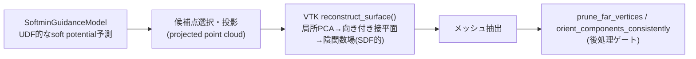
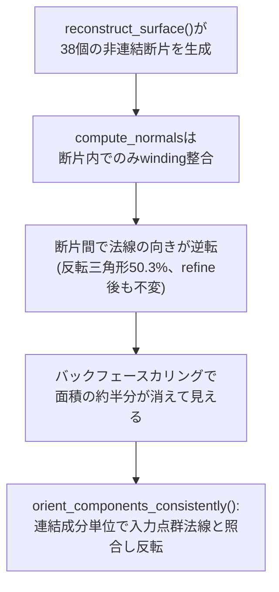

# 12. 散布点群からのメッシュ再構成と`reconstruct_surface()`の限界

> 対応: `archi.md` §0C.1（`PipelineFailureReplayCorpus` の "reconstruct_surface由来の疎領域外挿" エントリ）, §0E.1（評価設計）/ `AGENTS.md` §13（R13-01〜R13-16、R7-14のlegacy evidence化）, §25（Round 18 PoC）
> コード: `biw_poc/src/model/reconstruct.py: prune_far_vertices(), orient_components_consistently()`, `biw_poc/src/model/reconstruct_softmin_guidance.py: candidate_ranking_score(), select_ranked_candidates(), reconstruct_coarse_surface()`

## 1. 概要

[10_cut_locus.md](10_cut_locus.md)・[11_softmin_GT平滑化.md](11_softmin_GT平滑化.md)は、いずれも「ネットワークが
予測するUDF/potential場そのものの精度」を主題にしてきた。しかし本プロジェクトの再構成パイプラインは、
ネットワーク出力をそのままメッシュにするのではなく、**投影済みの候補点群** を一旦作ってから、VTKの
`reconstruct_surface()`（Hoppe型陰関数再構成）に渡してメッシュ化するという中間ステップを経由する。
本日（2026-06-22）の調査で、**この`reconstruct_surface()`自体が、cut locus由来の外挿とは独立した、もう一つの
主要なゴーストメッシュ発生源である**ことが判明した。本章はこの「点群→メッシュ」変換アルゴリズムの仕組みと、
その失敗モードを扱う。

## 2. 数学的背景：散布点群からの陰関数再構成

### 記号の補足（本章で使う主な記号）

| 記号 | 意味 |
|---|---|
| $P=\{p_i\}$ | 入力散布点群（投影済み候補点） |
| $\mathrm{nbr\_sz}$ | 各点の局所近傍サイズ（VTKパラメータ、本プロジェクトdefault 20） |
| $T_i$ | 点 $p_i$ 周りの局所接平面（PCAで推定） |
| $\hat n_i$ | $T_i$ の法線（向きは隣接平面との整合性で伝播） |

### 2.1 Hoppe型陰関数再構成の概要

`pv.PolyData(projected).reconstruct_surface(nbr_sz=nbr_sz)`（`reconstruct_softmin_guidance.py:647`）は、
Hoppe et al. (1992) の手法を実装したVTKの`vtkSurfaceReconstructionFilter`を呼び出す。アルゴリズムの骨子は：

1. 各点 $p_i$ について、最近傍 $\mathrm{nbr\_sz}$ 個の点を集め、主成分分析（PCA）で局所接平面 $T_i$ を推定する
   （最小分散方向が法線方向の推定値になる）。
2. 隣接する局所平面同士で法線の向き（符号）を伝播的に揃える（[01_UDFとSDF.md](01_UDFとSDF.md)で見た
   「向き付き法線が必要」という制約と同種の問題）。
3 . 各点の符号付き接平面群から、空間中の暗黙的なスカラー場（符号付き距離に近い量）を構成し、その零等値面を
   Marching Cubes類似の手法で抽出する。

この手順は[01](01_UDFとSDF.md)で見たSDF（符号付き距離場）に近い量を**局所PCA推定**から作り出すものであり、
本プロジェクトの主モデルが扱う**UDF（符号なし）**とは異なるアルゴリズム層であることに注意が必要である。
つまりパイプライン全体は「UDFを予測するネットワーク」→「点群に投影」→「局所SDF的な再構成（VTK内部）」という、
**2種類の異なる距離場表現を橋渡しする**構造になっている。

## 3. 失敗モード1：疎な点群からの外挿（本日の調査で確定）

### 3.1 段階別の距離測定

入力候補点→GTの距離を、パイプラインの各段階で測定したところ、`reconstruct_surface()`を経由した時点で
誤差が大きく悪化することが確認された（body002、本日の調査）。

| 段階 | mean | p95 |
|---|---:|---:|
| 候補点選択直後 | 1.56mm | 4.77mm |
| 3回投影後（VTK投入直前） | 0.68mm | 3.73mm |
| VTK再構成後のメッシュ頂点 | ~8.9mm | ~17mm |

投影までは誤差が一貫して改善している（1.56mm→0.68mm）のに対し、VTK再構成を経由した瞬間に誤差が
10倍以上に悪化している。さらに、再構成後の頂点は**自分自身の入力点群からの平均距離が10.25mm**ある
ことも確認された——これは「ネットワークの予測が悪い」のではなく、**VTKが自分に与えられた入力点群に対して
さえ外挿している**ことを意味する。つまり[10_cut_locus.md](10_cut_locus.md)で扱った「ネットワークが滑らかに
しか近似できない」という問題とは独立した、**再構成アルゴリズム自体の挙動**に起因する誤差源である。

### 3.2 根本原因：被覆ギャップ

なぜVTKは入力点群からも外れた外挿をするのか。原因はさらに上流の被覆ギャップに遡れる。GTサーフェスから
「最も近い投影済み候補点」までの距離を測ると、mean 14.30mm / p95 64.92mmと大きく、**GT表面の約25.9%が
どの候補点からも10mm以上離れている**ことが判明した。これは`reconstruct_coarse_surface()`の
`max_input_distance_mm`（既定10.0mm、`reconstruct_softmin_guidance.py:569`）による入力支持ゲート
（3.3節参照）が、オクルージョン領域や「これから推論すべき領域」を積極的に除外する設計になっているためである。
つまり「疎な点群しか与えられていない領域」を、局所PCA法（2.1節）は何の手がかりもないまま外挿で埋めようとし、
その結果が3.1節の悪化として現れる。

### 3.3 `nbr_sz`スイープ：滑らかさと完全性のトレードオフ

VTKの近傍サイズパラメータ`nbr_sz`を振った結果は次の通り（body002）：

| `nbr_sz` | connected components | 面積比 | mean誤差 |
|---|---:|---:|---:|
| 20（既定） | 6 | 1.03 | 7.04mm |
| 40 | 8 | 0.55 | 3.26mm |
| 80 | 1 | 0.44 | 1.66mm |

`nbr_sz`を上げるほど誤差・断片化はともに改善するが、これは**真の修正ではなく滑らかさと完全性のトレードオフ**
である——より広い近傍を使うほど局所平面の推定は安定するが、その分だけ細部（鋭いエッジ・小さい開口部等）が
過剰に平滑化されるリスクが増す。`candidate_ranking_score()`等のランキング層を変えずに`nbr_sz`だけを上げる
対応は対症療法であり、3.2節の根本（被覆ギャップ）には手を付けていないことに注意する。

さらに、`max_input_distance_mm`ゲートを締めて被覆を改善しようとすると、別の側面で精度が悪化する
トレードオフも確認されている：ゲートを厳しくすると局所精度は~0.5-0.6mmまで改善する一方、GT→点群の
カバレッジ（被覆率）はmean ~13.5-13.9mmまで悪化する。**精度とカバレッジは単純な1パラメータ調整では
同時に最適化できない**という、本プロジェクトのStage C設計における本質的な制約である。

## 4. 失敗モード2：連結成分の断片化と法線整合性（R7-14、既存実装）

`reconstruct.py: orient_components_consistently()`のdocstring（R7-14、"20% holes look"調査）が記録する、
3節とは別の独立した失敗モードがある。

`reconstruct_surface()`は本来1枚の連続したシートになるべき中立面に対し、多数の**非連結な断片**（実測:
body002の粗メッシュで38 face-connected components）を生成する。VTKの`compute_normals(consistent_normals=True)`
は各連結成分**内部**でのみ法線の向き（winding）の整合性を伝播でき、辺を共有しない異なる断片同士の関係は
扱えない。そのため断片ごとに法線の向きが逆転しうる。実測では、`compute_normals`適用前後で反転三角形の
割合が50.3%のまま全く変化しなかった——これは「ランダムな個別三角形の向き異常」ではなく、**断片単位**の
向き異常であることと完全に整合する。

この不整合は、point-distance系の評価指標（[03](03_point-to-surface距離とpoint-to-vertex距離.md)で見た
$d_{v2s}$等）には現れない——頂点の**位置**はGTに近いままだからである。しかし可視化・後段のバックフェース
カリングでは、メッシュ面積の約半分が見る角度によって「消えて見える」（GTが透けて見える）という、
ユーザーが実際に目視で報告した症状の直接的なメカニズムになっていた。

`orient_components_consistently()`はこれを修正するため、連結成分**単位**で実際の入力点群の法線
（`ref_normals`、Stage Aの`points_norm`/`normals`、本番推論時に唯一利用可能な向き付け根拠）との内積符号で
反転判定する（`reconstruct.py:367-383`）。`AGENTS.md` §20（R13-07）はこの実測値を「legacy evidence」として
明文化しており（面積比0.97→6.96倍、refine_rounds=3時点での反転面積比約49%、粗メッシュ38 face-connected
components）、正式な本番baselineではなく監査上の参照値として扱われている。

## 5. 候補点ランキングという新しい設計リスク

3節・4節は「VTKに渡す前後」の問題だが、**どの点をVTKに渡すか**（候補選択）自体にも、本日新たに認識された
設計リスクがある。

[11_softmin_GT平滑化.md](11_softmin_GT平滑化.md)で見た通り、`soft_potential`は符号付きで負値を取りうる。
候補点を生の符号付き`soft_potential`の昇順（小さい順）でランキングすると、モデルの精度が上がるほど
**branch_ambiguityが高い（cut locus近傍の）点を過剰に選択してしまう**リスクがある——直感的には逆説的だが、
複数候補が拮抗するcut locus近傍ほど、softminブレンドにより`soft_potential`が見かけ上小さく（ゼロに近く）
出やすいためである。これは「精度が上がるほど悪い点を選びやすくなる」という、ナイーブな実装では見落としやすい
設計上の罠である。

この問題は実際にはすでに対策済みであり、`candidate_ranking_score()`（`reconstruct_softmin_guidance.py:301-345`）
は4種類のランキングモードを実装している：

| モード | スコア定義 | 意図 |
|---|---|---|
| `raw_signed` | $\text{potential} \times \text{scale}$ | 旧来の素朴な方式（cut locus過剰選択リスクあり） |
| `step_distance` | $\max(\text{step\_distance}, 0) \times \text{scale}$ | 符号なし実移動量でランキング |
| `abs_potential`（既定の土台） | $\lvert\text{potential}\rvert \times \text{scale}$ | 符号によらず「ゼロに近い」点を選ぶ |
| `abs_potential_ambiguity`（既定） | 上記 + $\mathrm{clip}(\text{ambiguity},0,1) \times \text{ambiguity\_penalty\_mm}$ | ambiguityが高い点にペナルティを課し、cut locus近傍の過剰選択を抑制 |
| `spatial_balanced` | 上記スコアをCartesianセルでround-robin化（`_spatially_balanced_order()`） | 空間的な偏り（一部領域への候補点集中）も同時に抑制 |

既定値は`abs_potential_ambiguity`であり、5節で述べたリスクに対する直接対策がすでに本番コードパスに
組み込まれている。

## 6. 決定論的ゲートとfail-closed設計

`reconstruct_coarse_surface()`は3.2節のゲート（`_input_gate_indices()`、入力点群までの距離が
`max_input_distance_mm`を超える候補を除外）を**候補選択時**と**投影後の再検証**の2回適用し、いずれかで
通過数が`minimum_required`を下回ると`InsufficientEvidenceError`を送出して処理を中断する
（`reconstruct_softmin_guidance.py:424-428, 633-637`、コメント:
"Projection is bounded, but a wrong direction head could still move away. Re-apply the independent
geometric gate and fail closed if evidence drops."）。これは`AGENTS.md` R13-02の
「候補点ゲート通過数不足時のungated fallbackを禁止し、`INSUFFICIENT_EVIDENCE`でfail-closed停止する」
という監査判断と一致する設計であり、「足りないなら不確かな結果を返すより止まる」というSafetyKernel思想
（後述）の具体的な実装例である。

## 7. archi.mdとの接続

`archi.md` §0C.1 の `PipelineFailureReplayCorpus` は「reconstruct_surface由来の疎領域外挿」を既知の失敗
カテゴリとして明記しており、本章3節の調査はその具体的な実測根拠を提供する。`archi.md` の安全設計思想
（§0A.5の状態機械、§0I.1〜§0I.7の安全性境界）は「不確実な領域で無理に確定的な出力を作らない」ことを
基本方針としており、6節のfail-closed設計（R13-02）、4節の連結成分単位の慎重な向き付け補正（R7-14）は
いずれもこの思想の具体化である。`AGENTS.md` §20のR13-05（「幾何Go/No-Go距離をvertex distanceではなく
point-to-surfaceへ統一、vertex distanceはdebug専用」）は[03](03_point-to-surface距離とpoint-to-vertex距離.md)
の教訓を正式な評価設計として明文化したものでもある。

## 8. 残された課題（未解決・調査中）

本章で扱った3つの失敗モード（疎領域外挿、断片化と法線不整合、候補ランキングのcut locus偏り）はいずれも
個別の原因・対策が比較的明確だが、`SoftminGuidanceModel`系の再構成メッシュでは、これらとは性質の異なる
**未解決の法線配向異常**が並行調査agentによって報告されている（`HANDOFF_codex.md` §0、2026-06-21時点）。
具体的には、再学習後のメッシュで主成分（頂点の95.6%）内ですら面の75%が60°超の法線ズレを持ち、しかも
TD-16（[10](10_cut_locus.md)）の特徴である「誤差がGT境界からの距離と強く相関する」というパターンとは
異なり、相関係数が-0.02〜-0.03とほぼ無相関であることが確認されている。原因は
「(a)モデルの方向予測自体が間違っている」のか「(b)投影後の点群密度がVTKの局所法線推定にとって不適切」
なのかが未確定のまま、本稿執筆時点で並行作業エージェントへの意見照会が継続中である。これは本章が扱う
3つの失敗モードと隣接した領域ではあるが、**現時点では未解決の調査課題であり、確立した教訓ではない**ことを
明確に区別しておく。

## 9. 自己チェック問題

1. `reconstruct_surface()`が内部的に構成する陰関数場が、本プロジェクトの主モデルが予測するUDFと異なる
   理由を、[01](01_UDFとSDF.md)のUDF/SDFの区別を使って説明せよ。
2. 3.1節で「投影後点群の誤差は0.68mmまで改善しているのに、VTK再構成後は8.9mmまで悪化する」という観測が、
   「ネットワークの予測精度の問題」ではなく「再構成アルゴリズム自体の問題」であることを示す決定的な証拠は
   何か。
3. `nbr_sz`を上げると誤差が改善する一方、なぜこれを「根治」ではなく「トレードオフ」と呼ぶべきか説明せよ。
4. R7-14の断片化問題（4節）が、point-to-surface距離のような位置ベースの評価指標では検出できない理由を
   説明せよ。
5. 5節で「精度が上がるほど悪い点（cut locus近傍）を選びやすくなる」という逆説的なリスクが生じる理由を、
   softminのブレンド挙動（[11](11_softmin_GT平滑化.md)）と関連づけて説明せよ。
6. `InsufficientEvidenceError`によるfail-closed設計が、`archi.md`のどの設計思想と整合するか説明せよ。

### 解答解説

1. UDFは符号を持たない量であり、向き付き法線を必要としない。一方`reconstruct_surface()`は各点周りの
   局所接平面をPCAで推定し、隣接平面間で法線の向きを伝播的に揃えるという、符号付き距離場（SDF）に近い
   表現を内部的に構成している。つまりUDFを予測するモデルの出力を、向き付けを要求する別のアルゴリズムへ
   橋渡ししているため、両者は異なる距離場表現である。
2. 再構成後のメッシュ頂点が、ネットワークが直接関与しない「自分自身に入力された点群」からも平均10.25mm
   離れているという事実。ネットワークの予測精度に問題があるなら誤差は入力点群への忠実さとして現れる
   はずだが、VTKが自分の入力点群からも外れた点を生成しているということは、誤差の発生源が予測モデルでは
   なく再構成アルゴリズム自体にあることを示す。
3. `nbr_sz`を上げることは局所近傍を広げて平面推定を安定させているに過ぎず、3.2節で特定した根本原因
   （候補点群がGT表面の約25.9%を被覆できていないという疎密の偏り自体）には対処していない。広い近傍は
   平滑化が強まる副作用（細部の消失リスク）を伴うため、誤差改善は「滑らかさで誤魔化す」トレードオフであり、
   被覆ギャップという根本原因の解消ではない。
4. 連結成分単位の法線反転は頂点の3次元**位置**を一切変えない（三角形の頂点順序だけを入れ替える）ため、
   point-to-surface距離のような位置ベースの指標は反転の前後で値が変わらない。実際に描画・バックフェース
   カリングという見た目の問題として現れて初めて発見された。
5. softminブレンドはcut locus近傍（複数候補枝が拮抗する領域）で`branch_ambiguity`が高くなり、その結果
   `soft_potential`が複数候補の打ち消し合いにより見かけ上ゼロに近い値を取りやすい。生の符号付き値を
   そのまま昇順ランキングすると、こうした「本当は不確実だが数値上はゼロに近い」点を優先的に選んでしまう。
6. `archi.md`の安全設計思想（§0A.5状態機械、§0I安全性境界）が一貫して採る「不確実な領域では無理に確定的な
   出力を生成せず、安全に停止する」というfail-closed思想と整合する。証拠（入力点群との近さ）が不足する
   候補集合からungated fallbackで処理を続行するのではなく、`INSUFFICIENT_EVIDENCE`という明示的な失敗状態
   で停止することで、品質の保証されないメッシュが後段（CAE等）に渡る事故を未然に防ぐ。

## 10. まとめ：カテゴリAを通して

本章とその前段（[01](01_UDFとSDF.md)〜[11](11_softmin_GT平滑化.md)）でカテゴリA（幾何処理・メッシュ数学の
基礎）の12項目を一周した。[01](01_UDFとSDF.md)のUDFの基礎的性質が、[02](02_MarchingCubesとDCUDF抽出.md)の
メッシュ抽出アルゴリズム設計、[03](03_point-to-surface距離とpoint-to-vertex距離.md)〜
[05](05_メッシュ品質指標.md)の評価指標設計、[06](06_chord_deviation弦偏差誤差.md)〜
[09](09_remeshing操作split_collapse_flip.md)のremeshing操作設計、[10](10_cut_locus.md)のcut locus問題
（TD-16）、[11](11_softmin_GT平滑化.md)のGT平滑化による発生源対策、そして本章の再構成アルゴリズム自体の
限界——という一連の依存関係を通して見えてきたのは、**1つのスカラー誤差指標だけでは品質を保証できず、
被覆・連結性・法線整合性・候補選択バイアスなど複数の独立した軸を同時に管理する必要がある**という設計上の
教訓である。次のステップは `archi_learning_plan.md` のカテゴリC（安全工学・状態機械設計）に進み、こうした
「未解決の不確実性」をシステムとしてどう安全に扱うかを学ぶことになる。
