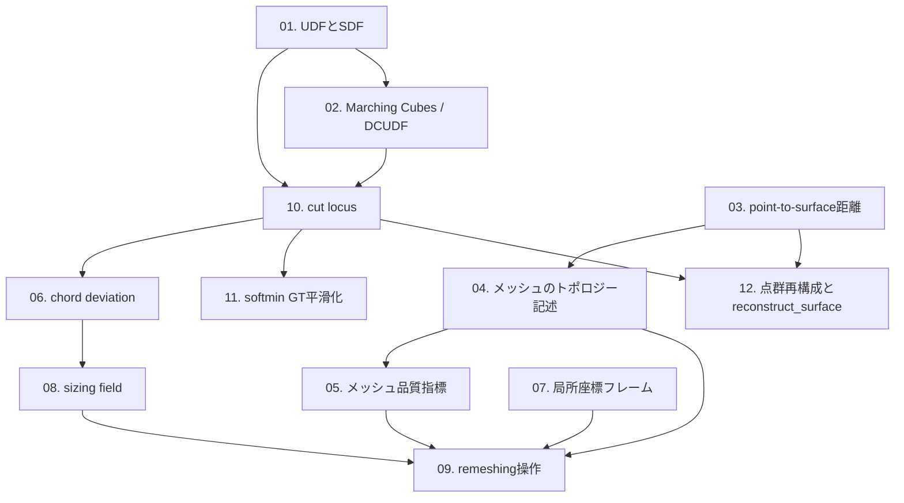

# A. 幾何処理・メッシュ数学の基礎

`archi_learning_plan.md` Part 1 表Aに対応する10項目に、現行方針（Round 17〜18のsoftmin平滑化・SoftminGuidanceModel）
を反映した2項目（11, 12）を加えた計12項目。GHMR全体（`archi.md`）を理解するための最初の地層であり、
B（深層学習）・C（安全工学）・D（統計的評価）はすべてこのカテゴリの語彙を前提にしている。

## 読む順番（推奨）

依存関係に沿って次の順で読むことを推奨する（`archi_learning_plan.md` Part 2 と整合）。

## 項目一覧

| # | ファイル | 一言で | 実装状況 |
|---|---|---|---|
| 1 | [01_UDFとSDF.md](01_UDFとSDF.md) | 符号なし距離場と符号付き距離場の違い、なぜ中立面でUDFが必要か | 実装済み（`vecset_ae.py`, `dcudf_extract.py`） |
| 2 | [02_MarchingCubesとDCUDF抽出.md](02_MarchingCubesとDCUDF抽出.md) | 等値面抽出の古典手法と、UDF専用の二重被覆抽出法 | 実装済み（`dcudf_extract.py`） |
| 3 | [03_point-to-surface距離とpoint-to-vertex距離.md](03_point-to-surface距離とpoint-to-vertex距離.md) | 距離評価の2方式とその乖離 | 実装済み（`dcudf_reconstruct.py`） |
| 4 | [04_メッシュのトポロジー記述.md](04_メッシュのトポロジー記述.md) | non-manifold, Euler標数, genus, connected component, boundary loop | 実装済み（`verify_topology_patch.py`等） |
| 5 | [05_メッシュ品質指標.md](05_メッシュ品質指標.md) | 最小角・aspect ratio・反転・面積比 | **未実装**（`archi.md`提案のみ。実測の副産物のみ存在） |
| 6 | [06_chord_deviation弦偏差誤差.md](06_chord_deviation弦偏差誤差.md) | 弦偏差による曲率追従誤差の評価 | **未実装**（`reconstruct.py`に類似機構あり） |
| 7 | [07_局所座標フレーム.md](07_局所座標フレーム.md) | 接線・法線分解によるSO(3)同変表現 | 部分実装（`reconstruct.py: laplacian_smooth_project`） |
| 8 | [08_sizing_field.md](08_sizing_field.md) | 局所目標辺長場とgrowth ratio | **未実装**（`archi.md §0A.3-G`提案のみ） |
| 9 | [09_remeshing操作split_collapse_flip.md](09_remeshing操作split_collapse_flip.md) | split/collapse/flipとヒステリシス制御 | 部分実装（`subdivide_and_project`は分割のみ） |
| 10 | [10_cut_locus.md](10_cut_locus.md) | UDFの非微分可能な特異点、TD-16の根本原因 | 現象は実測済み、対策は研究中 |
| 11 | [11_softmin_GT平滑化.md](11_softmin_GT平滑化.md) | softmin/LogSumExpによるGT場の発生源平滑化、Round 18第一モデルでの主信号採用 | 実装済み（`midsurface_sampler.py: _softmin_guidance()`）、Round 18 PoC検証済み |
| 12 | [12_点群再構成とreconstruct_surface.md](12_点群再構成とreconstruct_surface.md) | VTK `reconstruct_surface()`由来の疎領域外挿・断片化・候補ランキングバイアス | 実装済み（`reconstruct.py`, `reconstruct_softmin_guidance.py`）、一部は調査継続中 |
