# 学習資料 A-01: 大規模言語モデル（LLM）一般

**対象読者**: Pythonは書けるが LLM の内部動作を理解していないエンジニア / AutoMetalSheet Phase 1 実装担当者
**最終更新**: 2026-03-23
**学習時間目安**: 4〜6時間

---

## 目次

1. [この資料の位置づけ — AutoMetalSheetでの使用箇所マップ](#1-この資料の位置づけ)
2. [LLMの基礎：トークン化とは何か](#2-llmの基礎トークン化とは何か)
3. [Transformerアーキテクチャの概要](#3-transformerアーキテクチャの概要)
4. [自己回帰生成（Autoregressive Generation）の仕組み](#4-自己回帰生成autoregressive-generationの仕組み)
5. [Samplingパラメータの解説と板金設計用途での推奨値](#5-samplingパラメータの解説と板金設計用途での推奨値)
6. [KV Cache の仕組みと推論速度への影響](#6-kv-cache-の仕組みと推論速度への影響)
7. [System Prompt / User Prompt の設計](#7-system-prompt--user-prompt-の設計)
8. [Few-Shot vs Zero-Shot（AutoMetalSheetでの推奨）](#8-few-shot-vs-zero-shot)
9. [JSON Mode / Function Calling / Tool Use](#9-json-mode--function-calling--tool-use)
10. [Hallucination の原因と対策](#10-hallucination-の原因と対策)
11. [AutoMetalSheet 3層LLMハイブリッド設計](#11-autometalsheet-3層llmハイブリッド設計)
12. [In-Context Learning と Prompt Engineering ベストプラクティス](#12-in-context-learning-と-prompt-engineering-ベストプラクティス)
13. [Batch Inference の実装（コスト最適化）](#13-batch-inference-の実装コスト最適化)
14. [Claude API 実装例（実際のAutoMetalSheetユースケース）](#14-claude-api-実装例)
15. [参考文献・公式ドキュメント](#15-参考文献公式ドキュメント)

---

## 1. この資料の位置づけ

### AutoMetalSheet における LLM の役割

AutoMetalSheet は、自然言語で書かれた板金設計要件を受け取り、DFM（設計生産性）チェック済みの CadQuery コードと CATIA 連携用 STEP ファイルを自動生成するシステムです。LLM はそのパイプラインの中核を担います。

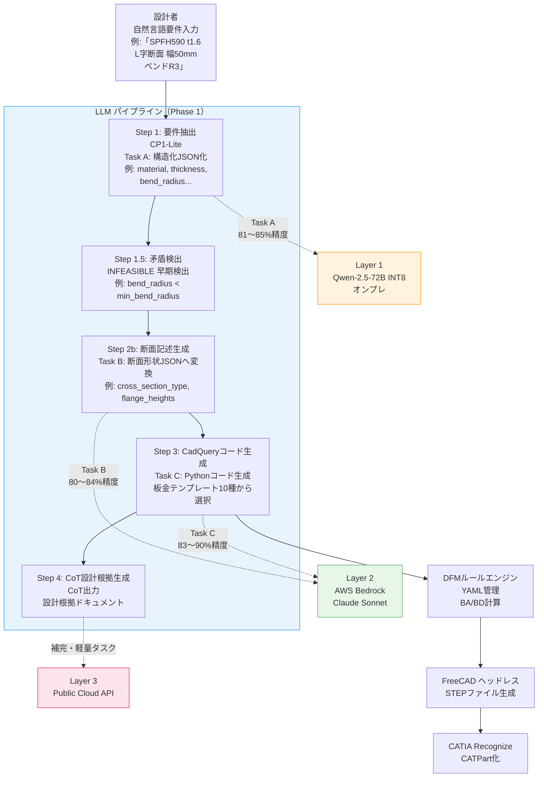

### この資料で学ぶ内容のマッピング

| 学習セクション | AutoMetalSheetでの直接用途 |
|--------------|--------------------------|
| トークン化 | コンテキストウィンドウ使用量の見積もり |
| Transformerアーキテクチャ | モデル選定・性能比較の判断基準 |
| Samplingパラメータ | タスク別（A/B/C）パラメータ最適化 |
| KV Cache | Qwen-2.5-72B オンプレ推論の速度チューニング |
| System Prompt 設計 | DFMルール・材料DB情報の注入方法 |
| Few-Shot Prompting | CadQueryコード生成精度向上 |
| JSON Mode / Function Calling | Step 1〜2b の構造化出力保証 |
| Hallucination 対策 | BA/BD数値の誤生成防止 |
| 3層ハイブリッド設計 | Phase 1 実装のシステム全体設計理解 |
| Batch Inference | 大量設計案の一括処理コスト最適化 |

---

## 2. LLMの基礎：トークン化とは何か

### 2.1 トークン（Token）とは

**トークン（Token）**: LLM が処理する最小単位。単語そのものではなく、単語を意味のある部分文字列に分割したもの。

LLM はテキストを文字や単語単位ではなく「トークン」単位で処理します。日本語・英語混在テキストを扱う AutoMetalSheet では、トークン数の見積もりが API コスト計算に直結します。

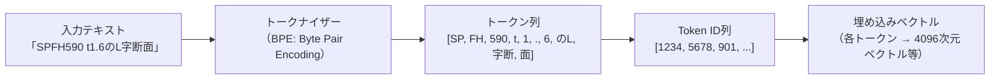

### 2.2 BPE（Byte Pair Encoding）の仕組み

現代の LLM の多くは **BPE（バイト対符号化）** というアルゴリズムでトークン化を行います。

**アルゴリズムの概要**:
1. 最初は全文字を個別トークンとして扱う
2. 最も頻繁に隣接するトークンペアを1つのトークンにマージ
3. これを語彙サイズ上限まで繰り返す

**日本語テキストでのトークン数の目安**:

| テキスト例 | 文字数 | トークン数（GPT-4系）|
|----------|--------|---------------------|
| "SPFH590 plate thickness 1.6mm" | 30文字 | 約7〜10 tokens |
| 「板厚1.6mmのSPFH590を使い、曲げ半径R3でL字断面を作成する」| 35文字 | 約25〜35 tokens |
| 材料DB + DFMルール + 断面仕様（典型的システムプロンプト） | 〜3000文字 | 約1500〜2500 tokens |

> **実装上の注意**: 日本語は英語の約2〜3倍のトークンを消費します。AutoMetalSheet のシステムプロンプトを設計する際は、DFMルール等の長い日本語テキストをトークン効率よく英語またはYAML形式で書くことを検討してください。

### 2.3 語彙サイズ（Vocabulary Size）

**語彙サイズ（Vocabulary Size）**: トークナイザーが認識できるユニークなトークンの総数。

| モデル | 語彙サイズ |
|--------|-----------|
| GPT-4 / GPT-4o | 100,277 |
| Claude 3.x / 4.x | 非公開（〜100K推定）|
| Qwen-2.5 | 151,646 |
| LLaMA 3 | 128,256 |

Qwen-2.5 は日本語・中国語・英語の多言語対応のため語彙サイズが大きく、日本語テキストのトークン効率が比較的良いです。

### 2.4 コンテキストウィンドウ（Context Window）

**コンテキストウィンドウ（Context Window）**: LLM が一度の推論で参照できるトークンの最大数。

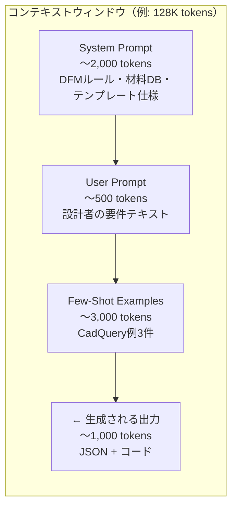

**主要モデルのコンテキストウィンドウ**:

| モデル | コンテキストウィンドウ |
|--------|---------------------|
| Claude Sonnet 4.x | 200,000 tokens |
| GPT-4o | 128,000 tokens |
| Qwen-2.5-72B | 128,000 tokens |
| Qwen-2.5-72B (vLLM デプロイ時) | 設定次第（デフォルト32K〜128K）|

> **AutoMetalSheet での注意**: 一つの設計セッションに材料DB（〜500 tokens）、DFMルール全量（〜1,500 tokens）、Few-Shot例3件（〜3,000 tokens）を毎回注入すると合計〜5,000 tokens になります。コンテキストウィンドウは十分ですが、オンプレ Qwen では KV Cache のメモリ消費に注意が必要です（後述 §6）。

---

## 3. Transformerアーキテクチャの概要

### 3.1 歴史的背景

2017年、Google のチームが論文 **"Attention Is All You Need"**（Vaswani et al., NeurIPS 2017）を発表し、Transformer アーキテクチャを提案しました。それ以前の系列モデル（RNN/LSTM）が抱えていた以下の問題を解決しました:

- **長距離依存の学習困難**: 数百トークン離れた情報の関連性を学べない
- **並列計算不可**: 系列を逐次処理するため GPU の並列性を活かせない

Transformer は Attention 機構のみで両問題を解決し、現代の LLM（GPT, Claude, Qwen 等）すべての基盤となっています。

### 3.2 オリジナルTransformerのEncoder-Decoder構造

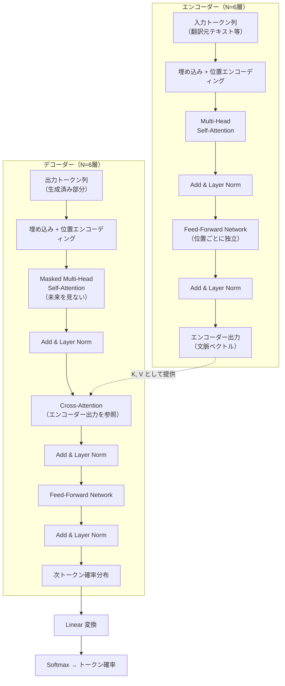

### 3.3 LLMで使われるDecoder-Only構造

GPT, Claude, Qwen など現代の LLM は **Decoder-Only（デコーダーのみ）** アーキテクチャを採用しています。翻訳のような「入力→変換→出力」ではなく、「テキストを続きを生成する」タスクに特化しているためです。

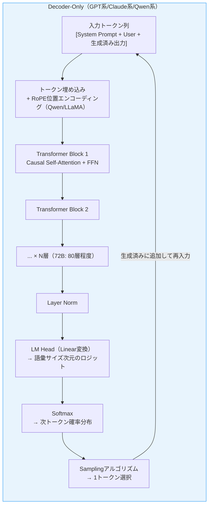

**Encoder-Only vs Decoder-Only vs Encoder-Decoder の比較**:

| アーキテクチャ | 代表モデル | 主な用途 |
|--------------|----------|---------|
| Encoder-Only | BERT, RoBERTa | テキスト分類・埋め込み生成 |
| Decoder-Only | GPT-4, Claude, Qwen | テキスト生成・コード生成 |
| Encoder-Decoder | T5, BART, 翻訳モデル | 翻訳・要約 |

AutoMetalSheet では**テキスト生成とコード生成**が主目的なので、Decoder-Only モデルを使用します。

### 3.4 Self-Attention（自己注意機構）の仕組み

**Self-Attention（自己注意機構）**: トークン列の各要素が、同じ列の他の全要素とどれくらい「関連しているか」を計算する機構。

#### 3.4.1 Q / K / V の概念

各トークンの埋め込みベクトルから3つのベクトルを生成します:

| ベクトル | 英名 | 役割 | 例え |
|---------|------|------|------|
| **Q** | Query（クエリ） | 「私は何を知りたいか」 | 検索クエリ |
| **K** | Key（キー） | 「私はどんな情報を持っているか」 | 文書のタグ |
| **V** | Value（値） | 「実際の情報の内容」 | 文書の本文 |

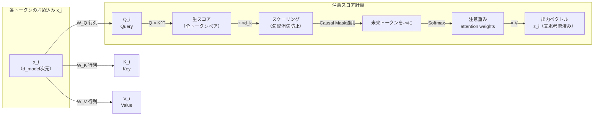

#### 3.4.2 スケール付き内積注意の数式

Vaswani et al. (2017) が提案した **Scaled Dot-Product Attention**:

```
Attention(Q, K, V) = softmax( Q × K^T / √d_k ) × V
```

各記号の意味:
- `Q`: Query 行列 (seq_len × d_k)
- `K`: Key 行列 (seq_len × d_k)
- `V`: Value 行列 (seq_len × d_v)
- `d_k`: Key/Query の次元数（例: 128）
- `√d_k` での除算: 内積が大きくなりすぎて Softmax が飽和するのを防ぐスケーリング

**なぜスケーリングが必要か**:
`d_k` が大きいほど Q と K の内積の値が大きくなり、Softmax が「ほぼ0か1」のような極端な分布になります。すると勾配が消失し、学習が止まります。`√d_k` で割ることでこれを防ぎます。

**板金設計での直感的理解**:
「SPFH590 板厚1.6mm で **曲げ半径 R3** を指定した場合」というテキストを処理するとき、「R3」というトークンは「曲げ半径」「DFM制約チェック」「K-factor計算」などの関連トークンに高い Attention 重みを割り当て、無関係なトークンはほぼ0になります。

#### 3.4.3 Multi-Head Attention（多頭注意機構）

**Multi-Head Attention（多頭注意機構）**: Scaled Dot-Product Attention を並列に複数実行し、異なる「関係性の観点」を同時に学習する機構。

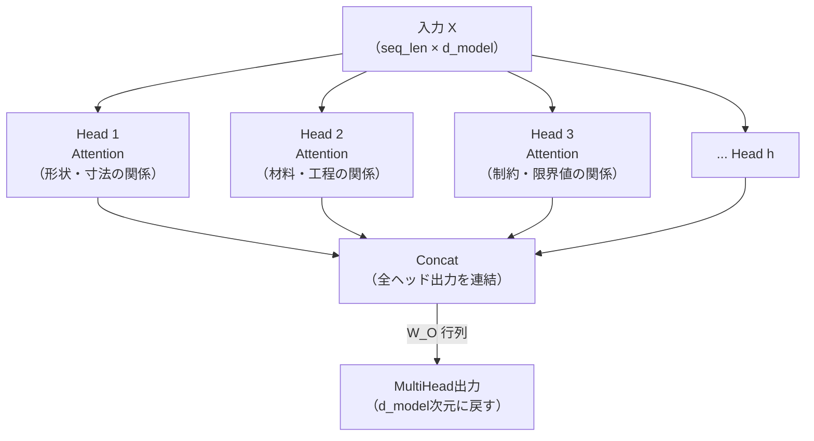

```
MultiHead(Q, K, V) = Concat(head_1, ..., head_h) × W_O
head_i = Attention(Q × W_Q_i, K × W_K_i, V × W_V_i)
```

GPT-4o などの大規模モデルでは `h = 96` 程度のヘッド数を使用します。

### 3.5 Position Encoding（位置エンコーディング）

**Position Encoding（位置エンコーディング）**: Transformer には系列順序の概念がないため、各トークンの位置情報を明示的に埋め込みベクトルに加算する技法。

Attention 機構は本質的に順序を考慮しません（全ペアを同時に計算）。「板厚1.6mm」と「板厚mm1.6」を区別するために位置情報が必要です。

**主要な実装方式**:

| 方式 | 採用モデル | 特徴 |
|------|----------|------|
| Sinusoidal（正弦波）| オリジナル Transformer | 学習不要・固定パターン |
| Learned（学習済み）| GPT-2, BERT | 訓練データから位置表現を学習 |
| **RoPE** (Rotary Position Embedding) | **LLaMA, Qwen-2.5, Mistral** | 相対位置を回転で表現・長コンテキストに強い |
| ALiBi | MPT | 注意スコアに線形バイアスを加算 |

**Qwen-2.5 は RoPE を採用**しており、128K トークンの長いコンテキストを扱えます。AutoMetalSheet で大量の DFM ルールや材料DB を System Prompt に含める場合でも安定した性能が期待できます。

### 3.6 Feed-Forward Network（FFN）

各 Transformer ブロックには Attention の後に **FFN（Feed-Forward Network）** が続きます。

```
FFN(x) = max(0, x × W_1 + b_1) × W_2 + b_2
```

または SwiGLU（Qwen/LLaMA 系）:

```
FFN(x) = (SiLU(x × W_gate) ⊙ (x × W_up)) × W_down
```

FFN は「知識の格納庫」として機能します。Attention が「どのトークンに注目するか」を決める一方、FFN が「その情報をどう変換するか（知識の活性化）」を担当します。

### 3.7 Layer Normalization と Residual Connection

各サブレイヤー（Attention, FFN）の前後に **残差接続（Residual Connection）** と **Layer Normalization** を適用します。

```
出力 = LayerNorm(x + Sublayer(x))
```

これにより:
- 勾配消失・爆発を防止（深いネットワークの安定学習）
- 学習の高速化

---

## 4. 自己回帰生成（Autoregressive Generation）の仕組み

### 4.1 自己回帰生成とは

**Autoregressive Generation（自己回帰生成）**: 生成済みのトークン列を入力として受け取り、次の1トークンを予測する操作を繰り返すことでテキストを生成する方式。

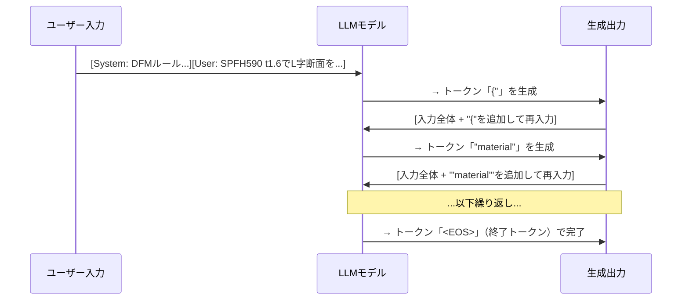

### 4.2 推論の各フェーズ

LLM の推論は2つのフェーズから成ります:

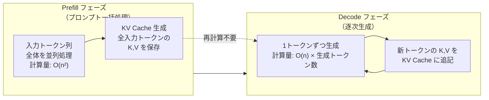

**Prefill（プリフィル）**: 入力プロンプト全体を一度に処理し、全トークンの KV を計算・保存します。計算量は入力長 n の二乗（O(n²)）です。

**Decode（デコード）**: 1トークンずつ生成します。既存の KV Cache を再利用するため、計算量は線形（O(n)）です。

### 4.3 停止条件

生成の停止は以下の条件で発生します:

1. **EOS トークン（End Of Sequence）**: モデルが終了を示す特殊トークンを生成
2. **max_tokens 制限**: 指定した最大トークン数に到達
3. **Stop Sequence**: 指定した文字列（例: `"}"` や `"\n\n"`)が生成された時点で停止

---

## 5. Samplingパラメータの解説と板金設計用途での推奨値

### 5.1 Token Probability（トークン確率）とロジット

モデルは各ステップで語彙全体の**ロジット（logit）**を出力します。ロジットに Softmax を適用すると**トークン確率**になります。

```
P(token_i) = exp(logit_i) / Σ_j exp(logit_j)
```

例えば「板厚=1.6」の次のトークンとして:
- `"mm"`: 確率 0.72
- `"ミリ"`: 確率 0.15
- `"cm"`: 確率 0.08
- その他: 確率合計 0.05

このとき Greedy Decoding（貪欲法）では常に最高確率の `"mm"` を選択します。

### 5.2 Temperature（温度パラメータ）

**Temperature（温度パラメータ）**: Softmax 前のロジットを割る値。確率分布の「シャープさ」を制御する。

```
P(token_i | T) = exp(logit_i / T) / Σ_j exp(logit_j / T)
```

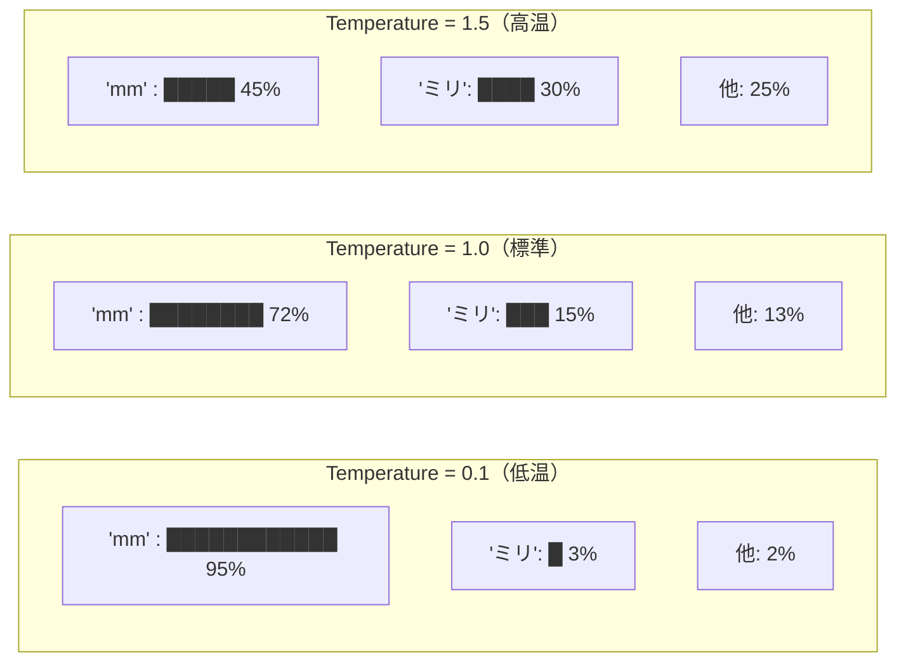

**AutoMetalSheet タスク別推奨温度**:

| タスク | 推奨 Temperature | 理由 |
|--------|----------------|------|
| Task A: 要件構造化JSON生成 | `0.1 〜 0.2` | 同じ入力→常に同じJSON必要。確定的出力 |
| Task B: 断面記述JSON生成 | `0.1 〜 0.3` | 設計寸法は「正解」が存在する。低い方が良い |
| Task C: CadQueryコード生成 | `0.1 〜 0.2` | コードは構文的に正しくなければならない |
| CoT 設計根拠ドキュメント生成 | `0.4 〜 0.6` | 自然な文章→やや多様性が必要 |
| 矛盾検出 | `0.0 〜 0.1` | Yes/No の判断→確定的で十分 |

> **重要**: Temperature = 0 は Greedy Decoding と等価（常に最高確率トークンを選択）。板金 CAD コード生成では Temperature を低く設定するのが正解です。

### 5.3 Top-P Sampling（Nucleus Sampling）

**Top-P Sampling（Nucleus Sampling）**: 上位確率のトークンを累積確率が P に達するまで選び、その候補の中からサンプリングする方式。

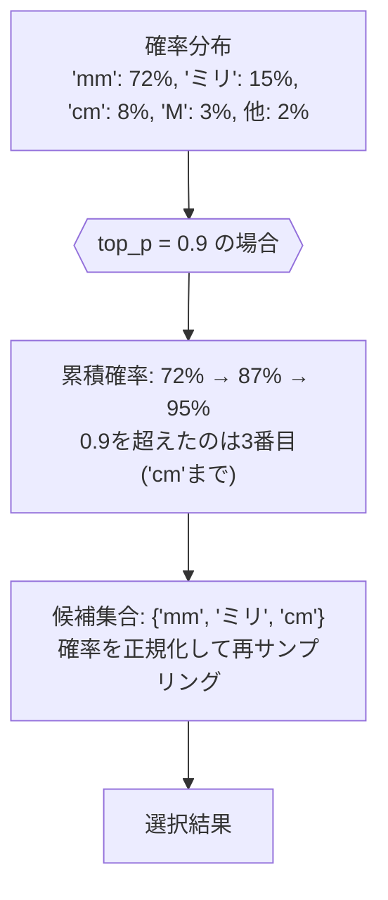

Top-P は確率の絶対値ではなく「上位何%の候補まで考慮するか」を制御するため、Temperature と組み合わせることが多いです。

**AutoMetalSheet での推奨 Top-P 設定**:

| タスク | 推奨 top_p |
|--------|-----------|
| JSON 生成（Task A/B） | `0.9 〜 0.95` |
| コード生成（Task C） | `0.95` |
| 設計根拠文章 | `0.95` |

### 5.4 Top-K Sampling

**Top-K Sampling**: 上位 K 個のトークン候補のみ残し、その中からサンプリングする方式。

Top-P と異なり固定個数なので、確率分布が均一な場合でも K 個しか候補を持ちません。現代の LLM 推論では Top-P の方が一般的に使われますが、K と P を組み合わせることもあります。

### 5.5 Logprobs（対数確率）

**Logprobs（対数確率）**: 各生成トークンの自然対数確率。`logprob = log(P(token))` で表され、常に負の値。

**AutoMetalSheet での活用**:

```python
# Claude API で logprobs を取得（現状 Anthropic APIでは未公開）
# OpenAI API 例:
response = client.chat.completions.create(
    model="gpt-4o",
    messages=[...],
    logprobs=True,
    top_logprobs=5  # 各ステップで上位5候補の対数確率を返す
)

# 例: "INFEASIBLE" を判定する際の確信度チェック
token = response.choices[0].logprobs.content[0]
# token.token = "INFEASIBLE"
# token.logprob = -0.12  （非常に高確信度: exp(-0.12) ≈ 88.7%）
# token.logprob = -2.30  （低確信度: exp(-2.30) ≈ 10%）
```

**Logprobs の用途**:
1. **確信度フィルタリング**: `exp(logprob) < 0.7` なら設計者に確認要求
2. **INFEASIBLE 判定の信頼性**: 「不可能」と判定したときの確信度を付加
3. **Beam Search 代替**: 複数候補の品質比較（vLLM では `best_of=N` パラメータ）

---

## 6. KV Cache の仕組みと推論速度への影響

### 6.1 KV Cache が必要な理由

Decoder-Only LLM は自己回帰生成（§4）でトークンを1つずつ生成します。このとき、**すでに生成済みのトークンに対する Key と Value を毎ステップ再計算するのは極めて非効率**です。

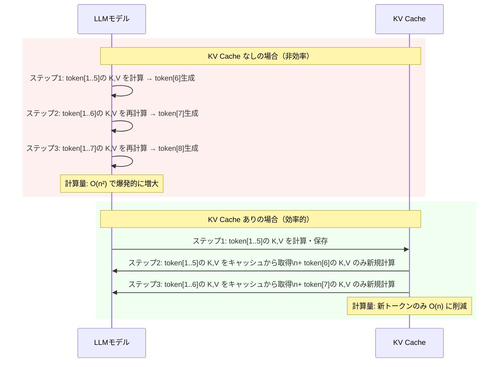

### 6.2 KV Cache のメモリ消費量

KV Cache はメモリを大量に消費します。推定式:

```
KV Cache サイズ (bytes) = 2 × num_layers × num_heads × head_dim × seq_len × batch_size × dtype_bytes
```

**Qwen-2.5-72B での具体的な計算例**:

| パラメータ | 値 |
|----------|---|
| num_layers | 80 |
| num_heads (GQA) | 8（grouped query attention）|
| head_dim | 128 |
| dtype | FP16 = 2 bytes / INT8 = 1 byte |

シーケンス長 8,192 tokens、バッチサイズ 1 の場合:

```
FP16: 2 × 80 × 8 × 128 × 8192 × 1 × 2 = 約 2.7 GB
INT8: 2 × 80 × 8 × 128 × 8192 × 1 × 1 = 約 1.35 GB
```

> **AutoMetalSheet での注意**: Qwen-2.5-72B INT8 はモデル重みだけで約 73 GB が必要。A100 80GB 1枚構成の場合、モデル重み 73 GB + KV Cache 約 2.7 GB で上限に迫ります。**vLLM の PagedAttention** を使用してメモリを効率化することが必須です。

### 6.3 PagedAttention（vLLM）

**PagedAttention**: KV Cache のメモリを OS のページングと同様に固定サイズの「ページ」単位で管理する技術（vLLM が実装）。

従来の KV Cache は連続したメモリ領域を事前確保するため、断片化やメモリ浪費が発生していました。PagedAttention はこれを解決し、GPU メモリ使用効率を大幅に向上させます。

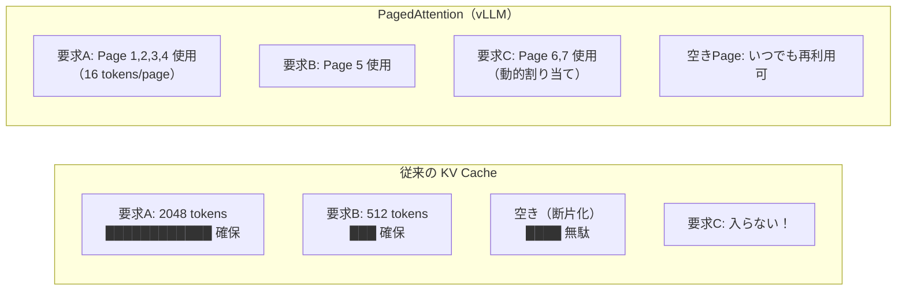

### 6.4 Prefix Caching（プレフィックスキャッシング）

**Prefix Caching（プレフィックスキャッシング）**: 複数リクエスト間で共有される System Prompt 部分の KV Cache を再利用する最適化。

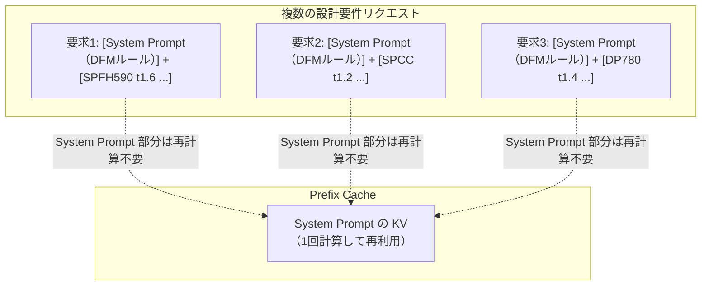

AutoMetalSheet では System Prompt に DFMルールや材料DBを含む固定テキストが入るため、Prefix Caching は**非常に効果的**です。vLLM では `enable_prefix_caching=True` で有効化できます。

### 6.5 実装例：vLLM での Prefix Caching 有効化

```python
from vllm import LLM, SamplingParams

# Qwen-2.5-72B INT8 を vLLM で起動
llm = LLM(
    model="Qwen/Qwen2.5-72B-Instruct-GPTQ-Int8",
    quantization="gptq",
    gpu_memory_utilization=0.90,
    enable_prefix_caching=True,  # System Prompt の KV Cache を再利用
    max_model_len=32768,          # コンテキスト長（メモリと要相談）
    tensor_parallel_size=1,       # A100 80GB 1枚構成
)

# 固定 System Prompt（DFMルール・材料DB）
SYSTEM_PROMPT = """
あなたは板金設計自動化システム AutoMetalSheet の要件抽出エンジンです。
以下のDFMルールと材料データベースを参照し、設計者の自然言語要件を
JSON形式で構造化してください。

## 材料データベース
...（省略）...

## DFMルール（YAML）
...（省略）...
"""

sampling_params = SamplingParams(temperature=0.1, top_p=0.95, max_tokens=1024)

# System Prompt は Prefix Cache されるため2回目以降は高速
results = llm.chat(
    messages=[
        {"role": "system", "content": SYSTEM_PROMPT},
        {"role": "user", "content": "SPFH590 t1.6でL字断面、フランジ高さ30mm、曲げ半径R3"}
    ],
    sampling_params=sampling_params
)
```

---

## 7. System Prompt / User Prompt の設計

### 7.1 Chat Completion API のメッセージ構造

**Chat Completion API（チャット補完API）**: メッセージの役割（role）を持つ会話履歴を入力として受け取り、次のアシスタントメッセージを生成するAPI形式。

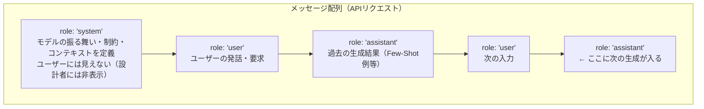

### 7.2 System Prompt の役割

**System Prompt（システムプロンプト）**: モデルに役割・制約・背景情報を与える特殊なプロンプト。User Prompt より優先度が高い。

System Prompt でモデルに「何者か」「何ができるか」「何をすべきか」を定義します。

### 7.3 AutoMetalSheet 向け System Prompt 設計テンプレート

**Task A: 要件構造化（Step 1）**

```
[System Prompt - Task A]

あなたは板金設計自動化システム AutoMetalSheet のStep 1エンジンです。
設計者が入力する自然言語の要件を、後続ステップが処理できるJSON形式に変換します。

## あなたの役割
- 入力テキストから板金設計パラメータを抽出する
- DFMルールの違反予備チェックを行う
- 不明確な要件は `needs_clarification` フラグで示す
- 実現不可能な組み合わせは `INFEASIBLE` で返す

## 出力フォーマット
必ず以下のJSONスキーマに従ってください:
{
  "material": string,          // 材料記号 (例: "SPFH590", "SPCC", "DP780")
  "thickness_mm": number,      // 板厚 [mm]
  "bend_radius_mm": number,    // 曲げ内半径 [mm]
  "cross_section_type": string,// "L", "C", "Z", "hat", "omega", ...
  "dimensions": {...},         // 断面寸法
  "surface_treatment": string, // 表面処理 (省略時: null)
  "oem_constraints": string,   // OEM固有制約 (省略時: null)
  "feasibility": "FEASIBLE" | "INFEASIBLE" | "NEEDS_CLARIFICATION",
  "infeasible_reason": string | null
}

## 材料データベース（抜粋）
- SPCC: E=206GPa, σy=205MPa, t_min=0.4mm, bend_radius_min=t×0.5
- SPFH590: E=206GPa, σy=440MPa, t_min=0.8mm, bend_radius_min=t×1.5
- DP780: E=206GPa, σy=630MPa, t_min=0.8mm, bend_radius_min=t×2.0

## DFMルール（抜粋）
- 最小曲げ半径: 材料ごとの bend_radius_min を下回る場合は INFEASIBLE
- 最小フランジ高さ: 2 × (bend_radius_mm + thickness_mm) 以上
- 穴縁から曲げ線の距離: ≥ 2 × thickness_mm

## 重要な制約
- 数値は推測しない。テキストにない情報は null を返す
- 単位変換が必要な場合は必ず mm に統一する
- JSONのみを返す。説明文やMarkdownコードブロックは不要
```

**Task C: CadQuery コード生成（Step 3）**

```
[System Prompt - Task C]

あなたは板金設計自動化システム AutoMetalSheet のStep 3エンジンです。
断面記述JSONを受け取り、FreeCAD headlessで実行可能なPythonコードを生成します。

## 使用するライブラリ
- FreeCAD Python API (import FreeCAD, Part, etc.)
- FreeCAD SheetMetal Workbench
- ベンドアローワンス計算は utils/ba_calculator.py を使用すること

## コード要件
1. BA（Bend Allowance）は以下の公式で計算すること:
   BA = (π/180) × angle × (radius + K_factor × thickness)
   K_factorは材料・R/t比に応じてlookup_k_factor(material, r_t_ratio)を使用
2. 生成するコードは単体で実行可能であること
3. エラー発生時は詳細なメッセージを raise ValueError で返すこと
4. コードにはコメントで設計根拠を記載すること

## 出力フォーマット
```python のコードブロックのみを出力する。説明文不要。
```

### 7.4 User Prompt の設計原則

**User Prompt（ユーザープロンプト）**: 実際のユーザーの入力・要求。設計者が自然言語で入力する部分。

```python
# Task A の User Prompt 例
user_prompt = """
以下の要件でL字断面板金部品を作成してください:
- 材料: SPFH590
- 板厚: 1.6mm
- 縦フランジ: 30mm
- 横フランジ: 50mm
- 曲げ半径: R3
- 表面処理: 亜鉛めっき（ユニクロ）
- OEM制約: トヨタ自動車品番 TMC-BRK-2024
"""
```

---

## 8. Few-Shot vs Zero-Shot

### 8.1 Zero-Shot Prompting（ゼロショットプロンプティング）

**Zero-Shot Prompting（ゼロショットプロンプティング）**: 例を一切与えずにタスクの指示のみでモデルに回答させる手法。

```
[Zero-Shot の例]
System: あなたはJSON出力エンジンです。
User: SPCC t1.2 で U字断面を作成
→ モデルは指示と内部知識だけで JSON を生成
```

**利点**: プロンプトが短い（トークン数節約）
**欠点**: 出力フォーマットの安定性に欠ける場合がある

### 8.2 Few-Shot Prompting（フューショットプロンプティング）

**Few-Shot Prompting（フューショットプロンプティング）**: 入力→出力の具体例を複数（2〜5件）プロンプト内に含め、モデルに「お手本」を見せてからタスクを実行させる手法。

```mermaid
flowchart TB
    subgraph FewShot["Few-Shot プロンプト構造"]
        S["System Prompt\n役割定義・制約"]

        E1U["User: SPCC t1.2, L字, フランジ20mm/30mm, R1.5"]
        E1A["Assistant: {\"material\":\"SPCC\",\"thickness_mm\":1.2,\n\"bend_radius_mm\":1.5,\"cross_section_type\":\"L\",...}"]

        E2U["User: SPFH590 t2.3, C字, フランジ25mm/25mm/50mm, R3.5"]
        E2A["Assistant: {\"material\":\"SPFH590\",\"thickness_mm\":2.3,...}"]

        E3U["User: DP780 t1.4, Z字, R2.8"]
        E3A["Assistant: {\"feasibility\":\"INFEASIBLE\",\n\"infeasible_reason\":\"DP780 最小曲げ半径は t×2.0=2.8mm。\nR2.8=t×2.0 は境界値であり安全マージン不足\"}"]

        Q["User: SPFH590 t1.6, L字, フランジ30mm/50mm, R3\n← 実際のクエリ"]
        OUT["Assistant: ← ここに生成"]
    end

    S --> E1U --> E1A --> E2U --> E2A --> E3U --> E3A --> Q --> OUT
```

### 8.3 In-Context Learning（文脈内学習）

**In-Context Learning（ICL, 文脈内学習）**: モデルが追加学習（Fine-tuning）なしに、プロンプト内の例示から「タスクのパターン」を学習し、新しい入力に適用する能力。

Few-Shot Prompting は ICL の代表的な実装形態です。ICL はモデルのパラメータを変更しないため、デプロイ後に例示を変えるだけで動作を調整できます。

**ICL が成立する理由**: 大規模な事前学習データにより、モデルはメタ学習（どうやって学ぶかを学ぶ能力）を獲得しています。

### 8.4 AutoMetalSheet での推奨設定

| タスク | 推奨方式 | Few-Shot 件数 | 理由 |
|--------|---------|--------------|------|
| Task A: 要件抽出 | Few-Shot (3件) | 3 | JSON フォーマット安定化。INFEASIBLE例を必ず1件含める |
| Task B: 断面記述 | Few-Shot (3件) | 3 | テンプレート種別ごとの出力例を含める |
| Task C: CadQuery生成 | Few-Shot (2件) | 2 | コードが長いのでトークン数に注意。代表的な1例+エラー処理1例 |
| 矛盾検出 | Zero-Shot | — | 判断ロジックはSystem Promptに記述で十分 |

**Few-Shot 例の品質基準**:
1. 多様性: L字、C字、INFEASIBLE など異なるケースを網羅
2. 正確性: 例示中の BA 計算値・DFM 判定は必ず手動で検証済みのものを使う
3. 簡潔性: 不要な説明なし（JSONのみ）

---

## 9. JSON Mode / Function Calling / Tool Use

### 9.1 JSON Mode

**JSON Mode（JSONモード）**: モデルが必ず有効な JSON を出力するよう強制するAPIオプション。スキーマ準拠は保証しない。

AutoMetalSheet では Task A/B でJSON出力が必須です。JSON Mode を使うことで `json.loads()` の ParseError を排除できます。

```python
# OpenAI API での JSON Mode
response = client.chat.completions.create(
    model="gpt-4o",
    response_format={"type": "json_object"},  # JSON Mode
    messages=[
        {"role": "system", "content": "必ずJSONで応答してください..."},
        {"role": "user", "content": "SPFH590 t1.6 L字..."}
    ]
)
result = json.loads(response.choices[0].message.content)
```

### 9.2 Structured Outputs（構造化出力）

**Structured Outputs（構造化出力）**: JSON Mode の進化版。JSON Schema を指定することでスキーマへの完全準拠を保証する機能。OpenAI gpt-4o 系と一部の API で利用可能。

```python
from pydantic import BaseModel
from typing import Literal

class RequirementsJSON(BaseModel):
    material: str
    thickness_mm: float
    bend_radius_mm: float
    cross_section_type: Literal["L", "C", "Z", "hat", "omega", "U"]
    feasibility: Literal["FEASIBLE", "INFEASIBLE", "NEEDS_CLARIFICATION"]
    infeasible_reason: str | None = None

# OpenAI Structured Outputs
response = client.beta.chat.completions.parse(
    model="gpt-4o-2024-08-06",
    messages=[...],
    response_format=RequirementsJSON,  # Pydanticモデルを直接指定
)
result: RequirementsJSON = response.choices[0].message.parsed
# → 型安全・スキーマ保証済みのオブジェクト
```

### 9.3 Function Calling / Tool Use

**Function Calling（関数呼び出し）/ Tool Use（ツール使用）**: LLM が関数の定義（名前・引数・説明）を与えられ、ユーザー入力に応じて適切な関数と引数を推論して返す機能。

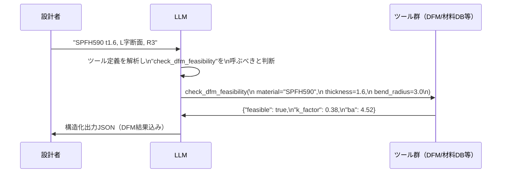

**AutoMetalSheet での Tool Use 設計**:

```python
tools = [
    {
        "type": "function",
        "function": {
            "name": "check_dfm_feasibility",
            "description": "材料・板厚・曲げ半径の組み合わせがDFM制約を満たすか検証する",
            "parameters": {
                "type": "object",
                "properties": {
                    "material": {
                        "type": "string",
                        "description": "材料記号 (SPCC, SPFH590, DP780 等)"
                    },
                    "thickness_mm": {
                        "type": "number",
                        "description": "板厚 [mm]"
                    },
                    "bend_radius_mm": {
                        "type": "number",
                        "description": "曲げ内半径 [mm]"
                    }
                },
                "required": ["material", "thickness_mm", "bend_radius_mm"]
            }
        }
    },
    {
        "type": "function",
        "function": {
            "name": "lookup_k_factor",
            "description": "材料とR/t比からK-factor値をルックアップテーブルで取得する",
            "parameters": {
                "type": "object",
                "properties": {
                    "material": {"type": "string"},
                    "r_t_ratio": {"type": "number", "description": "曲げ半径/板厚 の比率"}
                },
                "required": ["material", "r_t_ratio"]
            }
        }
    }
]
```

### 9.4 Outlines による Constrained Decoding（ローカルモデル用）

**Constrained Decoding（制約付きデコーディング）**: 生成の各ステップで JSON Schema に違反するトークンの確率を `-∞` に設定し、スキーマ準拠を数学的に保証する技術。

Qwen-2.5-72B のオンプレデプロイでは、API の Structured Outputs が使えないため vLLM の guided decoding を使用します:

```python
from vllm import LLM, SamplingParams
from vllm.sampling_params import GuidedDecodingParams

# JSON Schema の定義
schema = {
    "type": "object",
    "properties": {
        "material": {"type": "string"},
        "thickness_mm": {"type": "number"},
        "feasibility": {"type": "string", "enum": ["FEASIBLE", "INFEASIBLE"]}
    },
    "required": ["material", "thickness_mm", "feasibility"]
}

sampling_params = SamplingParams(
    temperature=0.1,
    top_p=0.95,
    max_tokens=512,
    guided_decoding=GuidedDecodingParams(json=schema)  # xgrammar/Outlines が裏で動く
)

result = llm.chat(messages=[...], sampling_params=sampling_params)
# → 必ずスキーマ準拠のJSON が返る（ParseError ゼロ）
```

vLLM は内部で **xgrammar** または **Outlines** を使用し、JSON Schema を FSM（有限状態機械）にコンパイルして O(1) のトークン検証を実現します。

---

## 10. Hallucination の原因と対策

### 10.1 Hallucination（幻覚）とは

**Hallucination（幻覚）**: LLM が事実と異なる情報を、あたかも確実であるかのように生成する現象。板金設計では数値の誤生成が直接的な設計ミスに繋がるため、特に危険です。

**AutoMetalSheet での具体的リスク例**:

| 幻覚の種類 | 具体例 | リスク |
|----------|--------|--------|
| 数値の捏造 | SPFH590 の σy を誤った値で計算 | BA 計算値の誤差 → 寸法不良 |
| DFMルールの誤解釈 | 「最小フランジ高さ」の計算式を間違える | DFM 違反品の流出 |
| テンプレート誤選択 | Z字断面を C字テンプレートで生成 | 形状不整合 |
| 単位の混在 | mm と inch を混用 | 設計寸法の10倍以上の誤差 |
| API の捏造 | 存在しない FreeCAD 関数を呼び出す | コード実行時エラー |

### 10.2 幻覚の発生メカニズム

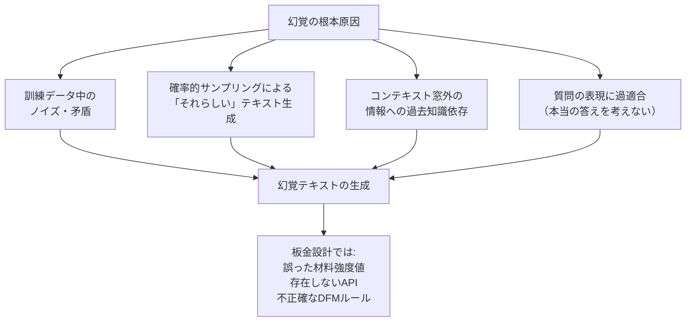

### 10.3 Grounding（根拠付け）

**Grounding（根拠付け）**: LLM の出力を外部の検証可能な情報源（数値DB・ルールDB等）に紐付け、事実に基づいた回答を生成させる技術。

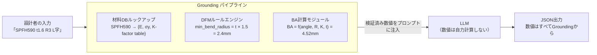

**重要な設計原則**: LLM に数値計算をさせない。BA/BD 計算・K-factor ルックアップ・DFM チェックはすべて Python コードで実行し、結果のみを LLM に提供する。

### 10.4 RAG（Retrieval-Augmented Generation）

**RAG（Retrieval-Augmented Generation, 検索拡張生成）**: ユーザーの入力に関連する外部ドキュメントを動的に検索し、その内容をプロンプトに追加してから生成する手法。

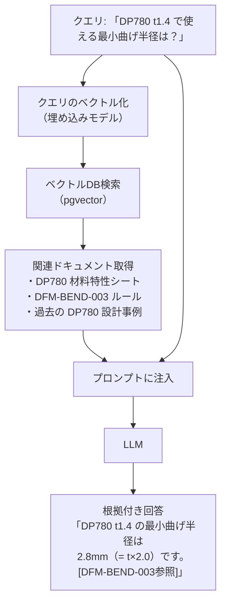

AutoMetalSheet Phase 2 では pgvector を使用した慣例DBの RAG 検索が計画されています。

### 10.5 Structured Generation（構造化生成）による幻覚防止

JSON Mode や Constrained Decoding（§9.4）は、出力の「形式」は保証しますが「数値の正確性」は保証しません。数値の正確性は必ず外部モジュールで検証してください。

**AutoMetalSheet の多層防御戦略**:

```mermaid
flowchart LR
    L1["Layer 1: JSON Schema 強制\n（構文的な正しさ）"]
    L2["Layer 2: Pydantic バリデーション\n（型・範囲チェック）"]
    L3["Layer 3: DFMルールエンジン\n（設計制約チェック）"]
    L4["Layer 4: 材料DB照合\n（数値の外部検証）"]
    L5["Layer 5: BA/BD再計算\n（Pythonモジュールで検証）"]

    L1 --> L2 --> L3 --> L4 --> L5 --> OK["検証済み出力"]

    L1 -->|"違反"| E1["ParseError → リトライ"]
    L2 -->|"違反"| E2["型エラー → リトライ"]
    L3 -->|"INFEASIBLE"| E3["設計者に通知"]
    L4 -->|"数値相違"| E4["DB値で上書き"]
    L5 -->|"誤差 > 0.1mm"| E5["警告フラグ付与"]
```

---

## 11. AutoMetalSheet 3層LLMハイブリッド設計

### 11.1 3層アーキテクチャの全体像

```mermaid
flowchart TB
    INPUT["設計者の要件入力\n（自然言語テキスト）"]

    subgraph Router["タスクルーター\n（ルールベース + 機密情報検出）"]
        R1{{"機密情報\n含むか？"}}
        R2{{"タスク種別\n判定"}}
    end

    subgraph L1["Layer 1: オンプレ\nQwen-2.5-72B INT8"]
        L1_DESC["インフラ: A100 80GB × 1\nサービング: vLLM + PagedAttention\n量子化: GPTQ INT8\n推論速度: 〜20 tok/s"]
        L1_TASK["担当タスク:\n・Task A 要件抽出（機密含む）\n・OEM固有制約の処理\n・機密図番・品番情報"]
    end

    subgraph L2["Layer 2: AWS Bedrock\nClaude Sonnet 4.x"]
        L2_DESC["インフラ: Bedrock マネージドAPI\nコスト: 〜$3/MTok入力\nレイテンシ: 〜1〜3秒/要求"]
        L2_TASK["担当タスク:\n・Task B 断面記述生成\n・Task C CadQueryコード生成\n・CoT設計根拠ドキュメント"]
    end

    subgraph L3["Layer 3: Public Cloud API\n（OpenAI / Anthropic直接）"]
        L3_DESC["インフラ: 外部API\nコスト: 従量課金\nレイテンシ: 〜0.5〜2秒"]
        L3_TASK["担当タスク:\n・軽量な矛盾検出\n・テキスト補完\n・非機密の補助タスク"]
    end

    INPUT --> Router
    R1 -->|"Yes（機密あり）"| L1
    R1 -->|"No（機密なし）"| R2
    R2 -->|"Task A/B/C\n複合推論"| L2
    R2 -->|"単純補完\n軽量分類"| L3

    L1 & L2 & L3 --> OUTPUT["構造化 JSON 出力\n→ DFMエンジン → FreeCAD"]

    style L1 fill:#fff3e0,stroke:#ff9800,stroke-width:2px
    style L2 fill:#e8f5e9,stroke:#4caf50,stroke-width:2px
    style L3 fill:#fce4ec,stroke:#e91e63,stroke-width:2px
```

### 11.2 なぜ3層か：コスト・セキュリティ・精度のトレードオフ

| 観点 | Layer 1 (オンプレ) | Layer 2 (Bedrock) | Layer 3 (Public) |
|------|------------------|-------------------|------------------|
| **コスト** | 固定費（電力・GPU） | 従量（中）| 従量（低〜中） |
| **セキュリティ** | 最高（社内完結）| 高（AWS VPC）| 低（外部API）|
| **精度** | 高（72B）| 高〜最高（Claude Sonnet）| 中程度 |
| **レイテンシ** | 中（20 tok/s）| 低（API応答）| 最低（最速）|
| **スケーラビリティ** | 低（GPU制限）| 高 | 最高 |

**Layer 1（オンプレ Qwen）が必要な理由**:
- OEM品番・社内図番・未発表設計仕様などの**機密情報**を外部APIに送信できない
- GDPR/個人情報保護法的な**データガバナンス**要件
- 大量バッチ処理時の**コスト最適化**（オンプレは限界費用ほぼゼロ）

### 11.3 Qwen-2.5-72B INT8 のオンプレデプロイ詳細

**INT8 量子化（GPTQ）の仕組み**:

```mermaid
flowchart LR
    subgraph FP16["FP16（量子化前）"]
        FP["モデル重み\n各パラメータ: 2 bytes\n合計: 〜145 GB"]
    end

    subgraph INT8["INT8 GPTQ量子化後"]
        INT["モデル重み\n各パラメータ: 1 byte\n合計: 〜73 GB\n精度保持率: >99%"]
    end

    FP16 -->|"GPTQ量子化\n(キャリブレーションデータ使用)"| INT8

    INT8 --> GPU["A100 80GB × 1台で\nほぼ全モデルをGPUに収容"]
```

**性能指標（Qwen-2.5-72B GPTQ-Int8 on A100 80GB）**:

| 指標 | 値 |
|------|---|
| モデル VRAM 使用量 | 〜73 GB |
| スループット（vLLM） | 〜20 tokens/秒（バッチ1）|
| スループット（vLLM バッチ8）| 〜60〜80 tokens/秒 |
| KV Cache 使用可能 VRAM | 〜7 GB |
| 推奨最大コンテキスト長 | 16,384 tokens |
| Prefix Caching 効果 | System Prompt 再利用で 2〜3倍高速化 |

**vLLM 起動コマンド（推奨設定）**:

```bash
python -m vllm.entrypoints.openai.api_server \
  --model Qwen/Qwen2.5-72B-Instruct-GPTQ-Int8 \
  --quantization gptq \
  --gpu-memory-utilization 0.92 \
  --max-model-len 16384 \
  --enable-prefix-caching \
  --guided-decoding-backend xgrammar \
  --tensor-parallel-size 1 \
  --port 8000
```

### 11.4 タスク別ルーティング基準

```mermaid
flowchart TB
    INPUT["入力タスク"]

    INPUT --> CHECK1{{"OEM品番 / 社内図番 /\n未公開仕様を含むか？"}}
    CHECK1 -->|"Yes"| L1["Layer 1 (Qwen オンプレ)\nTask A 実行"]
    CHECK1 -->|"No"| CHECK2{{"タスク種別"}}

    CHECK2 -->|"Task A: 要件抽出\n精度目標 81〜85%"| L1_OR_L2{{"コンテキスト量 > 8K\nトークンか？"}}
    L1_OR_L2 -->|"Yes → Bedrock"| L2A["Layer 2 (Bedrock)"]
    L1_OR_L2 -->|"No → オンプレ"| L1A["Layer 1 (Qwen)"]

    CHECK2 -->|"Task B: 断面記述生成\n精度目標 80〜84%"| L2B["Layer 2 (Bedrock)\nClaude Sonnet"]

    CHECK2 -->|"Task C: コード生成\n精度目標 83〜90%"| L2C["Layer 2 (Bedrock)\nClaude Sonnet"]

    CHECK2 -->|"矛盾検出・補完\n軽量タスク"| L3["Layer 3 (Public API)"]
```

### 11.5 フォールバック戦略

```python
import anthropic
import openai
import requests
from typing import Optional

class LLMRouter:
    """3層LLMハイブリッドルーター"""

    def __init__(self, config: dict):
        self.onprem_url = config["onprem_url"]  # vLLM エンドポイント
        self.bedrock_client = anthropic.AnthropicBedrock(
            aws_region=config["aws_region"]
        )
        self.public_client = anthropic.Anthropic(api_key=config["anthropic_key"])

    def route(
        self,
        messages: list[dict],
        task_type: str,       # "task_a" | "task_b" | "task_c" | "light"
        has_confidential: bool = False,
        schema: Optional[dict] = None
    ) -> str:
        """タスク種別と機密フラグに基づいてルーティング"""

        if has_confidential:
            return self._call_onprem(messages, schema)

        if task_type in ("task_b", "task_c"):
            return self._call_bedrock(messages)

        if task_type == "task_a":
            # コンテキスト量が少なければオンプレ優先
            total_tokens = self._estimate_tokens(messages)
            if total_tokens < 6000:
                return self._call_onprem(messages, schema)
            else:
                return self._call_bedrock(messages)

        # light タスク
        return self._call_public(messages)

    def _call_onprem(self, messages: list, schema: Optional[dict] = None) -> str:
        """Layer 1: Qwen-2.5-72B オンプレ (vLLM OpenAI互換API)"""
        payload = {
            "model": "Qwen/Qwen2.5-72B-Instruct-GPTQ-Int8",
            "messages": messages,
            "temperature": 0.1,
            "top_p": 0.95,
            "max_tokens": 1024,
        }
        if schema:
            payload["guided_json"] = schema  # vLLM guided decoding

        try:
            response = requests.post(
                f"{self.onprem_url}/v1/chat/completions",
                json=payload,
                timeout=120
            )
            response.raise_for_status()
            return response.json()["choices"][0]["message"]["content"]
        except Exception as e:
            print(f"[Layer 1 失敗] {e} → Layer 2 にフォールバック")
            return self._call_bedrock(messages)

    def _call_bedrock(self, messages: list) -> str:
        """Layer 2: AWS Bedrock Claude Sonnet"""
        system_msg = next((m["content"] for m in messages if m["role"] == "system"), "")
        user_msgs = [m for m in messages if m["role"] != "system"]

        try:
            response = self.bedrock_client.messages.create(
                model="anthropic.claude-sonnet-4-5",
                max_tokens=2048,
                system=system_msg,
                messages=user_msgs,
                temperature=0.1
            )
            return response.content[0].text
        except Exception as e:
            print(f"[Layer 2 失敗] {e} → Layer 3 にフォールバック")
            return self._call_public(messages)

    def _call_public(self, messages: list) -> str:
        """Layer 3: Anthropic Public API"""
        system_msg = next((m["content"] for m in messages if m["role"] == "system"), "")
        user_msgs = [m for m in messages if m["role"] != "system"]

        response = self.public_client.messages.create(
            model="claude-sonnet-4-5",
            max_tokens=1024,
            system=system_msg,
            messages=user_msgs,
        )
        return response.content[0].text

    def _estimate_tokens(self, messages: list) -> int:
        """簡易トークン数推定（日本語: 文字数/1.5, 英語: 文字数/4）"""
        total_chars = sum(len(m.get("content", "")) for m in messages)
        return int(total_chars / 2)  # 保守的に日英混在として推定
```

---

## 12. In-Context Learning と Prompt Engineering ベストプラクティス

### 12.1 Chain-of-Thought（CoT）プロンプティング

**Chain-of-Thought（CoT）プロンプティング**: 答えを直接出力させるのではなく、推論の過程を段階的に示すことで、LLM が複雑な推論を行えるよう誘導する手法。

AutoMetalSheet では設計根拠ドキュメントの生成と、複雑な要件の矛盾検出に CoT を活用します。

```python
cot_prompt = """
以下の板金設計要件を検証してください。
思考過程を段階的に示してから、最終判定を出力してください。

要件: SPFH590 t1.6, フランジ高さ20mm, 曲げ半径R1.0

思考:
1. 材料制約の確認:
   - SPFH590 の最小曲げ半径 = t × 1.5 = 1.6 × 1.5 = 2.4mm
   - 指定 R1.0 < 2.4mm → DFM違反

2. フランジ高さの確認:
   - 最小フランジ高さ = 2 × (R + t) = 2 × (1.0 + 1.6) = 5.2mm
   - 指定20mm > 5.2mm → 合格（ただしR違反があるので意味なし）

3. 総合判定: INFEASIBLE
   理由: 曲げ半径R1.0がSPFH590の最小許容値2.4mmを下回る

---
【最終判定】
```

### 12.2 Prompt Engineering のベストプラクティス（板金設計向け）

```mermaid
mindmap
  root((Prompt Engineering\nベストプラクティス))
    明確性
      タスクを1文で定義
      期待するフォーマットを明示
      単位を明示（mm/inch）
    根拠付け
      数値はプロンプトで提供
      DBからの情報を注入
      LLMの知識に頼らない
    制約定義
      INFEASIBLE条件を列挙
      エラー処理方針を記載
      ambiguous入力の扱いを定義
    Few-Shot設計
      正例2件＋INFEASIBLE例1件
      多様なケースをカバー
      短く簡潔な例
    出力制御
      JSON Schemaで型を固定
      Structured Outputsで保証
      余分なテキストを禁止
```

### 12.3 よくある失敗パターンと対策

| 失敗パターン | 症状 | 対策 |
|------------|------|------|
| 曖昧なSystem Prompt | 出力形式が不安定 | JSON Schema をSystem Promptに明記 |
| 数値計算をLLMに委ねる | BA/K-factor に誤差 | 計算はPythonモジュールに委ねる |
| Few-Shot例が少ない | INFEASIBLE判定を見逃す | INFEASIBLE例を必ず1件含める |
| Temperature が高い | 同じ入力で異なる出力 | コード生成は T=0.1〜0.2 に固定 |
| System Promptが長すぎる | 中間部の指示を無視（Lost in the Middle）| 重要情報を先頭と末尾に配置 |
| 言語混在 | 日英混在で不安定 | プロンプト全体の言語を統一 |

**Lost in the Middle 問題**: コンテキストウィンドウが長い場合、LLM は先頭と末尾の情報に注目しやすく、中間部の情報を見落とす傾向があります。重要なDFMルールや制約は必ずSystem Promptの先頭またはユーザープロンプトの直前に記載してください。

---

## 13. Batch Inference の実装（コスト最適化）

### 13.1 Batch Inference とは

**Batch Inference（バッチ推論）**: 複数のリクエストをまとめて一括処理することで、スループットを最大化しレイテンシとコストを削減する手法。

AutoMetalSheet では以下のシナリオでバッチ処理が有効です:
- 設計パラメータのスタディ（例: 板厚を0.8〜3.2mm で 0.4mm 刻みで全パターンチェック）
- DFM バリデーションの一括実行
- 設計変更時の全部品再チェック

### 13.2 OpenAI Batch API の実装

```python
import json
import time
from pathlib import Path
from openai import OpenAI

client = OpenAI()

def create_batch_for_dfm_check(design_variants: list[dict]) -> str:
    """
    複数の板金設計バリアントを Batch API で一括DFMチェック

    design_variants: [
        {"material": "SPFH590", "thickness": 1.6, "bend_radius": 3.0},
        {"material": "SPFH590", "thickness": 1.6, "bend_radius": 2.0},
        ...
    ]

    Returns: batch_id
    """

    # JSONL ファイルを作成
    requests_data = []
    for i, variant in enumerate(design_variants):
        request = {
            "custom_id": f"dfm-check-{i:04d}",
            "method": "POST",
            "url": "/v1/chat/completions",
            "body": {
                "model": "gpt-4o-2024-08-06",
                "messages": [
                    {
                        "role": "system",
                        "content": "板金DFMチェックエンジン。必ずJSONで返すこと。"
                    },
                    {
                        "role": "user",
                        "content": f"材料: {variant['material']}, "
                                   f"板厚: {variant['thickness']}mm, "
                                   f"曲げ半径: {variant['bend_radius']}mm"
                    }
                ],
                "response_format": {"type": "json_object"},
                "temperature": 0.1,
                "max_tokens": 256
            }
        }
        requests_data.append(json.dumps(request, ensure_ascii=False))

    # JSONL ファイル保存
    jsonl_path = Path("batch_dfm_requests.jsonl")
    jsonl_path.write_text("\n".join(requests_data), encoding="utf-8")

    # バッチファイルのアップロード
    with open(jsonl_path, "rb") as f:
        batch_file = client.files.create(file=f, purpose="batch")

    # バッチジョブの作成
    batch = client.batches.create(
        input_file_id=batch_file.id,
        endpoint="/v1/chat/completions",
        completion_window="24h",
        metadata={"project": "AutoMetalSheet", "task": "DFM-batch-check"}
    )

    print(f"バッチジョブ作成: {batch.id}")
    return batch.id

def retrieve_batch_results(batch_id: str) -> list[dict]:
    """バッチ結果の取得"""

    # 完了待機
    while True:
        batch = client.batches.retrieve(batch_id)
        print(f"状態: {batch.status} | 完了: {batch.request_counts.completed}/{batch.request_counts.total}")

        if batch.status == "completed":
            break
        elif batch.status in ("failed", "expired", "cancelled"):
            raise RuntimeError(f"バッチ失敗: {batch.status}")

        time.sleep(30)  # 30秒ごとにポーリング

    # 結果ダウンロード
    content = client.files.content(batch.output_file_id)
    results = []
    for line in content.text.strip().split("\n"):
        data = json.loads(line)
        result = {
            "custom_id": data["custom_id"],
            "content": json.loads(data["response"]["body"]["choices"][0]["message"]["content"])
        }
        results.append(result)

    return results

# 使用例
variants = [
    {"material": "SPFH590", "thickness": t, "bend_radius": r}
    for t in [0.8, 1.2, 1.6, 2.0, 2.3]
    for r in [1.5, 2.0, 3.0, 4.0, 5.0]
]  # 25パターンの一括チェック

batch_id = create_batch_for_dfm_check(variants)
# 数分〜数時間後に結果取得（コストは通常API比50%削減）
results = retrieve_batch_results(batch_id)
```

### 13.3 vLLM での連続バッチ処理（Continuous Batching）

**Continuous Batching（連続バッチ処理）**: 各リクエストの decode フェーズが終了するたびに新しいリクエストをバッチに追加する動的スケジューリング。静的バッチング比で最大 23倍のスループット向上。

```python
# vLLM OpenAI互換API への並列リクエスト
import asyncio
import aiohttp

VLLM_URL = "http://localhost:8000/v1/chat/completions"

async def async_dfm_check(session: aiohttp.ClientSession, variant: dict) -> dict:
    """非同期DFMチェック（1リクエスト）"""
    payload = {
        "model": "Qwen/Qwen2.5-72B-Instruct-GPTQ-Int8",
        "messages": [
            {"role": "system", "content": SYSTEM_PROMPT_TASK_A},
            {"role": "user", "content": f"材料: {variant['material']}, 板厚: {variant['thickness']}mm"}
        ],
        "temperature": 0.1,
        "max_tokens": 512
    }

    async with session.post(VLLM_URL, json=payload) as resp:
        data = await resp.json()
        return {
            "variant": variant,
            "result": data["choices"][0]["message"]["content"]
        }

async def batch_dfm_check(variants: list[dict], concurrency: int = 8) -> list[dict]:
    """並列バッチDFMチェック（vLLM Continuous Batching活用）"""
    semaphore = asyncio.Semaphore(concurrency)

    async def limited_check(session, variant):
        async with semaphore:
            return await async_dfm_check(session, variant)

    async with aiohttp.ClientSession() as session:
        tasks = [limited_check(session, v) for v in variants]
        results = await asyncio.gather(*tasks, return_exceptions=True)

    return [r for r in results if not isinstance(r, Exception)]

# 実行
results = asyncio.run(batch_dfm_check(variants, concurrency=8))
```

---

## 14. Claude API 実装例

### 14.1 Anthropic SDK の基本セットアップ

```bash
pip install anthropic>=0.40.0
```

### 14.2 Task A: 要件構造化 JSON 生成（AWS Bedrock 経由）

```python
import anthropic
import json
from pydantic import BaseModel, Field
from typing import Literal, Optional

# Pydantic モデルで出力スキーマを定義
class BendRequirements(BaseModel):
    material: str = Field(description="材料記号 (SPCC, SPFH590, DP780 等)")
    thickness_mm: float = Field(description="板厚 [mm]", gt=0, lt=20)
    bend_radius_mm: Optional[float] = Field(None, description="曲げ内半径 [mm]")
    cross_section_type: Literal["L", "C", "Z", "hat", "hat_asymmetric", "omega", "U", "multi_bend", "Z_with_lip"]
    flange_heights_mm: list[float] = Field(description="各フランジ高さ [mm]")
    bend_angle_deg: float = Field(default=90.0, description="曲げ角度 [度]")
    surface_treatment: Optional[str] = None
    feasibility: Literal["FEASIBLE", "INFEASIBLE", "NEEDS_CLARIFICATION"]
    infeasible_reason: Optional[str] = None
    needs_clarification_items: list[str] = Field(default_factory=list)

# System Prompt（板金設計自動化エンジン向け）
TASK_A_SYSTEM_PROMPT = """あなたは板金設計自動化システム AutoMetalSheet の Step 1 要件抽出エンジンです。

## 役割
設計者の自然言語要件を解析し、構造化された設計パラメータJSONを出力します。

## 材料データベース（最小曲げ半径）
| 材料    | 最小曲げ半径 | 備考 |
|---------|------------|------|
| SPCC    | t × 0.5   | 軟鋼・プレス加工用 |
| SPFH590 | t × 1.5   | 高強度熱延鋼板 |
| DP780   | t × 2.0   | 超高強度 DP 鋼 ※不確実性±3度 |

## DFM基本ルール
- 最小フランジ高さ: 2 × (bend_radius_mm + thickness_mm) 以上
- フランジ間最大角度差: 基本的に0度（対称設計推奨）
- 穴縁-曲げ線距離: ≥ 2 × thickness_mm

## 出力指示
- 必ずJSONのみを出力すること（説明文・Markdownコードブロック不要）
- 不明な値は null とし、needs_clarification_items に追加すること
- 数値は mm 統一（inch 入力は変換すること）
"""

def extract_requirements(user_input: str, use_bedrock: bool = True) -> BendRequirements:
    """
    自然言語要件を構造化JSONに変換

    Parameters:
        user_input: 設計者の自然言語入力
        use_bedrock: True → AWS Bedrock、False → Anthropic Direct

    Returns:
        BendRequirements: 検証済みの構造化要件
    """

    # Few-Shot 例（プロンプトに埋め込む）
    few_shot_examples = [
        {
            "role": "user",
            "content": "SPCCのt1.2でL字断面。縦フランジ20mm、横フランジ30mm。R1.5。"
        },
        {
            "role": "assistant",
            "content": json.dumps({
                "material": "SPCC",
                "thickness_mm": 1.2,
                "bend_radius_mm": 1.5,
                "cross_section_type": "L",
                "flange_heights_mm": [20.0, 30.0],
                "bend_angle_deg": 90.0,
                "surface_treatment": None,
                "feasibility": "FEASIBLE",
                "infeasible_reason": None,
                "needs_clarification_items": []
            }, ensure_ascii=False)
        },
        {
            "role": "user",
            "content": "SPFH590 t2.0 で R2.5 の L字断面を作りたい"
        },
        {
            "role": "assistant",
            "content": json.dumps({
                "material": "SPFH590",
                "thickness_mm": 2.0,
                "bend_radius_mm": 2.5,
                "cross_section_type": "L",
                "flange_heights_mm": [],
                "bend_angle_deg": 90.0,
                "surface_treatment": None,
                "feasibility": "INFEASIBLE",
                "infeasible_reason": "SPFH590 の最小曲げ半径は t×1.5 = 3.0mm。指定の R2.5 < 3.0mm のため実現不可能。",
                "needs_clarification_items": []
            }, ensure_ascii=False)
        }
    ]

    messages = few_shot_examples + [{"role": "user", "content": user_input}]

    if use_bedrock:
        client = anthropic.AnthropicBedrock(aws_region="ap-northeast-1")
        model = "anthropic.claude-sonnet-4-5"
    else:
        client = anthropic.Anthropic()
        model = "claude-sonnet-4-5"

    response = client.messages.create(
        model=model,
        max_tokens=1024,
        temperature=0.1,
        system=TASK_A_SYSTEM_PROMPT,
        messages=messages
    )

    raw_json = response.content[0].text.strip()

    # JSON パース + Pydantic バリデーション
    try:
        data = json.loads(raw_json)
        requirements = BendRequirements(**data)
    except json.JSONDecodeError as e:
        raise ValueError(f"LLM が有効な JSON を返しませんでした: {e}\n出力: {raw_json}")

    return requirements


# 使用例
if __name__ == "__main__":
    user_input = "SPFH590 t1.6でL字断面。縦30mm横50mm。曲げ半径R3。亜鉛めっき処理。"

    result = extract_requirements(user_input, use_bedrock=True)

    print(f"材料: {result.material}")
    print(f"板厚: {result.thickness_mm}mm")
    print(f"曲げ半径: {result.bend_radius_mm}mm")
    print(f"断面形状: {result.cross_section_type}")
    print(f"フランジ高さ: {result.flange_heights_mm}mm")
    print(f"実現可否: {result.feasibility}")
    if result.infeasible_reason:
        print(f"不可理由: {result.infeasible_reason}")
```

### 14.3 Task C: CadQuery コード生成（AWS Bedrock 経由）

```python
import anthropic
import re

TASK_C_SYSTEM_PROMPT = """あなたは FreeCAD Python API を使った板金CAD自動生成エンジンです。
断面記述JSONを受け取り、FreeCADのヘッドレス実行で動作するPythonコードを生成します。

## コード要件
1. import文は必ず含めること: import FreeCAD, Part, Sketcher
2. BA計算は必ず外部モジュールを使用:
   from utils.ba_calculator import calc_ba, lookup_k_factor
3. ドキュメント作成は必須: doc = FreeCAD.newDocument("AutoMetalSheet")
4. 最後にSTEP出力: Part.export([shape], output_path)
5. コードのみ出力（```python ブロックで囲む）

## BA計算式（参考）
BA = (π/180) × angle_deg × (bend_radius_mm + k_factor × thickness_mm)
k_factor = lookup_k_factor(material, r_t_ratio)
"""

TASK_C_FEW_SHOT = [
    {
        "role": "user",
        "content": json.dumps({
            "material": "SPCC",
            "thickness_mm": 1.2,
            "bend_radius_mm": 1.5,
            "cross_section_type": "L",
            "flange_heights_mm": [20.0, 30.0],
            "bend_angle_deg": 90.0
        }, ensure_ascii=False)
    },
    {
        "role": "assistant",
        "content": '''```python
import FreeCAD
import Part
from utils.ba_calculator import calc_ba, lookup_k_factor

# === 設計パラメータ ===
MATERIAL       = "SPCC"
THICKNESS_MM   = 1.2
BEND_RADIUS_MM = 1.5
FLANGE_A_MM    = 20.0   # 縦フランジ
FLANGE_B_MM    = 30.0   # 横フランジ
BEND_ANGLE_DEG = 90.0

# === K-factor と BA の計算 ===
r_t_ratio = BEND_RADIUS_MM / THICKNESS_MM   # 1.5 / 1.2 = 1.25
k_factor  = lookup_k_factor(MATERIAL, r_t_ratio)  # SPCC R/t=1.25 → K≈0.35
ba        = calc_ba(BEND_ANGLE_DEG, BEND_RADIUS_MM, k_factor, THICKNESS_MM)

print(f"K-factor: {k_factor:.3f}")
print(f"Bend Allowance: {ba:.3f} mm")

# === FreeCAD ドキュメント作成 ===
doc = FreeCAD.newDocument("AutoMetalSheet_L_SPCC")

# === L字断面の展開図 (Sketch) ===
sketch = doc.addObject("Sketcher::SketchObject", "UnfoldedProfile")
# 展開長 = Flange_A + BA + Flange_B
total_length = FLANGE_A_MM + ba + FLANGE_B_MM

# 矩形スケッチ（展開形状）
pts = [
    FreeCAD.Vector(0, 0, 0),
    FreeCAD.Vector(total_length, 0, 0),
    FreeCAD.Vector(total_length, THICKNESS_MM, 0),
    FreeCAD.Vector(0, THICKNESS_MM, 0),
]
lines = [Part.makeLine(pts[i], pts[(i+1) % 4]) for i in range(4)]
wire   = Part.Wire(lines)
face   = Part.Face(wire)
solid  = face.extrude(FreeCAD.Vector(0, 0, 50))  # 50mm幅を仮定

doc.recompute()

# === STEP 出力 ===
output_path = "output/L_SPCC_t1.2_R1.5.step"
Part.export([solid], output_path)
print(f"STEP 出力完了: {output_path}")
```'''
    }
]

def generate_cadquery_code(requirements: BendRequirements, width_mm: float = 50.0) -> str:
    """
    断面記述JSONからCadQueryコードを生成（AWS Bedrock Claude Sonnet）

    Parameters:
        requirements: Task A で生成した構造化要件
        width_mm: 部品の奥行き [mm]

    Returns:
        実行可能な Python コード文字列
    """
    client = anthropic.AnthropicBedrock(aws_region="ap-northeast-1")

    input_json = requirements.model_dump_json(indent=2)

    messages = TASK_C_FEW_SHOT + [
        {"role": "user", "content": input_json + f"\n\n# 部品幅: {width_mm}mm"}
    ]

    response = client.messages.create(
        model="anthropic.claude-sonnet-4-5",
        max_tokens=4096,
        temperature=0.1,
        system=TASK_C_SYSTEM_PROMPT,
        messages=messages
    )

    raw_output = response.content[0].text

    # コードブロックを抽出
    match = re.search(r"```python\n(.*?)```", raw_output, re.DOTALL)
    if not match:
        raise ValueError("LLM がコードブロックを返しませんでした")

    return match.group(1)
```

### 14.4 ストリーミング対応（長い CoT 出力向け）

```python
def stream_design_rationale(requirements: BendRequirements) -> str:
    """
    設計根拠ドキュメントをストリーミング生成（Bedrock）
    長い CoT 出力の場合、ストリーミングでユーザーへ逐次表示
    """
    client = anthropic.AnthropicBedrock(aws_region="ap-northeast-1")

    full_text = ""

    with client.messages.stream(
        model="anthropic.claude-sonnet-4-5",
        max_tokens=2048,
        temperature=0.5,   # 設計文書は少し多様性あり
        system="板金設計根拠を技術文書として生成するエンジンです。",
        messages=[
            {
                "role": "user",
                "content": f"""以下の板金設計要件について、設計根拠ドキュメントを生成してください。

設計パラメータ:
{requirements.model_dump_json(indent=2)}

以下の項目を含めること:
1. BA（Bend Allowance）計算根拠
2. K-factor選定理由（R/t比より）
3. DFMチェック結果
4. スプリングバック推定（DP780以上は不確実性を明記）
5. 推奨検査ポイント
"""
            }
        ]
    ) as stream:
        for text_chunk in stream.text_stream:
            print(text_chunk, end="", flush=True)  # リアルタイム表示
            full_text += text_chunk

    print()  # 改行
    return full_text
```

### 14.5 エラーハンドリングとリトライ

```python
import time
from anthropic import APIError, RateLimitError, APIConnectionError

def robust_llm_call(
    messages: list[dict],
    system: str,
    model: str = "anthropic.claude-sonnet-4-5",
    max_retries: int = 3,
    base_delay: float = 1.0
) -> str:
    """
    指数バックオフ付きリトライ実装
    AutoMetalSheet の全LLM呼び出しはこの関数を経由することを推奨
    """
    client = anthropic.AnthropicBedrock(aws_region="ap-northeast-1")

    for attempt in range(max_retries):
        try:
            response = client.messages.create(
                model=model,
                max_tokens=2048,
                temperature=0.1,
                system=system,
                messages=messages
            )
            return response.content[0].text

        except RateLimitError:
            if attempt == max_retries - 1:
                raise
            delay = base_delay * (2 ** attempt)  # 指数バックオフ
            print(f"レート制限 → {delay}秒後にリトライ ({attempt+1}/{max_retries})")
            time.sleep(delay)

        except APIConnectionError:
            if attempt == max_retries - 1:
                # Bedrock が使えない場合は Layer 3 にフォールバック
                print("Bedrock 接続失敗 → Public API にフォールバック")
                pub_client = anthropic.Anthropic()
                response = pub_client.messages.create(
                    model="claude-sonnet-4-5",
                    max_tokens=2048,
                    system=system,
                    messages=messages
                )
                return response.content[0].text
            time.sleep(base_delay * (2 ** attempt))

        except APIError as e:
            print(f"API エラー: {e}")
            raise
```

---

## 15. 参考文献・公式ドキュメント

### 学術論文

| タイトル | 著者 | 年 | 内容 |
|---------|------|---|------|
| Attention Is All You Need | Vaswani et al. | 2017 | Transformer の原著論文 |
| Language Models are Few-Shot Learners | Brown et al. | 2020 | GPT-3: In-Context Learning の提案 |
| Chain-of-Thought Prompting Elicits Reasoning in Large Language Models | Wei et al. | 2022 | CoT プロンプティングの系統的研究 |
| Efficient Memory Management for Large Language Model Serving with PagedAttention | Kwon et al. | 2023 | vLLM の理論基盤 |

### 公式ドキュメント

| リソース | URL | 用途 |
|---------|-----|------|
| Anthropic API Docs (Tool Use) | https://platform.claude.com/docs/en/agents-and-tools/tool-use/overview | Function Calling 実装 |
| Anthropic API Docs (Claude Bedrock) | https://docs.aws.amazon.com/bedrock/latest/userguide/model-parameters-anthropic-claude-messages-tool-use.html | AWS Bedrock 連携 |
| Qwen2.5 技術仕様 | https://qwen.readthedocs.io/en/latest/quantization/gptq.html | GPTQ量子化設定 |
| vLLM 公式ドキュメント | https://docs.vllm.ai/en/latest/ | オンプレ推論サーバー構築 |
| vLLM Structured Outputs | https://docs.vllm.ai/en/v0.8.2/features/structured_outputs.html | Guided Decoding |
| OpenAI Structured Outputs | https://developers.openai.com/api/docs/guides/structured-outputs | JSON Schema 強制 |

### 推奨学習リソース

| タイトル | URL | 難易度 | 内容 |
|---------|-----|-------|------|
| The Illustrated Transformer | https://jalammar.github.io/illustrated-transformer/ | 初級 | 視覚的な Transformer 解説（必読）|
| Chip Huyen: Sampling 解説 | https://huyenchip.com/2024/01/16/sampling.html | 中級 | Temperature/Top-P の詳細な技術解説 |
| Sebastian Raschka: KV Cache 実装 | https://magazine.sebastianraschka.com/p/coding-the-kv-cache-in-llms | 中級 | KV Cache のゼロからの実装 |
| Prompt Engineering Guide | https://www.promptingguide.ai/ | 初〜中級 | Few-Shot/CoT/RAG の実践ガイド |
| vLLM Blog: PagedAttention | https://blog.vllm.ai/2025/09/05/anatomy-of-vllm.html | 上級 | vLLM 内部アーキテクチャ詳解 |

### AutoMetalSheet 関連資料

| 資料 | 場所 | 内容 |
|------|------|------|
| アーキテクチャ詳細設計 | `板金設計自動化_アーキテクチャ詳細設計.md` | システム全体設計 |
| 技術スタック調査 | `板金設計自動化_実現可能性調査.md` | CAD API 選定根拠 |
| プロジェクト設計記録 | `CLAUDE.md` | K-factor・スプリングバック設計判断 |

---

*最終更新: 2026-03-23 — 本資料の内容は最新の API 仕様（Anthropic SDK 0.40+, vLLM 0.8+, Qwen-2.5）に基づいています。API のバージョンアップに伴い定期的な更新を推奨します。*
