# D-07. B-Rep（Boundary Representation）モデリング
## AutoMetalSheet 開発者向け学習資料

---

**対象読者**: CADソフトの操作経験はあるが、B-Rep内部構造を知らないソフトウェアエンジニア
**対応フェーズ**: Phase 1 — OCCT基盤の全計算に共通する基礎概念
**最終更新**: 2026-03-23
**調査ソース**: OpenCASCADE公式ドキュメント (7.x系)、pythonocc-core 7.9.x、学術論文

---

## 目次

1. [概要・この資料の位置づけ](#1-概要この資料の位置づけ)
2. [3Dモデル表現方式の比較](#2-3dモデル表現方式の比較)
3. [B-Repの基本データ構造](#3-b-repの基本データ構造)
4. [Orientation（向き）の概念](#4-orientation向きの概念)
5. [Manifold vs Non-manifold](#5-manifold-vs-non-manifold)
6. [Boolean Operationsの仕組み](#6-boolean-operationsの仕組み)
7. [板金形状のB-Rep表現](#7-板金形状のb-rep表現)
8. [OpenCASCADE（OCCT）でのB-Rep操作](#8-opencascadeocctでのb-rep操作)
9. [pythonocc を使った実装例](#9-pythonocc-を使った実装例)
10. [Sewingと形状修復](#10-sewingと形状修復)
11. [よくある落とし穴とデバッグ方法](#11-よくある落とし穴とデバッグ方法)
12. [参考文献・公式ドキュメント](#12-参考文献公式ドキュメント)

---

## 1. 概要・この資料の位置づけ

### AutoMetalSheetにおける役割

AutoMetalSheetシステムでは、板金形状の**幾何学計算・DFMチェック・展開計算・包絡面計算**のすべてをOpenCASCADE Technology（OCCT）のB-Rep APIを通じて行う。B-Repを理解せずにOCCT APIを使うと、以下のような**デバッグ困難なバグ**を引き起こす：

- **形状走査の順序誤り**: `TopExp_Explorer`の走査対象を誤り、フランジ面をベンド面として誤判定する
- **不正な位相操作**: FaceにEdgeを直接追加しようとしてクラッシュする
- **非多様体形状の生成**: 包絡面計算のBoolean演算で非多様体ソリッドが生成され、後続処理が失敗する
- **向き不整合**: フェース法線ベクトルが内向きになり、折り曲げ方向の符号が反転する

この資料は「B-Rep = なんとなく面の集合」という認識を改め、**OCCT APIを安全に使うための位相構造の正確な理解**を提供する。

### システムでの具体的用途

| 用途 | 使用するB-Rep概念 |
|------|-----------------|
| 板金面種別の判定（フランジ/ベンド）| Face → BRepAdaptor_Surface → GeomAbs_SurfaceType |
| ベンド角度・半径の抽出 | Face → Geom_CylindricalSurface → 軸・半径 |
| 展開計算（フラットパターン生成）| Face隣接グラフ (AAG) の走査 |
| 包絡面計算 | BRepAlgoAPI_Fuse による連続Boolean演算 |
| DFMルール違反チェック | Edge長・Face面積・Vertex座標の抽出 |
| STEP入出力 | B-Repシリアライズ/デシリアライズ |

---

## 2. 3Dモデル表現方式の比較

### 主要な3D形状表現方式

CADシステムで使われる3D形状表現は大きく3種類に分類される。

| 方式 | 英語名 | 定義方法 | 特徴 |
|------|--------|---------|------|
| **B-Rep** | Boundary Representation（境界表現）| 形状の**境界面**で内外を定義 | 精密・産業CAD標準 |
| **CSG** | Constructive Solid Geometry（構成的立体幾何）| プリミティブのBoolean演算ツリー | 直感的・履歴保持 |
| **Mesh** | Polygon/Triangle Mesh（多角形メッシュ）| 三角形/多角形ポリゴンの集合 | 表示・解析向け |

### CSGとB-Repの違い

**CSG（構成的立体幾何）** は形状を「直方体 - 円柱 = 穴あき箱」という**演算履歴ツリー**として保持する。

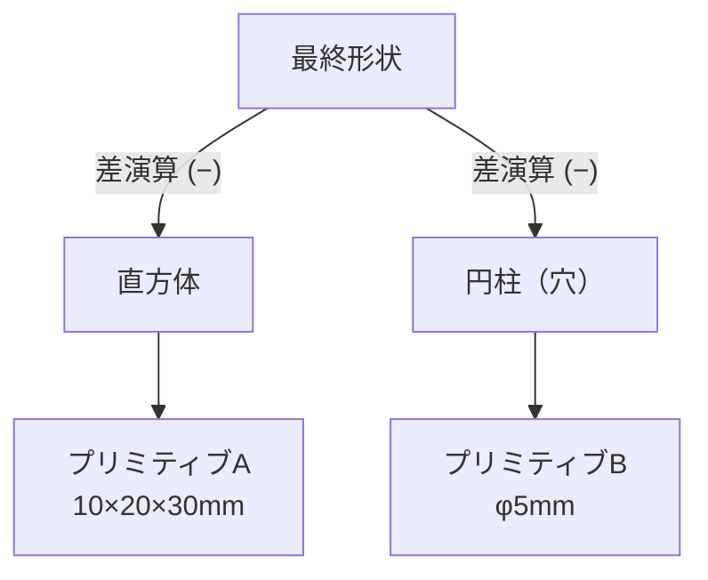

**B-Rep** はCSGを**評価済みの境界面集合**に変換した表現。SolidWorksのフィーチャーツリーは内部でCSGに近いが、カーネルはB-Repを保持する。

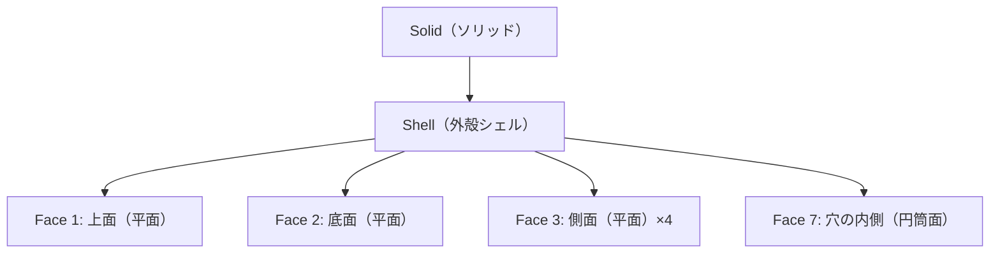

### なぜ板金CADにはB-Repか

| 観点 | B-Rep | CSG | Mesh |
|------|-------|-----|------|
| 面の種類（平面・円筒・自由曲面）| 完全サポート | 基本形のみ | 近似のみ |
| 面種別の識別（フランジ/ベンド）| **直接可能** | 演算履歴依存 | 不可（近似） |
| 展開計算（正確な弧長）| **高精度** | 変換必要 | 誤差大 |
| STEP/IGES出力 | 標準 | 変換必要 | 非標準 |
| 面隣接グラフ（AAG）構築 | **直接構築可能** | 変換必要 | 近似のみ |
| Boolean演算 | 完全サポート | ネイティブ | 困難 |

**結論**: 板金CADで必要な「面種別判定・展開・DFMチェック・隣接解析」はすべてB-Repの位相構造に直接アクセスする必要があるため、OCCTのB-Rep APIが最適な選択肢となる。

---

## 3. B-Repの基本データ構造

### 定義

**Boundary Representation（境界表現、B-Rep）** とは、3D形状をその**境界（表面）を構成する要素の集合**として表現する方法である。形状の内部・外部は境界面によって暗黙的に定義される。

> 形式的定義: 「ソリッドSは、その境界∂Sを構成する面・辺・頂点と、それらの間の位相的な接続関係の集合によって表現される」

B-Repは2つの独立した層で構成される：

- **位相層（Topology）**: 要素間の接続・包含・隣接関係を記述する（どの面がどの辺を持つか）
- **幾何層（Geometry）**: 数学的な形状を記述する（面の方程式・辺の曲線方程式）

### OCCTの位相階層（TopoDS階層）

OCCTの位相構造は8段階の階層を持つ。上位から下位へ「包含」関係が成立する。

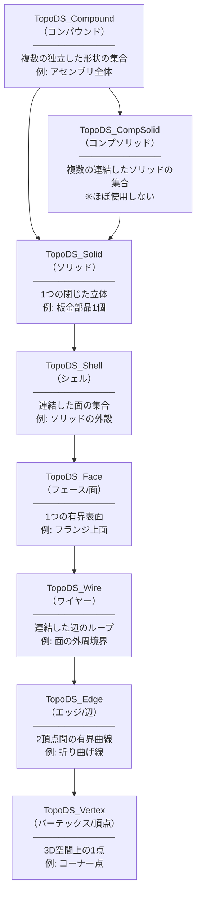

### 各要素の詳細定義

| 要素 | 英語 | 日本語 | 次元 | 定義 | 幾何対応 |
|------|------|--------|------|------|---------|
| `TopoDS_Compound` | Compound | コンパウンド | — | 任意の形状の集合体 | — |
| `TopoDS_CompSolid` | CompSolid | コンプソリッド | 3D | 面共有する複数ソリッド | — |
| `TopoDS_Solid` | Solid | ソリッド | 3D | 閉じた立体（閉Shellで囲まれた体積） | — |
| `TopoDS_Shell` | Shell | シェル | 2D | Face の連結集合（開/閉） | — |
| `TopoDS_Face` | Face | フェース・面 | 2D | 有界表面（Wireで囲まれた曲面片） | `Geom_Surface` |
| `TopoDS_Wire` | Wire | ワイヤー | 1D | Edge の連結ループ（開/閉） | — |
| `TopoDS_Edge` | Edge | エッジ・辺 | 1D | 有界曲線（2つのVertexで限定） | `Geom_Curve` |
| `TopoDS_Vertex` | Vertex | バーテックス・頂点 | 0D | 空間上の点 | `gp_Pnt` |

### 位相（Topology）と幾何（Geometry）の分離

これはOCCTの最も重要な設計原則である。

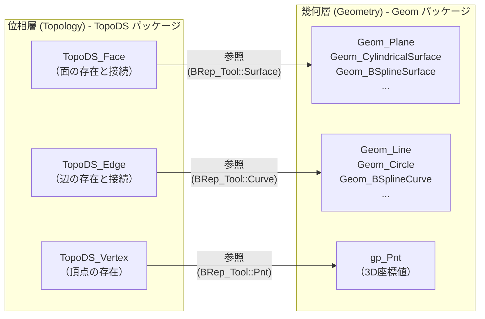

**分離の意義**:

1. **同じ幾何オブジェクトを複数の位相要素で共有できる**: 同一の `Geom_Plane` を複数の `TopoDS_Face` が参照してよい（ミラー形状など）
2. **幾何を変更しても位相は維持される**: パラメータ変更時に接続関係を再構築しなくてよい
3. **位相操作（接続の変更）と幾何操作（形状変更）を独立して実装できる**
4. **同一の曲線を Edge の 3D曲線と Face 上の 2D曲線（PCurve）の両方として参照できる**

```python
from OCC.Core.BRep import BRep_Tool
from OCC.Core.TopoDS import topods

# 位相要素から幾何を取得する例
# Face → 下地曲面（Geom_Surface）
face = topods.Face(some_shape)
surface, u_min, u_max, v_min, v_max = BRep_Tool.Surface(face), *BRep_Tool.UVBounds(face)

# Edge → 3D曲線（Geom_Curve）と パラメータ範囲
edge = topods.Edge(some_shape)
curve, t_first, t_last = BRep_Tool.Curve(edge)

# Vertex → 3D座標
vertex = topods.Vertex(some_shape)
pnt = BRep_Tool.Pnt(vertex)  # gp_Pnt を返す
```

### PCurve（パラメトリック曲線）について

`TopoDS_Edge` は3D曲線に加え、隣接する各 `TopoDS_Face` 上での2Dパラメータ曲線（**PCurve**）を持つ。これは面のパラメータ空間(u,v)における曲線表現であり、「辺はこの面のどこにあるか」を記述する。

```
Edge = {
    3D Curve  : t → (x, y, z)          // 3D空間での曲線
    PCurve①  : t → (u, v) on Face A    // Face A のパラメータ空間
    PCurve②  : t → (u, v) on Face B    // Face B のパラメータ空間
}
```

---

## 4. Orientation（向き）の概念

### Orientationとは

**Orientation（向き、配向）** は、位相要素が親要素との関係でどの方向を「表」とするかを示すフラグである。OCCTでは4種類の向きが定義されている。

| 定数 | 意味 | 用途 |
|------|------|------|
| `TopAbs_FORWARD` | 正方向（デフォルト方向） | 標準的な向き |
| `TopAbs_REVERSED` | 逆方向（デフォルトと反対） | 反転した向き |
| `TopAbs_INTERNAL` | 内部（境界ではなく内側に埋め込まれた要素）| 非多様体・包含関係 |
| `TopAbs_EXTERNAL` | 外部（境界外に浮いた要素）| 浮遊エッジ等 |

> **重要**: `TopAbs_INTERNAL` / `TopAbs_EXTERNAL` は特殊用途（非多様体・板金の内部フィーチャー等）。通常の板金形状では `FORWARD` / `REVERSED` のみを意識すればよい。

### Faceの向きとFace法線

`TopoDS_Face` の向きは、その面の**法線ベクトルの向き**を決定する。OCCTの規約では：

- **法線は Solid の外側（材料の外側）を向く**
- `FORWARD` Face → 法線 = 下地 `Geom_Surface` の自然法線と**同じ向き**
- `REVERSED` Face → 法線 = 下地 `Geom_Surface` の自然法線と**逆向き**

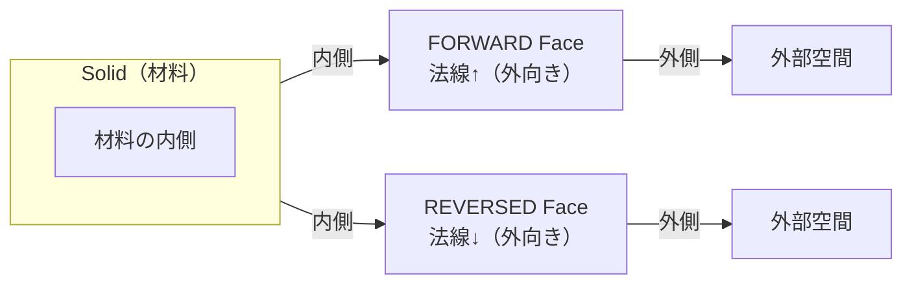

**実例（直方体）**:

```
直方体の上面:
  下地 Geom_Plane の法線 = +Z 方向
  Orientation = FORWARD
  → Face 法線 = +Z （正しく上向き）

直方体の底面:
  下地 Geom_Plane の法線 = +Z 方向（同じ平面を流用）
  Orientation = REVERSED
  → Face 法線 = -Z （正しく下向き）
```

**垂直円筒（貫通穴）の内側面**:

```
円柱面の自然法線 = 軸から外向き（+R方向）
穴の内側は Solid の外側なので → Orientation = REVERSED
→ Face 法線 = 軸に向かう内向き方向
```

### pythonocc でのFace法線取得

```python
from OCC.Core.BRep import BRep_Tool
from OCC.Core.BRepGProp_Face import BRepGProp_Face
from OCC.Core.TopoDS import topods
from OCC.Core.TopAbs import TopAbs_FORWARD, TopAbs_REVERSED

def get_face_normal(face):
    """Face の中心点における外向き法線を取得する"""
    # BRepGProp_Face でパラメータ中心点を取得
    props = BRepGProp_Face(face)
    u_min, u_max, v_min, v_max = props.Bounds()
    u_mid = (u_min + u_max) / 2.0
    v_mid = (v_min + v_max) / 2.0

    # 法線ベクトルを取得
    pnt = props.Normal(u_mid, v_mid)
    normal = props.Normal(u_mid, v_mid)

    # Orientation による符号反転を確認
    orientation = face.Orientation()
    print(f"Face orientation: {'FORWARD' if orientation == TopAbs_FORWARD else 'REVERSED'}")
    return normal
```

### Wireの向きとFaceの向きの関係

`TopoDS_Wire` は `TopoDS_Face` の境界を定義する。1つのFaceは：
- **1つの外側Wire（OuterWire）**: 面の外周境界（反時計回り = 法線が面の上向き方向から見て左手系）
- **0個以上の内側Wire（InnerWire）**: 穴の境界（時計回り）

```
Face（上面）を法線方向から見た時:
  OuterWire → 反時計回り (CCW) → TopAbs_FORWARD
  InnerWire（穴）→ 時計回り (CW)  → TopAbs_REVERSED
```

### Edgeの向きとVertex順序

`TopoDS_Edge` の向きは、その辺の**走査方向**を決定する。

- `FORWARD`: Edge の曲線パラメータが増加する方向 → FirstVertex → LastVertex
- `REVERSED`: Edge の曲線パラメータが増加する方向の逆 → LastVertex → FirstVertex

```python
from OCC.Core.BRep import BRep_Tool
from OCC.Core.TopExp import topexp

# Edge の始点・終点を取得（向きを考慮）
edge = topods.Edge(some_edge_shape)
v_first = topexp.FirstVertex(edge)  # 向きを考慮した始点
v_last  = topexp.LastVertex(edge)   # 向きを考慮した終点
```

---

## 5. Manifold vs Non-manifold

### Manifold（多様体）の定義

**Manifold（多様体）** とは、境界上の任意の点において、その点の十分小さな近傍が**2次元円板（disk）と位相同型**であるような形状のこと。

直感的には:「境界上のどの点でも、ごく小さい球で切り取ると、必ず内側と外側の2領域に分かれる」という性質。

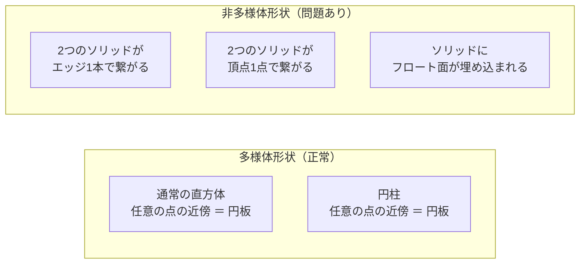

### Non-manifold（非多様体）の具体例

**ケース1: 複数ソリッドがエッジ1本を共有**

```
    [Box A]─────[Box B]
          Edge E

    Edge E の近傍を見ると：
    4つの Face が1つの Edge に接続している
    → 局所的に「円板」ではなく「十字型」になる
    → Non-manifold!
```

**ケース2: 2点で接触するソリッド**

```
     [Box A]
           *  ← この頂点1点だけで接触
     [Box B]

    → Vertex V の近傍が円板にならない
    → Non-manifold!
```

### なぜ非多様体が問題か

AutoMetalSheetの文脈での具体的問題：

| 問題 | 影響 | 発生箇所 |
|------|------|---------|
| `BRepAlgoAPI_Fuse` が非多様体を生成する | 後続のBoolean演算が失敗 | 包絡面計算 |
| `BRepCheck_Analyzer` がエラーを報告する | STEPエクスポートが失敗 | CATIA連携 |
| `TopExp_Explorer` で期待外のEdge数が返る | 面隣接グラフが誤構築される | 展開計算 |
| `BRepBuilderAPI_Sewing` が縫合できない | Shellが完成しない | 形状生成 |
| FreeCADが形状を認識できない | 板金フィーチャーへの変換失敗 | FreeCAD連携 |

### OCCTでの非多様体検出

```python
from OCC.Core.BRepCheck import BRepCheck_Analyzer
from OCC.Core.BRepCheck import BRepCheck_Status

def check_manifold(shape):
    """形状の多様体性と有効性を検証する"""
    analyzer = BRepCheck_Analyzer(shape)

    if analyzer.IsValid():
        print("形状は有効（多様体）です")
        return True
    else:
        print("形状に問題があります:")
        # 詳細エラーの取得（サブシェイプごと）
        from OCC.Core.TopExp import TopExp_Explorer
        from OCC.Core.TopAbs import TopAbs_FACE, TopAbs_EDGE

        exp = TopExp_Explorer(shape, TopAbs_FACE)
        while exp.More():
            face = exp.Current()
            result = analyzer.Result(face)
            if result is not None:
                status_list = result.StatusOnShape(face)
                # BRepCheck_NoError 以外はエラー
            exp.Next()
        return False
```

### Manifold形状の生成原則

板金形状を正しく生成するための必須ルール：

1. **1つのEdgeを共有するFaceは必ず2枚だけ** (境界Edgeは1枚のみ)
2. **Wireは必ず閉じているか、Face境界として意味のある開Wireであること**
3. **Shellは向き（Orientation）が一貫していること**（すべての外面法線が外向き）
4. **ソリッドを構成するShellは必ず閉じていること**（穴のないシェル）

---

## 6. Boolean Operationsの仕組み

### Boolean演算の種類

**Boolean Operations（ブーリアン演算）** は、2つの形状 S1, S2 に対して集合演算を行い新たな形状を生成する操作である。

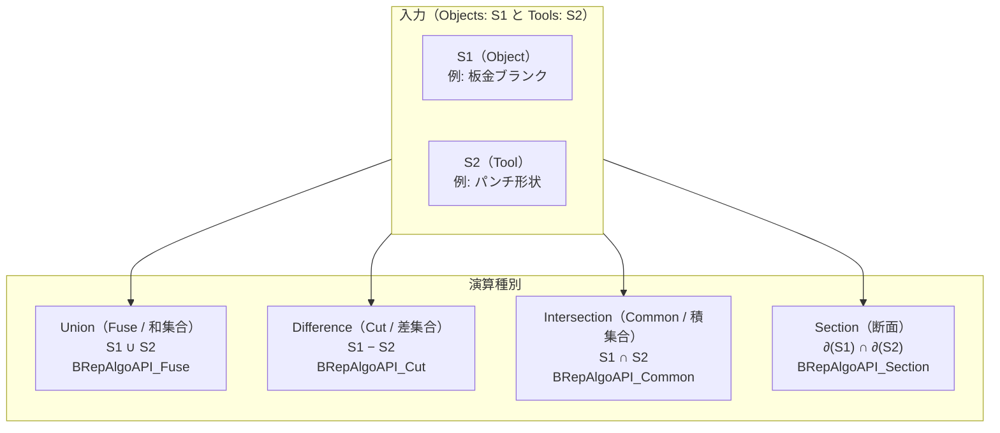

### Boolean演算の処理ステップ

OCCTのBoolean演算は内部で以下のステップを実行する：

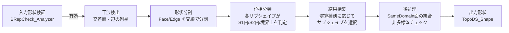

### 板金CADでの用途

| 演算 | 板金用途 | 具体例 |
|------|---------|--------|
| **Fuse（和）** | 包絡面蓄積 | 各姿勢での包絡体をBoolean Fuse で積み上げる |
| **Cut（差）** | 干渉チェック | 可動部のスイープ体 − 周辺固定部 = 干渉量 |
| **Common（積）** | 干渉領域抽出 | 2部品の共通領域を体積計算してクリアランス確認 |
| **Section（断面）** | 断面図生成 | 形状に平面を交差させて2D断面を取得 |

### pythonocc での Boolean演算実装例

```python
from OCC.Core.BRepAlgoAPI import BRepAlgoAPI_Fuse, BRepAlgoAPI_Cut, BRepAlgoAPI_Common
from OCC.Core.BRepPrimAPI import BRepPrimAPI_MakeBox, BRepPrimAPI_MakeCylinder
from OCC.Core.gp import gp_Pnt, gp_Ax2, gp_Dir

def demo_boolean_operations():
    # 板金ブランク（直方体）
    blank = BRepPrimAPI_MakeBox(100.0, 50.0, 1.5).Shape()

    # パンチ形状（円柱穴）
    ax = gp_Ax2(gp_Pnt(50.0, 25.0, -1.0), gp_Dir(0, 0, 1))
    punch = BRepPrimAPI_MakeCylinder(ax, 5.0, 5.0).Shape()

    # --- Cut: ブランクにパンチで穴あけ ---
    cut_op = BRepAlgoAPI_Cut(blank, punch)
    cut_op.Build()
    if cut_op.IsDone():
        punched_blank = cut_op.Shape()
        print("穴あけ成功")
    else:
        print(f"穴あけ失敗: ErrorStatus = {cut_op.HasErrors()}")

    # --- Fuse: 包絡面の蓄積（各姿勢で繰り返し）---
    envelope = BRepPrimAPI_MakeBox(5.0, 5.0, 5.0).Shape()  # 初期包絡体
    for pose_shape in get_pose_shapes():  # 各姿勢の形状
        fuse_op = BRepAlgoAPI_Fuse(envelope, pose_shape)
        fuse_op.Build()
        if fuse_op.IsDone():
            envelope = fuse_op.Shape()

    return punched_blank, envelope
```

### Boolean演算の要件（重要）

```
BRepAlgoAPI の要件（満たさないと失敗する）:
  1. 入力形状が BRepCheck_Analyzer::IsValid() == True であること
  2. Fuse: 両形状が同じ次元（例: Solid vs Solid）であること
  3. Cut:  S2 の最小次元 ≥ S1 の最大次元
  4. 入力形状が有効なトポロジーを持つこと（非多様体不可）
```

---

## 7. 板金形状のB-Rep表現

### 板金形状の幾何的特徴

板金部品は以下の幾何要素のみで構成される（複雑な自由曲面は含まない）：

| 幾何要素 | 対応する面種別 | 対応する `GeomAbs_SurfaceType` |
|---------|-------------|-------------------------------|
| **平面（Plane）** | フランジ（直線部分）、上面・底面 | `GeomAbs_Plane` |
| **円筒面（CylindricalSurface）** | ベンド（曲げ部分） | `GeomAbs_Cylinder` |
| **コーン面**（稀）| テーパーベンド（特殊） | `GeomAbs_Cone` |

### 単純L字曲げのB-Rep構造

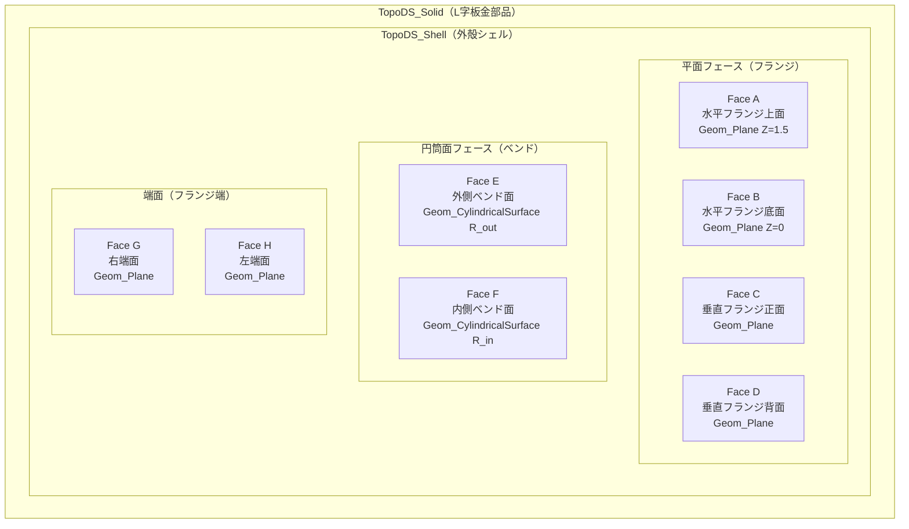

### 面種別とEdge共有の関係

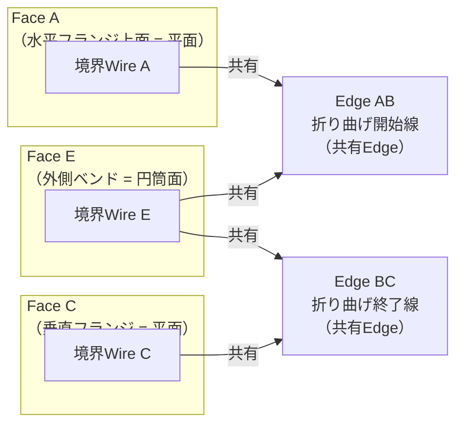

**重要**: フランジとベンドを繋ぐ共有Edgeが「折り曲げ線（曲げ稜線）」に対応する。この辺を正確に抽出することが展開計算の出発点となる。

### 板金B-Repの面種別判定フロー

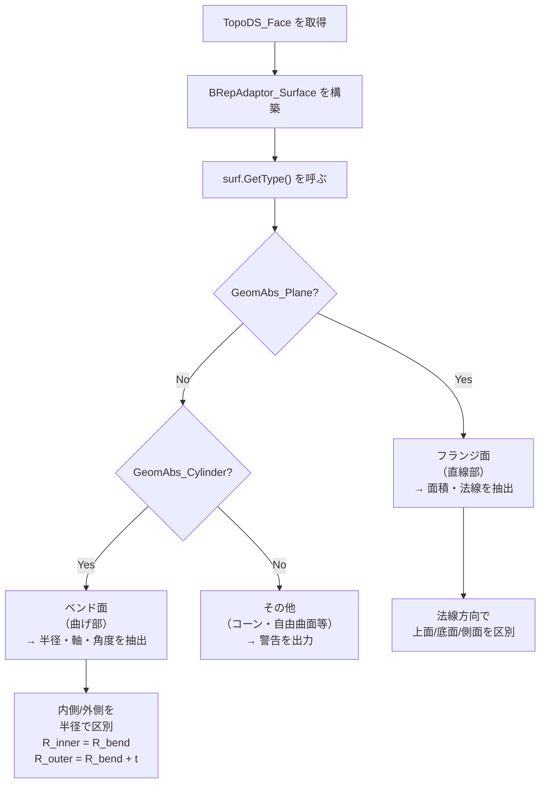

### ベンド面の幾何パラメータ抽出

```python
from OCC.Core.BRepAdaptor import BRepAdaptor_Surface
from OCC.Core.GeomAbs import GeomAbs_Plane, GeomAbs_Cylinder
from OCC.Core.TopoDS import topods
from OCC.Core.TopExp import TopExp_Explorer
from OCC.Core.TopAbs import TopAbs_FACE
import math

def classify_sheet_metal_face(face):
    """
    板金フェースの種別を判定し、幾何パラメータを返す。

    Returns:
        dict: {
            "type": "flange" | "bend" | "other",
            "surface_type": GeomAbs_SurfaceType,
            "properties": {...}
        }
    """
    surf = BRepAdaptor_Surface(face, True)
    surf_type = surf.GetType()

    if surf_type == GeomAbs_Plane:
        # フランジ面
        pln = surf.Plane()
        location = pln.Location()
        normal = pln.Axis().Direction()
        return {
            "type": "flange",
            "surface_type": surf_type,
            "properties": {
                "location": (location.X(), location.Y(), location.Z()),
                "normal": (normal.X(), normal.Y(), normal.Z()),
            }
        }

    elif surf_type == GeomAbs_Cylinder:
        # ベンド面
        cyl = surf.Cylinder()
        location = cyl.Location()
        axis = cyl.Axis().Direction()
        radius = cyl.Radius()
        return {
            "type": "bend",
            "surface_type": surf_type,
            "properties": {
                "location": (location.X(), location.Y(), location.Z()),
                "axis":     (axis.X(), axis.Y(), axis.Z()),
                "radius":   radius,
            }
        }

    else:
        return {
            "type": "other",
            "surface_type": surf_type,
            "properties": {}
        }
```

### 面隣接グラフ（AAG: Abstract Adjacency Graph）の基礎

板金展開計算は、面の隣接関係を**グラフ**として表現する **AAG（Abstract Adjacency Graph）** に基づく。B-Rep上でのAAG構築手順：

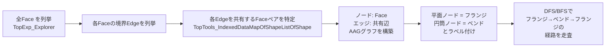

```python
from OCC.Core.TopTools import (
    TopTools_IndexedDataMapOfShapeListOfShape
)
from OCC.Core.TopExp import topexp

def build_face_adjacency_graph(solid):
    """
    ソリッドの面隣接グラフを構築する。
    Returns: dict[face_idx] -> list[face_idx]  (隣接Face のインデックスリスト)
    """
    # Edge → 隣接Face リストの マップを構築
    edge_face_map = TopTools_IndexedDataMapOfShapeListOfShape()
    topexp.MapShapesAndAncestors(
        solid,
        TopAbs_EDGE,   # 検索する要素
        TopAbs_FACE,   # 親要素
        edge_face_map
    )

    # Face → インデックス マップ
    face_map = TopTools_IndexedMapOfShape()
    TopExp_Explorer_impl(solid, TopAbs_FACE, face_map)

    adjacency = {i: [] for i in range(1, face_map.Extent() + 1)}

    for edge_idx in range(1, edge_face_map.Extent() + 1):
        edge = edge_face_map.FindKey(edge_idx)
        face_list = edge_face_map.FindFromIndex(edge_idx)

        faces_sharing = []
        it = face_list.begin()
        # 共有する全Faceを収集
        # ... (イテレーション実装)

        if len(faces_sharing) == 2:
            i, j = faces_sharing
            adjacency[i].append(j)
            adjacency[j].append(i)

    return adjacency
```

---

## 8. OpenCASCADE（OCCT）でのB-Rep操作

### TopoDS_Shape 階層と主要クラス

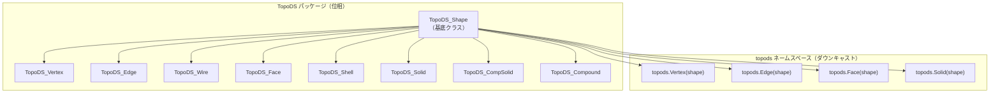

**重要**: `TopExp_Explorer::Current()` は常に `TopoDS_Shape` を返す。`TopoDS_Face` として使うには `topods.Face()` でダウンキャストが必要。

```python
from OCC.Core.TopoDS import topods
from OCC.Core.TopExp import TopExp_Explorer
from OCC.Core.TopAbs import TopAbs_FACE

exp = TopExp_Explorer(solid, TopAbs_FACE)
while exp.More():
    shape = exp.Current()         # TopoDS_Shape（基底型）
    face  = topods.Face(shape)    # TopoDS_Face（正しいダウンキャスト）
    # face を使った処理...
    exp.Next()
```

### TopExp_Explorer による走査

`TopExp_Explorer` はB-Rep階層を深さ優先探索（DFS）で走査し、指定した型のすべての要素を列挙するクラスである。

```python
from OCC.Core.TopExp import TopExp_Explorer
from OCC.Core.TopAbs import (
    TopAbs_COMPOUND, TopAbs_SOLID, TopAbs_SHELL,
    TopAbs_FACE, TopAbs_WIRE, TopAbs_EDGE, TopAbs_VERTEX,
    TopAbs_SHAPE
)

# --- 基本的な走査パターン ---
def explore_shape(shape, shape_type):
    """指定した型のすべての部分形状を列挙する"""
    results = []
    exp = TopExp_Explorer(shape, shape_type)
    while exp.More():
        results.append(exp.Current())
        exp.Next()
    return results

# --- 特定の型を避けながら走査する（ToAvoid パラメータ）---
# Shell の中の Face のみを取得（CompSolid や Compound の Shellをスキップ）
exp = TopExp_Explorer(compound, TopAbs_FACE, TopAbs_SHELL)
# → CompSolid > Solid > Shell の Shell を「避け」ながらFaceを探索

# --- 深さ情報の取得 ---
exp = TopExp_Explorer(solid, TopAbs_EDGE)
while exp.More():
    edge = topods.Edge(exp.Current())
    depth = exp.Depth()  # 0 = solid自身, 1 = Shell, 2 = Face, 3 = Wire, 4 = Edge
    exp.Next()
```

**走査時の重複に注意**: `TopExp_Explorer` はパス重複で同じ要素を複数回返すことがある（例：2つのFaceに共有されるEdgeは2回列挙される）。ユニーク化が必要な場合は `TopTools_IndexedMapOfShape` を使う。

```python
from OCC.Core.TopTools import TopTools_IndexedMapOfShape
from OCC.Core.TopExp import topexp

# ユニークなEdgeのみを取得（共有Edge の重複なし）
edge_map = TopTools_IndexedMapOfShape()
topexp.MapShapes(solid, TopAbs_EDGE, edge_map)

unique_edges = []
for i in range(1, edge_map.Extent() + 1):
    unique_edges.append(topods.Edge(edge_map.FindKey(i)))
```

### BRepBuilderAPI_* による形状構築

OCCTで形状をプログラム的に構築する際に使うBuilderクラスの一覧：

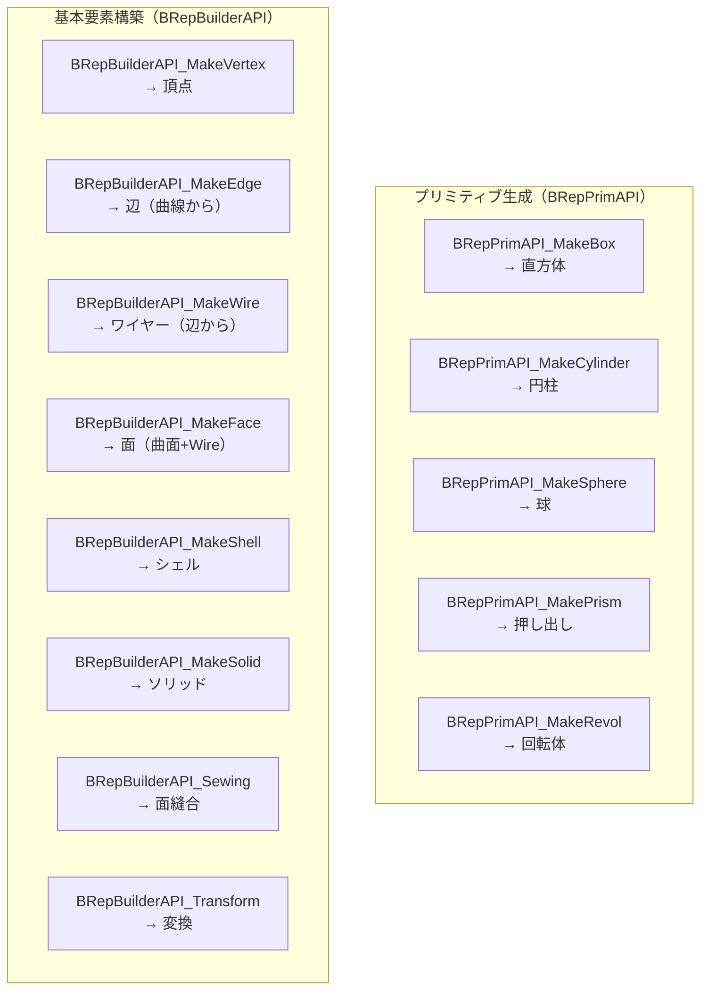

**板金形状の逐次構築例（L字断面）**:

```python
from OCC.Core.BRepBuilderAPI import (
    BRepBuilderAPI_MakeEdge,
    BRepBuilderAPI_MakeWire,
    BRepBuilderAPI_MakeFace,
)
from OCC.Core.BRepPrimAPI import BRepPrimAPI_MakePrism
from OCC.Core.gp import gp_Pnt, gp_Vec
from OCC.Core.GC import GC_MakeSegment, GC_MakeArcOfCircle, GC_MakeCircle
from OCC.Core.gp import gp_Circ, gp_Ax2, gp_Dir
import math

def make_l_bracket_profile(
    flange1_length: float,  # 水平フランジ長さ [mm]
    flange2_length: float,  # 垂直フランジ長さ [mm]
    thickness: float,       # 板厚 [mm]
    bend_radius: float,     # 内側曲げ半径 [mm]
):
    """
    L字ブラケットの2D断面プロファイルを構築する（Z=0 平面上）
    外側輪郭のWireを返す
    """
    R_in  = bend_radius
    R_out = bend_radius + thickness

    # 外側輪郭の頂点を定義
    # 水平部 底面
    P0 = gp_Pnt(0.0,              0.0, 0.0)  # 水平フランジ先端・底
    P1 = gp_Pnt(flange1_length,   0.0, 0.0)  # 水平フランジ付け根・底

    # 外側ベンド円弧の中心
    arc_center_out = gp_Pnt(flange1_length, R_out, 0.0)
    # 内側ベンド円弧の中心
    arc_center_in  = gp_Pnt(flange1_length, R_in,  0.0)

    P2 = gp_Pnt(flange1_length + R_out, R_out, 0.0)  # 外側ベンド終端
    P3 = gp_Pnt(flange1_length + R_out, R_out + flange2_length, 0.0)  # 垂直フランジ先端・外

    P4 = gp_Pnt(flange1_length + R_in,  R_in  + flange2_length, 0.0)  # 垂直フランジ先端・内
    P5 = gp_Pnt(flange1_length + R_in,  R_in,  0.0)                   # 内側ベンド終端
    P6 = gp_Pnt(flange1_length,         thickness, 0.0)               # 水平フランジ付け根・上
    P7 = gp_Pnt(0.0,                    thickness, 0.0)               # 水平フランジ先端・上

    # 直線エッジ
    e0 = BRepBuilderAPI_MakeEdge(GC_MakeSegment(P0, P1).Value()).Edge()
    e3 = BRepBuilderAPI_MakeEdge(GC_MakeSegment(P2, P3).Value()).Edge()
    e4 = BRepBuilderAPI_MakeEdge(GC_MakeSegment(P3, P4).Value()).Edge()
    e5 = BRepBuilderAPI_MakeEdge(GC_MakeSegment(P4, P5).Value()).Edge()
    e7 = BRepBuilderAPI_MakeEdge(GC_MakeSegment(P6, P7).Value()).Edge()
    e8 = BRepBuilderAPI_MakeEdge(GC_MakeSegment(P7, P0).Value()).Edge()

    # 外側ベンド円弧（90度、反時計回り）
    z_axis = gp_Dir(0, 0, 1)
    arc_axis_out = gp_Ax2(arc_center_out, z_axis)
    circ_out = gp_Circ(arc_axis_out, R_out)
    arc_out = GC_MakeArcOfCircle(circ_out, P1, P2, True).Value()
    e_arc_out = BRepBuilderAPI_MakeEdge(arc_out).Edge()

    # 内側ベンド円弧（90度、時計回り）
    arc_axis_in = gp_Ax2(arc_center_in, z_axis)
    circ_in = gp_Circ(arc_axis_in, R_in)
    arc_in = GC_MakeArcOfCircle(circ_in, P5, P6, False).Value()
    e_arc_in = BRepBuilderAPI_MakeEdge(arc_in).Edge()

    # Wireの構築
    wire_builder = BRepBuilderAPI_MakeWire()
    for edge in [e0, e_arc_out, e3, e4, e5, e_arc_in, e7, e8]:
        wire_builder.Add(edge)

    if not wire_builder.IsDone():
        raise RuntimeError(f"Wire構築失敗: {wire_builder.Error()}")

    profile_wire = wire_builder.Wire()

    # Faceの構築（プロファイルのXY平面上のFace）
    face = BRepBuilderAPI_MakeFace(profile_wire).Face()

    return face

def make_l_bracket(flange1_length, flange2_length, thickness, bend_radius, width):
    """L字ブラケットをプロファイル押し出しで生成"""
    profile_face = make_l_bracket_profile(
        flange1_length, flange2_length, thickness, bend_radius
    )
    # Y軸方向に width だけ押し出す
    prism = BRepPrimAPI_MakePrism(profile_face, gp_Vec(0, width, 0))
    prism.Build()
    return prism.Shape()
```

### BRepAlgo* による Boolean演算（重複）

詳細は [Section 6](#6-boolean-operationsの仕組み) 参照。AutoMetalSheetでの使用パターン：

```python
# 包絡面計算の典型パターン
from OCC.Core.BRepAlgoAPI import BRepAlgoAPI_Fuse
from OCC.Core.BRepCheck import BRepCheck_Analyzer

def accumulate_envelope(pose_shapes):
    """複数姿勢の形状を Fuse で積み上げて包絡面を生成する"""
    if not pose_shapes:
        return None

    envelope = pose_shapes[0]

    for i, shape in enumerate(pose_shapes[1:]):
        # 入力検証（必須）
        if not BRepCheck_Analyzer(envelope).IsValid():
            raise ValueError(f"包絡面 (step {i}) が無効な形状になりました")
        if not BRepCheck_Analyzer(shape).IsValid():
            raise ValueError(f"姿勢形状 {i+1} が無効です")

        op = BRepAlgoAPI_Fuse(envelope, shape)
        op.Build()

        if not op.IsDone():
            raise RuntimeError(f"Boolean Fuse 失敗 at step {i+1}")

        envelope = op.Shape()

    return envelope
```

---

## 9. pythonocc を使った実装例

### インストールと環境

```bash
# conda-forge 経由（推奨）
conda install -c conda-forge pythonocc-core

# pip 経由（Windows は制限あり）
pip install pythonocc-core
```

**pythonocc-core 7.9.x の主要モジュール**:

```python
# 位相モジュール
from OCC.Core.TopoDS     import TopoDS_Shape, topods
from OCC.Core.TopAbs     import TopAbs_FACE, TopAbs_EDGE, TopAbs_VERTEX, TopAbs_FORWARD
from OCC.Core.TopExp     import TopExp_Explorer, topexp
from OCC.Core.TopTools   import TopTools_IndexedMapOfShape, TopTools_IndexedDataMapOfShapeListOfShape

# 幾何モジュール
from OCC.Core.gp         import gp_Pnt, gp_Vec, gp_Dir, gp_Ax2, gp_Pln, gp_Circ, gp_Cylinder
from OCC.Core.Geom       import Geom_Plane, Geom_CylindricalSurface
from OCC.Core.GeomAbs    import GeomAbs_Plane, GeomAbs_Cylinder, GeomAbs_Cone

# BRep アクセスモジュール
from OCC.Core.BRep       import BRep_Tool
from OCC.Core.BRepAdaptor import BRepAdaptor_Surface, BRepAdaptor_Curve

# 形状構築モジュール
from OCC.Core.BRepBuilderAPI import (
    BRepBuilderAPI_MakeEdge, BRepBuilderAPI_MakeWire,
    BRepBuilderAPI_MakeFace, BRepBuilderAPI_MakeSolid,
    BRepBuilderAPI_Sewing, BRepBuilderAPI_Transform,
)
from OCC.Core.BRepPrimAPI import (
    BRepPrimAPI_MakeBox, BRepPrimAPI_MakeCylinder,
    BRepPrimAPI_MakePrism, BRepPrimAPI_MakeRevol,
)

# Boolean演算モジュール
from OCC.Core.BRepAlgoAPI import BRepAlgoAPI_Fuse, BRepAlgoAPI_Cut, BRepAlgoAPI_Common

# 検証モジュール
from OCC.Core.BRepCheck  import BRepCheck_Analyzer

# STEP I/O モジュール
from OCC.Core.STEPControl import STEPControl_Reader, STEPControl_Writer
from OCC.Core.IFSelect    import IFSelect_RetDone
```

### 板金B-Repの全体走査・面分類の完全実装例

```python
"""
sheet_metal_analyzer.py
板金B-Repの走査・面分類・隣接グラフ構築の完全実装例
pythonocc-core 7.9.x 対応
"""

from dataclasses import dataclass, field
from typing import Optional
import math

from OCC.Core.TopoDS import topods
from OCC.Core.TopAbs import (
    TopAbs_FACE, TopAbs_EDGE, TopAbs_VERTEX,
    TopAbs_FORWARD, TopAbs_REVERSED
)
from OCC.Core.TopExp import TopExp_Explorer, topexp
from OCC.Core.TopTools import (
    TopTools_IndexedMapOfShape,
    TopTools_IndexedDataMapOfShapeListOfShape,
)
from OCC.Core.BRepAdaptor import BRepAdaptor_Surface
from OCC.Core.GeomAbs import (
    GeomAbs_Plane, GeomAbs_Cylinder, GeomAbs_Cone,
    GeomAbs_Sphere, GeomAbs_Torus, GeomAbs_BSplineSurface,
)
from OCC.Core.BRep import BRep_Tool
from OCC.Core.BRepCheck import BRepCheck_Analyzer
from OCC.Core.BRepGProp import brepgprop_SurfaceProperties
from OCC.Core.GProp import GProp_GProps


@dataclass
class FlangeFaceInfo:
    """フランジ面（平面）の情報"""
    face_index: int
    location: tuple          # (x, y, z) 位置
    normal: tuple            # (nx, ny, nz) 外向き法線
    area: float              # 面積 [mm²]
    orientation: str         # "FORWARD" or "REVERSED"


@dataclass
class BendFaceInfo:
    """ベンド面（円筒面）の情報"""
    face_index: int
    location: tuple          # (x, y, z) 軸上の基準点
    axis: tuple              # (ax, ay, az) 軸方向ベクトル
    radius: float            # 半径 [mm]
    area: float              # 面積 [mm²]
    orientation: str         # "FORWARD" or "REVERSED"


@dataclass
class SheetMetalBRepAnalysis:
    """板金B-Rep解析の結果"""
    flanges: list[FlangeFaceInfo] = field(default_factory=list)
    bends: list[BendFaceInfo] = field(default_factory=list)
    other_faces: list[int] = field(default_factory=list)
    adjacency: dict = field(default_factory=dict)  # face_idx -> [face_idx]
    is_valid: bool = False


def get_face_area(face) -> float:
    """Face の面積を計算する [mm²]"""
    props = GProp_GProps()
    brepgprop_SurfaceProperties(face, props)
    return props.Mass()


def analyze_sheet_metal_brep(solid) -> SheetMetalBRepAnalysis:
    """
    板金ソリッドのB-Repを解析して面種別・隣接グラフを返す。

    Args:
        solid: TopoDS_Solid（板金部品）

    Returns:
        SheetMetalBRepAnalysis
    """
    result = SheetMetalBRepAnalysis()

    # --- Step 1: 形状の有効性検証 ---
    analyzer = BRepCheck_Analyzer(solid)
    result.is_valid = analyzer.IsValid()
    if not result.is_valid:
        print("[WARN] 形状が無効です。解析結果の信頼性が低下します。")

    # --- Step 2: Face の列挙とユニーク化 ---
    face_map = TopTools_IndexedMapOfShape()
    topexp.MapShapes(solid, TopAbs_FACE, face_map)

    # --- Step 3: 各Face の分類 ---
    for face_idx in range(1, face_map.Extent() + 1):
        face_shape = face_map.FindKey(face_idx)
        face = topods.Face(face_shape)

        # 向きを取得
        orientation = face.Orientation()
        orient_str = "FORWARD" if orientation == TopAbs_FORWARD else "REVERSED"

        # 面積を計算
        area = get_face_area(face)

        # 面種別を判定
        surf = BRepAdaptor_Surface(face, True)
        surf_type = surf.GetType()

        if surf_type == GeomAbs_Plane:
            pln = surf.Plane()
            loc = pln.Location()
            nor = pln.Axis().Direction()
            # REVERSED の場合、法線方向を反転して外向きにする
            sign = 1.0 if orientation == TopAbs_FORWARD else -1.0
            result.flanges.append(FlangeFaceInfo(
                face_index = face_idx,
                location   = (loc.X(), loc.Y(), loc.Z()),
                normal     = (sign * nor.X(), sign * nor.Y(), sign * nor.Z()),
                area       = area,
                orientation = orient_str,
            ))

        elif surf_type == GeomAbs_Cylinder:
            cyl = surf.Cylinder()
            loc = cyl.Location()
            ax  = cyl.Axis().Direction()
            radius = cyl.Radius()
            result.bends.append(BendFaceInfo(
                face_index = face_idx,
                location   = (loc.X(), loc.Y(), loc.Z()),
                axis       = (ax.X(), ax.Y(), ax.Z()),
                radius     = radius,
                area       = area,
                orientation = orient_str,
            ))

        else:
            result.other_faces.append(face_idx)
            surf_type_name = {
                GeomAbs_Cone:           "Cone",
                GeomAbs_Sphere:         "Sphere",
                GeomAbs_Torus:          "Torus",
                GeomAbs_BSplineSurface: "BSpline",
            }.get(surf_type, f"Unknown({surf_type})")
            print(f"[INFO] Face {face_idx}: 未対応面種別 = {surf_type_name}")

    # --- Step 4: 面隣接グラフの構築 ---
    edge_face_map = TopTools_IndexedDataMapOfShapeListOfShape()
    topexp.MapShapesAndAncestors(
        solid, TopAbs_EDGE, TopAbs_FACE, edge_face_map
    )

    adjacency = {i: [] for i in range(1, face_map.Extent() + 1)}

    for edge_idx in range(1, edge_face_map.Extent() + 1):
        face_list = edge_face_map.FindFromIndex(edge_idx)

        # この辺を共有するFaceのインデックスを収集
        sharing_face_indices = []
        face_list_iter = face_list  # TopTools_ListOfShape
        # イテレータが必要なためリストに変換
        from OCC.Core.TopoDS import TopoDS_Shape
        it = face_list.begin()
        while it != face_list.end():
            sharing_face = topods.Face(it.Value())
            fi = face_map.FindIndex(sharing_face)
            if fi > 0:
                sharing_face_indices.append(fi)
            it.Next()

        # 2枚のFaceが共有するエッジ（通常の多様体Edge）
        if len(sharing_face_indices) == 2:
            i, j = sharing_face_indices
            if j not in adjacency[i]:
                adjacency[i].append(j)
            if i not in adjacency[j]:
                adjacency[j].append(i)
        elif len(sharing_face_indices) > 2:
            print(f"[WARN] Edge {edge_idx} が {len(sharing_face_indices)} 枚のFaceに共有されています（非多様体）")

    result.adjacency = adjacency

    return result


def print_analysis_report(analysis: SheetMetalBRepAnalysis):
    """解析結果をレポート出力する"""
    print("=" * 60)
    print("板金B-Rep解析レポート")
    print("=" * 60)
    print(f"形状有効性: {'OK' if analysis.is_valid else 'NG（警告あり）'}")
    print()
    print(f"フランジ面数: {len(analysis.flanges)}")
    for f in analysis.flanges:
        nx, ny, nz = f.normal
        print(f"  Face {f.face_index:3d}: 法線=({nx:+.3f},{ny:+.3f},{nz:+.3f})"
              f"  面積={f.area:8.2f}mm²  {f.orientation}")
    print()
    print(f"ベンド面数: {len(analysis.bends)}")
    for b in analysis.bends:
        print(f"  Face {b.face_index:3d}: R={b.radius:.3f}mm"
              f"  軸=({b.axis[0]:+.3f},{b.axis[1]:+.3f},{b.axis[2]:+.3f})"
              f"  面積={b.area:8.2f}mm²")
    print()
    print(f"その他の面数: {len(analysis.other_faces)}")
    print()
    print("隣接グラフ（Face接続関係）:")
    for face_idx, neighbors in analysis.adjacency.items():
        if neighbors:
            print(f"  Face {face_idx:3d} ─── {neighbors}")
    print("=" * 60)
```

### STEPファイルの読み込みと解析

```python
from OCC.Core.STEPControl import STEPControl_Reader
from OCC.Core.IFSelect    import IFSelect_RetDone
from OCC.Core.TopoDS      import topods

def load_and_analyze_step(step_path: str) -> SheetMetalBRepAnalysis:
    """
    STEPファイルを読み込み、板金B-Rep解析を実行する。

    Args:
        step_path: STEPファイルのパス

    Returns:
        SheetMetalBRepAnalysis
    """
    # STEPファイルの読み込み
    reader = STEPControl_Reader()
    status = reader.ReadFile(step_path)

    if status != IFSelect_RetDone:
        raise FileNotFoundError(f"STEPファイルの読み込み失敗: {step_path}")

    reader.TransferRoots()
    shape = reader.OneShape()

    # Solid の抽出
    solid_exp = TopExp_Explorer(shape, TopAbs_SOLID)
    if not solid_exp.More():
        raise ValueError("STEPファイルにSolidが含まれていません")

    solid = topods.Solid(solid_exp.Current())

    # 解析実行
    analysis = analyze_sheet_metal_brep(solid)
    print_analysis_report(analysis)

    return analysis
```

---

## 10. Sewingと形状修復

### Sewing（縫合）とは

**Sewing（縫合、ソーイング）** とは、空間的に接している（または十分に近接している）複数の `TopoDS_Face` を連結し、一体の `TopoDS_Shell` または `TopoDS_Solid` として組み上げる操作である。

縫合が必要になる代表的なシナリオ：
1. **STEPインポート後**: STEP変換で面の接続情報が失われ、バラバラのFaceとして読み込まれた場合
2. **B-Repの手動構築時**: 個別に作成したFaceを組み合わせてSolidにする場合
3. **修復処理**: 形状修復後に再接続が必要な場合
4. **板金展開後の再接続**: 展開した面を元の折り曲げ角度で組み直す場合

### OCCTのSewing操作フロー

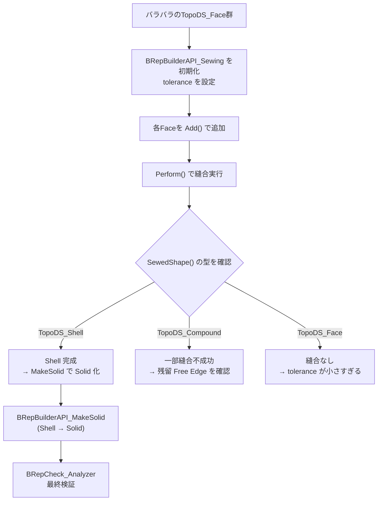

### Sewingの実装例

```python
from OCC.Core.BRepBuilderAPI import BRepBuilderAPI_Sewing, BRepBuilderAPI_MakeSolid
from OCC.Core.BRepCheck import BRepCheck_Analyzer
from OCC.Core.TopAbs import TopAbs_SHELL, TopAbs_COMPOUND
from OCC.Core.TopoDS import topods, TopoDS_Shell

def sew_faces_to_solid(faces: list, tolerance: float = 1.0e-3) -> object:
    """
    複数のFaceを縫合してSolidを生成する。

    Args:
        faces: TopoDS_Face のリスト
        tolerance: 縫合許容差 [mm]（STEPインポート後は 1.0e-3 ～ 1.0e-2 が適切）

    Returns:
        TopoDS_Solid（成功時）または None（失敗時）
    """
    sewer = BRepBuilderAPI_Sewing(tolerance)
    sewer.SetNonManifoldMode(False)  # 多様体のみを縫合（デフォルト）
    # sewer.SetNonManifoldMode(True)  # 非多様体も許容する場合

    for face in faces:
        sewer.Add(face)

    # 縫合実行
    sewer.Perform()
    sewed = sewer.SewedShape()

    # 結果の型確認
    shape_type = sewed.ShapeType()

    if shape_type == TopAbs_SHELL:
        shell = topods.Shell(sewed)
        print(f"Sewing 成功: Shell が構築されました (Face {len(faces)}枚)")

        # Shell → Solid 化
        solid_builder = BRepBuilderAPI_MakeSolid()
        solid_builder.Add(shell)
        if solid_builder.IsDone():
            solid = solid_builder.Solid()
            # 最終検証
            check = BRepCheck_Analyzer(solid)
            if check.IsValid():
                print("Solid 構築完了（有効）")
                return solid
            else:
                print("[WARN] Solid は無効な形状です。修復が必要です。")
                return solid  # 警告を出しつつ返す
        else:
            print("[ERROR] Solid 化失敗")
            return None

    elif shape_type == TopAbs_COMPOUND:
        print("[WARN] Sewing 結果が Compound です。一部のFaceが縫合されていません。")
        print("  → tolerance を大きくするか、Free Edge を確認してください。")
        # Free Edge の確認
        from OCC.Core.TopExp import TopExp_Explorer
        from OCC.Core.TopAbs import TopAbs_EDGE
        exp = TopExp_Explorer(sewed, TopAbs_EDGE)
        free_edge_count = 0
        while exp.More():
            free_edge_count += 1
            exp.Next()
        print(f"  Free Edge 数: {free_edge_count}")
        return None

    else:
        print(f"[ERROR] 予期しない形状タイプ: {shape_type}")
        return None


def repair_shape(shape, tolerance: float = 1.0e-3):
    """
    ShapeFix パッケージを使った形状修復。
    向き不整合・精度問題・非多様体を修復する。
    """
    from OCC.Core.ShapeFix import ShapeFix_Shape

    fixer = ShapeFix_Shape(shape)
    fixer.SetPrecision(tolerance)
    fixer.SetMaxTolerance(tolerance * 10)
    fixer.SetMinTolerance(tolerance * 0.01)
    fixer.Perform()

    fixed = fixer.Shape()
    check = BRepCheck_Analyzer(fixed)
    if check.IsValid():
        print("形状修復成功")
    else:
        print("[WARN] 修復後も無効な部分が残っています")

    return fixed
```

### Sewing tolerance の選択指針

| シナリオ | 推奨 tolerance |
|---------|---------------|
| 手動構築（精密）| `1.0e-6` ～ `1.0e-5` mm |
| STEPインポート（AP203/AP214）| `1.0e-3` mm |
| STEPインポート（精度が低い場合）| `1.0e-2` mm |
| FreeCAD出力の板金面 | `1.0e-3` mm |
| 異なるCADシステム間の変換 | `1.0e-2` ～ `1.0e-1` mm |

> **警告**: tolerance を大きくすると、近接しているが別物のEdgeが誤縫合される可能性がある。板金の薄板（板厚1.5mm）の場合、tolerance > 板厚/10 = 0.15mm は危険。

---

## 11. よくある落とし穴とデバッグ方法

### 落とし穴 1: TopExp_Explorer の重複列挙

**問題**: 共有Edgeが複数のFaceに属するため、`TopExp_Explorer` が同じEdgeを2回以上返す。

```python
# NG: 重複あり（12辺の直方体で24エッジが返る）
exp = TopExp_Explorer(box, TopAbs_EDGE)
edges = []
while exp.More():
    edges.append(exp.Current())  # 同じEdgeが2回入る
    exp.Next()
print(len(edges))  # → 24 (本来は12)

# OK: ユニーク化（TopTools_IndexedMapOfShape）
edge_map = TopTools_IndexedMapOfShape()
topexp.MapShapes(box, TopAbs_EDGE, edge_map)
print(edge_map.Extent())  # → 12 (正しい)
```

### 落とし穴 2: ダウンキャストの忘れ

**問題**: `exp.Current()` が返す `TopoDS_Shape` をそのまま `BRepAdaptor_Surface` に渡すとエラー。

```python
# NG
exp = TopExp_Explorer(solid, TopAbs_FACE)
while exp.More():
    shape = exp.Current()
    surf = BRepAdaptor_Surface(shape, True)  # TypeError!
    exp.Next()

# OK
exp = TopExp_Explorer(solid, TopAbs_FACE)
while exp.More():
    face = topods.Face(exp.Current())   # 正しいダウンキャスト
    surf = BRepAdaptor_Surface(face, True)
    exp.Next()
```

### 落とし穴 3: 向き（Orientation）を無視した法線計算

**問題**: `REVERSED` の Face に対して Surface の自然法線をそのまま使うと、内向き法線になる。

```python
from OCC.Core.BRep import BRep_Tool
from OCC.Core.TopAbs import TopAbs_REVERSED

# NG: 向きを無視
surf = BRep_Tool.Surface(face)
normal = surf.DN(u, v, 0, 1)  # Surface の自然法線（向きを無視）

# OK: 向きを考慮
surf_adaptor = BRepAdaptor_Surface(face, True)
pln = surf_adaptor.Plane()
normal = pln.Axis().Direction()
if face.Orientation() == TopAbs_REVERSED:
    normal.Reverse()  # 外向き法線に補正
```

### 落とし穴 4: 非多様体形状の見落とし

**問題**: Boolean演算後に非多様体が生成されたことに気づかず後続処理を実行する。

```python
# OK: Boolean演算後に必ず検証
def safe_boolean_fuse(s1, s2):
    op = BRepAlgoAPI_Fuse(s1, s2)
    op.Build()

    if not op.IsDone():
        raise RuntimeError("Boolean Fuse が完了しませんでした")

    result = op.Shape()

    # 必須: 結果検証
    check = BRepCheck_Analyzer(result)
    if not check.IsValid():
        # ShapeFix で修復を試みる
        from OCC.Core.ShapeFix import ShapeFix_Shape
        fixer = ShapeFix_Shape(result)
        fixer.Perform()
        result = fixer.Shape()
        if not BRepCheck_Analyzer(result).IsValid():
            raise ValueError("Boolean Fuse の結果が修復不能な非多様体形状です")

    return result
```

### 落とし穴 5: Sewing toleranceの不適切な設定

**問題**: tolerance が小さすぎると縫合されない。大きすぎると誤縫合。

```python
def adaptive_sewing(faces, initial_tolerance=1.0e-3, max_tolerance=1.0e-1):
    """
    toleranceを段階的に大きくしながら縫合を試みる。
    """
    tolerance = initial_tolerance
    while tolerance <= max_tolerance:
        result = sew_faces_to_solid(faces, tolerance)
        if result is not None:
            return result
        tolerance *= 10
        print(f"tolerance を {tolerance} に拡大して再試行...")

    raise RuntimeError(f"tolerance {max_tolerance} でも縫合できませんでした")
```

### 落とし穴 6: PCurveのない Edge

**問題**: `BRep_Tool.CurveOnSurface()` が None を返す場合がある（PCurveが未定義）。

```python
from OCC.Core.BRep import BRep_Tool

# PCurve の存在確認
def has_pcurve(edge, face):
    """Edge が Face 上のPCurveを持つかチェックする"""
    curve_2d, first, last = BRep_Tool.CurveOnSurface(edge, face)
    return curve_2d is not None

# PCurveがない場合は BRepLib を使って追加
from OCC.Core.BRepLib import breplib_BuildCurves3d, breplib
def repair_missing_pcurves(shape):
    """3D曲線からPCurveを再計算する"""
    breplib.BuildCurves3d(shape)  # 3D曲線からPCurveを再構築
```

### デバッグ用ユーティリティ

```python
def shape_info(shape) -> str:
    """形状の基本情報を文字列で返す（デバッグ用）"""
    from OCC.Core.TopTools import TopTools_IndexedMapOfShape
    from OCC.Core.TopAbs import (
        TopAbs_SOLID, TopAbs_SHELL, TopAbs_FACE,
        TopAbs_WIRE, TopAbs_EDGE, TopAbs_VERTEX
    )

    def count(shape_type):
        m = TopTools_IndexedMapOfShape()
        topexp.MapShapes(shape, shape_type, m)
        return m.Extent()

    valid = BRepCheck_Analyzer(shape).IsValid()

    lines = [
        f"ShapeType  : {shape.ShapeType()}",
        f"IsValid    : {valid}",
        f"Solids     : {count(TopAbs_SOLID)}",
        f"Shells     : {count(TopAbs_SHELL)}",
        f"Faces      : {count(TopAbs_FACE)}",
        f"Wires      : {count(TopAbs_WIRE)}",
        f"Edges      : {count(TopAbs_EDGE)}",
        f"Vertices   : {count(TopAbs_VERTEX)}",
    ]
    return "\n".join(lines)


def export_brep(shape, filepath: str):
    """形状をBREPファイルに保存（デバッグ用）"""
    from OCC.Core.BRepTools import breptools
    breptools.Write(shape, filepath)
    print(f"BREP保存: {filepath}")


def export_step(shape, filepath: str):
    """形状をSTEPファイルに保存"""
    from OCC.Core.STEPControl import STEPControl_Writer
    from OCC.Core.IFSelect import IFSelect_RetDone
    writer = STEPControl_Writer()
    writer.Transfer(shape, 0)  # 0 = STEPControl_AsIs
    status = writer.Write(filepath)
    if status == IFSelect_RetDone:
        print(f"STEP保存: {filepath}")
    else:
        raise RuntimeError(f"STEP保存失敗: {filepath}")
```

### 精度（Tolerance）問題の診断

OCCTではすべてのFace・Edge・Vertexが独自の**tolerance（許容差）**を持つ。tolerance不整合が形状不良の原因になることが多い。

```python
from OCC.Core.BRep import BRep_Tool

def diagnose_tolerance(solid):
    """形状のtolerance統計を出力する"""
    face_map = TopTools_IndexedMapOfShape()
    topexp.MapShapes(solid, TopAbs_FACE, face_map)

    face_tols = []
    for i in range(1, face_map.Extent() + 1):
        face = topods.Face(face_map.FindKey(i))
        face_tols.append(BRep_Tool.Tolerance(face))

    edge_map = TopTools_IndexedMapOfShape()
    topexp.MapShapes(solid, TopAbs_EDGE, edge_map)
    edge_tols = []
    for i in range(1, edge_map.Extent() + 1):
        edge = topods.Edge(edge_map.FindKey(i))
        edge_tols.append(BRep_Tool.Tolerance(edge))

    import statistics
    if face_tols:
        print(f"Face tolerance: min={min(face_tols):.2e}, "
              f"max={max(face_tols):.2e}, "
              f"mean={statistics.mean(face_tols):.2e}")
    if edge_tols:
        print(f"Edge tolerance: min={min(edge_tols):.2e}, "
              f"max={max(edge_tols):.2e}, "
              f"mean={statistics.mean(edge_tols):.2e}")
```

---

## 12. 参考文献・公式ドキュメント

### 公式ドキュメント（OpenCASCADE）

| ドキュメント | URL | 備考 |
|------------|-----|------|
| BRep Format Specification | https://dev.opencascade.org/doc/overview/html/specification__brep_format.html | B-Rep形式の完全仕様 |
| TopExp_Explorer API | https://dev.opencascade.org/doc/refman/html/class_top_exp___explorer.html | 形状走査クラス |
| BRepBuilderAPI Package | https://dev.opencascade.org/doc/occt-7.4.0/refman/html/package_brepbuilderapi.html | 形状構築API |
| BRepAlgoAPI_BooleanOperation | https://dev.opencascade.org/doc/refman/html/class_b_rep_algo_a_p_i___boolean_operation.html | Boolean演算基底クラス |
| BRepBuilderAPI_Sewing | https://dev.opencascade.org/doc/refman/html/class_b_rep_builder_a_p_i___sewing.html | 縫合クラス |
| BRepCheck_Analyzer | https://dev.opencascade.org/doc/refman/html/class_b_rep_check___analyzer.html | 形状検証クラス |
| BRepAdaptor_Surface | https://dev.opencascade.org/doc/refman/html/class_b_rep_adaptor___surface.html | 面種別判定 |
| Modeling Algorithms Guide | https://dev.opencascade.org/doc/overview/html/occt_user_guides__modeling_algos.html | Boolean演算・縫合の詳細 |
| Boolean Operations Guide | https://dev.opencascade.org/doc/occt-7.4.0/overview/html/occt_user_guides__boolean_operations.html | Boolean演算専用ガイド |

### pythonocc-core

| リソース | URL |
|---------|-----|
| PythonOCC Tutorial | https://pythonocc-doc.readthedocs.io/en/latest/geom_intro/ |
| pythonocc-demos (GitHub) | https://github.com/tpaviot/pythonocc-demos |
| pythonocc-core (GitHub) | https://github.com/tpaviot/pythonocc-core |
| 面種別認識サンプル | https://github.com/tpaviot/pythonocc-demos/blob/master/examples/core_geometry_face_recognition_from_stepfile.py |
| Boolean演算サンプル | https://github.com/tpaviot/pythonocc-demos/blob/master/examples/core_topology_boolean.py |

### 学術・技術文献

| タイトル | 参照元 | 内容 |
|---------|--------|------|
| Boundary representation (Wikipedia) | https://en.wikipedia.org/wiki/Boundary_representation | B-Rep の総合的解説 |
| Classification of boundary representations for manifold and non-manifold topology | Springer | 多様体/非多様体の分類理論 |
| Topology and Geometry in Open CASCADE (Blog) | https://opencascade.blogspot.com/2009/02/topology-and-geometry-in-open-cascade.html | OCCTの設計思想 |
| OpenCASCADE Cheats (DLR GitHub) | https://github.com/DLR-SC/tigl/wiki/OpenCASCADE-Cheats | 実践的なチートシート |
| Indexing the topology of OpenCascade | https://quaoar.su/blog/page/indexing-the-topology-of-opencascade | 位相インデックス解説 |

### AutoMetalSheet 関連資料

| 資料 | パス |
|-----|------|
| 本プロジェクトのCLAUDE.md（設計判断メモ）| `C:\Users\hide2\IdeaBox\AutoMetalSheet\CLAUDE.md` |
| アーキテクチャ詳細設計 | `C:\Users\hide2\IdeaBox\AutoMetalSheet\板金設計自動化_アーキテクチャ詳細設計.md` |
| 実現可能性調査 | `C:\Users\hide2\IdeaBox\AutoMetalSheet\板金設計自動化_実現可能性調査.md` |

---

## 付録: クイックリファレンス

### B-Rep階層のTopAbs_ShapeEnum定数

```python
from OCC.Core.TopAbs import (
    TopAbs_COMPOUND,   # 0
    TopAbs_COMPSOLID,  # 1
    TopAbs_SOLID,      # 2
    TopAbs_SHELL,      # 3
    TopAbs_FACE,       # 4
    TopAbs_WIRE,       # 5
    TopAbs_EDGE,       # 6
    TopAbs_VERTEX,     # 7
    TopAbs_SHAPE,      # 8 (全種別 = フィルタなし)
)
```

### GeomAbs_SurfaceType の板金関連定数

```python
from OCC.Core.GeomAbs import (
    GeomAbs_Plane,             # 平面        → フランジ面
    GeomAbs_Cylinder,          # 円筒面      → ベンド面（通常曲げ）
    GeomAbs_Cone,              # 円錐面      → テーパーベンド（特殊）
    GeomAbs_Sphere,            # 球面        → 板金では通常不使用
    GeomAbs_Torus,             # トーラス面  → 板金では通常不使用
    GeomAbs_BezierSurface,     # Bezier曲面  → 板金では不使用
    GeomAbs_BSplineSurface,    # BSpline曲面 → 自由曲面（板金外）
    GeomAbs_SurfaceOfRevolution, # 回転面    → 特殊形状
    GeomAbs_SurfaceOfExtrusion,  # 押出面    → 特殊形状
    GeomAbs_OtherSurface,      # その他      → 要調査
)
```

### TopAbs_Orientation の定数

```python
from OCC.Core.TopAbs import (
    TopAbs_FORWARD,   # 正方向（Face法線 = Surface自然法線と同方向）
    TopAbs_REVERSED,  # 逆方向（Face法線 = Surface自然法線の逆）
    TopAbs_INTERNAL,  # 内部（非多様体・包含関係）
    TopAbs_EXTERNAL,  # 外部（浮遊要素）
)
```

### よく使うAPIのまとめ

```python
# 形状情報取得
from OCC.Core.BRep import BRep_Tool
BRep_Tool.Surface(face)               # → Handle_Geom_Surface
BRep_Tool.Curve(edge)                 # → (Handle_Geom_Curve, t_first, t_last)
BRep_Tool.CurveOnSurface(edge, face)  # → (Handle_Geom2d_Curve, t_first, t_last)
BRep_Tool.Pnt(vertex)                 # → gp_Pnt
BRep_Tool.Tolerance(face)             # → float
BRep_Tool.Tolerance(edge)             # → float
BRep_Tool.Tolerance(vertex)           # → float

# 形状分類
surf.GetType()     # → GeomAbs_SurfaceType
surf.Plane()       # → gp_Pln (GeomAbs_Plane の場合)
surf.Cylinder()    # → gp_Cylinder (GeomAbs_Cylinder の場合)

# 面積・体積
from OCC.Core.BRepGProp import brepgprop_SurfaceProperties, brepgprop_VolumeProperties
from OCC.Core.GProp import GProp_GProps
props = GProp_GProps()
brepgprop_SurfaceProperties(face, props)
area = props.Mass()   # 面積 [mm²]
brepgprop_VolumeProperties(solid, props)
volume = props.Mass() # 体積 [mm³]
```

---

*この資料はAutoMetalSheet Phase 1 実装のためのB-Rep基礎教材です。*
*pythonocc-core 7.9.x / OpenCASCADE Technology 7.x 系を対象としています。*
*最終更新: 2026-03-23*
