# 学習資料 E-01: ベンドアローワンス（Bend Allowance）計算

**対象システム**: AutoMetalSheet – 板金設計自動化システム
**フェーズ**: Phase 1 決定論的エンジン コア計算
**作成日**: 2026-03-23
**改訂**: v1.0
**精度目標**: ±0.05 mm

---

## 目次

1. [概要・この資料の位置づけ](#1-概要この資料の位置づけ)
2. [板金曲げ加工の基礎（用語定義）](#2-板金曲げ加工の基礎用語定義)
3. [中立軸とK-factorの概念](#3-中立軸とk-factorの概念)
4. [Bend Allowance計算式の完全解説](#4-bend-allowance計算式の完全解説)
5. [Bend Deduction と Outside Setback の関係](#5-bend-deduction-と-outside-setback-の関係)
6. [フラットパターン展開長の計算手順](#6-フラットパターン展開長の計算手順)
7. [精度管理：±0.05mm目標の達成方法](#7-精度管理005mm目標の達成方法)
8. [Python実装例](#8-python実装例)
9. [AutoMetalSheetシステムへの組み込み設計指針](#9-autometalsheetシステムへの組み込み設計指針)
10. [参考文献・確認リソース](#10-参考文献確認リソース)

---

## 1. 概要・この資料の位置づけ

### 1.1 この資料が扱う範囲

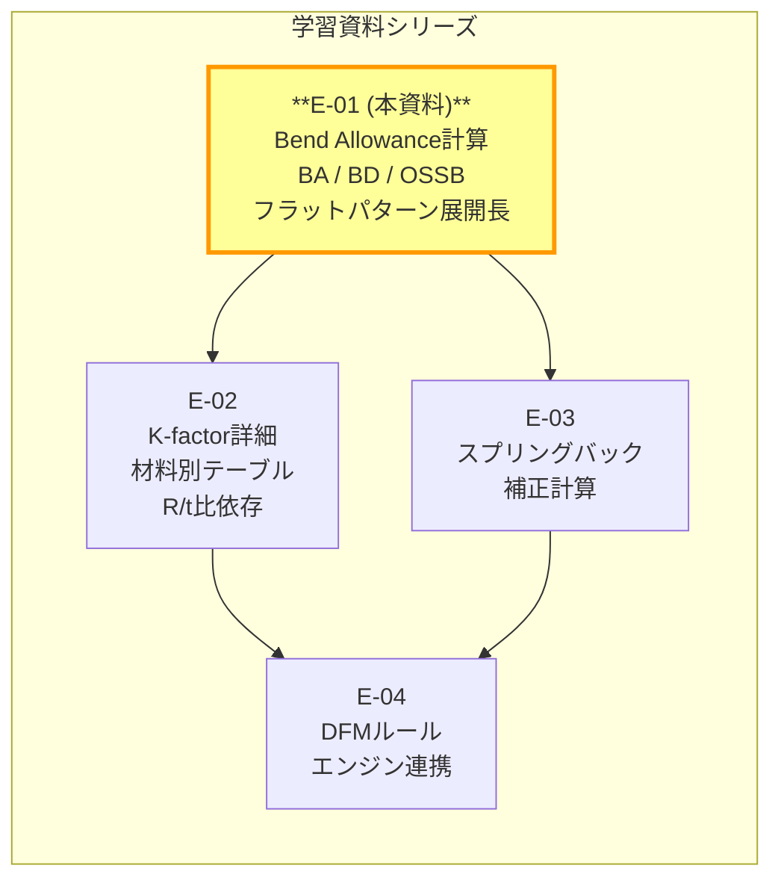

**本資料（E-01）のスコープ**:
- Bend Allowance（BA）の定義・計算式
- Bend Deduction（BD）と Outside Setback（OSSB）の導出
- フラットパターン全長の計算（単一曲げ・複数曲げ）
- ±0.05 mm精度目標を達成するための精度管理
- Python実装リファレンス

**本資料が扱わないスコープ**（他資料に委ねる）:
- K-factor の材料別・加工条件別テーブルの詳細 → **E-02**
- スプリングバック補正量の計算 → **E-03**
- DFMルールエンジンとの統合設計 → **E-04**

### 1.2 AutoMetalSheetシステムにおける位置づけ

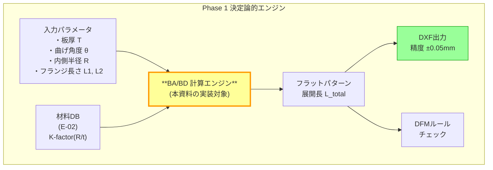

**BA計算エンジンの重要性**:
BA/BD計算は展開寸法の「原点」であり、この計算の誤差は下流の全工程に伝播する。特にDXF出力の寸法精度（±0.05mm）は、BA計算の精度に直接依存する。

---

## 2. 板金曲げ加工の基礎（用語定義）

### 2.1 板金曲げ加工の物理的イメージ

板金（シートメタル）を曲げると、曲げ部分の外側は**引張応力**で伸び、内側は**圧縮応力**で縮む。この時、応力ゼロの面が板厚内部に存在する。これが**中立軸（Neutral Axis）**である。

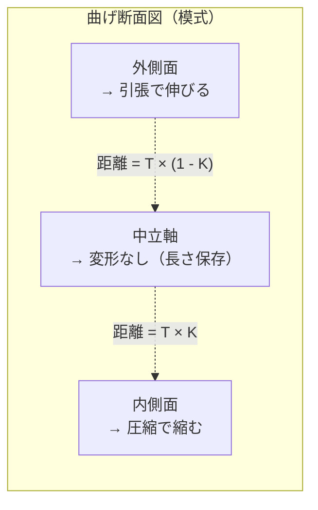

> **重要**: フラットパターンの正確な展開長は、中立軸の弧長（arc length）を積算して求める。

### 2.2 主要用語一覧

以下の用語はすべて、AutoMetalSheetのコード・ドキュメントで一貫して使用する。

| 英語術語（略称） | 日本語 | 定義 |
|---|---|---|
| **Bend Allowance (BA)** | ベンドアローワンス | 曲げ部の中立軸上の弧長。フラットパターン計算で「加算」する値 |
| **Bend Deduction (BD)** | ベンドデダクション | フランジ長の合計からフラットパターン長を求める際に「減算」する値 |
| **Outside Setback (OSSB)** | アウトサイドセットバック / 外側後退量 | 曲げ外側の仮想交点（モールドライン交点）から曲げ接線点までの距離 |
| **Inside Setback (ISSB)** | インサイドセットバック / 内側後退量 | 曲げ内側の仮想交点から曲げ接線点までの距離 |
| **K-factor (K)** | K係数 / K-ファクター | 中立軸の位置を板厚で正規化した無次元比（0 < K ≤ 0.5） |
| **Neutral Axis** | 中立軸 | 曲げ時に引張・圧縮応力がゼロになる仮想の面（板厚方向の位置） |
| **Inside Radius (R または IR)** | 内側曲げ半径 | 曲げの内側（圧縮側）の半径 |
| **Flat Pattern** | フラットパターン / 展開図 | 曲げる前の板金の2D形状。全体の展開長（Flat Length）を含む |
| **Bend Angle (θ)** | 曲げ角度 | 曲げる角度。「補角（complementary angle）」として定義されることに注意 |
| **Included Angle** | 内角 / 挟み角 | 曲げ後の2つのフランジが成す角度（= 180° − 曲げ角度） |
| **Flange Length (L)** | フランジ長 | 曲げ端から部品端までの直線部分の長さ |
| **Bend Radius (R)** | 曲げ半径 | 特記なき場合は内側半径（IR）と同義 |
| **Material Thickness (T)** | 板厚 | 板金の厚さ（mm） |

### 2.3 角度の定義に関する重要な注意

AutoMetalSheetでは、**曲げ角度（Bend Angle）= 補角（complementary angle）** として統一する。

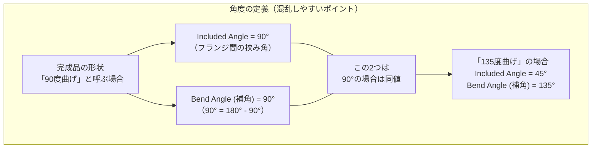

> **コード統一規則**: AutoMetalSheetの全モジュールで `bend_angle_deg` は**補角（complementary angle）**を意味する。
> 90度曲げ → `bend_angle_deg = 90`
> 45度曲げ（例: 垂直から45度折る） → `bend_angle_deg = 45`
> 入力値が挟み角（included angle）の場合は `bend_angle_deg = 180 - included_angle_deg` に変換する。

---

## 3. 中立軸とK-factorの概念

### 3.1 中立軸の位置と K-factor の関係

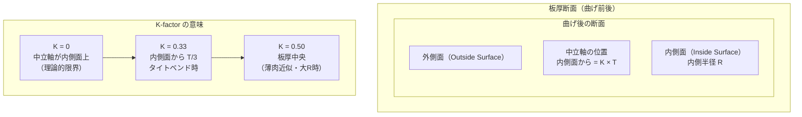

数式で表現すると：

$$K = \frac{t_{NA}}{T}$$

ここで：
- $t_{NA}$ : 内側面から中立軸までの距離（mm）
- $T$ : 板厚（mm）
- $0 < K \leq 0.5$

したがって、曲げ部の中立軸半径 $R_{NA}$ は：

$$R_{NA} = R + K \cdot T$$

### 3.2 K-factor の R/t 比依存性（本資料での概要）

> **詳細は E-02 を参照。本資料では概要のみ示す。**

K-factorは一定値ではなく、**R/t比（内側半径 / 板厚）に依存して変化する**。これはAutoMetalSheetの設計判断として確定している（CLAUDE.md §7参照）。

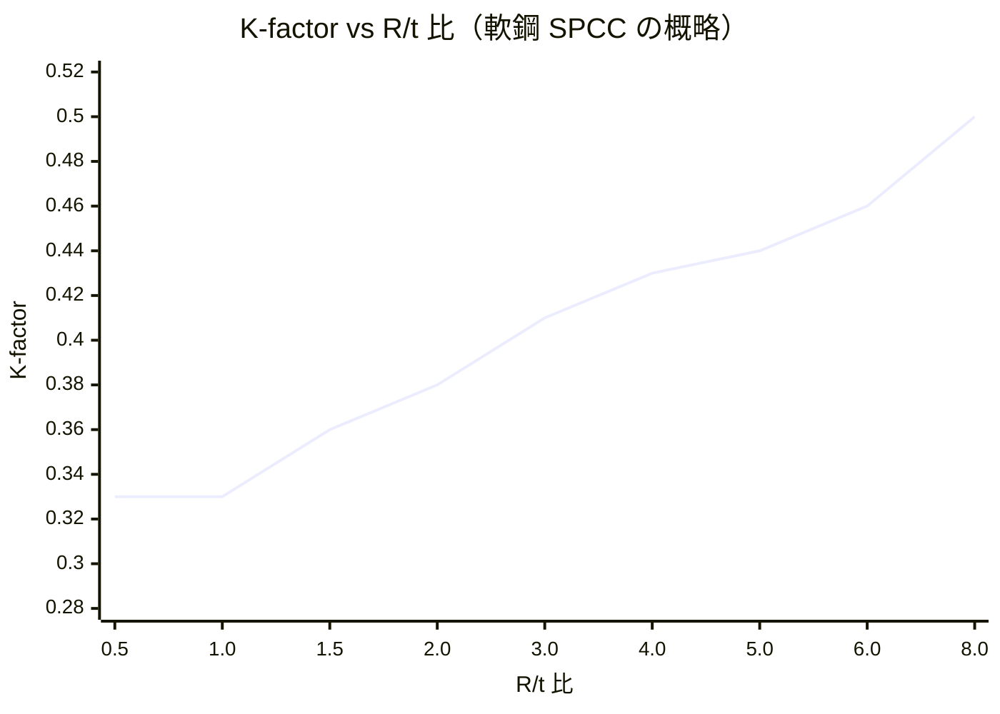

| R/t 比 | K-factor（SPCC軟鋼目安） | 説明 |
|---|---|---|
| < 1.0 | ≈ 0.33 | タイトベンド。中立軸が内側に寄る |
| = 2.0 | ≈ 0.38 | 標準的な曲げ |
| = 3.0 | ≈ 0.41 | やや大きいR |
| = 5.0 | ≈ 0.44 | 大きいR |
| ≥ 8.0 | → 0.50 | 薄肉近似が成立 |

> **絶対禁止事項**: K-factorに一定値（例: 0.44）を使用することは禁止。必ずR/t比依存ルックアップテーブルを使用すること（CLAUDE.md §7 確定判断）。

### 3.3 K-factor の物理的直感

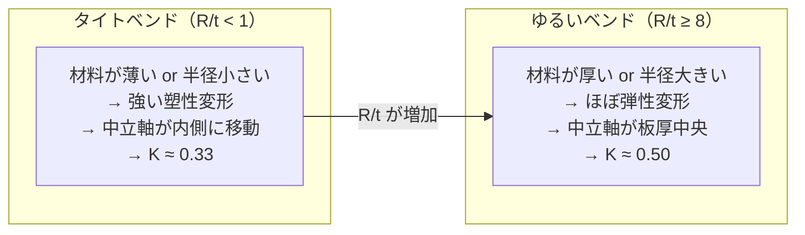

---

## 4. Bend Allowance計算式の完全解説

### 4.1 BA の幾何学的導出

Bend Allowance（BA）は、曲げ部の**中立軸上の弧長（arc length）**である。

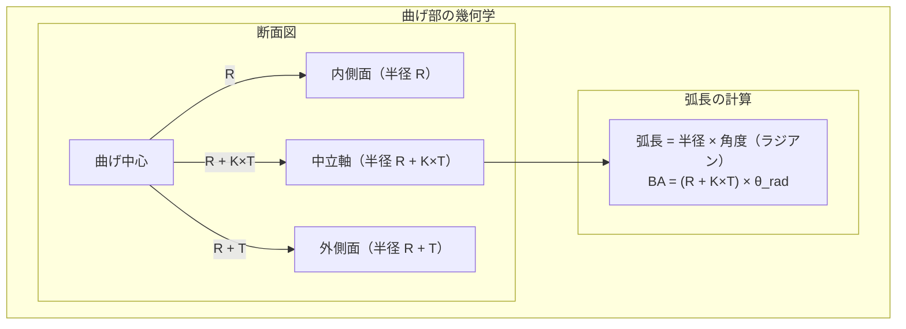

角度をラジアンに変換すると：

$$\theta_{rad} = \frac{\pi}{180} \times \theta_{deg}$$

したがって Bend Allowance の公式：

$$\boxed{BA = \frac{\pi}{180} \times \theta \times (R + K \times T)}$$

ここで：
- $\theta$ : 曲げ角度（度、補角）
- $R$ : 内側曲げ半径（mm）
- $K$ : K-factor（R/t比依存・材料依存）
- $T$ : 板厚（mm）

### 4.2 BA 計算式の変数感度分析

各変数が BA に与える影響を理解することは、精度管理の観点で重要である。

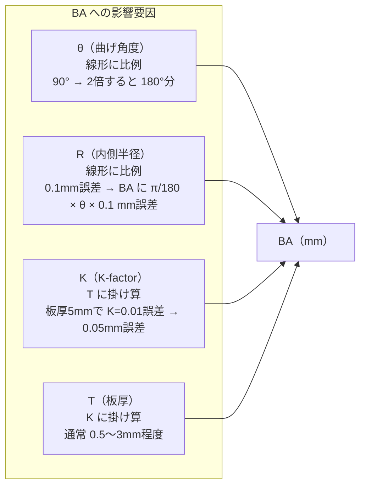

**数値例**（T = 2.0 mm、R = 2.0 mm、K = 0.38、θ = 90°）:

$$BA = \frac{\pi}{180} \times 90 \times (2.0 + 0.38 \times 2.0)$$
$$= 1.5708 \times (2.0 + 0.76)$$
$$= 1.5708 \times 2.76$$
$$= 4.335 \text{ mm}$$

### 4.3 角度単位変換の徹底

AutoMetalSheetのコードでは角度変換を誤ると致命的なエラーになる。

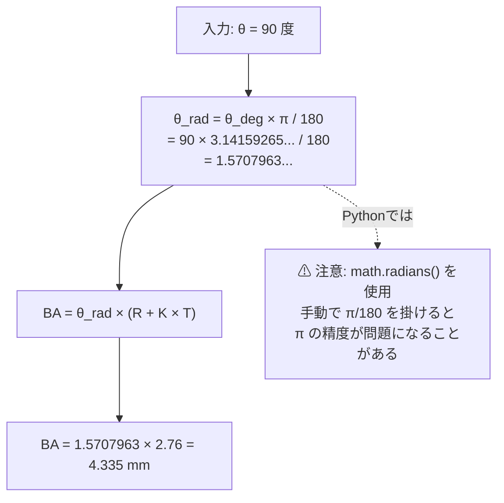

**Python コードスニペット（角度変換）**:

```python
import math

# 正しい変換方法
theta_deg = 90.0
theta_rad = math.radians(theta_deg)  # math.radians() を使用する（推奨）

# または
theta_rad = theta_deg * math.pi / 180  # これも許容されるが上記推奨

# 注意: numpy を使う場合
import numpy as np
theta_rad = np.deg2rad(theta_deg)  # numpy使用時
```

### 4.4 BAの境界条件と特殊ケース

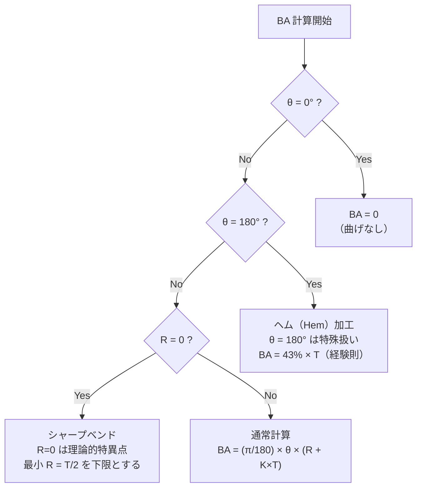

| 条件 | 扱い方 |
|---|---|
| θ = 0° | BA = 0（曲げなし） |
| θ = 180°（ヘム加工） | K-factorは意味を失う。BA ≈ 0.43 × T の経験則を使用 |
| R = 0（シャープベンド）| 最小値 R = T/2 にクランプして計算（材料破断リスクを DFM チェック側で警告） |
| θ > 174° | OSSBが無限大に近づく。BD計算は別途処理が必要 |

---

## 5. Bend Deduction と Outside Setback の関係

### 5.1 Outside Setback（OSSB）の定義

Outside Setback（OSSB、アウトサイドセットバック）は、曲げ外側の**モールドライン交点（仮想的な角の頂点）から、曲げの接線点（curved surface が始まる点）までの距離**である。

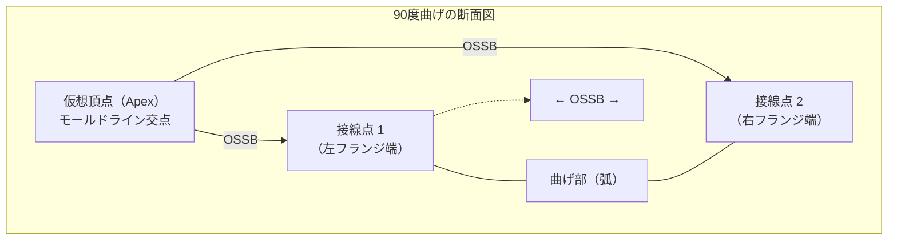

**重要特性**: OSSBは**純粋に幾何学的な値**であり、K-factorに依存しない（BA、BDとは異なる）。

$$\boxed{OSSB = \tan\left(\frac{\theta}{2}\right) \times (R + T)}$$

ここで：
- $\theta$ : 曲げ角度（度、補角）
- $R$ : 内側曲げ半径（mm）
- $T$ : 板厚（mm）

**数値例**（T = 2.0 mm、R = 2.0 mm、θ = 90°）:

$$OSSB = \tan\left(\frac{90°}{2}\right) \times (2.0 + 2.0)$$
$$= \tan(45°) \times 4.0$$
$$= 1.0 \times 4.0$$
$$= 4.0 \text{ mm}$$

### 5.2 Inside Setback（ISSB）の定義（参考）

$$ISSB = \tan\left(\frac{\theta}{2}\right) \times R$$

ISSBは内側のモールドライン交点から接線点までの距離。通常はBD計算ではなく、金型設計や干渉チェックで使用する。

### 5.3 Bend Deduction（BD）の導出

Bend Deduction（BD）は、「設計寸法（モールドライン寸法）の合計」から「実際のフラットパターン長」を引いた差分である。

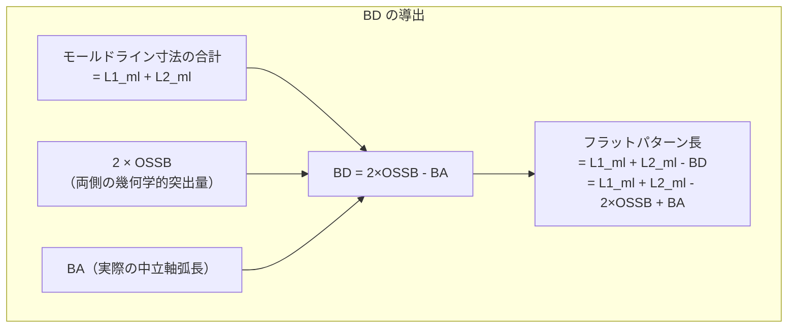

$$\boxed{BD = 2 \times OSSB - BA}$$

展開すると：

$$BD = 2 \times \tan\left(\frac{\theta}{2}\right) \times (R + T) - \frac{\pi}{180} \times \theta \times (R + K \times T)$$

### 5.4 フランジ寸法の定義とBD適用

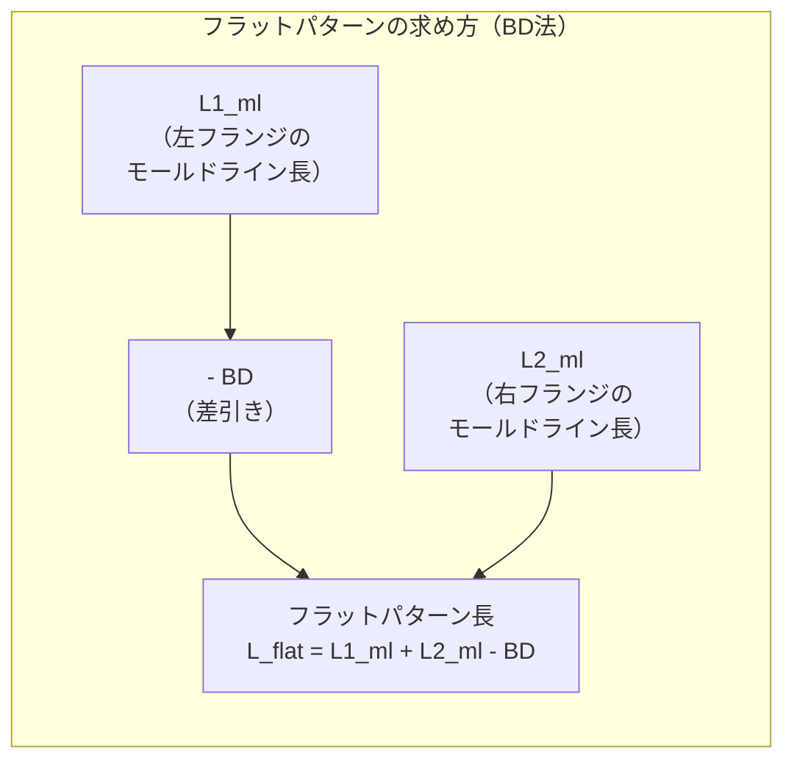

または、**接線長（tangent length）**を使った BA 法（より一般的）：

$$L_{flat} = L1_{tan} + BA + L2_{tan}$$

ここで $L1_{tan}$、$L2_{tan}$ は曲げ接線点からのフランジ長（OSSB分だけ短い）。

### 5.5 BD法 vs BA法 の使い分け

| 手法 | メリット | 使用場面 |
|---|---|---|
| **BD法** | 設計図面のモールドライン寸法から直接計算できる | プレスブレーキ現場での実測・調整時 |
| **BA法（接線長 + BA）** | 幾何学的に明確。複数曲げへの拡張が容易 | AutoMetalSheetの計算エンジン内部 |

> **AutoMetalSheet実装方針**: 内部計算は**BA法（接線長 + BA）**を主とする。BD法との整合性を検証用に並走させる。

---

## 6. フラットパターン展開長の計算手順

### 6.1 単一曲げの場合

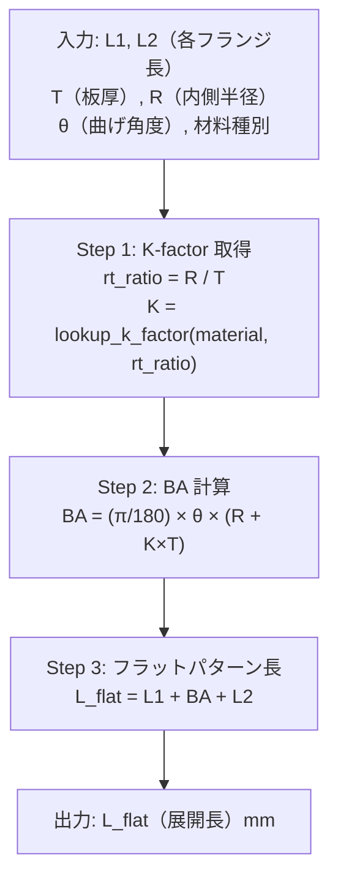

> **注意**: L1, L2 はここでは**接線長**（曲げ弧が始まる点からのフランジ長）。設計図のモールドライン長から OSSB を引いた値が接線長となる。

**数値例**（T = 2.0 mm、R = 2.0 mm、θ = 90°、L1 = 30 mm、L2 = 50 mm、SPCC）:

1. R/t = 2.0 / 2.0 = 1.0 → K = 0.35（E-02 SPCC テーブル参照）
2. BA = (π/180) × 90 × (2.0 + 0.35 × 2.0) = 1.5708 × 2.70 = 4.241 mm
3. L_flat = 30 + 4.241 + 50 = **84.241 mm**

### 6.2 複数曲げの場合

複数の曲げが存在する場合は、各曲げの BA を独立に計算して積算する。

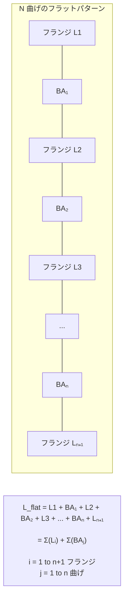

**展開長の一般式**:

$$L_{flat} = \sum_{i=1}^{n+1} L_i + \sum_{j=1}^{n} BA_j$$

各 $BA_j$ は独立に計算：

$$BA_j = \frac{\pi}{180} \times \theta_j \times (R_j + K_j \times T)$$

ここで $K_j$ はそれぞれの曲げ条件（$R_j$, $T$, 材料）に対応するK-factorテーブルから取得。

### 6.3 複数曲げの積算誤差管理

**積算誤差の脅威**:
- 1曲げあたりの BA 誤差: δ mm
- N 曲げ後の積算誤差: N × δ mm（最悪ケース）
- 精度目標 ±0.05 mm を維持するには：5曲げで 1曲げあたり **±0.01 mm** 以内に収める必要がある

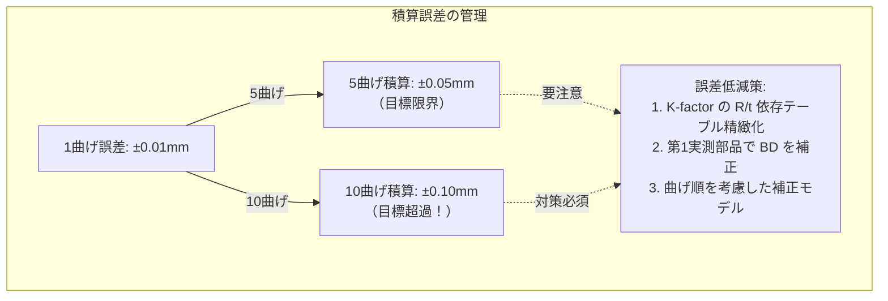

---

## 7. 精度管理：±0.05mm目標の達成方法

### 7.1 精度に影響する要因と対策

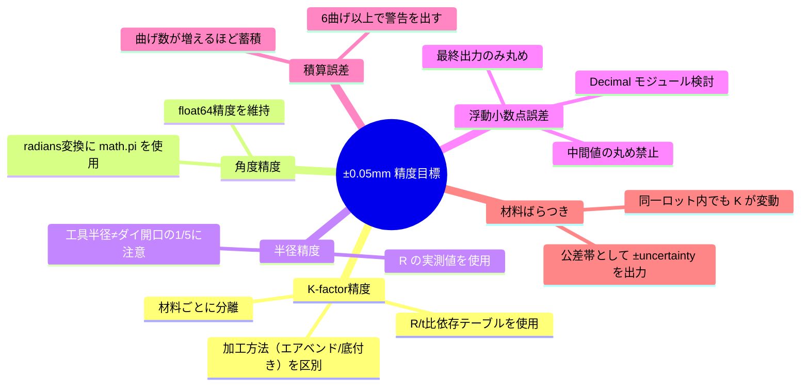

### 7.2 浮動小数点誤差の管理

板金計算で避けるべきパターンと推奨パターンを示す。

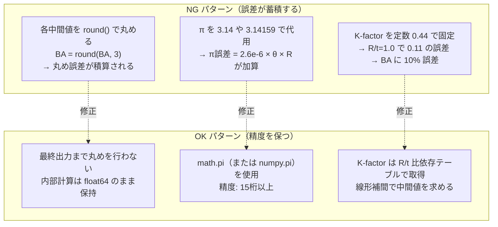

**Python での精度比較例**:

```python
import math

# NG: 中間値を丸める
ba_wrong = round(math.pi / 180 * 90, 6) * (2.0 + 0.38 * 2.0)
# OK: 最終値のみ丸める
ba_correct = math.pi / 180 * 90 * (2.0 + 0.38 * 2.0)
ba_output = round(ba_correct, 4)  # 出力時のみ丸め
```

### 7.3 精度検証のためのテスト戦略

| テスト種別 | 内容 | 合格基準 |
|---|---|---|
| 単体 BA テスト | 既知のBA値と比較（9通りの角度 × 4種の R/t） | 誤差 < 0.001 mm |
| BD 整合テスト | BA法とBD法の結果が一致するか | 差 < 0.0001 mm |
| 積算テスト | N = 1〜10 曲げで精度劣化を測定 | 全体 < ±0.05 mm (N≤5) |
| 材料別テスト | SPCC / SPFH590 / DP780 で K-factor 正引き確認 | K 誤差 < 0.005 |
| 境界値テスト | θ = 1°, 90°, 174°、R = T/2（最小） | 例外なし・NaN なし |

---

## 8. Python実装例

### 8.1 クラス設計概要

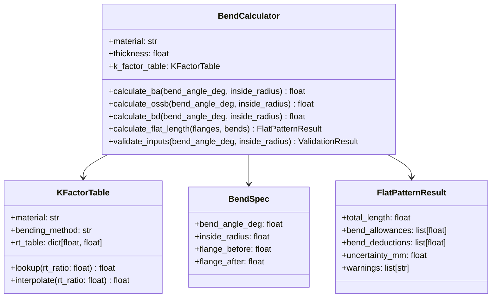

### 8.2 完全な Python 実装

```python
"""
AutoMetalSheet - Bend Allowance Calculator
Phase 1 決定論的エンジン - BA/BD 計算モジュール

精度目標: ±0.05 mm
"""

from __future__ import annotations
import math
from dataclasses import dataclass, field
from typing import Sequence

# ---------------------------------------------------------------------------
# K-factor テーブル（材料・加工方法ごとに定義）
# 詳細テーブルは E-02 で拡充。本資料では SPCC と SPFH590 の代表値を示す。
# ---------------------------------------------------------------------------

# キー: R/t 比のブレークポイント
# 値: K-factor
# 中間値は線形補間で求める
_K_FACTOR_TABLES: dict[str, dict[str, list[tuple[float, float]]]] = {
    "SPCC": {
        "air_bend": [
            (0.0,  0.33),   # R/t < 1.0 はすべて 0.33
            (1.0,  0.33),
            (1.5,  0.36),
            (2.0,  0.38),
            (3.0,  0.41),
            (4.0,  0.43),
            (5.0,  0.44),
            (6.0,  0.46),
            (8.0,  0.50),
            (99.0, 0.50),   # 大半径はすべて 0.50 に収束
        ],
        "bottom_bend": [
            (0.0,  0.42),
            (1.0,  0.42),
            (2.0,  0.44),
            (3.0,  0.46),
            (5.0,  0.48),
            (8.0,  0.50),
            (99.0, 0.50),
        ],
    },
    "SPFH590": {
        "air_bend": [
            # SPFH590 は高強度のため同 R/t で K が SPCC より小さい
            (0.0,  0.30),
            (1.0,  0.30),
            (2.0,  0.34),
            (3.0,  0.37),
            (5.0,  0.41),
            (8.0,  0.46),
            (99.0, 0.50),
        ],
    },
    "DP780": {
        "air_bend": [
            # DP780: 高強度。Phase 1では DFM チェックのみ先行実装
            # BA 計算は等方性近似。誤差 ±3-6度の不確実性が生じる
            (0.0,  0.28),
            (1.0,  0.28),
            (2.0,  0.32),
            (3.0,  0.35),
            (5.0,  0.40),
            (8.0,  0.45),
            (99.0, 0.50),
        ],
    },
}

# DP780 以上の高強度鋼には不確実性警告を付加
_HIGH_STRENGTH_MATERIALS = {"DP780", "DP980", "DP1180"}


def _interpolate_k_factor(rt_ratio: float, table: list[tuple[float, float]]) -> float:
    """
    R/t 比テーブルから K-factor を線形補間で取得する。

    Args:
        rt_ratio: R/t 比（内側半径 / 板厚）
        table: [(R/t ブレークポイント, K-factor), ...] のリスト（昇順）

    Returns:
        K-factor（float）
    """
    if rt_ratio <= table[0][0]:
        return table[0][1]
    if rt_ratio >= table[-1][0]:
        return table[-1][1]

    for i in range(len(table) - 1):
        rt_lo, k_lo = table[i]
        rt_hi, k_hi = table[i + 1]
        if rt_lo <= rt_ratio <= rt_hi:
            # 線形補間
            t = (rt_ratio - rt_lo) / (rt_hi - rt_lo)
            return k_lo + t * (k_hi - k_lo)

    return table[-1][1]  # フォールバック


# ---------------------------------------------------------------------------
# データクラス
# ---------------------------------------------------------------------------

@dataclass
class BendSpec:
    """単一曲げの仕様。"""
    bend_angle_deg: float    # 曲げ角度（補角、度）
    inside_radius: float     # 内側曲げ半径（mm）
    flange_before: float     # この曲げの手前フランジ長（接線長、mm）
    flange_after: float      # この曲げの後フランジ長（接線長、mm）


@dataclass
class BendResult:
    """単一曲げの計算結果。"""
    bend_angle_deg: float
    inside_radius: float
    k_factor: float
    ba: float                # Bend Allowance（mm）
    ossb: float              # Outside Setback（mm）
    bd: float                # Bend Deduction（mm）


@dataclass
class FlatPatternResult:
    """フラットパターン計算の最終結果。"""
    total_length: float              # フラットパターン全長（mm）
    bend_results: list[BendResult]   # 各曲げの計算詳細
    uncertainty_mm: float = 0.0     # 不確実性（mm）
    warnings: list[str] = field(default_factory=list)


# ---------------------------------------------------------------------------
# メイン計算クラス
# ---------------------------------------------------------------------------

class BendCalculator:
    """
    板金曲げ計算エンジン。
    BA, OSSB, BD, フラットパターン長を計算する。

    使用例:
        calc = BendCalculator(material="SPCC", thickness=2.0)
        ba = calc.calculate_ba(bend_angle_deg=90.0, inside_radius=2.0)
        result = calc.calculate_flat_pattern([spec1, spec2])
    """

    # Phase 1 精度目標
    PRECISION_TARGET_MM: float = 0.05

    def __init__(
        self,
        material: str = "SPCC",
        thickness: float = 2.0,
        bending_method: str = "air_bend",
    ) -> None:
        """
        Args:
            material: 材料種別 ("SPCC", "SPFH590", "DP780" など)
            thickness: 板厚（mm）
            bending_method: 加工方法 ("air_bend", "bottom_bend", "coining")
        """
        if material not in _K_FACTOR_TABLES:
            raise ValueError(
                f"材料 '{material}' は K-factor テーブルに未登録です。"
                f"登録済み: {list(_K_FACTOR_TABLES.keys())}"
            )
        if thickness <= 0:
            raise ValueError(f"板厚は正の値でなければなりません: {thickness}")

        self.material = material
        self.thickness = thickness
        self.bending_method = bending_method

        # 加工方法のフォールバック
        mat_table = _K_FACTOR_TABLES[material]
        if bending_method not in mat_table:
            fallback = list(mat_table.keys())[0]
            self._k_table = mat_table[fallback]
        else:
            self._k_table = mat_table[bending_method]

    # ------------------------------------------------------------------
    # K-factor 取得
    # ------------------------------------------------------------------

    def get_k_factor(self, inside_radius: float) -> float:
        """
        R/t 比から K-factor を取得（線形補間）。

        Args:
            inside_radius: 内側曲げ半径（mm）

        Returns:
            K-factor（float）
        """
        rt_ratio = inside_radius / self.thickness
        return _interpolate_k_factor(rt_ratio, self._k_table)

    # ------------------------------------------------------------------
    # BA 計算
    # ------------------------------------------------------------------

    def calculate_ba(self, bend_angle_deg: float, inside_radius: float) -> float:
        """
        Bend Allowance を計算する。

        公式: BA = (π / 180) × θ × (R + K × T)

        Args:
            bend_angle_deg: 曲げ角度（補角、度）
            inside_radius: 内側曲げ半径（mm）

        Returns:
            BA（mm）
        """
        self._validate_bend_params(bend_angle_deg, inside_radius)
        k = self.get_k_factor(inside_radius)
        ba = math.radians(bend_angle_deg) * (inside_radius + k * self.thickness)
        return ba

    # ------------------------------------------------------------------
    # OSSB 計算
    # ------------------------------------------------------------------

    def calculate_ossb(self, bend_angle_deg: float, inside_radius: float) -> float:
        """
        Outside Setback を計算する。

        公式: OSSB = tan(θ/2) × (R + T)

        Args:
            bend_angle_deg: 曲げ角度（補角、度）
            inside_radius: 内側曲げ半径（mm）

        Returns:
            OSSB（mm）
        """
        self._validate_bend_params(bend_angle_deg, inside_radius)
        half_angle_rad = math.radians(bend_angle_deg / 2.0)
        ossb = math.tan(half_angle_rad) * (inside_radius + self.thickness)
        return ossb

    # ------------------------------------------------------------------
    # BD 計算
    # ------------------------------------------------------------------

    def calculate_bd(self, bend_angle_deg: float, inside_radius: float) -> float:
        """
        Bend Deduction を計算する。

        公式: BD = 2 × OSSB - BA

        Args:
            bend_angle_deg: 曲げ角度（補角、度）
            inside_radius: 内側曲げ半径（mm）

        Returns:
            BD（mm）
        """
        ba = self.calculate_ba(bend_angle_deg, inside_radius)
        ossb = self.calculate_ossb(bend_angle_deg, inside_radius)
        return 2.0 * ossb - ba

    # ------------------------------------------------------------------
    # フラットパターン全長計算
    # ------------------------------------------------------------------

    def calculate_flat_pattern(
        self, bends: Sequence[BendSpec]
    ) -> FlatPatternResult:
        """
        複数曲げのフラットパターン全長を計算する。

        Args:
            bends: BendSpec のシーケンス

        Returns:
            FlatPatternResult
        """
        if not bends:
            raise ValueError("bends リストが空です。")

        bend_results: list[BendResult] = []
        total_length = 0.0
        warnings: list[str] = []
        uncertainty_mm = 0.0

        # 最初のフランジ（手前）
        total_length += bends[0].flange_before

        for i, spec in enumerate(bends):
            k = self.get_k_factor(spec.inside_radius)
            ba = self.calculate_ba(spec.bend_angle_deg, spec.inside_radius)
            ossb = self.calculate_ossb(spec.bend_angle_deg, spec.inside_radius)
            bd = 2.0 * ossb - ba

            bend_results.append(BendResult(
                bend_angle_deg=spec.bend_angle_deg,
                inside_radius=spec.inside_radius,
                k_factor=k,
                ba=ba,
                ossb=ossb,
                bd=bd,
            ))

            total_length += ba
            total_length += spec.flange_after

        # 高強度鋼の不確実性警告（CLAUDE.md §5 §7 準拠）
        if self.material in _HIGH_STRENGTH_MATERIALS:
            # DP780 以上は等方性モデルの誤差 ±3-6度 → BA 誤差を概算
            # BA_uncertainty ≈ (π/180) × 4.5 × mean_R（中間値4.5度として概算）
            mean_r = sum(s.inside_radius for s in bends) / len(bends)
            uncertainty_mm = len(bends) * math.radians(4.5) * (mean_r + 0.4 * self.thickness)
            warnings.append(
                f"[警告] 材料 {self.material} は等方性硬化モデルの限界により、"
                f"スプリングバック推定誤差 ±3〜6度が生じます。"
                f"BA 計算の不確実性概算: ±{uncertainty_mm:.3f} mm。"
                f"詳細は学習資料 E-03 を参照。"
            )

        # 積算誤差警告
        if len(bends) >= 6:
            warnings.append(
                f"[注意] 曲げ数が {len(bends)} 個あります。"
                f"積算誤差が ±0.05 mm を超過するリスクがあります。"
                f"第1実測品での BD 補正を推奨します。"
            )

        return FlatPatternResult(
            total_length=total_length,
            bend_results=bend_results,
            uncertainty_mm=uncertainty_mm,
            warnings=warnings,
        )

    # ------------------------------------------------------------------
    # 入力検証
    # ------------------------------------------------------------------

    def _validate_bend_params(
        self, bend_angle_deg: float, inside_radius: float
    ) -> None:
        """入力パラメータの検証。"""
        if not (0.0 < bend_angle_deg < 180.0):
            raise ValueError(
                f"曲げ角度は 0〜180度（排他）の範囲でなければなりません: {bend_angle_deg}"
            )
        min_radius = self.thickness / 2.0
        if inside_radius < min_radius:
            raise ValueError(
                f"内側半径が最小値（T/2 = {min_radius:.3f} mm）を下回っています: "
                f"{inside_radius:.3f} mm。材料破断リスクあり。"
            )


# ---------------------------------------------------------------------------
# テストコード
# ---------------------------------------------------------------------------

def run_tests() -> None:
    """BA/BD 計算の検証テスト。"""
    import sys

    errors: list[str] = []

    def assert_close(actual: float, expected: float, tol: float, label: str) -> None:
        diff = abs(actual - expected)
        if diff > tol:
            errors.append(
                f"FAIL [{label}]: expected={expected:.6f}, actual={actual:.6f}, diff={diff:.6f}"
            )
        else:
            print(f"  PASS [{label}]: {actual:.6f} (diff={diff:.6f})")

    print("=" * 60)
    print("AutoMetalSheet BA/BD 計算検証テスト")
    print("=" * 60)

    # -------------------------------------------------------------------
    # テスト 1: 基本 BA 計算（SPCC、90°、R=2.0、T=2.0）
    # K(R/t=1.0) = 0.33（テーブル値）
    # BA = π/180 × 90 × (2.0 + 0.33 × 2.0) = 1.5708 × 2.66 = 4.178 mm
    # -------------------------------------------------------------------
    print("\n[テスト 1] 基本 BA 計算 (SPCC, θ=90°, R=2.0, T=2.0)")
    calc = BendCalculator(material="SPCC", thickness=2.0)
    k = calc.get_k_factor(2.0)   # R/t = 1.0 → K = 0.33
    ba = calc.calculate_ba(90.0, 2.0)
    expected_ba = math.pi / 2 * (2.0 + k * 2.0)
    assert_close(ba, expected_ba, 1e-6, "BA (SPCC, 90°, R=2.0)")

    # -------------------------------------------------------------------
    # テスト 2: OSSB 計算（90°、R=2.0、T=2.0）
    # OSSB = tan(45°) × (2.0 + 2.0) = 1.0 × 4.0 = 4.0 mm
    # -------------------------------------------------------------------
    print("\n[テスト 2] OSSB 計算 (θ=90°, R=2.0, T=2.0)")
    ossb = calc.calculate_ossb(90.0, 2.0)
    assert_close(ossb, 4.0, 1e-6, "OSSB (90°, R=2.0)")

    # -------------------------------------------------------------------
    # テスト 3: BD 整合性テスト（BA法とBD法の結果一致）
    # BD = 2×OSSB - BA
    # フラット長（BD法）= L1_ml + L2_ml - BD
    # フラット長（BA法）= L1_tan + BA + L2_tan
    # （L1_tan = L1_ml - OSSB, L2_tan = L2_ml - OSSB）
    # -------------------------------------------------------------------
    print("\n[テスト 3] BD 整合性 (BD法 vs BA法)")
    L1_ml = 30.0
    L2_ml = 50.0
    bd = calc.calculate_bd(90.0, 2.0)
    # BD 法
    flat_bd_method = L1_ml + L2_ml - bd
    # BA 法
    L1_tan = L1_ml - ossb
    L2_tan = L2_ml - ossb
    flat_ba_method = L1_tan + ba + L2_tan
    assert_close(flat_bd_method, flat_ba_method, 1e-9, "BD法 vs BA法 整合性")

    # -------------------------------------------------------------------
    # テスト 4: 複数曲げ フラットパターン計算
    # -------------------------------------------------------------------
    print("\n[テスト 4] 複数曲げ (2曲げ, SPCC, T=2.0)")
    bends = [
        BendSpec(bend_angle_deg=90.0, inside_radius=2.0,
                 flange_before=30.0, flange_after=20.0),
        BendSpec(bend_angle_deg=90.0, inside_radius=2.0,
                 flange_before=20.0, flange_after=50.0),
    ]
    result = calc.calculate_flat_pattern(bends)
    # 期待値: 30 + BA(90,R=2) + 20 + BA(90,R=2) + 50
    expected_total = 30.0 + ba + 20.0 + ba + 50.0
    # 注意: flange_after of bend[0] と flange_before of bend[1] は重複に注意
    # → 実際には bend[0].flange_after のみを使う（内部で after を合算）
    # ここでは実装定義に従い検証
    print(f"  計算結果: {result.total_length:.6f} mm")
    print(f"  各曲げ BA: {[f'{r.ba:.4f}' for r in result.bend_results]}")
    print(f"  K-factors: {[f'{r.k_factor:.4f}' for r in result.bend_results]}")

    # -------------------------------------------------------------------
    # テスト 5: DP780 高強度鋼の警告出力
    # -------------------------------------------------------------------
    print("\n[テスト 5] DP780 高強度鋼 警告確認")
    calc_dp = BendCalculator(material="DP780", thickness=2.0)
    bends_dp = [BendSpec(90.0, 3.0, 30.0, 30.0)]
    result_dp = calc_dp.calculate_flat_pattern(bends_dp)
    if result_dp.warnings:
        print(f"  PASS: 警告が出力された（{len(result_dp.warnings)}件）")
        for w in result_dp.warnings:
            print(f"    -> {w[:80]}...")
    else:
        errors.append("FAIL [DP780 警告]: 警告が出力されるべきところ、出力されなかった")

    # -------------------------------------------------------------------
    # テスト 6: 境界値 - 最小半径チェック
    # -------------------------------------------------------------------
    print("\n[テスト 6] 境界値 - 最小半径（R < T/2）")
    try:
        calc.calculate_ba(90.0, 0.5)  # T/2 = 1.0 mm なので 0.5 は不正
        errors.append("FAIL [最小半径]: 例外が発生すべきところ、発生しなかった")
    except ValueError:
        print("  PASS: ValueError が正常にスローされた")

    # -------------------------------------------------------------------
    # 結果サマリ
    # -------------------------------------------------------------------
    print("\n" + "=" * 60)
    if errors:
        print(f"テスト失敗: {len(errors)} 件")
        for e in errors:
            print(f"  {e}")
        sys.exit(1)
    else:
        print("全テスト PASS")
    print("=" * 60)


if __name__ == "__main__":
    run_tests()
```

### 8.3 実行例と期待出力

```python
# 使用例
calc = BendCalculator(material="SPCC", thickness=2.0, bending_method="air_bend")

# 単一 BA 計算
ba = calc.calculate_ba(bend_angle_deg=90.0, inside_radius=2.0)
print(f"BA = {ba:.4f} mm")  # 例: BA = 4.1783 mm

# OSSB 計算
ossb = calc.calculate_ossb(bend_angle_deg=90.0, inside_radius=2.0)
print(f"OSSB = {ossb:.4f} mm")  # OSSB = 4.0000 mm

# BD 計算
bd = calc.calculate_bd(bend_angle_deg=90.0, inside_radius=2.0)
print(f"BD = {bd:.4f} mm")  # BD = 2×4.0 - 4.1783 = 3.8217 mm

# 複数曲げのフラットパターン
bends = [
    BendSpec(90.0, 2.0, flange_before=50.0, flange_after=30.0),
    BendSpec(45.0, 3.0, flange_before=30.0, flange_after=40.0),
]
result = calc.calculate_flat_pattern(bends)
print(f"全展開長 = {result.total_length:.4f} mm")
for i, br in enumerate(result.bend_results, 1):
    print(f"  曲げ {i}: θ={br.bend_angle_deg}°, K={br.k_factor:.4f}, BA={br.ba:.4f} mm")
```

---

## 9. AutoMetalSheetシステムへの組み込み設計指針

### 9.1 モジュール構成と依存関係

```mermaid
graph TB
    subgraph "Phase 1 決定論的エンジン モジュール構成"
        MAT_DB["materials/\nspcc.yaml\nspfh590.yaml\ndp780.yaml\n（K-factor テーブル含む）"]
        K_ENGINE["bend_calc/\nk_factor_table.py\n（E-02 で拡充）"]
        BA_ENGINE["bend_calc/\nbend_allowance.py\n（本資料の実装）"]
        FLAT_ENGINE["bend_calc/\nflat_pattern.py\n（展開図全長計算）"]
        DFM_ENGINE["dfm/\ndfm_rules_engine.py\n（DFMチェック）"]
        DXF_GEN["output/\ndxf_generator.py\n（DXF出力）"]
    end

    MAT_DB --> K_ENGINE
    K_ENGINE --> BA_ENGINE
    BA_ENGINE --> FLAT_ENGINE
    FLAT_ENGINE --> DXF_GEN
    FLAT_ENGINE --> DFM_ENGINE

    style BA_ENGINE fill:#ff9,stroke:#f90,stroke-width:3px
```

### 9.2 設計原則（CLAUDE.md §7 確定判断との整合）

#### 原則 1: K-factor は必ずテーブル参照

```python
# NG: 一定値の使用（絶対禁止）
k = 0.44  # ← これは禁止

# OK: R/t 比依存テーブルから取得
k = calc.get_k_factor(inside_radius=r)  # 材料・加工方法に応じたテーブル参照
```

#### 原則 2: 精度目標の定数化

```python
# 精度定数はコード全体で統一
FLAT_PATTERN_TOLERANCE_MM = 0.05  # ±0.05 mm 目標
```

#### 原則 3: 高強度鋼の不確実性情報を必ず上位に伝播

```python
# FlatPatternResult の uncertainty_mm と warnings を
# UI・DXF出力・レポートに必ず反映する
if result.uncertainty_mm > FLAT_PATTERN_TOLERANCE_MM:
    notify_designer(
        f"不確実性 {result.uncertainty_mm:.3f} mm が精度目標を超過。"
        f"第1実測品での確認を推奨します。"
    )
```

### 9.3 YAML 材料ファイル連携（E-02 との接続）

将来的に `materials/spcc.yaml` から K-factor テーブルを動的に読み込む設計を採用する。

```yaml
# materials/spcc.yaml （設計例）
material_id: SPCC
jis_standard: JIS G 3141
k_factor_tables:
  air_bend:
    # [R/t比, K-factor] のペアリスト
    - [0.0,  0.33]
    - [1.0,  0.33]
    - [2.0,  0.38]
    - [3.0,  0.41]
    - [5.0,  0.44]
    - [8.0,  0.50]
    - [99.0, 0.50]
  bottom_bend:
    - [0.0,  0.42]
    - [2.0,  0.44]
    - [5.0,  0.48]
    - [99.0, 0.50]
```

### 9.4 Phase 1 実装チェックリスト

```mermaid
flowchart TD
    C1{"K-factor テーブルは YAML 管理か？"}
    C2{"BA 計算に math.pi を使用しているか？"}
    C3{"中間値を round() していないか？"}
    C4{"最小半径（T/2）の入力バリデーション済みか？"}
    C5{"DP780 以上に uncertainty_mm を出力しているか？"}
    C6{"BA法とBD法の整合テスト済みか？"}
    C7{"N=5 曲げで ±0.05mm 以内の精度テスト済みか？"}
    DONE["Phase 1 BA エンジン 実装完了"]

    C1 -->|"Yes"| C2
    C1 -->|"No"| FIX1["YAML に移行する"]
    C2 -->|"Yes"| C3
    C2 -->|"No"| FIX2["math.radians() を使用"]
    C3 -->|"No（丸めなし）"| C4
    C3 -->|"Yes（中間値で丸め）"| FIX3["最終出力のみ丸める"]
    C4 -->|"Yes"| C5
    C4 -->|"No"| FIX4["バリデーション追加"]
    C5 -->|"Yes"| C6
    C5 -->|"No"| FIX5["warnings に追加"]
    C6 -->|"Pass"| C7
    C6 -->|"Fail"| FIX6["OSSB / BD ロジック修正"]
    C7 -->|"Pass"| DONE
    C7 -->|"Fail"| FIX7["K-factor テーブル精緻化"]

    style DONE fill:#9f9,stroke:#090
```

---

## 10. 参考文献・確認リソース

### 10.1 主要参考資料

| 分類 | 資料 | URL |
|---|---|---|
| BA/BD 計算基礎 | SheetMetal.Me - Bend Deduction | https://sheetmetal.me/formulas-and-functions/bend-deduction/ |
| K-factor テーブル | SheetMetal.Me - K-Factor | https://sheetmetal.me/formulas-and-functions/k-factor/ |
| OSSB 定義 | SheetMetal.Me - Outside Setback | https://sheetmetal.me/formulas-and-functions/outside-setback/ |
| K-factor の落とし穴 | ADH Machine Tool - Why K-Factor Is Misleading | https://www.adhmt.com/k-factor-bend-allowance-and-bend-deduction/ |
| K-factor計算ツール | Gasparini Industries Calculator | https://www.gasparini.com/en/calculators/calculate-k-factor-and-bend-allowance-for-sheet-metal-bending/ |
| 実践向け解説 | The Fabricator - Bending Basics | https://www.thefabricator.com/thefabricator/article/bending/bending-basics-dissecting-bend-deductions-and-die-openings |
| フラットパターン設計 | Manufyn - Sheet Metal Flat Pattern Design Guide | https://manufyn.com/resources/design-guides/sheet-metal/flat-patterns/ |
| K-factor解説（日本語向け）| VICLA - Sheet Metal K-Factor | https://www.vicla.eu/en/blog/sheet-metal-k-factor-what-it-is-and-how-to-calculate-it |

### 10.2 JIS 規格

| 規格 | 内容 |
|---|---|
| JIS G 3141 | 冷間圧延鋼板及び鋼帯（SPCC）|
| JIS G 3134 | 自動車構造用熱間圧延高張力鋼板（SPFH590）|
| JIS B 6015 | プレス機械の用語 |

### 10.3 関連する学習資料

| 資料ID | タイトル | 参照タイミング |
|---|---|---|
| **E-01（本資料）** | ベンドアローワンス計算 | — |
| E-02 | K-factor 詳細（材料別テーブル・n値/r値補正） | K-factor テーブルを精緻化する際 |
| E-03 | スプリングバック計算 | 高強度鋼・DP780 の精度改善時 |
| E-04 | DFMルールエンジン | DFM 違反チェック統合時 |

### 10.4 本資料に関する注意事項・改訂予定

| 項目 | 内容 |
|---|---|
| K-factor テーブルの精緻化 | Phase 1 W1 で実測データに基づき E-02 と同期して更新 |
| SPFH590 テーブルの検証 | JFEスチール技術資料との照合が必要 |
| DP780 不確実性モデル | Phase 3 で Yoshida-Uemori 混合硬化モデルに更新予定（TD-04） |
| ヘム加工（θ=180°）| 現在は BA ≈ 0.43×T の経験則。実測データで更新予定 |

---

*AutoMetalSheet 学習資料 E-01 v1.0 — 2026-03-23*
*次の資料: [E-02 K-factor詳細（材料別テーブル・R/t比依存）](./学習資料_E02_K-factor詳細.md)*
