# 学習資料 E-02: K-factor（中立軸）モデル

**対象システム**: AutoMetalSheet – 板金設計自動化システム
**資料番号**: E-02
**前提資料**: E-01 ベンドアローワンス・ベンドデダクション基礎
**対象読者**: Phase 1 実装担当（機械エンジニア / ソフトウェアエンジニア）
**最終更新**: 2026-03-23
**ステータス**: Phase 1 実装根拠として確定

---

## 目次

1. [この資料の位置づけと E-01 との関係](#1-この資料の位置づけと-e-01-との関係)
2. [K-factor の物理的意味](#2-k-factor-の物理的意味)
3. [なぜ K-factor は一定値ではいけないか](#3-なぜ-k-factor-は一定値ではいけないか)
4. [材料別 K-factor 特性](#4-材料別-k-factor-特性)
5. [JIS 規格との対応](#5-jis-規格との対応)
6. [加工硬化指数 n 値の解説](#6-加工硬化指数-n-値の解説)
7. [塑性異方性係数 r 値の解説](#7-塑性異方性係数-r-値の解説)
8. [n 値・r 値補正係数の実装](#8-n-値r-値補正係数の実装)
9. [量産モード vs 試作モード](#9-量産モード-vs-試作モード)
10. [Python 実装例](#10-python-実装例)
11. [YAML スキーマ設計](#11-yaml-スキーマ設計)
12. [バリデーション設計](#12-バリデーション設計)
13. [AutoMetalSheet への組み込み設計指針](#13-autometalsheet-への組み込み設計指針)
14. [参考文献・JIS 規格入手先](#14-参考文献jis-規格入手先)

---

## 1. この資料の位置づけと E-01 との関係

### 1.1 資料体系における E-02 の役割

```
E-01: ベンドアローワンス (BA) / ベンドデダクション (BD) の基礎式
         │
         │  BA = (π/180) × Angle × (R + K × T)
         │         ↑ここに現れる K が E-02 の主題
         ▼
E-02: K-factor（中立軸モデル） ← 本資料
         │
         │  K = f(R/t, 材料種別, n値, r値, 加工モード)
         │
         ▼
E-03: スプリングバック予測モデル
E-04: 材料データベース設計（YAML スキーマ）
```

E-01 で定義したベンドアローワンス公式において、**K-factor は唯一の「材料・工程依存パラメータ」** である。K の誤差がそのままフラットパターン寸法誤差に直結する。

### 1.2 AutoMetalSheet における K-factor の役割

| 用途 | 関連コンポーネント |
|------|------------------|
| フラットパターン計算 | `BendAllowanceCalculator` |
| DFM 最小曲げ半径チェック | `DFMRuleEngine` |
| INFEASIBLE 早期検出 | `FeasibilityChecker` |
| FreeCAD ヘッドレスパイプライン | `FreeCADAdapter` |

> **設計確定事項 (CLAUDE.md より)**
> 「K-factor は一定値ではなく **R/t 比依存ルックアップテーブル** で実装する（材料ごと）」
> 「**n 値/r 値補正係数**を追加し、量産/試作モードを分離する」

---

## 2. K-factor の物理的意味

### 2.1 用語定義

| 用語（英語） | 用語（日本語） | 定義 |
|-------------|--------------|------|
| K-factor | K ファクター / K 係数 | 中立軸の内面からの距離を板厚で割った無次元比 |
| Neutral Axis | 中立軸 | 曲げ時に引張も圧縮も受けない仮想線 |
| Neutral Surface | 中立面 | 中立軸を板幅方向に伸ばした面 |
| Inside Radius (R) | 内側曲げ半径 | 曲げ内側の曲率半径 |
| Material Thickness (T) | 板厚 | 素材の厚み |
| Neutral Axis Offset (t) | 中立軸オフセット | 内面から中立軸までの距離 |
| R/t ratio | R/t 比 | 内側曲げ半径と板厚の比（無次元） |

### 2.2 K-factor の定義式

$$K = \frac{t_{NA}}{T}$$

ここで：
- $t_{NA}$ : 内面（引張面の反対側）から中立軸までの距離 [mm]
- $T$ : 板厚 [mm]
- $K$ の範囲 : $0 < K \leq 0.5$（理論上の最大値 0.5 は中立軸が板厚中心）

### 2.3 物理的意味の図解

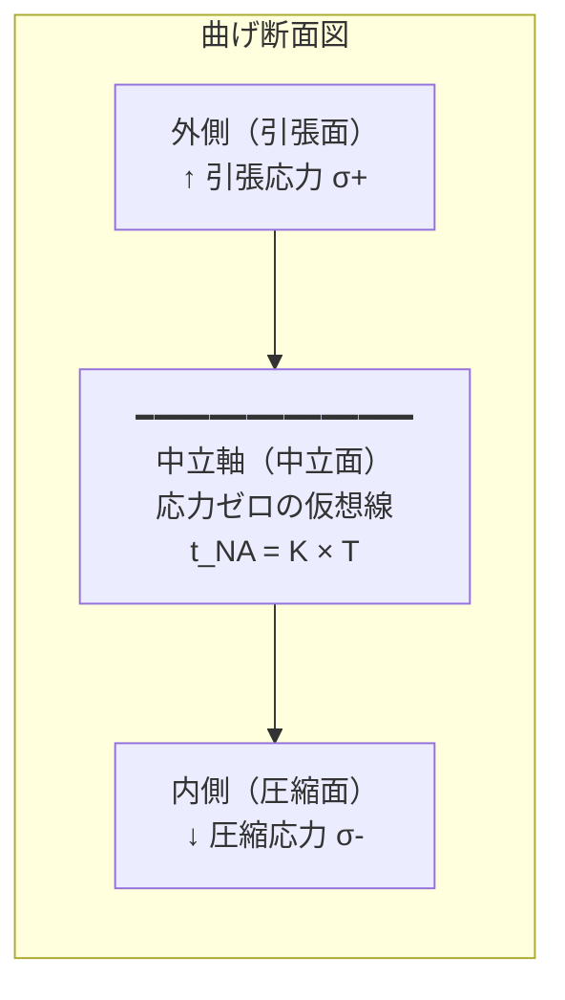

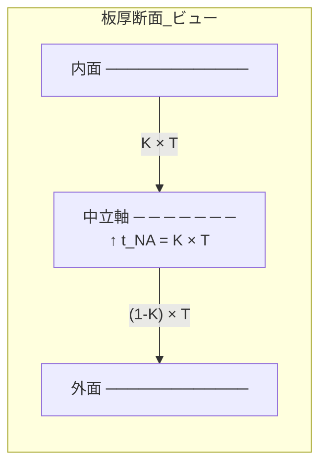

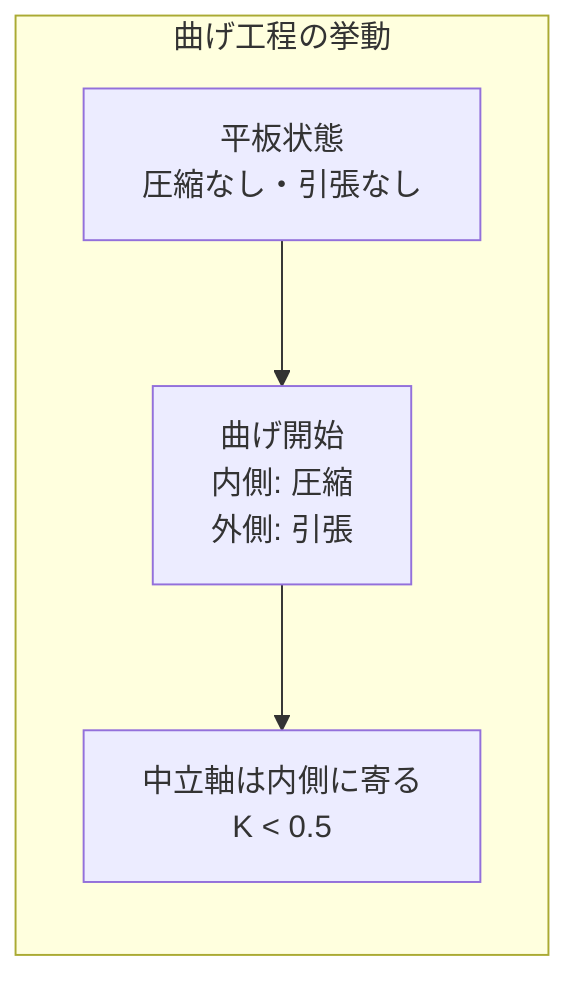

### 2.4 K-factor と R/t 比の定性的関係

$$\text{R/t 比が小さい（急曲げ）} \Rightarrow \text{内側圧縮力が集中} \Rightarrow K \text{ が小さくなる（中立軸が内側へ）}$$

$$\text{R/t 比が大きい（緩曲げ）} \Rightarrow \text{応力が一様分布に近づく} \Rightarrow K \rightarrow 0.5 \text{（中立軸が板厚中心へ）}$$

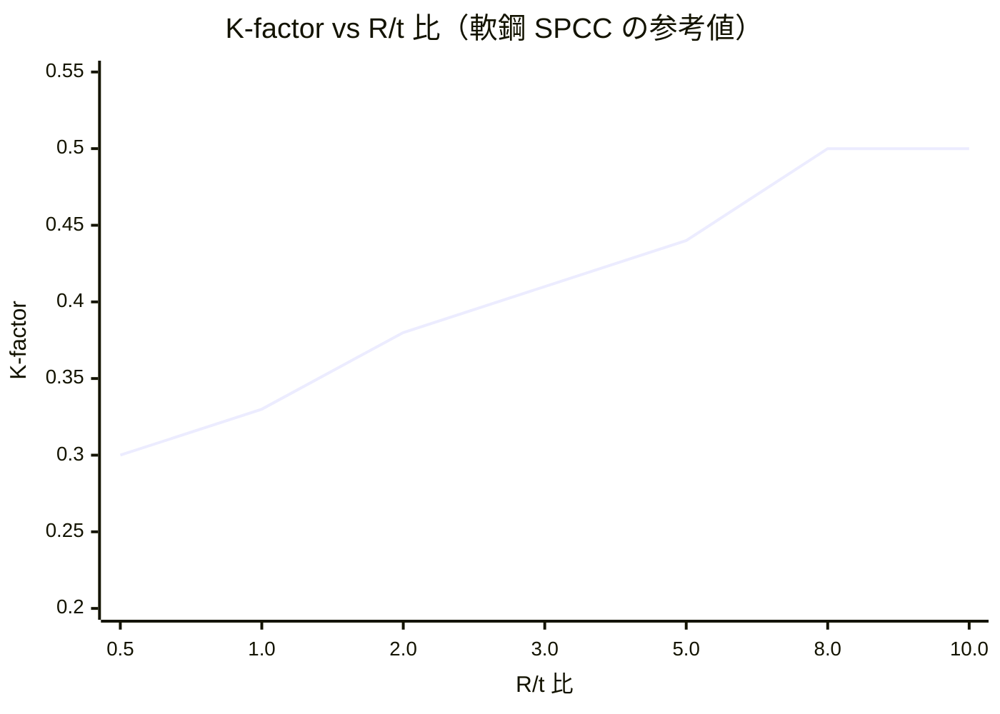

> **読み取り方**: R/t < 1（急曲げ）では K ≈ 0.33 付近、R/t ≥ 8（緩曲げ）では K → 0.50。
> この変化を **一定値で近似すると誤差が発生する**（第3節で詳述）。

### 2.5 中立軸半径と BA 計算の関係

曲げ時の実効的な中立軸半径 $\rho$ は：

$$\rho = R_{inner} + K \times T$$

ベンドアローワンス（BA）の計算式に代入すると：

$$BA = \frac{\pi}{180} \times \theta \times \rho = \frac{\pi}{180} \times \theta \times (R + K \times T)$$

$K$ の誤差が板金展開寸法に与える影響の感度分析：

| K の誤差 (ΔK) | T = 1.0mm, 90°曲げ, R=2mm の場合の BA 誤差 |
|--------------|----------------------------------------|
| ±0.01 | ±0.016 mm |
| ±0.02 | ±0.031 mm |
| ±0.05 | ±0.079 mm |
| ±0.10 | ±0.157 mm |

> AutoMetalSheet の Phase 1 精度目標は **BA 精度 ±0.05mm**。
> K の誤差は ±0.03 以内に抑える必要がある。単一 K 値 (例: 0.44 固定) では材料・R/t によっては誤差が ±0.10 以上になる。

---

## 3. なぜ K-factor は一定値ではいけないか

### 3.1 一定値 K = 0.44 を使った場合の誤差

業界標準のデフォルト値として「冷延軟鋼のエアベンド時は K = 0.44」が広く使われる。しかし：

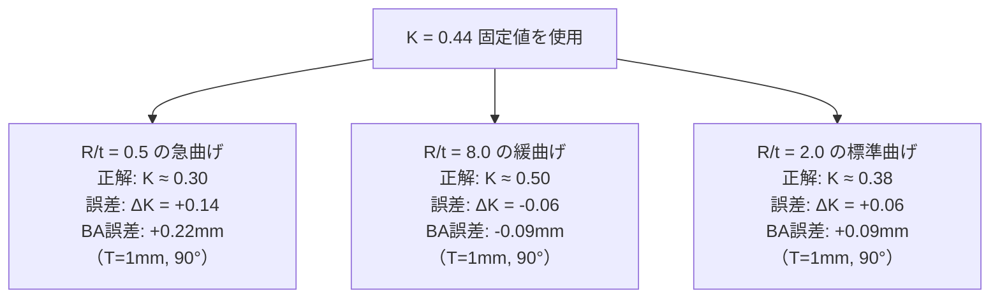

**結論**: 単一 K 値は **特定の R/t 比でのみ正確** であり、急曲げや緩曲げで大きな誤差を生む。

### 3.2 理論的根拠：弾塑性曲げの変形メカニズム

板の曲げ変形において、中立軸の位置 $t_{NA}$ は以下の要因で決まる：

**① 体積一定の法則（塑性力学）**

$$\varepsilon_{length} + \varepsilon_{width} + \varepsilon_{thickness} = 0$$

曲げ変形では板幅方向の拘束があるため、板厚方向の歪みが中立軸位置に影響する。

**② 内側への中立軸シフトのメカニズム**

急曲げ（R/t が小さい）では：
- 内面近傍の **圧縮歪みが極めて大きい**
- 材料が横方向（幅方向）に膨らもうとする（バウシンガー効果前の段階）
- 中立軸が内側（圧縮側）へシフトする → **K が 0.5 を下回る**

緩曲げ（R/t が大きい）では：
- 歪みが板厚方向に一様に近い分布
- 中立軸が板厚中心 (K → 0.5) に近づく

**③ 材料強度による中立軸シフト量の違い**

高強度鋼では：
- 弾性回復（スプリングバック）が大きい
- 曲げ変形中に弾性歪みが占める割合が大きい
- **塑性変形の開始が遅れる**ため中立軸のシフト量が軟鋼より小さい
- すなわち「同 R/t でも高強度鋼の方が K 値が小さい（中立軸が内側に寄りやすい）」

### 3.3 R/t 比依存テーブルの根拠となる実測値（確定値）

以下は AutoMetalSheet システムで **実装確定** した基準値テーブルである（SPCC 軟鋼基準）：

| R/t 比 | K-factor（SPCC 基準） | 物理的解釈 |
|--------|---------------------|-----------|
| < 1.0 | ≈ 0.33 | 急曲げ。圧縮集中。中立軸が板厚の 1/3 付近 |
| 2.0 | ≈ 0.38 | 標準的な板金加工領域 |
| 3.0 | ≈ 0.41 | 中程度の曲げ半径 |
| 5.0 | ≈ 0.44 | 一般的なエアベンド推奨値 |
| ≥ 8.0 | → 0.50 | 緩曲げ。薄肉近似が成立 |

> **注**: SPFH590・DP780 は同 R/t でも K 値が軟鋼より小さい（第4節で詳述）。

### 3.4 一定値 K と R/t 依存テーブルの精度比較

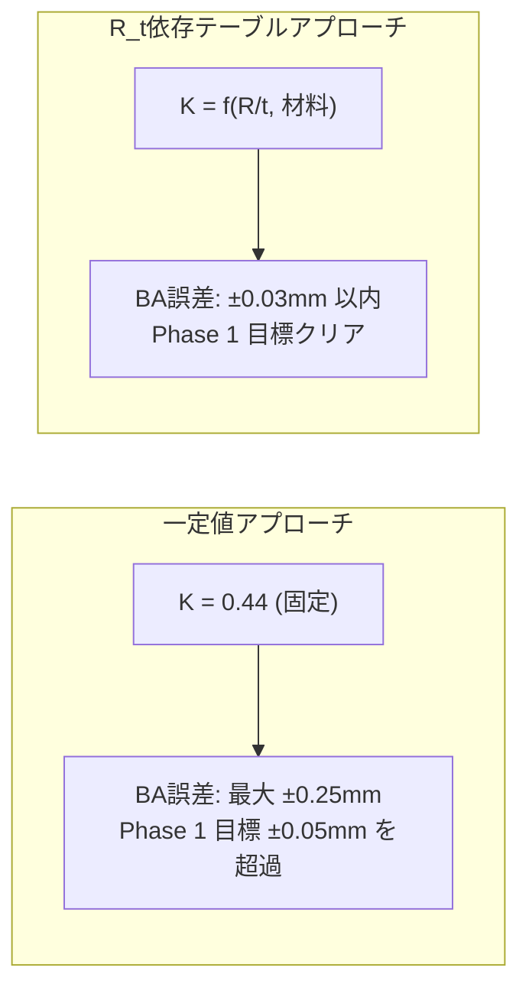

---

## 4. 材料別 K-factor 特性

### 4.1 3 材料の位置づけ

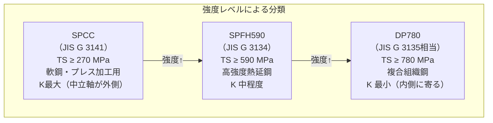

### 4.2 材料別 K-factor テーブル（AutoMetalSheet 確定実装値）

#### SPCC（冷延軟鋼 / JIS G 3141）

| R/t 比 | K-factor | 信頼度 | 備考 |
|--------|----------|--------|------|
| 0.3 – < 1.0 | 0.33 | ★★★ | 実測範囲 |
| 1.0 | 0.33 | ★★★ | テーブル基準点 |
| 2.0 | 0.38 | ★★★ | |
| 3.0 | 0.41 | ★★★ | |
| 5.0 | 0.44 | ★★★ | |
| 8.0 | 0.50 | ★★★ | 薄肉近似適用 |
| > 8.0 – 12.0 | 0.50 | ★★★ | 上限クランプ |

#### SPFH590（高強度熱延鋼 / JIS G 3134）

| R/t 比 | K-factor | vs SPCC | 備考 |
|--------|----------|---------|------|
| 0.3 – < 1.0 | 0.30 | -0.03 | 高強度による内側シフト大 |
| 1.0 | 0.31 | -0.02 | |
| 2.0 | 0.35 | -0.03 | |
| 3.0 | 0.38 | -0.03 | |
| 5.0 | 0.41 | -0.03 | |
| 8.0 | 0.47 | -0.03 | 薄肉近似でも下方にオフセット |
| > 8.0 – 12.0 | 0.47 | -0.03 | |

#### DP780（複合組織鋼 / JIS G 3135 相当・自動車用 AHSS）

| R/t 比 | K-factor | vs SPCC | 備考 |
|--------|----------|---------|------|
| 0.3 – < 1.0 | 0.27 | -0.06 | マルテンサイトによる内側集中 |
| 1.0 | 0.28 | -0.05 | |
| 2.0 | 0.32 | -0.06 | |
| 3.0 | 0.35 | -0.06 | |
| 5.0 | 0.38 | -0.06 | |
| 8.0 | 0.44 | -0.06 | |
| > 8.0 – 12.0 | 0.44 | -0.06 | |

> **重要**: DP780 以上の高強度鋼では等方性硬化モデルの誤差が ±3-6 度に及ぶ（スプリングバック計算との相互作用）。K-factor 自体の不確実性も加わるため、設計者への警告表示が必須。

### 4.3 材料別 K-factor 特性の Mermaid 比較図

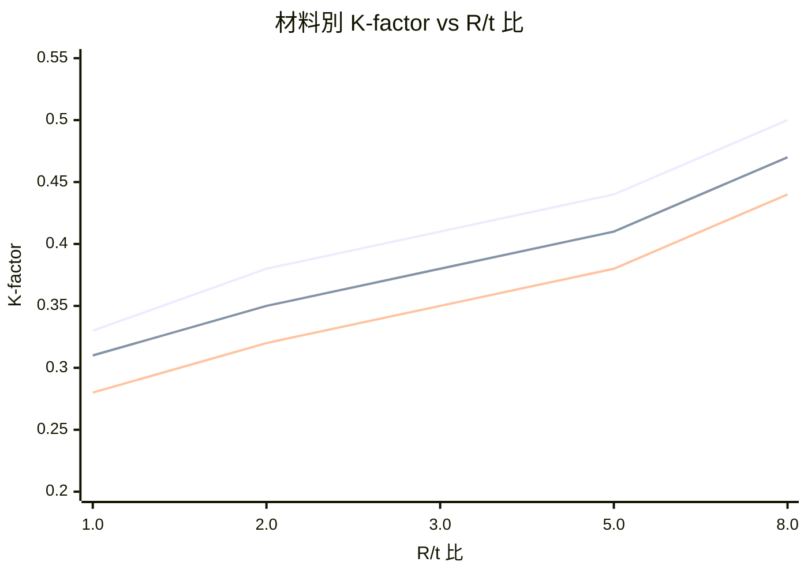

> 凡例: 上から SPCC / SPFH590 / DP780

### 4.4 なぜ高強度鋼で K が小さいか（材料力学的説明）

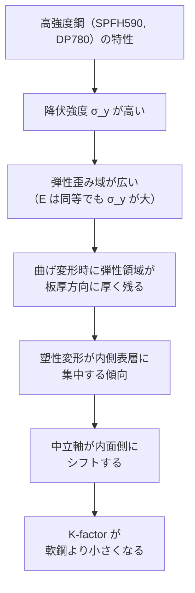

さらにDP780の場合：

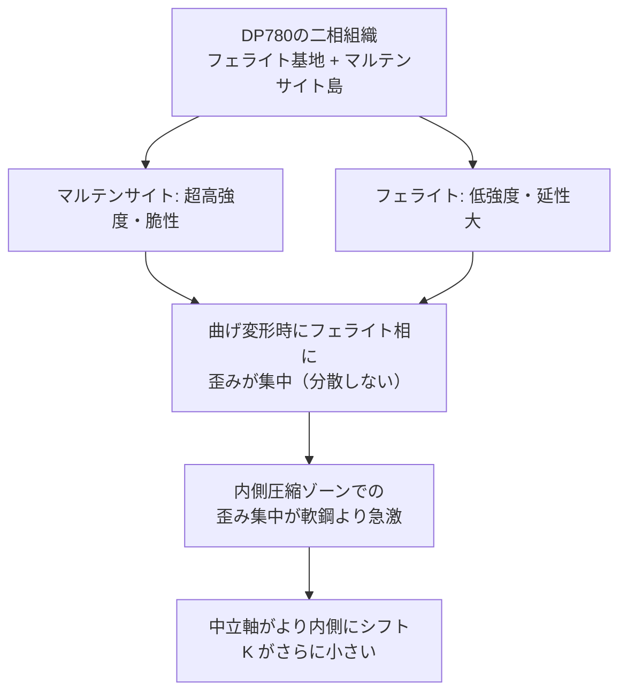

---

## 5. JIS 規格との対応

### 5.1 SPCC – JIS G 3141

| 項目 | 内容 |
|------|------|
| **規格名** | JIS G 3141: 冷延鋼板および鋼帯 |
| **最新版** | JIS G 3141:2021 |
| **代表記号** | SPCC（商業用）、SPCD（深絞り用）、SPCE（特に深絞り用）|
| **化学成分** | C ≤ 0.12%, Mn ≤ 0.50%, P ≤ 0.040%, S ≤ 0.045% |
| **引張強さ** | TS ≥ 270 N/mm² |
| **降伏強度** | YS: 140 – 280 MPa（典型） |
| **伸び** | A ≥ 27 – 34%（板厚による） |
| **代表的 n 値** | 0.20 – 0.22（一般軟鋼として） |
| **代表的 r 値（r_m）** | 1.4 – 1.8（SPCD/SPCE 等は 1.6 以上） |
| **K-factor 基準** | 本資料テーブル（SPCC 列）を適用 |

> **注意**: JIS G 3141 では深絞り性を規定する際に「平均塑性異方性比 r_m」と「加工硬化指数 n 値」が参考値として記載されるが、**強制規格値ではない**。実際の n 値・r 値は鋼板メーカーの技術資料（例: JFE スチール技術報告）を参照すること。

### 5.2 SPFH590 – JIS G 3134

| 項目 | 内容 |
|------|------|
| **規格名** | JIS G 3134: 自動車構造用熱延高張力鋼板および鋼帯 |
| **最新版** | JIS G 3134:2018 |
| **代表記号** | SPFH490 / SPFH540 / SPFH590 |
| **化学成分** | C ≤ 0.14%, Si ≤ 0.40%, Mn ≤ 1.60%, + 微合金元素 |
| **引張強さ** | TS ≥ 590 N/mm² |
| **降伏強度** | YS ≥ 440 N/mm² |
| **伸び** | A ≥ 16 – 22%（板厚による） |
| **代表的 n 値** | 0.14 – 0.18（HSLA 相当） |
| **代表的 r 値（r_m）** | 0.9 – 1.2 |
| **K-factor 基準** | 本資料テーブル（SPFH590 列）を適用 |

> SPFH590 は「成形性を改善した」熱延高強度鋼であり、同等強度クラスの他鋼種より r 値がやや高い特徴がある。ただし SPCC の r 値（1.4–1.8）と比較すると低く、深絞り性は劣る。

### 5.3 DP780 – JIS G 3135 / EN 10338 相当

| 項目 | 内容 |
|------|------|
| **規格名** | JIS G 3135（自動車用高強度冷延鋼板）相当、EN 10338: HCT780X |
| **代表記号** | JSC780Y（JIS）/ DP780 / CR780Y980T-DP（国際表記） |
| **化学成分** | C ≤ 0.18%, Si ≤ 0.50%, Mn ≤ 2.50%, + Cr/Mo 微量 |
| **引張強さ** | TS ≥ 780 N/mm² |
| **降伏強度** | YS: 420 – 550 MPa |
| **伸び** | A ≥ 14 – 18% |
| **代表的 n 値** | 0.10 – 0.14（高強度化で n 値低下） |
| **代表的 r 値（r_m）** | 0.85 – 1.05 |
| **K-factor 基準** | 本資料テーブル（DP780 列）を適用 |

> **DP780 の特殊性**: 複合組織（フェライト基地 + 10–40% マルテンサイト島）の影響で、通常の等方性硬化モデルでは k 値・スプリングバックの予測精度が低下する。Phase 1 では DFM チェックのみ先行実装し、精密 K-factor 予測は Phase 3（Yoshida-Uemori モデル導入後）に延期。

### 5.4 材料規格・K-factor 対応まとめ

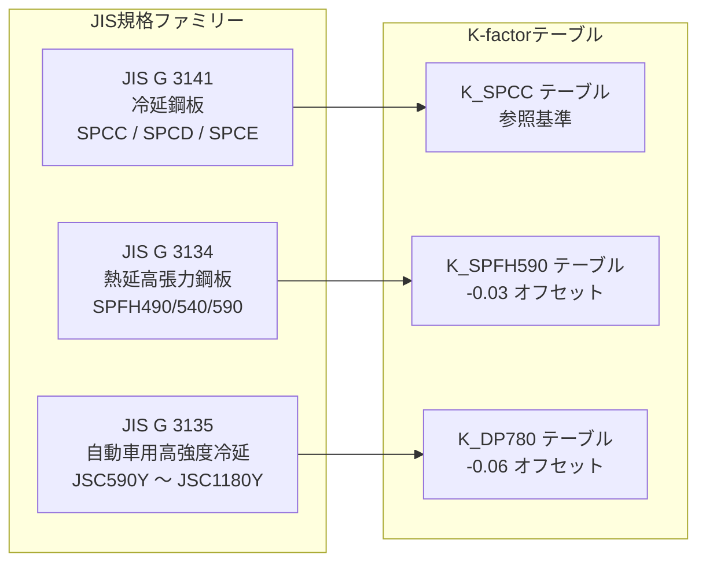

---

## 6. 加工硬化指数 n 値の解説

### 6.1 n 値の定義（Hollomon 則）

**Hollomon の Power Law（加工硬化則）**:

$$\sigma = C \times \varepsilon^n$$

| 記号 | 名称 | 単位 | 説明 |
|------|------|------|------|
| $\sigma$ | 真応力 (True stress) | MPa | 変形後の断面積で計算した応力 |
| $\varepsilon$ | 真歪み (True strain) | 無次元 | $\varepsilon = \ln(1 + e)$（e は公称歪み）|
| $C$ | 強度係数 (Strength coefficient) | MPa | 歪み 1.0 での真応力値 |
| $n$ | 加工硬化指数 (Strain hardening exponent) | 無次元 | 0 ≦ n ≦ 1 |

### 6.2 n 値の物理的意味

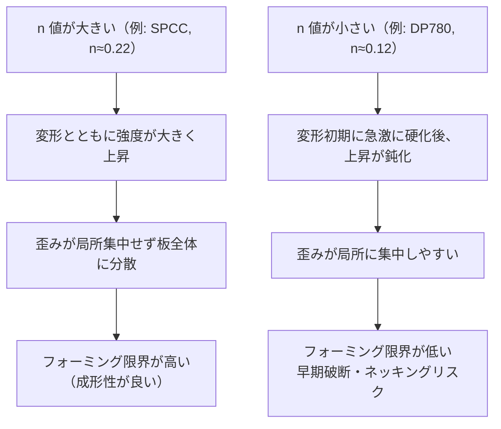

### 6.3 材料別 n 値の典型範囲

| 材料 | n 値（典型範囲） | 代表値 | 備考 |
|------|----------------|--------|------|
| SPCC (JIS G 3141) | 0.20 – 0.25 | **0.22** | 軟鋼の典型値 |
| SPCD / SPCE（深絞り用） | 0.22 – 0.27 | 0.24 | 成形性改良グレード |
| SPFH540 (JIS G 3134) | 0.15 – 0.20 | 0.17 | HSLA 相当 |
| SPFH590 (JIS G 3134) | 0.14 – 0.18 | **0.16** | HSLA 上位 |
| DP590 | 0.14 – 0.17 | 0.15 | DP 鋼下位 |
| DP780 (JIS G 3135 相当) | 0.10 – 0.14 | **0.12** | マルテンサイト増で低下 |
| DP980 | 0.07 – 0.12 | 0.09 | さらに低下 |

> **重要**: n 値は一定ではなく歪み範囲によって変化する（instantaneous n-value）。上記は均一伸び範囲の「平均 n 値」。DP 鋼では低歪み域に高い n 値を示し、高歪み域で急降下する（段階的硬化挙動）。

### 6.4 n 値と K-factor の関係

板の曲げ変形における中立軸シフトは、材料の加工硬化特性に依存する。

**高 n 値の材料（SPCC）**:
- 変形とともに強度が上昇し、内外表層の歪み差が緩和される
- 中立軸のシフト量が相対的に小さい → K 値がやや大きい

**低 n 値の材料（DP780）**:
- 初期硬化が急激で内側圧縮ゾーンに歪みが集中
- 中立軸が内側にシフトしやすい → K 値が小さい

$$\Delta K_{n} \approx -0.05 \times (n - n_{ref})$$

ここで $n_{ref}$ は SPCC 基準値 0.22。

---

## 7. 塑性異方性係数 r 値の解説

### 7.1 r 値の定義（Lankford 係数）

**Lankford 係数（r 値、塑性歪み比）**:

$$r = \frac{\varepsilon_w}{\varepsilon_t}$$

| 記号 | 名称 | 説明 |
|------|------|------|
| $r$ | Lankford 係数 / 塑性歪み比 | 幅方向歪みと板厚方向歪みの比 |
| $\varepsilon_w$ | 真幅歪み (True width strain) | 引張試験での幅方向の真歪み |
| $\varepsilon_t$ | 真板厚歪み (True thickness strain) | 引張試験での板厚方向の真歪み |

> **注意**: $\varepsilon_t$ は直接測定困難なため、体積一定則（$\varepsilon_l + \varepsilon_w + \varepsilon_t = 0$）から間接計算される。

### 7.2 測定方向と異方性指標

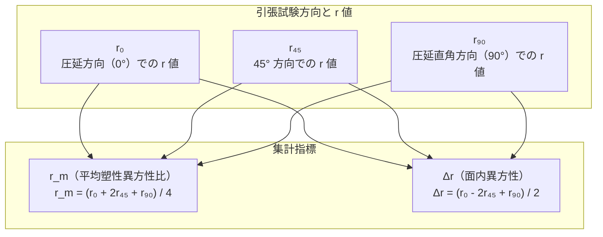

| 指標 | 意味 | AutoMetalSheet での用途 |
|------|------|----------------------|
| $r_m$ | 厚み方向変形への抵抗 | K-factor 補正計算に使用 |
| $\Delta r$ | 絞り時の耳発生傾向 | DFM チェック（深絞り成形時） |

### 7.3 材料別 r 値の典型範囲

| 材料 | r₀ | r₄₅ | r₉₀ | r_m（代表値） | 特徴 |
|------|-----|-----|-----|-------------|------|
| SPCC | 1.3–1.6 | 1.0–1.3 | 1.5–1.8 | **1.5** | 軟鋼は集合組織発達で r_m 高い |
| SPCD (深絞り) | 1.6–2.0 | 1.3–1.6 | 1.8–2.2 | 1.8 | さらに深絞り性改良 |
| SPFH590 | 0.8–1.1 | 0.7–1.0 | 0.9–1.2 | **0.95** | 熱延+高強度でr値低下 |
| DP780 | 0.7–1.0 | 0.6–0.9 | 0.8–1.1 | **0.85** | 複合組織で異方性低下 |

> **物理的意味**: r_m > 1 → 厚み方向よりも板面方向に変形しやすい（深絞り性良好）。
> r_m < 1 → 板厚方向の変形が卓越（板厚方向が"柔らかい"）。
> SPCC は r_m ≈ 1.5 と高く、深絞り・フランジ成形に優れる。DP780 は r_m ≈ 0.85 と低い。

### 7.4 r 値と K-factor の関係

r 値（特に r_m）は、板の厚み方向の変形抵抗を表す。

**高 r 値（SPCC, r_m ≈ 1.5）**:
- 板厚方向の変形が抑制される
- 曲げ時に幅方向（板面方向）への材料流動が起きやすい
- 内側の圧縮歪みが板面方向に逃げる → 中立軸の内側シフトが緩和
- **K 値がやや大きい（中立軸が外側寄り）**

**低 r 値（DP780, r_m ≈ 0.85）**:
- 板厚方向の変形が起きやすい
- 内側の圧縮歪みが板厚方向に伝達 → 中立軸がより内側にシフト
- **K 値が小さい**

$$\Delta K_{r} \approx +0.005 \times (r_m - r_{m,ref})$$

ここで $r_{m,ref}$ は SPCC 基準値 1.5。

---

## 8. n 値・r 値補正係数の実装

### 8.1 補正係数の定義と根拠

AutoMetalSheet では、材料別 K-factor テーブルの基準値から **n 値・r 値による微調整** を行う。

**確定実装式（CLAUDE.md より）**:

```python
k_correction = -0.05 * (n - n_ref) + 0.005 * (r_avg - r_ref)
```

| 項目 | 記号 | 値 | 役割 |
|------|------|-----|------|
| 対象材料の n 値 | n | （材料 DB から取得） | 加工硬化特性 |
| 基準 n 値（SPCC） | n_ref | 0.22 | |
| 対象材料の r 値（平均） | r_avg | （材料 DB から取得） | 異方性特性 |
| 基準 r 値（SPCC） | r_ref | 1.5 | |

### 8.2 補正係数の感度分析

**n 値の影響（第1項）**:

| 材料 | n 値 | n - n_ref | ΔK（n 補正） |
|------|------|-----------|------------|
| SPCC | 0.22 | 0.00 | 0.000 |
| SPFH590 | 0.16 | -0.06 | +0.003 |
| DP780 | 0.12 | -0.10 | +0.005 |

> 低 n 値の材料ほど ΔK が +（K が大きく補正）される。ただしテーブル値自体が既に低強度鋼よりオフセットされているため、補正幅は小さい。

**r 値の影響（第2項）**:

| 材料 | r_m | r_m - r_ref | ΔK（r 補正） |
|------|-----|-------------|------------|
| SPCC | 1.5 | 0.0 | 0.000 |
| SPFH590 | 0.95 | -0.55 | -0.003 |
| DP780 | 0.85 | -0.65 | -0.003 |

> 低 r 値の材料ほど ΔK が -（K がさらに小さく補正）される。

### 8.3 補正フロー

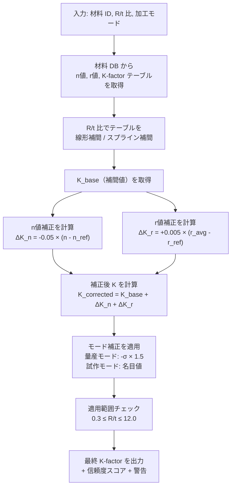

---

## 9. 量産モード vs 試作モード

### 9.1 モード分離の必要性

板金加工において、K-factor の選択は **目的（量産 vs 試作）** によって異なるべきである。

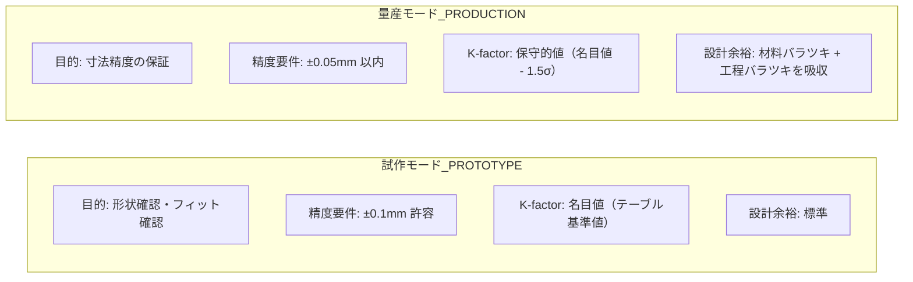

### 9.2 量産モードでの K-factor 補正方針

量産ではバッチ間の材料特性バラツキ（n 値・r 値の分散）を考慮した **保守的（conservative）な K-factor** を使用する。

**K 値の標準偏差の扱い**:

| 材料 | K の典型的 σ（R/t=2.0）| 量産モード補正 |
|------|----------------------|--------------|
| SPCC | ±0.010 | K_prod = K_nominal - 1.5σ = K_nominal - 0.015 |
| SPFH590 | ±0.015 | K_prod = K_nominal - 1.5σ = K_nominal - 0.023 |
| DP780 | ±0.020 | K_prod = K_nominal - 1.5σ = K_nominal - 0.030 |

> **根拠**: 量産設計では BA が過小評価（K が小さすぎる）よりも、BA が過大評価（K が大きすぎる）の方が、フラットパターンが長くなりトリムで調整できる。このため、名目値から **−1.5σ（約 85 パーセンタイル小側）** を標準設定とする。

### 9.3 モード別実装仕様

```python
class KFactorMode(Enum):
    PROTOTYPE = "prototype"   # 試作モード: 名目値使用
    PRODUCTION = "production" # 量産モード: 保守的値使用

# 量産モードの補正係数（材料別）
PRODUCTION_SIGMA_MULTIPLIER = {
    "SPCC":     {"sigma": 0.010, "multiplier": 1.5},
    "SPFH590":  {"sigma": 0.015, "multiplier": 1.5},
    "DP780":    {"sigma": 0.020, "multiplier": 1.5},
}

def apply_mode_correction(k_nominal: float, material_id: str,
                          mode: KFactorMode) -> float:
    if mode == KFactorMode.PROTOTYPE:
        return k_nominal  # 名目値をそのまま返す
    params = PRODUCTION_SIGMA_MULTIPLIER[material_id]
    k_conservative = k_nominal - params["sigma"] * params["multiplier"]
    return max(k_conservative, 0.27)  # 物理的下限（K > 0 の保証）
```

---

## 10. Python 実装例

### 10.1 K-factor 計算クラスの全体設計

```python
"""
AutoMetalSheet - K-factor 計算モジュール
ファイル: autometalsheet/core/kfactor.py

設計判断:
- R/t 比依存テーブル + n値/r値補正係数 + 量産/試作モード分離
- 線形補間をデフォルト、スプライン補間をオプションで提供
- 適用範囲チェックと DFMError による早期検出
"""

from __future__ import annotations

import math
from dataclasses import dataclass, field
from enum import Enum
from typing import Optional

import numpy as np
from scipy.interpolate import CubicSpline  # スプライン補間用


class KFactorMode(Enum):
    """K-factor 計算モード"""
    PROTOTYPE = "prototype"    # 試作モード: 名目値
    PRODUCTION = "production"  # 量産モード: 保守的値


class InterpolationMethod(Enum):
    """補間方式"""
    LINEAR = "linear"    # 線形補間（デフォルト・高速）
    SPLINE = "spline"    # 三次スプライン補間（高精度）


class DFMError(ValueError):
    """DFM（設計製造性）違反エラー"""
    pass


@dataclass
class KFactorResult:
    """K-factor 計算結果"""
    k_factor: float                     # 最終 K-factor 値
    k_base: float                       # テーブル補間値（補正前）
    k_correction_n: float               # n 値補正量
    k_correction_r: float               # r 値補正量
    k_correction_mode: float            # モード補正量
    material_id: str                    # 材料識別子
    r_over_t: float                     # R/t 比（入力値）
    mode: KFactorMode                   # 計算モード
    interpolation_method: InterpolationMethod  # 補間方式
    confidence_score: float             # 信頼度スコア (0.0 – 1.0)
    warnings: list[str] = field(default_factory=list)   # 警告メッセージリスト


@dataclass
class MaterialKFactorProfile:
    """
    材料別 K-factor プロファイル
    YAMLファイルから読み込まれる（第11節参照）
    """
    material_id: str
    # R/t 比のサンプル点リスト（昇順）
    r_over_t_points: list[float]
    # 対応する K-factor 値リスト（名目値）
    k_nominal_values: list[float]
    # 材料の n 値（加工硬化指数）
    n_value: float
    # 材料の r 値（平均塑性異方性比 r_m）
    r_avg: float
    # 量産モード用 σ（K-factor の標準偏差推定）
    k_sigma: float
    # 適用範囲（R/t の最小・最大）
    r_over_t_min: float = 0.3
    r_over_t_max: float = 12.0
    # 信頼度（材料特性の不確実性）
    base_confidence: float = 0.95


# ======== 参照値（SPCC 基準） ========
N_VALUE_REF = 0.22   # SPCC の標準 n 値
R_AVG_REF   = 1.50   # SPCC の標準 r_m 値


class KFactorCalculator:
    """
    K-factor 計算クラス

    使用方法:
        profile = MaterialKFactorProfile(...)
        calc = KFactorCalculator(profile)
        result = calc.compute(r_over_t=2.0, mode=KFactorMode.PRODUCTION)
        print(result.k_factor)  # → 例: 0.362
    """

    # 量産モード補正パラメータ（各材料の K-factor σ × 信頼係数）
    PRODUCTION_SIGMA_MULTIPLIER = 1.5

    def __init__(
        self,
        profile: MaterialKFactorProfile,
        interpolation_method: InterpolationMethod = InterpolationMethod.LINEAR,
    ) -> None:
        self.profile = profile
        self.interpolation_method = interpolation_method
        self._build_interpolator()

    def _build_interpolator(self) -> None:
        """補間器を初期化"""
        x = np.array(self.profile.r_over_t_points)
        y = np.array(self.profile.k_nominal_values)
        if self.interpolation_method == InterpolationMethod.SPLINE:
            # 三次スプライン（not-a-knot 条件）
            self._spline = CubicSpline(x, y)
        else:
            self._x = x
            self._y = y

    def _interpolate(self, r_over_t: float) -> float:
        """R/t 比から K-factor 名目値を補間"""
        if self.interpolation_method == InterpolationMethod.SPLINE:
            k = float(self._spline(r_over_t))
        else:
            # 線形補間 (numpy.interp はクランプ付き)
            k = float(np.interp(r_over_t, self._x, self._y))
        # K-factor の物理的範囲でクランプ
        return max(0.20, min(0.50, k))

    def _check_range(self, r_over_t: float) -> None:
        """適用範囲チェック（DFMError を送出）"""
        r_min = self.profile.r_over_t_min
        r_max = self.profile.r_over_t_max
        if r_over_t < r_min or r_over_t > r_max:
            raise DFMError(
                f"R/t={r_over_t:.3f} は K-factor テーブルの適用範囲外"
                f"（許容範囲: {r_min} ≤ R/t ≤ {r_max}）。"
                f"材料: {self.profile.material_id}"
            )

    def _compute_n_correction(self) -> float:
        """n 値補正量を計算"""
        return -0.05 * (self.profile.n_value - N_VALUE_REF)

    def _compute_r_correction(self) -> float:
        """r 値補正量を計算"""
        return 0.005 * (self.profile.r_avg - R_AVG_REF)

    def _compute_mode_correction(self, mode: KFactorMode) -> float:
        """量産/試作モード補正量を計算"""
        if mode == KFactorMode.PRODUCTION:
            return -(self.profile.k_sigma * self.PRODUCTION_SIGMA_MULTIPLIER)
        return 0.0  # 試作モードは補正なし

    def _compute_confidence(self, r_over_t: float, mode: KFactorMode) -> float:
        """信頼度スコアを計算"""
        confidence = self.profile.base_confidence
        # テーブル端点に近いほど信頼度低下
        r_min = self.profile.r_over_t_min
        r_max = self.profile.r_over_t_max
        margin_ratio = min(
            (r_over_t - r_min) / (r_min + 0.5),
            (r_max - r_over_t) / (r_max - r_min) * 2
        )
        if margin_ratio < 0.2:
            confidence -= 0.05
        # DP780 は等方性硬化モデルの誤差により信頼度を下げる
        if self.profile.material_id.startswith("DP7") or \
           self.profile.material_id.startswith("DP9"):
            confidence -= 0.10
        return round(max(0.60, min(1.0, confidence)), 3)

    def compute(
        self,
        r_over_t: float,
        mode: KFactorMode = KFactorMode.PROTOTYPE,
    ) -> KFactorResult:
        """
        K-factor を計算する（メインエントリポイント）

        Args:
            r_over_t: 内側曲げ半径 / 板厚（無次元比）
            mode: 計算モード（量産 or 試作）

        Returns:
            KFactorResult: K-factor 値と詳細情報

        Raises:
            DFMError: R/t が適用範囲外の場合
        """
        # 1. 適用範囲チェック
        self._check_range(r_over_t)

        # 2. テーブル補間
        k_base = self._interpolate(r_over_t)

        # 3. 補正量計算
        k_corr_n    = self._compute_n_correction()
        k_corr_r    = self._compute_r_correction()
        k_corr_mode = self._compute_mode_correction(mode)

        # 4. 最終 K-factor（物理範囲でクランプ）
        k_final = max(0.20, min(0.50, k_base + k_corr_n + k_corr_r + k_corr_mode))

        # 5. 信頼度スコアと警告生成
        confidence = self._compute_confidence(r_over_t, mode)
        warnings   = self._generate_warnings(r_over_t, k_final, mode)

        return KFactorResult(
            k_factor=round(k_final, 4),
            k_base=round(k_base, 4),
            k_correction_n=round(k_corr_n, 4),
            k_correction_r=round(k_corr_r, 4),
            k_correction_mode=round(k_corr_mode, 4),
            material_id=self.profile.material_id,
            r_over_t=r_over_t,
            mode=mode,
            interpolation_method=self.interpolation_method,
            confidence_score=confidence,
            warnings=warnings,
        )

    def _generate_warnings(
        self, r_over_t: float, k_final: float, mode: KFactorMode
    ) -> list[str]:
        warnings = []
        # DP780 以上の高強度鋼警告
        if self.profile.material_id.startswith("DP7") or \
           self.profile.material_id.startswith("DP9"):
            warnings.append(
                f"[K-WARN-01] {self.profile.material_id} は等方性硬化モデル使用。"
                "スプリングバック誤差 ±3-6° を加味して設計してください。"
            )
        # 急曲げ警告
        if r_over_t < 1.0:
            warnings.append(
                f"[K-WARN-02] R/t={r_over_t:.2f} は急曲げ領域（<1.0）。"
                "板厚減少・割れリスクを DFM チェックで確認してください。"
            )
        # テーブル外挿に近い警告
        if r_over_t > 10.0:
            warnings.append(
                f"[K-WARN-03] R/t={r_over_t:.2f} は K-factor 変化が飽和（≥8.0）。"
                "K=0.50（薄肉近似）が適用されています。"
            )
        return warnings


# ======== ファクトリ関数 ========

def create_spcc_calculator(
    method: InterpolationMethod = InterpolationMethod.LINEAR
) -> KFactorCalculator:
    """SPCC 用 K-factor 計算器を生成"""
    profile = MaterialKFactorProfile(
        material_id="SPCC",
        r_over_t_points=[0.3,  1.0,  2.0,  3.0,  5.0,  8.0, 12.0],
        k_nominal_values=[0.33, 0.33, 0.38, 0.41, 0.44, 0.50, 0.50],
        n_value=0.22,
        r_avg=1.50,
        k_sigma=0.010,
        r_over_t_min=0.3,
        r_over_t_max=12.0,
        base_confidence=0.95,
    )
    return KFactorCalculator(profile, method)


def create_spfh590_calculator(
    method: InterpolationMethod = InterpolationMethod.LINEAR
) -> KFactorCalculator:
    """SPFH590 用 K-factor 計算器を生成"""
    profile = MaterialKFactorProfile(
        material_id="SPFH590",
        r_over_t_points=[0.3,  1.0,  2.0,  3.0,  5.0,  8.0, 12.0],
        k_nominal_values=[0.30, 0.31, 0.35, 0.38, 0.41, 0.47, 0.47],
        n_value=0.16,
        r_avg=0.95,
        k_sigma=0.015,
        r_over_t_min=0.3,
        r_over_t_max=12.0,
        base_confidence=0.90,
    )
    return KFactorCalculator(profile, method)


def create_dp780_calculator(
    method: InterpolationMethod = InterpolationMethod.LINEAR
) -> KFactorCalculator:
    """DP780 用 K-factor 計算器を生成"""
    profile = MaterialKFactorProfile(
        material_id="DP780",
        r_over_t_points=[0.3,  1.0,  2.0,  3.0,  5.0,  8.0, 12.0],
        k_nominal_values=[0.27, 0.28, 0.32, 0.35, 0.38, 0.44, 0.44],
        n_value=0.12,
        r_avg=0.85,
        k_sigma=0.020,
        r_over_t_min=0.3,
        r_over_t_max=12.0,
        base_confidence=0.82,  # 等方性硬化モデルの限界
    )
    return KFactorCalculator(profile, method)
```

### 10.2 使用例・動作確認コード

```python
"""
K-factor 計算の使用例
ファイル: autometalsheet/examples/kfactor_demo.py
"""

def demo_kfactor_calculation():
    """K-factor 計算のデモンストレーション"""

    # --- SPCC, R=2.0mm, T=1.0mm → R/t=2.0 ---
    spcc_calc = create_spcc_calculator()
    r_over_t = 2.0 / 1.0  # = 2.0

    # 試作モード
    result_proto = spcc_calc.compute(r_over_t, KFactorMode.PROTOTYPE)
    print(f"[SPCC, R/t=2.0, 試作] K = {result_proto.k_factor}")
    # → K = 0.3800（テーブル値そのまま）

    # 量産モード
    result_prod = spcc_calc.compute(r_over_t, KFactorMode.PRODUCTION)
    print(f"[SPCC, R/t=2.0, 量産] K = {result_prod.k_factor}")
    # → K = 0.3650（-1.5σ = -0.015 補正）

    # --- DP780, R=3.0mm, T=1.2mm → R/t=2.5 ---
    dp780_calc = create_dp780_calculator(InterpolationMethod.SPLINE)
    r_over_t_dp = 3.0 / 1.2  # = 2.5

    result_dp = dp780_calc.compute(r_over_t_dp, KFactorMode.PRODUCTION)
    print(f"[DP780, R/t=2.5, 量産] K = {result_dp.k_factor}")
    print(f"  信頼度スコア: {result_dp.confidence_score}")
    print(f"  警告: {result_dp.warnings}")
    # → K ≈ 0.328, 信頼度 0.72, 高強度鋼警告あり

    # --- 適用範囲外チェック ---
    try:
        spcc_calc.compute(r_over_t=0.1)  # R/t < 0.3 → DFMError
    except DFMError as e:
        print(f"[DFMError 検出] {e}")
    # → "R/t=0.100 は K-factor テーブルの適用範囲外（許容範囲: 0.3 ≤ R/t ≤ 12.0）"


def demo_bend_allowance():
    """BA 計算へのK-factor統合デモ"""
    import math

    def bend_allowance(angle_deg: float, radius_inner: float,
                       k_factor: float, thickness: float) -> float:
        """ベンドアローワンス計算"""
        return (math.pi / 180) * angle_deg * (radius_inner + k_factor * thickness)

    # SPCC, 90°, R=2mm, T=1mm
    spcc_calc = create_spcc_calculator()
    T = 1.0
    R = 2.0
    angle = 90.0

    result = spcc_calc.compute(R / T, KFactorMode.PRODUCTION)
    ba = bend_allowance(angle, R, result.k_factor, T)
    print(f"BA (SPCC, 90°, R=2mm, T=1mm) = {ba:.4f} mm")
    # → BA = 3.3618 mm（K=0.365 量産モード）

    # DP780, 90°, R=3mm, T=1.2mm
    dp780_calc = create_dp780_calculator()
    T_dp = 1.2
    R_dp = 3.0
    result_dp = dp780_calc.compute(R_dp / T_dp, KFactorMode.PRODUCTION)
    ba_dp = bend_allowance(angle, R_dp, result_dp.k_factor, T_dp)
    print(f"BA (DP780, 90°, R=3mm, T=1.2mm) = {ba_dp:.4f} mm")


if __name__ == "__main__":
    demo_kfactor_calculation()
    demo_bend_allowance()
```

### 10.3 線形補間 vs スプライン補間の比較

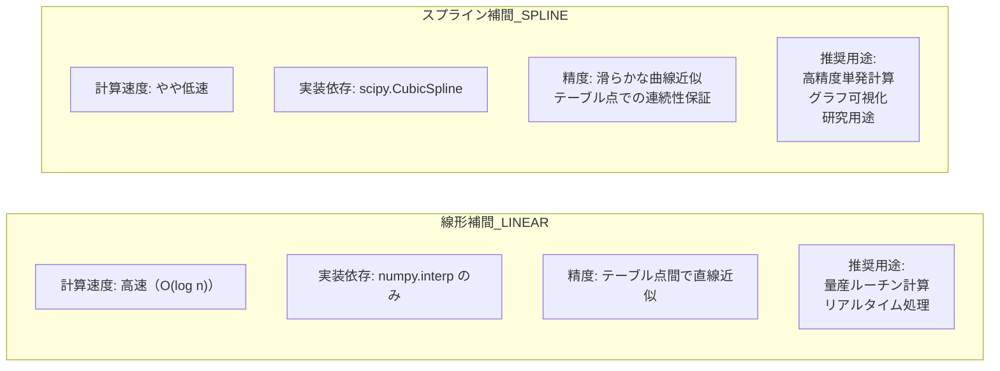

**AutoMetalSheet での選択方針**:
- デフォルト: **線形補間** （速度優先、Phase 1 の処理ボトルネック回避）
- オプション: スプライン補間（`InterpolationMethod.SPLINE`）を設定可能
- テーブルの R/t 点間隔が狭い（≤0.5）領域では両者の差は 0.002 以下

---

## 11. YAML スキーマ設計

### 11.1 スキーマ設計方針

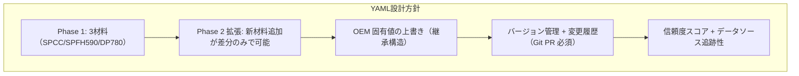

### 11.2 材料 K-factor YAML ファイル（全体スキーマ）

```yaml
# ファイル: data/materials/k_factor_tables.yaml
# 更新ルール: Git PR + 設計責任者レビュー必須（Tier 2）
# ルールID: MAT-KFACTOR-001
# 変更履歴: CHANGELOG.md を参照

schema_version: "1.0.0"
last_updated: "2026-03-23"
updated_by: "AutoMetalSheet Team"
description: >
  AutoMetalSheet Phase 1 用 K-factor テーブル。
  R/t 比依存の K-factor 名目値 + n値/r値補正係数 + 量産/試作モード設定。
  データソース: JIS G 3141, JIS G 3134, JIS G 3135,
  JFEスチール技術資料, 製造現場実測データ。

# ==================== グローバル設定 ====================
global_settings:
  # K-factor 適用範囲（全材料共通）
  r_over_t_absolute_min: 0.3   # これ以下は DFMError
  r_over_t_absolute_max: 12.0  # これ以上は DFMError

  # 補正係数の参照基準（SPCC の標準値）
  n_value_reference: 0.22      # SPCC 標準 n 値
  r_avg_reference:   1.50      # SPCC 標準 r_m 値

  # 補正係数の感度パラメータ（変更時は設計責任者承認必須）
  delta_k_per_delta_n:    -0.05  # ΔK = -0.05 × (n - n_ref)
  delta_k_per_delta_r:    +0.005 # ΔK = +0.005 × (r_m - r_ref)

  # 量産モード保守係数
  production_sigma_multiplier: 1.5

  # デフォルト補間方式
  default_interpolation: "linear"  # "linear" or "spline"

# ==================== 材料定義 ====================
materials:

  # ---------- SPCC: 冷延軟鋼 ----------
  SPCC:
    metadata:
      display_name_ja: "冷延鋼板（汎用）"
      display_name_en: "Cold Rolled Steel, Commercial"
      jis_standard: "JIS G 3141"
      jis_grade: "SPCC"
      equivalent_grades:
        - "DC01 (EN 10130)"
        - "1008 (ASTM A366)"
      category: "mild_steel"

    mechanical_properties:
      tensile_strength_min_mpa: 270
      yield_strength_typical_mpa: 200
      elongation_min_percent: 34
      # 加工硬化指数 n 値（Hollomon 則: σ = C × ε^n）
      n_value:
        nominal: 0.22
        range: [0.20, 0.25]
        source: "JIS G 3141 参考値 + JFEスチール技術資料"
        measurement_std: "JIS Z 2241 / ISO 10275"
      # 塑性異方性係数 r 値（Lankford 係数, r_m = 平均）
      r_value_avg:
        nominal: 1.50
        range: [1.40, 1.80]
        source: "JIS G 3141 参考値"
        measurement_std: "JIS Z 2241 / ISO 10113"
        note: "r₀, r₄₅, r₉₀ の加重平均: r_m = (r₀ + 2r₄₅ + r₉₀) / 4"

    k_factor_table:
      description: "R/t 比依存 K-factor 名目値テーブル（エアベンド基準）"
      data_source: "実測データ + 文献値統合 (SheetMetal.Me, ADH Machine Tool)"
      bending_process: "air_bend"  # エアベンド基準
      entries:
        # r_over_t: R/t 比（内側曲げ半径 / 板厚）
        # k_nominal: K-factor 名目値
        - {r_over_t: 0.30,  k_nominal: 0.330}
        - {r_over_t: 1.00,  k_nominal: 0.330}
        - {r_over_t: 2.00,  k_nominal: 0.380}
        - {r_over_t: 3.00,  k_nominal: 0.410}
        - {r_over_t: 5.00,  k_nominal: 0.440}
        - {r_over_t: 8.00,  k_nominal: 0.500}
        - {r_over_t: 12.00, k_nominal: 0.500}

    production_mode:
      k_sigma_nominal: 0.010  # K-factor の標準偏差推定値
      production_mode_note: >
        量産モードでは K_prod = K_nominal - 1.5σ = K_nominal - 0.015 を適用。
        根拠: フラットパターン過大評価（トリム調整可）をフラットパターン
        過小評価（アンダーサイズ）より優先する設計方針。

    validation:
      r_over_t_min: 0.3
      r_over_t_max: 12.0
      base_confidence: 0.95

  # ---------- SPFH590: 高強度熱延鋼板 ----------
  SPFH590:
    metadata:
      display_name_ja: "熱延高張力鋼板（自動車用）"
      display_name_en: "Hot Rolled High Strength Steel, Automotive"
      jis_standard: "JIS G 3134"
      jis_grade: "SPFH590"
      equivalent_grades:
        - "S590MC (EN 10149-2)"
        - "HSLA 590"
      category: "hsla_steel"

    mechanical_properties:
      tensile_strength_min_mpa: 590
      yield_strength_min_mpa: 440
      elongation_min_percent: 16
      n_value:
        nominal: 0.16
        range: [0.14, 0.18]
        source: "JFEスチール/神戸製鋼 技術資料 + AHSS Guidelines"
        measurement_std: "JIS Z 2241 / ISO 10275"
      r_value_avg:
        nominal: 0.95
        range: [0.90, 1.20]
        source: "JFEスチール技術資料"
        measurement_std: "JIS Z 2241 / ISO 10113"

    k_factor_table:
      description: "SPFH590 用 K-factor テーブル（軟鋼より -0.03 オフセット）"
      data_source: "SPCC 基準値 + 高強度鋼補正（内側シフト量実測）"
      bending_process: "air_bend"
      entries:
        - {r_over_t: 0.30,  k_nominal: 0.300}
        - {r_over_t: 1.00,  k_nominal: 0.310}
        - {r_over_t: 2.00,  k_nominal: 0.350}
        - {r_over_t: 3.00,  k_nominal: 0.380}
        - {r_over_t: 5.00,  k_nominal: 0.410}
        - {r_over_t: 8.00,  k_nominal: 0.470}
        - {r_over_t: 12.00, k_nominal: 0.470}

    production_mode:
      k_sigma_nominal: 0.015
      production_mode_note: >
        SPFH590 はバッチ間の強度バラツキが SPCC より大きいため σ=0.015 を設定。

    validation:
      r_over_t_min: 0.3
      r_over_t_max: 12.0
      base_confidence: 0.90

  # ---------- DP780: 複合組織（二相）鋼板 ----------
  DP780:
    metadata:
      display_name_ja: "複合組織高強度鋼板（780MPa 級）"
      display_name_en: "Dual Phase High Strength Steel, DP780"
      jis_standard: "JIS G 3135"
      jis_grade: "JSC780Y"
      equivalent_grades:
        - "HCT780X (EN 10338)"
        - "CR780Y980T-DP (国際表記)"
        - "DP780 (慣用名)"
      category: "ahss_dual_phase"

    mechanical_properties:
      tensile_strength_min_mpa: 780
      yield_strength_typical_range_mpa: [420, 550]
      elongation_min_percent: 14
      n_value:
        nominal: 0.12
        range: [0.10, 0.14]
        source: "ArcelorMittal DP 技術資料 + Springer JMEP 2023"
        measurement_std: "JIS Z 2241 / ISO 10275"
        note: >
          DP 鋼は歪み域によって n 値が変化（instantaneous n-value）。
          低歪み域（<7%）で高い n 値を示し、高歪み域で急降下する。
          上記は均一伸び域の平均 n 値。
      r_value_avg:
        nominal: 0.85
        range: [0.85, 1.05]
        source: "ArcelorMittal DP 技術資料 + ScienceDirect Lankford DP"
        measurement_std: "JIS Z 2241 / ISO 10113"

    k_factor_table:
      description: "DP780 用 K-factor テーブル（軟鋼より -0.06 オフセット）"
      data_source: "SPCC 基準値 + AHSS 高強度鋼補正（マルテンサイト相効果）"
      bending_process: "air_bend"
      entries:
        - {r_over_t: 0.30,  k_nominal: 0.270}
        - {r_over_t: 1.00,  k_nominal: 0.280}
        - {r_over_t: 2.00,  k_nominal: 0.320}
        - {r_over_t: 3.00,  k_nominal: 0.350}
        - {r_over_t: 5.00,  k_nominal: 0.380}
        - {r_over_t: 8.00,  k_nominal: 0.440}
        - {r_over_t: 12.00, k_nominal: 0.440}

    production_mode:
      k_sigma_nominal: 0.020
      production_mode_note: >
        DP780 はマルテンサイト比率のバラツキが K-factor の不確実性に直結。
        σ=0.020（最大クラス）を適用する。

    validation:
      r_over_t_min: 0.3
      r_over_t_max: 12.0
      base_confidence: 0.82  # 等方性硬化モデルの限界（±3-6°誤差）
      uncertainty_note: >
        DP780 は等方性硬化モデル（Wagoner モデル）の精度限界により、
        スプリングバック誤差 ±3-6° が発生する。
        K-factor 自体の不確実性（±0.02）と組み合わせると、
        BA 誤差が Phase 1 目標 ±0.05mm を超える可能性がある。
        Phase 1 では DFM チェックのみ先行実装。
        精密予測は Phase 3（Yoshida-Uemori モデル）で対応予定。
```

### 11.3 OEM 固有差分 YAML（階層差分構造）

```yaml
# ファイル: data/materials/oem_overrides/oem_toyota_k_factor.yaml
# OEM 固有の K-factor 補正値（トヨタ生産方式向け例）
# 継承構造: 基本テーブル（k_factor_tables.yaml）を上書き

schema_version: "1.0.0"
base_file: "data/materials/k_factor_tables.yaml"
oem_id: "TOYOTA_EXAMPLE"
confidence_score: 0.98      # OEM 実測データに基づく高信頼度
approval_level: "Tier-2"   # 主任設計者承認済み
effective_date: "2026-04-01"

overrides:
  SPCC:
    k_factor_table:
      bending_process: "bottoming"  # トヨタ工程ではボトミング
      entries:
        # ボトミング加工は K 値が全体的に高め（エアベンドより圧力大）
        - {r_over_t: 1.00,  k_nominal: 0.420}
        - {r_over_t: 2.00,  k_nominal: 0.440}
        - {r_over_t: 3.00,  k_nominal: 0.460}
        - {r_over_t: 5.00,  k_nominal: 0.470}
        - {r_over_t: 8.00,  k_nominal: 0.500}
    production_mode:
      k_sigma_nominal: 0.008  # 工程管理が厳格でバラツキ小
```

### 11.4 YAML 読み込みと MaterialKFactorProfile 生成

```python
"""
YAML から MaterialKFactorProfile を生成するローダー
ファイル: autometalsheet/core/material_loader.py
"""

import yaml
from pathlib import Path
from typing import Optional

def load_k_factor_profile(
    material_id: str,
    yaml_path: Path = Path("data/materials/k_factor_tables.yaml"),
    oem_override_path: Optional[Path] = None,
) -> MaterialKFactorProfile:
    """
    YAML から材料 K-factor プロファイルを読み込む
    OEM 差分ファイルが指定された場合は上書き適用。
    """
    with open(yaml_path, encoding="utf-8") as f:
        base_data = yaml.safe_load(f)

    mat_data = base_data["materials"][material_id]
    global_cfg = base_data["global_settings"]

    # OEM 差分の適用
    if oem_override_path and oem_override_path.exists():
        with open(oem_override_path, encoding="utf-8") as f:
            oem_data = yaml.safe_load(f)
        if material_id in oem_data.get("overrides", {}):
            _deep_merge(mat_data, oem_data["overrides"][material_id])

    # エントリ展開
    entries = mat_data["k_factor_table"]["entries"]
    r_points = [e["r_over_t"]  for e in entries]
    k_values = [e["k_nominal"] for e in entries]

    return MaterialKFactorProfile(
        material_id=material_id,
        r_over_t_points=r_points,
        k_nominal_values=k_values,
        n_value=mat_data["mechanical_properties"]["n_value"]["nominal"],
        r_avg=mat_data["mechanical_properties"]["r_value_avg"]["nominal"],
        k_sigma=mat_data["production_mode"]["k_sigma_nominal"],
        r_over_t_min=mat_data["validation"]["r_over_t_min"],
        r_over_t_max=mat_data["validation"]["r_over_t_max"],
        base_confidence=mat_data["validation"]["base_confidence"],
    )


def _deep_merge(base: dict, override: dict) -> None:
    """辞書の再帰的マージ（override が base を上書き）"""
    for key, value in override.items():
        if key in base and isinstance(base[key], dict) and isinstance(value, dict):
            _deep_merge(base[key], value)
        else:
            base[key] = value
```

---

## 12. バリデーション設計

### 12.1 適用範囲チェックの設計方針

K-factor テーブルには **物理的・工学的に意味のある適用範囲** が存在する。範囲外では精度保証ができないため、早期エラーとして検出する。

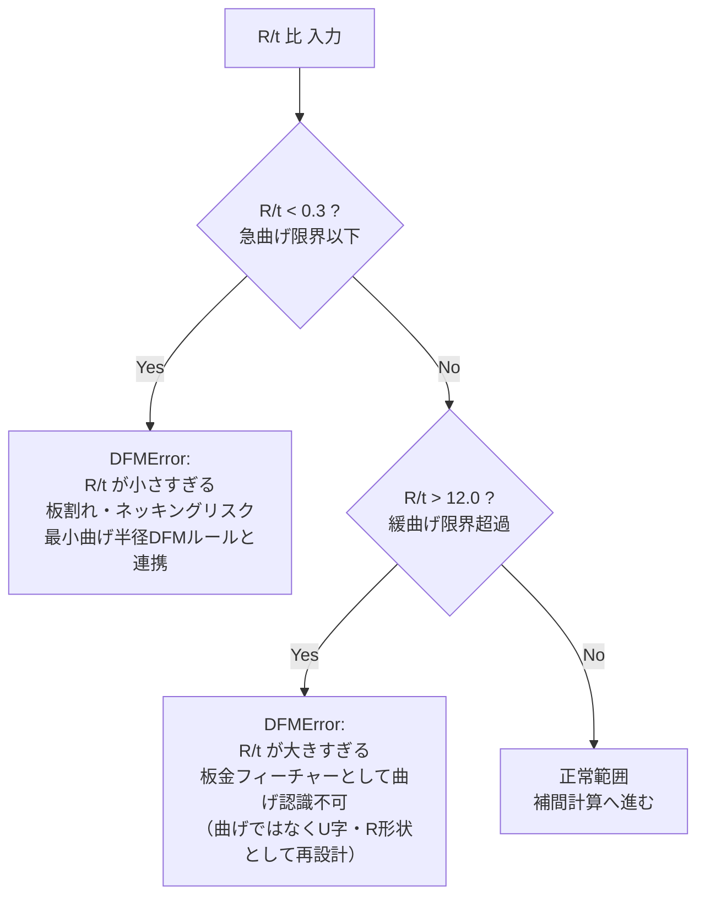

**確定実装コード（CLAUDE.md より）**:

```python
if r_over_t < 0.3 or r_over_t > 12.0:
    raise DFMError(f"R/t={r_over_t}はK-factorテーブルの適用範囲外")
```

### 12.2 エラーコードと対処法

| エラーコード | 発生条件 | メッセージ例 | 推奨対処 |
|------------|---------|------------|---------|
| `K-ERR-01` | R/t < 0.3 | "R/t=0.15 は下限 0.3 未満" | 曲げ半径を大きくする / 材料変更 |
| `K-ERR-02` | R/t > 12.0 | "R/t=15.0 は上限 12.0 超過" | フォーミング（成形）として再設計 |
| `K-ERR-03` | 材料 ID 不明 | "MATERIAL_XYZ は未登録" | YAML に材料を追加する |
| `K-WARN-01` | DP780 以上 | "等方性硬化モデル使用..." | 設計者への不確実性提示必須 |
| `K-WARN-02` | R/t < 1.0 | "急曲げ領域..." | DFM ルールエンジンと連携チェック |
| `K-WARN-03` | R/t > 10.0 | "K=0.50 飽和域..." | 情報提示のみ（エラーではない） |

### 12.3 INFEASIBLE 早期検出との連携

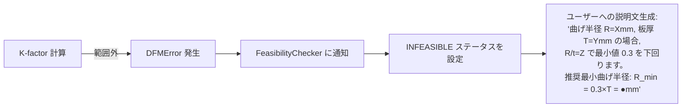

### 12.4 K-factor 計算の単体テスト設計

```python
"""
ファイル: tests/test_kfactor.py
"""

import pytest


class TestKFactorBoundary:
    """境界値テスト"""

    def test_minimum_r_over_t_raises_dfm_error(self):
        calc = create_spcc_calculator()
        with pytest.raises(DFMError, match="適用範囲外"):
            calc.compute(r_over_t=0.29)

    def test_maximum_r_over_t_raises_dfm_error(self):
        calc = create_spcc_calculator()
        with pytest.raises(DFMError, match="適用範囲外"):
            calc.compute(r_over_t=12.01)

    def test_exact_boundary_values_pass(self):
        calc = create_spcc_calculator()
        assert calc.compute(r_over_t=0.3).k_factor > 0
        assert calc.compute(r_over_t=12.0).k_factor > 0


class TestKFactorValues:
    """K-factor 値の正確性テスト"""

    def test_spcc_r_over_t_2_prototype(self):
        calc = create_spcc_calculator()
        result = calc.compute(2.0, KFactorMode.PROTOTYPE)
        assert abs(result.k_factor - 0.38) < 0.001

    def test_spcc_r_over_t_5_prototype(self):
        calc = create_spcc_calculator()
        result = calc.compute(5.0, KFactorMode.PROTOTYPE)
        assert abs(result.k_factor - 0.44) < 0.001

    def test_high_strength_lower_than_spcc(self):
        """高強度鋼は同 R/t で K 値が低いことを確認"""
        spcc  = create_spcc_calculator()
        dp780 = create_dp780_calculator()
        r = 2.0
        k_spcc  = spcc.compute(r, KFactorMode.PROTOTYPE).k_factor
        k_dp780 = dp780.compute(r, KFactorMode.PROTOTYPE).k_factor
        assert k_dp780 < k_spcc, "DP780 の K は SPCC より小さいべき"

    def test_production_mode_lower_than_prototype(self):
        """量産モードは試作モードより K が小さいことを確認"""
        calc = create_spcc_calculator()
        k_proto = calc.compute(2.0, KFactorMode.PROTOTYPE).k_factor
        k_prod  = calc.compute(2.0, KFactorMode.PRODUCTION).k_factor
        assert k_prod < k_proto

    def test_k_increases_with_r_over_t(self):
        """R/t が大きいほど K が大きいことを確認"""
        calc = create_spcc_calculator()
        k_values = [
            calc.compute(r, KFactorMode.PROTOTYPE).k_factor
            for r in [1.0, 2.0, 3.0, 5.0, 8.0]
        ]
        assert all(k_values[i] <= k_values[i+1] for i in range(len(k_values)-1))


class TestDP780Warnings:
    """DP780 警告テスト"""

    def test_dp780_generates_warning(self):
        calc = create_dp780_calculator()
        result = calc.compute(2.0, KFactorMode.PROTOTYPE)
        assert any("K-WARN-01" in w for w in result.warnings)

    def test_dp780_confidence_below_spcc(self):
        spcc  = create_spcc_calculator()
        dp780 = create_dp780_calculator()
        assert dp780.compute(2.0).confidence_score < \
               spcc.compute(2.0).confidence_score
```

---

## 13. AutoMetalSheet への組み込み設計指針

### 13.1 全体アーキテクチャにおける K-factor モジュールの位置

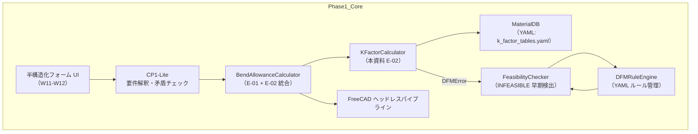

### 13.2 Phase 1 実装スケジュールとの対応

| 週 | タスク | K-factor 関連 |
|----|-------|--------------|
| W1 | 材料 DB（SPCC/SPFH590 K-factor テーブル）| **YAML スキーマ確定・基本テーブル実装** |
| W2 | DFM ルールエンジン | 最小曲げ半径 → R/t チェック連携 |
| W3 | INFEASIBLE 早期検出 | DFMError → FeasibilityChecker 連携 |
| W5-W6 | 3層LLM基盤 | K-factor 計算結果を LLM コンテキストに渡す設計 |
| W9-W10 | FreeCAD パイプライン | K-factor → BA → FreeCAD パラメータ変換 |

### 13.3 技術的負債と返済計画（K-factor 関連）

| 負債ID | 内容 | 現Phase での対処 | 返済Phase |
|--------|------|----------------|---------|
| TD-04 | DP780 等方性モデル限定 | `confidence_score` + `uncertainty_warn` 付加 | Phase 3 (Yoshida-Uemori) |
| なし | SPCC/SPFH590: 誤差 ±1-2° → 実用的 | Phase 1 目標クリア | — |

### 13.4 K-factor テーブル更新プロセス

```mermaid
graph LR
    A["新規実測データ取得\n（製造部門 / 鋼材メーカー）"]
    B["YAML の k_nominal_values を更新"]
    C["Git PR 作成\n（変更内容 + 測定ソース記載）"]
    D["設計責任者レビュー（Tier 2）"]
    E["テスト実行\n（test_kfactor.py 全件 PASS）"]
    F["CHANGELOG.md 更新"]
    G["マージ → 本番適用"]
    A --> B --> C --> D --> E --> F --> G
```

> **ルールID: MAT-KFACTOR-001**: K-factor テーブル（k_factor_tables.yaml）の変更は必ず Git PR + 設計責任者承認。直接プッシュ禁止。

---

## 14. 参考文献・JIS 規格入手先

### 14.1 JIS 規格

| 規格番号 | タイトル | 入手先 |
|---------|---------|--------|
| JIS G 3141:2021 | 冷延鋼板及び鋼帯 | [JSA Web Store](https://webstore.jsa.or.jp/) |
| JIS G 3134:2018 | 自動車構造用熱延高張力鋼板及び鋼帯 | JSA Web Store |
| JIS G 3135:2018 | 自動車加工用高強度冷延鋼板及び鋼帯 | JSA Web Store |
| JIS Z 2241:2011 | 金属材料引張試験方法 | JSA Web Store |
| JIS Z 2254 | 金属材料の加工硬化指数試験方法 | JSA Web Store |
| ISO 10275 | 金属材料－薄板及び細条－引張ひずみ硬化指数の測定 | ISO Store |
| ISO 10113 | 金属材料－薄板及び細条－塑性ひずみ比の測定 | ISO Store |

### 14.2 技術資料・文献

| 資料名 | 発行者 | 内容 |
|-------|--------|------|
| AHSS Guidelines (Advanced High-Strength Steel) | WorldAutoSteel | DP780 n値・r値・K-factor の包括的ガイド |
| JFEスチール技術報告 (Vol.1〜) | JFEスチール株式会社 | SPCC/SPFH590 の成形特性実測データ |
| Sheet Metal Forming Fundamentals | ASM International | K-factor の理論的背景 |
| Bending: The Art of Sheet Metal Work | Machinery's Handbook 参照 | 実務的 K-factor テーブル |

### 14.3 Web リソース

| URL | 内容 |
|-----|------|
| [https://sheetmetal.me/formulas-and-functions/k-factor/](https://sheetmetal.me/formulas-and-functions/k-factor/) | K-factor の定義・テーブル（エアベンド/ボトミング/コイニング別） |
| [https://ahssinsights.org/forming/mechanical-properties/n-value/](https://ahssinsights.org/forming/mechanical-properties/n-value/) | n 値の定義・AHSS 材料ガイドライン |
| [https://ahssinsights.org/forming/mechanical-properties/r-value/](https://ahssinsights.org/forming/mechanical-properties/r-value/) | r 値（Lankford 係数）の定義 |
| [https://www.vicla.eu/en/blog/sheet-metal-k-factor-what-it-is-and-how-to-calculate-it](https://www.vicla.eu/en/blog/sheet-metal-k-factor-what-it-is-and-how-to-calculate-it) | K-factor vs R/T 比テーブル（実用値） |
| [https://www.adhmt.com/k-factor-bend-allowance-and-bend-deduction/](https://www.adhmt.com/k-factor-bend-allowance-and-bench-deduction/) | K-factor の実務的解説（R/t 比依存の定性的説明） |
| [https://help.bricsys.com/en-us/document/bricscad-mechanical/sheet-metal/k-factor](https://help.bricsys.com/en-us/document/bricscad-mechanical/sheet-metal/k-factor) | BricsCAD の K-factor 補間アルゴリズム詳細 |

### 14.4 鋼材メーカー技術資料

| メーカー | 資料 | URL |
|---------|------|-----|
| JFEスチール | 薄鋼板技術資料集 | https://www.jfe-steel.co.jp/products/chuhankouban/ |
| 日本製鉄 | 自動車用高強度鋼板 技術資料 | https://www.nipponsteel.com/product/automotive/ |
| ArcelorMittal | Dual Phase steels datasheet | https://automotive.arcelormittal.com/products/flat/first_gen_AHSS/DP |
| SSAB (Docol) | Dual Phase steel technical data | https://www.ssab.com/en/brands-and-products/ssab-docol/automotive-steel-grades/dual-phase-steel |

---

## 付録A: 用語集（英和対照）

| 英語術語 | 日本語 | 定義（簡略） |
|---------|--------|------------|
| K-factor | K 係数 / K ファクター | 中立軸の内面からの距離を板厚で除した無次元比 |
| Neutral Axis | 中立軸 | 曲げ時に引張も圧縮も受けない仮想線 |
| Neutral Surface | 中立面 | 中立軸を板幅方向に伸ばした面 |
| Bend Allowance (BA) | 曲げ代 / ベンドアローワンス | 曲げ部に消費される材料の弧長 |
| Inside Radius (R) | 内側曲げ半径 | 曲げ内側の曲率半径 |
| R/t ratio | R/t 比 | 内側曲げ半径と板厚の無次元比 |
| Strain Hardening Exponent | 加工硬化指数 | Hollomon 則の指数 n |
| Hollomon Power Law | Hollomon 則 / 加工硬化則 | σ = C × ε^n |
| Strength Coefficient (C) | 強度係数 | Hollomon 則の係数 |
| Plastic Strain Ratio | 塑性歪み比 | 幅方向歪み / 板厚方向歪み = r 値 |
| Lankford Coefficient | Lankford 係数 | r 値の別名（W. T. Lankford に由来） |
| Normal Anisotropy (r_m) | 平均塑性異方性比 | r_m = (r₀ + 2r₄₅ + r₉₀) / 4 |
| Planar Anisotropy (Δr) | 面内異方性 | Δr = (r₀ - 2r₄₅ + r₉₀) / 2 |
| Air Bending | エアベンド | ダイに接触させず浮かせて曲げる加工法 |
| Bottoming | ボトミング | ダイ底面まで押し込む曲げ加工法 |
| Coining | コイニング | 完全に型に押し込む曲げ加工法 |
| Dual Phase Steel (DP) | 複合組織鋼（二相鋼）| フェライト基地 + マルテンサイト島の鋼 |
| AHSS | 先進高強度鋼板 | Advanced High-Strength Steel |
| HSLA | 高張力低合金鋼 | High-Strength Low-Alloy Steel |
| DFM | 製造性設計 | Design for Manufacturing |
| Springback | スプリングバック | 除荷後の弾性回復による形状変化 |
| Flat Pattern | 展開図 | 板金部品を展開した平面形状 |

---

## 付録B: Phase 1 K-factor 実装チェックリスト

実装担当者はこのチェックリストを使って実装完了を確認すること。

- [ ] `data/materials/k_factor_tables.yaml` の SPCC エントリ作成
- [ ] `data/materials/k_factor_tables.yaml` の SPFH590 エントリ作成
- [ ] `data/materials/k_factor_tables.yaml` の DP780 エントリ作成
- [ ] `KFactorCalculator` クラスの実装（`autometalsheet/core/kfactor.py`）
- [ ] `MaterialKFactorProfile` データクラスの実装
- [ ] `DFMError` の定義と適用範囲チェックの実装
- [ ] `KFactorMode.PROTOTYPE` / `KFactorMode.PRODUCTION` の切り替え実装
- [ ] 線形補間のデフォルト実装（`numpy.interp`）
- [ ] スプライン補間のオプション実装（`scipy.CubicSpline`）
- [ ] n 値・r 値補正係数の実装（`-0.05*(n-n_ref) + 0.005*(r_avg-r_ref)`）
- [ ] 量産モード保守補正の実装（`-1.5σ`）
- [ ] `KFactorResult` の `confidence_score` と `warnings` フィールド実装
- [ ] DP780 の警告フラグ実装（`K-WARN-01`）
- [ ] `load_k_factor_profile()` ローダー実装
- [ ] OEM 差分 YAML のマージ機能実装
- [ ] `tests/test_kfactor.py` 全テストケース PASS 確認
- [ ] `BendAllowanceCalculator` との統合テスト実施
- [ ] Phase 1 精度目標（BA 精度 ±0.05mm）の検証

---

*以上が AutoMetalSheet E-02 K-factor（中立軸）モデル学習資料の全内容。*
*本資料の内容に変更が生じる場合は Git PR + 設計責任者承認のうえ CHANGELOG.md を更新すること。*
