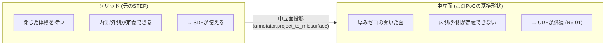
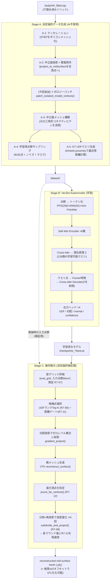
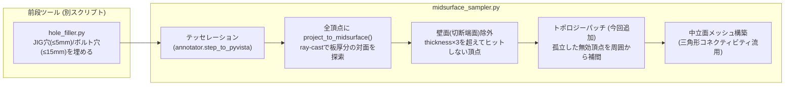
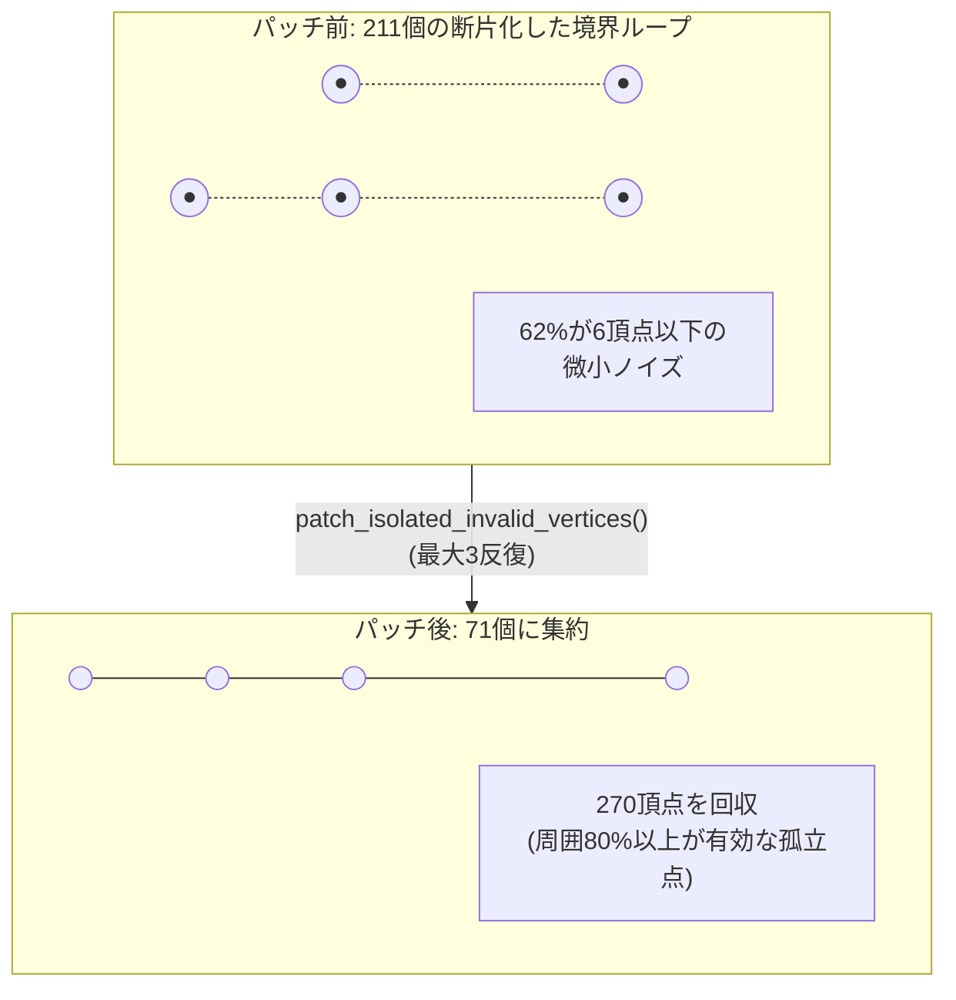
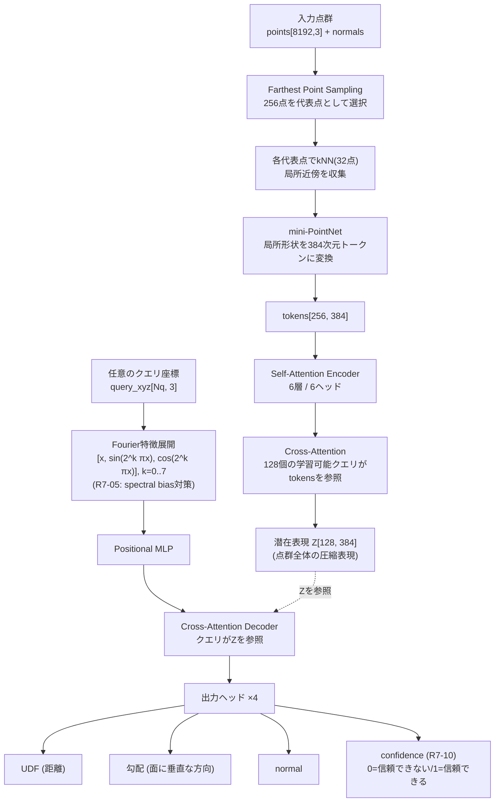
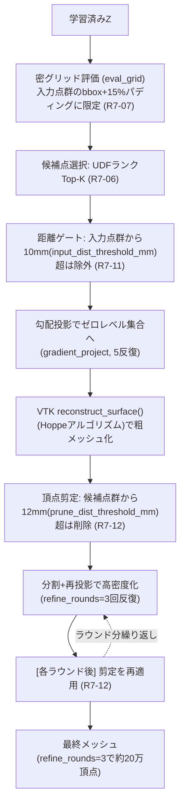
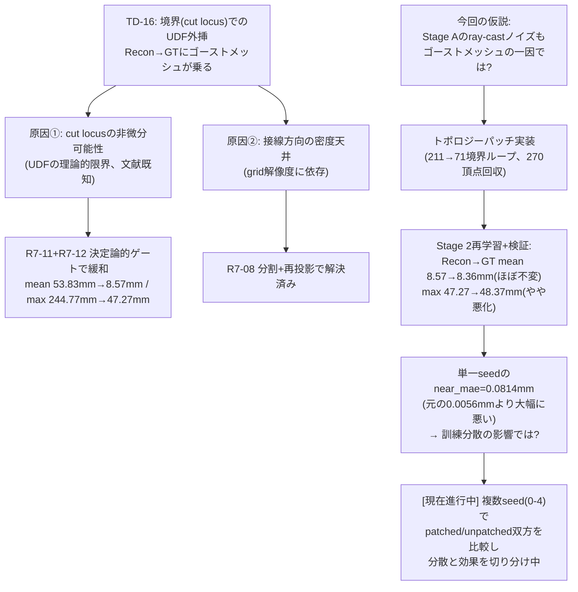

# 学習資料 F01: 中立面点群 → AI形状復元 PoC アーキテクチャ

> 対応する確定設計判断: `CLAUDE.md` §13(Round 6) / §14(Round 7) / §15(Round 8)
> 実装ファイル: `biw_poc/src/preprocess/midsurface_sampler.py`(Stage A) / `biw_poc/src/model/{vecset_ae,dataset,train}.py`(Stage B) / `biw_poc/src/model/reconstruct.py`(Stage C)

---

## 1. このPoCは何をしようとしているか

板金STEPファイル(ソリッド)から**中立面**(板厚の中心を通る仮想的な面)を取り出し、その中立面形状を**点群 → ニューラルネット(UDF) → メッシュ**という経路で複元できるかを検証するPoCです。

最終目標(CLAUDE.md冒頭の「板金設計の自動化」)からみると、このPoCは「板金形状をパラメトリックCADフィーチャーとして再生成する」のではなく、**まず幾何形状そのものをAIが正しく記憶・復元できるか**を確認する基礎実験という位置づけです(R6-05: スコープはメッシュ復元のみ、パラメトリックB-Rep化は対象外)。

### なぜ「ソリッド」ではなく「中立面」なのか

板金部品はソリッド(体積を持つ閉じた形状)としてSTEPに保存されています。閉じたソリッドなら本来 **SDF**(符号付き距離場、内側/外側が定義できる)が使えるはずですが、このPoCはあえて中立面という**厚みゼロの開いた面**を基準形状に選びました。理由は、板金設計の本質的な情報(曲げR・フランジ長など)は中立面の形状にこそ宿っており、板厚方向の情報(SDFが持つ内外の区別)は本質的に冗長だからです。

ただし中立面は厚みゼロの面なので「内側/外側」が存在せず、SDFは定義不可能です。そこでこのPoCでは **UDF**(符号なし距離場、最寄りの面までの距離のみ)を採用しています。

---

## 2. 全体パイプライン (Stage A → B → C)

---

## 3. Stage A: 決定論的データ生成

AIを一切使わず、幾何計算のみで「正解データ(GT)」と「学習用ノイズ入り点群」を作るステージです。

### このセッションで追加した「トポロジーパッチ」とは

`project_to_midsurface()` は頂点ごとに**独立**にray-castして「壁面か否か」を判定するため、空間的な連続性の保証がありません。その結果、本来1本の連続した境界線(部品外周や本物の穴)が、数百個の微小な「虫食い」断片に分裂していました(body002実測: 211個の境界ループ中131個が6頂点以下の断片、最大ループでも外形寸法974mmに対し202.7mmしかない)。

`hole_filler.py`が15mm以下の穴をすべて埋めている前提があるため、「周囲がほぼ有効(デフォルト閾値80%)な孤立無効頂点」は本物の形状ではなくray-castノイズと判断でき、周囲の有効頂点の平均値で補間できます。

**結果の要点**: トポロジーは大幅に改善した(211→71ループ)が、Stage Cの最終的な復元誤差(Recon→GT)は統計的にほぼ無変化〜やや悪化(下記§6参照)。現在「単発実行のたまたまの誤差か、本質的に効果がないのか」を複数seedで検証中。

---

## 4. Stage B: VecSet Autoencoder

点群を128個の潜在ベクトル(Z)に圧縮し、任意のクエリ座標に対して「UDF・勾配・法線・確信度」を予測するモデルです。

### 学習時の工夫(損失関数)

| 工夫 | 内容 | 理由 |
|---|---|---|
| Truncated-distance loss (R7-03) | 予測・GT双方を±5mm(`clip_dist_mm`)でクランプしてからL1損失 | 遠方の大きな距離値に損失が支配され、近傍(復元に重要な領域)の勾配信号が消えるのを防ぐ |
| Eikonal正則化 (R7-09/§15) | `‖∇UDF‖≈1` に正則化(重み0.05) | UDFの数学的性質(距離場の勾配ノルムは1)を強制し、境界(cut locus)付近の学習を安定化 |
| confidenceヘッド (R7-10) | 入力点群から15mm(`conf_horizon_mm`)以内なら1、それ以遠なら0に学習 | モデル自身に「ここは自信を持って予測できる領域か」を出力させ、Stage Cの外挿除去に利用 |
| バイアス初期化 (R7-04) | 出力層の初期バイアスを-5.0に設定 | 初期状態で全クエリが200-300mm予測になり学習が停止する致命的バグを回避 |
| Fourier特徴 (R7-05) | クエリ座標をNeRF式に高周波展開 | 座標MLP特有のspectral bias対策。near_mae 0.42mm頭打ち→0.0056mmまで改善 |

---

## 5. Stage C: 幾何復元(決定論的後処理)

学習済みモデルの予測(UDF)からメッシュを再構成します。**ここはAIではなく決定論的アルゴリズム**です(R6-05のスコープ制約: パラメトリックCADではなくメッシュ出力のみ)。

### なぜ2段階のゲート(R7-11 + R7-12)が必要だったか

| 段階 | 何が起きるか | 対策 |
|---|---|---|
| グリッド評価時 | 学習データの分布外(境界の外側)でもモデルが誤って小さいUDF値を予測してしまう("cut locus"の非微分可能性、UDFの既知の限界) | R7-11: 実際の入力点群から遠いグリッド点は予測値によらず除外 |
| メッシュ生成後 | VTKの`reconstruct_surface()`自体が疎な領域で外挿した頂点を合成してしまう(候補点群への距離とGT誤差の相関係数0.99で実証済み) | R7-12: 候補点群から遠い頂点を生成後に削除。分割の度に再導入されるため毎ラウンド後に再適用が必須 |

この2つは試した「Deep Ensembles(5モデルの予測ばらつき)」よりも有効だったことが実験的に確認されています(ensemble disagreementとGT誤差の相関係数は0.17しかなく、損失関数設計由来の系統誤差を捉えられなかったため不採用)。

---

## 6. 現在地: TD-16と「トポロジーパッチ」検証の状況

### 現時点で判明している事実(2026-06-18時点)

unpatchedデータでseed 0〜4を学習し、同一ゲート設定(R7-11/R7-12, refine_rounds=3)で評価したところ、**seedだけでも以下の自然な分散**が存在することが確認されました:

| 指標 | unpatched 5seed分散 | patched seed0(単発) |
|---|---|---|
| Recon→GT mean | 8.21〜8.96mm | 8.36mm (範囲内) |
| Recon→GT max | 46.55〜47.88mm | 48.37mm (範囲をやや超過) |
| GT→Recon mean | 1.47〜1.73mm | 1.76mm (範囲をやや超過) |
| GT→Recon max | 13.21〜18.38mm | 18.41mm (範囲内) |

→ patched seed0の結果はunpatchedの自然な分散とほぼ重なっており、「パッチが悪化させた」という以前の暫定結論は**単発比較によるノイズの可能性が高い**ことが示唆されています。現在、patchedデータでもseed 1〜4を追加学習し、両条件の分布を正式に比較中です(バックグラウンド実行中)。

---

## 7. 用語集

| 用語 | 意味 |
|---|---|
| 中立面 (mid-surface) | 板厚の中心を通る仮想的な面。板金部品の本質的形状情報はここに集約される |
| UDF (Unsigned Distance Field) | 空間中の任意の点から、最寄りの面までの符号なし距離を返す関数。開いた面(内外の区別がない形状)に使える |
| SDF (Signed Distance Field) | UDFに加え、内側か外側かを符号(+/-)で表す距離場。閉じたソリッドにのみ定義可能 |
| Cut locus | UDFが数学的に微分不可能になる特異点群。開いた面の境界(切断端)で必ず発生し、ニューラルネットが正確に再現しにくい |
| VecSet | 点群を固定長の潜在トークン集合(ベクトルの集合)に圧縮するエンコーダ方式。3D生成モデル(3DShape2VecSet等)で使われるアーキテクチャ |
| Eikonal正則化 | 距離場の勾配ノルムが1になるよう促す正則化項。UDF/SDFの学習で広く使われる |
| Fourier特徴 / spectral bias | ニューラルネットが高周波(細かい形状変化)を学習しにくい性質(spectral bias)を、座標を三角関数で高次元展開することで緩和する手法(NeRFで有名) |
| Deep Ensembles | 複数の独立学習済みモデルの予測ばらつき(disagreement)を不確実性の指標として使う手法。本PoCでは不採用(§15参照) |
| ゴーストメッシュ | UDFの外挿により、本来存在しないはずの領域に生成されてしまう余剰メッシュ(TD-16の症状) |
| Recon→GT / GT→Recon | 復元メッシュからGTメッシュへの距離(余剰生成=ゴーストメッシュを検出)と、GTメッシュから復元メッシュへの距離(欠落=復元できていない領域を検出)。両方向を別々に見る必要がある |

---

## 8. もっと詳しく知りたい場合

- 設計判断の経緯・根拠を1つずつ追いたい → `CLAUDE.md` §13(Round 6)〜§15(Round 8) の確定設計判断テーブル(R6-01〜R6-06, R7-01〜R7-12)
- Stage Aの実装を読みたい → `biw_poc/src/preprocess/midsurface_sampler.py`, `annotator.py`
- Stage B/Cの実装を読みたい → `biw_poc/src/model/vecset_ae.py`, `dataset.py`, `train.py`, `reconstruct.py`
- 現在進行中の複数seed検証の生データ → `biw_poc/src/model/checkpoints_r710*` 配下の `best.pt`、および `validate_refine.py` の実行結果
