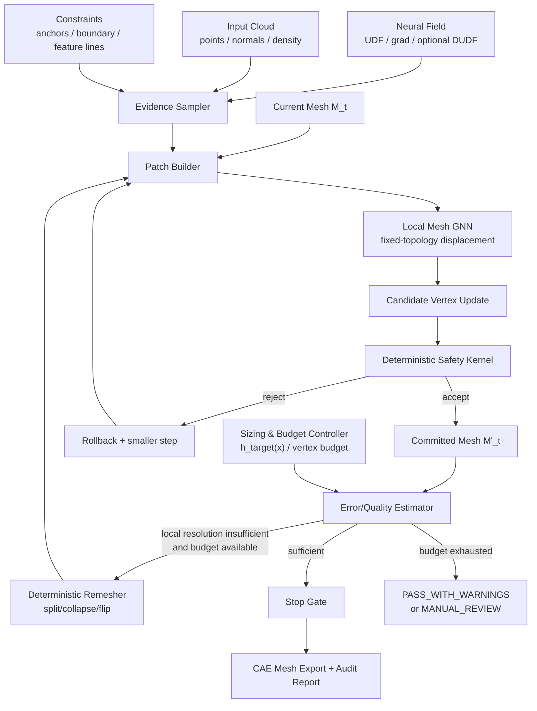

# 拘束点条件付き再帰型UDFメッシュ生成アーキテクチャ

> 初版素案: 2026-06-20  
> 実現可能性レビュー・改訂: 2026-06-20  
> 対応する既存判断: `CLAUDE.md` §13〜§17（R6-01〜R7-13、R9-01）

## 0. 結論

### 0.1 総合判定

**「固定されたニューラルUDFを参照し、既存メッシュを反復改善する」という中心思想は実現可能であり、現行Stage Cの自然な延長である。**

ただし、初版素案の全機能を一度に実装する案は成立しにくい。特に次の4点は変更が必要である。

1. 百万頂点級のメッシュ全体をTransformerへ入力しない。局所パッチ単位のGNN/Message Passingへ変更する。
2. AIに任意のトポロジー編集を直接実行させない。初期段階では固定トポロジーの頂点移動だけを学習し、split/collapse/flipは決定論的演算として実行する。
3. UDFを「真の幾何オラクル」とみなさない。現行PoCで既に有効性を確認した入力点群距離、候補点群距離、境界距離、局所密度を独立した観測として併用する。
4. 幾何精度、トポロジー妥当性、CAE品質を単一の重み付き損失で同時最適化しない。安全制約をハードゲートとし、その内側で幾何、最後に要素品質を改善する辞書式最適化にする。

したがって、採用すべき構成は次である。

```text
固定ニューラル場 + 独立した幾何観測
        ↓
決定論的な初期メッシュ/トポロジー
        ↓
局所GNNによる固定トポロジー頂点補正
        ↓
決定論的な品質ゲート・ロールバック
        ↓
必要箇所だけ決定論的remesh
        ↓
再度、局所GNNで頂点補正
```

この方式を本書では **Guarded Hierarchical Mesh Refiner（GHMR）** と呼ぶ。

### 0.2 実現可能性レベル

| 機能 | 実現可能性 | 判断 |
|---|---:|---|
| 固定トポロジーでの頂点補正 | 高 | 現行`subdivide_and_project()`の置換として着手可能 |
| 局所的な平滑化・しわ抑制 | 高 | 既存の接線方向Laplacian処理を学習残差で拡張可能 |
| split/collapse/flip候補のAI推定 | 中 | 候補生成と実行は決定論的に限定すれば可能 |
| 境界の継続・穴修復 | 中〜低 | 正解トポロジーの教師作成が難しく、後期PoC向け |
| 任意の面挿入/削除をAIが直接実行 | 低 | 非多様体・自己交差・学習不安定のリスクが高い |
| CAE投入可能な三角形シェルメッシュ | 中 | 使用ソルバーと品質閾値を固定すれば評価可能 |
| 自動クアッド優勢メッシュ | 低〜中 | 三角形再構成とは別問題として分離すべき |
| 「UDFの誤りをAIだけで根治」 | 低 | 独立した外部観測とハードゲートが必須 |

### 0.3 現行PoCから得られる直接的な根拠

本提案は白紙の研究案ではない。既に次が実測されている。

* UDF単独の点ごとの勾配投影は、近傍頂点間の整合性を持たず、細分化の反復でしわ・面積膨張を起こしうる。
* 学習済みconfidence headおよびDeep Ensemblesは、共有された系統誤差の検出には使えなかった。
* 入力点群距離ゲートと候補点群距離ゲートは、ゴースト抑制に実際に有効だった。
* `refine_rounds=4`は被覆穴を減らす一方、約123万頂点・243万三角形まで膨張する。したがって全頂点Transformerは現実的でない。
* 点間最近傍距離だけでは、しわ、反転、重複面、面積膨張を検出できない。point-to-surfaceと面品質の両方が必要である。

### 0.4 実STP 15部品から測定したメッシュ規模

`biw_poc/data/filled/*.stp`の全15部品を、現行の
`annotator.step_to_pyvista(deflection=0.15)`および
`midsurface_sampler.build_midsurface_mesh()`へ実際に通して測定した。
ファイルサイズからの推測ではなく、2026-06-20時点の実行結果である。

| 指標 | 中立面頂点数 | 中立面三角形数 |
|---|---:|---:|
| 最小 | 256 | 508 |
| 中央値 | 3,958 | 7,764 |
| 平均 | 5,596 | 11,102 |
| p90 | 12,798 | 25,472 |
| 最大 | 18,640 | 37,214 |
| 15部品合計 | 83,932 | 166,526 |

部品別実測値:

| 部品 | 中立面頂点 | 中立面三角形 |
|---|---:|---:|
| A0072600002_body099 | 500 | 909 |
| A0072600081_body022 | 256 | 508 |
| A0072600592_body136 | 779 | 1,476 |
| A0072600592_body015 | 1,174 | 2,310 |
| A0072600002_body046 | 3,437 | 6,818 |
| A0072600592_body042 | 1,454 | 2,870 |
| A0072600529_body069 | 2,593 | 5,136 |
| A0072600592_body055 | 3,958 | 7,764 |
| A0072600592_body094 | 5,729 | 11,154 |
| A0072600592_body062 | 4,784 | 9,518 |
| A0072600592_body102 | 8,137 | 16,159 |
| A0072600592_body044 | 6,944 | 13,840 |
| A0072600450_body011 | 12,652 | 25,192 |
| A0072600450_body007 | 18,640 | 37,214 |
| A0072600529_body086 | 12,895 | 25,658 |

したがって、**抽出直後の粗い中立面**だけなら、多くの部品は数千頂点であり、
全体GNNや低解像度Transformerへ渡すこと自体は可能である。

問題は細分化後である。中立面の全辺を1→4三角形分割すると仮定した概算は次のとおり。

| 細分化回数 | 頂点中央値 | p90 | 最大 |
|---:|---:|---:|---:|
| 1 | 約15,600 | 約51,000 | 約74,500 |
| 2 | 約62,200 | 約204,000 | 約298,000 |
| 3 | 約249,000 | 約815,000 | 約1,191,000 |
| 4 | 約994,000 | 約3,260,000 | 約4,763,000 |

境界辺の数により多少変動するが、オーダーは変わらない。現行Stage Cでも
`refine_rounds=4`で約123万頂点になった実績があり、この概算と整合する。

この実測から、計算戦略を次のように確定する。

```text
0〜約20k頂点:
  部品全体の粗レベルGNN/Transformerを許容

約20k〜100k頂点:
  全体は粗化トークン、詳細は局所パッチ

100k頂点超:
  局所パッチ処理のみ
  全体Attentionは禁止
```

局所パッチの初期値は2,000〜8,000頂点とし、最大実部品でも粗レベルでは
3〜10パッチ、細分化後は並列パッチとして処理する。

---

## 0A. 改訂アーキテクチャ

### 0A.1 設計原則

1. **AIは提案し、決定論的カーネルが検証して適用する。**
2. **UDF、入力点群、拘束、現在メッシュを互いに独立した証拠として扱う。**
3. **トポロジー変更より先に、固定トポロジー上の幾何改善を成立させる。**
4. **百万頂点を一括処理せず、粗い大域表現と局所パッチ処理を分離する。**
5. **各ラウンドをトランザクションとして扱い、品質悪化時に必ずロールバックできるようにする。**
6. **平均値ではなく、最悪側分位点と絶対禁止事象で合否判定する。**
7. **細分化回数ではなく、局所サイズ場・幾何誤差・計算予算で細分化を停止する。**

### 0A.2 全体構成



### 0A.3 コンポーネント境界

#### A. FieldEvidenceProvider

ニューラル場を「正解」ではなく観測器としてラップする。

```text
FieldEvidence:
  udf
  grad
  grad_norm
  local_lipschitz_violation
  optional_du_df
  model_confidence
```

`model_confidence`は補助値に留め、単独でaccept/rejectを決めない。

#### B. IndependentGeometryEvidence

モデルと誤差原因を共有しない観測を提供する。

```text
IndependentEvidence:
  distance_to_input_cloud
  distance_to_candidate_cloud
  local_point_density
  input_normal_consistency
  distance_to_known_boundary
  distance_to_constraint
  projection_multiplicity_proxy
```

現行R7-11/R7-12の成功を一般化した層であり、GHMRの安全性の中心になる。

#### C. MeshPatchBuilder

全メッシュを、1パッチあたり概ね2,000〜8,000頂点の重なり付き局所グラフへ分割する。

* パッチ中心: 曲率、品質違反、境界、拘束点、UDF残差の高い領域を優先
* halo: 2〜3 ringを付与
* 境界頂点: パッチ間で共有IDを保持
* 予測統合: halo内は距離重み付き平均、拘束点は平均しない
* 大域情報: 部品全体の低解像度トークン64〜256個だけを各パッチへ条件付け

これにより計算量を全頂点数に対して概ね線形に保つ。

#### D. LocalMeshRefiner

初期実装はMesh Transformerではなく、辺ベースMessage Passing GNNとする。

頂点特徴:

```text
position_local
normal
mean/gaussian curvature proxy
udf, grad, grad_norm
distance_to_input_cloud
input_normal_consistency
distance_to_boundary/constraint
one-ring edge statistics
triangle quality statistics
boundary/frozen/anchor flags
round index
local p95/p99 coverage and overshoot error
udf/input/candidate evidence disagreement
h_target / h_floor / h_ceiling
vertex/time/round/patch budget remaining ratio
last split/collapse round and operation age
rollback count and rejection reason
feature/boundary/component id
patch halo flag and seam discontinuity
```

辺特徴:

```text
relative_position
edge_length / target_length
dihedral_angle
shared-face quality
feature-edge flag
```

出力:

```text
delta_tangent[2]
delta_normal[1]
step_confidence
optional_remesh_priority
```

法線・接線成分を分離する。法線方向は幾何整合、接線方向は要素品質改善を主目的とし、役割を混同しない。

#### E. DeterministicSafetyKernel

候補更新は直接コミットしない。以下を満たす場合のみ採用する。

```text
Hard reject:
  self_intersection increased
  non_manifold edge/vertex introduced
  triangle area <= epsilon
  local face inversion introduced
  known boundary crossed
  anchor displacement > tolerance
  component count changed without explicit topology transaction
  topology link condition violated
  protected Euler characteristic or boundary-loop count changed
  feature/boundary/anchor attributes lost
  duplicate face or zero-length edge introduced
  target-length hard floor/ceiling violated
  operation-batch conflict detected
  patch shared-ID consistency violated

Monotonic guards:
  p95 point-to-input distance does not worsen beyond budget
  p95 normal error does not worsen beyond budget
  invalid-element count never increases
```

不採用時は更新量を`1/2`へ縮小して再試行し、規定回数失敗したパッチはfreezeして人間確認対象にする。
remesh操作は更新量を縮小できないため、候補または競合しないバッチ単位でdry-runする。
commit後の全体broad-phase検査に失敗した場合は、そのバッチ全体を原子的にrollbackする。

#### F. DeterministicRemesher

Phase 1ではAIが面を直接追加・削除しない。

AIまたは決定論的誤差推定器が出すのは、次の**優先度**だけである。

```text
split_priority
collapse_priority
flip_priority
freeze_priority
```

実装時は単一priorityだけでなく、候補操作ごとの改善量とコストを予測する。

```text
OperationPrediction:
  operation_id
  operation_type
  expected_delta_geometry
  expected_delta_normal
  expected_delta_cae
  expected_vertex_delta
  expected_runtime_ms
  rejection_probability
```

`rejection_probability`はスケジューリング効率のための予測であり、
SafetyKernelを代替しない。

操作候補間には競合グラフを作る。同一辺、共有頂点、共有1〜2 ring、
パッチをまたぐ同一グローバルIDを競合とし、同一バッチへ入れない。

```text
selection order:
  SafetyKernel eligibility
  → boundary/constraint regression zero
  → geometry gain
  → CAE quality gain
  → gain / added vertex
  → gain / runtime
```

実際の操作は、明示した前後条件を持つ決定論的カーネルが行う。

例:

```text
split:
  edge_length > split_ratio * h_target(edge)
  local_error > error_tolerance
  new_edge_length >= h_floor
  budget_allows(new_vertices)
  projected midpoint is inside evidence envelope
  no predicted self-intersection

collapse:
  edge_length < collapse_ratio * h_target(edge)
  not boundary/feature/anchor edge
  topology link condition satisfied
  geometric_error_after <= error_tolerance
  collapse does not cross a close non-adjacent sheet

flip:
  minimum angle improves
  feature/boundary semantics preserved
```

`split_ratio`と`collapse_ratio`の間にはヒステリシスを設ける。

```text
initial:
  split_ratio = 4/3
  collapse_ratio = 4/5
```

同じ辺がroundごとにsplit/collapseを往復することを防ぐ。

#### G. SizingAndBudgetController

細分化の中心となる決定論的コンポーネント。各位置に目標辺長
`h_target(x)`を定義し、AIから独立してsplit可能性を制限する。

##### 最小距離の定義

「全頂点間のユークリッド最小距離」は使わない。板金では、折り返しや
近接した別シートが正しく存在しうるためである。

次を区別する。

```text
h_edge_min:
  同一メッシュのトポロジー上で接続された辺の最小許容長

d_nonlocal_min:
  非隣接三角形・頂点間の接近検査値
  collapse条件ではなく自己交差/誤接続防止に使う

h_target(x):
  局所的に望ましい辺長
```

##### 局所サイズ場

```text
h_target(x) =
  clamp(
    min(
      h_geometry(x),
      h_feature(x),
      h_constraint(x),
      h_solver(x)
    ),
    h_floor(x),
    h_ceiling(x)
  )
```

各項:

```text
h_geometry:
  曲率と許容弦偏差から決まる上限

h_feature:
  ビード幅、曲げ帯、穴径等を必要要素数で割った値

h_constraint:
  拘束点、境界、締結点付近の局所上限

h_solver:
  解析種別・要素型が要求する目標要素長

h_floor:
  入力分解能、数値安定性、最小有意味フィーチャから決まる絶対下限

h_ceiling:
  平坦領域でも超えてはならない最大辺長
```

曲率半径`R=1/κ`に対し、弦偏差を`δ_geo`以下にする近似は、

```text
h_geometry(x) = sqrt(8 * δ_geo / max(κ(x), κ_epsilon))
```

とする。ただし曲率推定はノイズに弱いため、1-ring値をそのまま使わず、
ロバスト平滑化した曲率と90〜95 percentileを用いる。

幅`w_feature`の形状を横断方向に最低`n_feature`要素で表す場合:

```text
h_feature = w_feature / n_feature
n_feature initial = 4
```

##### サイズ場の勾配制限

隣接要素間で急激にサイズを変えない。

```text
1 / growth_ratio <= h_i / h_j <= growth_ratio
growth_ratio initial = 1.3
```

サイズ場をグラフ上で前後方向に伝播してからremeshへ渡す。

##### 絶対下限の初期値

実STP 15部品の粗中立面では、既に次の極短辺が存在した。

```text
edge minimum:       0〜0.024 mm
part-wise p01:      0.024〜0.247 mm
part-wise p05:      0.126〜0.661 mm
p05 median:         約0.37 mm
median edge median: 約1.79 mm
```

これは細分化の結果ではなく、STEPテッセレーションと中立面投影由来である。
したがって細分化前に極短辺の正規化が必要である。

現データに対するPoC初期値:

```text
h_abs_floor_mm = 0.5
h_solver_default_mm = 2.0
h_ceiling_default_mm = 10.0
```

ただし`0.5 mm`は製品共通定数ではない。最小フィーチャ、ソルバー要件、
入力テッセレーション精度を確認し、`0.5 / 1.0 / 2.0 mm`の感度試験で
決定する。入力に`h_abs_floor`未満の辺がある場合、feature/boundaryで
なければ事前collapse候補とする。

##### 計算予算

細分化はサイズ条件を満たしていても、予算を超えては実行しない。

```text
MeshBudget:
  max_vertices
  max_faces
  max_split_operations_per_round
  max_vertex_growth_ratio_per_round
  max_peak_vram_mb
  max_wall_time_s
  max_rounds
```

PoC初期値:

```text
target_vertices <= 250_000
target_faces <= 500_000
hard_max_vertices = 500_000
hard_max_faces = 1_000_000
hard_max_unique_edges = 1_500_000
max_vertex_growth_ratio_per_round = 1.5
max_split_operations_per_round = min(50_000, 0.10 * current_edges)
target_peak_vram_mb = 4096
hard_max_peak_vram_mb = 4915
target_wall_time_s = 60
hard_max_wall_time_s = 300
```

この値は現在のPC（GTX 1660 SUPER 6GB、RAM 16GB）での研究PoC向けであり、
プロファイリング後に更新する。
一度のroundで全辺を1→4分割する現行方式は禁止する。

三角形が概ね正三角形の場合、面積`A`と頂点予算`V_max`から、
一様メッシュで可能な辺長の目安は次で見積もれる。

```text
h_budget ≈ sqrt(A / (0.866 * V_max))
```

局所サイズ要求から推定した必要頂点数が予算を超える場合、黙って粗くせず、
次のいずれかへ遷移する。

```text
INFEASIBLE_MESH_BUDGET
PASS_WITH_WARNINGS
MANUAL_REVIEW
```

##### split選択

候補辺`e`の優先度:

```text
priority(e) =
  w_error   * normalized_local_error
  + w_size  * max(0, length(e)/h_target(e) - 1)
  + w_feat  * feature_importance
  + w_cae   * quality_gain_estimate
  - w_cost  * predicted_vertex_cost
```

ただし優先度が高くても、次を満たさない辺はsplitしない。

```text
length(e) / 2 >= h_floor(e)
estimated_error_reduction >= min_error_gain
quality_gain_or_geometry_gain > 0
budget remains
```

AIは`priority`の補正または改善量推定に使えるが、
`h_floor`とbudgetを上書きできない。

弦偏差は、辺中点を場へ投影した点と元中点との差として直接計測する。

```text
m = (v_i + v_j) / 2
m_projected = project_to_evidence_surface(m)
e_chord = |m_projected - m|
```

split候補条件:

```text
length(e) > 1.4 * h_target(e)
or e_chord > chord_tolerance
or local_bidirectional_error > hausdorff_tolerance
```

PoC初期値:

```text
chord_tolerance_mm = 0.5
hausdorff_tolerance_mm = 0.5
normal_change_limit_deg = 10
```

境界・feature・拘束領域は別profileを持てるようにする。

```text
known boundary:
  boundary curveへ投影
  endpoint/cornerはfreeze

unknown boundary:
  自動split/collapseせずMANUAL_REVIEW

feature edge:
  edgeを跨ぐcollapse/flip禁止
```

一律1→4三角形分割ではなく、選択した長辺の二分割と適合伝播を基本とする。
1 sweepでsplitする辺は全辺の10%を初期上限とし、計算予算の25%上限より
厳しい方を採用する。

##### collapseと入力正規化

初回ラウンド前に次を実行する。

```text
1. duplicate vertex merge within numeric tolerance
2. zero/near-zero area triangle removal
3. non-feature edge shorter than collapse_ratio * h_targetを候補化
4. topology link condition、境界、法線、誤差を検証
5. SafetyKernel通過分だけcollapse
```

極短辺を残したままsplitだけを制限すると、悪いaspect ratioが固定されるため、
split上限とcollapse正規化は必ず同時導入する。

collapse追加条件:

```text
length(e) < 0.6 * h_target(e)
e_chord < 0.4 * chord_tolerance
local_bidirectional_error < 0.5 * hausdorff_tolerance
post-collapse minimum angle >= 20 deg
```

splitされた辺とその1-ringは2 sweepの間collapse禁止とする。
`h_target`はround間で急変させず、EMA `alpha=0.25`で更新する。

### 0A.4 状態モデル

各ラウンドは再現可能なイベントとして保存する。

```text
RefinementRun:
  run_id
  part_id
  source_model_hash
  field_model_hash
  config_hash
  input_transform
  round_no
  parent_mesh_hash
  proposed_operations[]
  accepted_operations[]
  rejected_operations[]
  metrics_before
  metrics_after
  stop_reason
  random_seed
  sizing_field_hash
  mesh_budget
  budget_before
  budget_after
  split_rejection_reasons
```

メッシュ本体を毎回DBへ入れる必要はない。内容ハッシュ付きartifactとして保存し、イベントから参照する。

### 0A.5 停止判定

学習済みstop headは初期フェーズでは使用しない。停止は決定論的に行う。

```text
stop if any:
  round >= max_rounds
  improvement below epsilon for 2 rounds
  all patches satisfy geometry + topology + quality gates
  unsafe patch ratio exceeds threshold -> MANUAL_REVIEW
  vertex/face/time/VRAM budget exhausted
```

終了状態は最低でも次を区別する。

```text
PASS
PASS_WITH_WARNINGS
MANUAL_REVIEW
INFEASIBLE
FAILED_NUMERICALLY
INFEASIBLE_MESH_BUDGET
STALLED_SAFE
OSCILLATION_DETECTED
```

`no accepted operation`や`max_rounds`はPASS理由ではない。

```text
PASS:
  全ハードゲート合格、必須品質違反なし

PASS_WITH_WARNINGS:
  全ハードゲート合格、ソフト目標のみ未達

INFEASIBLE_MESH_BUDGET:
  未解決違反があり、サイズ/時間/VRAM予算が枯渇

STALLED_SAFE:
  未解決違反があるが、安全に適用できる候補がない

OSCILLATION_DETECTED:
  split/collapseまたは品質指標が周期状態になった
```

---

## 0B. 最適化問題の再定義

### 0B.1 重み付き総和を主判定にしない

初版の

```text
L = λu Ludf + λcae Lcae + λtopology Ltopology + ...
```

だけでは、自己交差の悪化をUDF誤差の改善で相殺できてしまう。安全性が必要なメッシュ生成では不適切である。

採用する優先順位は次とする。

1. トポロジー・安全ハード制約
2. 境界・拘束保持
3. 幾何被覆と外れ値抑制
4. 法線・曲率整合
5. CAE要素品質
6. 要素数削減

学習損失自体には重み付き和を使ってよいが、accept/reject判定はこの辞書式順序で行う。

### 0B.2 幾何損失

点ではなく面への距離を基本とする。

```text
L_cover     = GT/input samples -> mesh point-to-surface distance
L_overshoot = mesh samples -> input/evidence surface distance
L_normal    = robust normal consistency
L_area      = local area distortion
L_edge      = target edge-length distribution
L_budget    = soft cost near, but never beyond, the hard mesh budget
```

実データ推論時にはGTがないため、`L_cover`の代理として入力点群被覆、局所密度、拘束、UDF残差を併用する。

### 0B.3 トポロジー損失

トポロジーは微分可能損失だけで保証しない。

```text
non_manifold_count == 0
self_intersection_count == 0
forbidden_component_change == 0
boundary_classification violations == 0
```

これらは学習損失ではなくコミット条件である。

### 0B.4 CAE品質の定義

「CAE品質」はソルバー、要素型、解析種別で意味が変わる。Phase 1では以下に限定する。

```text
analysis_type: shell structural
element_type: linear triangle shell
solver_profile: project-defined profile
units: mm
```

三角形シェルに対する初期指標:

* minimum/maximum angle
* aspect ratio
* area
* edge-length transition
* normal jump/dihedral
* duplicate element
* inverted local orientation
* disconnected component

`Jacobian`、`warpage`、`skewness`を一般名だけで扱わない。要素型ごとの定義と閾値を`solver_profile.yaml`へ固定する。クアッド要素のwarpageやJacobianは、クアッド生成フェーズで別途導入する。

研究PoCのmesh quality gate初期値:

```text
non_manifold/self_intersection/duplicate/degenerate = 0
unintended connected-component increase = 0
minimum angle hard >= 10 deg
99% of angles >= 20 deg
maximum angle hard <= 150 deg
aspect ratio p95 <= 5
aspect ratio max <= 10
90% of edges within 0.7..1.3 * h_target
accepted-round area ratio within 0.95..1.05
```

solver profileごとの初期サイズは、ベンダー保証値ではなく収束試験開始値として
管理する。

| 用途 | global target | local target | hard floor | growth |
|---|---:|---:|---:|---:|
| implicit shell（Abaqus/CalculiX等） | 5mm | 2mm | 1mm | 1.30 |
| linear/modal shell（Nastran/OptiStruct等） | 6mm | 2.5mm | 1.5mm | 1.30 |
| explicit crash shell | 5mm | 3mm | 2mm | 1.20 |

explicit解析では最小要素が時間刻みを支配するため、`h_floor`を固定値だけで
決めず、要求最小時間刻みからも制限する。質量スケーリングが必要な場合は
自動PASSにしない。

---

## 0C. 学習データ設計

### 0C.1 教師データの作り方

実運用メッシュの「正しい編集履歴」は通常存在しないため、教師を合成する。

```text
高品質GT中立面
  ├─ 頂点ノイズ
  ├─ 接線方向しわ
  ├─ 局所法線方向オフセット
  ├─ 不均一要素サイズ
  ├─ edge flip劣化
  ├─ 局所欠損
  └─ 小規模ゴースト成分
        ↓
劣化メッシュ M_bad
        ↓
GTへの対応付け + 決定論的最良操作
        ↓
学習ペア
```

Phase 1は、GTと頂点対応を維持できる摂動だけを使う。これにより頂点変位の教師を一意に定義できる。

Phase 2でsplit/collapse/flipを追加し、操作ラベルはヒューリスティックな「唯一の正解」ではなく、操作後の品質改善量を教師とするランキング学習にする。

split/collapse学習時は、同じ形状に複数の予算を与える。

```text
budget condition:
  max_vertices
  h_abs_floor
  target_solver_size
  remaining_split_budget
```

モデルが「細かくすれば常に正解」と学習しないよう、品質改善量を追加頂点数で
割った効率も教師に含める。

```text
utility(operation) =
  geometry_gain
  + quality_gain
  - lambda_cost * added_vertices
```

ただしハード上限違反操作はutilityによらず不正解とする。

Phase 3の穴修復では、合成欠損の作り方が実欠損分布と一致する保証がないため、必ず実データで別評価する。

### 0C.2 カリキュラム

| 段階 | 学習対象 | トポロジー |
|---|---|---|
| C0 | 接線方向平滑化のみ | 固定 |
| C1 | 接線 + 制限付き法線変位 | 固定 |
| C2 | パッチ単位反復2〜3回 | 固定 |
| C3 | budget-aware remesh優先度予測 | 決定論的操作 |
| C4 | 合成穴の修復候補 | 限定変更 |
| C5 | 実部品の境界/欠損 | 人間確認付き |

### 0C.3 データ分割

頂点パッチをランダム分割してはならない。同一部品の近傍パッチがtrain/testへ混ざり、形状記憶によるリークが起きる。

```text
split unit:
  最低: part_id
  推奨: assembly_id / part family
```

---

## 0D. PoCロードマップ

### Phase R0: 決定論的ベースライン

目的: AIの価値を測れる比較対象を作る。

* 現行`reconstruct_midsurface()`の出力を入力とする
* 接線Laplacian、Taubin smoothing、edge flip、局所splitを比較
* 入力極短辺のcollapse正規化を実装
* `h_abs_floor`を0.5/1.0/2.0mmでスイープ
* 一括全辺細分化をadaptive sizing field方式と比較
* self-intersection、面反転、面積膨張、穴、外れ値を同一評価器で測る
* 既存body002だけでなく、Easy/Medium/Hardを最低各2部品用意する

Go条件:

```text
評価器が既知のしわ・反転・穴を再現性高く検出できる
同じ入力・seed・configでartifact hashが一致する
```

### Phase R1: Learned Fixed-Topology Refiner

* 1パッチ2k〜8k頂点
* 3〜6層Message Passing GNN
* 出力は頂点変位のみ
* 1ラウンドごとにSafetyKernelを通す
* 大域Structure Memoryはまだ導入しない

Go条件:

```text
決定論的ベースライン比:
  p95 point-to-surface error: 20%以上改善
  inverted/invalid triangles: 増加ゼロ
  surface area inflation: 5%以内
  runtime: 1M verticesで5分以内（目標、GPU 1枚）
```

### Phase R2: Hierarchical Context

* 低解像度の部品トークンを追加
* 拘束点、境界、締結点を条件付け
* overlap patchの整合性を評価

Go条件:

```text
拘束周辺誤差が非拘束R1より改善
パッチ継ぎ目のp95変位不連続が許容値以下
```

### Phase R3: Deterministic Adaptive Remeshing

* AIはsplit/collapse/flipの優先度のみ予測
* 操作はSafetyKernel付き決定論的実装
* 操作前後の局所品質差を全件記録
* SizingAndBudgetControllerが`h_target(x)`と上限を所有
* 1 roundの頂点増加率を最大1.5倍に制限
* `h_floor`未満の新規辺を作る操作は禁止
* split/collapseヒステリシスとサイズ場growth ratioを検証

### Phase R4: Limited Topology Repair

* 対象を「小さな内部穴」「孤立小成分」など明確な型に限定
* 開境界を穴と誤認しない境界分類器を先に成立させる
* 自動コミットせず、候補提示 + CP確認から開始する

### Phase R5: Solver-specific CAE Export

* solver profileを固定
* property、thickness、material、normal orientationを付与
* 実ソルバーのpre-checkをCIまたはバッチ検証へ接続

---

## 0E. 評価設計

### 0E.1 必須指標

| 分類 | 指標 |
|---|---|
| 被覆 | input/GT→mesh point-to-surface mean, p95, p99, max |
| 外れ値 | mesh→input/GT mean, p95, p99, max |
| 法線 | normal error median, p95、反転面積率 |
| 面積 | reconstructed/GT area ratio、局所面積歪み |
| トポロジー | component、boundary loop、non-manifold、self-intersection |
| 品質 | minimum angle、aspect ratio、edge transition、invalid count |
| 安定性 | seed分散、roundごとの単調性、rollback率 |
| サイズ制御 | min/p01/p05 edge length、`length/h_target`分布、growth ratio違反、split/collapse往復率 |
| 計算量 | peak VRAM、wall time、頂点あたり処理時間、頂点/面予算消費率 |

平均Chamferだけで合否を決めない。

### 0E.2 比較実験

最低限、次を同じ入力で比較する。

```text
B0: 現行 subdivide + independent gradient projection
B1: B0 + deterministic tangential smoothing
B2: deterministic remeshing only
L1: learned fixed-topology refiner
L2: L1 + constraints
L3: L2 + adaptive remeshing priority
```

AI方式はB1/B2を有意に超えた場合のみ採用する。

サイズ制御の比較条件:

```text
S0: refine_roundsによる全辺一括細分化（現行比較用）
S1: 一律h_target + hard floor
S2: 曲率適応h_target
S3: 曲率 + feature + solver + budget sizing field
```

S3はS0より少ない頂点数で同等以上のp95幾何誤差を達成することをGo条件とする。

---

## 0F. 主要リスクと対策

| リスク | 重大度 | 対策 |
|---|---:|---|
| UDFが全ラウンドで同じ系統誤差を与える | 高 | 独立点群証拠、距離ゲート、境界証拠、rollback |
| 再帰処理で小さな誤差が増幅する | 高 | 各roundの単調ゲート、最大変位、accepted meshのみ次へ渡す |
| トポロジー教師が定義できない | 高 | 初期は固定トポロジー、後に操作後品質のranking |
| 全体Transformerのメモリ爆発 | 高 | patch GNN + coarse global tokens |
| 細分化で頂点数が指数増加 | 高 | sizing field、hard budget、1 round増加率、全辺一括split禁止 |
| 極短辺により品質が悪化 | 高 | 入力正規化collapse、h_floor、zero-area除去 |
| split/collapseが振動する | 中 | 4/3と4/5のヒステリシス、操作cooldown、履歴監査 |
| 最小頂点距離が近接二面を破壊 | 高 | adjacency edge floorとnonlocal collision distanceを分離 |
| 平滑化でビード/曲げ線が消える | 高 | feature flags、曲率適応、接線/法線分離、局所freeze |
| 開境界を穴として閉じる | 高 | boundary semantic classifier成立前は自動穴修復禁止 |
| CAE品質改善で幾何から離れる | 中 | 辞書式制約、normal/tangent分離、幾何budget |
| 合成欠損と実欠損の分布差 | 中 | part-family holdout、実データshadow評価 |
| 拘束点2点で形状が一意に決まるという誤解 | 高 | 拘束点数を固定要件にせず、可観測性スコアを導入 |

### 拘束点数について

「最低2点」は一般的な成立条件ではない。2点と法線だけで複雑な板金中立面のトポロジーや境界は一意に決まらない。拘束点数ではなく、次の可観測性を評価する。

```text
constraint coverage ratio
largest unconstrained geodesic radius
normal-direction diversity
boundary/feature coverage
```

可観測性不足なら拘束点を自動追加せず、`MANUAL_REVIEW`とする。

---

## 0G. 研究選択肢

GHMRは現行UDFを前提に進められるが、FieldEvidenceProviderは交換可能にする。

候補:

* [DUDF (CVPR 2024)](https://arxiv.org/abs/2402.08876): ゼロレベル集合の非微分可能性を緩和する。現行UDFとのA/B試験候補。
* [LevelSetUDF (ICCV 2023)](https://openaccess.thecvf.com/content/ICCV2023/papers/Zhou_Learning_a_More_Continuous_Zero_Level_Set_in_Unsigned_Distance_ICCV_2023_paper.pdf): 滑らかな非ゼロレベル集合を利用する候補。
* [DCUDF (SIGGRAPH Asia 2023)](https://arxiv.org/abs/2310.03431): UDF抽出器の別ベースライン。
* [VoroUDF (2026 preprint)](https://arxiv.org/abs/2602.02907): Voronoi最適化による開境界対応。新しいため本番前提にはせず、研究比較枠とする。

これらはGHMRの代替ではなく、GHMRへ供給する初期メッシュまたは場の品質を改善する交換可能コンポーネントである。

---

## 0H. 当面の実装単位

最初のコード変更は、巨大な`Structure Memory Transformer`ではない。次の順序が最短である。

1. 既存`reconstruct.py`から共通評価器とSafetyKernelを分離する。
2. SizingAndBudgetControllerと入力極短辺collapseを実装する。
3. `subdivide_and_project()`を一括全辺splitから局所adaptive splitへ置換する。
4. refinement roundの前後をトランザクション化し、悪化時rollbackできるようにする。
5. 固定トポロジーの局所パッチdatasetをGT中立面から合成する。
6. 接線変位だけを出す小型GNNを実装する。
7. 決定論的Laplacian/Taubin/adaptive remesh baselineと比較する。
8. 効果が確認できてから法線変位、拘束トークン、budget-aware remesh priorityの順に追加する。

この順序なら、各段階で「AIを追加した価値」が測定でき、Topology Repair Headまで作った後に根本仮説が外れていた、という高コストな失敗を避けられる。

---

## 0I. 安全性・運用上の境界

### 0I.1 出力名称

本アーキテクチャの出力は、ソルバー相関試験を通過するまでは
**「CAE-ready mesh」ではなく「CAE geometry mesh candidate」**と呼ぶ。

中立面という語も用途別に分ける。

```text
geometric_midsurface:
  STEPソリッドの表裏面から幾何学的に抽出した中央面

shell_reference_surface:
  CAEシェル要素の参照面

forming_neutral_surface:
  K-factorを含む曲げ・展開計算上の物理的中立面
```

本アーキテクチャが直接生成するのは`geometric_midsurface`である。
他の2つと同一視しない。

### 0I.2 穴・境界の保護

`hole_filler.py`による前処理と、Topology Repairによる後処理の両方で、
機能穴を欠損穴と誤認するリスクがある。

各穴・境界に次を持たせる。

```text
FeatureProtectionRecord:
  feature_id
  source_artifact
  classification: functional_hole | jig_hole | cut_boundary | unknown
  action: preserve | fill_for_training | ignore | manual_review
  reason
  approved_by
  reversible_mapping
```

`unknown`は自動閉塞禁止とする。

### 0I.3 DFMとの境界

中立面メッシュだけでは、板厚、材料、K-factor、BA/BD、工具条件、
成形方向、リリーフ意味、溶接・接触等を完全には復元できない。

```text
Geometry Mesh Candidate
  → geometric verification
  → semantic feature/material/thickness attachment
  → DFMRuleEngine
  → human approval
  → CAE/export
```

必要属性が欠けるDFMルールはPASSにせず`UNKNOWN`とし、
未評価のルールIDを監査ログへ残す。

### 0I.4 段階導入

| Gate | 利用範囲 | 必須条件 |
|---|---|---|
| G0 | 研究限定 | 非生産、下流自動連携なし |
| G1 | オフライン検証 | 部品ホールドアウト、最大誤差・トポロジーハードゲート |
| G2 | シャドーモード | 実案件比較、AI出力は下流へ渡さない |
| G3 | 限定パイロット | Class C、全件人間承認 |
| G4 | 制限付き生産 | 形状族限定、DFM監査、ソルバー相関試験 |
| G5 | 安全関連 | Class A統計、安全プロセス、二者承認、顧客品質承認 |

現行の最大約46mmの余剰形状と5mm超被覆穴約1.1%は、研究結果としては
改善を示すが、G3以降の受入値ではない。

### 0I.5 再現性

各実行で`run_manifest.json`を保存する。

```text
git_commit
input_artifact_sha256
complete_config_snapshot
random_seed
field_model/checkpoint_sha256
python/cuda/pytorch/occt versions
gpu
output_artifact_sha256
metrics
```

YAML、CLI、Python関数のデフォルトを重複定義しない。
設定は単一のschema-validated configから生成する。

---

# 初版設計素案（以下、原案を保存）

> **非規範セクション / 実装参照禁止**
> 以下は初版時点の履歴であり、現行実装は必ず本書冒頭の
> `0. 結論`〜`0I. 安全性・運用上の境界`を参照すること。
> 特に全辺一括細分化、AIによる直接トポロジー変更、UDFオラクル扱い、
> 学習済み停止判断、重み付き総合品質による安全判定は採用しない。

## 1. 目的

本設計は、板金部品の**中立面形状**を対象として、UDF（Unsigned Distance Field）を参照しながら、CAE利用に耐える品質のメッシュを生成することを目的とする。

従来のUDFベース再構成では、以下の問題が発生しやすい。

* floater：本来存在しない孤立面・外れ値面
* 虫食い：局所的なメッシュ欠損
* 境界の不安定性
* 薄板中立面におけるトポロジー不整合
* CAE要素品質の不足

本案では、UDFを直接メッシュ化するのではなく、**UDFを固定された幾何オラクルとして参照しながら、AIモデルがメッシュ状態を再帰的に修正・高解像度化する**。

---

## 2. 基本方針

### 2.1 UDFは更新しない

本アーキテクチャでは、UDFそのものは再帰的に更新しない。

避けるべき構成：

```text
UDF_0 → UDF_1 → UDF_2 → ...
```

この構成では、UDFが持つ誤差、floater、虫食い傾向が再帰的に増幅される可能性がある。

採用する構成：

```text
固定UDF u(x)
拘束点 C
前ラウンドメッシュ M_t
部品構造メモリ Z_t
        ↓
AIモデル
        ↓
次ラウンドメッシュ M_{t+1}
更新メモリ Z_{t+1}
```

数式的には以下のように表す。

[
(M_{t+1}, Z_{t+1}) =
F_\theta(M_t, Z_t, C, u(x), \nabla u(x), q(x))
]

ここで、

* (u(x))：固定されたUDF
* (\nabla u(x))：UDF勾配
* (q(x))：UDF信頼度または不確かさ
* (M_t)：第 (t) ラウンドのメッシュ
* (Z_t)：部品構造メモリ
* (C)：拘束点集合
* (F_\theta)：AI refinement model

である。

---

## 3. 対象形状

対象は板金部品の**中立面**である。

中立面は閉曲面ではなく、内外の符号を自然には定義しにくい。そのため、SDFではなくUDFを基本表現とする。

中立面は以下の特徴を持つ。

* 厚みゼロの抽象面
* 開境界を持ちうる
* 平面パッチと曲げ部から構成されることが多い
* 拘束点、締結点、穴、境界線、曲げ線が構造的意味を持つ
* CAE用途では要素品質が重要

---

## 4. 入力データ

### 4.1 固定UDF

[
u : \mathbb{R}^3 \rightarrow \mathbb{R}_{\geq 0}
]

任意点 (x) に対し、中立面までの unsigned distance を返す。

[
u(x) = \min_{y \in \mathcal{S}} |x-y|
]

### 4.2 UDF勾配

[
\nabla u(x)
]

UDFの局所的な最近傍方向を示す。

ただし、UDFでは最近傍点が複数存在する場合、勾配が不安定になる可能性がある。そのため、勾配は絶対的な真値ではなく、補助特徴量として扱う。

### 4.3 UDF信頼度

[
q(x)
]

UDFの信頼度または不確かさを表すスカラー値。

例：

* 学習モデルの予測分散
* ensemble variance
* UDF勾配の安定性
* 入力点群からの距離
* 拘束点との整合度

### 4.4 拘束点

拘束点 (c_i) は、位置と法線を持つ。

[
c_i = (p_i, n_i, type_i, r_i)
]

* (p_i \in \mathbb{R}^3)：拘束点座標
* (n_i \in S^2)：拘束点法線
* (type_i)：拘束点種別
* (r_i)：局所パッチ半径

拘束点は最低2点以上必要とする。

法線を持たない拘束点だけでは、面の向きを拘束できず、面の反転や誤った広がりが起こる可能性が高い。

### 4.5 局所平面パッチ

拘束点は点として扱うだけでなく、拘束点を中心とする局所平面パッチとして扱ってもよい。

例：φ20 mm の局所平面パッチ

[
P_i =
\left{
x \mid
(x - p_i) \cdot n_i = 0,\
|x - p_i| \leq r_i
\right}
]

φ20の場合、

[
r_i = 10\ \text{mm}
]

とする。

この半径は固定値ではなく、部品スケールや拘束点種別に応じて可変とする。

---

## 5. 出力

最終出力はCAE利用を想定した中立面メッシュである。

[
M = (V, E, F)
]

* (V)：頂点集合
* (E)：辺集合
* (F)：面集合

出力メッシュは以下を満たすことを目標とする。

* UDFゼロ近傍に存在する
* 拘束点を保持する
* 拘束点法線と整合する
* 自己交差がない
* 非多様体構造がない
* 境界が破綻していない
* CAE品質基準を満たす
* 必要な場所だけ高解像度化されている

---

## 6. 全体アーキテクチャ

### 6.1 概要

```mermaid id="z1w7br"
flowchart TD
    A[固定UDF u(x)] --> D[UDF Query Encoder]
    B[拘束点 C] --> E[Constraint Token Encoder]
    C[現在メッシュ M_t] --> F[Mesh State Encoder]
    G[部品構造メモリ Z_t] --> H[Structure Memory Transformer]

    D --> H
    E --> H
    F --> H

    H --> I[Refinement Policy Head]
    H --> J[Vertex Correction Head]
    H --> K[Topology Repair Head]
    H --> L[CAE Quality Head]

    I --> M[分割・保持・停止判断]
    J --> N[頂点位置補正]
    K --> O[穴・境界・接続修復]
    L --> P[品質評価・ゲート]

    M --> Q[次メッシュ M_{t+1}]
    N --> Q
    O --> Q
    P --> Q

    Q --> R[停止判定]
    R -->|continue| C
    R -->|stop| S[最終CAE用メッシュ]
```

---

## 7. 主要モジュール

### 7.1 Constraint Token Encoder

拘束点をトークン化する。

[
e_i^C =
\phi_C(p_i, n_i, type_i, r_i)
]

拘束点トークンは、部品構造メモリの起点となる。

役割：

* 位置アンカー
* 法線拘束
* パネル推定の起点
* 境界・穴・曲げ線推定の手がかり
* メッシュの漂い防止

---

### 7.2 Mesh State Encoder

現在のメッシュ (M_t) の頂点、辺、面を符号化する。

各頂点特徴：

[
e_i^V =
\phi_V(
v_i,
n_i^M,
u(v_i),
\nabla u(v_i),
q(v_i),
d_C(v_i),
Q_i
)
]

* (v_i)：頂点座標
* (n_i^M)：メッシュ法線
* (u(v_i))：UDF値
* (\nabla u(v_i))：UDF勾配
* (q(v_i))：UDF信頼度
* (d_C(v_i))：拘束点までの距離特徴
* (Q_i)：局所要素品質

---

### 7.3 UDF Query Encoder

各頂点、辺中心、面中心、候補新規頂点に対してUDFを問い合わせる。

取得する特徴：

```text
u(x)
∇u(x)
q(x)
local UDF curvature proxy
distance-to-constraint
normal-consistency
```

UDFは形状を決定する唯一の情報源ではなく、AIが参照する局所的な観測信号である。

---

### 7.4 Structure Memory Transformer

部品構造メモリを保持・更新する中核モジュール。

[
Z_{t+1} =
\text{Transformer}(Z_t, E_C, E_M, E_U)
]

ここで、

* (E_C)：拘束点トークン
* (E_M)：メッシュ状態トークン
* (E_U)：UDF queryトークン

である。

構造メモリ (Z_t) は以下のような意味情報を保持することを期待する。

```text
- パネル領域
- 曲げ線
- 境界線
- 穴
- 締結点
- 拘束点群の関係
- 局所曲率
- 法線方向の一貫性
- 目標要素サイズ
- 不確実領域
```

---

### 7.5 Refinement Policy Head

各辺・面・領域に対して、次の操作を予測する。

```text
- split
- keep
- collapse
- repair
- boundary-stop
- refine-more
- freeze
```

例：

[
a_e =
\text{softmax}(
\phi_A(h_e)
)
]

ここで (a_e) は辺または面に対する操作確率である。

---

### 7.6 Vertex Correction Head

各頂点または新規候補頂点の補正量を予測する。

[
\Delta v_i =
\phi_\Delta(h_i)
]

更新：

[
v_i' = v_i + \Delta v_i
]

その後、必要に応じてUDF方向への軽い射影を行う。

[
v_i'' = v_i' - \alpha u(v_i') \frac{\nabla u(v_i')}{|\nabla u(v_i')| + \epsilon}
]

ただし、この射影は決定論的な最終形状決定ではなく、UDF整合のための弱い補正である。

---

### 7.7 Topology Repair Head

穴、境界、非多様体、誤接続を検出・修正する。

予測対象：

```text
- hole closing proposal
- boundary continuation
- edge flip
- face delete
- face insert
- non-manifold repair
- component merge / split decision
```

特にUDF由来の虫食いを、単純な距離しきい値ではなく、メッシュ文脈と拘束点文脈を用いて修復することを目指す。

---

### 7.8 CAE Quality Head

各要素のCAE品質を評価し、必要な修正を促す。

代表指標：

```text
- aspect ratio
- skewness
- warpage
- minimum angle
- maximum angle
- Jacobian
- element size
- size transition
- self-intersection
- non-manifoldness
```

CAE Quality Headは、最終ラウンドだけでなく各ラウンドで使用する。

---

## 8. 再帰的リファインメント

### 8.1 基本ループ

```text
Input:
  固定UDF u(x)
  拘束点 C
  初期粗メッシュ M_0
  初期構造メモリ Z_0

For t = 0 ... T_max:

  1. M_t の各頂点・辺・面に特徴量を付与
  2. UDFをquery
  3. 拘束点との関係を計算
  4. Structure Memory Transformerで文脈統合
  5. Refinement Policy Headで分割・保持・修復を判断
  6. Vertex Correction Headで頂点補正
  7. Topology Repair Headで穴・境界・接続を修復
  8. CAE Quality Headで品質評価
  9. M_{t+1}, Z_{t+1} を生成
  10. 停止判定
```

---

### 8.2 リファイン回数

無制限にリファインすることは避ける。

推奨：

[
T_{\min} = 2
]

[
T_{\max} = 6
]

初期値としては以下を想定する。

| Round | 役割           |
| ----: | ------------ |
|     0 | 拘束点から粗メッシュ生成 |
|     1 | 大域構造修正       |
|     2 | 穴・境界・曲げ線修正   |
|     3 | 局所細分化        |
|     4 | CAE品質改善      |
|     5 | 最終補正         |
|     6 | 安全上限         |

---

### 8.3 停止条件

停止は「収束判定 + 上限回数」で行う。

[
t \geq T_{\max}
]

または、

[
\Delta Q_t < \epsilon
]

が一定回数続いた場合に停止する。

品質関数：

[
Q(M_t) =
w_u Q_u
+
w_n Q_n
+
w_c Q_c
+
w_{cae} Q_{cae}
+
w_b Q_b
]

各項：

* (Q_u)：UDF整合度
* (Q_n)：法線整合度
* (Q_c)：拘束点整合度
* (Q_{cae})：CAE要素品質
* (Q_b)：境界整合度

停止条件例：

```text
stop if:
  t >= T_max

or if all are true for K consecutive rounds:
  UDF residual improvement < ε_udf
  normal consistency improvement < ε_normal
  CAE quality improvement < ε_cae
  split probability mean < ε_split
  topology repair confidence < ε_repair
```

推奨：

```text
K = 2
T_min = 2
T_max = 6
```

---

## 9. 損失関数

### 9.1 UDF整合損失

[
\mathcal{L}_{udf}
=================

\mathbb{E}_{v \in V}
|u(v)|
]

生成頂点がUDFゼロ近傍に存在することを促す。

---

### 9.2 拘束点位置損失

[
\mathcal{L}_{constraint-pos}
============================

\sum_i
\min_{v \in V}
|v - p_i|^2
]

拘束点近傍にメッシュ頂点またはメッシュ面が存在するようにする。

---

### 9.3 拘束点法線損失

[
\mathcal{L}_{constraint-normal}
===============================

\sum_i
\left(
1 -
n_M(p_i) \cdot n_i
\right)
]

拘束点近傍のメッシュ法線と拘束点法線を整合させる。

---

### 9.4 局所平面パッチ損失

拘束点を中心とする局所平面パッチ (P_i) に対して、

[
\mathcal{L}_{patch}
===================

\sum_i
\mathbb{E}_{x \in P_i}
\text{dist}(x, M)^2
]

または、

[
\mathcal{L}_{patch-udf}
=======================

\sum_i
\mathbb{E}_{x \in P_i}
|u(x)|
]

を使用する。

ただし、曲率が高い領域では過拘束になる可能性があるため、重みを下げる。

---

### 9.5 法線整合損失

[
\mathcal{L}_{normal}
====================

\mathbb{E}_{v \in V}
\left(
1 - n_M(v) \cdot \hat{n}(v)
\right)
]

ここで (\hat{n}(v)) は参照法線である。

参照法線は以下のいずれかを用いる。

* 入力点群法線
* 拘束点法線の補間
* UDF勾配方向
* CAD由来法線

---

### 9.6 メッシュ滑らかさ損失

[
\mathcal{L}_{lap}
=================

\sum_i
\left|
v_i -
\frac{1}{|\mathcal{N}(i)|}
\sum_{j \in \mathcal{N}(i)}
v_j
\right|^2
]

ただし、境界、穴、曲げ線では過度な平滑化を避ける。

---

### 9.7 曲率損失

板金は平面パッチと曲げ部で構成されることが多いため、曲率分布を制御する。

[
\mathcal{L}_{curv}
==================

\sum_i
\rho(\kappa_i)
]

ここで (\rho) はロバスト関数であり、曲げ線など高曲率部を許容する。

---

### 9.8 CAE品質損失

[
\mathcal{L}_{cae}
=================

\lambda_a \mathcal{L}*{aspect}
+
\lambda_s \mathcal{L}*{skew}
+
\lambda_w \mathcal{L}*{warpage}
+
\lambda*\theta \mathcal{L}*{angle}
+
\lambda_j \mathcal{L}*{jacobian}
]

目的は、幾何的に正しいだけでなく、CAEで使える要素品質を満たすことである。

---

### 9.9 総合損失

[
\mathcal{L}
===========

\lambda_u \mathcal{L}*{udf}
+
\lambda_c \mathcal{L}*{constraint}
+
\lambda_n \mathcal{L}*{normal}
+
\lambda_p \mathcal{L}*{patch}
+
\lambda_l \mathcal{L}*{lap}
+
\lambda_k \mathcal{L}*{curv}
+
\lambda_q \mathcal{L}*{cae}
+
\lambda_t \mathcal{L}*{topology}
]

---

## 10. 拘束点の活用方針

### 10.1 初期粗メッシュ生成

拘束点を初期構造の骨格として利用する。

```text
拘束点 + 法線
  ↓
パネル候補
  ↓
曲げ線候補
  ↓
境界候補
  ↓
初期粗メッシュ M_0
```

### 10.2 構造メモリの起点

拘束点はStructure Memory Transformerのmemory tokenとして保持する。

これにより、メッシュが細分化されても、拘束点周辺の意味情報が失われにくくなる。

### 10.3 リファイン優先度の制御

拘束点周辺は以下の場合に優先的にリファインする。

* 拘束点近傍のUDF残差が大きい
* 拘束点法線とメッシュ法線が不整合
* 拘束点近傍の要素品質が悪い
* 穴または境界破綻がある
* 局所パッチ φ20 との整合が悪い

### 10.4 メッシュの漂い防止

拘束点は、生成メッシュがUDFの曖昧な局所解へ流れるのを防ぐアンカーとして機能する。

---

## 11. AIと決定論的処理の役割分担

### 11.1 AIが担うもの

```text
- 部品構造の記憶
- パネル関係の推定
- 曲げ線・境界・穴の推定
- どこを細分化するかの判断
- 頂点補正量の予測
- 穴修復方針の予測
- 次ラウンド継続/停止傾向の推定
```

### 11.2 決定論的処理が担うもの

```text
- UDF query
- 明らかな自己交差検出
- 非多様体検出
- CAE品質指標の計算
- 最小限のUDF投影補正
- 拘束点の強制保持
- 安全上限による停止
```

本設計では、形状そのものを決定論的に求めるのではなく、**AIが構築した形状を幾何制約で検証・軽補正する**。

---

## 12. 期待される効果

### 12.1 floater抑制

UDF単独のゼロ近傍抽出ではなく、前ラウンドのメッシュ文脈と拘束点構造を用いるため、孤立した偽面を排除しやすい。

### 12.2 虫食い抑制

穴の発生を事後的なしきい値処理で扱うのではなく、Topology Repair Headが文脈に基づいて修復候補を生成する。

### 12.3 中立面への適合

SDFではなくUDFを使うことで、閉曲面でない板金中立面を自然に扱える。

### 12.4 CAE品質の向上

CAE Quality Headを各ラウンドに入れることで、最終段階だけでなく生成過程全体で要素品質を制御できる。

### 12.5 部品構造の保持

拘束点をmemory tokenとして扱うことで、AIモデルが部品構造を記憶しながらメッシュを構築できる。

---

## 13. 想定リスク

### 13.1 UDFの不確かさ

UDFが不正確な領域では、誤った方向に補正される可能性がある。

対策：

* UDF confidenceを導入する
* confidenceが低い領域では拘束点・メッシュ文脈を優先する
* 複数UDFモデルのensembleを検討する

---

### 13.2 拘束点不足

拘束点が少ない場合、部品構造が一意に決まらない。

対策：

* 拘束点周辺パッチを導入する
* UDFサンプルと併用する
* 境界点・穴周辺点を補助拘束として追加する

---

### 13.3 過細分化

リファインを続けすぎると、CAE上不要な高密度メッシュになる。

対策：

* (T_{\max}) を設ける
* split probabilityを停止条件に入れる
* target element sizeを予測させる
* 平坦部はfreezeする

---

### 13.4 局所平面パッチの過拘束

φ20パッチが曲げ部や高曲率部に重なると、形状を不自然に平坦化する可能性がある。

対策：

* パッチ半径を可変にする
* 曲率推定に応じて重みを下げる
* 拘束タイプごとにパッチ有効範囲を変える

---

### 13.5 CAE品質と幾何精度のトレードオフ

要素品質を上げると、UDFから離れる場合がある。

対策：

* 幾何誤差とCAE品質の重みを段階的に変更する
* 最終段階ではCAE品質を優先する
* 拘束点周辺では幾何保持を優先する

---

## 14. 推奨PoC構成

### Phase 1：固定UDF + 手続き的初期粗メッシュ

* UDFは既存モデルを使用
* 初期粗メッシュは簡易手法で生成
* AIは頂点補正のみ担当

目的：

```text
UDF固定 + メッシュ再帰補正が虫食い・floaterに効くか確認
```

---

### Phase 2：拘束点Encoder導入

* 拘束点をmemory token化
* 法線・局所パッチを追加
* 拘束点周辺の保持性能を評価

目的：

```text
拘束点が構造安定化に効くか確認
```

---

### Phase 3：Refinement Policy Head導入

* split / keep / repair をAIが判断
* 過細分化を防ぐ
* 必要領域だけ高解像度化

目的：

```text
AIが解像度制御できるか確認
```

---

### Phase 4：Topology Repair Head導入

* 虫食い修復
* 境界継続
* 非多様体修復

目的：

```text
UDF由来の欠損を生成過程で補えるか確認
```

---

### Phase 5：CAE Quality Head導入

* aspect ratio
* skewness
* warpage
* minimum angle
* element size transition

目的：

```text
CAE利用可能なメッシュ品質へ到達できるか確認
```

---

## 15. 評価指標

### 15.1 幾何精度

```text
- Chamfer distance
- Hausdorff distance
- UDF residual
- 拘束点距離誤差
- 法線角度誤差
```

### 15.2 トポロジー品質

```text
- hole count
- non-manifold edge count
- self-intersection count
- connected component count
- boundary consistency
```

### 15.3 CAE品質

```text
- aspect ratio distribution
- skewness distribution
- warpage
- minimum angle
- maximum angle
- Jacobian
- element size variance
```

### 15.4 生成安定性

```text
- roundごとの品質改善量
- 停止ラウンド分布
- 過細分化率
- 修復成功率
- confidenceと実誤差の相関
```

---

## 16. 暫定結論

本アーキテクチャの本質は、UDFから決定論的にメッシュを抽出することではない。

本質は、

```text
固定UDFを幾何オラクルとして参照しながら、
AIモデルが部品構造を記憶し、
前ラウンドのメッシュを再帰的に修正・高解像度化し、
CAE品質を満たす中立面メッシュへ収束させること
```

である。

このため、モデル名としては以下が適切である。

```text
Constraint-Guided Recurrent UDF Mesh Refiner
```

または、

```text
Structure-Memory UDF Mesh Builder
```

推奨される基本設定：

```text
UDF: 固定
更新対象: メッシュ M_t と構造メモリ Z_t
拘束点: 座標 + 法線 + 種別 + 局所パッチ半径
リファイン回数: T_min = 2, T_max = 6
停止条件: 収束判定 + 上限回数
最終目的: CAE利用可能な板金中立面メッシュ
```
