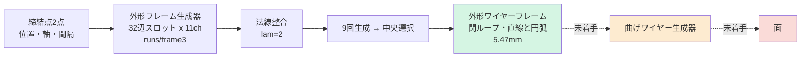

# 知識ベース — ここから読む

締結点2点のみから板金中立面のワイヤーフレームをE2E生成する研究の、全知見の索引。
**この KB を上から順に読めば、過去の全経緯にキャッチアップできる**ように書いてある。

Date: 2026-08-30
Branch: `feat/softmin-guidance-poc`

---

## 読む順序

| # | ファイル | 何が書いてあるか | 誰が読むべきか |
|---|---|---|---|
| 1 | [01_task_and_data.md](01_task_and_data.md) | 課題定義、データ、**情報限界**、入力に何が入っているか | 全員。最初に読む |
| 2 | [02_architecture.md](02_architecture.md) | 現在のアーキテクチャ(mermaid)、各器の責務 | 実装する人 |
| 3 | [03_representations.md](03_representations.md) | **本研究の中心的な物語**。表現をどう変えてきたか | 全員 |
| 4 | [04_experiment_ledger.md](04_experiment_ledger.md) | 試した施策の全記録(目的/結果/原因/採否) | 新しい案を出す前に |
| 5 | [05_measurement_pitfalls.md](05_measurement_pitfalls.md) | **指標が嘘をついた事例集**と、方法論上の誤り | 評価する人。必読 |
| 6 | [06_status_and_numbers.md](06_status_and_numbers.md) | 現在の数値、チェックポイント、再現コマンド | 引き継ぐ人 |
| 7 | [07_plan_8h.md](07_plan_8h.md) | 分岐付き作業計画 | 次に作業する人 |

---

## 3行でいうと

1. **表現に性質を埋め込むと勝ち、損失に書くと負ける。** 閉じたループ・線らしさ・平面性のすべてでこのパターンが再現した。
2. **数値は3回嘘をつき、絵は5回真実を見せた。**ただし絵も2回嘘をついた(存在しない欠陥を見せた)。両方必要。
3. **現状の誤差はモデルの当てはめ不足ではなく条件の情報不足。**過学習ゼロ、訓練誤差>検証誤差。効く手は条件を増やすことだけ。

---

## 現在地(2026-08-30)

**完了**: 外形のパラメトリック生成(閉ループ保証、CADに直接渡せる形)
**進行中**: 一括生成器の点群を条件に加える往復構成
**未着手**: 曲げワイヤー(点群方式は破綻済み、フレーム方式は未試行)、面

---

## 過去の資料(統合前)

この KB は以下を統合・要約している。原典が必要なときだけ参照。

| 資料 | 位置づけ |
|---|---|
| `docs/research_log.md` | 施策ごとの生ログ。KB 04 の原典 |
| `docs/staged_generator_design.md` | 段階生成器の設計判断。KB 02 の原典 |
| `docs/stage2_bend_result.md` | 曲げ点群方式の詳細。KB 04 に要約 |
| `docs/loop_architecture_proposal.md` | 2周ループ構成の検討 |
| `docs/session_knowledge_202608.md` | セッション知見 |
| `docs/current_architecture.md` | 旧アーキテクチャ図 |
| `docs/progress_202608.md` | 進捗ログ |
| `docs/architecture_survey_202608.md` | 2025-26サーベイ |
| `docs/frontier_gaps_and_reform.md` | 改革案 |
| `docs/final_wireframe_theory.md` ほか cae_*, fable5_*, plan_* | **歴史的資料**。現行設計には直接つながらない |

`~/.claude/projects/.../memory/MEMORY.md` にも横断的な知見がある(CATIA COM、hole_filler、包絡条件のリーク等)。
