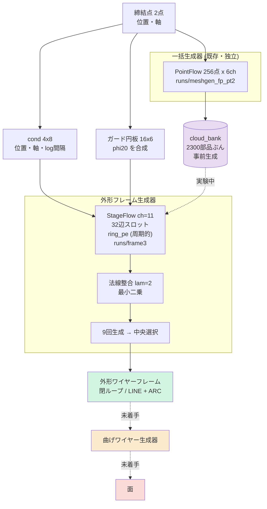
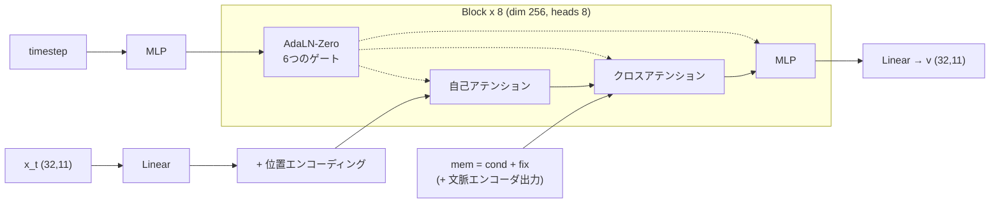

# 2. アーキテクチャ

## 2.1 全体



## 2.2 外形フレーム生成器 — 現行の主力

**表現: 32辺スロット x 11ch。**

```
[0:3]   角の xyz              辺 i は 角 i から 角 i+1 へ
[3:6]   円弧の膨らみ           弧の中点を「弦の中点から」測った差分
[6]     is_arc
[7]     unused                 使っていないスロット
[8:11]  パネル法線             その辺が囲む面の法線。折り目上では零ベクトル
```

構造的に保証されること:

| 性質 | なぜ無料か |
|---|---|
| **閉ループ** | 順序付きリング。辺 i は 角 i→i+1 と決まっている |
| **接続を生成しなくてよい** | 上に同じ。参照インデックスの生成が不要 |
| **線らしさ** | 辺そのものを出すので滲みようがない |
| **上限がない** | 平面数はスロットではなく辺に乗るので、パネル数も締結点数も伸びる |

**正準化**: 閉ループには自然な始点がない。フレーム第1軸方向に最も進んだ角を
スロット0 にし、第3軸まわりに正の向きに回るよう向きを揃える。これがないと
モデルは部品ごとに任意の回転を形の上に重ねて学習することになる。

> 実装の罠: 辺のループを反転すると辺がずれる。反転後の辺 i は元の角 i+1 から
> 始まるので、配列を1つ roll する必要がある。間違えると角と膨らみの対応が壊れる。

**膨らみを弦の中点からの差分にする理由**: 直線なら零、緩い弧なら小さい値になり、
チャネルが「直線からの逸脱」だけを運ぶ。絶対座標だと部品の位置を再符号化してしまう。

## 2.3 モデル本体 (`StageFlow`)



flow matching。CFG 脱落 0.1、生成時 24ステップ、CFG スケール 1.0。

**クロスアテンションは無条件で実行する。**以前これを「前段があるときだけ」に
していたため、第1段が締結点の情報を一切受け取らず、データセットの平均外形を
出していた。→ [[04_experiment_ledger]]

### 位置エンコーディング

| 段 | 種類 | 理由 |
|---|---|---|
| 外形(点/フレーム) | `ring_pe` **周期的** | 閉ループ。スロット0と n-1 は隣 |
| 曲げストランド | `strand_pe` **非周期** | 開いた線分。最初と最後は「2つの端」 |
| 面 / 素の点群 | なし | 順序に意味がない |

`strand_pe` は前半チャネルが本の中の位置、後半が本の番号。等比の周波数列を使う
(線形の周波数列は高調波がエイリアスして全スロットが等距離になり、何も符号化しない)。

## 2.4 後処理

### 法線整合 (`consistent_corners`, lam=2)

モデルは**平面を正しく知っている**(出力法線は教師から 3.8°、パネル数も一致)が、
**自分の角がその平面に乗っていない**(6.7°ずれ)。2つの出力チャネルが矛盾している。

最小二乗で、元の角の近くに留まりつつ、各辺の窓の角が同じ `n·q` を持つよう解く。
**外から知識を足していない** — モデル自身の出力が既に含意している角を求めるだけ。

| lam | ねじれ | 形状誤差 |
|---|---|---|
| 0 | 0.367mm | 7.31mm |
| 1 | 0.103mm | 7.30mm |
| **2** | **0.067mm** | **7.22mm** |
| 3 | 0.051mm | 7.54mm |

### 中央選択 (`medoid`, K=9)

9回生成し、他の8つに最も近いものを1つ選ぶ。**平均ではなく選択**なので、
選ばれたフレームは無改変で、閉ループ等の保証をすべて保つ(25/25で検証済み)。

| | |
|---|---|
| 単発 | 7.77mm |
| **9回の中央** | **5.47mm** |
| 9回の最良(オラクル、到達不能) | 4.12mm |

## 2.5 一括生成器 (`meshgen_fp_pt2`) — 独立、参照用

| | 教師 | 生成 |
|---|---|---|
| 点数 | — | 256点(48ステップ、cfg 1.5) |
| 面の厚み | 0.78mm | **0.63mm**(教師より薄い) |
| 空間的な広がり | 63.9mm | 64.5mm(1%以内) |
| 点間隔 | — | 3.29mm |
| 種違いの生成同士の差 | — | 5.62mm |

**シルエット(低周波)は捉えている。辺の位置(高周波)は出せない。**
外形生成器とは現時点で**接続されていない**。往復構成で繋ぐのが次の一手。

## 2.6 廃棄されたアーキテクチャ

| 構成 | なぜ廃棄したか |
|---|---|
| 生成器→分類器→抽出器の2周ループ | 段がクラスを決めるので分類器が不要になった。ループの価値は「選択」であって情報蓄積ではないと判明 |
| 曲げの素の点群 (`bend_pc`) | 線にならず滲む。→ [[03_representations]] |
| 曲げの 32x20 スロット | 動くが上限が固定で拡張性がない。配置も崩れる |
| 自己回帰(頂点列+参照) | 個数・順序・参照・停止トークンの組み合わせ構造で破綻 |
| 包絡フレーム | 教師の bbox を渡していた。リーク |
