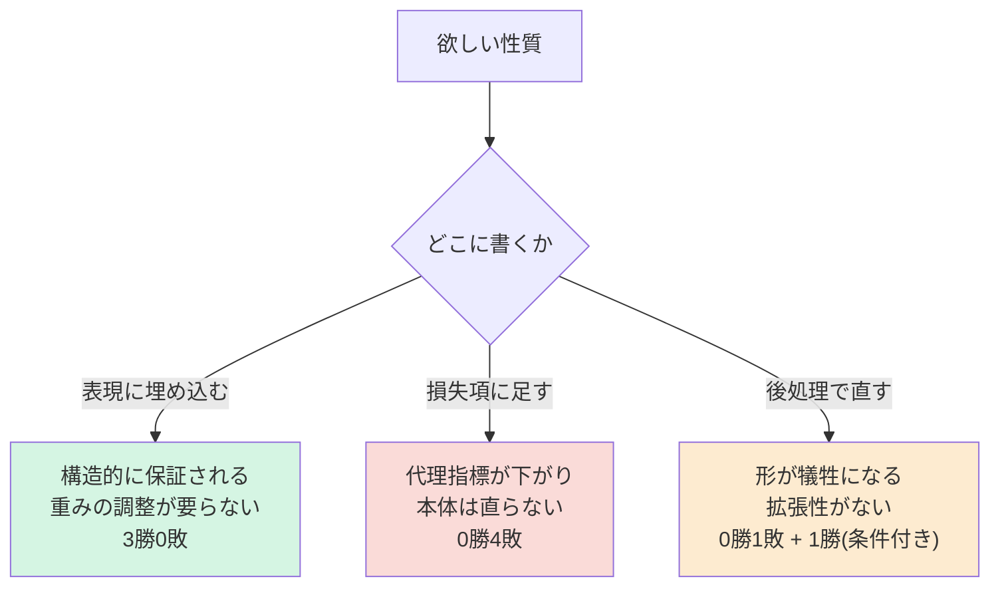

# 3. 表現の変遷 — 本研究の中心的な物語

**この文書が KB の核心。**個々の施策より、ここに書かれた1つの原則のほうが価値がある。

---

## 3.0 原則

> **性質は表現に埋め込め。損失に書くな。**

この形で3回勝ち、逆をやって4回負けた。例外は見つかっていない。

---

## 3.1 第1幕 — 点群では閉ループが作れない

**症状**: 外形の生成点群が「帯」になる。端点の割合が 65〜70%。

**4つの原因が積み重なっていた。全部、数値ではなく絵から見つかった。**

| # | 原因 | 修正 | 端点 |
|---|---|---|---|
| 1 | 目標の点密度が **70倍** 不均一(LINE は 35.7mm に2点、ARC は 15.6mm に33点) | 弧長で再サンプル | 65-70% → 53-60% |
| 2 | **段に条件が一切届いていない**(`Block.forward` がクロスアテンションを条件分岐していた) | クロスアテンションを無条件化 | → 53-62% |
| 3 | 点が曲線に沿って**順序付いていない**(`curve_points` は辺ごとに連結するだけ) | `ordered_outline` で辺を辿る | → 15.3% |
| 4 | **点集合は帯を許す**(置換同変な集合に閉ループを強制できない) | **順序付きリング** + `ring_pe` | → **2.2%** |

原因4が本質。1〜3を全部直しても、表現が点集合のままなら帯になりうる。

**教訓**: `smooth_curve` を順序なしの点に適用したら曲率が 0.98→4.38 と**悪化**した。
`np.roll` が無関係な点どうしを繋いだため。曲線を扱う処理は全部、traversal を要求する。

---

## 3.2 第2幕 — 曲げ線: スロット足場は動くが伸びない

外形が解けたので同じ発想を曲げに適用。**32本 x 20点のストランド**。

うまくいったこと:
- `strand_pe`(非周期の位置エンコーディング)を入れると損失 0.114→0.045、
  フラグ誤り 29.9%→15.0%。**入れる前は自明な基準(全スロット使用=19%)より悪かった。**
- 「外形を条件に入れると効く」は成立(潰すと被覆3.76倍、フラグ1.56倍、直線性2.24倍悪化)

うまくいかなかったこと:
- **絵で見ると配置が崩れている。**長さ・直線性・対の間隔・方向の数は教師とほぼ同等
  なのに、絵は明らかに違う。→ [[05_measurement_pitfalls]]
- **32枠は既に足りていない。**13.4% の部品が超過(最大40本)。上限を48にすると
  アテンションが 2.25倍。中央値の部品は26本しか使わないのに全部品が最悪ケースの
  費用を払う。

### 素の点群 (`bend_pc`) を試した → 失敗

スロット足場を外し、300点の素の点群にした。**2.1倍速く学習できるが、出力は
線ではなく滲んだ塊。**第1段が順序付きリングを得る前と同じ失敗。

**この否定的結果が、フレーム方式に進む決め手になった。**

---

## 3.3 第3幕 — パラメトリックフレーム(現行)

ユーザー発案: **点をサンプリングするのをやめ、ワイヤーフレームの端点と辺の型を出す。**

なぜこれが効くか:

> 点は「線の上に乗れ」を**学習しなければならない**。辺は線であることが**定義**。

データが後押しした:

| | 点群方式 | フレーム方式 |
|---|---|---|
| 表現の大きさ | 300点 x 7ch = 2100 | **32枠 x 11ch = 352** |
| 学習速度 | 38秒/epoch | **4.3秒/epoch** |
| 端点の割合 | 0.020 | **0.000** |
| 教師からのずれ | 8.08mm | **6.84mm** |

閉ループなので**接続を生成しなくてよい**。以前の自己回帰路線を潰した組み合わせ
構造(個数・順序・参照・停止トークン)が丸ごと消える。

---

## 3.4 第4幕 — 平面性: 表現に載せる vs 後処理

**症状**: 平らになるはずのパネルがねじれる。教師 0.004mm に対し生成 0.368mm(90倍)。

### 試行1: 平面リストを固定枠で持つ → 却下

`MAX_PLANES=4` + 手動許容値でスナップ。**ねじれはゼロになるが形が 0.34mm 遠ざかる。**
さらにデータでは辺法線が最大10種類あり、**4枠では今のデータですら足りない。**

### 試行2: 法線を教師付けするだけ → 失敗

チャネルを +3 して法線を目標に加えた。**ねじれ 0.365→0.352(4%)、形状は悪化。**
法線がただの追加チャネルで、**自分が出した角と結びついていない。**

### 試行3: モデル自身の法線に角を整合させる → 成功

診断で分かったこと:

| | |
|---|---|
| 出力法線 vs **教師の法線** | **3.8°** |
| 出力法線 vs **自分が出した角** | **6.7°** |

**モデルは平面を知っていた。使っていなかっただけ。**最小二乗で角を法線に整合
させると、lam=2 で **ねじれ 5.5分の1、形状はむしろ改善**(7.31→7.22mm)。

**拡張性の鍵**: 平面を**辺に載せた**こと。パネルは「同じ法線を共有する辺の連なり」
として創発するので、平面数に上限がなく、締結点の数もどこにも現れない。

---

## 3.5 次: 曲げワイヤーをフレーム方式で

**曲げ点群は破綻済み。フレーム方式は未試行。**

外形と違う点、設計で扱う必要があるもの:

| | 外形 | 曲げ |
|---|---|---|
| 位相 | **1つの閉ループ** | **複数の開いた線分** |
| 接続 | 順序付きリングで無料 | **無料にならない** ← 最大の課題 |
| 本数 | 18(最大26) | 15(統合後、最大24) |
| 浮遊 | 起こりえない(閉じている) | **起こりうる** ← ユーザー指摘 |

「浮遊したワイヤーが出ない工夫」が要る。候補は [[07_plan_8h]] に。
