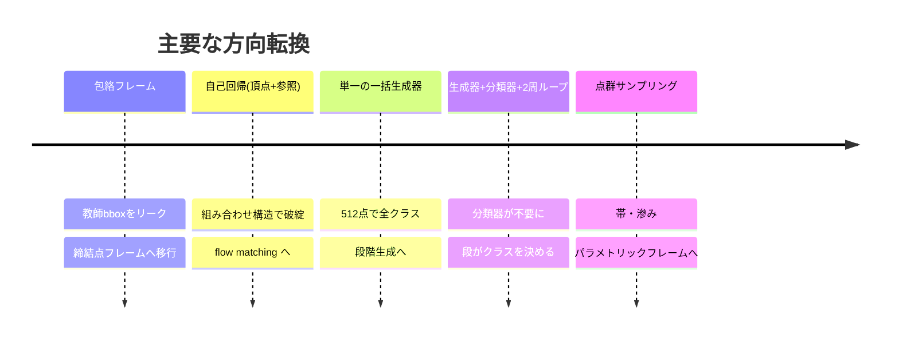

# 4. 施策台帳 — 何を、なぜ、結果は、なぜそうなったか

**新しい案を出す前にここを見る。**同じ失敗を2度している例が複数ある。

凡例: ✅採用 / ❌破棄 / ⏸保留

---

## 4.1 表現

| # | 施策 | 目的 | 結果 | 原因 | 判定 |
|---|---|---|---|---|---|
| R1 | 順序付きリング + `ring_pe` | 外形の帯を止める | 端点 53%→**2.2%** | 点集合は閉ループを表現できない。順序が構造を与える | ✅ |
| R2 | 正準始点+向き | スロット0の意味を揃える | 学習が安定 | 閉ループに自然な始点はない。揃えないと部品ごとの任意回転を上乗せして学習 | ✅ |
| R3 | 弧長で再サンプル | 密度70倍差の解消 | 端点 65→53% | LINE 2点/35.7mm vs ARC 33点/15.6mm | ✅ |
| R4 | パッチ正規化(中心化・自分の点間隔で正規化・法線整列) | 尺度・密度不変 | 分類器 AUC 0.99 | 段ごとに密度が変わる構成では絶対距離は使えない | ✅ |
| R5 | 曲げの 32x20 スロット | 曲げに1次元性を与える | 動くが上限固定。13.4%の部品が超過 | 点で1次元性を「買い戻す」足場。辺を出せば不要 | ⏸ |
| R6 | 曲げの素の点群 `bend_pc` | スロット足場の除去、拡張性 | **滲んだ塊。線にならない** | 順不同集合への flow matching はぼやけた密度を出す | ❌ |
| R7 | **パラメトリックフレーム**(角+辺型) | 線らしさを構造で保証 | 端点 **0.000**、6.84mm、9倍速 | 辺は線であることが定義。学習で獲得する必要がない | ✅ |
| R8 | 辺ごとのパネル法線 | 平面性を表現に載せる | 単体では効かないが整合解の材料になる | 法線と角が結びついていない | ✅(R14と組) |
| R9 | 折り線への対統合 | 曲げ本数を減らす | 24→15本、最大40→24 | bend_line は折りの2本の接線。1折り=2本 | ⏸ 未実装 |

## 4.2 条件付け

| # | 施策 | 目的 | 結果 | 原因 | 判定 |
|---|---|---|---|---|---|
| C1 | 締結点フレーム | 包絡リークの除去 | リーク解消 | 教師 bbox を座標系に使っていた | ✅ 必須 |
| C2 | アンカー凍結 | 締結点を通す | FIX 誤差 **0.00mm** | | ✅ |
| C3 | ガード円板 phi20 | 締結点を「引き伸ばす」 | 240サイトで 0.00mm / 0.0° | ボルトは軸に垂直な平座面を要求する | ✅ |
| C4 | クロスアテンションの無条件化 | 第1段に条件を届ける | 平均外形しか出さない状態を解消 | 「前段があるとき」に条件分岐していた | ✅ |
| C5 | 外形を曲げの条件に | 段の直列化 | 潰すと被覆3.76倍悪化 | 情報が実際に増えている | ✅ |
| C6 | **自己条件付け**(自分の出力を確定して再入力) | 情報の蓄積 | 3設定すべて失敗。8.51→8.68mm | **自分の点に新しい情報がない** | ❌ |
| C7 | 2周ループ(確定20%) | 精度向上 | 価値は「選択」であって蓄積ではない | 真の点なら3.92mm、自分の点なら8.68mm | ⏸ |
| C8 | 一括生成器の点群を外形の条件に(固定1バンク) | 条件の情報を増やす | **❌ 中央選択 5.47→7.57mm** | 固定した点群は証拠ではなく第2の教師になり、その誤差5.62mmを継承する | ❌ |
| C9 | 同上(2バンク + 脱落0.25) | 露出バイアスの回避 | **❌ 点群を潰しても不変** | モデルが点群を無視した | ❌ |
| C10 | **段の直列化(外形→曲げ)** | 曲げの浮遊防止 | **✅ 潰すと38%が部品外に** | 外形は締結点から導けない設計上の決定を含む | ✅ |

## 4.3 損失・目標

| # | 施策 | 目的 | 結果 | 原因 | 判定 |
|---|---|---|---|---|---|
| L1 | 密度均一化の損失項 | 点間隔のばらつき解消 | **2度失敗** | 代理指標は下がるが本体は直らない | ❌❌ |
| L2 | 曲率制約を**目標に**適用(`smooth_curve`) | ぎざぎざの抑制 | 効いた | 目標が既に満たしていれば、当てはめたモデルが性質を継承する。重み調整が不要 | ✅ |
| L3 | 法線を教師信号に追加するだけ | ねじれの抑制 | **ねじれ4%減、形状は悪化** | 出力チャネル間に結合がない | ❌ |
| L4 | 外れ値チャネル | はみ出し検出 | AUC 0.872→0.928 | クリーンデータに外れ値がないので注入して学習 | ✅ |
| L5 | チャネル別重み(位置1.0/方向0.2/フラグ0.5) | 膨らみが埋もれるのを防ぐ | 妥当 | | ✅ |

## 4.4 後処理

| # | 施策 | 目的 | 結果 | 原因 | 判定 |
|---|---|---|---|---|---|
| P1 | `clean_loop`(フーリエ低域通過+弧長再配置) | 点群外形のぎざぎざ | 端点をゼロに | 閉ループはフーリエ級数を持つ。真の外形は84.6%が低域 | ✅(点群方式用) |
| P2 | 平面スナップ(固定4枠+手動許容) | ねじれ抑制 | ねじれ0だが**形が0.34mm悪化** | 平らさを形の正しさと引き換えに買っただけ。かつ拡張性なし | ❌ |
| P3 | **法線整合の最小二乗** lam=2 | ねじれ抑制 | **ねじれ5.5分の1、形状は微改善** | モデル自身の出力が含意する角を求めるだけ。外から知識を足さない | ✅ |
| P4 | **中央選択 K=9** | 分散の削減 | **7.77→5.47mm** | 混ぜずに選ぶので構造保証を保つ | ✅ |
| P5 | 多項式ワープ(真の外形→生成外形) | 曲げ目標を生成外形に整合 | 3次で差の98%を説明 | 両者は正準始点を持つ順序付きリングなので点が対応する | ✅(曲げ用) |
| P6 | 中央選択を曲げに適用 | 折りの短さとばらつき | 位置 4.8→3.8mm、外形との距離が教師に近づく | 長さは部分的にしか戻らない | ✅ |
| P7 | 10mm未満の生成折りを除去 | 折りの長さ | **長さは改善、教師の被覆は 5.1→6.7mm 悪化** | 短い折りと一緒に本物も消す。削除で数値を作っている | ❌ |

## 4.5 生成時の設定

| 項目 | 値 | 根拠 |
|---|---|---|
| ステップ数 | 24 | 計算量0.5倍で劣化なし |
| CFG(点群外形) | 1.0 | 2.0 は過大化。周長1.070→0.993 |
| CFG(フレーム) | 1.0〜1.6 | 1.3-1.6 が単発では最良だが差は小さい |
| 中央選択 K | 9 | 5では不足(基準を任意の1回に取ると過小評価する) |
| lam(法線整合) | 2 | 3回の抽出で1,2,3,5を比較 |

## 4.6 大きな方向転換の履歴

