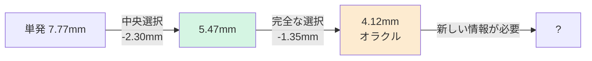

# 6. 現在の数値と再現手順

Date: 2026-08-30 / Branch: `feat/softmin-guidance-poc`

---

## 6.1 外形フレーム生成器 — 現行最良

**チェックポイント**: `runs/frame3/best.pt`(epoch 250、1000部品、11ch、CFG 1.0)

| 指標 | 値 | 比較対象 |
|---|---|---|
| **端点の割合** | **0.000** | 300点版 0.023 |
| 教師からのずれ(単発) | 7.77mm | 情報限界 14.9mm |
| **教師からのずれ(9回中央選択)** | **5.47mm** | |
| 9回の最良(オラクル、到達不能) | 4.12mm | |
| ねじれ(lam=2) | 0.067mm | 教師 0.004mm、素の生成 0.367mm |
| 辺数の誤差 | 9.5% | |
| 円弧比率の教師比 | +0.0pt | |
| 自己交差 | 0% | 教師 0% |
| 周長比 | 1.015 | |
| 学習速度 | 4.3秒/epoch | 300点版 38秒 |

### 誤差の分解(30部品 x 9回)



**7.77mm のうち 3.65mm は「選べていない」分。**モデルは9回のうちに 4.12mm の形を
実際に描いている。どれが正しいか判断できていないだけ。

### データ増・パラメータ増は効かない

| | 教師との誤差 | 種違いの生成同士の差 |
|---|---|---|
| **訓練**部品 | **9.03mm** | 7.83mm |
| **検証**部品 | **7.44mm** | 6.61mm |

**訓練誤差のほうが大きい = 過学習ゼロ。**データを足す先がない。訓練誤差も
下がっていないので容量不足でもない。**効く手は条件を増やすことだけ。**

## 6.2 一括生成器

**チェックポイント**: `runs/meshgen_fp_pt2/best.pt`(epoch 100、256点、6ch、48ステップ、CFG 1.5)

| | 教師 | 生成 |
|---|---|---|
| 面の厚み | 0.78mm | **0.63mm** |
| 空間的な広がり | 63.9mm | 64.5mm |
| 点間隔 | — | 3.29mm |
| 種違いの分散 | — | **5.62mm** |

**分散 5.62mm は外形生成器の 6.61mm より小さい。**一括生成器は外形生成器が
持っていない情報を持っている。→ 往復構成の根拠。

**点群バンク**: `runs/cloud_bank/<part>.npy`、(256, 6) = xyz + 法線、締結点フレーム。
2300部品ぶんを固定種で1回だけ生成。

## 6.3 曲げ

| 方式 | チェックポイント | 状態 |
|---|---|---|
| 32x20 スロット | `runs/stage2_bend/best.pt`(ep40) | 動くが配置が崩れる。拡張性なし |
| 素の点群 | `runs/stage2_bendpc/best.pt`(ep50) | **破綻**(滲んだ塊) |
| **フレーム方式** | — | **未着手** |

## 6.4 その他のチェックポイント

| run | 内容 |
|---|---|
| `runs/stage1_1k/best.pt` | 点群方式の外形(ep65、300点)。フレーム方式の比較対象 |
| `runs/frame1` `runs/frame2` | フレーム方式の 8ch 版(法線なし)。frame2 ep260 が 8ch 最良 |
| `runs/frame3` | **現行最良**。11ch(法線あり) |

## 6.5 再現コマンド

```bash
export PYTHONPATH=cae_mesh_generator/src
export KMP_DUPLICATE_LIB_OK=TRUE

# 自己チェック
python -m cae_mesh_generator.wtok.frame          # 表現の往復
python -c "from cae_mesh_generator.wtok.frame import consist_demo; consist_demo()"
python -c "from cae_mesh_generator.wtok.staged import pe_demo; pe_demo()"
python -m cae_mesh_generator.wtok.validity       # 妥当性検査

# 外形フレームの学習
python -m cae_mesh_generator.wtok.staged --stage outline_frame \
  --dataset runs/mesh_synth --wtok runs/wtok_synth \
  --val-list runs/wtok_curve_synth_v1/val_names_100.json \
  --output-dir runs/frameN --train-parts 1000 --val-parts 50 \
  --epochs 300 --batch-size 16 --dim 256 --layers 8 --heads 8 \
  --cfg-scale 1.0 --probe-every 10 --probe-parts 16

# 一括生成器の点群を条件に加える(往復構成)
#   ... 上に --cloud-bank runs/cloud_bank を追加

# 評価
python -m cae_mesh_generator.wtok.frame_eval --frame-ckpt runs/frameN/best.pt
python -m cae_mesh_generator.wtok.bend_eval    # 曲げ(スロット方式)
```

## 6.6 コード地図

| ファイル | 役割 |
|---|---|
| `wtok/frame.py` | **パラメトリックフレーム**。表現、法線、整合解、中央選択 |
| `wtok/staged.py` | 段の学習基盤。`StageFlow`、`StageDataset`、`sample`、CLI |
| `wtok/frame_eval.py` | フレーム vs 点群の比較 |
| `wtok/bend_eval.py` | 曲げの条件付け効果の検証 |
| `wtok/meshgen.py` | 一括生成器。締結点フレーム、リーク検査 |
| `wtok/validity.py` | 可展性・パネル数・閉ループ性 |
| `wtok/kernel.py` | 局所空間カーネル、パッチ正規化 |
| `wtok/ridge.py` | 曲線点の抽出、弧長再サンプル |
| `wtok/codec.py` | 辺の実現(LINE/ARC/CIRCLE) |

## 6.7 直近のコミット

```
96310b0 fix: consistency lambda 3 -> 2, chosen on three draws not two
580beb2 feat: per-edge panel normals, and corners solved consistent with them
75e15b1 feat: parametric outline frame -- corners and edge types, not samples
17b5e71 feat: bend_pc -- plain point cloud bend stage (negative result)
e4e21cd feat: stage 2 bend generator (strands, target warp, strand PE)
```
