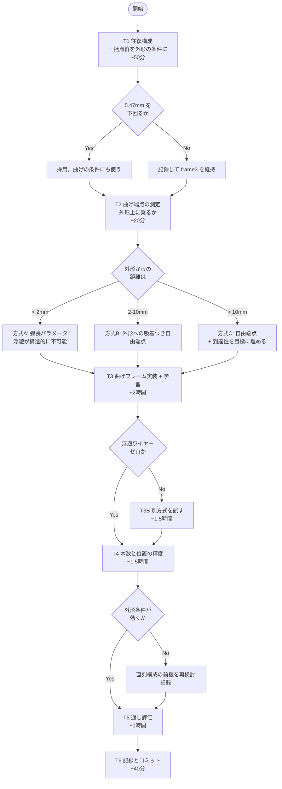

# 7. 作業計画(8時間、分岐付き)

Date: 2026-08-30 夜間
方針: **各施策に合否判定を先に置き、結果で分岐する。**行き詰まったら記録して次へ。
勝手にブランチを切り替えない。長時間GPUジョブは既存の枠内で回す。

---

## 全体の分岐図



---

## T1 往復構成 — 一括生成器の点群を外形の条件に(~50分)

**根拠**: 一括生成器の分散 5.62mm < 外形生成器の 6.61mm。一括生成器は外形が
持っていない情報(部品の広がり)を持っている。全体寸法は教師比1%以内。

**実装済み**: `--cloud-bank runs/cloud_bank`。`cross=True` になり文脈エンコーダが付く。
点群は**固定種で1回だけ生成したもの**を使う(教師の点群ではない。推論時に実際に
渡されるものを読む訓練をさせる)。

```bash
python -m cae_mesh_generator.wtok.staged --stage outline_frame \
  --cloud-bank runs/cloud_bank --output-dir runs/frame4 \
  --train-parts 1000 --epochs 300 --batch-size 16 --cfg-scale 1.0 ...
```

| 判定 | 条件 | 次の行動 |
|---|---|---|
| ✅ | 9回中央選択で **5.47mm 未満** | 採用。曲げの条件にも点群を渡す |
| ⏸ | 同等(±0.3mm) | 記録。frame3 を維持。条件の情報が足りないことの追加証拠 |
| ❌ | 悪化 | 記録。露出バイアス(点群を信用しすぎ)を疑い、点群脱落率を入れて1回だけ再試行 |

**必ず条件あり/なしの対比で測る。**単独の数値では判定しない。

---

## T2 曲げ端点は外形に乗るか(~20分)

**これが曲げの表現を決める。**

板金の折りは、板の一方の端から他方の端まで走る。もしそうなら、**曲げ線は外形上の
2点で決まる** — 弧長パラメータ2つ。これなら**浮遊が構造的に起こりえない。**

測ること:

1. 真の曲げ線(10mm以上、対統合後)の端点から外形までの距離
2. 両端とも外形上か、片端だけか
3. 外形の弧長パラメータで表したときの分布

| 距離 | 採る方式 |
|---|---|
| < 2mm | **方式A**: 弧長パラメータ (s1, s2) + is_arc + 膨らみ |
| 2〜10mm | **方式B**: 自由端点 + 外形への吸着(法線整合と同じ発想) |
| > 10mm | **方式C**: 自由端点 + 「外形からの距離」を目標チャネルに埋める |

---

## T3 曲げフレームの実装と学習(~2時間)

**共通の設計**

```
24スロット x Nch          最大24本(対統合後の実測最大)
  方式A: [s1, s2, is_arc, bulge_scalar, unused]      = 5ch
  方式B/C: [p1(3), p2(3), is_arc, bulge(3), unused]  = 11ch
位置エンコーディング: なし(本の間に順序はない)か、長さ順の正準順序
条件: 締結点 + 外形フレーム(+ T1が通れば一括点群)
```

**外形は生成されたものを渡す。**教師の外形で学習すると、それを全面的に信頼する
よう学び、生成外形を渡されたときに増幅する。曲げの目標は多項式ワープ(3次で
差の98%を説明)で生成外形に整合させる。→ [[04_experiment_ledger]] P5

**浮遊対策の候補**(方式によらず併用可):

| 手 | 内容 | 根拠 |
|---|---|---|
| 到達性チャネル | 各端点の「外形までの距離」を目標に持たせる | 法線を持たせたのと同じ発想。ただし単独では効かなかった前例あり(L3) |
| 整合解 | 生成後、端点を外形に最小二乗で吸着 | P3 と同じ形。モデル自身の出力から解く |
| 正準順序 | 長さ順に並べる | スロットに意味を与える |

**判定**

| | 条件 |
|---|---|
| ✅ 浮遊ゼロ | 全端点が外形から(教師の分布の p95)以内 |
| ✅ 線らしさ | 各曲げ線が直線か円弧に乗る(残差が教師と同等) |
| ❌ | 上のどちらかが崩れたら T3B へ |

---

## T3B 別方式(~1.5時間、T3が失敗した場合のみ)

T3 で採った方式以外を1つ試す。優先順:

1. **方式A が失敗** → 方式B(自由端点+吸着)
2. **方式B/C が失敗** → 方式A(弧長パラメータ)
3. **両方失敗** → 折り線への対統合(R9)を先に入れて本数を減らしてから再試行

---

## T4 本数と位置の精度(~1.5時間)

- 本数の誤差(外形の 9.5% が目安)
- 外形条件の有無で差が出るか(**直列構成の前提。差が出なければ設計を見直す**)
- 中央選択 K=9 が曲げにも効くか
- 一括点群の条件が効くか(T1 が通った場合)

**必ず絵で確認する。**→ [[05_measurement_pitfalls]]。斜めからの角度、部品ごとに枠を
詰める、教師と重ねる。太さを揃える(細線同士。太いグレーの下に細線を置くと
偽の「内側寄り」が見える)。

---

## T5 通し評価(~1時間)

締結点 → 外形フレーム → 曲げフレーム を通し、

- 外形と曲げが整合しているか(曲げ端点が外形上、法線が一致)
- 妥当性検査(可展性、パネル数、自己交差)を教師と比較
- 従来の 2周ループ構成との比較

---

## T6 記録とコミット(~40分)

- KB の 04(台帳)、06(数値)を更新
- 新しい落とし穴があれば 05 に追記
- 施策ごとにコミット。**否定的結果も残す**(`bend_pc` と同じ扱い)

---

## 守ること

- **絵と数値の両方を見る。**どちらか一方で結論を出さない
- **設定は複数抽出で選ぶ。**±0.2mm のノイズがある
- **既存の成果物を消さない。**新しい run ディレクトリを切る
- **想定外の失敗が起きたら、勝手に方針転換せず記録して次のタスクへ**
- 損失が下がっても合格とはみなさない。合格条件は別に置く
