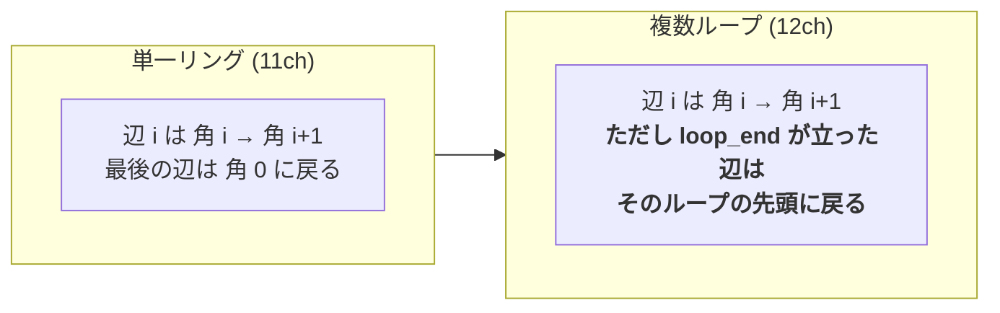

# 9. 表現の一般化 — 穴・ビード・新クラスへの備え

Date: 2026-08-30
きっかけ: ユーザー指摘「教師データの曲げ線が網羅していない」「多様化した部品で動くのか」

---

## 9.1 何が足りなかったか(実測)

### データに存在するクラスは2種類だけ

```
edge classes : {'outer_boundary': 40354, 'bend_line': 136466}
vertex types : {'FIX', 'END', 'MID'}
```

穴・ビード・ルーバー・エンボス・コーナー処理を表すクラスは**1つも無い**。

### 曲げ線がパネルを分けきれていない

| | 中央値 | p90 | 最大 |
|---|---|---|---|
| 表面から検出される平面パネル | **18** | 32 | 40 |
| `bend_line` の折り(対統合後) | **14** | 19 | 22 |

N枚のパネルには最低 N-1 本の折りが要る。足りない。

> パネル数は法線を15°で束ねた数なので、曲げ円筒の分裂で過大な可能性がある。
> そこで曲げ近傍を除外した測定も行った:
> **表面の 7.8%(p90 15.1%)が、曲がっているのに、どの曲げ線からも15mm以上離れている。**

### 境界ループは全部品で1本

```
outer_boundary vertices with degree != 2 : {0: 400}
loops per part                           : {1: 600}
```

**穴・切り欠き・窓が1つも無い。**

---

## 9.2 アーキテクチャの限界(一般化前)

| 制限 | 固定値 | データ最大 | 余裕 |
|---|---|---|---|
| 外形の辺スロット | 32 | 26 | 19% |
| 曲げスロット | 24 | 24 | 24%(上限を外して測定) |
| 条件行(締結点数) | 3 | 2 | 33% |
| **外形のループ数** | **1** | 1 | **0%** |

**致命的なのは最後。**順序付きリングは閉ループ保証・接続の無料化・線らしさを
すべて生む土台だが、**単一の閉ループを前提**にしている。穴のある部品は境界が
2ループ以上になり、**スロットを増やしても表現できない。**

---

## 9.3 一般化 — 終端フラグで複数ループを表す



`MULTI_CH = 12`、追加チャネル `LOOP_END = 11`。

**各ループが独立に、構造的に閉じる。**順序付きリングを採用した理由(閉ループ保証)を
1本から N 本に広げただけで、性質は失われていない。

正準順序: **外周が先、次に穴を大きい順**。スロット0の意味が全部品で揃う。

`loop` フィールドが抽出から来ればそれを使い、無ければ隣接を辿る(現行データ互換)。

### 曲げ側も同じ仕組みで

`bend_multi_target`、`BEND_CLASSES = (bend_line, bead, inflection, corner_relief)`。

- 直線/円弧の折り = **1スロット**
- **ビード(閉じた輪)= 複数スロットの鎖 + `LOOP_END`**
- クラスは one-hot チャネル

---

## 9.4 検証

| 検証 | 結果 |
|---|---|
| 現行データ(1ループ)でリング表現と一致 | **0.0000mm** |
| 穴付きの合成部品(正方形+正方形の穴) | **2ループ、両方閉じる** |
| 曲げ: 現行データで `bend_frame_target` と一致 | **0.0000mm** |
| 曲げ: 合成ビードの鎖が閉じる | **0.000000** |

### 学習しての回帰確認(val 30部品、K=9)

| | 単発 | 中央選択 | オラクル | 端点 | ループ数 |
|---|---|---|---|---|---|
| frame3(単一リング 11ch) | 7.77mm | **5.47mm** | 4.12mm | 0.000 | 1 |
| multi1(複数ループ 12ch) | 8.38mm | 5.75mm | **3.72mm** | 0.000 | 1 |

**回帰はほぼ無い。**中央選択の 0.28mm 差は ±0.2mm の抽出ノイズと同程度、
オラクルはむしろ改善。端点は両方ゼロ。学習速度も同じ(4.1秒/epoch)。

**穴を表現できる能力を、ほぼ無料で獲得した。**

---

## 9.5 まだできないこと

| | 状態 |
|---|---|
| 穴を**生成**する | 表現はできるが**学習データに穴が1つも無い** |
| ビードを**生成**する | 同上 |
| 変曲・コーナーの曲げ | 同上 |
| 締結点3個以上 | 条件行は3まで。データは常に2 |

**すべてデータ待ち。**→ `docs/requests/2026-08-30_wireframe_extraction.md`

受け入れ条件の中心は、**「曲がっているのに曲げ線から15mm以上離れた表面」が
現在の 7.8% からどこまで下がるか**。
