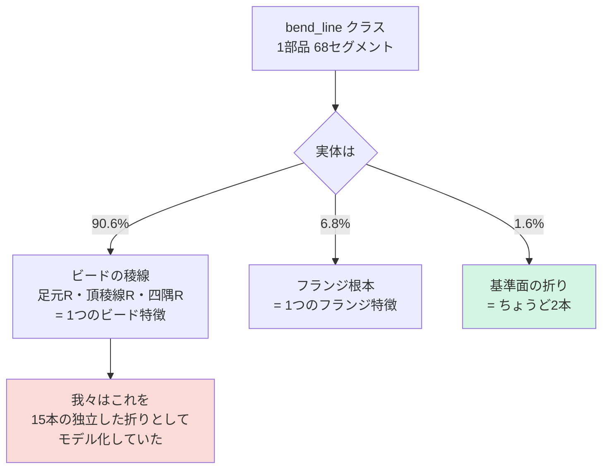

# 10. サイドカーが明らかにしたこと — 曲げ表現は根本的に誤っていた

Date: 2026-08-30
きっかけ: PartMaker 側からの特徴サイドカー提供
場所: `C:\Users\hide2\IdeaBox\PartMaker\synthetic_parts\<group>\features\<part_id>.json`

---

## 10.1 結論

**曲げ生成器が生成していたものの 90.6% は、折りではなくビードの稜線だった。**

| 我々の `fold_lines` の正体 | 本数 | 割合 | 長さ割合 |
|---|---|---|---|
| **ビードの稜線** | 1726 | **90.6%** | 86.2% |
| フランジ | 130 | 6.8% | 11.5% |
| **本物の折り(基準面)** | 30 | **1.6%** | 1.5% |
| 未説明 | 20 | 1.0% | 0.8% |

正解の折り数は **1部品ちょうど2本**(中央値2、最大2)。我々は中央値15本を出していた。
**7.5倍の過大計上**で、その中身はビードのテッセレーション断片だった。



---

## 10.2 正しい表現の規模

サイドカーが与える設計意図:

| 要素 | 数 | パラメータ |
|---|---|---|
| **折り** | ちょうど 2 | `angle_deg`(0.5〜134.6、中央値37.8)、`radius_mm`(10.0〜22.5、中央値14.2)、`tilt_deg`、`sharp_line`(2点)、`tangent_lines`(side 0/1) |
| **ビード** | 0 or 1(400部品中302) | `centreline`、`top_width_mm`、`depth_mm`、`wall_angle_deg`、`ridge_radius_mm`、`corner_radius_mm`、`half_footprint_mm`、`run_out` ほか18項目 |
| **フランジ** | 0 or 1(400部品中98) | `root_curve`、`height_mm`、`root_radius_mm` ほか |
| コーナー逃がし | 0〜数個 | `radius_mm`、`arc` — **外形側の特徴**(外周の余肉カット) |

**24スロット × 11ch = 264個の数**でモデル化していたものが、
**折り2つ + ビード1つ = 30個程度の数**で厳密に書ける。

---

## 10.3 踏んだ罠 — 部品IDが一意ではない

最初のラベル付けで **90.6% が「未説明」**と出た。原因は表現でも座標系でもなく、
**部品IDの衝突**だった。

```
2300 ファイル、固有の stem は 250 個だけ
SYN_general_two_point_0001 → batch02, prod01/chunk_01..06, prod02/chunk_01..04
```

stem をキーにした辞書が上書きされ、**全部品を別部品の特徴と比較していた**。

**正しい結合キーは `source_stp`。**ワイヤーフレーム JSON が元 STP の絶対パスを
持っているので、そこからグループを辿る:

```python
stp = pathlib.Path(wireframe_json["source_stp"])   # .../<group>/mid/<id>_mid.stp
feat = stp.parent.parent / "features" / (stp.stem.replace("_mid","") + ".json")
```

修正後、未説明は **1.0%**(回答書の報告 0% と整合)。

> KB 05 に追加。**「IDが一意だと仮定した」**類の誤りは初出。

---

## 10.4 ラベル付けの方法(PartMaker 側の指示どおり)

- **折り**は線なので `tangent_lines` との距離で厳密照合(許容 2mm)
- **ビード/フランジは曲線照合をしない。**稜線はフットプリント全周の閉ループで、
  曲げフィレットを横断して分割される。**中心線からの距離による領域判定**を使う:

```
ビード由来  ⇔ dist(edge, bead.centreline)   ≤ half_footprint_mm + ridge_setback_mm + 2
フランジ由来 ⇔ dist(edge, flange.root_curve) ≤ root_radius_mm + height_mm + 2
```

先方の実測でも曲線照合は 71.8% 未説明、領域判定で 0% になっている。

- 文字エンコーディングは **UTF-8 を明示**(既定の cp932 では読めない)

---

## 10.5 これが意味すること

**曲げの成果物(`runs/bendframe1`)の評価は、意味を取り違えていた。**

「浮遊ゼロ・本数16本・外形からの距離が教師と一致」という結果は、**ビードの稜線
断片を再現できていた**ことを示すもので、**折りを生成できていたわけではない**。

一方で無駄ではない:

- **パラメトリックフレームという表現の妥当性**は変わらない(閉ループ保証、
  線らしさ、CADに渡せる形)
- **外形条件が浮遊を止める**という発見も変わらない(潰すと38%が部品外へ)
- 表現の器はそのまま、**中身を「汎用の折り線」から「2つの折り + 1つのビード」に
  差し替える**のが次の一手

---

## 10.6 次にやること

1. **曲げ表現の再設計。**汎用の24スロットをやめ、設計意図に沿った形にする:
   - 折り 2 スロット: `sharp_line` 2点 + `angle` + `radius` + `tilt`
   - ビード 1 スロット: `centreline` + 寸法パラメータ
   - フランジ 1 スロット
2. **コーナー逃がしは外形側へ。**曲げクラスではなく `outer_boundary` に現れる
3. `surface_frame` を `SCOPE_CLASSES` に追加(面の段で使う)
4. **サイドカーを教師信号として使う。**先方の指摘どおり「入力」ではなく「教師」
   として自然 — 締結点から導出できない実測値(実際に構築された角度・半径)
