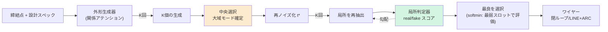
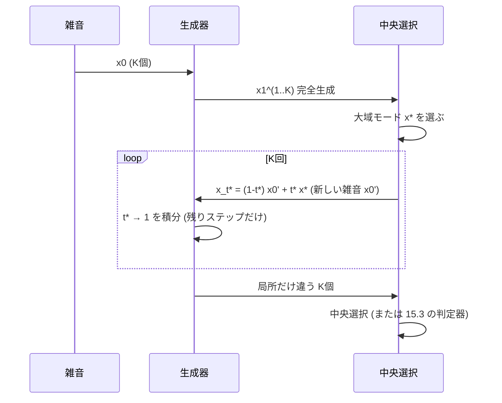
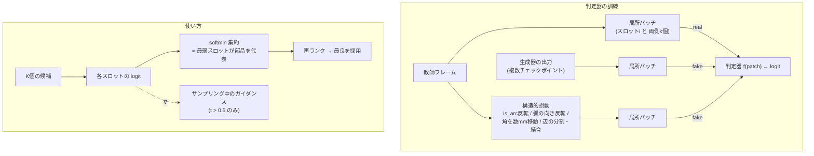
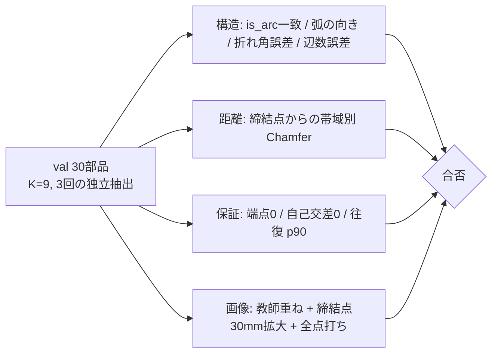
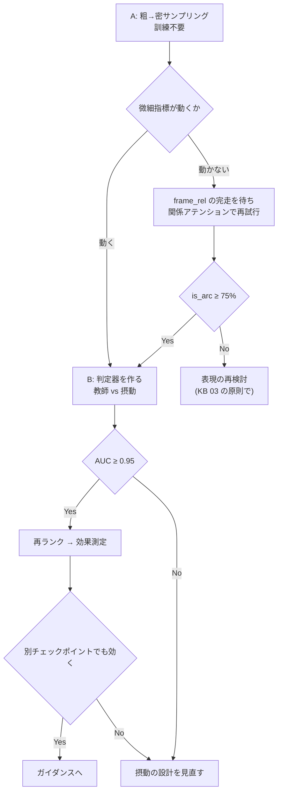

# 15. 微細構造の設計 — 局所整合を「モデルが決め、学習した判定器が検証する」

Date: 2026-08-31
対象: 外形ワイヤー(次に曲げ線)。ミクロで見て構造の破綻(弧の向き・is_arc・角の位置)を無くす。
前提: CLAUDE.md の哲学(性質は表現に、本数と分類は先に決めない、手設計の局所特徴を入れない)。

---

## 15.-2 損失を関係空間で測る — 試して失敗(2026-08-31)

### 動機は正しかった

損失は**スロットごと・チャネルごとの独立な和**で、スロット間の関係を測る項が1つも無い。
実測(270回の生成):

| | 相関 |
|---|---|
| 損失 vs is_arc の一致 | −0.328 |
| **損失 vs 折れ角の誤差** | **+0.060(無相関)** |

**損失を下げても折れ角は良くならない。**判定器も再ランクも、この盲点の下流にあった。

### 修正案(理論的には正しい)

flow matching の損失は予測と目標に**同じ線形変換**を掛けても正当性を保つ。
リング上の差分は線形なので、そのまま入れられる:

```
loss = ‖v−u‖² + λ₁‖D₁v−D₁u‖² + λ₂‖D₂v−D₂u‖²
```

等価な書き方は `(v−u)ᵀ(I + λ₁D₁ᵀD₁ + λ₂D₂ᵀD₂)(v−u)` — **同じ誤差の重み付け直し**であって、
手設計の幾何特徴ではない。

### 結果 — 狙った指標そのものが悪化した

| | is_arc | 弧の向き | **折れ角** | 近傍 | 全体 |
|---|---|---|---|---|---|
| 基準 | 63% | **69%** | **11.7°** | **3.29mm** | **4.51mm** |
| λ=1.0 | 65% | 60% | 16.2° | 7.44mm | 9.13mm |
| **λ=3.0** | 63% | 60% | **18.2°** | 12.06mm | 15.48mm |

**重みを上げるほど悪化。**距離も3倍以上崩れた。

### 診断(実測)

差分項は**少数のスロットに集中する**:

| 項 | 部品ごとの 最大/中央値 |
|---|---|
| 位置 | 1.19 |
| **D1(辺ベクトル)** | **4.71**(p90 **9.05**) |
| D2(折れ) | 2.71(p90 4.77) |

**D1 が最も集中している**(位置の4倍)。長い辺が損失を支配し、短い辺と角の情報が薄まる。
「関係を測る」つもりが「長い辺の長さを測る」になっていた。

### 未検証のまま残る道

- **差分を正規化する**(各辺を自分の長さで割る、あるいは対数を取る)。
  集中の原因は絶対長なので、比で測れば消えるはず。**測っていない。**
- D1 を切って D2 だけにする。D2 の集中は 2.71 と穏やか。**測っていない。**

**動機と理論は生きている。実装の一段目が失敗しただけ。**

---

## 15.-1 実装後の結果(2026-08-31)— A は失敗、B は部分的

**施策C(関係アテンション)は is_arc を +4pt。**63→67%。他は横ばい(弧の向き 69→67%、
折れ角 11.7→12.9°、近傍 3.29→3.40mm)。**唯一、微細指標を動かした施策**だが小さい。

**施策A(粗→密サンプリング)は効かなかった。**

| | is_arc | 弧の向き | 折れ角 | Chamfer |
|---|---|---|---|---|
| 中央選択(基準) | 63% | 69% | 11.7° | 5.62mm |
| t\*=0.5〜0.8 | 61〜65% | 65〜70% | 11.3〜14.9° | 4.82〜5.13mm |

微細指標が動かない。そして **t\*=0.8 でも大域が2.70mm動く** —
**flow matching は大域と局所を時刻で分離していない。**「粗→密」の仮定が成り立たなかった。

**選ぶ余地はある(施策Bの前提は成立)。**

| 指標 | 平均的な1回 | 中央選択 | **9回中最良** |
|---|---|---|---|
| is_arc | 62% | 63% | **78%** |
| 弧の向き | 69% | 69% | **87%** |
| 折れ角 | 13.5° | 11.7° | **7.9°** |

**中央選択は微細指標を1ポイントしか動かさない**(距離で選ぶので局所構造に盲目)。

**施策B(判定器)は動くが弱い。** val AUC 0.746。摂動別に見ると:

| 摂動 | 判定器 | パッチへの直接当てはめ(情報の上限) |
|---|---|---|
| 角を動かす | 0.709 | **0.839** |
| 弧の向き反転 | 0.622 | **0.816** |
| is_arc 反転 | 0.558 | 0.604 |
| **膨らみの大きさ** | **0.500** | **0.551** |

読み方が2通りある:

- **角と弧の向き**は、パッチに情報があるのに判定器が使えていない(0.71 対 0.84、0.62 対 0.82)。
  → **モデル容量・訓練の問題。改善余地がある。**
- **is_arc と膨らみの大きさ**は、直接当てはめでも 0.60/0.55 しか出ない。
  → **局所パッチに情報が無い。**同じ局所形状でも正しい弧の大きさは部品による。

**したがって判定器で取れるのは「角の位置」と「弧の向き」まで。**
is_arc と膨らみの大きさは、より広い文脈(部品全体)を見ないと判定できない。

---

## 15.0 結論

| 段階 | 施策 | 訓練 | 根拠 |
|---|---|---|---|
| **A** | 粗→密の2段階サンプリング(大域を中央選択で固定し、局所だけ再抽出) | **不要** | 残差は生成ばらつき。「選択」はこの研究で唯一実証された価値 |
| **B** | 学習した局所判定器(空間カーネルの real/fake 版)で再ランク → ガイダンス | 判定器のみ | 局所妥当性を**判定器が学ぶ**。手設計ゼロ。オラクル余地 5.35→3.97mm |
| **C** | 関係アテンション(実行中)。合否は微細指標で | 生成器 | モデル内部で「隣接辺との関係」を学ぶ版 |
| — | 曲げ線は外形確定後に A+B を同じ枠組みで適用 | | 外形アンカーで浮遊ゼロは達成済み |



---

## 15.1 診断 — 何が残っているか(すべて実測)

### 大域は課題の下限に到達している

| 締結点からの距離 | 課題の下限(最近傍) | 生成ばらつき | **frame_spec 誤差** |
|---|---|---|---|
| 0-25mm | 4.59mm | 3.76mm | **3.36mm** |
| 25-50mm | 6.93mm | 4.76mm | **3.68mm** |
| 50-100mm | 10.51mm | 6.88mm | **7.38mm** |
| 100mm以上 | 11.49mm | 9.13mm | **7.02mm** |

**全帯域で下限を下回る = 検索ではなく汎化している。**誤差 ≈ ばらつき = 系統誤差はほぼ無い。
残っているのは「どのモードを引くか」であって「どこへ寄せるか」ではない。

### 微細構造は1回の生成の中で局所的に不整合

| 指標 | 生成 | 参照 |
|---|---|---|
| is_arc の一致 | **64%** | 局所規則(折れ角+隣接辺長)だけで **79%**(AUC 0.837) |
| 弧の向き一致 | **77%** | 逆向き23%。全部直しても Chamfer 5.91→5.88mm(**距離では見えない**) |
| 頂点の折れ角誤差 | **12.1°**(10°以内 43%) | 教師 0° |
| 辺数の誤差 | 9.5% | |
| 部品ごとの近傍誤差 | **二峰**: 1.7〜2.2mm / 5.8〜8.1mm | 後者は構造の取り違え |

**モデルは自分の出力に含まれる情報(折れ角)から is_arc を推論できるはずなのに、規則より劣る。**
= 局所整合を「決める」機構と「検証する」機構がどちらも無い。

### 効かなかった/禁止した手(KB 04, 05, 12)

| 手 | 結果 | 教訓 |
|---|---|---|
| 導出可能な条件付け ×4 | 全滅(真の曲率場でも−30%) | 情報は足せない |
| サジッタ・折れ角チャネル | 40%の弧が潰れた / 哲学違反 | **どの関係が重要かを私が決めてはいけない** |
| λ付き後処理 | 次のチェックポイントで倍悪化 | 後処理の定数は寿命が短い |
| 自己条件付け | 情報が増えない | ただし**選択**は効く(7.77→5.47mm) |

---

## 15.2 施策A — 粗→密の2段階サンプリング

### 考え方

flow matching は雑音 x₀ から x₁ へ直線で流れる。**途中の時刻 t\* から再スタート**すれば、
t\* 以前に決まる大域(位置・大きさ・辺数)を保ったまま、t\* 以後に決まる局所(角の正確な位置、
弧の向き、is_arc)だけを引き直せる。中央選択で大域モードを1つに固定し、局所だけ K 回選び直す。



### 仕様

| 項目 | 値 | 根拠 |
|---|---|---|
| t\* | **0.5 / 0.6 / 0.7 / 0.8 を掃引** | 大域が固定され局所が変わる境界は測って決める。決め打ちしない |
| K | 9 | 中央選択で実証済み(5では過小評価、KB 05.7) |
| ステップ | 24×(1−t\*) | 計算量は完全生成の 20〜50% |
| 判定 | 3回の独立抽出 | ±0.2mm の抽出ノイズ |

### 合格条件(Chamfer ではない)

| 指標 | 現在 | 合格 |
|---|---|---|
| **大域が保たれている**(精密化後 ↔ 中央選択の Chamfer) | — | < 1mm(壊していないことの確認) |
| is_arc 一致 | 64% | **≥ 75%** |
| 弧の向き一致 | 77% | **≥ 85%** |
| 折れ角誤差 | 12.1° | **< 8°** |
| 拡大画像 | — | 角の食い込み・逆弧が消えているか |

**費用: スクリプト1本、訓練ゼロ。**最初にやる。

---

## 15.3 施策B — 学習した局所判定器(本命)

### 考え方

「隣接辺との関係を見て、ここがコーナーだと判断する」を**私が符号化するのではなく、判定器に学ばせる**。
空間カーネル(局所近傍→属性、教師点群で AUC 0.99、密度・尺度不変のパッチ正規化)を、
**「この局所は教師データとして自然か」を判定する real/fake 判定器**として作り直す。

判定器は生成器に情報を足さない(KB 12 に抵触しない)。**K個の候補から選ぶ**だけ。
選択はこの研究で実証済みの唯一の利得で、オラクル余地(5.35→3.97mm、微細指標はそれ以上)がある。



### パッチの定義(既存の `kernel.py` のパッチ正規化を流用)

| 項目 | 内容 | 根拠 |
|---|---|---|
| 中心 | スロット i の角 | |
| 範囲 | 両側 k=3 辺(計7スロット) | 局所規則が 79% を出した情報量は隣接辺の折れ角と長さ |
| 正規化 | 中心化 / 局所辺長の平均で割る / ループ法線と辺方向に整列 | 密度・尺度不変(AUC 0.99 の実績) |
| チャネル | 相対位置3・膨らみ3・is_arc・法線3 | 生成器の出力そのもの。**手設計の派生量は入れない** |

### 負例の作り方が汎用性を決める

生成器の出力だけを負例にすると、**その生成器の癖しか学ばず、次のチェックポイントで無効になる**
(KB 05.17 と同じ構造)。対策:

1. **構造的摂動**を主な負例にする — 教師フレームに「弧の向き反転」「is_arc 反転」「角の数mm移動」
   「隣接辺の分割/結合」を施す。**何が構造を壊すかを判定器が学ぶ**。分類も本数も現れない。
2. 生成器の出力は**複数チェックポイント**から混ぜる。
3. 判定器は**教師 vs 摂動**でまず評価し(生成器非依存の汎化)、次に生成器の再ランク効果で評価する。

### 集約は softmin(最弱スロット)

微細な破綻は**局所**に起きる。平均にすると1箇所の破綻が隠れる。
`score = -softmin_τ(logit_i)` で、最も不自然なスロットが部品のスコアを支配するようにする。
(ブランチ名 `softmin-guidance` の原点。)

### ガイダンスへの拡張(再ランクが効いた後)

再ランクは K 個の中から選ぶだけで、**候補に無いものは選べない**。判定器が微分可能なので、
サンプリングの後半(t > 0.5)で `x ← x + η ∇x score` を足す classifier guidance に進める。
η は掃引。大域を壊さないよう t > 0.5 に限定(施策A と同じ境界)。

### 合格条件

| 段階 | 指標 | 合格 |
|---|---|---|
| 判定器単体 | 教師 vs 摂動の AUC | ≥ 0.95(カーネルの 0.99 が目安) |
| 再ランク | is_arc 一致 / 弧の向き / 折れ角 | 中央選択を上回る。オラクル 3.97mm にどこまで迫るか |
| ガイダンス | 同上 + 大域 Chamfer が悪化しない | |
| 汎用性 | 別チェックポイントの生成で再ランク効果が残る | **必須**(05.17 の再発防止) |

---

## 15.4 施策C — 関係アテンション(実行中 `runs/frame_rel`)

スロット間の**関係**(巡回オフセット、距離、方向一致、弦の前後)からアテンションの偏りを学ぶ。
コーナーについての判断は含まず、**どの関係を見るかはモデルが学ぶ**。偏りは零初期化、パラメータ +0.5%。

現況: epoch 120 でプローブ 7.8mm(素のアテンション 9.7mm)。**未確定。**

合否は Chamfer ではなく **is_arc 一致(64→75%以上)、折れ角誤差(12.1→8°未満)**で判定する。
通れば A・B の土台になる生成器を差し替える。

---

## 15.5 評価プロトコル(固定)



- 判定は**微細指標が主**、Chamfer は「壊していないこと」の確認に格下げ。
- 往復検証は**分布(p90・最悪・失敗率)**で見る(05.16)。
- 後処理の定数(λ 等)は**使うたびに測り直す**(05.17)。既定はオフ。

---

## 15.6 やらないこと

| 禁止 | 理由 |
|---|---|
| 手設計の幾何チャネル(サジッタ・折れ角・法線整合) | 哲学違反。実際に壊した |
| 導出可能な情報の条件付け | 4回全滅(KB 12) |
| チェックポイント依存の後処理 | 次で倍悪化した |
| Chamfer 単独で微細を判定 | 弧の向きを全部直しても 0.03mm しか動かない |
| 本数・分類の固定 | KB 03 |

---

## 15.7 曲げ線への展開

外形が A+B で固まってから、同じ枠組みを曲げに適用する。

- 外形アンカーで**浮遊ゼロ**は達成済み(潰すと38%が部品外へ)
- 判定器は曲げ曲線の局所パッチでも同じ形(角+両側の辺)で作れる
- 現状の `bend_line` は90%がビード稜線の断片。**B-rep 目的の微細精度を今追うのは目標が違う**
- 変位トークン(KB 14)は曲げで試す予定のまま保留

---

## 15.8 順序と分岐


