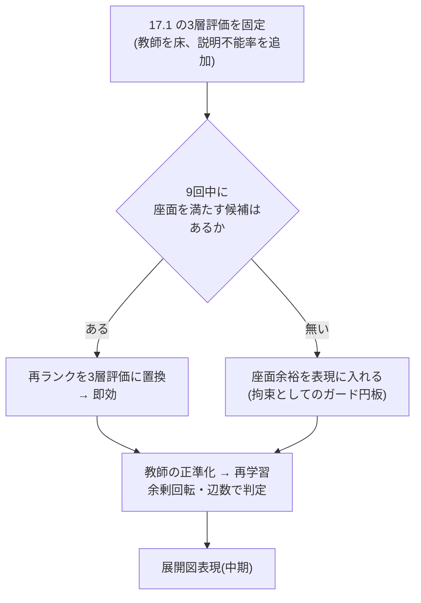

# 17. 合理性 — 「形の理由を説明できるか」を評価にする

Date: 2026-08-31
KB 16 の精緻化。ユーザーの定義: **工学的に合理的な構造 = その形状の理由を説明できること。**
ビードやフランジは剛性のためにあるので、機能していれば教師と形が違ってもよい。
逆に、理由のないギザギザ、R無しの曲げは、教師に近くても評価が低い。

---

## 17.0 結論

評価を **3層** に分ける。**上の層が落ちたら下の層は問わない。**

| 層 | 問い | 指標 | 判定 |
|---|---|---|---|
| **1 製造可能性** | 作れるか | R/t ≥ 2、スライバー無し、閉・非交差、パネルが可展、曲げ端に逃がし | **合否**(1つでも落ちれば不合格) |
| **2 簡潔性** | 理由のない形が無いか | **余剰回転**(凸形が要する360°を超える総回転)、板厚基準での最小プリミティブ数に対する**過剰辺数**、曖昧接合(3〜15°) | 教師を床にした**相対値** |
| **3 機能** | 役目を果たすか | **座面余裕比**(締結点から外形までの距離 / 必要座面半径)、**剛性代理**(締結点間の荷重経路に沿った断面二次モーメント)を教師と比 | 教師比 ≥ 0.9 など**機能の等価性**。形の一致は問わない |

**形の一致(Chamfer・is_arc・弧の向き)は評価から外す。**それらは層2・3の代理にすらならなかった(KB 16.2)。

---

## 17.1 現状を3層で測った(val 30部品、`frame_rel` 中央選択)

| | 余剰回転 | 曖昧接合 | スライバー | R/t < 2 | **座面余裕比** | 辺数 |
|---|---|---|---|---|---|---|
| 教師 | 191° | 26% | 0% | 0% | **1.009** | 18 |
| 生成 | **219°** | 15% | 0% | 0% | **0.763** | 17 |

読み方:

- **層1は通っている。**スライバー0、R/t違反0。製造不能な形は出ていない。
- **層2: 余剰回転が +15%。**これが「妙にギザギザ」の定量値。教師自身も191°の余剰を持つ
  (凹形状・端部の丸めは理由のある回転)ので、差分の28°が理由のない揺れ。
  曖昧接合は生成のほうが**少ない**(15% 対 26%) — 教師のテッセレーション由来の小さな折れを
  モデルは再現していない。**この指標は生成の欠陥を捉えず、教師側の雑音を捉えている。**
- **層3: 座面余裕比 0.763 — 最も重い欠陥。**教師は必要座面ちょうど(1.009)に外形を置いている
  (PartMaker は `half_width ≈ min_bearing_radius` で設計)。生成は**最悪の締結点で必要座面の24%を
  削っている**。ボルト頭・座金がはみ出す形で、**機能として不成立**。
  近傍 Chamfer 3.3mm は「良い」と読んでいたが、機能で見ると落第。

> **Chamfer では見えなかった不合格が、機能指標で1つ見つかった。**これが評価を変える理由。

---

## 17.2 「理由の説明」を評価器として実装する — 帰属

各外形辺に**理由を帰属**させ、帰属できない辺の割合を「説明不能率」とする。
帰属先はこの部品クラスの設計文法ではなく、板金一般の理由:

| 理由 | 判定 |
|---|---|
| 座面 | 締結点から必要座面半径 + 余裕の範囲を囲む辺 |
| 曲げに平行 | 折り線と平行な辺(フランジの縁) |
| 最短接続 | 上の2種を結ぶ最短経路上にある辺 |
| 逃がし・丸め | 上の辺どうしの接合部にあり、R ≥ 最小Rの弧 |
| **説明不能** | どれにも帰属しない辺 |

**教師にも適用し、教師の説明不能率を床にする。**
これは**評価器**であり、モデルの入力にも損失にも入れない(CLAUDE.md の哲学と両立)。
評価器を手で書くのは、目標の定義そのものを書くことなので、避けようがない。

ビード・フランジは**層3(剛性代理)で評価**し、帰属の対象にしない — 形の違いは問わない。

---

## 17.3 モデルに合理的な形を作らせる手段(手設計をモデルに入れずに)

| 手段 | 何を担うか | 根拠 |
|---|---|---|
| **教師の正準化**(KB 16.4) | 層2。教師自身の理由のない小さな折れ(曖昧接合26%)を消し、目標を最小分解にする | 目標が簡潔なら、当てはめたモデルは簡潔さを継承する(`smooth_curve` の成功パターン) |
| **K個からの再ランク**を3層評価で行う | 層1〜3すべて。中央選択(距離)を置換 | 選択はこの研究で唯一実証された利得。9回の中に座面を満たす候補があるかは**要測定** |
| **展開図表現**(KB 16.5) | 層1を構造で保証(平面・可展・真の円弧・直線の曲げ線) | 板金CADの定義と同一 |
| 座面余裕を**表現**に入れる | 層3。ガード円板を「外形はこの外側」という**拘束**として扱う(現在は点として条件付けているだけ) | 位置は既に与えており、意味を与えていない |
| 関係アテンション | 層2の一部(is_arc +4pt) | 唯一の正の結果 |

**やらないこと**: 余剰回転や座面余裕を**損失に足す**こと。この研究で損失に性質を書いて4敗、
評価器を訓練に持ち込むと評価が目標に汚染される(Goodhart)。**評価は評価、表現は表現。**

---

## 17.4 順序

**最初の1手**: 9回の候補それぞれの座面余裕比を測る。オラクルが ≥ 1.0 なら再ランクだけで
層3の不合格が消える。無ければ表現側の仕事。訓練不要で今日わかる。
