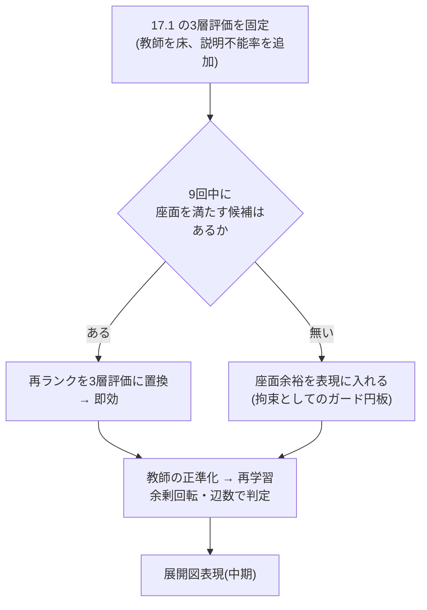

# 17. 合理性 — 「形の理由を説明できるか」を評価にする

Date: 2026-08-31
KB 16 の精緻化。ユーザーの定義: **工学的に合理的な構造 = その形状の理由を説明できること。**
ビードやフランジは剛性のためにあるので、機能していれば教師と形が違ってもよい。
逆に、理由のないギザギザ、R無しの曲げは、教師に近くても評価が低い。

---

## 17.0 結論

評価を **3層** に分ける。**上の層が落ちたら下の層は問わない。**

| 層 | 問い | 指標 | 判定 |
|---|---|---|---|
| **1 製造可能性** | 作れるか | R/t ≥ 2、スライバー無し、閉・非交差、パネルが可展、曲げ端に逃がし | **合否**(1つでも落ちれば不合格) |
| **2 簡潔性** | 理由のない形が無いか | **余剰回転**(凸形が要する360°を超える総回転)、板厚基準での最小プリミティブ数に対する**過剰辺数**、曖昧接合(3〜15°) | 教師を床にした**相対値** |
| **3 機能** | 役目を果たすか | **座面余裕比**(締結点から外形までの距離 / 必要座面半径)、**剛性代理**(締結点間の荷重経路に沿った断面二次モーメント)を教師と比 | 教師比 ≥ 0.9 など**機能の等価性**。形の一致は問わない |

**形の一致(Chamfer・is_arc・弧の向き)は評価から外す。**それらは層2・3の代理にすらならなかった(KB 16.2)。

---

## 17.1 現状を3層で測った(val 30部品、`frame_rel` 中央選択)

| | 余剰回転 | 曖昧接合 | スライバー | R/t < 2 | **座面余裕比** | 辺数 |
|---|---|---|---|---|---|---|
| 教師 | 191° | 26% | 0% | 0% | **1.009** | 18 |
| 生成 | **219°** | 15% | 0% | 0% | **0.763** | 17 |

読み方:

- **層1は通っている。**スライバー0、R/t違反0。製造不能な形は出ていない。
- **層2: 余剰回転が +15%。**これが「妙にギザギザ」の定量値。教師自身も191°の余剰を持つ
  (凹形状・端部の丸めは理由のある回転)ので、差分の28°が理由のない揺れ。
  曖昧接合は生成のほうが**少ない**(15% 対 26%) — 教師のテッセレーション由来の小さな折れを
  モデルは再現していない。**この指標は生成の欠陥を捉えず、教師側の雑音を捉えている。**
- **層3: 座面余裕比 0.763 — 最も重い欠陥。**教師は必要座面ちょうど(1.009)に外形を置いている
  (PartMaker は `half_width ≈ min_bearing_radius` で設計)。生成は**最悪の締結点で必要座面の24%を
  削っている**。ボルト頭・座金がはみ出す形で、**機能として不成立**。
  近傍 Chamfer 3.3mm は「良い」と読んでいたが、機能で見ると落第。

> **Chamfer では見えなかった不合格が、機能指標で1つ見つかった。**これが評価を変える理由。

---

## 17.2 「理由の説明」を評価器として実装する — 帰属

各外形辺に**理由を帰属**させ、帰属できない辺の割合を「説明不能率」とする。
帰属先はこの部品クラスの設計文法ではなく、板金一般の理由:

| 理由 | 判定 |
|---|---|
| 座面 | 締結点から必要座面半径 + 余裕の範囲を囲む辺 |
| 曲げに平行 | 折り線と平行な辺(フランジの縁) |
| 最短接続 | 上の2種を結ぶ最短経路上にある辺 |
| 逃がし・丸め | 上の辺どうしの接合部にあり、R ≥ 最小Rの弧 |
| **説明不能** | どれにも帰属しない辺 |

**教師にも適用し、教師の説明不能率を床にする。**
これは**評価器**であり、モデルの入力にも損失にも入れない(CLAUDE.md の哲学と両立)。
評価器を手で書くのは、目標の定義そのものを書くことなので、避けようがない。

ビード・フランジは**層3(剛性代理)で評価**し、帰属の対象にしない — 形の違いは問わない。

---

## 17.3 モデルに合理的な形を作らせる手段(手設計をモデルに入れずに)

| 手段 | 何を担うか | 根拠 |
|---|---|---|
| **教師の正準化**(KB 16.4) | 層2。教師自身の理由のない小さな折れ(曖昧接合26%)を消し、目標を最小分解にする | 目標が簡潔なら、当てはめたモデルは簡潔さを継承する(`smooth_curve` の成功パターン) |
| **K個からの再ランク**を3層評価で行う | 層1〜3すべて。中央選択(距離)を置換 | 選択はこの研究で唯一実証された利得。9回の中に座面を満たす候補があるかは**要測定** |
| **展開図表現**(KB 16.5) | 層1を構造で保証(平面・可展・真の円弧・直線の曲げ線) | 板金CADの定義と同一 |
| 座面余裕を**表現**に入れる | 層3。ガード円板を「外形はこの外側」という**拘束**として扱う(現在は点として条件付けているだけ) | 位置は既に与えており、意味を与えていない |
| 関係アテンション | 層2の一部(is_arc +4pt) | 唯一の正の結果 |

**やらないこと**: 余剰回転や座面余裕を**損失に足す**こと。この研究で損失に性質を書いて4敗、
評価器を訓練に持ち込むと評価が目標に汚染される(Goodhart)。**評価は評価、表現は表現。**

---

## 17.4 順序

**最初の1手**: 9回の候補それぞれの座面余裕比を測る。オラクルが ≥ 1.0 なら再ランクだけで
層3の不合格が消える。無ければ表現側の仕事。訓練不要で今日わかる。

---

## 17.5 実装と結果(2026-08-31、`wtok/rational.py`)

### 外形 — 訓練なしで層3の不合格が消えた

`frame_rel`、val 30部品、9回描画。座面参照・教師参照は**一切使わない**(ランクは座面比と余剰回転だけ)。

| 選択 | 座面比 | ≥0.95 | 余剰回転 | スライバー | 近傍誤差 |
|---|---|---|---|---|---|
| 教師 | 1.009 | 100% | 191° | 10% | — |
| 中央選択(旧) | 0.763 | 17% | 219° | 7% | 3.89mm |
| 合理性ランク(`rank`) | 0.927 | 47% | 219° | 0% | 3.42mm |
| **座面拘束サンプリング + 合理性ランク** | **1.016** | **87%** | 224° | 0% | **2.91mm** |

- **座面拘束サンプリング**(`sample(constrain=)`): 各ステップでモデル自身の終点予測 x̂₁ に
  `seat_project`(座面に食い込む角を座面の縁へ)をかけ、速度をそこへ向け直す。
  `pin` と同じ身分 — 入力から導かれる硬い拘束で、学習対象には何も足さない。
  事後の投影だけでは 0.930 止まり(角を動かしても辺が座面を横切る)。サンプリング中に
  かけると**モデルが隣接する角を追従して直す**ので 1.016 に届く。
- 9回のオラクルでも座面 ≥1 は 43% しか無かった。**選択で拾える余地が無い欠陥は表現側で直す**、
  の実例。
- 画像: `runs/frame_rel/rational.png`(教師 / 旧 / 新の3列)。残る欠陥は長辺上の角の揺れ
  (余剰回転 +30°)で、これは外形が3Dで曲げ線と交わる角の位置精度の問題。

### 教師の正準化 — 1t では逆効果、0.25t でスライバー除去のみ

| 許容差 | 辺数 | 余剰回転 | スライバー | 座面比 |
|---|---|---|---|---|
| 生 | 18 | 191° | 10% | 1.009 |
| 1.0t | 18 | 188° | 0% | **0.963** |
| **0.25t(採用)** | 18 | 188° | 0% | 1.009 |

教師の余剰回転 191° は**実在する凹形状**であり、テッセレーション雑音ではない。粗い許容差で
得られる簡潔さは無く、座面に接する小さな弧を潰して機能を壊すだけだった(`CANON_TOL_T` の注記)。

### 曲げ線 — 層2の破綻は表現の問題

E2E(生成外形 → `bendtok1`)、val 30部品:

| | 余剰回転 | 端の浮き | 本数 | Chamfer |
|---|---|---|---|---|
| 教師 | 759° | 6% | 26 | — |
| E2E 1回 | **9026°** | 40% | 26 | 6.00mm |
| E2E 合理性ランク(9回) | 9119° | 25% | 31 | 6.02mm |
| 教師外形を文脈にした参考値 | 7676° | 21% | 28 | 4.17mm |

本数は合っている。**余剰回転が教師の12倍**で、9回のどの描画も逃れていない → 選択ではなく表現。
密に再標本化したトークンは**点ごとに揺れる自由**を持つ。折り線は本来2点で決まる。

→ **角トークン**(`--corner-t 0.25`): 各曲線を板厚0.25倍の弦誤差で最少頂点に還元し、その頂点を
トークンにする。直線の折りは2トークンになり、**構造的にジグザグできない**(外形フレームと同じ
考え方)。1部品あたり 512 → 113 トークン、曲線数は40/40で保存。`runs/bendcorner1` で学習中。
ビードの稜線は折れ線近似(0.25t)— B-rep 用の真円弧は外形と同じ膨らみチャンネルで拡張可能。

### 学習を2倍にしても簡潔性は良くならない(`runs/frame_canon`)

frame_rel と同じ処方(rel + spec)、スライバー除去教師、**600エポック**(frame_rel は300)。

| 選択 | 座面比 | ≥0.95 | 余剰回転 | 近傍誤差 |
|---|---|---|---|---|
| frame_rel 中央選択 | 0.763 | 17% | 219° | 3.89mm |
| frame_canon 中央選択 | 0.787 | 20% | **248°** | **3.39mm** |
| frame_rel 拘束+ランク | 1.016 | 87% | 224° | 2.91mm |
| frame_canon 拘束+ランク | 0.982 | 70% | **258°** | **2.66mm** |

損失 0.020 → 0.008、位置は 0.5mm 良くなり、**余剰回転は 30° 悪化**。位置損失を下げるほど
角の揺れが増える — 「損失は構造を見ていない」の再確認。長く回す・容量を増やすのは
層2の対策にならない(Kaggle 掃引 v12 も同じ問い。結果は `kaggle_ops.py pull --title autometalsheet-frame-sweep`)。

### 角トークンの結果(`runs/bendcorner1`、best epoch 160)

E2E(frame_rel 拘束+ランクの生成外形 → 曲げ)、val 30部品。角トークンでは教師も同じ表現で測る。

| 表現 | | 余剰回転 | 教師比 | 端の浮き | 本数 | Chamfer |
|---|---|---|---|---|---|---|
| 密トークン | 教師 | 759° | — | 6% | 26 | — |
| 密トークン(`bendtok1`) | E2E ランク(9) | 9119° | **12.0×** | 22% | 32 | 6.20mm |
| 角トークン | 教師 | 981° | — | 13% | 26 | — |
| 角トークン(`bendcorner1`) | E2E ランク(9) | **1918°** | **2.0×** | 27% | 24 | 8.76mm |

- 数値では余剰回転 12× → 2×。**しかし画像(`runs/bendcorner1/e2e_bend.png`)は数値を裏切る**:
  角トークンの出力は、無関係な角どうしを長い直線で結んでいる(ビードの輪郭になっていない)。
  密トークンは波打つがビードの形は追えている。**余剰回転が減ったのは、長い直線の飛びが
  「回転しない」から**であって、構造が良くなったからではない。習慣 C1 の通り。
- 原因は `end` フラグの取りこぼし。密トークンでは1つ落としても隣の点に繋がるだけだが、
  角トークンは4トークンに1つが `end` なので、1つ落とすと**別の曲線へ 100mm 飛ぶ**。
  疎な表現ほど区切りの誤りが致命的になる。Chamfer 6.2 → 8.8mm もこれ。
- 従って**角トークンは「区切りを構造で保証する」表現と組でなければ成立しない**。
  変位トークン(`deltatok`、閉曲線は構造的に閉じる)の区切りの扱いをそのまま角に載せるのが次の一手。
  ユーザー指示「曲げで変位を試す」と一致する。
- 端の浮き 27% も同根(飛んだ線の端は外形に届かない)。

### 進行中
- Kaggle `autometalsheet-frame-sweep` v12: 容量/学習長の掃引(base/wide/deep/long、すべて rel+spec)。
  出力の best.pt は `scratchpad/constrain_seat.py <run>` と同じ手順で3層評価にかける
