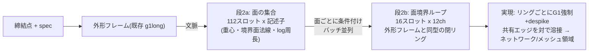

# 21. 面ループ表現 — 曲げネットワークのB-repネイティブ生成

Date: 2026-09-01
状態: **承認済み(案A)。face_ids 実装・検証完了(21.5)** — 抽出側セッション不在のため
当方が `extract.py` を直接 v4.5 化(ユーザー承認済み)。データは `runs/wtok_synth_v45/wireframes`。
前提: KB 20.8(bend_lineのみ教師の被覆漏れ38.6%、全クラスは次数3-4の面境界ネットワーク)。

---

## 21.0 設計

生成の単位を**面(face)**にする。各エッジはちょうど2面の境界なので、
面ごとの境界閉ループを生成すればネットワーク全体が構造的に再構成される。

| 性質 | どう保証するか |
|---|---|
| 区切り | **構造**(面=独立テンソル)。フラグ不要 |
| ループが閉じる | **構造**(リング表現、外形と同じ) |
| 開いた端 | **存在しない**(面境界は常に閉。KB 20の外形スナップ拘束は不要になる) |
| 高曲率被覆 | 全クラスのエッジが面境界として教師に入る(漏れ0.2%) |
| B-repへの道 | 生成物がそのまま面パッチ境界 = `surface_frame` 生成の実体 |

## 21.1 容量(v4.4 の部品レベル配列から先行測定、300部品)

| 量 | 中央値 | p95 | 最大 | 容量 |
|---|---|---|---|---|
| 中立面の面数(壁面除外) | 87 | 92 | 94 | `FACE_SLOTS = 112` |
| 面あたりエッジ数(推定 (2×内部+外形)/面数) | 6.7 | 8.9 | 9.5 | `FRING_SLOTS = 16` |

リングが外形(16辺)より小さい — **2bは実証済みの外形フレーム機構の縮小版**。
確定値は face_ids 到着後に再測定(受け入れ条件Cと同時)。

## 21.2 詳細

- **2a 記述子**: 境界ループの重心(3)+ループ最小二乗平面の法線(3、無向正規化)+log周長(1)
  +unused(1)。**面種別(plane/cylinder…)は載せない**(哲学2: 分類を先に決めない。
  幾何記述子から必要なら創発する)。正準順=周長降順、`slot_pe`
- **2b リング**: 外形フレームと同じchレイアウト(角3+膨らみ3+is_arc+unused+G1+予備)。
  `ring_pe`、正準化は外形の `_canonicalise`。条件=2a記述子行(ノイズ注入)+締結点+spec+外形文脈
- **共有エッジの溶接**(実現): 各内部エッジは2つのループに現れる。実現後、
  中点近接+端点近接で対を同定し平均。**対のずれ(mm)を新しい層2指標**にする
  (「両面から描いた同一エッジの不一致」— 表現の自己整合性の直接測定)
- **外形との整合**: 外形に接する面のリングは外形エッジを含む。生成済み外形の対応辺へ
  スナップする拘束(座面と同型)を**オプション**として持つ(まず無しで測る)
- **壁面**(face_wall=True)は対象外(中立面の面のみ)。データ側で要確認
- 学習は素の flow matching。評価は3層合理性+被覆(高曲率>15°の3mm被覆漏れ、教師床0.2%)
  +溶接ずれ+面数分布

## 21.3 検証順(face_ids 到着後)

1. 受け入れ条件A-D(依頼書)を測定。**面ループ閉率**と容量の確定
2. 教師の往復(encode→realize→溶接 vs 生polyline、目標0.45mm水準)+被覆再測定
3. 2a/2b 短時間学習(chains.pyの機構を流用)→ プローブ
4. E2E(chain_eval 改)+ Kaggle掃引(シードあり)。**bendtok1/角トークン/チェーンE2Eとの
   比較表**(同一30部品)は 20.6 のオラクル分解と同じハーネスで
5. 巻き添えの破棄を明示: chainset1/chainedges1/chain-sweep(誤教師)は比較から除外

## 21.4 リスク

| リスク | 備え |
|---|---|
| 面数87 → 2aスロット112は チェーン(96)と同規模だが、記述子の識別力が弱い(似た面が多い) | rel-attn、周長+位置で分離。2aプローブで面の対応率を測る |
| 共有エッジの2重生成が不一致 | 溶接ずれを層2指標化。悪ければ「対の平均」でなく「片側優先」規則を測って選ぶ |
| 面ループ閉率が低い(抽出の欠け) | 受け入れ条件Cで先に検出。95%未満なら抽出側と再調整 → **21.5で解消: 面単位99.3%** |
| face_ids 依頼のリードタイム | 待ち時間は外形残課題(G1フラグ較正の学習側、0044系)に充当可能 → **G1連続値は KB 18.8 で採用済み** |

## 21.5 face_ids 実装と受け入れ測定(2026-09-01、検証順ステップ1完了)

抽出側セッションが依頼を受けないまま待ち時間が生じていたため、ユーザー承認のもと
当方が `fill_volume/wireframe_app/extract.py` を直接 v4.5 化した(実質2行 —
抽出器は隣接対応 `(edge, fidx)` を内部に持っており捨てていただけ。変更前は
`extract.py.bak_v44` に残置)。2300部品を `runs/wtok_synth_v45/wireframes` に再抽出
(466秒、失敗0)。**`runs/wtok_synth_g1` は不変。**詳細は
`docs/requests/2026-09-01_face_ids_REPLY.md`。

| 条件 | 結果 |
|---|---|
| A(内部=2面、外形/穴≥1面) | 違反0 |
| B(face_types整合) | 違反0 |
| C(面ループ0.05mm閉率) | 部品中央値1.000、p10 0.977。**面単位99.3%** |
| D(既存フィールド不変) | 2300部品全数バイト比較で一致(抽出は決定的) |

**容量の確定**(21.1の推定を置換): 非壁面 87 / p95 92 / 最大 98(cap 112、超過0)。
面あたりエッジ **中央値4** / p95 6 / 最大11(cap 16、超過0)— 推定の~7は過大で、
**2bリングは外形よりさらに小さい**。

**閉じない0.66%の面の正体 — 訂正(同日、21.6)**: 「縮退エッジの欠け」推定は誤り。
測定器のアーティファクトだった(グリッド丸め溶接=KB 18.5の罠の再演+0.01〜0.05mmの
ゴミエッジ607本が自己ループ化して次数4ピンチ)。クラスタ溶接+自己ループ除去では
**100%の面が閉じる。抽出に欠けは無い。**

## 21.6 ステップ2完了 — 教師の往復(2026-09-01)

実装: `wtok/faces.py` — `face_loops`(クラスタ溶接、次数2検査、巡回、
`chains._fit_edge` 流用、自己ループ除去 `SELF_LOOP_MM=0.2`)、`face_targets`
(2a: 112×8ch 周長降順 / 2b: 16×10ch chainsと同レイアウト)、`realize_face_ring`
(`chains.realize_chain` に `g1_thresh` を追加して流用)。
**2bのG1チャンネルは誕生時から連続値**(1−jt/45、KB 18.8 — ビットの失敗を再演しない)。

**全2300部品の測定**(実現 vs 生polyline、両側1mm再サンプル=A1):

| 指標 | 値 | 基準 |
|---|---|---|
| 符号化 | **2300/2300、容量超過0** | |
| 面/部品 | 87 / p95 92 / 最大 98 | cap 112 ✅ |
| エッジ/リング | 4 / p95 6 / 最大 11 | cap 16 ✅ |
| スキップ面 | **0(周長損失0.000%)** | |
| 往復誤差 | **中央値0.485mm** / p90 0.709 / p99 1.198 / 最大1.631mm | 中央値<0.6 ✅ |

裾(p99 1.2mm)はチェーンの実績(中央0.342/最大0.451、60部品)より重い。
単一ARC近似が苦しいエッジ(ランアウト等の自由曲線)が候補 — 2a/2bプローブの
絵で確認してから扱いを決める(**未診断**)。

次: **ステップ3 — 2a/2b短時間学習**(staged.py への face_set / face_ring 段の配線、
chain_set/chain_edges の機構を流用。2aは`slot_pe`、2bは`ring_pe`)。

## 21.6 初回E2E(2026-09-01、faceset1 300ep + facering1 120ep、val 30、K=9)

**ハーネスのバグを1件根絶してから**: 評価ローダが自前のPEマップを持ち face 段を知らず、
slot_pe学習の2aを ring_pe で再構築していた(プローブ1.8mmのckptがE2Eで27.7mmに見えた)。
マップは `staged.ORDERED_PE` に一元化(この型は chain のときの cross/ordered に続き2度目)。

| | unmatched(自己整合) | 余剰回転 | 面数 | Chamfer | 高曲率未被覆 |
|---|---|---|---|---|---|
| 教師 | 19.7% | 193° | 88 | — | 0.2%(床) |
| E2E 1回 | 25.2% | 1683° | 88 | — | — |
| **E2E ランク(9)** | **8.3%** | 1615° | **86** | **4.54mm** | 62.6% |

絵(`runs/facering1/face_eval/overlay_3d.png`)の読み:
- **大域構造は出ている**: ビード帯の平行レール・端部構造・折り帯が正しい領域に(0009/0012/0063/0078)。
  チェーンE2Eの断片散乱とは質的に別物
- 欠陥は**リング単位の暴れ**(余剰回転 教師比8倍)と**小面のもつれ**(0016/0050/0079の小リング群)
- unmatched 8.3% < 教師19.7% は Goodhart 注意(ランクキーが unmatched なので、重なりの
  多い描画が選ばれる方向の圧はある)。教師の19.7%は壁面境界がネットワークに1回しか
  現れない分で、床として妥当
- 未被覆62.6%は「Chamfer 4.5mm > 閾3mm」の言い換えに近い(位置が3mm以内に来れば同時に落ちる)

**判定**: 表現としては成立(面数・自己整合・大域配置)。残りは**学習量とE2E合成**の問題 —
2bは150部品×120epに過ぎない。次: ①オラクル分解(gen2a/true2a × genO/trueO)で寄与を分離、
②face教師キャッシュを作って Kaggle 掃引(シード付き、2a/2b 各2シード)、③その後に
リング暴れ対策(外形で効いた G1連続値は既に載せてある — 効くかは学習量を先に)。
