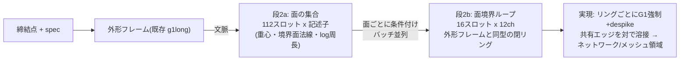

# 21. 面ループ表現 — 曲げネットワークのB-repネイティブ生成

Date: 2026-09-01
状態: **承認済み(案A)。face_ids 実装・検証完了(21.5)** — 抽出側セッション不在のため
当方が `extract.py` を直接 v4.5 化(ユーザー承認済み)。データは `runs/wtok_synth_v45/wireframes`。
前提: KB 20.8(bend_lineのみ教師の被覆漏れ38.6%、全クラスは次数3-4の面境界ネットワーク)。

---

## 21.0 設計

生成の単位を**面(face)**にする。各エッジはちょうど2面の境界なので、
面ごとの境界閉ループを生成すればネットワーク全体が構造的に再構成される。



| 性質 | どう保証するか |
|---|---|
| 区切り | **構造**(面=独立テンソル)。フラグ不要 |
| ループが閉じる | **構造**(リング表現、外形と同じ) |
| 開いた端 | **存在しない**(面境界は常に閉。KB 20の外形スナップ拘束は不要になる) |
| 高曲率被覆 | 全クラスのエッジが面境界として教師に入る(漏れ0.2%) |
| B-repへの道 | 生成物がそのまま面パッチ境界 = `surface_frame` 生成の実体 |

## 21.1 容量(v4.4 の部品レベル配列から先行測定、300部品)

| 量 | 中央値 | p95 | 最大 | 容量 |
|---|---|---|---|---|
| 中立面の面数(壁面除外) | 87 | 92 | 94 | `FACE_SLOTS = 112` |
| 面あたりエッジ数(推定 (2×内部+外形)/面数) | 6.7 | 8.9 | 9.5 | `FRING_SLOTS = 16` |

リングが外形(16辺)より小さい — **2bは実証済みの外形フレーム機構の縮小版**。
確定値は face_ids 到着後に再測定(受け入れ条件Cと同時)。

## 21.2 詳細

- **2a 記述子**: 境界ループの重心(3)+ループ最小二乗平面の法線(3、無向正規化)+log周長(1)
  +unused(1)。**面種別(plane/cylinder…)は載せない**(哲学2: 分類を先に決めない。
  幾何記述子から必要なら創発する)。正準順=周長降順、`slot_pe`
- **2b リング**: 外形フレームと同じchレイアウト(角3+膨らみ3+is_arc+unused+G1+予備)。
  `ring_pe`、正準化は外形の `_canonicalise`。条件=2a記述子行(ノイズ注入)+締結点+spec+外形文脈
- **共有エッジの溶接**(実現): 各内部エッジは2つのループに現れる。実現後、
  中点近接+端点近接で対を同定し平均。**対のずれ(mm)を新しい層2指標**にする
  (「両面から描いた同一エッジの不一致」— 表現の自己整合性の直接測定)
- **外形との整合**: 外形に接する面のリングは外形エッジを含む。生成済み外形の対応辺へ
  スナップする拘束(座面と同型)を**オプション**として持つ(まず無しで測る)
- **壁面**(face_wall=True)は対象外(中立面の面のみ)。データ側で要確認
- 学習は素の flow matching。評価は3層合理性+被覆(高曲率>15°の3mm被覆漏れ、教師床0.2%)
  +溶接ずれ+面数分布

## 21.3 検証順(face_ids 到着後)

1. 受け入れ条件A-D(依頼書)を測定。**面ループ閉率**と容量の確定
2. 教師の往復(encode→realize→溶接 vs 生polyline、目標0.45mm水準)+被覆再測定
3. 2a/2b 短時間学習(chains.pyの機構を流用)→ プローブ
4. E2E(chain_eval 改)+ Kaggle掃引(シードあり)。**bendtok1/角トークン/チェーンE2Eとの
   比較表**(同一30部品)は 20.6 のオラクル分解と同じハーネスで
5. 巻き添えの破棄を明示: chainset1/chainedges1/chain-sweep(誤教師)は比較から除外

## 21.4 リスク

| リスク | 備え |
|---|---|
| 面数87 → 2aスロット112は チェーン(96)と同規模だが、記述子の識別力が弱い(似た面が多い) | rel-attn、周長+位置で分離。2aプローブで面の対応率を測る |
| 共有エッジの2重生成が不一致 | 溶接ずれを層2指標化。悪ければ「対の平均」でなく「片側優先」規則を測って選ぶ |
| 面ループ閉率が低い(抽出の欠け) | 受け入れ条件Cで先に検出。95%未満なら抽出側と再調整 → **21.5で解消: 面単位99.3%** |
| face_ids 依頼のリードタイム | 待ち時間は外形残課題(G1フラグ較正の学習側、0044系)に充当可能 → **G1連続値は KB 18.8 で採用済み** |

## 21.5 face_ids 実装と受け入れ測定(2026-09-01、検証順ステップ1完了)

抽出側セッションが依頼を受けないまま待ち時間が生じていたため、ユーザー承認のもと
当方が `fill_volume/wireframe_app/extract.py` を直接 v4.5 化した(実質2行 —
抽出器は隣接対応 `(edge, fidx)` を内部に持っており捨てていただけ。変更前は
`extract.py.bak_v44` に残置)。2300部品を `runs/wtok_synth_v45/wireframes` に再抽出
(466秒、失敗0)。**`runs/wtok_synth_g1` は不変。**詳細は
`docs/requests/2026-09-01_face_ids_REPLY.md`。

| 条件 | 結果 |
|---|---|
| A(内部=2面、外形/穴≥1面) | 違反0 |
| B(face_types整合) | 違反0 |
| C(面ループ0.05mm閉率) | 部品中央値1.000、p10 0.977。**面単位99.3%** |
| D(既存フィールド不変) | 2300部品全数バイト比較で一致(抽出は決定的) |

**容量の確定**(21.1の推定を置換): 非壁面 87 / p95 92 / 最大 98(cap 112、超過0)。
面あたりエッジ **中央値4** / p95 6 / 最大11(cap 16、超過0)— 推定の~7は過大で、
**2bリングは外形よりさらに小さい**。

**閉じない0.66%の面の正体 — 訂正(同日、21.6)**: 「縮退エッジの欠け」推定は誤り。
測定器のアーティファクトだった(グリッド丸め溶接=KB 18.5の罠の再演+0.01〜0.05mmの
ゴミエッジ607本が自己ループ化して次数4ピンチ)。クラスタ溶接+自己ループ除去では
**100%の面が閉じる。抽出に欠けは無い。**

## 21.6 ステップ2完了 — 教師の往復(2026-09-01)

実装: `wtok/faces.py` — `face_loops`(クラスタ溶接、次数2検査、巡回、
`chains._fit_edge` 流用、自己ループ除去 `SELF_LOOP_MM=0.2`)、`face_targets`
(2a: 112×8ch 周長降順 / 2b: 16×10ch chainsと同レイアウト)、`realize_face_ring`
(`chains.realize_chain` に `g1_thresh` を追加して流用)。
**2bのG1チャンネルは誕生時から連続値**(1−jt/45、KB 18.8 — ビットの失敗を再演しない)。

**全2300部品の測定**(実現 vs 生polyline、両側1mm再サンプル=A1):

| 指標 | 値 | 基準 |
|---|---|---|
| 符号化 | **2300/2300、容量超過0** | |
| 面/部品 | 87 / p95 92 / 最大 98 | cap 112 ✅ |
| エッジ/リング | 4 / p95 6 / 最大 11 | cap 16 ✅ |
| スキップ面 | **0(周長損失0.000%)** | |
| 往復誤差 | **中央値0.485mm** / p90 0.709 / p99 1.198 / 最大1.631mm | 中央値<0.6 ✅ |

裾(p99 1.2mm)はチェーンの実績(中央0.342/最大0.451、60部品)より重い。
単一ARC近似が苦しいエッジ(ランアウト等の自由曲線)が候補 — 2a/2bプローブの
絵で確認してから扱いを決める(**未診断**)。

次: **ステップ3 — 2a/2b短時間学習**(staged.py への face_set / face_ring 段の配線、
chain_set/chain_edges の機構を流用。2aは`slot_pe`、2bは`ring_pe`)。

## 21.6 初回E2E(2026-09-01、faceset1 300ep + facering1 120ep、val 30、K=9)

**ハーネスのバグを1件根絶してから**: 評価ローダが自前のPEマップを持ち face 段を知らず、
slot_pe学習の2aを ring_pe で再構築していた(プローブ1.8mmのckptがE2Eで27.7mmに見えた)。
マップは `staged.ORDERED_PE` に一元化(この型は chain のときの cross/ordered に続き2度目)。

| | unmatched(自己整合) | 余剰回転 | 面数 | Chamfer | 高曲率未被覆 |
|---|---|---|---|---|---|
| 教師 | 19.7% | 193° | 88 | — | 0.2%(床) |
| E2E 1回 | 25.2% | 1683° | 88 | — | — |
| **E2E ランク(9)** | **8.3%** | 1615° | **86** | **4.54mm** | 62.6% |

絵(`runs/facering1/face_eval/overlay_3d.png`)の読み:
- **大域構造は出ている**: ビード帯の平行レール・端部構造・折り帯が正しい領域に(0009/0012/0063/0078)。
  チェーンE2Eの断片散乱とは質的に別物
- 欠陥は**リング単位の暴れ**(余剰回転 教師比8倍)と**小面のもつれ**(0016/0050/0079の小リング群)
- unmatched 8.3% < 教師19.7% は Goodhart 注意(ランクキーが unmatched なので、重なりの
  多い描画が選ばれる方向の圧はある)。教師の19.7%は壁面境界がネットワークに1回しか
  現れない分で、床として妥当
- 未被覆62.6%は「Chamfer 4.5mm > 閾3mm」の言い換えに近い(位置が3mm以内に来れば同時に落ちる)

**判定**: 表現としては成立(面数・自己整合・大域配置)。残りは**学習量とE2E合成**の問題 —
2bは150部品×120epに過ぎない。次: ①オラクル分解(gen2a/true2a × genO/trueO)で寄与を分離、
②face教師キャッシュを作って Kaggle 掃引(シード付き、2a/2b 各2シード)、③その後に
リング暴れ対策(外形で効いた G1連続値は既に載せてある — 効くかは学習量を先に)。

### 21.6.1 オラクル分解(単発/セル、30部品)

| セル | unmatched | 余剰回転 | 面数 | Chamfer |
|---|---|---|---|---|
| 教師 | 19.7% | 193° | 88 | — |
| 生成2a×生成外形(=E2E) | 14.6% | 1944° | 87 | 4.28mm |
| **真2a×生成外形** | 36.7% | 2112° | 88 | **1.12mm** |
| 真2a×真外形 | 36.2% | 2026° | 88 | 1.14mm |
| 生成2a×真外形 | 14.0% | 1793° | 87 | 3.07mm |

帰属:
- **位置誤差(Chamfer)はほぼ全て生成2aの記述子**(真2aなら1.1mm)。外形の生成/真は~0〜1mm。
  → 2aの重心精度(現状3.5mm)が主レバー。掃引の2a 900ep×2シードが対応
- **リング暴れ(余剰回転~2000°)は全セル共通 = 2b固有**(合成は無罪)。現状150部品×120epで、
  外形が暴れを克服したのは2200部品×900ep — 学習量で追う(掃引2bは1000部品)
- unmatched の逆転(真2a 36% > 生成2a 15%)は**2t閾の測定特性**: 真の別々の面に正しく
  置かれた隣接リングは共有エッジを独立誤差1.1mmで2度描くため2tを超えやすく、
  生成2aの重複気味の記述子は重なって低く出る。ランクキーとしては有効だが、
  閾値依存であることを記録(Goodhart監視)

### 21.6.2 訓練不要の改善(2026-09-01夜、同一ハーネス3変種A/B)

| 変種 | unmatched | 余剰回転 | Chamfer |
|---|---|---|---|
| K=1(21.6基準) | 8.3% | 1615° | 4.54mm |
| K=1 + リングdespike | 8.1% | 1123° | 4.54mm |
| **面ごとbest-of-3 + despike(採用)** | **7.1%** | **693°** | 4.70mm |

リングが独立テンソルである面ループ表現の構造的利点がそのまま選択レバーになった:
**2b固有の暴れを訓練なしで57%削減**(教師比 8.4×→3.6×)。Chamferの+0.16mmは許容
(位置は2a起因とオラクルで確定済み)。`face_eval --ring-k 3 --ring-despike` を標準に。

### 21.6.3 記述子ノイズ注入は棄却(2026-09-01夜)

facering_n02(desc-noise 0.02、2aの実誤差に整合)を採用構成(K=3+despike)でE2E:
Chamfer 4.73mm(基準4.70)、unmatched 16.5%(7.1%から悪化)、余剰815°(693°から悪化)。
**仮説不成立**: 2bは文脈(外形+締結点)から記述子の誤りを補正できない — どの面が
どこにあるかは2aの決定であり文脈から導出できない(KB 12の裏返し)。ノイズは情報を
消すだけだった。facering1(ノイズ0)を維持。位置誤差のレバーは**2aの精度のみ**
(Kaggle掃引 2a 900ep×2シードの結果待ち)。

### 21.7 教師の見た目に関する注意と訂正(2026-09-02、ユーザー指摘起点)

**訂正**: KB 20.8の「折り横断線 = seam」は誤り。全602本のseamエッジは**壁面(板厚側面)
どうしの継ぎ目**(wall:plane|wall:plane)で、中立面の面リングに入らないのは正しい挙動
(0012の絵で折り部に見えた緑線は、折り近傍の壁面上の継ぎ目が投影で重なって見えたもの)。

**教師リングの実内容**(40部品、61,690mm): bend_line 65.4% + surface_frame 34.6%、
面ペアは cylinder|plane 59%が筆頭。plane|plane(構築継ぎ目)は**0%** — 教師は実在の
面境界だけでできている。

**教師とCATIA表示の「見た目の乖離」は2つの仕様による**:
1. **壁面除外**: 板厚の側面はメッシュ対象外(中立面)なので、CATIA実体表示のエッジより線が少ない
2. **中立面の面分割**: 教師は中立面B-repの分割であり、実体ソリッドの面と1対1ではない
   (中立面化の工程で面が統合・分割される)

検証済み: 教師リング⇔抽出wireframe 0.485mm、高曲率被覆99.8%。
**未検証**: 抽出wireframe⇔CATIA中立面の面分割の一致(v4.5受入は既存フィールド不変のみ)。
中立面表示と比べても形状が違う部品が特定されたら、その部品で照合する。

### 21.8 撤回: 弧が弦で実現されていた(2026-09-02、ユーザー発見)

ユーザーがCATIA**中立面**表示と照合し「弧が直線」「エッジ欠落」を指摘。原因は
`chains.realize_chain` が `codec.realize_edge` を誤った引数で呼び、**裸の except が
TypeError を握り潰して全ての弧を弦にフォールバック**していたこと(8/31 chains.py 起源、
faces.py にも継承)。往復ゲート(0.34/0.49mm)は弧23%・サジッタ~1mmの直線化を検出できず、
既知形状での較正(習慣A4)を怠っていた。

修正後: chains往復 0.342→**0.007mm**、faces往復 0.485→**0.176mm**(最大0.224mm)。
半円の較正チェックを demo に追加(弦フォールバックなら0になる)。

**撤回する数値**: 20.6/20.8(チェーンE2E・オラクル)、21.6/21.6.1/21.6.2/21.6.3 の
余剰回転・unmatched・Chamfer・被覆の**絶対値**(教師床193°等も弦ベース)。
教師/生成とも同じ弦実現だったため**相対比較と結論(2a起因・2b固有・best-of-3の効き・
ノイズ注入棄却)は維持**するが、修正版で全て再測定する(21.9に記録予定)。
「エッジ欠落」は弦化により短い弧が消えて見えた分と、壁面除外(仕様)の合算と推定 —
修正版の照合画像 `runs/wtok_synth_v45/teacher_fidelity_view_fixed.png` で再確認。

## 21.9 教師を全面に是正(2026-09-02、ユーザー発見「ビード部だけが面になっている」)

`face_wall=True` を板厚側面と誤読して除外していたが、**中立面モデルに側面は存在しない**。
実測(200部品): wall=True は**平面の面すべて(5308/5308)+曲面736面**。つまり教師は
パネル・フランジ等の平面を全部捨て、ビード・折りの曲面だけを面にしていた。
21.7の「seam=壁面継ぎ目」も同じ誤読の上に立っており撤回(seamは平面パネル間の継ぎ目)。

**是正**: `faces.py` は全面を対象にする。全面での構造(200部品): 面数125/部品(一定)、
**穴あき面0**(全面が単一ループ)、エッジ/ループ 中央値4・最大16 → 容量 `FACE_SLOTS=144`、
`FRING_SLOTS=24`。60部品の往復: **中央値0.159mm、最大0.189mm**、スキップ0。

**影響**: faceset1/facering1、Kaggle face-sweep v1 は曲面のみ教師で学習 → **破棄**。
教師キャッシュ再構築→再学習→再評価(21.10に記録予定)。

## 21.10 全面教師での初E2E(2026-09-02 09:40、faceset2 300ep + facering2 40ep/150部品)

弧修正(21.8)+全面教師(21.9)+採用構成(K=3+despike)。val 30、K=9。

| | unmatched | 面数 | Chamfer | 高曲率未被覆 |
|---|---|---|---|---|
| 教師 | **0.0%** | 125 | — | 0.2%(床) |
| E2E ランク | 21.7% | **125** | 4.54mm | 45.9%(曲面のみ教師では62.6%) |

- **教師の unmatched が 0.0%** — 「全ての面境界点は別の面境界か外形の上にある」というネットワークの
  性質が全面教師で厳密に成立(曲面のみ教師では平面除外のせいで19.7%だった)。自己整合ランクの
  床が0になり、生成の21.7%が純粋な欠陥量として読める
- 面数は125=125で2aは完全(重心3.15mm、曲面のみ3.47mmから改善)
- **絵**(`runs/facering2/face_eval/overlay_3d.png`): 教師はCATIA中立面の全面境界を再現。
  生成は**曲面のみ教師のときより視覚的に悪化** — 外形大のパネルリング(最大16辺)が乱雑な
  多角形になり部品全体を覆う。2bプローブのリングChamfer 4.66mm(曲面のみ1.8mm): 大きな
  平面リングは難しく、150部品×40epでは全く足りない(外形は2200部品×900epで到達)
- **指標の修正**: 実現曲線の余剰回転は真の弧では弧の掃引角を「余剰」と数えてしまう
  (教師床12,568°)。**角多角形の余剰回転**に定義変更(`ring_stats(corners=)`)、再測定中

次のレバー(優先順): ①学習量(Kaggle v2: 2b 1000部品×60ep、~16:00)、②**外形への係留**:
外形に接する面リングは外形エッジを共有する → 生成済み外形の対応辺へその角を`pin`
(座面と同型の入力由来拘束)。最大のリング群が構造的に固定され、2bは内部境界だけを
描けばよくなる。学習量の結果を見てから実装判断

角多角形での余剰回転(再測定): **教師床 1,024°、E2Eランク 5,272°(5.1×)、単発 6,050°**。
弧の掃引を除いた純粋な暴れとして、外形(KB 18.6 で+104°→教師比1.5×)よりはるかに大きい。

### 21.10.1 外形への係留(サンプリング時pin)— 効果は僅少

facering2、K=3+despike、係留半径 2t / 4t(`face_eval --outline-pin`):
unmatched 21.7→20.9→18.8%、余剰5272→5164→4956°、Chamfer 4.54→4.55→**4.91mm**(4tで悪化)。
外形近傍の角しか動かないため、混沌の主因(内部の大きな平面リング)には届かない。採用せず。

## 21.11 ハイブリッド案: 曲面の面だけ生成し、平面は構造的に補完(2026-09-02、ユーザー提案起点)

ユーザー提案「教師が正しくなったので曲げ線生成に再挑戦」への回答。チェーン表現には戻れない
(20.8のネットワーク次数は正しいクラスでの測定で、教師修正で変わらない)が、本質
「曲面領域(=曲げ)だけを生成する」は正しい:

- 各エッジは2面の境界 → **平面パネルの境界 = 外形 ∪ 隣接曲面の境界**(導出可能、KB 12)
- 曲面のみ教師(87面、リング中央4辺)は 2b 1.8mm / unmatched 8.3% と、全面(4.66mm / 21.7%)より
  はるかに良かった — 生成対象としては正しかった。欠陥は「平面を補完しなかった」ことだけ
- **plane|plane seam(602本)**: 非外形ネットワークの長さ比 **4.4%**、全部品に存在、
  **最寄りの曲面エッジから中央0.3mm(p90 2.5mm)** — 曲面境界に沿う中立面構築の継ぎ目で、
  メッシュ的には既生成エッジの重複。**補完対象から外してよい**(必要なら曲面エッジの写像で復元)

`WTOK_FACES_MODE=curved` を実装(容量112/16)。曲面のみckpt(faceset1/facering1)を弧修正版で
再評価中 → 全面Kaggle v2 との比較で採否を決める。

### 21.11.1 曲面のみckptの弧修正版E2E(faceset1 300ep + facering1 40ep/150部品)

| | unmatched | 角余剰 | 面数 | Chamfer | 未被覆 |
|---|---|---|---|---|---|
| 教師(曲面のみ) | 20.3%(床: 平面欠落分) | 193° | 88 | — | — |
| E2E ランク | 8.5% | 805°(4.2×) | 86 | 4.73mm | 61.7% |

全面(faceset2/facering2、21.10)との比較: 角余剰比は 4.2× 対 5.1× で同程度、Chamfer は
4.73 対 4.54 で同程度 — **E2E数値は両案とも2aの位置誤差(~4.5mm)と2b暴れに支配され、
現状の学習量では差が出ない**。曲面のみの優位は段単体(2b 1.8 対 4.66mm)と絵の可読性。
未被覆は全面の方が低い(45.9%)が、これは密なリング網が「近接」を稼ぐ測定特性で、
判定材料にしない。**採否は学習量を揃えて決める**: 全面=Kaggle v2(1000部品)、
曲面のみ=ローカル faceset_c900(900ep)+facering_c500(500部品×40ep)を投入。

## 21.12 全面教師の学習量増(Kaggle v2: 2a 900ep + 2b 1000部品×50ep、2026-09-02)

同一ハーネス(val 30、K=9、K=3+despike、角多角形余剰、弧修正)。

| | unmatched | 角余剰(教師床1024°) | 面数 | Chamfer | 未被覆 |
|---|---|---|---|---|---|
| ローカル(2a 300ep / 2b 150部品×40ep) | 21.7% | 5272°(5.1×) | 125 | 4.54mm | 45.9% |
| **Kaggle v2(2a 900ep / 2b 1000部品×50ep)** | **11.0%** | **3469°(3.4×)** | 125 | **3.43mm** | **39.4%** |

段単体: 2a重心 3.15→**2.49mm**、2bリング 4.66→**1.47mm**(データ7倍)。
**学習量は全指標に効いた**(オラクル分解の帰属通り: 位置は2a、暴れは2b)。
まだ合格条件(余剰≤1.5×、unmatched→0)には遠いが、方向は明確。曲面のみ側の同規模
(faceset_c900 + facering_c500)との比較を 21.13 で行い、採用案を決める。

## 21.13 採否: 全面教師を採用、曲面のみ+補完は棄却(2026-09-02)

学習量を近づけた比較(同一ハーネス、val 30、K=9、K=3+despike、角余剰、弧修正):

| 案 | 2a | 2b | unmatched(床) | 角余剰比 | Chamfer | 未被覆 |
|---|---|---|---|---|---|---|
| **全面(Kaggle v2)** | 900ep 2.49mm | 1000部品×50ep 1.47mm | **11.0%(0)** | **3.4×** | **3.43mm** | **39.4%** |
| 曲面のみ(ローカル) | 900ep 2.97mm | 500部品×40ep 2.07mm | 13.7%(20.3) | 6.8× | 3.73mm | 53.8% |

比較可能な指標(余剰比・Chamfer・未被覆)の全てで全面が同等以上。曲面のみは小規模時の
段単体優位(1.8mm)が規模を上げても伸びず(2.07mm)、E2Eの余剰比はむしろ悪化。
「平面リングは冗長で難しい」という仮説は、**学習量があれば平面リングも学べ、しかも
外形・パネル構造が生成物に現れる**(21.12の絵)ことで覆された。全面の自己整合床が0%で
評価が素直な点も採用理由。

**採用**: 全面教師(`WTOK_FACES_MODE=all`)、標準ckpt `runs/kaggle_faces_v2/face_2{a,b}_s0`。
残課題: unmatched 11%・余剰3.4×・Chamfer 3.4mm(合格条件 余剰≤1.5×は未達)。
次のレバー: 学習量(2b 60ep で打ち切り、まだ収束していない)、2a精度(2.49mm)、
実行間ばらつき(seed 1 未実施 — 来週クォータ)。

## 21.14 2b継続学習(Kaggle ep50 → ローカル ep90、1000部品、2026-09-02)

| 2b | リング単体 | unmatched | 角余剰(床1024°) | Chamfer | 未被覆 |
|---|---|---|---|---|---|
| ep50(Kaggle v2) | 1.47mm | 11.0% | 3469°(3.4×) | 3.43mm | 39.4% |
| **ep90(継続)** | **1.25mm** | **8.7%** | **2715°(2.65×)** | 3.43mm | 43.5% |

- 暴れと自己整合は2bの学習量で**まだ改善中**(損失も未収束)
- **Chamferは不変(3.43mm)** — オラクル分解の帰属通り位置は2a起因で、2bを伸ばしても動かない
→ 次: 2aの継続(900→1800ep)で位置、2bの継続(90→150ep)で暴れ、を直列で実行

## 21.15 継続学習の上限(2026-09-03 深夜)

| 構成 | 2a重心 | 2bリング | unmatched | 角余剰(床1024°) | Chamfer | 未被覆 |
|---|---|---|---|---|---|---|
| 2a 900 × 2b 50(Kaggle v2) | 2.488 | 1.47 | 11.0% | 3469°(3.4×) | 3.43mm | 39.4% |
| 2a 900 × 2b 90 | 2.488 | 1.25 | 8.7% | 2715°(2.65×) | 3.43mm | 43.5% |
| **2a 1800 × 2b 90** | 2.472 | 1.25 | **8.5%** | 2728°(2.66×) | **3.12mm** | 43.8% |
| 2a 1800 × 2b 150 | 2.472 | **1.16** | 9.8% | 2946°(2.88×) | 3.26mm | 37.0% |

- **2aは飽和**: +900epで重心 2.488→2.472mm(0.016mm)。学習量では位置は動かない
- **2bはリング単体では伸び続ける**(1.47→1.16mm)が、**E2Eは ep90 で頭打ち**(ep150は
  unmatched/余剰/Chamfer とも僅かに悪化 — 単一シードなので±0.2×・±0.15mm は分散の範囲と読む)
- 標準ckpt: `runs/faceset_v2cont/best.pt`(2a ep1800)+ `runs/facering_v2cont` の ep90 相当
  (best.pt は ep140 で上書きされているため、E2E最良は 21.14 の ep90 構成として記録)

**結論**: 学習量レバーは両段とも尽きた。残る差(unmatched 8.5%、余剰2.66×、Chamfer 3.1mm)は
**表現・条件付けの領分**: ①2aの記述子(重心+法線+周長では面の同定に足りない可能性 —
隣接関係を持たない)、②2bのリング暴れは外形で効いた G1 連続値を既に載せているので、
残りは KB 19 の逆走不能表現(変位型)か、リング間の共有エッジ整合を表現に入れる案。
③実行間ばらつきの推定(seed 1)を先に取らないと ±0.2× の議論ができない → 今夜投入

## 21.16 データレバー(2200部品)とflange01の取り込み(2026-09-03)

**2aは部品数で動く**: 2a@2200部品はスリープ由来の時間上限で ep480 停止だったが、プローブ
重心 **2.415mm**(1000部品×1800epの2.472より良い)。E2E(2a@2200 ep480 × 2b ep140):
unmatched 10.0%、余剰2983°(2.9×)、**Chamfer 2.92mm**(3.12→)、未被覆 **32.5%**(最良)。
エポック数では飽和した2aが、部品数では伸びる — KB 18.8(外形)の再現。

**flange01(507部品、初の新部品族)を取り込み**: `build_synthetic` に GROUPS 追加、
スモーク5/5(往復OK、忠実度0.09mm、v4.5 face_ids付き、31面/部品、締結点2)。
フランジ用ホールドアウト `val_flange_30.json`、学習用の結合検証リスト `val_names_130.json`
(旧100+フランジ30)。全取り込み後の総数 2807。学習は val_names_130 で回し、
評価は旧val(30)とフランジval(30)を**別々に**報告する(汎用性の初の実測)。

## 21.17 汎用性の初測定: 2aだけ2677部品にしても新部品族には届かない(2026-09-03)

取り込み完了(parts/wf45/npz/faces = 2807。メッシュ生成器の元STP対応表に `f0*` を追加して修正)。
面数の実測: ビード族 ~125面/部品、フランジ族 ~31面/部品(144スロットの容量内)。

**学習**: 2a を 2677部品(2807 − val130)で ep420(4.5h上限、2b seed1と並走で37s/ep)。
2b と外形は**ビード族のみで学習した既存ckpt**(2b ep140、frame_g1sm2)のまま。

| 評価セット | 2a | unmatched | 角余剰 | Chamfer | 未被覆 |
|---|---|---|---|---|---|
| 旧val(ビード30) | 2200(ep480) | 10.0% | 2.9× | 2.92mm | 32.5% |
| 旧val(ビード30) | **2677(ep420)** | **9.2%** | 2.83× | 2.98mm | 34.1% |
| **フランジ30(未見)** | 2200(フランジ未見) | 17.9% | 345°(**15.7×**、床22°) | 5.15mm | 73.7% |
| **フランジ30(未見)** | 2677(フランジ477部品を学習) | 22.7% | 316°(14.4×) | 5.43mm | 67.3% |

- **既存族の性能は維持**(9.2% は最良値。フランジ477部品の混入で劣化しない = 容量は足りている)
- **フランジ族は両腕とも破綻**(未整合 18〜23%、未被覆 67〜74%、Chamfer 5mm超)。
  2aにフランジを学習させても改善しない → **ボトルネックは2aではない**。絵(overlay_3d)では
  リングの位相は部品の半数で崩壊、外形(灰)自体もビード族の形になっている部品が多い
- **外形単体をフランジ30で測定**(frame_g1sm2、フランジ未見): 座面100%、余剰597°(教師229°、
  **2.6×**。旧valでは1.1×)、近傍 **4.04mm**(旧val 2.13)、**g0_missed 0.87**(鋭角の角を
  取りこぼす)、絵では約半数が**ビード族のモードに取り違え**。KB 18.7 の「モード取り違え」が
  未見族では主要因になる
- **2b seed1**(1000部品、5.5h上限で ep63 停止 — 2並走で減速): unmatched 12.5%、余剰3.6×、
  Chamfer 3.40mm。ep140 の 10.0% とは学習量が違うので**分散推定としては不成立**(要再計測)

**解釈**: 面ループの3段(外形→2a→2b)のうち、フランジを見た段は2aだけ。外形が族を取り違え、
2bがフランジのリング(31面・大面積の平面)を出したことがない状態で、2aの改善は評価に出ない。
「学習に加える」は3段すべてで行って初めて意味がある。

**夜間投入**(`runs/pipeline_2677b.log`): 2b@2677(8h上限)→ 外形@2677(3.5h)→ E2E 4本
(旧val/フランジ30 × 全段2677 / 外形のみ旧)。朝に「全段がフランジを見た」状態での汎化を判定する。
合格条件(相対): フランジ30で unmatched がビード族と同水準(≤12%)、外形余剰 ≤1.5×。

## 21.18 P0 判定: 全段に全族を見せても、新族は合格に届かない(2026-09-04 朝)

夜間: 2b@2677(8h上限で **ep40**、489s/ep)、外形@2677(ep900、10.7s/ep、プローブ 1.725)。

| 評価セット | 外形 / 2a / 2b | unmatched | 角余剰 | Chamfer | 未被覆 |
|---|---|---|---|---|---|
| ビード30 | 旧 / 2200 / ep140(基準、21.17) | 9.2% | 2.83× | 2.98mm | 34.1% |
| ビード30 | **2677 / 2677 / 2677(ep40)** | 10.9% | 3.0× | 3.28mm | 37.0% |
| ビード30 | 旧 / 2677 / 2677(ep40) | 9.8% | 3.0× | 3.25mm | 42.5% |
| フランジ30 | 旧 / 2200 / ep140(対照、21.17) | 17.9% | 15.7× | 5.15mm | 73.7% |
| フランジ30 | **2677 / 2677 / 2677(ep40)** | **21.0%** | 21.5×(474°) | **4.18mm** | **64.2%** |
| フランジ30 | 旧 / 2677 / 2677(ep40) | 23.5% | 18.9× | 5.31mm | 72.5% |

外形単体(フランジ30、frame_2677): 近傍 **2.99mm**(旧 4.04)、余剰 563°(2.5×、旧 2.6×)、g0_missed **0.85**(旧 0.87、不変)。

- **位置は動いた**(外形近傍 4.04→2.99、Chamfer 5.4→4.2、未被覆 74→64%)。絵でも面の位相はブラケット形に近づいた
- **整合と鋭角は動かない**(unmatched 21%、余剰 2.5×、鋭角取りこぼし 0.85)。合格条件(≤12%、≤1.5×)には遠い
- 2b は ep40 で打ち切り(ep140 基準の 2b より学習量が 1/3)。ビード族の僅かな劣化(9.2→10.9%)はこれと交絡。
  ただしフランジ族の未整合はどの腕でも 18〜24% で、**2b の学習量では説明できない幅**
- 外形の鋭角取りこぼし 0.85 が族を見せても変わらないのは、G1 連続値チャンネル(18.8)がビード族の
  「ほぼ全部 G1」(真の角 4%)で学習され、フランジ族の真の角(教師の G1 share 0.62)を出す表現力が
  試されていなかったため。**族を見せても表現の偏りは直らない = 表現の問題**(哲学1)

**判定**: P0 は不合格。「全段に族を見せる」は必要条件だが十分条件ではない。次は P1(面の整合を表現で解く)
と、外形の角表現(鋭角を G1 の連続値の端として扱う現行に対し、角を明示するトークン — KB 20 の角トークンの再検討)。
2b@2677 は `--resume` で ep140 まで継続できる(GPU 空き時)。

## 21.19 改善策の再検討: 外形は「選択」、面は「兄弟面の文脈」(2026-09-04)

**外形の D2 分解**(`wtok/outline_oracle.py`、frame_2677、フランジ30、K=9、座面拘束+despike):

| | 近傍 mm | 余剰 |
|---|---|---|
| 単発(K平均) | 5.52 | 609° |
| ランク選択 | 2.99 | 563° |
| **最良(オラクル)** | **1.18** | 429° |
| 最悪 | 12.21 | — |
| 教師 | — | 229° |

近傍 <2mm の候補: 部品ごとの中央値で **9本中 50%**、そういう候補を1本以上持つ部品 **70%**、ランク選択がそれを引く確率 **50%**。
→ **モデルはフランジ族の外形を描ける。**失敗の本体は「9本が族の間で二峰に割れ、合理性ランクが族を選べない」= **選択の問題**(KB 18.7 のビード族 4/30 と同じ構図が、未見族では半数に広がる)。
余剰は最良でも 1.9× なので、角の表現は別途残る。

**投入した手(GPU)**:
1. **外形: 条件付けの強度(CFG scale)スイープ** 1.5/2.0/3.0(学習不要、`outline_oracle --cfg-scale`)。
   二峰はスペック行(折り slack = 族を決める設計決定)への従属が弱いことの表れなので、guidance で締める。ビード30 で回帰も測る
2. **面: 2b に兄弟面の記述子を文脈として渡す**(`--sib-ctx`、`runs/facering_sib`、1000部品×90ep)。
   リングを面ごとに独立生成する現行は、共有辺の相手がどこにいるか知り得ない。兄弟の記述子は自面の記述子+外形から
   導出できない情報(KB 12 の判定を通る)。全 2a 行を ctx 行(重心・法線・log周長、列7にマーカー)として追加。
   評価は face_eval が ckpt のフラグを読んで同じ文脈を生成側 2a 行から組む。A/B: 2a(2677) × {2b ep140 基準 9.2% / 2b-sib ep90}
   — 学習量は基準が多いので、sib が勝てば確度が高い

```
python -m cae_mesh_generator.wtok.outline_oracle --ckpt runs/frame_2677/best.pt --val-list runs/wtok_synth_g1/val_flange_30.json [--cfg-scale 2.0]
python -m cae_mesh_generator.wtok.staged --stage face_ring --use-spec --rel-attn --sib-ctx ...
```

### 21.19.1 CFG スイープの結果: 棄却(2026-09-04 昼)

| cfg | フランジ30 ランク | 最良 | 余剰(ランク) | <2mm 候補の割合 | ビード30 ランク |
|---|---|---|---|---|---|
| 1.0(既定) | 2.99 | **1.18** | 563° | 0.50 | **1.52** |
| 1.5 | **2.15** | 1.36 | 657° | 0.56 | — |
| 2.0 | 2.24 | 1.69 | 733° | 0.50 | 2.29 |
| 3.0 | 2.76 | 2.29 | 960° | 0.00 | — |

- guidance を強めても **二峰の比率(<2mm 候補 ≈ 50%)は動かない** → 二峰はスペック行への従属の弱さではなく、
  モデル自身の曖昧さ(締結点+スペックからは族が決まらない)。KB 01 の情報限界の族版
- 1.5 でランク選択は 2.99→2.15 と改善するが、最良と余剰が悪化し、2.0 ではビード族が回帰(1.52→2.29)。
  単一シードでもあり**採用しない**
- 選択を効かせる残る手は、外形単体の合理性ではなく**下流の自己整合**(面の未整合が低い外形を選ぶ)か、
  族を決める情報を入力に足すこと(= 言語/スペック拡張、KB 23 の動機がここでも立つ)。前者は
  E2E オラクル(9 外形それぞれに面を生成し、unmatched と外形近傍の相関を見る)で先に上界を測る(GPU 空き待ち)

## 21.20 PartMaker OCCT 教師(occt11/occt12)のレビューと教師の置き換え(2026-09-04)

PartMaker が引継ぎ書(§3)どおり OCCT バックエンドで生成した最初の 2 族。`synthetic_parts/occt11`(1200: ビード 600 / フランジ 600、
折り 0/1/2 本)、`occt12`(800: リブ 600 / 平板 200、折り 0/1 本)。manifest(`partmaker_manifest/1`)、`_COMPLETE`、
`features/2`(**面ラベル付き**: name/role/feature/geo/centroid/radius)、params に kind/folds/backend。締結点は 2 のまま。

**STEP 検分**(各 10 部品): 面 occt11 3〜57 / occt12 1〜12(CATIA ビード族は 125 固定)。曲面種は平面・円柱・円錐・トーラス・押出・
B-spline 混在(B-spline は occt11 21%、occt12 66% = リブの膨らみ)。CATIA 出力は 72% が B-spline だったので**解析面の比率はむしろ高い**。
**0.05mm 未満のゴミエッジ 0 本**(CATIA は 10 部品で 86 本)。BRepCheck 有効 10/10、1 シェル。

**抽出・変換ゲート**(各 20 部品サンプル → 全 2000 部品): v4.5 抽出 OK、内部エッジの face_ids 100%、面ループ閉合 100%(未符号化 0)、
変換・往復 **2000/2000**、忠実度 0.11mm(最悪 0.33)。外形残差 max 0.26mm(≤0.25t 相当)。

**教師床**(`wtok/teacher_floor.py`、新規、各 30 部品の中央値):

| 族 | 座面 | 座面≥0.95 | 余剰 | スリバー | 外形辺 | 面数 | リング点 | 自己整合 unmatched | 面余剰 |
|---|---|---|---|---|---|---|---|---|---|
| ビード(CATIA) | 1.72 | 100% | 207° | 0.00 | 16 | 125 | 4.6 | 0.0% | 1024° |
| フランジ(CATIA) | 2.04 | 100% | 229° | 0.18 | 22 | 31 | 4.2 | 0.0% | 22° |
| **occt11** | 2.06 | 100% | 217° | 0.00 | 16 | 15 | 4.5 | 0.0% | 0° |
| **occt12** | 1.78 | 100% | 118° | 0.00 | 12 | 12 | 5.8 | 0.0% | 252° |

**判定: 学習に利用可能。**CATIA 教師と同じ床(座面 100%、自己整合 0%)を満たし、ゴミエッジが無く、面数が 1/8〜1/10 なので 2b の
学習コストも 1/5 以下。折り 0〜1 本・平板・リブは初めての構造で、「本数を先に決めない」の実証材料になる。

**決定(ユーザー)**: ローカルの CATIA 兄弟文脈 2b(ep47 で原因不明の停止、E2E は被覆 nan で無効)は破棄し、**教師を OCCT 族に置き換える**。
全段(外形 / 2a / 2b)を occt 1940 部品(2000 − ホールドアウト 60)で学習し、`val_occt11_30` / `val_occt12_30` で判定、CATIA の
ビード30 / フランジ30 は「未見族」プローブとして測る(`runs/pipeline_occt.log`)。vast の CATIA 2b(基準 / 兄弟文脈 @2677)は継続。

注: `runs/wtok_synth`(v4.4 の旧教師)が消えており、`runs/wtok_synth_g1/wireframes` はそこへのジャンクションだったため取り込みが
1 回失敗 → 実ディレクトリに置換。誰が消したかは不明(私は削除していない)。v4.5 と g1 の教師は無傷。

## 21.21 撤回: 「OCCT 教師での外形」は CATIA 部品で学習していた(2026-09-04 夜)

`--train-parts N` は「val 以外の部品を**名前順**に N 個」で、4807 部品の混在コーパスでは
`batch02 → c01..c06 → f01..f07 → o11 → o12 → p2c` の順になる。val_occt_60 を除いた先頭 1940 は
**CATIA 1807(batch02 100 + prod01 1200 + flange01 507)+ occt11 133** だった。したがって本日夕方に
「OCCT 教師の外形」として報告した数値(occt11 3.70mm / occt12 3.69mm / CATIA ビード 1.52 / フランジ 1.25、
オラクル 2.13 / 3.27)は**すべて「CATIA で学習した外形を OCCT 未見族に当てた」結果**であり、
フランジ 1.25mm は val_flange_30 が学習に含まれていたリーク。**撤回する。**

読み替えると: CATIA 学習の外形が未見の OCCT 族で 3.7mm、9 本中 3mm 以内の候補を持つ部品 57%(occt11)/ 37%(occt12)。
これは 21.17〜21.19 の「未見族への汎化は位置が 3〜4mm、モード取り違えが半数」と整合する。

対策: `staged.py --train-filter REGEX`(学習プールを名前で絞る。フィルタ有効時はタグ別の内訳を印字)。
`tools/train_occt.sh` と `tools/vast/sweep_occt.json` に `--train-filter ^o1` を入れ、ローカル(3 段)と vast(2b 4 アーム)を
再投入(occt11 1170 + occt12 770 = 1940、印字で確認済み)。今後、混在コーパスでの学習は**必ずタグ内訳を確認**する(習慣 A3 の学習版)。

## 21.22 3 点締結の初データ(occt13/15/16)と容量、CATIA 原データの消失(2026-09-04 深夜)

- PartMaker が **3 点締結** 3 族を追加: occt13(three_point)、occt15(three_point_tri)、occt16(three_point_span)、各 600。
  取り込み 1800/1800(FIX 頂点 3 個を確認)。教師床: occt13/15 は座面 100%、自己整合 0%、外形辺 14、面 7、リング最大 8
- **occt16 は容量超過**: 外形辺 **40**(容量 32)、面 109〜118(容量 144 内)、リング最大 **52 辺**(容量 24)。
  容量は個数でなく予算(哲学 2)なので、`EDGE_SLOTS` を環境変数 `WTOK_EDGE_SLOTS` で設定可能にし(既定 32 = 旧 ckpt 互換)、
  5 族コーパスの学習・評価は **48** で回す。リング容量(面段)は 2b に進む時点で `FRING_SLOTS` を 64 に上げる
- **PartMaker/synthetic_parts から CATIA 4 族(batch02/prod01/prod02/flange01)の原データが消えていた**(私は消していない)。
  ワイヤーフレーム v4.5・変換済み部品・面教師・メッシュ npz は `runs/` に無傷。スペック(params)だけ再取得不能になったが、
  15:43 のバンドルに 4807 件の表が残っていたので併合して復旧(`spec_vectors.json` 6607、バックアップ
  `spec_vectors_backup_6607.json`)。**以後、CATIA 族は runs/ 内のデータが唯一の原本**
- vast 4070 Ti に外形 1 ジョブ投入: 5 族 3650 部品(各族 30 ホールドアウト = `val_occt_150`)、1200 ep、`--train-filter ^o1`、
  EDGE_SLOTS 48、ワーカー 12。6.9s/epoch → 約 2.3h。ローカルの学習はユーザー指示で停止

## 21.23 判定: 5 族 3650 部品の外形(vast 4070 Ti、1200ep、best ep990)— 2 点締結は合格域、3 点締結は不合格(2026-09-05 01:30)

各ホールドアウト 30 部品、K=9・座面拘束・despike・ランク選択。EDGE_SLOTS 48。

| 族 | 座面≥0.95 | 余剰(教師比) | 近傍 mm | 最良(9本) | 3mm 以内候補を持つ部品 | 鋭角取りこぼし |
|---|---|---|---|---|---|---|
| occt11 ビード/フランジ(2点) | 100% | 1.30× | 2.60 | 1.24 | 70% | 0.68 |
| **occt12 リブ/平板(2点)** | 100% | **1.0×** | **0.61** | 0.40 | 100% | 0.00 |
| occt13 three_point | **70%** | 1.04× | 2.76 | 2.22 | 60% | **1.00** |
| **occt15 three_point_tri** | 97% | 1.0× | **7.38** | 3.85 | **37%** | **1.00** |
| occt16 three_point_span(辺40) | 100% | 1.11× | 2.24 | 1.76 | 97% | 0.34 |
| CATIA ビード(未見族) | 97% | 1.26× | 3.35 | — | — | 0.00 |
| CATIA フランジ(未見族) | 100% | 1.25× | 2.52 | — | — | 0.95 |

- **2 点締結族は合格域**: occt12 は教師床に一致(余剰 1.0×、近傍 0.6mm、鋭角 0)。occt11 は 2.6mm でフランジのモード取り違えが残る
- **3 点締結族は不合格**: occt15 は半数の部品で 9 本とも 8〜11mm(= 描けていない)、occt13 は座面 70% と 4/12 部品が別形状。
  鋭角取りこぼし 1.00 = 3 点族の真の角(14%)を一つも角として出していない
- **鏡像仮説は棄却**: ランク選択の描画を各軸で鏡映しても近傍は悪化(occt15 で鏡像が 1mm 以上勝つ部品 27%、occt13 10%)。
  失敗は掌性でなく大域形状の誤り
- 未見族(CATIA)への転移は 2.5〜3.4mm、座面 97〜100% — 5 族で学習した外形は CATIA 学習より転移が良い(21.17 の 4.04 → 3.35)
- 損失は 990→1200 で 0.00389→0.00363 と下がり続けており、プローブは 1.9〜2.8 で振れる(未収束)

**判定(KB 22 §6 の分岐)**: 品質に問題あり → **低データでも精度が上がるモデルのブラッシュアップ**へ。面段には進まない。

## 21.24 ブラッシュアップ 3: 辺が座面を横切れない拘束 — 採用(2026-09-05 朝)

座面指標(`score`)は「締結点中心から外形上の最近点までの 3D 距離 / 必要半径」。従来の拘束 `seat_project` は**角**だけを
円板の外へ押すので、角が縁にあっても**辺が座面を横切る**ことがあった(occt13 座面 70%、occt12 のタブ 0.89〜0.96)。

3 回の試行で分かったこと(各 30 部品、frame_occt_all):

| 版 | occt12 近傍(基準 0.61) | occt13 座面 / 近傍(基準 70% / 2.76) | 教訓 |
|---|---|---|---|
| 弦で判定、サンプリング中に適用 | **3.01** | 100% / 3.00 | 流れの途中の粗い状態にも効いて軌道を曲げる → **拘束はサンプリング後に 1 回** |
| 弦で判定、面内押し出し、事後 1 回 | 2.71(座面 1.149 = 押し過ぎ) | 100% / 2.95 | 座面指標は 3D 距離。面内押しは上方の辺を過剰に離す |
| 弦で判定、3D 押し出し、事後 | 2.68(1.149) | 100% / 2.98 | 同じ数値 → 押し方向ではなく**判定対象**が誤り |
| **実現辺(円弧は膨らみ込み)で判定、3D 押し出し、事後** | **0.62**(1.001) | **100% / 2.62** | 採用。occt15 は 97→100%(近傍 7.4→8.4: 形が誤っている部品を縁へ動かした分) |

決め手は**教師での較正**(習慣 A4): 教師フレームを通すと弦版は 3〜4mm 動かして座面 1.15 に過剰クリアした —
occt12 の外形はタブを**円弧**で回っており、弦は円板の 4mm 内側を通るが円弧自体は縁に接している。実現辺版は教師を動かさない
(最大 0.07mm、座面 1.000)。`seat_edge_project` を `rational_eval` / `outline_oracle` / `face_eval` の外形描画に事後適用。
