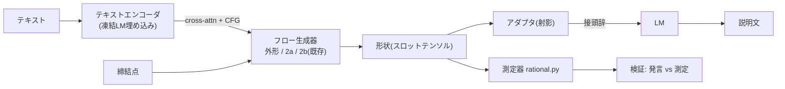

# 23. 言語モデル統合の PoC 計画(2026-09-03 決定、着手は条件付き)

**決定(ユーザー)**: 外形・曲げ・面の生成に一定の成果が出た段階で、本モデルの
「言語モデルとしての可能性」— **言葉→形状、形状→言葉の双方向生成** — を PoC で実証する。
方法は本書の推奨案(A → C)。

**着手条件**: KB 22 の P1(面の整合)または P2(メッシュ)で合格条件を満たしたとき。
それまでは着手しない(ただしテキスト条件の**小実験**は B2/B5 に効く見込みがあるため、
P1 と並行して行ってよい — 判断はユーザー)。

---

## 1. なぜ本課題と相性が良いか

- **条件付けの原則(KB 12)**: 締結点から導出できる情報は効かない。効いたのは設計上の決定を
  含む条件(外形→曲げ)だけ。**テキストは設計上の決定を運ぶチャンネル**そのもの
- **情報限界(KB 22 B5)**: 締結点だけでは外形を一意に決められない(教師床 14.9mm)。
  「両側にフランジ」「ビード1本を縦に」「座面余裕を大きく」は言葉でしか与えられない
- **モード取り違え(KB 18.7, 21.17 / B2)**: 未見族でビード族の形が出る。「フランジ部品」の
  一語で解消する種類の誤り
- **合理性評価(KB 17 D7)**: 「形の理由を説明できるか」を既に数値化している。形状→言葉の
  接地(grounding)に使える測定器が揃っている

## 2. 構成(推奨: A → C)

### 案A 疎結合(第1段、PoC の本体)

- **言葉→形状**: 既存の条件チャンネル(`--use-spec` の cross-attention、`--cfg-drop/--cfg-scale`)に
  テキスト埋め込みを追加。フロー本体・表現は変えない
- **形状→言葉**: スロットテンソル(外形辺列・面記述子・リング)を LLaVA 方式の射影で LM の
  接頭辞に写像し、説明文を生成。形状トークンは構造化済みなので画像より相性が良い

### 案C LMは計画、フローは描画(最終形)

言葉 → LM → **構造化された設計決定**(族、面構成、フランジの側、ビード本数、座面余裕)→
フロー生成器が幾何を実現。逆は 幾何 → 測定(rational + 面記述子)→ LM が説明。
「設計決定は言葉、幾何は学習」の分業が本課題の知見と整合する。

### 案B 密結合(採らない)

1つのマルチモーダル LM が形状トークンを自己回帰で出す案。閉ループ・ring_pe・残差変位など
「表現に埋めた性質」(CLAUDE.md 哲学1)をトークン文法で作り直す必要があり、自己回帰は
順不同集合を苦手とする(KB 03 の順序問題が再燃)。現段階では不利。

## 3. データ

- PartMaker の各部品に `params` がある → **パラメータから説明文を機械生成**し、LLM で
  言い換えて多様化(1日)。定型文だけ学ぶ「パラメータ語」化を言い換えで防ぐ
- 「設計の理由」(なぜフランジか)は `params` に無い。LLM 生成の理由付けは幻覚リスクがあるので、
  **まず測定で検証できる記述**(形状・寸法・座面・族)から始め、理由は後段
- 族の数が語彙の上限(KB 22 B3)。族の拡張(P3)と並行する

## 4. 評価(キャプション一致で評価しない — KB 05)

| 方向 | 評価 |
|---|---|
| 言葉→形状 | 合理性3層(KB 17)で判定 + **指示遵守を測定で確認**(「両側にフランジ」→ 面記述子の法線で数える) |
| 形状→言葉 | ①往復整合(言葉→形状→言葉) ②**発言を測定と照合**(座面余裕・寸法・族の主張が測定と一致するか) |
| 汎用性 | 未見族ホールドアウトで、テキスト有り/無しの差(B2 が解消するか) |

## 5. 見積り

| 項目 | 期間 |
|---|---|
| 説明文の機械生成 + 言い換え | 1日 |
| テキストエンコーダ + CFG 接続(外形・2a・2b) | 2日 |
| Kaggle 学習(テキスト有り/無し A/B) | 2日 |
| 形状→言葉アダプタ + 学習 | 2週 |
| 評価・記録 | 3日 |

言葉→形状の実測まで **約1週間**、双方向まで **約4週間**。

## 6. 記録

- 2026-09-03: ユーザー決定「外形・曲げ・面に一定の成果が出たら、推奨の方法で PoC を実施」。
  KB 22 ロードマップに P6 として登録。
- 2026-09-03: **PartMaker 刷新の引継ぎ書**を `C:\Users\hide2\IdeaBox\PartMaker\docs\HANDOVER_partmaker_renewal.md`
  に配置(Gemini が刷新を担当)。結論: CATIA/DELMIA COM → **OCCT で STEP 直接生成**(解析曲面のみ、面名を XCAF で付与)。
  言語 PoC の材料として**構築プログラム・キャプション・面ラベル・展開図**の出力を要求。ML 側の在り方の選択肢
  α(現行+教師強化)/ β(構築プログラムを中間表現に)/ γ(外形はフロー、面は構築)を同書 §6 に記載。推奨は α から。
