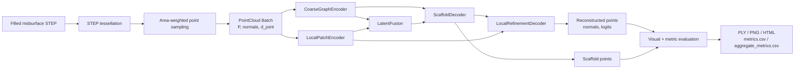
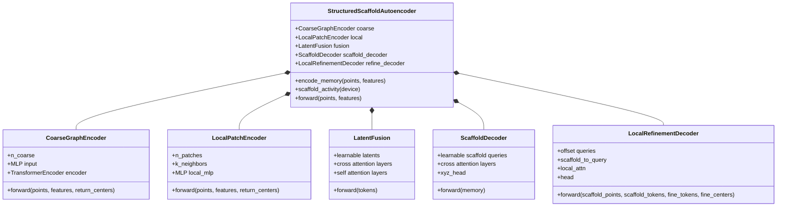
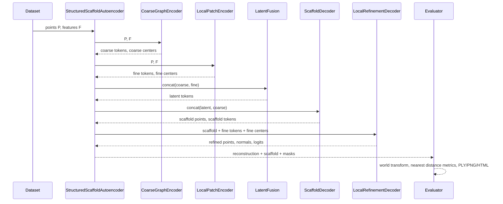
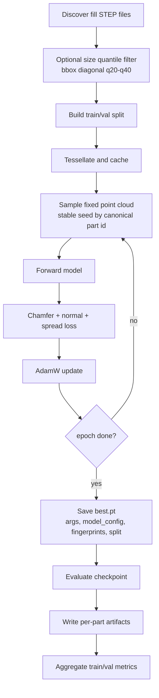
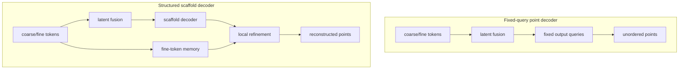
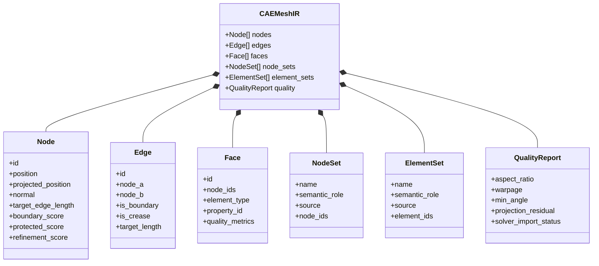
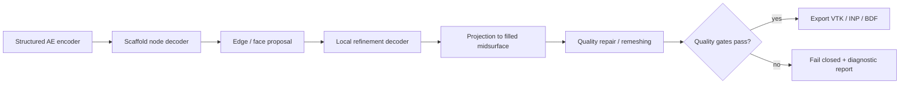

# Structured Scaffold Autoencoder Architecture

## 目的

この文書は、`cae_mesh_generator` に実装した板金中立面向けAIモデルの目的、入出力、数学的構造、UML、現状の検証結果、今後の改良方針をまとめる。

このモデルは最終的なCAEメッシュ生成器ではない。現段階の役割は、filled midsurface STEPから得た中立面点群だけを入力し、板金部品の大域構造と局所構造を潜在表現へ落とし、粗いscaffoldと局所復元点として再構成できるかを調べる構造理解probeである。

最終目標は、点群復元ではなく、節点、要素、境界、拘束点近傍、局所サイズ場、品質projectionを持つCAE-ready shell mesh生成である。現在のStructured Scaffold Autoencoderは、その前段となる「粗メッシュ + 局所細分化」型decoderの最小実装である。

## 設計思想

板金中立面は、bbox全体を密に占有する3D solidではない。薄肉の2D多様体に近く、重要情報は大域的な折れ・リブ・フランジ配置と、境界・穴・拘束点周辺の局所形状に偏る。

そのため、全点を巨大Transformerで直接処理するのではなく、以下の分解を採る。

| 役割 | 実装 | 意味 |
|---|---|---|
| 大域記憶 | CoarseGraphEncoder | 部品全体の骨格、長手方向、主要な折れ構造を保持 |
| 局所記憶 | LocalPatchEncoder | 境界、リブ、フランジ端、曲率変化、局所面パッチを保持 |
| 情報統合 | LatentFusion | 少数latent queryがcoarse/fine tokenから必要情報を読む |
| 粗生成 | ScaffoldDecoder | 部品全体を覆う粗いscaffold点を生成 |
| 局所細分化 | LocalRefinementDecoder | scaffold点ごとに近傍fine tokenへattentionし、局所復元点を出す |

## 実装ファイル

- `cae_mesh_generator/src/cae_mesh_generator/model/hierarchical_ae.py`
- `cae_mesh_generator/src/cae_mesh_generator/train_autoencoder.py`
- `cae_mesh_generator/src/cae_mesh_generator/evaluate_autoencoder.py`
- `cae_mesh_generator/tests/test_hierarchical_ae.py`

関連ドキュメント:

- `docs/cae_adaptive_shell_mesh_model.md`
- `docs/cae_midsurface_autoencoder_experiment_001.md`

## 現在の入出力

### 入力

入力はfilled midsurface STEPをOpenCASCADEでテッセレーションし、面積重み付きでサンプリングした固定点群である。

```text
N: input point count
D: feature dimension, current default D = 7

P = [p_1, ..., p_N]^T
  shape: N x 3
  p_i = normalized xyz coordinate

Nrm = [n_1, ..., n_N]^T
  shape: N x 3
  n_i = unit surface normal

d = [d_1, ..., d_N]^T
  shape: N x 1
  default: d_i = 1
  optional: nearest joint distance when --use-joint-distance is enabled

F = concat(P, Nrm, d)
  shape: N x 7
```

正規化は部品ごとに行う。

```text
center = (bbox_min + bbox_max) / 2
scale  = max_extent

p_normalized = (p_world - center) / scale
p_world      = p_normalized * scale + center
```

この `center` と `scale` は評価時にworld-mmへ戻すために保持する。

### 出力

現在のstructured modelは、CAEメッシュではなく復元点群と補助情報を返す。

```text
Y_hat:
  reconstructed points
  shape: N_out x 3

N_hat:
  reconstructed normals
  shape: N_out x 3

S_hat:
  scaffold points
  shape: M x 3

T_hat:
  scaffold tokens
  shape: M x C

r_hat:
  refinement logits
  shape: N_out
  note: currently unsupervised placeholder

active_scaffold_mask:
  shape: M

scaffold_point_counts:
  shape: M
```

`N_out` は `--n-points`、`M` は `--n-scaffold`、`C` は `--token-dim` である。

`N_out` が `M * points_per_scaffold` で割り切れない場合でも、復元点と `refinement_logits` は `N_out` に切り揃える。scaffold側は `active_scaffold_mask` と `scaffold_point_counts` で有効範囲を示す。評価可視化ではinactive scaffoldを出さない。

## 全体UML

### コンポーネント図



### クラス図



### 推論シーケンス



### 学習・評価アクティビティ



## 数学的詳細

以降では、batch次元は省略する。

### 記号表

| 記号 | shape | 意味 |
|---|---:|---|
| `P` | `N x 3` | 正規化された入力点座標 |
| `F` | `N x D` | 入力点特徴量、現在は `D=7` |
| `C` | scalar | token dimension |
| `Nc` | scalar | coarse token数 |
| `Np` | scalar | local patch token数 |
| `K` | scalar | patch近傍点数 |
| `L` | scalar | latent token数 |
| `M` | scalar | scaffold点数 |
| `Q` | scalar | 1 scaffold点あたりの局所生成点数 |
| `N_out` | scalar | 最終復元点数 |
| `T_c` | `Nc x C` | coarse tokens |
| `T_f` | `Np x C` | fine/local tokens |
| `Z` | `L x C` | fused latent tokens |
| `S` | `M x 3` | scaffold points |
| `U` | `M x C` | scaffold tokens |
| `Y` | `N_out x 3` | reconstructed points |

### Farthest Point Sampling

Coarse pathとlocal pathは、どちらもFPSで代表点を選ぶ。

```text
I = FPS(P, m)

I_1 = 0
I_t = argmax_j min_{a < t} ||p_j - p_{I_a}||^2
```

ここで `m` は `Nc` または `Np` である。実装上はbatchごとに決定的に実行される。

### CoarseGraphEncoder

Coarse encoderは、FPSで選んだ点の特徴量をTransformer encoderへ入れる。

```text
I_c = FPS(P, Nc)
F_c = gather(F, I_c)                  shape: Nc x D
X_c = MLP_c(F_c)                      shape: Nc x C
T_c = LayerNorm(Transformer(X_c))     shape: Nc x C
C_c = gather(P, I_c)                  shape: Nc x 3
```

`C_c` はcoarse centersである。現在のstructured decoderでは直接は出力に使わないが、将来のcoarse topology構築に使える。

### LocalPatchEncoder

Local encoderは、FPS中心ごとにkNN patchを作る。局所座標系として中心からの相対位置を入力に追加する。

```text
I_f = FPS(P, Np)
C_f = gather(P, I_f)                          shape: Np x 3

J_a = kNN(center=C_f[a], points=P, k=K)

For each patch a:
  R_a,b = P[J_a,b] - C_f[a]                   shape: K x 3
  G_a,b = concat(R_a,b, F[J_a,b])             shape: K x (D + 3)
  H_a,b = MLP_f(G_a,b)                        shape: K x C
  T_f[a] = LayerNorm(max_pool_b H_a,b)        shape: C
```

この設計により、点群全体の解像度を上げなくても局所形状のtokenを作れる。

### Token type embedding

coarse tokenとfine tokenには、別々のtype embeddingを加える。

```text
T_c' = T_c + e_coarse
T_f' = T_f + e_fine
```

structured modelでは、latent tokenにも `e_latent` を加える。

### LatentFusion

LatentFusionは、学習可能なlatent queryがcoarse/fine tokenを読むPerceiver型の圧縮である。

```text
T = concat(T_c', T_f')                 shape: (Nc + Np) x C
Z_0 = learnable_latents                shape: L x C
```

各layerで以下を行う。

```text
Z_a = Z + CrossAttention(query=LN(Z), key=LN(T), value=LN(T))
Z_b = Z_a + SelfAttention(query=LN(Z_a), key=LN(Z_a), value=LN(Z_a))
Z_next = Z_b + FFN(LN(Z_b))
```

最終的な `Z` が部品全体の潜在表現である。

### ScaffoldDecoder

ScaffoldDecoderは、固定のlearnable scaffold queryから粗い部品構造点を復元する。memoryにはlatent tokenとcoarse tokenの両方を使う。

```text
M_s = concat(Z + e_latent, T_c')       shape: (L + Nc) x C
Q_s0 = learnable_scaffold_queries     shape: M x C
```

各layerで以下を行う。

```text
Q_s_next =
  Q_s
  + CrossAttention(query=LN(Q_s), key=LN(M_s), value=LN(M_s))
  + FFN(...)
```

scaffold点とscaffold tokenは以下で得る。

```text
S = 0.75 * tanh(MLP_xyz(Q_s))         shape: M x 3
U = LayerNorm(Q_s)                    shape: M x C
```

`0.75 * tanh` は、正規化空間で初期出力が極端に飛ばないようにするクランプである。

### LocalRefinementDecoder

LocalRefinementDecoderは、各scaffold点に対して近傍fine tokenを選び、その局所memoryへattentionする。

まず、scaffold点とfine centerの距離でhard routingを行う。

```text
D_m,a = ||S[m] - C_f[a]||_2
K_m = topk_smallest(D_m, n_local_tokens)
M_m = gather(T_f', K_m)                shape: n_local_tokens x C
```

各scaffold点 `m` に対して、`Q` 個のoffset queryを作る。

```text
B_m = Linear(U[m])                     shape: C
O_q = learnable_offset_query[q]        shape: C
A_m,q = B_m + O_q                      shape: C
```

局所attentionとFFNを適用する。

```text
R_m,q =
  A_m,q
  + CrossAttention(query=A_m,q, key=M_m, value=M_m)
  + FFN(...)
```

最後に、局所offset、法線、logitを予測する。

```text
raw_m,q = MLP_refine(R_m,q)            shape: 7

delta_m,q = 0.20 * tanh(raw_m,q[0:3])
n_hat_m,q = normalize(raw_m,q[3:6])
r_hat_m,q = raw_m,q[6]

y_hat_m,q = S[m] + delta_m,q
```

全scaffoldの局所点をflattenする。

```text
Y_all = flatten(y_hat_m,q)             shape: (M * Q) x 3
N_all = flatten(n_hat_m,q)             shape: (M * Q) x 3
R_all = flatten(r_hat_m,q)             shape: (M * Q)

Y_hat = Y_all[0:N_out]
N_hat = N_all[0:N_out]
R_hat = R_all[0:N_out]
```

inactive scaffoldは以下で定義する。

```text
start_m = m * Q
count_m = clamp(N_out - start_m, min=0, max=Q)
active_m = count_m > 0
```

### 損失関数

現在の学習lossは、Chamfer、法線整合、spread regularizationである。

```text
L =
  L_chamfer
  + lambda_normal * L_normal
  + lambda_spread * L_spread
  + lambda_target_coverage * L_coverage
  + lambda_scaffold * L_scaffold
```

Chamfer:

```text
L_chamfer =
  mean_y min_x ||y - x||_2
  + mean_x min_y ||x - y||_2
```

ここで `x` はtarget point、`y` はreconstructed pointである。

法線整合:

```text
For each reconstructed point y:
  x*(y) = nearest target point

L_normal = mean_y (1 - abs(dot(n_hat(y), n_target(x*(y)))))
```

法線の向きは表裏反転の影響を避けるため、絶対値を使う。

Spread:

```text
L_spread =
  L1(mean(Y_hat), mean(P))
  + L1(std(Y_hat), std(P))
```

これは初期学習の崩れを抑える弱いbbox統計regularizerであり、CAE品質を直接表すものではない。

Coverage loss:

```text
For each target point x:
  d_target(x) = min_y ||x - y||_2
  tau_part = coverage_threshold_mm / scale_mm

L_coverage = mean_x max(0, d_target(x) - tau_part)
```

これは `target -> reconstruction` の取りこぼしに直接圧をかけるlossである。Chamferだけでは、生成点の一部が正解近傍に寄れば平均距離が下がるため、面全体のcoverage不足を見落としやすい。`L_coverage` は、5mmなどのworld-mm閾値を部品正規化scaleへ戻して使う。

Scaffold loss:

```text
S_target = FPS(P, number_of_active_scaffold_points)

L_scaffold =
  mean_s min_t ||s - t||_2
  + mean_t min_s ||t - s||_2
```

`S_target` はtarget点群からFPSで作るpseudo scaffoldである。これはscaffoldが部品全体を粗く覆うようにするための直接教師であり、局所refinement以前の粗構造破綻を抑える狙いがある。

追加CLI:

```text
--lambda-target-coverage
  target coverage lossの重み。既定は0.0で既存runと互換。

--coverage-threshold-mm
  coverage lossのworld-mm閾値。既定は5.0。

--lambda-scaffold
  scaffold pseudo target Chamfer lossの重み。既定は0.0。
```

loss smokeでは、`--lambda-target-coverage 0.5 --lambda-scaffold 0.2` をCPU/CUDAの両方で確認した。ログには `train_cov`, `val_cov`, `train_scaffold`, `val_scaffold` が出る。

## Baseline Point Decoderとの差分

baseline modelは、latent tokenに対して固定output queryがcross-attentionし、直接unordered point cloudを出す。

```text
baseline:
  P, F -> coarse/fine encoders -> latent Z -> fixed point queries -> points

structured:
  P, F -> coarse/fine encoders -> latent Z
       -> scaffold points
       -> nearest fine-token local refinement
       -> points
```

構造上の違いは、復元点が直接global latentから出るのではなく、scaffold点を経由して局所fine tokenへ接続されることである。これにより、部品全体の骨格と局所形状を分けて扱える。



## 現在の進捗

### 実装済み

- STEP filled midsurfaceのテッセレーション
- 面積重み付き点群サンプリング
- 部品IDに基づくstable sampling seed
- bbox対角長のサイズquantile選定
- train/val split manifest
- source fingerprint保存と評価時照合
- fixed-query point autoencoder baseline
- structured scaffold + local refinement autoencoder
- scaffold可視化
- split別aggregate metrics
- `model_config` checkpoint保存
- `active_scaffold_mask` / `scaffold_point_counts` 出力

### テスト

直近のテスト結果:

```text
python -m pytest cae_mesh_generator\tests -q

12 passed, 3 warnings
```

warningはPyTorch Transformerのnested tensor設定に関するもので、現在のテスト失敗ではない。

### 学習中validation

拡大検証では、epoch数を増やすほどtrain splitへの過学習を見落としやすくなる。そのため `train_autoencoder.py` は、validation splitがある場合に学習中の `val_loss` / `val_chamfer` を記録し、既定では `val_loss` 最良のcheckpointを `best.pt` として保存する。

追加CLI:

```text
--eval-every N
  validationを何epochごとに実行するか。epoch 1と最終epochでは必ず実行する。

--best-metric auto|train_loss|val_loss
  autoはvalidation splitがあればval_loss、なければtrain_lossを使う。

--save-every N
  N epochごとに last.pt を保存する。長時間学習では 25 から 50 程度を推奨する。

--resume path\to\last.pt
  last.pt から model / optimizer / history / best metric を復元して再開する。

--preload-data
  train/valの固定サンプル点群を学習開始時にメモリへ載せる。現在のAEは部品ID由来seedで固定サンプルを使うため、毎epochでSTEP cacheを読み直す必要がない。

--batch-size 2 or 4
  GPUメモリに余裕がある場合の第一候補。GTX 1660 SUPER 6GBでは、現在の512点・128dim構成ならbatch size 2から試す。

--pin-memory
  CUDA転送を少し軽くする。`--device cuda` と併用する。
```

checkpointには以下を保存する。

```text
best:
  epoch
  metric
  value
```

GPUは `--device cuda` で使用する。現在確認したローカル環境では PyTorch `2.6.0+cu124`、NVIDIA GeForce GTX 1660 SUPER 6GB、`torch.cuda.is_available() == True` であり、CUDA smoke trainingと `last.pt` からのresumeは成功している。

### 評価結果

q20-40 holdout、9部品、7 train / 2 val、shape-only、256 pointsで比較した。

| decoder | epoch | train Chamfer mean | val Chamfer mean | val target within 5mm |
|---|---:|---:|---:|---:|
| fixed point query | 120 | 12.110mm | 42.118mm | 4.7% |
| structured scaffold + local refinement | 80 | 10.590mm | 30.687mm | 13.3% |

structured decoderは、少ないepochでもfixed point queryよりval Chamferとtarget coverageを改善した。これは、粗scaffoldを介して局所fine tokenへattentionする方向が、未知部品の構造崩れを緩和する可能性を示す。

ただし、val target within 5mmは13.3%に留まり、CAE-readyとは言えない。特に `A0072601285_AllCATPart:21` はstructuredでもChamfer 34.104mm、target p95 39.355mmであり、特徴線や縦方向構造の取りこぼしが残る。

より大きい24部品runの詳細診断は、続編の `docs/cae_structured_q20_60_e1000_diagnostic_report.md` に記録する。このrunではstructured scaffold architectureのまま `q20-60`, `max_parts=24`, `epochs=1000` 設定を試し、epoch 110でvalidation best、epoch 500時点で過学習傾向を確認した。結論として、単にepochを伸ばすのではなく、coverage loss、boundary-aware token、scaffold supervision、CAE Mesh IR topologyへ進む必要がある。

### 次の拡大検証案

検証部品数とepoch数を増やす方針は妥当である。ただし、train lossだけを見て長時間回すと暗記を良い結果と誤読しやすいため、以下の順に切り分ける。

1. 同じアーキテクチャで部品数を増やし、val loss基準でbestを選ぶ。
2. 同じ部品集合をtrain-allにして、容量不足か汎化不足かを切り分ける。
3. split seedを複数回変え、特定val部品への偶然を避ける。

推奨する最初の本検証:

```powershell
$env:KMP_DUPLICATE_LIB_OK='TRUE'
$env:PYTHONPATH='C:\Users\hide2\IdeaBox\AutoMetalSheet\cae_mesh_generator\src'

python -m cae_mesh_generator.train_autoencoder `
  --model-kind structured `
  --max-file-mb 5.0 `
  --size-quantile-min 0.2 `
  --size-quantile-max 0.6 `
  --max-parts 24 `
  --val-fraction 0.25 `
  --split-strategy random `
  --split-seed 13 `
  --n-points 512 `
  --epochs 300 `
  --eval-every 5 `
  --best-metric auto `
  --batch-size 1 `
  --token-dim 128 `
  --n-coarse 128 `
  --n-patches 64 `
  --k-neighbors 24 `
  --n-latents 64 `
  --n-scaffold 128 `
  --points-per-scaffold 4 `
  --n-local-tokens 8 `
  --output-dir runs\cae_mesh_structured_q20_60_n24_e300_seed13 `
  --device cpu `
  --lr 0.001 `
  --log-every 10
```

GPU環境では `--device cuda` とし、同じ条件で `--split-seed 29`、`--split-seed 47` も回す。評価は各runで以下を実行する。

1000 epochで長く回す場合は、以下を使う。

```powershell
$env:KMP_DUPLICATE_LIB_OK='TRUE'
$env:PYTHONPATH='C:\Users\hide2\IdeaBox\AutoMetalSheet\cae_mesh_generator\src'

python -m cae_mesh_generator.train_autoencoder `
  --model-kind structured `
  --max-file-mb 5.0 `
  --size-quantile-min 0.2 `
  --size-quantile-max 0.6 `
  --max-parts 24 `
  --val-fraction 0.25 `
  --split-strategy random `
  --split-seed 13 `
  --n-points 512 `
  --epochs 1000 `
  --eval-every 10 `
  --save-every 25 `
  --best-metric auto `
  --batch-size 1 `
  --token-dim 128 `
  --n-coarse 128 `
  --n-patches 64 `
  --k-neighbors 24 `
  --n-latents 64 `
  --n-scaffold 128 `
  --points-per-scaffold 4 `
  --n-local-tokens 8 `
  --output-dir runs\cae_mesh_structured_q20_60_n24_e1000_seed13 `
  --device cuda `
  --lr 0.001 `
  --log-every 10
```

中断後は以下で再開する。

```powershell
python -m cae_mesh_generator.train_autoencoder `
  --model-kind structured `
  --max-file-mb 5.0 `
  --size-quantile-min 0.2 `
  --size-quantile-max 0.6 `
  --max-parts 24 `
  --val-fraction 0.25 `
  --split-strategy random `
  --split-seed 13 `
  --n-points 512 `
  --epochs 1000 `
  --eval-every 10 `
  --save-every 25 `
  --best-metric auto `
  --batch-size 1 `
  --token-dim 128 `
  --n-coarse 128 `
  --n-patches 64 `
  --k-neighbors 24 `
  --n-latents 64 `
  --n-scaffold 128 `
  --points-per-scaffold 4 `
  --n-local-tokens 8 `
  --output-dir runs\cae_mesh_structured_q20_60_n24_e1000_seed13 `
  --device cuda `
  --lr 0.001 `
  --log-every 10 `
  --resume runs\cae_mesh_structured_q20_60_n24_e1000_seed13\last.pt
```

6GB GPUでOOMする場合は、まず `--n-points 384`、次に `--token-dim 96` / `--n-coarse 96` / `--n-scaffold 96` へ落として比較する。

速度を優先する次回runでは、同じ条件に以下を追加する。

```powershell
  --batch-size 2 `
  --preload-data `
  --pin-memory
```

GPU使用率とメモリにまだ余裕があれば `--batch-size 4` も試す。ただしbatch sizeを変えると最適なlearning rateが変わる可能性があるため、まずは `lr=0.001` のまま seed 13 で比較し、val loss履歴と評価CLIのval target coverageで判断する。

coverage/scaffold lossを有効化する改善runでは、以下を追加する。

```powershell
  --lambda-target-coverage 0.5 `
  --coverage-threshold-mm 5.0 `
  --lambda-scaffold 0.2
```

最初は既存のq20-60 n24 seed13と同じsplitで比較し、`visual_eval` の `val target within 5mm` とworst部品のprojection overlayで判断する。

```powershell
python -m cae_mesh_generator.evaluate_autoencoder `
  --checkpoint runs\cae_mesh_structured_q20_60_n24_e300_seed13\best.pt `
  --output-dir runs\cae_mesh_structured_q20_60_n24_e300_seed13\visual_eval `
  --max-parts 0 `
  --device cpu
```

この結果で見るべき主指標は、`val_chamfer` の最良値ではなく、評価CLIの `val target within 5mm`、`val target p95`、worst partの可視化である。

## 現状の限界

| 項目 | 現状 | 問題 |
|---|---|---|
| 出力形式 | 点群 | CAE節点・要素ではない |
| topology | なし | edge/face接続がない |
| 境界保持 | 未実装 | フランジ端、穴、外周の保証がない |
| 拘束点 | optional距離特徴のみ | node/element setとして出ていない |
| refinement logits | placeholder | 教師lossも評価指標もない |
| 品質保証 | Chamfer中心 | aspect ratio、warpage、Jacobian、solver importを見ていない |
| projection | 未実装 | generated pointが厳密に中立面上とは限らない |
| 汎化評価 | 2 assembly, 9 selected parts | family-level holdoutには不足 |

## CAE Mesh IRへの拡張方針

次段階では、`S` を単なる点ではなくCAE Mesh IRの粗節点候補として扱う。

```text
CAE Mesh IR candidate:
  nodes:
    position
    projected position
    normal
    local target edge length
    boundary probability
    protected-region probability
    refinement priority

  edges:
    node_i
    node_j
    boundary flag
    crease / flange candidate flag

  faces:
    tri or quad connectivity
    material / property id
    quality metrics

  sets:
    node sets for fasteners, mounts, loads
    element sets for washers, contact, refinement regions
```

### 将来UML: CAE Mesh IR



### 将来パイプライン



## 改良ロードマップ

### Phase 1: 現モデルの診断強化

- boundary distance metricを追加する
- target coverageを部位別に分解する
- scaffold点のcoverageと重複を評価する
- `refinement_logits` を保存・可視化する
- part family単位のholdout splitを導入する

### Phase 2: CAE Mesh IRの導入

- scaffold nodeからedge/face候補を生成する
- 局所target edge lengthを予測する
- boundary/protected-region/refinement logitsに教師信号を入れる
- deterministic projectionを実装する
- mesh quality metricsをgate化する

### Phase 3: メッシュ生成としての学習

- pseudo target remesherを作り、節点・要素接続を教師化する
- Chamferだけでなく、coverage、normal consistency、edge length、boundary adherence、quality lossを使う
- quad-dominant化またはtri-to-quad postprocessを比較する
- solver import smoke testを正式評価に含める

### Phase 4: 条件付き生成

- joints、厚み、材料、荷重、拘束、設計空間を条件として入れる
- fastener washer patchやmount setを出力に含める
- 部品family単位で生成多様性とCAE品質を同時評価する

## 採用判断

現時点で言えること:

- dual encoderは、板金中立面の大域構造と局所構造を分けて読む実装として妥当である。
- fixed-query point decoderは、未知部品で構造が崩れやすい診断baselineとして扱うべきである。
- structured scaffold + local refinement decoderは、fixed-query baselineより有望である。
- ただし、現出力は点群なので、CAEメッシュ生成器としては未完成である。

次にやるべきことは、モデルを単純に巨大化することではない。scaffoldをCAE Mesh IRへ拡張し、topology、境界、局所サイズ場、projection、quality gateを明示的に扱うことで、板金という対象の構造をモデルとpost-processの両方に埋め込むことである。

この採用判断は、`docs/cae_structured_q20_60_e1000_diagnostic_report.md` の拡大診断で補強された。24部品runでも学習自体は成立したが、validation coverageは低く、epochを伸ばしても改善しなかった。したがって次の開発判断は「さらに長く学習する」ではなく「CAE Mesh IRに近い教師と評価を導入する」である。
