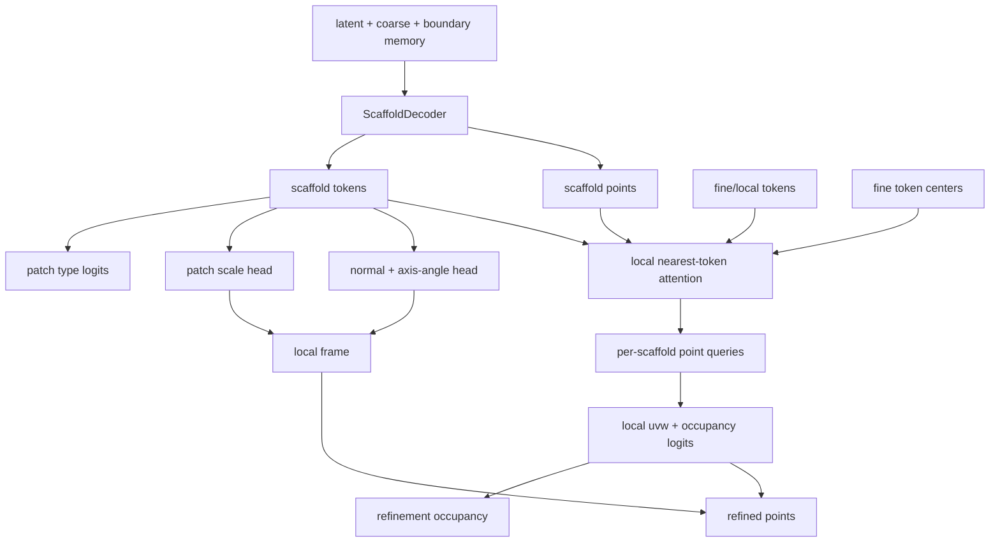

# Tangent-Frame Refinement Decoder Design

## Purpose

The previous structured autoencoder decoded local points as free 3D offsets around each scaffold node.
That representation is too permissive for sheet metal. It can emit points in a thick volume around a
thin midsurface strip, which appears as false-positive sheet area in visual evaluation.

This decoder extension changes the local output parameterization. The default remains the old
`free` mode for checkpoint compatibility, but `--refinement-mode tangent` enables a scaffold-local
tangent-frame decoder.

## Decoder Sketch



## Mathematical Form

For each scaffold node `i`, the scaffold decoder predicts:

- scaffold point `p_i`
- scaffold token `h_i`

The tangent decoder predicts a local frame:

- normal `n_i = normalize(f_n(h_i))`
- in-plane rotation `theta_i = pi * tanh(f_theta(h_i))`
- tangent axes `u_i, v_i`, obtained from `n_i` and rotated by `theta_i`
- patch scales `s_i = sigmoid(f_s(h_i)) * [s_tangent, s_tangent, s_normal]`
- unsupervised patch type logits `c_i = f_type(h_i)`

For each local query point `j` under scaffold `i`, the decoder predicts:

- local coordinates `a_ij = tanh(f_xyz(q_ij))`
- activity logit `r_ij`

The output point is:

```text
x_ij = p_i
     + a_ij[0] * s_i[0] * u_i
     + a_ij[1] * s_i[1] * v_i
     + a_ij[2] * s_i[2] * n_i
```

The important constraint is that the first two components are sheet-plane offsets, while the third
component is a smaller normal-direction offset. This makes the local generator closer to a shell patch
than a free 3D point emitter.

## Occupancy Supervision

`refinement_logits` are now trainable with a weak distance-derived target:

```text
d_ij = nearest distance from generated point x_ij to target midsurface, in mm

label y_ij = 1 if d_ij <= positive_threshold_mm
label y_ij = 0 if d_ij >= negative_threshold_mm
ignore otherwise
```

The loss is binary cross entropy over labeled generated points:

```text
L_occ = BCEWithLogits(r_ij, y_ij)
```

This does not yet remove points from the Chamfer loss. It teaches the decoder which generated local
points are reliable, so later CAE Mesh IR export can suppress inactive neighborhoods or convert them
into variable-density patch topology.

## Implemented Flags

```powershell
--refinement-mode tangent
--tangent-offset-scale 0.15
--normal-offset-scale 0.01
--patch-type-count 4
--lambda-refinement-occupancy 0.1
--occupancy-positive-threshold-mm 5.0
--occupancy-negative-threshold-mm 15.0
```

Default behavior is unchanged:

```powershell
--refinement-mode free
--lambda-refinement-occupancy 0.0
```

## Checkpoint and Evaluation Behavior

Checkpoints store:

- `refinement_mode`
- `tangent_offset_scale`
- `normal_offset_scale`
- `patch_type_count`

Training resume restores these settings before model construction. Evaluation also restores them from
`model_config`.

When `refinement_logits` are present, evaluation writes:

```text
recon_refinement_active.ply
```

if any generated points have `refinement_logit >= 0`. This is an inspection artifact for occupancy
behavior, not yet the official reconstruction metric.

## Smoke Validation

Implementation smoke:

```text
unit tests: 35 passed
compileall: success
CUDA tangent train smoke: success
CUDA tangent eval smoke: success
CUDA tangent resume smoke: success
```

Smoke directories:

```text
runs/cae_mesh_smoke_tangent_decoder_v1
runs/cae_mesh_smoke_tangent_decoder_v1_eval
runs/cae_mesh_smoke_tangent_decoder_v1_resume
```

The smoke run is intentionally tiny and is not a quality claim. Its purpose is to verify the complete
train/checkpoint/evaluate/resume path.

## Next Formal Experiment

Use the same q20-60 n24 seed13 split as prior formal comparisons, with the decoder changed first and
lattice left off initially:

```powershell
$env:PYTHONPATH='cae_mesh_generator/src'
python -m cae_mesh_generator.train_autoencoder `
  --output-dir runs/cae_mesh_structured_q20_60_n24_tangent_decoder_seed13 `
  --model-kind structured `
  --refinement-mode tangent `
  --tangent-offset-scale 0.15 `
  --normal-offset-scale 0.01 `
  --lambda-refinement-occupancy 0.1 `
  --occupancy-positive-threshold-mm 5.0 `
  --occupancy-negative-threshold-mm 15.0 `
  --max-file-mb 5.0 `
  --max-parts 24 `
  --size-quantile-min 0.2 `
  --size-quantile-max 0.6 `
  --val-fraction 0.25 `
  --split-strategy random `
  --split-seed 13 `
  --n-points 512 `
  --epochs 300 `
  --eval-every 10 `
  --save-every 25 `
  --device cuda `
  --preload-data `
  --pin-memory `
  --batch-size 2 `
  --token-dim 128 `
  --n-coarse 128 `
  --n-patches 64 `
  --k-neighbors 24 `
  --n-latents 64 `
  --n-scaffold 128 `
  --points-per-scaffold 4 `
  --n-local-tokens 8 `
  --use-boundary-feature `
  --boundary-sample-fraction 0.25 `
  --lambda-target-coverage 0.5 `
  --coverage-threshold-mm 5.0 `
  --lambda-scaffold 0.2 `
  --lambda-boundary-coverage 0.2 `
  --boundary-threshold-mm 5.0 `
  --lambda-boundary-scaffold 0.25 `
  --lambda-crease-scaffold 0.10 `
  --lambda-corner-scaffold 0.10 `
  --scaffold-target-points 128 `
  --scaffold-target-boundary-fraction 0.35 `
  --scaffold-target-crease-fraction 0.35 `
  --scaffold-target-corner-fraction 0.10 `
  --best-metric val_cae_score `
  --extra-best-metrics val_loss val_target_p95_mm val_boundary_p95_mm val_refinement_occupancy
```

Decision criterion:

- If Chamfer and recon p95 improve while target/boundary p95 do not collapse, tangent decoding is useful.
- If occupancy accuracy improves but geometry does not, the next step should make occupancy affect point export/topology.
- If both fail, the next step should be explicit CAE Mesh IR connectivity rather than more point-cloud losses.

## Formal q20-60 n24 Seed13 Result

The formal run completed:

```text
runs/cae_mesh_structured_q20_60_n24_tangent_decoder_seed13
```

Evaluation outputs:

```text
runs/cae_mesh_structured_q20_60_n24_tangent_decoder_seed13_eval_all24_best
runs/cae_mesh_structured_q20_60_n24_tangent_decoder_seed13_eval_all24_val_loss
runs/cae_mesh_structured_q20_60_n24_tangent_decoder_seed13_eval_all24_refinement_occupancy
runs/cae_mesh_structured_q20_60_n24_tangent_decoder_seed13_eval_all24_last
```

Training selected early checkpoints:

| selection metric | epoch | validation value | validation notes |
|---|---:|---:|---|
| `val_cae_score` | 50 | 76.143 | same checkpoint as target-p95 best |
| `val_loss` | 40 | 0.450927 | same checkpoint as boundary-p95 best |
| `val_target_p95_mm` | 50 | 31.254 mm | worse than prior baselines |
| `val_boundary_p95_mm` | 40 | 35.090 mm | worse than prior baselines |
| `val_refinement_occupancy` | 10 | 0.258020 | geometry still immature |

Validation-split aggregate metrics from full 24-part evaluation:

| checkpoint | epoch | Chamfer mean mm | recon p95 mean mm | target p95 mean mm | target within 5mm | boundary p95 mean mm | boundary within 5mm |
|---|---:|---:|---:|---:|---:|---:|---:|
| tangent CAE-score best | 50 | 44.288 | 61.379 | 31.371 | 0.075 | 36.983 | 0.061 |
| tangent val-loss best | 40 | 46.963 | 60.235 | 32.630 | 0.071 | 34.486 | 0.068 |
| tangent occupancy best | 10 | 63.864 | 83.190 | 37.926 | 0.029 | 44.389 | 0.020 |
| tangent last | 300 | 60.057 | 75.941 | 46.005 | 0.049 | 49.896 | 0.035 |

Comparison against stronger previous checkpoints:

| checkpoint | Chamfer mean mm | recon p95 mean mm | target p95 mean mm | target within 5mm | boundary p95 mean mm | boundary within 5mm |
|---|---:|---:|---:|---:|---:|---:|
| topology-boundary boundary-best | 23.448 | 30.706 | 19.334 | 0.201 | 20.711 | 0.270 |
| boundary-token CAE best | 24.255 | 33.658 | 18.506 | 0.197 | 23.248 | 0.215 |
| split-scaffold CAE best | 25.134 | 36.340 | 18.520 | 0.192 | 20.486 | 0.143 |
| prediction-surface CAE best | 28.036 | 38.550 | 21.175 | 0.157 | 18.449 | 0.181 |
| lattice val-loss best | 28.027 | 38.401 | 22.924 | 0.158 | 28.707 | 0.151 |
| tangent CAE-score best | 44.288 | 61.379 | 31.371 | 0.075 | 36.983 | 0.061 |

The tangent-frame decoder is a negative result in its current form.

- It overfits strongly: last checkpoint train Chamfer is 8.519 mm, but validation Chamfer is 60.057 mm.
- It fails especially on held-out thin strip-like parts such as `A0072600002_AllCATPart:081`.
- The decoder still emits a sheet-like patch volume in the wrong place when the scaffold placement is wrong.
- Occupancy logits do not generalize yet. The occupancy-best checkpoint suppresses active output too early, while later checkpoints activate almost every generated point.

Interpretation:

1. A learned tangent frame is not sufficient if the scaffold itself is poorly anchored on held-out parts.
2. Patch-local geometric constraints can improve the inductive bias, but they also make scaffold placement errors more expensive.
3. Occupancy needs to affect export/topology, not only be logged as an auxiliary prediction.
4. The next useful decoder change should anchor scaffold proposals to observed local evidence or move directly toward explicit CAE Mesh IR connectivity.

Recommended next direction:

- add scaffold proposal anchors from encoded fine/coarse centers, with learned residuals rather than fully free scaffold queries;
- evaluate active-only reconstruction as a separate diagnostic, then make active occupancy influence export;
- represent local patches as connected nodes/edges instead of unordered point sets;
- keep pure tangent mode available for experiments, but do not make it the default.
