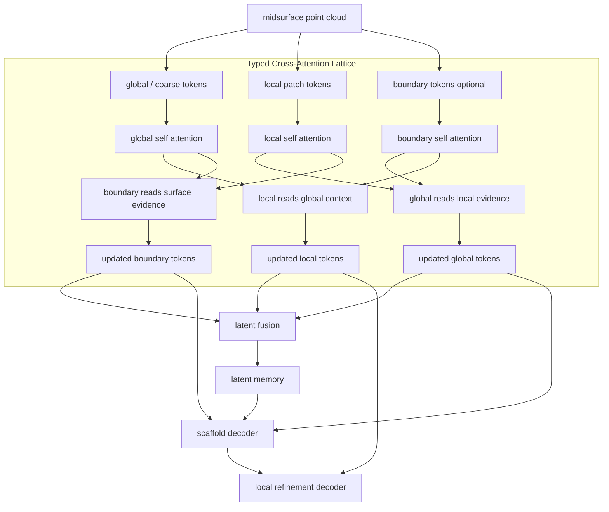

# Typed Cross-Attention Lattice Design

## Purpose

This note defines the next structured autoencoder extension for sheet-metal midsurface reconstruction.
The goal is not to make the transformer network larger for its own sake. The goal is to give the
network structure a qualitative design meaning.

The current structured autoencoder creates three kinds of evidence:

- global / coarse tokens: whole-part structural context.
- local / patch tokens: local midsurface evidence.
- optional boundary tokens: open-edge and boundary-like constraints. The first implementation keeps
  the old one-token summary as the default, but `--boundary-token-count > 1` enables multiple learned
  boundary queries that read boundary-weighted point evidence.

The current model fuses these streams relatively shallowly. The proposed extension lets these streams
repeatedly cross-attend to each other before latent fusion and decoding.

## Architecture Sketch



## Qualitative Meaning of Each Stream

| stream | role | design question |
|---|---|---|
| global / coarse | part-scale structural context | What is the whole sheet footprint, load path, and major flange/bend arrangement? |
| local / patch | local surface evidence | What local midsurface patch, curvature, rib-like detail, or flange-like detail exists here? |
| boundary | open-edge and constraint-like evidence | Where must the generated sheet stop, turn, or preserve edge detail? |

## Qualitative Meaning of Each Cross-Attention Direction

| update | attention source | design intent |
|---|---|---|
| global <- local, boundary | local surface evidence and edge constraints | Prevent the global scaffold from ignoring thin strips, flanges, or boundary-driven shape changes. |
| local <- global, boundary | global structure and edge constraints | Prevent local refinement from emitting free 3D points outside the sheet footprint. |
| boundary <- global, local | skeleton and nearby surface evidence | Keep boundaries attached to the correct local patches instead of treating them as independent point samples. |

## Design Principles

1. Global context should constrain local reconstruction, not overwrite local evidence.
2. Boundary information should not be compressed into only one global summary when local edge placement matters.
3. Local patch generation should happen after local tokens have read both global structure and boundary constraints.
4. The lattice output should feed both latent fusion and the downstream decoders.

## Initial Implementation Boundary

The first implementation keeps the decoder unchanged and makes the lattice optional:

1. `CoarseGraphEncoder` and `LocalPatchEncoder` create global/local tokens.
2. `BoundaryTokenEncoder` creates optional boundary memory when boundary features are enabled. With
   `--boundary-token-count > 1`, `BoundaryPatchEncoder` creates multiple boundary stream tokens instead
   of one pooled summary.
3. Boundary encoders are zero-gated when the current sample has no boundary-marked input points. This
   prevents all-point fallback tokens from masquerading as boundary constraints.
4. `TypedCrossAttentionLattice` updates global/local/boundary streams.
5. Updated tokens feed `LatentFusion`.
6. Updated global and boundary tokens also feed `ScaffoldDecoder`.
7. Updated local tokens feed `LocalRefinementDecoder`.

This isolates the effect of semantic token interaction. If it improves validation tradeoffs, the next
change should be a scaffold-local tangent-frame patch decoder. If it does not, that is evidence that
the main bottleneck is the output representation rather than only feature fusion.

## Resume and Evaluation Compatibility

Lattice checkpoints store `lattice_layers`, `lattice_heads`, and `boundary_token_count` in `model_config`.
Evaluation restores these fields automatically. Training resume also restores the checkpoint run's
model/data/loss arguments before constructing the model, so `--resume last.pt` does not require manually
restating the lattice architecture.

## Formal q20-60 n24 Seed13 Result

The first formal lattice run used the same q20-60 n24 seed13 split as the preceding boundary/scaffold
experiments:

```text
runs/cae_mesh_structured_q20_60_n24_lattice_boundary_tokens_seed13
```

Key settings:

```text
--use-boundary-feature
--boundary-token-count 4
--lattice-layers 1
--lattice-heads 4
--boundary-sample-fraction 0.25
--lambda-boundary-coverage 0.2
--lambda-boundary-scaffold 0.25
--lambda-crease-scaffold 0.10
--lambda-corner-scaffold 0.10
```

Validation and smoke status:

```text
unit tests: 33 passed
CUDA train/eval/resume smoke: success
formal 300-epoch CUDA run: complete
```

Validation-split aggregate metrics from full 24-part evaluation:

| checkpoint | epoch | Chamfer mean mm | recon p95 mean mm | target p95 mean mm | target within 5mm | boundary p95 mean mm | boundary within 5mm |
|---|---:|---:|---:|---:|---:|---:|---:|
| lattice CAE-score best | 70 | 35.145 | 48.299 | 22.176 | 0.113 | 22.513 | 0.113 |
| lattice val-loss best | 100 | 28.027 | 38.401 | 22.924 | 0.158 | 28.707 | 0.151 |
| lattice target-p95 best | 90 | 30.432 | 42.157 | 21.084 | 0.136 | 25.847 | 0.115 |
| lattice last | 300 | 38.975 | 49.044 | 31.656 | 0.092 | 35.928 | 0.055 |

The result is negative relative to the strongest prior checkpoints. The lattice gives the encoder/fusion
network a cleaner semantic structure, but it does not by itself fix the current output representation.
The unchanged unordered point decoder can still emit false sheet area and does not reliably densify thin
valid regions.

Design implication:

1. Keep the lattice as an optional module for future decoder experiments.
2. Do not increase lattice depth before changing the decoder.
3. Move the next performance experiment to scaffold-local tangent-frame decoding, patch axes/scale/type
   prediction, occupancy/refinement supervision, and explicit CAE Mesh IR topology.
