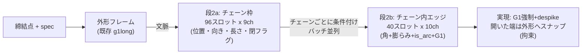

# 曲げ表現の設計(KB 20)

> 統合日 2026-09-05。以下は元文書を順に**そのまま**収録(見出し番号は元のまま。`KB 21.24` のような参照はこのファイル内を検索)。
> 収録元: `KB\20_bend_design.md`

---

<!-- 元文書: KB\20_bend_design.md -->

# 20. 曲げ表現の設計 — CATIAプリミティブ + 2段チェーン生成

Date: 2026-08-31
状態: **承認済み・実装済み**(20.6)。夜間Kaggle掃引の結果待ち。
前提: KB 17.5(密トークン12×・角トークンの`end`落ち)、KB 18(CATIAエッジ=教師)、
KB 19(逆走不能表現は曲げと同族で扱う)。

---

## 20.0 結論(推奨)

曲げ線・ビード稜線を **「チェーンの集合」** として2段で生成する:

- **エッジの単位はCATIAのB-repエッジ**(外形とまったく同じKB 18の動き)
- **区切り(チェーンの境界)は構造で保証**: チェーン=独立したテンソル。
  スロット列を跨ぐ接続が定義上存在しないので、`end`フラグの取りこぼしで
  曲線間を飛ぶ失敗(KB 17.5)が**起こりえない**
- 段2bは外形フレームの機械(角+膨らみ+is_arc+G1、正準化、`enforce_g1`、
  `despike`、3層評価)を**そのまま再利用**する

---

## 20.1 設計入力の測定(すべて2026-08-31、`wtok_synth_g1` wireframes)

### CATIAエッジは曲げでも1プリミティブ(60部品、6674エッジ)

| 測定 | 値 |
|---|---|
| 1本のLINE/ARCへの当てはめ残差(0.25t単位) | 中央値 0.000、p90 0.00、**超過 0.0%** |
| 種別 | LINE 5165 / ARC 1509(弧23%) |
| 弧のサジッタ | 中央値 0.7t(小さいが実在) |

→ 外形と同じく、**再分割もスプラインも不要**。エッジ=スロットが成立。

### チェーン構造(200部品)

| 量 | 中央値 | p95 | p99 | 最大 |
|---|---|---|---|---|
| エッジ/部品 | 140 | 146 | — | 162 |
| チェーン/部品 | 17 | 66 | 86 | **90** |
| エッジ/チェーン | 2 | 11 | 18 | **40** |

- 単エッジチェーン48%、閉チェーン61%(ビード稜線ループ等)
- **2つの最大値は反相関**: 多チェーン部品は短い(90本×最大8辺)、
  長チェーン部品は少ない(15本×40辺)。必要セル数は中央値285・最大989
- チェーン内接合の接線角: **G1(<3°) 50% / 曖昧 10% / 実在角(≥15°) 39%**
  → G1チャンネルは曲げでも必須(外形の78/18/4より角が多い)

### 端点の接続(60部品、474個の開いた端)

**100%が外形上(2t以内)。浮いた端は0。**
→ 「開いたチェーンの端は外形に載る」は教師の厳密な性質 = **サンプリング時拘束にできる**
(座面拘束と同じ型: 文脈=生成済み外形から導出される硬い拘束)。

### 幾何による区切りは不可能(200部品、棄却測定)

「各エッジが自分の両端点を持ち、端点の一致で接続を判定する」案の成立条件を測定:

| 別々の端点どうしの最短距離(t単位) | p1 0.0 / p5 0.0 / 中央値 **0.2** |
|---|---|
| 2t未満の割合 | **87%** |

さらにチェーンは分岐点(次数≥3)で物理的に**同一点を共有**する。
→ 近接では「同一チェーンの続き」と「分岐で接する別チェーン」を原理的に区別できない。
**区切りは幾何でなく構造で持つしかない。**

---

## 20.2 候補3案と判定

| 案 | 区切りの保証 | 容量 | 判定 |
|---|---|---|---|
| A フラット160スロット+`end`フラグ | ✗ 学習されたフラグ1bitに依存。角トークンで実証済みの失敗(KB 17.5) | ○ 162 | **棄却** |
| B 2Dグリッド(チェーン行×エッジ列) | ◎ 構造 | ✗ 96×40=3840スロット(必要最大989の4倍、アテンション二乗で密トークンの56倍) | **棄却** |
| **C 2段(チェーン枠→チェーン内エッジ)** | ◎ 構造(チェーン=独立テンソル) | ◎ 96 + チェーン数×40²(バッチ並列)| **採用** |

C は既存の段構成(外形→曲げ)の思想を1段下に適用したもの。効いた唯一の条件付けが
「外形→曲げ」(KB 12)であり、「チェーン枠→エッジ」は同じ形。

---

## 20.3 詳細設計

### 段2a: チェーン枠(what chains exist)

- テンソル: `CHAIN_SLOTS = 96`(実測最大90+余裕。**容量であって個数ではない**)× 9ch
- チャンネル: 重心 xyz(3) / 主方向(3、無向: 最大成分が正) / log長(1) / 閉フラグ(1) / unused(1)
- 正準順: **長さ降順**(`bend_frame` の実績ある規約)。個数は観測値
- PE: `slot_pe`(順序付きリスト)
- 条件: 締結点行 + spec行 + **外形フレーム文脈**(既存の bend 段と同一) + rel-attn
- 損失: 素の flow matching(性質は損失に書かない)

### 段2b: チェーン内エッジ(what each chain looks like)

- テンソル: `CEDGE_SLOTS = 40`(実測最大40。超過部品は報告の上ドロップ)× 10ch
- チャンネル: 角 xyz(3) / 膨らみ(3) / is_arc(1) / unused(1) / **G1フラグ(1)** / 予備(1)
  — 外形フレームと同型(法線chは初期は載せない。パネル面が要るときの拡張点)
- 接続は**スロット隣接が定義**(外形と同じ): エッジi = 角i→角i+1。
  開: 生きた角n個 → エッジn−1本。閉: 2aの閉フラグで最終角→先頭角を**構造的に**接続
- 正準化: 開=外形寄りの端を先頭(端は100%外形上)、閉=外形の `_canonicalise` と同じ規則
- PE: 開=`strand_pe` / 閉=`ring_pe`(2aの閉フラグでサンプルごとに選択)
- 条件: そのチェーンの2a記述子(重心・方向・長さ・閉)を条件行に追加 + 締結点 + spec + 外形文脈
- 生成: 1部品の全チェーンを**バッチとして並列**に描く
- 学習時の2a記述子は真値に**ノイズ注入**(文脈スワップと同じ理由: 完全な上流を信じ切らせない)

### 教師の構築(`wireframes` → 新targets)

1. bend_line + crease エッジをKB 18方式でプリミティブ化(エッジ単位フィット、jt=プリミティブ接線の接合角、G1閾値3°)
2. クラスタ溶接0.05mm(18.5のグリッド丸め事故の教訓) → 次数≥3で止まるチェーン歩き
3. 2a/2b 両targetsを量子化前の生座標から作る(18.4: 量子化は接線を壊す)

### サンプリング時拘束と実現

- **外形スナップ**(`constrain`): 開チェーンの端の角が生成済み外形の4t以内なら外形上へ投影
  (教師で100%成立する性質。座面拘束と同じ「導出できる硬い拘束」)
- 実現: チェーンごとに `enforce_g1`(暴走ガード込み) + `despike` + 弧実現(外形と同一コード)

### 評価(先に合格条件を書く — 習慣F)

| 層 | 指標 | 合格条件(教師床) |
|---|---|---|
| 1 | スパイク / スライバー | 教師と同率(despike後0%目標) |
| 2 | 余剰回転(`bend_score`)/ 接合一致(junction_match)/ チェーン数・エッジ数分布 | 余剰回転 教師比 ≤1.5×(現状12×→角トークンでも2×) |
| 3 | **浮いた端 0%**(拘束で構造保証) / 剛性代理は後続 | 0% |
| 参考 | Chamfer(ゲートにしない) | 報告のみ |

ランクはK描画を**部品単位**(全チェーン集計)で3層キー。比較対象: bendtok1(密)、bendcorner1(角)、同一ハーネス・同一30部品。

---

## 20.4 検証計画(実装順)

1. **教師の往復**: encode→realize を生polylineと比較(外形は0.45mm。同水準が合格)。
   容量超過部品の割合を報告
2. **段2aだけの短時間学習**(ローカル30分): チェーン数・位置の再現をプローブ
3. **段2b**(真の2a記述子で学習、ノイズ注入): チェーン単位の余剰回転・G1一致
4. **通し学習**(Kaggle、シード修正込みスイープ) → E2E 3層評価+3D斜め画像
5. 成功なら: 外形の変位型化(KB 19の逆走不能表現)を同じ機械で検討

## 20.5 リスク

| リスク | 備え |
|---|---|
| 2a→2bの誤差複利 | 2b学習時のノイズ注入(既存の文脈スワップと同じ)。2aの誤差は「チェーンの過不足」として層2の分布指標で監視 |
| 並走するビード稜線ペアの平均化(モード崩壊) | rel-attn。2aプローブで稜線ペアの分離を目視+計測 |
| 閉フラグ誤り(ring/strand取り違え) | 61/39と均衡が良く、外形G1フラグの学習実績あり。junction_match型の一致率を報告 |
| 40スロット超のチェーン | ドロップ率を報告(200部品で最大40、超過0)。増えたら容量を上げるだけ |
| 段が1つ増えることによる学習・推論の複雑化 | 2bはチェーンバッチで並列、既存StageFlowの流用。新規モデルクラスは作らない |

## 20.6 実装記録(2026-08-31 深夜、検証①〜③)

| 検証 | 結果 |
|---|---|
| ① 教師の往復 | **中央値0.342mm、最悪0.451mm、容量超過0/60**(外形の0.45mm水準を上回る) |
| ② 2a学習(chainset1、300ep) | チェーン数誤差 105%→**17.1%**、重心距離 7.3mm(プローブ) |
| ③ 2b学習(chainedges1、40ep) | 角数誤差 **0〜10%**、チェーン単体Chamfer **2.5mm**(真の2a記述子+ノイズ、プローブ) |

実装: `chains.py`(教師・実現・往復)、staged.py の `chain_set`/`chain_edges` 段
(2b=1チェーン1サンプル、記述子ノイズ、外形文脈)、`chain_eval.py`(E2E、外形スナップ拘束、
教師床)、`load_model` の cross/ordered をckptから導出(非外形モデルの誤構築を修正)、
`--seed`(g1a==g1bの教訓)、チェーン教師キャッシュ(13MB/2294部品、float32等価)。

**Kaggle夜間掃引** `autometalsheet-chain-sweep` v1(8.5h): 2a×2シード(900ep)+
2b×2シード(120ep、rel)。**初の実行間ばらつき推定**(B5)を兼ねる。
取得: `python tools/kaggle_ops.py pull --title autometalsheet-chain-sweep --out runs/kaggle_chains`
→ 各 best.pt を `chain_eval` にかける。

## 20.7 失敗時の心構え(ユーザー指示、2026-08-31)

1. **形状の表現は固定概念にとらわれない。**様々な形式を模索する(この設計自体も候補の1つ)
2. **汎用性は絶対死守。**どんな締結点・どんな構造の入力にも学習・生成で対応できること
3. **学習は損失で、評価は工学的成立性で。**力学的な構造の合理性/製造可能性が判定基準
   (3層合理性、KB 17)。損失・Chamferで合否を語らない

## 20.8 教師の重大欠陥(ユーザー発見、2026-09-01)と設計の転換点

**ユーザーがCATIA実画面との照合で発見**: 教師レンダリングはビード稜線Rがカクカクで、
ビード曲げ部・コーナー部の曲げ線が欠落。調査結果:

| 測定 | 結果 |
|---|---|
| 教師クラス | `bend_line` のみ使用(`crease`は実データに存在せず)。**抽出側は回答書で surface_frame を通せと勧告済みだった** |
| 高曲率面(>15°)の被覆漏れ | bend_lineのみ **38.6%**(中央値)→ +surface_frame で **0.2%** |
| 欠けていたもの | ビード稜線R・四隅 = `surface_frame`(曲面↔曲面境界)、折り横断線 = `seam`(plane\|plane) |
| 全クラスでのチェーン構造 | **崩壊**: 接合次数3〜4が支配(7,414/7,901エッジ)、284エッジ→284単エッジチェーン、閉0%、端の91%が外形外。ブリッジ選別も無効(284→228) |
| 隣接面ペアによる分類 | bend_line=曲面\|平面(cylinder\|plane等)、surface_frame=曲面\|曲面(cylinder\|sphere等)、seam=plane\|plane — **エッジ種別は面の幾何ペアと綺麗に対応** |

**含意**: 完全な曲げ教師は「チェーンの集合」ではなく**面境界ネットワーク**(次数3-4の接合を持つ
B-repエッジグラフ)。KB 20の2段チェーン設計は bend_line のみの測定の上に建っており、
前提が崩れた。心構え①「表現は固定概念にとらわれない」の適用場面。

**巻き添え**: chainset1/chainedges1、Kaggle chain-sweep v2 は誤った教師で学習 → **破棄**。
オラクル分解(30部品: 外形の生成/真は無関係、2aの生成化でChamfer 2.7→5.5mm・浮き26→45%、
真の記述子でも2bの余剰回転は教師の10倍)は記録として残すが、教師是正後に再測定。

### 転換の提案: 面ループ表現(B-repネイティブ)

ネットワークの各エッジは**ちょうど2つの面の境界**。ならば生成単位をチェーンでなく
**面(face)**にする:

- 2a: **面の集合**(重心・法線・スケール・種別なし記述子) — 「どんな面があるか」
- 2b: **面ごとの境界ループ**(角+膨らみ+is_arc+G1 の閉リング = **外形フレームと完全同型**、
  ring_pe、開いた端が存在しないので外形スナップ不要 — 外形エッジ自体が面ループに参加)
- ネットワークは面ループの和として**構造的に**再構成される(各内部エッジは2つのループに現れ、
  実現時に溶接)。メッシャが欲しいのはまさに面パッチ境界 — **B-rep出力(`surface_frame`の生成)へ
  最短の道**でもある(CLAUDE.md の B-rep 行)
- 2段機構(20.3)・キャッシュ・評価はほぼ流用可能

**障害**: wireframe のエッジ record に**隣接面の ID が無い**(face_types=種別のみ)。
エッジ→面所属が要る → **抽出側への依頼が必要**(edge record に face ids を追加。
面種別・面数は既に part レベルに出力されているので小変更のはず)。

### 代替案(依頼が通らない場合)

- B: 全クラスのネットワークをエッジ単位スロット(~300)+幾何溶接で生成(区切り問題が
  エッジ単位では消える: 1スロット=1エッジで両端点持ち。20.1の「幾何区切り不可」測定は
  チェーン同定についてであり、**junctionでの点共有はネットワークとしてはむしろ正しい**)。
  容量300×9chはアテンション的に重いが密トークン512よりは軽い
- C: 現行チェーン表現のまま bend_line+ブリッジのみ(被覆38.6%漏れを許容) — **非推奨**(機能評価に反する)
