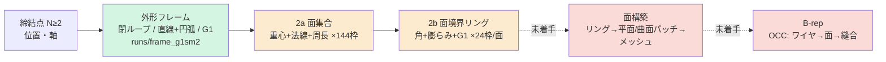

# 現在地とロードマップ(KB 22)

> 統合日 2026-09-05。以下は元文書を順に**そのまま**収録(見出し番号は元のまま。`KB 21.24` のような参照はこのファイル内を検索)。
> 収録元: `KB\22_status_roadmap.md`

---

<!-- 元文書: KB\22_status_roadmap.md -->

# 22. 現在地の整理とロードマップ(2026-09-03)

目標: **締結点のみ → 板金中立面のメッシュ(将来は B-rep)** を、形状ルールを書かずに学習で生成する。
本書は「どこまでが成果か / どこがボトルネックか / どう達成するか」の総括。数値は全て測定済み
(出典を KB 番号で示す)。見積りは実績ベースの概算で、±50% の幅を持つ。

---

## 1. パイプラインと到達段

緑 = 合格水準、橙 = 動くが未合格、赤 = 未着手。

---

## 2. 成果(測定済み)

| 段 | 到達点 | 根拠 |
|---|---|---|
| 締結点フレーム | N≥2 に一般化。生成 N=2〜5 通過 | KB 19 |
| 外形 | ビード族 val: 座面 100%、スパイク 0%、鋭角取りこぼし 0、余剰回転 1.1×(教師比)、近傍 2.1mm。**閉ループ・直線+円弧なので CAD にそのまま渡せる形** | KB 18.8 |
| 曲げの表現 | 曲率場・点群・トークン・チェーンを実測で棄却し、**面ループ表現**(面=生成単位、境界=閉リング)に到達。教師の自己整合 0%(全点が他リングか外形上に乗る) | KB 10, 20, 21 |
| 面の E2E | ビード族 val: 未整合 **9.2%**、余剰 2.8×、Chamfer 2.9mm、未被覆 33% | KB 21.17 |
| 評価系 | 3層合理性(製造可能性/簡潔性/機能)+教師不要の自己整合指標。Chamfer は参考値に降格 | KB 17, 21 |
| データ | 2807 部品・2 部品族(ビード 2300、フランジ 507)、v4.5 ワイヤーフレーム(face_ids)、メッシュ npz、面教師キャッシュ。フランジ用ホールドアウト 30 | KB 21.16 |
| 方法論 | 「性質は表現に埋め込む(4勝)」「導出できる条件は効かない(4敗)」「本数を先に決めない」「数値と絵の両方で判定」 | CLAUDE.md, KB 03, 05, 12 |

**要するに**: 外形は合格、曲げは「正しい表現に乗って動いている」段階、面とメッシュは未着手。

---

## 3. ボトルネック(重要度順)

### B1. 面境界リングの整合(面段の未合格の本体)

未整合 9%・余剰 2.8×・未被覆 33%。学習量は 2a(エポック)・2b(E2E は ep90 で頭打ち)とも
尽きており(KB 21.15)、部品数レバーも 2a に効くだけ(21.16)。残りは**表現の問題**:

- 現在は面ごとに独立にリングを出すため、**隣接面が共有する辺が 2 回別々に生成される**。
  自己整合(他リングに乗る)は損失に書いていないので、乗らない分が未整合として残る
- 未被覆 33% は「曲率のある場所に面が置かれていない」= 2a が面の**同定**を落としている
  (記述子=重心+法線+周長には隣接関係が無い)

これが**メッシュ化を止めている直接の障害**でもある。整合しないリングからは面を張れない。

### B2. 部品族をまたぐ汎化(汎用性)

フランジ族(未見)で外形が約半数**ビード族のモードに取り違え**、余剰 2.6×、近傍 4.0mm。
2a だけにフランジを学習させても E2E は改善しない(21.17)。**3 段すべてが全部品族を学習**
して初めて評価に乗る(今夜検証中)。構造的には「族ごとの特化」ではなく「見た族しか出せない」
状態で、族が増えるたびに全段を再学習する運用になる。

### B3. データの制約(検証不能領域)

穴なし・締結点は常に 2・折りは常に 2。締結点 1 個 / 3 個以上、折り 3 本以上、ビード 2 個以上は
**表現は対応済みだが 1 件も検証できない**。汎用性の主張はデータ側(PartMaker)の供給に律速される。

### B4. 面構築とメッシュ化が未着手

リングから面を張る器(平面: 多角形三角化、曲面: 曲げリング+G1 から線織面)が無い。
B-rep も同じ器の延長(OCC のワイヤ→面→縫合)。**教師リングからなら今すぐ作れる**(オラクル)
ので、B1 と独立に着手できる。

### B5. 情報限界

締結点だけでは外形を一意に決められない(設計上の決定を含む。教師床 14.9mm、KB 01)。
最終成果物は「1 つの正解」ではなく **K 候補 + 合理性ランク** であり、これは仕様として受け入れる。

### B6. 計算資源

ローカル GPU 6GB(2b@2677 部品で 10 分/epoch)、Kaggle 週 30h。2 段以上の再学習は一晩〜数日。

---

## 4. ロードマップ

| 段階 | 内容 | 合格条件(相対) | 見積り | 依存 |
|---|---|---|---|---|
| **P0** 汎化の初判定 | 3 段すべてを 2677 部品で学習し、ビード / フランジ両方で E2E | フランジ30 で未整合 ≤12%、外形余剰 ≤1.5× | 進行中(明朝) | — |
| **P1** 面段の表現改訂 | 共有辺を 1 回だけ生成する**辺ネットワーク表現**(辺集合+各辺の所属面 2 つ)、または 2a 記述子に隣接関係を入れる。KB 21.15 の候補 | ビード val で未整合 ≤3%、余剰 ≤1.5×、未被覆 ≤15% | 2〜3 週(設計 3 日、実装 1 週、Kaggle 学習×2 ラウンド) | P0 の結果で優先順を決める |
| **P2** 面構築器(メッシュ) | 教師リング → 平面三角化 + 曲げリングの線織面 → 水密メッシュ。座面・法線・厚みの検査。まず**オラクル(教師)で 100%** を出し、次に生成リングを通す | 教師で水密 100%、生成で座面 100% + 水密 ≥80% | 2 週(オラクル 1 週、生成対応 1 週)。**P1 と並行可** | face_ids 付き教師(済) |
| **P3** 部品族の拡張 | PartMaker から N≥3 締結点 / 穴 / 折り 3 本以上の族を受け取り、族ごとにホールドアウトを置いて全段再学習 | 各族で P1 の条件を満たす。既存族が劣化しない | 族ごとに 3〜4 日(取り込み 0.5 日 + 学習 1〜2 日 + 評価) | データ供給 |
| **P4** B-rep | P2 の器を OCC 化(ワイヤ→面→縫合→厚み付け)、STEP 出力、CATIA で開けることの確認 | STEP が CATIA で開き、座面・厚みが成立 | 3 週 | P2 |
| **P5** 候補提示 | K 候補 + 合理性ランクの UI/出力形式(B5 の受け入れ) | — | 1 週 | P2 |
| **P6** 言語統合 PoC | 言葉→形状(テキスト条件 + CFG)、形状→言葉(アダプタ + LM、測定で接地)。**KB 23**(ユーザー決定 2026-09-03) | 指示遵守を測定で確認、発言が測定と一致 | 言葉→形状 1 週、双方向 4 週 | P1 または P2 の合格 |

**総見積り**: 現在の 2 部品族で「締結点 → 合理性に合格するメッシュ」まで **P0+P1+P2 = 約 5〜6 週**。
B-rep まで **+3 週**。部品族の拡張はデータ供給に律速され、族ごとに +3〜4 日。

**最大のリスク**は P1。辺ネットワーク表現でも未整合が残る場合の退避案は、外形+曲げ線から面を
**構築的に**張るハイブリッド(KB 21.11 で一度棄却した案を、整合の取れた外形と曲げ線を前提に再検討)。
P2 を先にオラクルで作っておくと、この退避に必要な器がそのまま使える。

---

## 5. 次の一手(この順で)

1. **明朝 P0 の判定**(`runs/pipeline_2677b.log`)。合格なら「族を見せれば汎化する」、
   不合格なら外形段のモード取り違え(KB 18.7)を族横断で対策する必要がある
2. **P2 のオラクル実装を並行開始**(GPU 不要、CPU で進む)。教師リング → メッシュ → 水密検査
3. **P1 の設計文書**(KB 23 予定): 辺ネットワーク表現の容量・PE・教師の作り方・自己整合の定義
4. データ側へ **N≥3 締結点 / 穴あり族の依頼**(`docs/requests/`)

## 6. 方針の更新(2026-09-04 夜、ユーザー決定)

OCCT 5 族(occt11/12 = 2 点締結 2000、occt13/15/16 = **3 点締結** 1800、計 3800)で外形を学習し(vast 4070 Ti、1 ジョブ)、
結果で分岐する:

- **良好** → 面生成(2a/2b)に進む(P1/P2)
- **品質に問題** → **低データ数(5 部品型・計 3800 部品)でも精度が上がるモデルへのブラッシュアップ**を優先する。
  データを増やして誤魔化さない。候補: 条件付けの強化(設計入力: 折り本数など、KB 21.19)、逆走不能表現(KB 19.2)、
  座面を辺が横切れない拘束(KB 21.21 の occt12 タブ)、学習の安定化(プローブの振れ、KB 21.21)

合格の目安は相対値(教師床比): 座面 100%、余剰 ≤1.5×、近傍が同族 val で 2mm 級、鋭角取りこぼし ≤0.2。

**決定(2026-09-05 朝、ユーザー)**: ブラッシュアップは **1(学習予算の上界)・3(辺が座面を横切れない拘束)・5(EMA + 学習率減衰)** を行う。
2(角の明示表現)は汎用的とは言えず、4(設計入力の条件付け)は言語モデル統合に近いので**ペンディング**。

### 6.1 ブラッシュアップ 1/3/5 の結果(2026-09-05)

5 族外形(3650 部品)、各ホールドアウト 30、近傍 mm(ランク選択)。3 の辺座面射影は ep1800 / EMA / step 行に含む。

| 族 | 基準 ep990 | 1: +600ep(ep1800) | 5: EMA(ep990) | step 36 / 48 |
|---|---|---|---|---|
| occt11 ビード/フランジ | 2.60(鋭角 0.68) | **1.86** | 2.30(鋭角 0.45) | 2.57 / 2.61 |
| occt12 リブ/平板 | 0.61 | — | **0.50** | — |
| occt13 three_point | 2.62(座面 70→**100%**、3 の効果) | 2.62 | 2.96 | 3.10 / 3.09 |
| occt15 three_point_tri | 7.38 | **5.05** | **3.92** | — |

- **3(辺の座面射影)**: 採用。座面 100%、正しい外形は動かさない(教師較正 0.07mm)
- **1(学習予算)**: 効く。1200 ep では未収束(occt11 2.60→1.86、occt15 7.4→5.1)。損失も下降中
- **5(EMA)**: 効く(同じ ep990 で occt15 7.4→3.9、occt12 0.61→0.50、occt11 の鋭角 0.68→0.45)。occt13 のみ悪化(2.62→2.96、単一シード)
- **ステップ数 24→36/48**: 効かない(CATIA 教師での 64 step と同じ結論)。24 のまま
- 次: **EMA + 2400 ep + 2 シード**を 1 ジョブで回し(vast、総額 ≈ $1)、5 族外形の確定版にする。
  それでも occt13/15 の「描けない部品」が残れば表現側(角の明示、逆走不能表現)に戻る

### 6.2 EMA + 2400 ep × 2 シードの結果 — 学習予算と EMA は上限に達した(2026-09-05 夜)

近傍 mm(ランク選択、各 30 部品、辺座面射影あり、座面は全セット 100%)。

| 族 | ep990 | ep1800 | EMA ep990 | **EMA+2400 s0** | **EMA+2400 s1** | s0 最良(9本) | 3mm 以内候補を持つ部品 |
|---|---|---|---|---|---|---|---|
| occt11 | 2.60 | 1.86 | 2.30 | 3.05 | 3.50 | 1.61 | 63% |
| occt12 | 0.61 | — | 0.50 | **0.48** | 0.77 | — | — |
| occt13 | 2.62 | 2.62 | 2.96 | 2.62 | 3.15 | 1.79 | 63% |
| occt15 | 7.38 | 5.05 | 3.92 | 6.45 | 6.17 | 3.72 | **43%** |
| occt16 | 2.24 | — | — | 2.26 | 2.33 | — | — |
| CATIA ビード(未見) | 3.35 | — | — | 3.74 | 4.52 | — | — |
| CATIA フランジ(未見) | 2.52 | — | — | 7.52 | **12.16** | — | — |

- **checkpoint 間・シード間の分散(0.3〜4.6mm)が、各レバーの効果(1〜3mm)より大きい。**単一シードの比較(6.1 の表を含む)は
  ノイズ幅内で、確定できるのは「座面 100%(拘束)」と「occt12/16 は安定して合格域」だけ(習慣 B1/B2)
- **長く学習すると未見族への転移が悪化**(CATIA フランジ 2.5 → 7.5 → 12.2mm): 5 族に特化していく。汎用性の観点では逆効果
- **occt15 は依然 57% の部品で 9 本とも 3mm に届かない**(描けていない)。occt11 も 37%。学習量・EMA では動かない
- プローブ(ends/spacing_cv)で選んだ best checkpoint と近傍の良さは一致しない(s1 は ep1110 が best と判定され、結果は最悪)

**判定**: 1(学習予算)と 5(EMA)は**上限に達した**。3(座面拘束)は採用で確定。
残る欠陥は (a) 描けない形(occt15 57%、occt11 37%)、(b) checkpoint 選択と分散、(c) 長期学習での特化。
いずれも学習量では動かず、**表現・条件付け・選択基準**の領分(ペンディング中の 2・4 を含めて再検討が必要)。

### 6.3 評価基準の是正 — 6.1/6.2 の判定は保留、外形は 5 族とも 2〜3mm 帯(2026-09-05 夜、ユーザー指摘)

「教師との距離」は締結点から決まらない設計の選択(フランジの側、鏡像)を誤差に数えていた。入力対称群 + PartMaker の
設計変種 + 剛体位置合わせの 3 層で測り直すと(knowledge/06.A)、CATIA フランジ 7.5 → 2.15mm、occt15 6.5 → 2.7mm、
occt13 2.65 → 1.77mm。**「描けない 57%」「長期学習で未見族が崩壊」はいずれも撤回**。5 族の外形は変種込みで 0.55〜2.7mm。
学習予算・EMA・シード比較は新指標で再測定してから判定する(6.1/6.2 は保留)。次の外形の改善対象は occt15 の配置誤差
(形 1.55 vs 配置込み 2.73)と、候補 9 本の中に別解が含まれる割合(候補集合の評価)。

### 6.4 決定: 集合値の教師(等価バリアントから損失の目標を選ぶ)を実験する(2026-09-05、ユーザー承認)

正解が複数ある入力(フランジの左右)で単一教師の損失はその平均へ引く。学習時に**同じ締結点の等価バリアント集合**から
目標を選ぶ: ① ノイズ x0 に最も近いバリアントを目標にする(対応付け、順伝播 1 回、初期から安定)→ ② 損失最小のバリアント
(WTA、ε 緩和、ウォームアップ後)。評価は `sym_eval --variants` と候補集合の被覆率。成否いずれも知見とし、面生成器にも
応用する。vast のクレジット枯渇時はユーザーに報告する。

### 6.5 新指標(対称群 + 変種)で 6.1/6.2 を測り直した結果(2026-09-05 深夜)

近傍 mm(対称群 + PartMaker 変種、ランク選択、各 30 部品)/ 形だけ / 3mm 以内の部品:

| ckpt | occt11 | occt13 | occt15 |
|---|---|---|---|
| ep990(基準) | 1.54 / 1.31 / 80% | 2.31 / 1.36 / 77% | 2.80 / 1.35 / 53% |
| **ep1800** | **1.39** / 0.95 / 77% | **1.99** / 1.14 / 83% | **2.52** / 1.22 / 67% |
| EMA ep990 | 1.51 / 1.22 / 83% | 1.80 / 1.31 / 73% | 2.66 / 1.23 / 63% |
| EMA+2400 s0 | 1.93 / 1.62 / 70% | 1.77 / 1.18 / 87% | 2.73 / 1.55 / 60% |
| EMA+2400 s1 | 2.78 / 2.18 / 53% | 2.21 / 1.59 / 73% | 3.01 / 1.78 / 50% |

- 旧指標で 5〜8mm と出ていた occt15 は全 ckpt で **2.5〜3.0mm**。checkpoint 間の差は 0.2〜0.5mm、同設定のシード差(s0/s1)も
  0.3〜0.9mm → **学習予算・EMA の効果はノイズ幅内**(6.1 の「効く」も 6.2 の「上限」も、確定できるのは「差が小さい」ことだけ)
- ep1800 が僅差で最良、2400 は伸びない。EMA は中立。以後、外形 ckpt の既定は `frame_occt_all_ep1800`
- 形だけの誤差は 1.0〜1.6mm で族間の差が小さい。残る差は配置(設計選択の残り + 位置ずれ)で、6.4 の集合値教師の A/B が
  ここを狙う

### 6.6 構想: 変種生成器(ユーザー提案、2026-09-06、A/B の結果待ち)

教師 1 部品を入力に、同じ締結点・ほぼ同じ構造(折り本数・特徴種)を保って設計の自由度(曲げ位置、フランジ向き、ビード位置)だけを
変えた別解をランダムに生成し、集合値教師(6.4)の目標集合を自動で得る。
- 器は StageFlow のまま(条件 = 締結点 + 構造記述子)。主生成器の K 候補も粗い別解
- **循環の防止**: 本物の教師を必ず集合に含め、変種は合理性 3 層 + 入力拘束でゲートしてから目標候補にする(目標の加工、損失には書かない)
- 段階: ① PartMaker 変種(自由度 1、今夜の A/B)→ ② PartMaker 規則で自由度を広げる(折り位置を slack 内で振る等)→ ③ 学習版(構造記述子の条件付け + 自己教示 + ゲート)
- 面段にも応用: 「同じ外形・同じ面数で境界が少し違う別解」を集合にし、共有辺の未整合(B1)を別解として許す

### 6.7 構想: 実車データの増幅 — 締結点摂動 + マスク再生成(ユーザー提案、2026-09-06)

実車は 1 車種 ~1000 点(fill_volume 実測 43+32+65 確保)。100 倍の増幅が要る。締結点を動かし、その近傍の形状だけをマスクして
再生成するモデルで、実車由来の分布を保ったバリアントを量産する。
- 機構は既存: サンプラーの `pin`(既知スロット固定)と損失の `n_pin`。スロット表現なので「動かした締結点に近い辺・面だけ再生成」が自然
- 正当性は合理性 3 層 + 入力拘束でゲート。分布の漂流を防ぐため、実車 1000 点で「動かさずにマスクして復元」を先に自己教示し、
  合成データはウォームアップに限る
- 移動量に応じて局所再生成(少)/ 外形段の再生成(大)を選ぶ
- **正解付き PoC が先**: PartMaker で締結点を摂動した真の部品を作れるので、① 摂動→真の再生成部品、② マスク再生成の学習、
  ③ 新指標で評価、④ 実車に適用して合理性ゲートで品質、⑤ 増幅データで主生成器を学習し実車ホールドアウトで判定
- 6.4(目標の選び方)→ 6.6(目標集合の作り方)→ 6.7(教師そのものの増やし方)は同じ機構(条件付き再生成 + 合理性ゲート)の 3 用途

### 6.4.1 結果: 集合値の教師 ①(最近傍バリアント対応付け)— 方向は一貫して改善、幅はシード差と同程度(2026-09-06 03:00)

基準(EMA、1200ep)vs 集合値(EMA、1200ep)、seed 0/1、5 族 3650 部品。評価は対称群 + 変種の近傍(mm)/ 3mm 以内の部品。

| | occt11 | occt13 | occt15 |
|---|---|---|---|
| 基準 s0 / s1 | 1.80 (77%) / 2.60 (53%) | 2.05 (87%) / 2.17 (83%) | 2.83 (53%) / 3.16 (43%) |
| **集合値 s0 / s1** | **1.80 (77%) / 1.43 (77%)** | **1.86 (90%) / 1.85 (93%)** | **2.80 (60%) / 3.04 (47%)** |
| 2 シード平均 | 2.20 → **1.62** | 2.11 → **1.86** | 3.00 → **2.92** |

- 6 セル全部で改善または同等(悪化なし)。平均で occt11 −0.6mm、occt13 −0.25mm、occt15 −0.1mm。基準のシード差(0.8mm)と
  同程度の幅なので「効く」の断定には seed をあと 2 本要るが、**方向は一貫**
- 機構は設計どおりに働いている証拠: 集合値では**旧指標(単一教師への距離)が悪化**(occt13 2.6 → 7.2mm)しつつ
  対称群+変種の距離は改善 = モデルが**片方の正当な別解に寄る**ようになった(平均への引き寄せが消えた)
- 効果の上限は「変種を持つ部品の割合 × 自由度の大きさ」で決まる(occt11 は半数、自由度はフランジ側 1 つのみ)。
  次は 6.6 ②(PartMaker 規則で自由度を広げる: 折り位置を slack 内で振る等)で集合を広げてから再測定。WTA(②)はその後
- 機体: 4070 Ti 4.7GHz、4 アーム並列 12.1s/ep、総額 $0.45。Destroy 済み

## 7. ユースケース要件(2026-09-06、ユーザー備忘録)

| UC | 内容 | 実現の形 | 距離 |
|---|---|---|---|
| 1 | **設計変更**(一部形状の修正、締結点の追加・移動を伴う) | 変えない辺・面を pin(構造で厳密不変)、消す範囲は a. 距離で候補マスクを広げ合理性を満たす最小を採る → b. PartMaker ペアで学習した影響予測。辺が増える変更はリング中の**隙間付きレイアウト**の学習が必要(6.7 と兼ねる) | 近〜中 |
| 2 | **断面拘束**(この断面を精密に通る) | 断面曲線を条件行(点+接線)+ サンプリング時射影(交点を曲線に固定)。学習データは PartMaker で断面付き部品 | 中 |
| 3a | 他部品との**隙間 ≥ d** | keep-out 射影(seat_project と同型)+ 障害物点の条件行 + ランク層 1 に違反 0 | 中 |
| 3b | 他部品の**面に接する** | 接触面領域への射影(座面と同じ)+ 面の点・法線の条件行 | 近 |
| 4 | **ポンチ絵 + 言葉**(6.8) | 既知カメラで描いた線 → 視線レイ束(位置+方向)= 締結点行と同形式の条件行 + 射影。言葉は P6。学習データは PartMaker 部品の視点別描画に手描きノイズ | 中(面段合格後) |

共通原則: 拘束は**条件行としてモデルに見せ**、かつ**射影で厳密に満たす**(片方だけだと軌道を曲げる、21.24)。
評価は「拘束の充足率」を層 1/層 3 に追加。

### 6.8 構想: ポンチ絵と言葉の条件付け(ユーザー提案、2026-09-06)
ポンチ絵ソフト(fill_volume/annotation_app を土台): 締結点・断面を既知カメラで描画 → 線を描く → 線とカメラを JSON で出力。
線はレイ束として幾何拘束に変換(画像埋め込みは雰囲気の粗い条件に限定)。面段(P1/P2)と断面拘束(UC2)の後。

### 6.4.2 決定: 集合値の教師を**採用**(2026-09-06、ユーザー)

- 以後の外形学習の既定は `--set-target`(最近傍バリアント対応付け)。評価は `sym_eval --variants --picture` を標準にする
- 残る誤差 (a) 別解を選んだ後の位置ずれ 1.5〜3mm → **ML 側で先に進める**(5400 部品への拡張、候補集合の被覆率の監視、
  ランク基準の見直し、WTA ②)
- (b) 変種集合に無い自由度 → **PartMaker へ依頼**(`PartMaker/docs/REQUEST_variants_2026-09-06.md`: 依頼 A 自由度の拡張、
  依頼 B 締結点摂動ペア)
- データ: PartMaker が 3 族追加(occt17 flat_plate 4〜6 点、occt18 branch 3〜8 点、occt19 channel_seat 3〜5 点)、合計 5400。
  取り込み中。ホールドアウト各 30、`val_occt_240`
