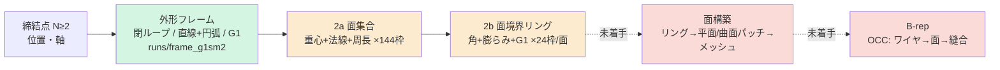

# 現在地とロードマップ(KB 22)

> 統合日 2026-09-05。以下は元文書を順に**そのまま**収録(見出し番号は元のまま。`KB 21.24` のような参照はこのファイル内を検索)。
> 収録元: `KB\22_status_roadmap.md`

---

<!-- 元文書: KB\22_status_roadmap.md -->

# 22. 現在地の整理とロードマップ(2026-09-03)

目標: **締結点のみ → 板金中立面のメッシュ(将来は B-rep)** を、形状ルールを書かずに学習で生成する。
本書は「どこまでが成果か / どこがボトルネックか / どう達成するか」の総括。数値は全て測定済み
(出典を KB 番号で示す)。見積りは実績ベースの概算で、±50% の幅を持つ。

---

## 1. パイプラインと到達段

緑 = 合格水準、橙 = 動くが未合格、赤 = 未着手。

---

## 2. 成果(測定済み)

| 段 | 到達点 | 根拠 |
|---|---|---|
| 締結点フレーム | N≥2 に一般化。生成 N=2〜5 通過 | KB 19 |
| 外形 | ビード族 val: 座面 100%、スパイク 0%、鋭角取りこぼし 0、余剰回転 1.1×(教師比)、近傍 2.1mm。**閉ループ・直線+円弧なので CAD にそのまま渡せる形** | KB 18.8 |
| 曲げの表現 | 曲率場・点群・トークン・チェーンを実測で棄却し、**面ループ表現**(面=生成単位、境界=閉リング)に到達。教師の自己整合 0%(全点が他リングか外形上に乗る) | KB 10, 20, 21 |
| 面の E2E | ビード族 val: 未整合 **9.2%**、余剰 2.8×、Chamfer 2.9mm、未被覆 33% | KB 21.17 |
| 評価系 | 3層合理性(製造可能性/簡潔性/機能)+教師不要の自己整合指標。Chamfer は参考値に降格 | KB 17, 21 |
| データ | 2807 部品・2 部品族(ビード 2300、フランジ 507)、v4.5 ワイヤーフレーム(face_ids)、メッシュ npz、面教師キャッシュ。フランジ用ホールドアウト 30 | KB 21.16 |
| 方法論 | 「性質は表現に埋め込む(4勝)」「導出できる条件は効かない(4敗)」「本数を先に決めない」「数値と絵の両方で判定」 | CLAUDE.md, KB 03, 05, 12 |

**要するに**: 外形は合格、曲げは「正しい表現に乗って動いている」段階、面とメッシュは未着手。

---

## 3. ボトルネック(重要度順)

### B1. 面境界リングの整合(面段の未合格の本体)

未整合 9%・余剰 2.8×・未被覆 33%。学習量は 2a(エポック)・2b(E2E は ep90 で頭打ち)とも
尽きており(KB 21.15)、部品数レバーも 2a に効くだけ(21.16)。残りは**表現の問題**:

- 現在は面ごとに独立にリングを出すため、**隣接面が共有する辺が 2 回別々に生成される**。
  自己整合(他リングに乗る)は損失に書いていないので、乗らない分が未整合として残る
- 未被覆 33% は「曲率のある場所に面が置かれていない」= 2a が面の**同定**を落としている
  (記述子=重心+法線+周長には隣接関係が無い)

これが**メッシュ化を止めている直接の障害**でもある。整合しないリングからは面を張れない。

### B2. 部品族をまたぐ汎化(汎用性)

フランジ族(未見)で外形が約半数**ビード族のモードに取り違え**、余剰 2.6×、近傍 4.0mm。
2a だけにフランジを学習させても E2E は改善しない(21.17)。**3 段すべてが全部品族を学習**
して初めて評価に乗る(今夜検証中)。構造的には「族ごとの特化」ではなく「見た族しか出せない」
状態で、族が増えるたびに全段を再学習する運用になる。

### B3. データの制約(検証不能領域)

穴なし・締結点は常に 2・折りは常に 2。締結点 1 個 / 3 個以上、折り 3 本以上、ビード 2 個以上は
**表現は対応済みだが 1 件も検証できない**。汎用性の主張はデータ側(PartMaker)の供給に律速される。

### B4. 面構築とメッシュ化が未着手

リングから面を張る器(平面: 多角形三角化、曲面: 曲げリング+G1 から線織面)が無い。
B-rep も同じ器の延長(OCC のワイヤ→面→縫合)。**教師リングからなら今すぐ作れる**(オラクル)
ので、B1 と独立に着手できる。

### B5. 情報限界

締結点だけでは外形を一意に決められない(設計上の決定を含む。教師床 14.9mm、KB 01)。
最終成果物は「1 つの正解」ではなく **K 候補 + 合理性ランク** であり、これは仕様として受け入れる。

### B6. 計算資源

ローカル GPU 6GB(2b@2677 部品で 10 分/epoch)、Kaggle 週 30h。2 段以上の再学習は一晩〜数日。

---

## 4. ロードマップ

| 段階 | 内容 | 合格条件(相対) | 見積り | 依存 |
|---|---|---|---|---|
| **P0** 汎化の初判定 | 3 段すべてを 2677 部品で学習し、ビード / フランジ両方で E2E | フランジ30 で未整合 ≤12%、外形余剰 ≤1.5× | 進行中(明朝) | — |
| **P1** 面段の表現改訂 | 共有辺を 1 回だけ生成する**辺ネットワーク表現**(辺集合+各辺の所属面 2 つ)、または 2a 記述子に隣接関係を入れる。KB 21.15 の候補 | ビード val で未整合 ≤3%、余剰 ≤1.5×、未被覆 ≤15% | 2〜3 週(設計 3 日、実装 1 週、Kaggle 学習×2 ラウンド) | P0 の結果で優先順を決める |
| **P2** 面構築器(メッシュ) | 教師リング → 平面三角化 + 曲げリングの線織面 → 水密メッシュ。座面・法線・厚みの検査。まず**オラクル(教師)で 100%** を出し、次に生成リングを通す | 教師で水密 100%、生成で座面 100% + 水密 ≥80% | 2 週(オラクル 1 週、生成対応 1 週)。**P1 と並行可** | face_ids 付き教師(済) |
| **P3** 部品族の拡張 | PartMaker から N≥3 締結点 / 穴 / 折り 3 本以上の族を受け取り、族ごとにホールドアウトを置いて全段再学習 | 各族で P1 の条件を満たす。既存族が劣化しない | 族ごとに 3〜4 日(取り込み 0.5 日 + 学習 1〜2 日 + 評価) | データ供給 |
| **P4** B-rep | P2 の器を OCC 化(ワイヤ→面→縫合→厚み付け)、STEP 出力、CATIA で開けることの確認 | STEP が CATIA で開き、座面・厚みが成立 | 3 週 | P2 |
| **P5** 候補提示 | K 候補 + 合理性ランクの UI/出力形式(B5 の受け入れ) | — | 1 週 | P2 |
| **P6** 言語統合 PoC | 言葉→形状(テキスト条件 + CFG)、形状→言葉(アダプタ + LM、測定で接地)。**KB 23**(ユーザー決定 2026-09-03) | 指示遵守を測定で確認、発言が測定と一致 | 言葉→形状 1 週、双方向 4 週 | P1 または P2 の合格 |

**総見積り**: 現在の 2 部品族で「締結点 → 合理性に合格するメッシュ」まで **P0+P1+P2 = 約 5〜6 週**。
B-rep まで **+3 週**。部品族の拡張はデータ供給に律速され、族ごとに +3〜4 日。

**最大のリスク**は P1。辺ネットワーク表現でも未整合が残る場合の退避案は、外形+曲げ線から面を
**構築的に**張るハイブリッド(KB 21.11 で一度棄却した案を、整合の取れた外形と曲げ線を前提に再検討)。
P2 を先にオラクルで作っておくと、この退避に必要な器がそのまま使える。

---

## 5. 次の一手(この順で)

1. **明朝 P0 の判定**(`runs/pipeline_2677b.log`)。合格なら「族を見せれば汎化する」、
   不合格なら外形段のモード取り違え(KB 18.7)を族横断で対策する必要がある
2. **P2 のオラクル実装を並行開始**(GPU 不要、CPU で進む)。教師リング → メッシュ → 水密検査
3. **P1 の設計文書**(KB 23 予定): 辺ネットワーク表現の容量・PE・教師の作り方・自己整合の定義
4. データ側へ **N≥3 締結点 / 穴あり族の依頼**(`docs/requests/`)

## 6. 方針の更新(2026-09-04 夜、ユーザー決定)

OCCT 5 族(occt11/12 = 2 点締結 2000、occt13/15/16 = **3 点締結** 1800、計 3800)で外形を学習し(vast 4070 Ti、1 ジョブ)、
結果で分岐する:

- **良好** → 面生成(2a/2b)に進む(P1/P2)
- **品質に問題** → **低データ数(5 部品型・計 3800 部品)でも精度が上がるモデルへのブラッシュアップ**を優先する。
  データを増やして誤魔化さない。候補: 条件付けの強化(設計入力: 折り本数など、KB 21.19)、逆走不能表現(KB 19.2)、
  座面を辺が横切れない拘束(KB 21.21 の occt12 タブ)、学習の安定化(プローブの振れ、KB 21.21)

合格の目安は相対値(教師床比): 座面 100%、余剰 ≤1.5×、近傍が同族 val で 2mm 級、鋭角取りこぼし ≤0.2。

**決定(2026-09-05 朝、ユーザー)**: ブラッシュアップは **1(学習予算の上界)・3(辺が座面を横切れない拘束)・5(EMA + 学習率減衰)** を行う。
2(角の明示表現)は汎用的とは言えず、4(設計入力の条件付け)は言語モデル統合に近いので**ペンディング**。
