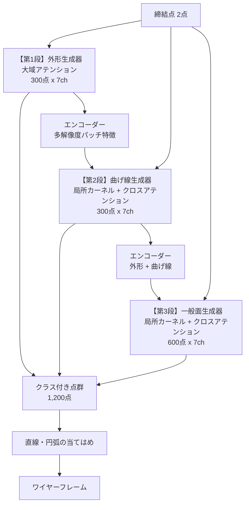

# 段階生成器の設計

> 統合日 2026-09-05。以下は元文書を順に**そのまま**収録(見出し番号は元のまま。`KB 21.24` のような参照はこのファイル内を検索)。
> 収録元: `staged_generator_design.md`, `mesh_route_design.md`


---

<!-- 元文書: staged_generator_design.md -->

# 段階生成器の設計 — 外形 → 曲げ線 → 一般面

Date: 2026-08-29
発案: ユーザー(クラス別の回路を直列につなぐ / エンコーダー・デコーダー構成)
前提となる測定: `research_log.md`、`progress_202608.md`

---

## 1. なぜこの構成か — 測定された3つの根拠

### 1.1 点数の配分が律速になっている

現在は512点を1つのモデルが生成し、そのうち外形は約77点(15%)しかない。
真の形状を N 点でどれだけ表現できるかを実測した(val 50部品、被覆=真の形状から
最寄りのサンプル点までの平均距離):

| N | 外形 | 曲げ線 | 一般面 |
|---|---|---|---|
| 38 | 1.32mm | 2.54mm | 7.39mm |
| **77(現行相当)** | **0.57mm** | **1.04mm** | **4.92mm** |
| 150 | 0.21mm | 0.32mm | 3.38mm |
| **300** | **0.04mm** | **0.08mm** | 2.28mm |
| 600 | — | 0.00mm | **1.47mm** |

**曲線は300点でサブミリに収まるが、一般面は600点でも1.47mmで収束していない。**
1つのモデルに全てを担わせると、この配分の違いを表現できない。

### 1.2 外形の断片化は点数不足が原因

真の外形を N 点でサンプリングし、鎖が途切れる箇所を数えた:

| N | 端点の割合 |
|---|---|
| **77(現行相当)** | **29.9%** |
| 150 | 17.3% |
| **300** | **10.0%** |

**77 → 300点で2.5分の1になる。** 残る10%は本物の隙間ではなく、指標が角を端点と
誤判定するもの(円 0%、正方形4点=角の数、L字8点=角の数で検証済み)。

現行の生成点群で外形の端点が教師の1.6倍だったのは、この点数不足の症状である。

### 1.3 1次元と2次元の混合を1つのフローに担わせている

外形と曲げ線は3次元空間に埋まった**曲線**(1次元多様体)、一般面は**曲面**(2次元)。
現在はこの混合を単一の flow matching で生成しており、本質的に難しい要求になっている。

---

## 2. 全体構成



**各段の出力はクラスが確定している。** 現在のように生成してから分類するのではなく、
**どの段が作ったかがそのままクラス**になる。分類器という段が消える。

---

## 3. 各段の設計

### 3.1 第1段 — 外形生成器

| 項目 | 内容 |
|---|---|
| 入力 | 締結点フレームの条件行のみ |
| 出力 | **300点 × 7ch**(xyz 3、接線 3、外れ値 1) |
| 構造 | **大域アテンション**(現行 PointFlow と同型、dim 256 / 8層) |
| 学習 | flow matching、CFG 0.1 脱落 |

**法線ではなく接線を持たせる。** 外形は曲線なので、その点で意味のある方向は曲線に
沿う接線である。法線は面の属性であって曲線の属性ではない。接線があれば後段の
直線・円弧の当てはめが直接行える。

**ここだけ空間カーネルを使わない。** 以前の測定で確定している通り、**外形は設計上の
決定であって曲率の痕跡を持たない** — 局所近傍からは原理的に読めない。局所カーネルの
長所(近傍しか見ないので記憶できない)は、大域的決定を要するこの段では短所になる。

### 3.2 第2段 — 曲げ線生成器

| 項目 | 内容 |
|---|---|
| 入力 | 締結点 + **第1段の外形300点**(エンコーダー経由) |
| 出力 | **300点 × 7ch**(xyz 3、接線 3、外れ値 1) |
| 構造 | 局所カーネル特徴 + **外形へのクロスアテンション** |
| 学習 | flow matching |

**外形を与えると曲げ線が読みやすくなることは実測済み** — 真の外形を64点確定すると
曲げ線の AUC が 0.735 → 0.849 に上がる。

### 3.3 第3段 — 一般面生成器

| 項目 | 内容 |
|---|---|
| 入力 | 締結点 + 外形 + 曲げ線 |
| 出力 | **600点以上 × 7ch**(xyz 3、法線 3、外れ値 1) |
| 構造 | 局所カーネル特徴 + クロスアテンション |
| 学習 | flow matching |

面は境界(外形)と折れ目(曲げ線)が決まれば充填問題になる。**点数はここが最も要る**
(600点で1.47mm、まだ収束していない)ので、精度が足りなければこの段だけ増やす。

### 3.4 エンコーダー(共有)

既にできている点群を多解像度で符号化する。**パッチ正規化(中心化・自分の点間隔で
正規化・法線/接線に整列)を近傍数を変えて3階層**で作る:

| 階層 | 近傍数 | 見ている範囲 |
|---|---|---|
| 細 | k=8 | 点の直近。局所の向き |
| 中 | k=32 | 現行の局所カーネルと同じ。曲率、端 |
| 粗 | k=128 | パネル規模の構造 |

**尺度と密度に不変**であることが本質的に効く。段ごとに点密度が変わる構成では、
絶対距離に依存する表現は使えない。この不変性は分類器で検証済み(教師点群 AUC 0.99)。

---

## 4. 学習の順序と、既知の失敗を踏まえた設計

### 4.1 順序

1. **第1段を単独で学習**(教師の外形300点を目標)
2. **第2段を学習。条件は教師の外形と第1段の出力を混ぜる**
3. **第3段を学習。条件は教師と前段出力を混ぜる**

### 4.2 前段の出力を混ぜる理由 — 自己条件付けの失敗との違い

自己条件付け(施策3)は3設定すべて失敗した。理由は**自分の点に新しい情報が無い**
こと。自分の出力を固定しても、既に自分が選んだ答えの繰り返しにすぎない。

**ここは違う。** 第2段が受け取るのは**第1段という別のモデルが、専用の容量と教師信号を
使って作った外形**である。情報が実際に増えている。実測でも外形の確定は曲げの精度を
上げる(0.735 → 0.849)。

ただし**露出バイアスは残る**。第2段を教師の外形だけで学習すると、それを全面的に
信頼するよう学び、第1段の不完全な外形を渡されたときに増幅する。**教師と前段出力を
混ぜる**のはそのため。混ぜる比率は 0 から始めて 0.5 程度まで上げる。

**教師信号は常に真の点群のままにする。** 条件だけを前段出力にする。両方を前段由来に
すると自分の誤りを学んで発散する。

---

## 5. リスクと対策 — すべて測定に紐づく

| # | リスク | 根拠 | 対策 |
|---|---|---|---|
| R1 | **外形が誤ると後段すべてが誤る** | 外形は最も決めにくいクラス(曲率の痕跡が無い) | 外れ値チャネルを全段に持たせる。第1段の失敗を後段が検出できるようにする |
| R2 | 露出バイアス | 施策3が3設定で失敗 | §4.2。ただし性質が違うことを確認済み |
| R3 | **点分布の不均一が残る** | 現行 0.52 対 教師 0.12。損失側の手当ては2度失敗 | 曲線は1次元なので等間隔化が容易。**面の段には残る可能性** — 第3段の評価で必ず測る |
| R4 | 計算量が増える | 3モデル | 1回あたりは300〜600点で現行512点と同程度。段は3回。**現行の2周ループ(2回)より重い** |
| R5 | 学習データ規模 | 訓練500部品 | 過去のオートエンコーダは24部品規模の診断で止まっていた。500での挙動は未知 |

---

## 6. 評価 — 各段の合格条件

**情報限界を踏まえた設計にする。** 締結条件が同じでも部品は14.9mm違うので、
**教師との距離を合格条件にしてはいけない**。物理的な妥当性と自己の質で見る。

| 段 | 主指標(合格条件) | 副指標 |
|---|---|---|
| **1** | **外形の端点割合 ≤ 12%**(角による下限。教師データ実測 10.0%) | 教師外形の被覆(参考値。改善は期待しない) |
| **2** | 曲げ線の被覆が現行(1.04mm相当)より改善<br>外形を条件に**入れた場合と外した場合で差が出ること** | 曲げ線が直線・円弧に当てはまるか |
| **3** | **面の被覆 ≤ 2.5mm**(現行 4.92mm相当)<br>点間隔のばらつきが教師と同等 | 可展性が教師と同等(0.074) |
| 全体 | 第1段の検査(可展性・パネル数・平面性)を維持 | ワイヤー Chamfer(参考値のみ) |

**第2段の「外形を入れた場合と外した場合で差が出ること」を明示的な合格条件に含める。**
差が出なければ直列構成の前提が崩れており、その時点で設計を見直す。

### 訂正(2026-08-29): 点間隔のばらつき 0.2 は曲線には適用できない

当初、第1段の合格条件に「点間隔のばらつき ≤ 0.2」を入れていたが、**これは誤り**。
0.12 という値は**面の点群**(4,096点から最遠点サンプリングした512点)で測ったもの。
面は2次元に広がるので均等に並ぶが、**外形は1次元の曲線**で、角や短い辺があるため
最遠点サンプリングでも間隔は一様にならない。

教師データ自身の実測値は **0.958**。モデルも epoch 30 で 0.958 と一致しており、
この指標では既に教師と同等。**別の対象の値を条件として持ち込んでいた。**

第1段の合格条件は**端点割合のみ**とする(教師 10.0%)。

---

## 7. 実装の段取りと判断点

| 段取り | 内容 | 判断点 |
|---|---|---|
| **A** | データ側: クラス別の教師点群を作る(外形300 / 曲げ300 / 面600) | 被覆が §1.1 の値と一致するか |
| **B** | 第1段を実装・学習 | 端点割合とばらつき。**ここで不合格なら全体を見直す** |
| **C** | エンコーダーを実装 | 多解像度特徴が段間で機能するか |
| **D** | 第2段を実装・学習 | **外形の有無で差が出るか** |
| **E** | 第3段を実装・学習 | 面の被覆とばらつき |
| **F** | 通しで評価、現行構成と比較 | 第1段の物理検査を維持しているか |

**B が最初の判断点。** 外形専用の300点生成器が閉じた鎖を出せなければ、この設計の
前提(点数が律速)が誤っていたことになる。§1.2 の測定は「真の外形を300点で表現
できる」ことしか示しておらず、「モデルが300点の外形を生成できる」ことは未知。

---

## 8. 現行構成の扱い

**破棄しない。** 現行(生成器 + 分類器 + 2周ループ)は動作しており、比較対象として
必要。段階生成器が F で現行を上回れなければ、現行に戻る。

現行から引き継ぐもの:

| 要素 | 引き継ぐ理由 |
|---|---|
| 締結点フレーム | リーク防止。必須 |
| アンカー凍結 | FIX 通過誤差 0.00mm |
| 外れ値チャネル | AUC 0.872→0.928、はみ出し 1.051→1.021 |
| CFG(scale 2.0) | 平均ヘッジの打ち消し |
| 24ステップ | 計算量0.5倍で劣化なし |
| パッチ正規化 | エンコーダーの基礎 |

引き継がないもの: 分類器(段がクラスを決めるので不要)、2周ループ(段が置き換える)、
密度均一化の損失(2度失敗)。


---

<!-- 元文書: mesh_route_design.md -->

# メッシュ経由生成(meshgen)— 設計と実測

Date: 2026-08-27
発案: ユーザー(「ワイヤーというインターフェースを直接生成するのを捨て、
弾性力学的なメッシュ構造を大まかに生成し、後処理でワイヤーを生成する」)
位置づけ: C / AB / B-core / G-AGF に続く第5路線。**表現そのものの変更**。

---

## 1. なぜ表現を変えるのか — 測定された失敗はすべて組合せ的だった

| 路線 | 失敗の中身 |
|---|---|
| C (純AR) | 直列化順序、STOP精度0.675、暴走でエッジ比 mean 2.42 |
| AB | 計画チャネルが不活性、潰れ(span 0.52) |
| B-core | **生成エッジの34%が存在しない頂点を参照して破棄** |
| G-AGF | アンカーを固定しても**参照するエッジが0本**で曲線に現れない |

いずれも「疎な離散構造(型・参照・個数)を生成する」ことに起因する。
**曲面サンプルには生成すべき連結情報が無い**ので、これらは定義上消滅し、
残るのは連続座標の生成 = 当プロジェクト唯一の成功パラダイム(flow matching)。

## 2. 着手前に測った4つの事実(すべて学習不要)

1. **教師データは存在した**: 全2,300部品に中立面STEP。0.25秒/件でメッシュ化、
   全件で453秒・欠損0・失敗0(126MB)
2. **メッシュからワイヤーは復元できる**: 三角形スープの幾何のみ(境界エッジ+
   二面角)で 外形0.57mm / 曲げ線1.88mm / 全体1.26mm。
   B-Repの面ループは使わない(生成メッシュには存在しないため)
3. **抽出はノイズに強い**: 全頂点に5mm誤差でも 2.41mm
4. **締結点は中立面上にある**(最近傍サンプルまで中央値0.78mm)。
   → アンカーは点として直接固定でき、**接続規則が不要**

## 3. 表現の選択 — 点群(固定テンプレート格子を採らない理由)

採用: **有向点群** N点 ×(位置3 + 法線3)、包絡で正規化。
不採用: 固定UV格子。「どの平面を展開するか」のパラメータ化が必要で、
90°曲がったフランジで素直な射影が退化する。点群なら置換不変な連続FMそのもので、
plan_g の points 段の機構がそのまま流用できる。

**点数の決定**(GTクラウドでの実測、ノイズ3mm):

| N | カバレッジ | 偽陽性 | 合計(=Chamfer相当) |
|---|---|---|---|
| 256 | 4.62 | 4.49 | **9.11mm** |
| 512 | 3.62 | 4.18 | 7.80mm |
| 1024 | 2.91 | 4.31 | 7.22mm |
| 2048 | 2.27 | 4.19 | 6.46mm |

偽陽性項(~4.2mm)がほぼ一定で、増点の効果は逓減する。
**抽出の床は 6〜9mm**。まず N=256(系列長260、ローカルで20秒/ep)で始める。

閾値掃引(k / gap / crease の36通り)では合計が 8.79〜9.31mm と平坦で、
**閾値は誤差の在り処ではない**と確認。既定値は境界点割合が現実的になる
(55%→27%)ものに更新した。

## 4. アーキテクチャ

```
条件(FIX2点+包絡, 4行) ─┐
                        ├→ Transformer(dim256×8層, AdaLN-Zero, 8.56M)
N点 ×(xyz, 法線) ノイズ ─┘   ・スロットに位置符号化なし = 置換等変
                             ・相対幾何 attention バイアス(RelBias)
                             ・CFG(条件ドロップ0.1、guidance 1.5)
                          → 速度場 v → Euler 48ステップ
                          → 点群 → mesh_extract → ワイヤー
```

アンカー: スロット0..n_fix-1 の**位置**を全ステップで真値に固定(法線は生成)。
損失からも除外。ワイヤー路線と違い incidence 規則は不要 — **点が曲面だから**。

## 5. 実測結果

### 5.1 初回(約20エポック、8部品)

| 指標 | 値 |
|---|---|
| 曲面 Chamfer | 31.02mm |
| **ワイヤー Chamfer** | **32.87mm** |
| 抽出コスト | **1.85mm** |
| FIX通過誤差 | **0.00mm(8/8部品)** |
| 外形カバレッジ | 16.62mm |
| 曲げ線カバレッジ | 18.15mm |

**20エポックで、200エポックかけた B-core(31.7mm)にほぼ並んだ。**

### 5.2 全路線比較(40部品・中央値・単発・`[::3]`)

| 手法 | wire Chamfer | 学習量 |
|---|---|---|
| 検索(学習なし) | **23.4mm** | — |
| meshgen | 32.9mm(8部品) | 約20ep |
| B-core | 31.7mm | 200ep |
| C (curve3) | 67.9mm | 150ep |
| AB v2 | 86.5mm | 110ep |

## 5.3 【重要】条件のリーク修正 — 締結点のみへ(2026-08-27)

ユーザーの確認により、**入力が締結点のみではなかった**ことが判明した。
`cond_features()` は包絡行を含み、さらに**全座標が包絡で正規化**されており、
検証の結果 `env_lo`/`env_hi` は**教師ワイヤーの bbox と完全一致**していた。
C・AB・B-core・G-AGF・初期 meshgen の**全系統が正解 bbox を座標系として
受け取っていた**(元の wtok 設計からの継承)。

**修正: 締結点だけから正準フレームを構成**(`meshgen.fastener_frame()`)

| 要素 | 定義 |
|---|---|
| 原点 | 締結点2点の中点 |
| 単位長 | 2点間距離(部品対角長÷この距離 = 1.21〜1.69 と狭い) |
| e1 | 2点を結ぶ方向 |
| e2 | 締結軸のうち e1 から遠い方の直交成分(全部品で17.5°以上、退化なし) |

回帰テスト `check_no_envelope_leak()`: 各締結点の mm 位置を保ったまま包絡を
1.7倍に広げて再量子化し、条件・アンカー・復号が不変であることを確認。
**実測ずれ 0.025mm(再量子化ノイズのみ)**、実リーク時は約100mm。

**予想外の結果: 検索ベースラインは 23.4mm → 16.1mm と改善した。**
包絡は軸並行 bbox しか揃えないが、締結点フレームは位置・向き・スケールを
締結点基準で揃えるため重ね合わせが本質的に良い。
**フレーム変更は修正であると同時に表現の改善**(剛体運動・スケール不変性)。

### 新条件でのスコアボード(締結点のみ)

| 手法 | Chamfer | FIX通過誤差 | 備考 |
|---|---|---|---|
| 検索(学習なし) | **16.1mm** | 15.9mm | 新しい目標値 |
| meshgen | 学習中 | **0.00mm** | 構成的保証 |
| C / B-core | 未測定 | — | 同じフレーム変更が必要 |

検索は他人の部品を置くだけなので**締結点を通らない**(15.9mm)。
実用上「締結点を通らない板金部品」は成立しないため、Chamfer だけでは
測れない優位が生成側にある。

**旧条件(包絡あり)の数値は全て参考値**: C 67.9 / B-core 31.7 / AB 86.5 /
meshgen 32.9(20ep) / 検索 23.4mm。

## 5.4 締結点が含意する円板をアンカーにする(ユーザー発案、2026-08-27)

「位置が必然的に確定しているメッシュは入力に入れてよい」という提案。
**実測で厳密に裏付けられた。**

### 平坦性の測定(120部品 × 2締結点 = 240箇所)

締結点中心・軸に垂直な理想円板と、実際の中立面の乖離:

| 半径 | 平面からの最大偏差 p95 | 法線の最大傾き p95 |
|---|---|---|
| 5mm | **0.00mm** | **0.0°** |
| **10mm** | **0.00mm** | **0.0°** |
| 15mm | 1.91mm | 49.1° |
| 20mm | 6.98mm | 65.9° |
| 30mm | 10.85mm | 90.0° |

**r=10mm までは全240箇所で完全一致。** 15mm で破綻するので 10mm が境界。

### なぜ漏洩でないか

**GT メッシュから半径内の点を読めば漏洩。締結点と軸から円板を合成すれば漏洩でない。**
ボルトは軸に垂直な平坦座面を要するので、これは締結点情報を描き出しただけ。
上の測定は合成版が実物と 0.00mm 一致することを示すので、両者は同一。
実装は合成版とし、**回帰テストで固定**した(部品の非締結点頂点を全破壊しても
円板が不変であることを検査)。

### 設計

締結点あたり8点(実データの自然密度 116/4096×256 ≒ 7.25 に一致)、
**位置と法線の両方**を全ステップ固定。自由点は円板外から採り密度を揃える。
抽出への影響なし(カバレッジ 3.84→3.83mm、偽陽性 2.57→2.55mm)。

### 効果(同一エポック比較)

| | 2点アンカー | **円板アンカー** |
|---|---|---|
| 曲面 @ep20 | 28.8mm | **19.4mm** |
| 曲面 @ep40 | 14.0mm | **12.8mm** |
| val @ep20 | 0.13072 | **0.12627** |

2点版は ep60 で 11.3mm に達した後 ep80 11.4 / ep100 11.2mm と頭打ちした。

## 5.5 guidance 強度の掃引(epoch 65、2点版)

| cfg | 曲面 | ワイヤー | 外形 | span比 |
|---|---|---|---|---|
| 1.0 | 11.92 | 14.26 | 10.43 | 0.92 |
| 1.5 | 11.02 | 13.20 | 9.51 | 0.96 |
| **2.0** | **10.93** | **12.15** | 9.13 | **0.99** |
| 3.0 | 11.59 | 13.78 | **8.76** | 1.03 |
| 4.0 | 12.43 | 15.04 | 8.88 | 1.06 |

**span比が単調増加(0.92→1.06)** し、「不確実性下で平均へ寄せて極値を縮める」
という診断を裏付けた。既定値を 2.0 に変更(再学習不要の改善)。

**この時点で検索を明確に上回った**(同一12部品): ワイヤー 12.15mm vs 検索 16.12mm、
FIX通過誤差 0.00mm vs 15.00mm。

## 5.6 「外形が弱い」という診断は誤りだった(ユーザーの質問により判明)

一時期「内部構造は捉えているが外形輪郭の広がりが甘い」と繰り返し報告したが、
**測定すると成立しない**。2点版 ep100 / 20部品 / cfg2.0:

| 測定 | 値 |
|---|---|
| GT外形点 → **任意の**生成点 | 8.03mm |
| GT外形点 → **境界と判定された**生成点 | 8.45mm |
| 生成点群の到達距離 ÷ GT曲面の到達距離 | **1.050** |

- **到達不足ではない**。むしろ 5% 外側まで届いている。span比 0.92〜0.96 で
  縮んでいたのは guidance 1.0〜1.5 の時の話で、2.0 に上げた時点で解消(span 0.99)。
  古い表現を引きずったのが誤り。
- **抽出器の問題でもない**。任意の点で 8.03、境界判定後で 8.45 と差は 0.4mm。
  検出器が完璧でも 8.03mm は残る。
- **外形が特に弱いわけでもない**。ep100 で外形 8.45 / 曲げ線 8.13 とほぼ同等
  (ep40 では 11.19 / 9.82 だったが学習で解消)。実態は「全体の広がりは正しいが
  輪郭の通る道筋が曲面誤差と同水準ずれている」。

**教訓**: 学習途中の切り分けを、状態が変わった後もそのまま繰り返さない。

## 5.7 プローブと評価のプロトコル不一致(3つ目の罠)

1. **`best.pt` を val 損失で選んでいた** → 円板版が epoch 30 で凍結され実力を
   3割過小評価。flow matching の損失は条件付き分散が下限で**最小値はノイズ**。
   → **曲面プローブ基準に変更**
2. **学習中プローブは各チェックポイントの `cfg_scale` を使う** → 2点版 1.5 /
   円板版 2.0 で測っており比較になっていなかった
3. **6部品プローブはノイズが大きい**(ep60 13.1 → ep80 11.0 と 2mm 振れる)。
   単一値で結論を出さない

## 5.8 円板アンカーの評価(20部品・両者 ep100・cfg2.0 に統一)

| モデル | 曲面 | ワイヤー | 外形 | 曲げ線 | FIX誤差 |
|---|---|---|---|---|---|
| **2点アンカー** | **10.00** | **14.60mm** | **8.45** | **8.13** | 0.00 |
| 円板アンカー | 12.63 | 15.61mm | 8.89 | 9.99 | 0.00 |
| 検索(学習なし) | — | 16.52mm | 6.96 | 9.05 | 16.12 |

円板版が勝つのは 20部品中 7部品のみ。**早期収束は明確に速い**(ep20 で
19.4 vs 28.8mm)が、**収束後の優位は示せていない**。16点を固定して損失から
除外することで学習信号の 6% を失うのが効いている可能性。ただし円板版は
ep120 で曲面 10.1mm とまだ下降中(2点版は ep80-100 で 11.2-11.4 と頭打ち)
なので、完走後に再判定する。

## 6. 到達可能性の見積もり(正直に)

ワイヤー誤差は「曲面誤差」と「抽出の床(6〜9mm)」で決まる。単純加算ではなく、
曲面誤差が支配的な間は抽出コストは小さく見える(実測1.85mm)。

- 曲面が 15mm → ワイヤー ~21〜24mm = **検索と同等**
- 曲面が 10mm → ワイヤー ~15〜18mm = **検索を明確に上回る**

したがって**曲面 Chamfer を 15mm 未満に持ち込めるかが勝負**。
現在20エポックで31mm。ここが改善しなければ N を増やす(抽出の床が下がる)か、
モデル規模・データ量で押す。

## 7. 手法上の修正(途中で見つけた欠陥)

- **val 損失が毎回ランダムな t とノイズで計算されていた**ため、エポック間で
  比較できず `best.pt` が実質くじ引きだった(val が 0.336→0.338→0.353→0.309 と
  振動)。乱数を固定して比較可能にした
- **損失の停滞は幾何の停滞を意味しない**(flow matching の損失は条件付き分散で
  下限が決まる)。学習中に曲面Chamferを直接測るプローブを追加した
- `tail` へのパイプで長時間ジョブを走らせると EOF まで出力が見えない。
  ログはファイルへ直接書く

## 8. 残る課題

1. 曲面 Chamfer の改善余地(規模/データ/点数)
2. 抽出ワイヤーは**点の集合**であり、CAD用の曲線当てはめ(直線・円弧)は未実装。
   下流でパラメトリック曲線が要るなら追加が必要
3. 板金の物理(可展性 = 曲がるが伸びない)は曲面表現で初めて書けるが未導入。
   最強の事前分布になりうる
